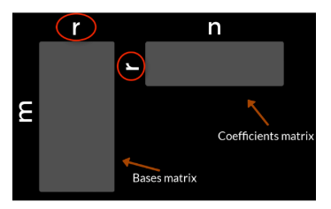
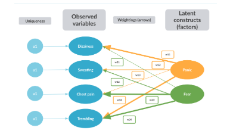

```{r setup4, include=FALSE}
# Set global knitr chunk options
knitr::opts_chunk$set(
  fig.align = "center",
  # fig.height = 4.5,
  error = FALSE,
  message = FALSE, 
  warning = FALSE, 
  collapse = TRUE,
  cache = TRUE
)
```


---

```{r setup, include=FALSE}
knitr::opts_chunk$set(echo = TRUE)
```

```{r}
pacman::p_load(tidyverse, caret)
```

# Principal component analysis (PCA)
## The curse of dimensionality

As the dimensionalities of the data frow, the feature space grows rapidy.
Sparaseness in the feature space of the training leads to  Big computation cost to handle high dimensional data. Moreover, the accuracy of the model drops and it gets much more difficult to interpret the data and reveal underlying patterns.

- Big computational cost
- Estimation accuracy
- Difficult interpretation

To resolve these issues, two solutions

- feature engineering: requires domain knowledge
- remove redundancy

We will introduce two reduction methods  

1) Principal component analysis
2) Non-negative matrix factorization (N-NMF)
3) Exploratory factor analysis (EFA)

## Exploring multivariate data

We've loaded a data frame called `cars` into your workspace. Go ahead and explore it! It includes features of a big range of brands of cars from 2004. In this exercise, you will explore the dataset and attempt to draw useful conclusions from the correlation matrix. Recall that correlation reveals feature resemblance and it will help us infer how cars are related to each other based on their features' values. To this end, you will discover how difficult it is to trace patterns based solely on the correlation structure.

```{r}
# Explore cars with summary()
summary(cars)


# Get the correlation matrix with cor()
correl <- cor(mtcars[,5:10], use = "complete.obs")

# Use ggcorrplot() to explore the correlation matrix
ggcorrplot::ggcorrplot(correl)

# Conduct hierarchical clustering on the correlation matrix
ggcorrplot_clustered <- ggcorrplot::ggcorrplot(correl, hc.order = TRUE, type = "lower")
ggcorrplot_clustered
```

## Getting PCA to work with FactoMineR

Cenceptually, the PCA 

1) removes correation
2) Extracts new dimenstions (principal components)
3) Reveals the true dimensionality of the data

Practically

1) Decompose the correlation matrix
2) Changes the coordinate system
3) Helps reduce the number of dimensions

Conceptually, there are five steps to perform the PCA

1) Pre-process steps 
- centering
- standardization

2) change the coordinate systems 
- rotation
- projection
The change of our coordinate systems to a new one with the principal components on its aexes. 

3) Explain variance
- reduction
We can reduce the data dimensionality based on te amount of variance explained in the new-extracted PCs.

The default function for PCA is `prcomp()`. The `prcomp()`'s output includes the most important PCA index, the loadings of the variables. 

The FactoMineR package we will use for this course, we will provide the most well-rounded collection of extraction/estimation methods for PCA.

It's `PCA()` function takes a dataset or correlation matrix and generates graphs and a series of informative indices for five kept dimensions by default.

The `PCA()` does not return the loadings but, the coordinates of the variables in the new data representation. The most important ones being the percentags of variance and comulative variance explained by the PCs.

```{r}
pacman::p_load(FactoMineR)
mtcars_pca <- PCA(mtcars)

mtcars_pca$eig %>% 
  as.tibble()%>% 
  ggplot(aes(eigenvalue, `percentage of variance`))+
  geom_col()
```

## PCA with FactoMineR

As you saw in the video, `FactoMineR` is a very useful package, rich in functionality, that implements a number of dimensionality reduction methods. Its function for doing PCA is `PCA()` - easy to remember! Recall that `PCA()`, by default, generates 2 graphs and extracts the first 5 PCs. You can use the `ncp` argument to manually set the number of dimensions to keep.

You can also use the `summary()` function to get a quick overview of the indices of the first three principal components. Moreover, for extracting summaries of some of the rows in a dataset, you can specify the nbelements argument. You'll have a chance to practice all of these and more in this exercise!

As in the previous lesson, the `cars` dataset is available in your workspace.

```{r}
# Run a PCA for the 10 non-binary numeric variables of cars.
pca_output_ten_v <- PCA(mtcars[,5:10], ncp = 4, graph = FALSE)

# Get the summary of the first 100 cars.
summary(pca_output_ten_v, nbelements = 100)

# Get the variance of the first 3 new dimensions.
pca_output_ten_v$eig[,2][1:3]

# Get the cumulative variance.
pca_output_ten_v$eig[,3][1:3]
```

### Exploring PCA()

`PCA()` provides great flexibility in its usage. You can choose to ignore some of the original variables or individuals in building a PCA model by supplying `PCA()` with the `ind.sup` argument for supplementary individuals and `quanti.sup` or `quali.sup` for quantitative and qualitative variables respectively. Supplementary individuals and variables are rows and variables of the original data ignored while building the model.

Your learning objectives in this exercise are:

- To conduct PCA considering parts of a dataset
- To inspect the most correlated variables with a specified principal component
- To find the contribution of variables in the designation of the first 5 principal components

Go for it! The cars dataset is available in your workspace.

```{r}
# Run a PCA with active and supplementary variables
pca_output_all <- PCA(mtcars, quanti.sup = 1:8, # quali.sup = 20:21, 
                      graph = FALSE)

# Get the most correlated variables
dimdesc(pca_output_all, axes = 1:2)

# Run a PCA on the first 100 car categories
pca_output_hundred <- PCA(mtcars, quanti.sup = 1:8, #quali.sup = 20:21, 
                          ind.sup = 10:nrow(cars), graph = FALSE)

# Trace variable contributions in pca_output_hundred 
pca_output_hundred$var$contrib
```

### PCA with ade4

Alright! Now that you've got some real hands-on experience with `FactoMineR`, let's have a look at ade4, a well-known and well-maintained R package with a large number of numerical methods for building and handling PCA models. `dudi.pca()` is the main function that implements PCA for `ade4` and by default, it is interactive: It lets the user insert the number of retained dimensions. For suppressing the interactive mode and inserting the number of axes within the `dudi.pca()` function, you need to set the scannf argument to FALSE and then use the nf argument for setting the number of axes to retain. So, let's put ade4 into practice and compare it with `FactoMineR`.

```{r eval=FALSE}
library(ade4)
# Run a PCA using the 10 non-binary numeric variables.
cars_pca <- dudi.pca(cars[,5:10], nf = 4, scannf = FALSE)

# Explore the summary of cars_pca.
summary(cars_pca)

# Explore the summary of pca_output_ten_v.
summary(pca_output_ten_v)
```

## Intepreting and visualizing PCA models

After creating your first PCA models, you need to be able to interpret them appropriately. Interpreting the resulting `PCA` numerical indices, the most prominent of which are square cosines and contributions, is not an easy task and can be facilitated with the visual aid of factor maps. 

As you saw in the previous video, `FactorMineR`'s `PCA()` function output two graphs by default, the individuals and the factors maps.

However, here we can use `factoextra`, a wrap-up package that provides ggplo2-like visualizations of PCA model objects.

### Plotting contributions of variables

`fviz_pca_var()` plots the contributions of the variables on the construction of the PCs. In this first chuck of code, we use the argument `col.var` to look for variables contribution. `gadient.cols` for creating the effect of gradience in the coloring of the contributions and `repe` to avoid point cluttering. 

```{r}
library(FactoMineR)
library(factoextra)
fviz_pca_var(mtcars_pca,
             col.var = "contrib",
             gradient.cols = c("#bb2e00", "#002bbb"),
             repel = TRUE)
```

For displaying the contribution of selected variables, the top 4 contirbution instead of `col.var`, we supply a list to the argument `select.var`. 

```{r}
factoextra::fviz_pca_var(
         mtcars_pca,
         select.var = list(contrib = 4),
         repel = TRUE)
```

### Barplotting the contributions of variables 

Lastly, `fviz_contrib()` produces barplots of individuals or variables contributions (as in the code chunk here). The red line corresponds to the expected percentage if the distribtution of contributions were uniform. 

```{r}
fviz_contrib(mtcars_pca,
             choice = "var",
             axes = 1,
             top = 5)
```

### Plotting cos2 for individuals

One other important index for interpreting PCA models is the squiared cosine, abbreviated as `cos2` in both `FactoMineR` and `factoextra`. This index reflects how accurate the representation of our variables or individuals on the PC plane are. 

For plotting the `cos2` of the individuals for `mtcars_pca`, we only need to tweak the `fviz_pca_ind()` function by either adjustin the `col_ind` argument for all individuals. 

```{r}
fviz_pca_ind(
  mtcars_pca,
  select.ind = list(cos2 = 0.8),
  gradient.cols = c("#bb2e00", "#002bbb"),
  repel = TRUE
)
```

### Barplotting cos2 for individuals

The function `fviz_cos2()` outputs a barplot with the quality of representation of either individuals or variables, depending on the value of the `choice` argument, on the different axes. 

```{r}
fviz_cos2(
  mtcars_pca,
  choice = "ind",
  axes = 1,
  top=10
)
#  hrbrthemes::theme_ipsum_ps()
```

### Biplots
```{r}
fviz_pca_biplot(mtcars_pca)
```

### Adding ellipsoids

`FactoMineR` is flexible enough to apply PCA on subsets of our data. 
In that case, some qualitative variables or individuals can be considered supplementary and not be exploited for the construction of the PCs.

This supplementary information can be used for adding ellipsoids on the biplot that further advances interpreation. Before using `fviz_pca_ind()`, we need to make sure that there is at least one qualitative variable and that it makes sense to use it as a supplementary variable. 

The variable `cyl`, the number of cylinders, is of numeric type, but has a few 
values and can be considered as qualitative variable, after being converted into a factor. Now, we can use `fviz_pca_ind()` with its arguments `addEllipses` for creating the actual ellipses and habillage for exploiting the levels of the supplementary variable `cyl` to assign colors to individuals.

```{r warning=FALSE}
mtcars <- mtcars %>% 
  mutate_at(vars(cyl), as.factor)  

fviz_pca_ind(mtcars_pca,
               label = "var",
               habillage = mtcars$cyl,
               addEllipses = TRUE)
  # +hrbrthemes::theme_ipsum_tw()

```

## Plotting cos2

You're getting the hang of PCA now! As Alex demonstrated in the video, an important index included in your PCA models is the squared cosine, abbreviated in `FactoMineR` and `factoextra` as cos2. This shows how accurate the representation of your variables or individuals on the PC plane is.

The `factoextra` package is excellent at handling PCA models built using FactoMineR. Here, you're going to explore the functionality of `factoextra`. You'll be using the `pca_output_all` object that you computed earlier and create plots based on its cos2. Visual aids are key to understanding cos2.

```{r}
# Create a factor map for the variables.
fviz_pca_var(pca_output_all, select.var = list(cos2 = 0.7), repel = TRUE)

# Modify the code to create a factor map for the individuals.
fviz_pca_ind(pca_output_all, select.ind = list(cos2 = 0.7), repel = TRUE)

# Create a barplot for the variables with the highest cos2 in the 2nd PC.
fviz_cos2(pca_output_all, choice = "var", axes = 1, top = 10)

# Create a barplot for the variables with the highest cos2 in the 2nd PC.
fviz_cos2(pca_output_all, choice = "var", axes = 2, top = 10)

```


### Plotting contributions

In this exercise, you will be asked to prepare a number of plots to help you get a better feeling of the variables' contributions on the extracted principal components. It is important to keep in mind that the contributions of the variables essentially signify their importance for the construction of a given principal component.

```{r}
# Create a factor map for the top 5 variables with the highest contributions.
fviz_pca_var(pca_output_all, select.var = list(contrib = 5), repel = TRUE)

# Create a factor map for the top 5 individuals with the highest contributions.
fviz_pca_ind(pca_output_all, select.ind = list(contrib = 5), repel = TRUE)

# Create a barplot for the variables with the highest contributions to the 1st PC.
fviz_contrib(pca_output_all, choice = "var", axes = 1, top = 5)

# Create a barplot for the variables with the highest contributions to the 2nd PC.
fviz_contrib(pca_output_all, choice = "var", axes = 2, top = 5)

```

### Biplots and their ellipsoids

As mentioned in the video, biplots are graphs that provide a compact way of summarizing the relationships between individuals, variables, and also between variables and individuals within the same plot. Moreover, ellipsoids can be added on top of a biplot and offer a much better overview of the biplot based on the groupings of variables and individuals.

In this exercise, your job is to create biplots and ellipsoids using `factoextra`'s graphical utilities.

```{r}
# Create a biplot with no labels for all individuals with the geom argument.
fviz_pca_biplot(pca_output_all)

# Create ellipsoids for wheeltype columns respectively.
mtcars <- mtcars %>% 
  mutate_at(vars(wt), as.factor)
fviz_pca_ind(pca_output_all, habillage = mtcars$wt, addEllipses = TRUE)

# Create the biplot with ellipsoids
fviz_pca_biplot(pca_output_all, habillage = mtcars$wt, addEllipses = TRUE, alpha.var= "cos2")
```

# Advanced PCA & Non-negative matrix factorization(NNMG)

Here, you'll build on your knowledge of PCA by tackling more advanced applications, such as dealing with missing data. You'll also become familiar with another essential dimensionality reduction technique called Non-negative matrix factorization (NNMF) and how to use it in R.

## Determining the rigght numberof PCs

Stopping rules 

1. The scree test

```{r}
mtcars <- mtcars %>% 
  mutate_at(vars(cyl, wt), as.double)
mtcars_pca <- PCA(mtcars)
fviz_screeplot(mtcars_pca, ncp=5)
```

The first step is construct the screeplot. The screeplot is a barplot of the proportion of explained variance as a function of principal components, which can be made easily by `fviz_screeplot()` function. 

The second step is to observe the screeplot and make a decision based on the point where the slope of the downward curve levels off.

In our case the elbow point is at the third PC, so we can safely ignore the PCs to the right of the elbow point. Therefore, the scree test recoomends retaining the first 2 PCs. 

2. The Kaiser-Guttman rule

Skipping the math details related to eigenvalues, the important thing to note is that PCs with eigenvalue less than one explains less of the total variance than a single original variable does on average. 

Therefore, by choosing PCs with eigenvalues greater than one, we maintain those PCs that epress more of the variability than each of the original variables.

You can examine the eigenvalues by any of three following options; 

- `summary()` function (enhanced for handling `PCA` objects) such as `mtcars_pca`. or the `factor_extra`'s `get_eigenvalue()`. All of the options result in vectors with the eigenvalues in descending order. 

Here the Kaiser-Guttman rule points us to keep only the first two `PC`s, in accordance with the scree test.

```{r}
# Keep the PCs with eigen value > 1 

summary(mtcars_pca)
mtcars_pca$eig

get_eigenvalue(mtcars_pca) %>% 
  as.tibble()
```


3. Parallel analysis 

Parallel analysis is generally considered a superior method to the previous ones, since it contrasts the variability expressed in the original dataset with that obtained from randomly-generated datasets with the `PCA` model's indices so that they are affected by the variability induced by the sample error of randomly generated datasets with the same characteristics. 

Now PCs with adjusted eigenvalues greater than one indeed express more of the variability than each of the original variables. In R, the `paran()` function of the `paran` package implements parallel analysis. 

Among the numerious interesting arguments of the `paran()` function, the `graph` argument provides additional graphical output, similar to screeplot that clearly indicates the number of `PC`s to retain 2 in our case.

```{r eval=FALSE}
library(paran)

mtcars_pca_ret <- paran(mtcars_pca,
                        graph=TRUE)
```

## The Kaiser-Guttman rule and the Scree test

In the video, you saw the three most common methods that people utilize to decide the number of principal components to retain:

1. Kaiser-Guttman rule
2. Scree test (constructing the screeplot)
3. Parallel Analysis

Your task now is to apply all of them on the R's built-in `airquality` dataset!

```{r}
# Conduct a PCA on the airquality dataset
pca_air <- PCA(airquality)

# Apply the Kaiser-Guttman rule
summary(pca_air, ncp = 4)

# Perform the screeplot test
fviz_screeplot(pca_air, ncp = 5)
```

## Parallel Analysis with paran()

In this exercise, you will use two R functions for conducting parallel analysis for PCA:

- `paran()` of the paran package and
- `fa.parallel()` of the psych package.

`fa.parallel()` has one advantage over the `paran()` function; it allows you to use more of your data while building the correlation matrix. On the other hand, `paran()` does not handle missing data and you should first exclude missing values before passing the data to the function. For checking out the suggested number of PCs to retain, fa.parallel()'s output object includes the attribute ncomp.

The built-in R dataset airquality, on which you will be doing your parallel analyses, describes daily air quality measurements in New York from May to September 1973 and includes missing values.

```{r}
# Subset the complete rows of airquality.
airquality_complete <- airquality[complete.cases(airquality), ]

# Conduct a parallel analysis with paran().
library(paran)
air_paran <- paran(airquality_complete, seed = 1)

# Check out air_paran's suggested number of PCs to retain.
air_paran

# Conduct a parallel analysis with fa.parallel().
pacman::p_load(psych)
air_fa_parallel <- fa.parallel(airquality)

# Check out air_fa_parallel's suggested number of PCs to retain.
air_fa_parallel
```

### Performing PCA on datasets with missing values 

missing values - this can be bias problem for PCA
`sleep` of `VIM` package - 38 missing data. 

1) Skipping rows with misisng values: risky option that leads to unreliable PCA models
2) Often costly to ignore collected data.

From simplistic to sophisticated methods

- Using mean of the variance that includes NA values 
The reason is that the variable's mean may influence the performance of predictive modeling especially when the dataset has lots of missing values, since it distorts the real distribution of the variables.

This is the default method in the `PCA()` function of `FactorMineR`

- Impute the missing values based on a linear regression model 
Fit the linear model on the most correlated variable for each of the variables that contain NAs and impute the missing values based on the regression model.

- **Estimating the missing values with PCA**

  - Use `missMDA` and then `FactorMineR`
  - Use `pcaMethods`

1) Iterative PCA algorithm

The first method uses an iterative `PCA` algorithm implemented in the `missMDA `package for estimating and imputing the missing values.

- Initial step: use the mean for imputing the missing values
- Conduct PCA on the resulting complete dataset
This generates a new data representation compiled by newly extracted PCs.

- Use the coordinates of the newly-extracted PCs (initially taking the mean) for updating them.
The coordinates of the points on those PCs are used for updating the missing values estimation. 

- Repeat the previous two steps until convergence is achieved

Conduct PCa on the complete dataset with PCA. 

`estim_ncpPCA()` is necessary for determining the optimum number of PCs. 

```{r}
library(missMDA)
nPCs <- missMDA::estim_ncpPCA(VIM::sleep)
nPCs$ncp
```

which is 3 in our case and is and is stored in the `ncp` property of the `nPCs` object, in order to use it for the implementation of the iterative `PCA` algorithm. 

Next, `imputePCA()` implements the algorithm and outputs the dataset without `NA`s. Finally, you may apply the `PCA()` function of `FactoRMineR` or any other function for performing `PCA` on the completed dataset.

```{r}
completed_sleep <- 
  imputePCA(VIM::sleep, ncp = nPCs$ncp,
            scale = TRUE)

```

In a similar spirit, the function `pca()` of `pcaMethods`, a package developed and updated by the open source software project `Bioconductor`, which provides several algorithms for conducting `PCA` and estimating missing values in a single step. 

1) Uses regression methods for approximation of the correlation matrix
2) Compiles PCA models
3) it projects the new points back into the original space

Let's take a look at how `pca()` works internally. Unlike the previous method, it uses various regression methods for approximating the correlation matrix of the original data. 

It then builds its `PCA` models based on the completed correlation matrix and extracts a lower dimensional space. 

Finally, it estimates the missing values by projecting the new coordinates of this lower-dimensional space back into the original space. 

```{r eval=FALSE}
# probabilistic approximation method

# if (!requireNamespace("BiocManager", quietly=TRUE))
#     install.packages("BiocManager")
BiocManager::install("pcaMethods")

library(pcaMethods)

sleep_pca_methods <- pcaMethods::pca(sleep,
                                     nPcs = 2,
                                     method = "ppca",
                                     center = TRUE)

imp_air_pcamethods <- pcaMethods::completeObs(sleep_pca_methods)

```

## Estimating missing values with missMDA

As you saw in the video, `R` there are two packages for conducting `PCA` to a dataset with missing values; `pcaMethods` and `missMDA`. In this exercise, you are going to use the first method introduced in the video: combining `missMDA` and `FactoMineR`. Both packages are loaded for you in this exercise.

The two-step procedure includes a) the estimation of missing values by using an iterative `PCA` algorithm in the first place and b) number of dimensions for `PCA` by cross-validation.

In this exercise, you will be working with the `ozone` dataset of the `missMDA` package that includes 112 daily measurements of meteorological variables (wind speed, temperature, rainfall, etc.) and ozone concentration recorded in Rennes (France) during the summer 2001. 


```{r}
# Check out the number of cells with missing values.
sum(is.na(ozone[,1:11]))

# Estimate the optimal number of dimensions for imputation.
ozone_ncp <- missMDA::estim_ncpPCA(ozone[,1:11]) 
ozone_ncp

# Do the actual data imputation. 
complete_ozone <- imputePCA(ozone[,1:11], ncp = ozone_ncp$ncp, scale = TRUE)
```

## N-NMF and topic detection with `nmf()`

The interpreation of the extracted `PC`s is not always a straightfoward task, especially for datasets with frequencies (e.g., words/terms in texts or pixel intensities of images). 

This is because PCA is a method for datasets whose columns are numeric normally distributed variables, thus allowing for negative values in the derived PCs. 

Difficult to interpret PCA models with count/frequency data
- Normality assumption
- PCs include negative values

But then what would a particular word or document or image has anegative value on those derived dimensions mean? 

Non-Negative matrix factorization, on the other hand, leads to a more intuitive interpretation of the latent data structure due to its non-negativity constraint; namely it applies only to datasets with positive entries, such as the ones just mentioned and brings about parts-based representation. 

- N-NMF algorithms are able to extract clear and distinct insights from the data. 
- What is matrix factorization[https://qiita.com/ysekky/items/c81ff24da0390a74fc6c]
- What is NMF[https://qiita.com/sumita_v09/items/d22850f41257d07c45ea]

It's main target is to decompose/factorize the original data matrix into 2 smaller ones, where typically `r` is much smaller than `m` and `n`, the dimensions of the initial matrix, so that both observations and variables are expressed in terms of a few `r` components. 

```{r}

```

These smaller matrices are randomly initialized, and then updated via some iterative update rules. The target is to approximate the initial data matrix as closely as possible by using various objective functions.

Objective functions quality of the approximation of the original matrix as the algorithm proceeds. There are two main objective functions for performing `N-NMF`: the first minimizes

- the square of the Euclidien distance
- Kullback-KEibler divergence

The algorithms that implement these objective functions stop after a fixed number of iterations, or according to some stopping criterion related to the objective function. 

In order for you to comprehend N-NMF's practical value, I will focus on two of its applications in the rest of this chapter: topic modeling and image compression.

### Text mining and dimensionality reduction

Topic modeling
- unsupervised approach to automatically identify topics 
- Topics are cluster of words that frequently occur together, therefore assumed to exhibit semantic similarity. 

Dimensionality reduction is critical for topic modeling, since it handles the sparseness of frequency data (not all words occu in all texts); and the lower number of dimensions imposed by N-NMF leads to mapping co-occuring words to the same dimension, and therefore to topic detection. 

BBC's dataests live in: http://mlg.ucd.ie/datasets/bbc.html

The `nmf` package implements `N-NMF` in R. In this code chunk, I will load the `bbc_tdm` object, a Term-Document-Matrix with the frequencies of all words in 100 texts selected randomly from the bbc dataset, which covers business, politics, entertainment, sports and technology. 

Here, I will set the second argument of the function `nmf()` to 5 in order to decompose the initial dataset and get the 5 most important topics. 

In order to retrive the basis and coefficient matrices, you can use the `basis()` and `coef()` functions respectively. Summing up, `W` has terms in rows and topics in th columns and `H` topics in the rows and documents in the columns. 

```{r eval=FALSE}
library(NMF)
bbc_res <- nmf(bbo_tdm, 5)

W <- basis(bbc_res)
H <- coef(bbc_res)
```

The only thing that remains is to interpret the extracted topics. Using some `dplyr` functions in order to arrange the terms in descending order based on the first topic. 

```{r}
library(dplyr)

colnames(W) <- c("topic1",
                 "topic2",
                 "topic3",
                 "topic4",
                 "topic5")

W %>% 
  rownames_to_column("words") %>% 
  arrange(., desc(topic1)) %>% 
  column_to_rownames("words")
```

## Topic detection with N-NMF:Part 1

In the next two exercises, you will be detecting topics in corpora. `corpus_tdm` is loaded into your workspace, a term-document matrix of 50 texts sampled from the BBCsport dataset, classified in 5 different subject areas (i.e. athletics, cricket, football, rugby, tennis). For getting a verbose output of the `nmf()` output with details about the runtime and the number of iterations required while processing, you simply need to set its .options argument to "v".

In this exercise, your goal is to extract the basis matrix, W. The columns of W can be easily interpreted as the conditional probabilities of the terms in a corpus given a topic, if we normalize their column values to sum to 1. We have prepared and loaded the function `normal()` for you that achieves just that.

```{r}
# Get a 5-rank approximation of corpus_tdm.
bbc_res <- nmf(corpus_tdm, 5, .options = 'v')

# Get the term-topic matrix W.
W <- basis(bbc_res)

# Check out the dimensions of W.
dim(W)

# Normalize W.
normal_W <- apply(W, 2, normal)
```

## Topic detection with N-NMF: Part II

The next step in topic detection is to extract the topic-text, or coefficient matrix, H. The columns of `H` can be interpreted as the conditional probabilities of the topics given a corpus of texts, respectively, if we normalize their column values to sum to 1. We have prepared and loaded for you that achieves just that. bbc_res, the 5-rank approximation of corpus_tdm created in the last exercise, is at your disposal as well as the function `normal()` for achieving the normalization.

```{r}
# Get the topic-text matrix H.
H <- coef(bbc_res)

# Check out the dimensions of H.
dim(H)

# Normalize H.
normal_H <- apply(H, 2, normal)
```

## Trying different N-NMF algorithms

The main differences between the algorithms are in the computation of the objective function and the optimization techniques used for the update steps. By default, the NMF package runs brunet, but you can choose any of the 11 algorithms implemented within the NMF package, and put it as the third argument of `nmf()`. For browsing through the available N-NMF algorithms implemented in NMF you can simply use the nmfAlgorithm() function. Using `nmfAlgorithm()` without arguments, a vector with all the 11 algorithms, optimized in C++, is returned. For extracting the older versions of some of these algorithms, written in R, you can use the version argument and set it to R in order to get the older versions. Let's put all this into practice!

```{r}
# Explore the nmf's algorithms.
alg <- nmfAlgorithm()

# Choose the algorithms implemented in R.
R_alg <- nmfAlgorithm(version = "R")

# Get a 5-rank approximation of corpus_tdm.
bbc_double_opt <- nmf(corpus_tdm, 5, R_alg, .options = 'v')
```

# Exploratory Factor Analysis (EFA)

RFA is based on the assumption that the variance and covariance of our observed variables are in part due to some unobserved/latent factors.

- Variance/covariance are only partially explained by factors
- Factors are labels for the underlying constructs
- Causal relationship between factors and observed variables

If a group of variables move or co-vary in the same direction, then these variables most probably belong ot to the same factor. 

EFA's taget is to identify these factors that label real, underlying traits/constructs. Therefore, these constructs are not observed directly and the only evidence about their existence is the manifest variables. 

Essentially EFA assumes that these latent constructs give rise to the observed variables and explain or cause their behavior. To give a concrete example, let's take a dataset with different medical indices for the following four variables: dizziness, sweating, chest pain and trembling. 

Applying ETA's model with two latent factors, panic and fear, implies that the observed vairables are symptoms of or caused by these factors. 

Moreover, the degree of influence of the factors on each of the observed variables is expressed by meas of weightings (the arrows). 

For instance, in our model dizziness seems to load more on panic than on while trembling loads more on fear. Chest pain seems to relate more to fear while sweating does not lead on any of the two factors. 

The model, however acceps the possibility that the factors 
collectively cannot explain everything about the observed variables. 

There is also a part of the variance explained either due to factors unique to each variable and/or measurement error. 

```{r}

```


EFA models, are much more realistic than PCA models, since they don't attemp to explain the whole variance the whole variance in the dataset. 

Let's analyze the variance of a single variable - trembling. Trembling is now split into two parts: the communality that expresses the proportion of variance explained by the factors and the unique variance, specific to trembling. 

Performing EFA involves a number of steps along the way. 

1. Check for data factorability
2. Extract factors
3. Choose the right number of factors to retain
4. Rotate factors 
5. Interpret the resutls

The first step is to make sure that our dataset is factorable to see if it is worthwhile to do EFA. The next step is to extract the factors and choose the extraction method to use. Since we aim to reduce the dimensionality of the data, we need to decide on the right  number of factors to retain. Right after that it is customary to rotate the extracted factors in order to reflect the factor structure in a better way and make it easier to interpret. 

EFA is meant to be an exploratory method, and the process cited above is meant to be a loose guide rather than a rigid procedure. If the results cannot be interpreted easily, you should return to previous steps, and explore alternative choices in order to arrive at the most interpretable outcome. 

```{r}
library(psych)
data("bfi")
bfi %>% as.tibble()
```

## The Humor Styles Questionnaire datasets

Two data frames - `hsq` and `hsq_correl` - have been loaded. hsq contains the Humor Styles Questionnaire [`HSQ`] dataset, which includes responses from 1071 participants on 32 questions. We also calculated the polychoric correlation for you using the `mixedCor()` function of the psych package:

```{r}
hsq_correl <- mixedCor(humor_styles, c=NULL, p=1:32)
```

Polychoric correlation is the correlation between ordinal variables. Above, we indicated that columns 1 to 32 are ordinal by specifying `p`, and that there are no numeric variables by setting `c` to NULL.

Another way of calculating polychoric correlations is by using the `hetcor()` function of the polycor package. It stores the correlation matrix in the correlations attribute of the calculated object.

```{r}
# Check out the dimensionality of hsq.
dim(hsq)

# Explore the correlation object hsq_correl.
library(magrittr)
hsq_correl %>% str()

# Getting the correlation matrix of the dataset.
hsq_polychoric <- hsq_correl$rho

# Explore the correlation structure of the dataset.
hsq_polychoric %>% ggcorrplot()
```

## Checking for data factorability

It is time to follow this roadmap by first checking for data factorability. Checking factorabiility means to answer the following question: Is there sufficient correlation among the observed variables in the first place to allow for dimensionality reduction? 

There are two tests forchecking the factorability of a dataset: 

- The Bartlett sphericity test
- The Kaiser-Meyer-Olkin (KMO) test

### THe Bartlett Sphericity Test

For the Bartlett sphericity test, checking for factorability means we need to compare two metrices, the correlation matrix with the identity matrix of the same dimensionality. 

The identity matrix has ones in its diagonal and zeros in the rest of the matrix positions and represents the absense of correlation between the variables in the dataset. 

Undertaking this test translates to performing a hypothesis test, whereby the null hypothesis states that there is no significant difference between the metrices and the alternative hypothesis states the opposites, thus we would have strong evidence that there are underlying factors. 

- H0: There is no significant difference between the correlation matrix and the identity matrix of the same dimensionality. 
- H1: There is significant difference between them and thus we have strong evidence that there are underlying factors. 

```{r}
# Bartlett Sphericity Test
library(polycor)

# A subset of the BFI test
bfi_s <- bfi[1:200, 1:25]

# calculate the correlation
bfi_hetcor <- hetcor(bfi_s)

# Retrieve the correlation matrix
bfi_c <- bfi_hetcor$correlations

# apply the Bartlett test
# The Bartlett test compares the correlation matrix with the identity matrix. The higher the divergence from the identity matrix, the less portable there is a difference between them only due to random chance. 
bfi_factorability <- cortest.bartlett(bfi_c)

# Since the p-value attribute of the bfi_factorability object has value less than 0.05, Bartlett's test signifies that the observed correlation matrix diverges from the identity matrix (there is enough correlation to perform the reduction)
bfi_factorability
```

However, this test tends to always be statistically significnat when the sample size increases. Some reference suggest a rule of thumb, according to which one can safely use this test only if the ratio between the number of instances and the number of observed variables `n:p` is lower than 5. 

### Kaiser-Meyer-Olkin Test for sampling adequacy

This test is also called the measure of sampling adequacy, and second factorability test in R by `KMO()` function of the `psych` package. 

This test compares the partial correlation matrix with the usual parwise correlation matrix. The KMO statistic is a summary of how small the pairwise correlations are, relative to the original (zero-order) correlations. 

The partial correlation for each pair of variables is comprised of the correlation between those variables after partialing out the influence of all of the other variables in the factor analysis.

```{r}
library(psych)
KMO(bfi_c)
```

If the variables shared common factor(s), then the partial correlations should be small and the KMO should be close to 1. If the difference is big, the common variance is considerable among the variables. 

The closer the value to 1 is the more effective and relaiable the reduction will be. KMO index should at least be in the 60s to be considered mediocre, although people wrongly accept KMO in the 50s as acceptable.

## How Factorable is our Dataset?

As mentioned in the video, before reducing dimensions with EFA, we first need to make sure that our dataset is _factorable_. In other words, the first step in performing `EFA` is to check whether it is even worth doing it. This dilemma is captured by the following question: Is there sufficient correlation among the observed variables of our dataset to allow for dimensionality reduction in the first place?

hsq_polychoric, calculated with the `hetcor()` function of the `polycor` package, is the correlation matrix of the Humor Styles Questionnaire [HSQ] dataset that you will be working throughout this and part of the next chapter.

In this exercise, your mission is to decide whether `HSQ` is factorable enough to allow an `EFA`.

```{r}
# Apply the Bartlett test on the correlation matrix.
cortest.bartlett(hsq_polychoric)

# Check the KMO index.
KMO(hsq_polychoric)
```

## Extraction methods 

One of EFA's most important ojectives is to extract factors used to provide estimates for the factor loadings.

There is a `factanal()` function for conducting `EFA`, but we will use the `fa()` function from the `psych` package. This provides a richer inventory of EFA extraction and rotation methods. 

`fa()` handles EFA steps in one call, namely it extracts a number of factors that the user sets and rotates these extracted factors. 

- minres:minimum residual [default] (slightly modified methods: ols, wls, gls)
- mle: maximum likelihood estimation (MLE)
- paf:principal axes factor (PAF) extraction
- minchi: minimum sample size weighted chi square
- minrank: minimum rank
- alpha: alpha factoring

For all these steps, it provides default options. While demonstrating it, through, I will focus on each step we are currently in. `fa()` offers several extraction metods. 

`minres` - the default iterative method, minimizes the residual matrix, by residual matrix, I mean the matrix with the differences between the correlation matrix implied by the extracted factor and the original correlation matrix. 

There is a clear preference among EFA practitioners for the `MLE` and the `PAF` methods. 

`MLE` is the prefered choice when data exhibit multivariate normality and `PAF` when that assumption is violated. 

A common principle among all extraction methods is to first extract the factor that accounts for the most variance and then successively factors that account for the remaining variance. 

After loading `GPArotation` package, which is required for the activation of `psych`'s full functionality, the next step is to use the `fa()` function. 

It's first argument requires either a raw dataset or a correlation matrix `bfi_c` referred in the previous video; the `nfactors` arguments set the number of factors that you want your EFA model to retain.


```{r}
library(psych)
library(GPArotation)

# EFA with 3 factors
f_bfi_minres <- fa(bfi_c, nfactors = 3, rotate = "none")

# sorted communality
f_bfi_minres_common <- sort(f_bfi_minres$communality, decreasing = TRUE)

# create a dataframe for an improved overview
data.frame(f_bfi_minres_common)

```

However, for now, I will specify 3 factors although you are not officially equiped with formal criteria yet to be base this decision for `EFA`.

The output object describes different aspects of the EFA model, most of which assist the interpretation. However, for now, the most interesting parts are the estimated communality and uniqueness vectors achieved with the `minres` method. 

The communality for each variable is the percentage of variance explained by the retained factors, 3 in our case. I have sorted them in a decreasing order and the resulting vector indicates that the self report item N1, get angry easily, is the most well represnted item within a three factor EFA model. 

The variance of item 2, "avoid difficult reading material", can be explained only by 7% from the three factor model. The mirror image of the communalities sorted vector is the respective uniqueness vector.

```{r}
f_bfi_minres$communalities
```

```{r}
#sorted uniqueness
f_bfi_minres_unique <- sort(f_bfi_minres$uniquenesses, decreasing = TRUE)

# create a dataframe for an improved overview
data.frame(f_bfi_minres_unique)
```

The `mle` method extracts factors that optimally reproduce the population correlation matrix. 

```{r}
# MLE factor extraction
f_bfi_mle <- fa(bfi_c, nfactors = 3, fm = "mle", rotate = "none")

# Sorted communality of the f_bfi_mle
f_bfi_mle_common <- sort(f_bfi_mle$communality, decreasing = TRUE)

# create a dataframe for an improved overview
data.frame(f_bfi_mle_common)
```

This method is based on the assumption that all variables are normally distributed. Different numbers of factors are employed iterative in order to maximize the likelihood of reproducing the population correlation matrix.

As with the `f bfi minres`, I can create a sorted vector with the variables communalities.Comparing the two vectors, they are identified for the first 3 variables, with some considerable differences in the percentages of variance coverage by the 3 factor model, though.

The next three variables are in different order and these can be considered valuable in the intepretation phase.

## EFA with MinRes and MLE

It is about time to turn our attention to creating our first EFA model object. As mentioned in the video, the default extraction method in the `fa()` function of the `psych` package is minimum residuals, minres. Recall that `fa()` takes as its main argument either a dataframe or a correlation matrix. In this exercise, your job is to manipulate the values of the function's default arguments and inspect the EFA model object's attributes to find out which of the variables load well on the 4 factors that we choose to extract below.

For conducting EFA, you will use the correlation matrix hsq_polychoric, loaded in your workspace and calculated with the `mixedCor() `function on our initial dataset, hsq.

```{r}
# EFA with 4 factors.
f_hsq <- fa(hsq_polychoric, nfactors = 4)

# Inspect the resulting EFA object.
str(f_hsq)

# Use maximum likelihood for extracting factors.
fa(hsq_polychoric, nfactors = 4, fm = "mle")
```

## EFA with Principal Axis Factoring

Let's look at another popular extraction method, `Principal Axis Factoring (PAF)`. `PAF`'s main idea is that communality has a central role in extracting factors, since it can be interpreted as a measure of an item’s relation to all other items. An iterative approach is adopted. Initially, an estimate of the common variance is given in which the communalities are less than 1. After replacing the main diagonal of the correlation matrix (which usually consists of ones) with these estimates of the communalities, the new correlation matrix is updated and further replacements are repeated based on the new communalities until a number of iterations is reached or the communalities converge to a point that there is too little difference between two consecutive communalities.

```{r}
# Use PAF on hsq_polychoric.
hsq_correl_pa <- fa(hsq_polychoric, nfactors = 4, fm = "pa") 

# Sort the communalities of hsq_correl_pa.
sort(hsq_correl_pa$communality, decreasing = TRUE) 

# Sort the uniqueness of hsq_correl_pa.
sort(hsq_correl_pa$uniqueness, decreasing = TRUE)
```

## Choosing the right number of factors

Factorability tests do not indicate the approprite number of factors to retain. As KAiser once said, also in psych's manual, arriving at the right number of factors is not an easy task.

Although it depends on our domain knowledge and intuition to achieve the most economical, still interpretable factor structue, there are a number of formal methods that help us to decide. 

- Kaiser-Guttman criterion
- the Scree test
- Parallel test
- Very simple-structured critrion (VSS)
- Minimum Average Partial (MAP) criterion 

The last two are advanced and implemented by the `vss()` function and are well-documented in `psych`'s cran pages. 

Three of the five above-mentioned tests are performed in a compact graphical representation by the `fa()`. 

`parallel()` accepts either the original data frame or the correlation matrix. In case you enter directly a correlation matrix, such as the `bfi_c` object that we created in the previous video, `fa`. 

```{r}
# Based on the minres method
fa.parallel(bfi_c, n.obs = 200,
            fa = "fa", fm = "minres")
```

- `parallel()` requires that you use the `n`.
- `obs` argument that determines the number of observations in the original matrix. 
- The `fm` argument sets the extraction method, `minres` and 
- The `fa` argumnt ensures that only factors of an `EFA` and not principal components show up in the screenplot. 

Zooming it on the graph, KAiser's line at 1 eigenvalue suggests that 4 factors should be retained, while parallel analysis recommends 5, since the 5th factor is above the randomlly generated data. 

The scree test has the most ambiguous results; namely the decline in the slope can be traced in two spots; from the second to the third and from the fifth to the sixth, leaving the decision to the practitioner. 

If we base our decision on `mle`, and keep the number of observations, steady to 200, the results are identical for both tests, as you can see. 

```{r}
# Based on the "mle" method
fa.parallel(bfi_c, n.obs = 200,
            fa = "fa", fm = "mle")
```

Last two steps 
1. Rotate the extracted factors
2. Interpret the results of te newly-extracted representation

## Determining the number of factors

Let's briefly visit the three tests for deciding on the number of factors to retain.

In this exercise, you will use the correlation matrix, `hsq_polychoric`, computed based on the initial dataset, hsq, that has 1069 observations.

```{r}
# Check out the scree test and the Kaiser-Guttman criterion.
scree(hsq_polychoric)

# Use parallel analysis for estimation with the minres extraction method

fa.parallel(hsq_polychoric, n.obs = 1069, fm = "minres", fa = "fa")

# Use parallel analysis for estimation with the mle extraction method.
fa.parallel(hsq_polychoric, n.obs = 1069, fm = "mle", fa = "fa")
```

# Advanced EFA

## Interpretation of EFA and factor rotation

In the EFA process, we have learnt the following steps.

1. Check for data factorability
2. Extract factors
3. Choose the right number of factors to retain 

In this chapter, we will follow up the remaining two steps. 

4. Rotate factors
5. Intepret the results

Since the interpretation for unrotated EFA models can be very difficult, especially when they include extracted factors with many large loadings, factor rotation is a standard further step in EFA, being particualrly helpful in social and behavioural sciences. 

The target is to reduce subjectivity in the interpretation as much as possible. As long as factor structure is not altered, meaning that the location of any variable in the factor space is not changed, thel location of the axes is irrelevant. 

Rotation methods fall into two categories: orthogonal and oblique. 

- Orthogonal methods
  - Quartimax
  - Equimax
  - Varimax
- Oblique methods 
  - Direct Oblimin
  - Promax 
  
ORthogonal methods produce uncorrelated factors whose axes maintain a 90 degrees angle between them, while oblique methods allow for slightly correlated factors. 

The rule of thumb for choosing between the different rotation methods is that if the target factors are initially assumed to be correlated, then the oblique rotation should be employed. 

On the other hand, if the factors are not related in any meaningful way, then an orthogonal rotation should be used. Commonly, it is recommended to use orthogonal rotation, since uncorrelated factors are easier to interpret. 

Before that, let's have a better look at the EFA model that I have been working on throughout this chapter's video based on a subset of the `bfi` dataset.

5 putable factors behind the 25 self report items:
- Agreeableness (A1, A2, A3, A4, A5)
- Conscientiousness (C1, C2, C3, C4, C5)
- Extraversion (E1, E2, E3, E4, E5)
- Neuroticism (N1, N2, N3, N4, N5)
- Openess (O1, O2, O3, O4, O5)

`f_bfi_minres` model to get an overview of our extracted unrotated factors. Although there are three clusters of variables, there is still considerable scatter that does not help us figure out what these two factors actually represent.

Before plotting, it is necessary to determine the rotation choice in the `rotate` argument of the `fa()` function. 

```{r}
# Applying varimax 

f_bfi_varimax <- fa(bfi_c,
                    fm = "minres",
                    nfactors = 5,
                    rotate = "varimax")

f_bfi_varimax
```

Let's build a new, rotated 5 facor EFA model with varimax rotation method. Without getting into technical details without getting into techincal details, varimax strives to maximize the variance within a factor such that larger loadings are increased and smaller ones are minimized. 

The plot of the rotated factors is much cleaner, as the origin is in the middle of the points and represents the items more reliably, since their new coordinates bring items of the same conceptually pre-defined factors closer; except for the extraversion ones. 

The first factor seems to characterize extraversion, since its 
positive and negative edges are identified with those of the 5 E-items. E1 and E2 are definitely the opposite of E3, E4 and E5. 

- E1: "Don't talk a lot"
- E2: "Find it difficult to approach others"
- E3: "Know how to captivate people"
- E4: "Make friends easily"
- E5: "Take charge"

## Rotating the extracted factors 

According to Martin et al. (2003), the `HSQ` represents a comprehensive self-report measure of everyday functions of humor. Following Martin et al.’s (2003) theory, humor is directly related to psychosocial well-being, i.e. humor is a social phenomenon and the different humor styles reflect different social traits of the individual, such as social control, status maintenance and group cohesion.

Let's apply some rotation methods offered by the `fa()` function, in order to check whether Martin et al's (2003) theory cofirms the observations in the `HSQ` dataset. For completing the exercise, the EFA model object f_hsq and the correlation matrix hsq_polychoric are at your disposal. Recall that `hsq_polychoric`, was calculated with the `mixedCor()` function on our initial dataset, `hsq`.

```{r}
# Check the default rotation method.
f_hsq$rotation

# Try Promax with 4 factors.
f_hsq_promax <- fa(hsq_polychoric, nfactors = 4, rotate = "promax")

# Now, try Varimax, again with 4 factors.
f_hsq_varimax <- fa(hsq_polychoric, nfactors = 4, rotate = "varimax")
```

## Interpretation of EFA and path diagrams 

Recall that `EFA` is an exploratory method that involves a number of decisions in various stages of the process. 

- Agreeableness (A1, A2, A3, A4, A5)
- Conscientiousness (C1, C2, C3, C4, C5)
- Extraversion (E1, E2, E3, E4, E5)
- Neuroticism (N1, N2, N3, N4, N5)
- Openess (O1, O2, O3, O4, O5)

A plausible interpretation of the data that leads to discovery of real, latent constructs is what drives decisions on the extraction method, the number of factors to retain and the rotation method. 

The path diagram is a good interpretation tool, implemented with the `fa`. `diagram()` function of the `psych` package, which demonstrates the relationship between the hidden factors and the observed variables. 

A path diagram includes the highest-loading items for each factor and determines whether our EFA model represents an intepretable solution. 

```{r}
library(psych)

# creating the path diagram
fa.diagram(f_bfi_varimax)
```

The square boxes are the observed variables, and the ovals are the unobserved factors. The straight arrows are the loadings, the correlation between the factor and the observed variables. 

Moreover, the red arrows indicate negative correlation of the item to the extracted factor. Curved arrows between the factors indicate correlations between factors. If no curved arrow is present, as in our case, the correlation between the factors is not great. 

Our five-factor `EFA` model `f_bfi_varimax` seems to reflect the expected factor structure nicely, since items of the same pre-defined putative factor on the left are almost identified with a factor on te right; except for the N4 item that correlates negatively to Extraversion along with the other "E" items; something that calls for further processing and interpretation. 

N4 stands for "Often feel blue" and although it is classified as one of the descriptive aspects of Neuroticism, the data suggest that it does not fit properly to the presupposed factor. 

On the contrary, it is slightly negatively related to Extraversion and this is not a surprise given the meaning of the expression. All other items are aligned with their initial classification to one of the five pre-defined, conceptually classified factors. 

The path diagrams plots only the largest loadings for each item. Each item, though, loads on each of the factors to a greater or lesser extent. 

```{r}
principal(f_bfi_varimax$loadings, cut = 0)
```

By using the print function and setting its `cut` argument to 0, you can access the full factor loading matrix of the EFA model provided by the loadings properly of the `f_bfi_varimax` object. 

The reason you need to set the `cut` argument to 0 is that, by default, values under 0. 1 are not shown in the output. These values represent the correlations between the variables in the row and the 5 factors, MR1 to MR5, in the columns. 

In the lower end of the output, you can also find the cumulative percentage of variance covered by the 5 factor `EFA` model, namely 46.7%. 

## Interpreting humor tyles and visual aid

The study of factor loadings offered by our EFA models is a valuable tool for interpreting the various humor styles. Even more helpful is the guidance of the path diagram. In this exercise, you are asked to create, retrieve both f_hsq's factor loadings matrix and path diagram. Recall that the loaded f_hsq object represents an EFA model of 4 factors. Below are the questionnaire items as they were initially grouped, based on the type of humour that they encode:

affiliative: 'Q1', 'Q5', 'Q9', 'Q13', 'Q17', 'Q21', 'Q25', 'Q29' self-enhancing: 'Q2', 'Q6', 'Q10', 'Q14', 'Q18', 'Q22', 'Q26', 'Q30' aggressive: 'Q3', 'Q7', 'Q11', 'Q15', 'Q19', 'Q23', 'Q27', 'Q31' self-defeating: 'Q4', 'Q8', 'Q12', 'Q16', 'Q20', 'Q24', 'Q28', 'Q32'

```{r}

```


