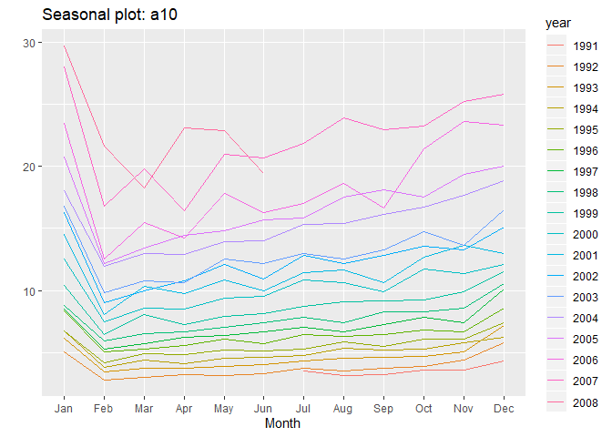
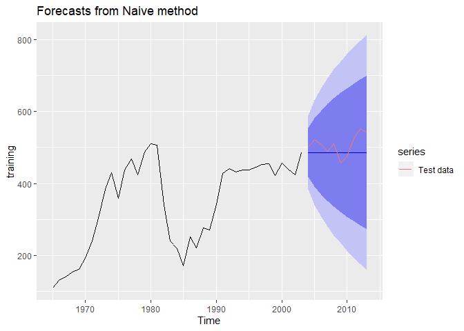
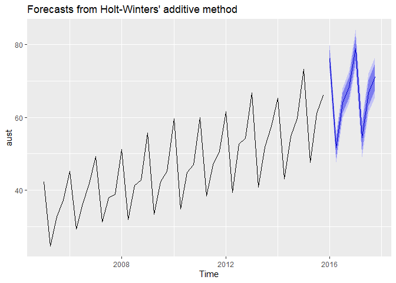

    pacman::p_load(tidyverse, forecast, magrittr, tidymodels, readxl)

    # library(tidyverse)
    # library(forecast)
    # library(magrittr)
    # library(tidymodels)
    # library(readxl)

Exploring and visualizing time series
=====================================

Creating time series objects in R
---------------------------------

A time series can be thought of as a vector or matrix of numbers along
with some information about what times those numbers were recorded. This
information is stored in a ts object in R. In most exercises, you will
use time series that are part of existing packages. However, if you want
to work with your own data, you need to know how to create a `ts` object
in R.

Let’s look at an example `usnim_2002` below, containing net interest
margins for US banks for the year 2002 (source: FFIEC).

The function `ts()` takes in three arguments:

-   `data` is set to everything in usnim\_2002 except for the date
    column; it isn’t needed since the ts object will store time
    information separately.
-   `start` is set to the form c(year, period) to indicate the time of
    the first observation. Here, January corresponds with period 1;
    likewise, a start date in April would refer to 2, July to 3, and
    October to 4. Thus, period corresponds to the quarter of the year.
-   `frequency` is set to 4 because the data are quarterly. In this
    exercise, you will read in some time series data from an xlsx file
    using read\_excel(), a function from the readxl package, and store
    the data as a ts object. Both the xlsx file and package have been
    loaded into your workspace.

<!-- -->

    # Read the data from Excel into R
    mydata <- read_excel("data/exercise1.xlsx")

    # Look at the first few lines of mydata
    head(mydata)
    ## # A tibble: 6 x 4
    ##   ...1   Sales AdBudget   GDP
    ##   <chr>  <dbl>    <dbl> <dbl>
    ## 1 Mar-81 1020.     659.  252.
    ## 2 Jun-81  889.     589   291.
    ## 3 Sep-81  795      512.  291.
    ## 4 Dec-81 1004.     614.  292.
    ## 5 Mar-82 1058.     647.  279.
    ## 6 Jun-82  944.     602   254

    # Create a ts object called myts
    myts <- ts(mydata[, 2:4], start = c(1981, 1), frequency = 4)

Time series plots
-----------------

The first step in any data analysis task is to plot the data. Graphs
enable you to visualize many features of the data, including patterns,
unusual observations, changes over time, and relationships between
variables. Just as the type of data determines which forecasting method
to use, it also determines which graphs are appropriate.

You can use the `autoplot()` function to produce a time plot of the data
with or without facets, or panels that display different subsets of
data:

    autoplot(usnim_2002, facets = FALSe)

The above method is one of the many taught in this course that accepts
boolean arguments. Both T and TRUE mean “true”, and F and FALSE mean
“false”, however, T and F can be overwritten in your code. Therefore,
you should only rely on TRUE and FALSE to set your indicators for the
remainder of the course.

You will use two more functions in this exercise, `which.max()` and
`frequency()`. `which.max()` can be used to identify the smallest index
of the maximum value

    x <- c(4, 5, 5)
    which.max(x)
    ## [1] 2
    # [1] 2

To find the number of observations per unit time, use frequency().
Recall the usnim\_2002 data from the previous exercise:

    > frequency(usnim_2002)
    [1] 4

Because this course involves the use of the `forecast` and `ggplot2`
packages, they have been loaded into your workspace for you, as well as
`myts` from the previous exercise and the following three series
(available in the package `forecast`):

-   `gold` containing gold prices in US dollars
-   `woolyrnq` containing information on the production of woollen yarn
    in Australia
-   `gas` containing Australian gas production

<!-- -->

    # Plot the data with facetting
    autoplot(myts, facets = TRUE)

    # Plot the data without facetting
    autoplot(myts, facets = FALSE)

    # Plot the three series
    autoplot(gold)

    autoplot(woolyrnq)

    autoplot(gas)

    # Find the outlier in the gold series
    goldoutlier <- which.max(gold)

    # Look at the seasonal frequencies of the three series
    frequency(gold)
    ## [1] 1
    frequency(woolyrnq)
    ## [1] 4
    frequency(gas)
    ## [1] 12

Seasonal plots
--------------

Along with time plots, there are other useful ways of plotting data to
emphasize seasonal patterns and show changes in these patterns over
time.

A seasonal plot is similar to a time plot except that the data are
plotted against the individual “seasons” in which the data were
observed. You can create one using the `ggseasonplot()` function the
same way you do with `autoplot()`.

An interesting variant of a season plot uses polar coordinates, where
the time axis is circular rather than horizontal; to make one, simply
add a polar argument and set it to `TRUE`.A subseries plot comprises
mini time plots for each season. Here, the mean for each season is shown
as a blue horizontal line.One way of splitting a time series is by using
the `window()` function, which extracts a subset from the object x
observed between the times start and end.

    # Load the fpp2 package
    library(fpp2)

    # Create plots of the a10 data
    autoplot(a10)

    ggseasonplot(a10)

    # Produce a polar coordinate season plot for the a10 data
    ggseasonplot(a10, polar = TRUE)

    # Restrict the ausbeer data to start in 1992
    beer <- window(ausbeer, start = 1992)

    # Make plots of the beer data
    autoplot(beer)

    ggsubseriesplot(beer)

Trends, seasonality, and cyclicity
----------------------------------

Time series patterns

-   Trend: A pattern exists involving a long-term increase or decrease
    in the data
-   Seasonal: A periodic pattern exists due to the calender
-   Cyclic: A pattern exists where the data exhibits rises and falls
    that are not of fixed period (usually at least 2 years)

Autocorrelation of non-seasonal time series
-------------------------------------------

Another way to look at time series data is to plot each observation
against another observation that occurred some time previously by using
`gglagplot()`. For example, you could plot *y**t* against
*y**t* − 1. This is called a lag plot because you are
plotting the time series against lags of itself.

The correlations associated with the lag plots form what is called the
autocorrelation function (ACF). The `ggAcf()` function produces ACF
plots.

In this exercise, you will work with the pre-loaded oil data (available
in the package fpp2), which contains the annual oil production in Saudi
Arabia from 1965-2013 (measured in millions of tons).

    # Create an autoplot of the oil data
    autoplot(oil)

    # Create a lag plot of the oil data
    oil %>% diff %>% autoplot()

    gglagplot(oil)

    # Create an ACF plot of the oil data
    ggAcf(oil)

Autocorrelation of seasonal and cyclic time series
--------------------------------------------------

When data are either seasonal or cyclic, the ACF will peak around the
seasonal lags or at the average cycle length.

You will investigate this phenomenon by plotting the annual sunspot
series (which follows the solar cycle of approximately 10-11 years) in
`sunspot.year` and the daily traffic to the Hyndsight blog (which
follows a 7-day weekly pattern) in `hyndsight`. Both objects have been
loaded into your workspace.

    # Plots of annual sunspot numbers
    autoplot(sunspot.year)

    ggAcf(sunspot.year)

    # Save the lag corresponding to maximum autocorrelation
    maxlag_sunspot <- 1

    # Plot the traffic on the Hyndsight blog
    autoplot(hyndsight)

    ggAcf(hyndsight)

    # Save the lag corresponding to maximum autocorrelation
    maxlag_hyndsight <- 7

White noise
-----------

just random, independent and identically distributted observations, they
are called “illed data”. This means the data does not have trend,
seasonality nor cyclicity, not even autocorrelations, which is called
“white noise”.

Because the is simply rando, we expect correlations between observations
to be close to zero. The dashed blue lines are there to show us how
large as spike has to be before we can consider it significantly
different from zero.

The blue dashed lines are based on the sampling distribution for
autocorrelation assuming the data are white noise. Any spike within the
blue lines should be ignored.

Spikes outside the lines might indicate the data is probably not white
noise.

    autoplot(pigs/1000)+
      xlab("Year")+
      ylab("thousand")

    ggAcf(pigs)+
      ggtitle("ACF of monthly pigs slaughted in Victoria")

    forecast::checkresiduals(pigs)

The Ljung-Box test considers the ifrst `h` autocorrelation values
together, not individually. A significant test (small p-value) indicates
the data are probably not white noise.

    Box.test(pigs, lag=24, fitdf=0, type="Lj")
    ## 
    ##  Box-Ljung test
    ## 
    ## data:  pigs
    ## X-squared = 634.15, df = 24, p-value < 2.2e-16

Stock prices and white noise
----------------------------

Stock prices and white noise As you learned in the video, white noise is
a term that describes purely random data. You can conduct a Ljung-Box
test using the function below to confirm the randomness of a series; a
p-value greater than 0.05 suggests that the data are not significantly
different from white noise.

    > Box.test(pigs, lag = 24, fitdf = 0, type = "Ljung")

There is a well-known result in economics called the “Efficient Market
Hypothesis” that states that asset prices reflect all available
information. A consequence of this is that the daily changes in stock
prices should behave like white noise (ignoring dividends, interest
rates and transaction costs). The consequence for forecasters is that
the best forecast of the future price is the current price.

You can test this hypothesis by looking at the goog series, which
contains the closing stock price for Google over 1000 trading days
ending on February 13, 2017. This data has been loaded into your
workspace.

    # Plot the original series
    autoplot(goog)

    # Plot the differenced series
    goog %>% diff() %>% autoplot()

    # ACF of the differenced series
    ggAcf(diff(goog))

    # Ljung-Box test of the differenced series
    Box.test(diff(goog), lag = 10, type = "Ljung")
    ## 
    ##  Box-Ljung test
    ## 
    ## data:  diff(goog)
    ## X-squared = 13.123, df = 10, p-value = 0.2169

Benchmark methods and forecast accuracy
=======================================

[Forecasts and potential futures](https://campus.datacamp.com/courses/forecasting-using-r/benchmark-methods-and-forecast-accuracy?ex=1)
---------------------------------------------------------------------------------------------------------------------------------------

Naive Forecasting Methods
-------------------------

As you learned in the video, a forecast is the mean or median of
simulated futures of a time series.

The very simplest forecasting method is to use the most recent
observation; this is called a naive forecast and can be implemented in a
namesake function. This is the best that can be done for many time
series including most stock price data, and even if it is not a good
forecasting method, it provides a useful benchmark for other forecasting
methods.

For seasonal data, a related idea is to use the corresponding season
from the last year of data. For example, if you want to forecast the
sales volume for next March, you would use the sales volume from the
previous March. This is implemented in the `snaive()` function, meaning,
seasonal naive.

For both forecasting methods, you can set the second argument h, which
specifies the number of values you want to forecast; as shown in the
code below, they have different default values. The resulting output is
an object of class forecast. This is the core class of objects in the
forecast package, and there are many functions for dealing with them
including `summary()` and `autoplot()`.

    naive(y, h = 10)
    snaive(y, h = 2 * frequency(x))

You will try these two functions on the goog series and ausbeer series,
respectively. These are available to use in your workspace.

    # Use naive() to forecast the goog series
    fcgoog <- naive(goog, 20)

    # Plot and summarize the forecasts
    autoplot(fcgoog)

    summary(fcgoog)
    ## 
    ## Forecast method: Naive method
    ## 
    ## Model Information:
    ## Call: naive(y = goog, h = 20) 
    ## 
    ## Residual sd: 8.7285 
    ## 
    ## Error measures:
    ##                     ME     RMSE      MAE        MPE      MAPE MASE
    ## Training set 0.4212612 8.734286 5.829407 0.06253998 0.9741428    1
    ##                    ACF1
    ## Training set 0.03871446
    ## 
    ## Forecasts:
    ##      Point Forecast    Lo 80    Hi 80    Lo 95    Hi 95
    ## 1001         813.67 802.4765 824.8634 796.5511 830.7889
    ## 1002         813.67 797.8401 829.4999 789.4602 837.8797
    ## 1003         813.67 794.2824 833.0576 784.0192 843.3208
    ## 1004         813.67 791.2831 836.0569 779.4322 847.9078
    ## 1005         813.67 788.6407 838.6993 775.3910 851.9490
    ## 1006         813.67 786.2518 841.0882 771.7374 855.6025
    ## 1007         813.67 784.0549 843.2850 768.3777 858.9623
    ## 1008         813.67 782.0102 845.3298 765.2505 862.0895
    ## 1009         813.67 780.0897 847.2503 762.3133 865.0266
    ## 1010         813.67 778.2732 849.0667 759.5353 867.8047
    ## 1011         813.67 776.5456 850.7944 756.8931 870.4469
    ## 1012         813.67 774.8948 852.4452 754.3684 872.9715
    ## 1013         813.67 773.3115 854.0285 751.9470 875.3930
    ## 1014         813.67 771.7880 855.5520 749.6170 877.7230
    ## 1015         813.67 770.3180 857.0220 747.3688 879.9711
    ## 1016         813.67 768.8962 858.4437 745.1944 882.1455
    ## 1017         813.67 767.5183 859.8217 743.0870 884.2530
    ## 1018         813.67 766.1802 861.1597 741.0407 886.2993
    ## 1019         813.67 764.8789 862.4610 739.0505 888.2895
    ## 1020         813.67 763.6114 863.7286 737.1120 890.2280

    # Use snaive() to forecast the ausbeer series
    fcbeer <- snaive(ausbeer, h = 16)

    # Plot and summarize the forecasts
    autoplot(fcbeer)

    summary(fcbeer)
    ## 
    ## Forecast method: Seasonal naive method
    ## 
    ## Model Information:
    ## Call: snaive(y = ausbeer, h = 16) 
    ## 
    ## Residual sd: 19.1207 
    ## 
    ## Error measures:
    ##                    ME     RMSE      MAE      MPE    MAPE MASE       ACF1
    ## Training set 3.098131 19.32591 15.50935 0.838741 3.69567    1 0.01093868
    ## 
    ## Forecasts:
    ##         Point Forecast    Lo 80    Hi 80    Lo 95    Hi 95
    ## 2010 Q3            419 394.2329 443.7671 381.1219 456.8781
    ## 2010 Q4            488 463.2329 512.7671 450.1219 525.8781
    ## 2011 Q1            414 389.2329 438.7671 376.1219 451.8781
    ## 2011 Q2            374 349.2329 398.7671 336.1219 411.8781
    ## 2011 Q3            419 383.9740 454.0260 365.4323 472.5677
    ## 2011 Q4            488 452.9740 523.0260 434.4323 541.5677
    ## 2012 Q1            414 378.9740 449.0260 360.4323 467.5677
    ## 2012 Q2            374 338.9740 409.0260 320.4323 427.5677
    ## 2012 Q3            419 376.1020 461.8980 353.3932 484.6068
    ## 2012 Q4            488 445.1020 530.8980 422.3932 553.6068
    ## 2013 Q1            414 371.1020 456.8980 348.3932 479.6068
    ## 2013 Q2            374 331.1020 416.8980 308.3932 439.6068
    ## 2013 Q3            419 369.4657 468.5343 343.2438 494.7562
    ## 2013 Q4            488 438.4657 537.5343 412.2438 563.7562
    ## 2014 Q1            414 364.4657 463.5343 338.2438 489.7562
    ## 2014 Q2            374 324.4657 423.5343 298.2438 449.7562

Fitted values and residuals
---------------------------

A fitted value is the forecast of an observation using all previous
observations.

-   They are one-step forecast
-   Often not treue forecasts since prameters are estimated on all data

A residual is the difference between an obsefvation and its fitted value

    fc <- naive(oil)
    autoplot(oil, series = "Data")+
      xlab("Year")+
      autolayer(fitted(fc), series = "Fitted")+
      ggtitle("Oil Production in Saudi Arabia")

Remember that the `naive()` method simply uses the most recent
observation as the forecast for future observations.

The residuals are the vertical distances between these two lines.

    autoplot(residuals(fc))

**Essential assumptions** - residuals should be uncorrelated - Reisduals
should have mean zero

**Useful properties** - They should have constant variance - They should
be normally distributed

White noise would satisfy assumptions 1,2 and 3. S o we are asking
whether the reisuals are distributed normally. There is avery convinent
function available to check these assumptions - `checkresiduals()`.

Make a habit of always checking your residuals before proceeding to
produce the forecasts.

    checkresiduals(fc)

    ## 
    ##  Ljung-Box test
    ## 
    ## data:  Residuals from Naive method
    ## Q* = 12.59, df = 10, p-value = 0.2475
    ## 
    ## Model df: 0.   Total lags used: 10

Checking the time series residuals
----------------------------------

When applying a forecasting method, it is important to always check that
the residuals are well-behaved (i.e., no outliers or patterns) and
resemble white noise. The prediction intervals are computed assuming
that the residuals are also normally distributed. You can use the
`checkresiduals()` function to verify these characteristics; it will
give the results of a Ljung-Box test.

You haven’t used the pipe function (`%>%`) so far, but this is a good
opportunity to introduce it. When there are many nested functions, pipe
functions make the code much easier to read. To be consistent, always
follow a function with parentheses to differentiate it from other
objects, even if it has no arguments. An example is below:

    function(foo)       # These two
    foo %>% function()  # are the same!

    foo %>% function    # Inconsistent

In this exercise, you will test the above functions on the forecasts
equivalent to what you produced in the previous exercise (fcgoog
obtained after applying `naive()` to `goog`, and `fcbeer` obtained after
applying `snaive()` to ausbeer).

    # Check the residuals from the naive forecasts applied to the goog series
    goog %>% naive() %>% checkresiduals()

    ## 
    ##  Ljung-Box test
    ## 
    ## data:  Residuals from Naive method
    ## Q* = 13.123, df = 10, p-value = 0.2169
    ## 
    ## Model df: 0.   Total lags used: 10

    # Do they look like white noise (TRUE or FALSE)
    googwn <- TRUE

    # Check the residuals from the seasonal naive forecasts applied to the ausbeer series
    ausbeer %>% snaive() %>% checkresiduals()

    ## 
    ##  Ljung-Box test
    ## 
    ## data:  Residuals from Seasonal naive method
    ## Q* = 60.535, df = 8, p-value = 3.661e-10
    ## 
    ## Model df: 0.   Total lags used: 8

    # Do they look like white noise (TRUE or FALSE)
    beerwn <- FALSE

Training and test sets
----------------------

The test set must not be used for any spect of calculating forecasts.
Thus, build forecasts using training set.

A model which fits the training data well will not necessarily forecast
well.

Example: Saudi Arabian oil production

    training <- window(oil, end = 2003)
    test <- window(oil, start = 2004)
    fc <- naive(training, h = 10)
    autoplot(fc)+
      autolayer(test, series = "Test data")

**Forecast “error”** = the difference between observed value and its
forecast in the test set, which is not equal to **residuals**.

\_Residuals\_\_ - errors on the training set (vs test set) - which are
based on one-step forecasts (vs multi steps)

Accuracy measures observation: *y**t*, Forecast:
$\\hat{y\_t}$, Forecast error = observation - Forecast

-   MEan Absolute Error average(|*e**t*|)
-   Mean Squared Error: average(*e**t*2)
-   Mean Absolute Percentage Error: 100\*average($|\\frac{e\_t}{y\_t}|$)
-   Mean Absolute Scaled Error: MAE/Q

The `accuracy()` command computes all of these measures, plus a few
others that we won’t discuss here.

Evaluating forecast accuracy of non-seasonal methods
----------------------------------------------------

In data science, a training set is a data set that is used to discover
possible relationships. A test set is a data set that is used to verify
the strength of these potential relationships. When you separate a data
set into these parts, you generally allocate more of the data for
training, and less for testing.

One function that can be used to create training and test sets is
`subset.ts()`, which returns a subset of a time series where the
optional start and end arguments are specified using index values.

    # Create three training series omitting the last 1, 2, and 3 years

    train1 <- window(vn[, "Melbourne"], end = c(2014, 4))
    train2 <- window(vv[, "Melbourne"], end = c(2013, 4))
    train3 <- window(vn[, "Melbourne"], end = c(2012, 4))

    # Produce forecasts using snaive()
    fc1 <- snaive(train1, h = 4)
    fc2 <- snaive(train2, h = 4)
    fc3 <- snaive(train3, h = 4)

    # Use accuracy() to compare the MAPE of each series
    accuracy(fc1, vn[, "Melbourne"])["Test set", "MAPE"]
    accuracy(fc2, vn[, "Melbourne"])["Test set", "MAPE"]
    accuracy(fc3, vn[, "Melbourne"])["Test set", "MAPE"]

### Time series cross-validation

Traditional evaluation splits data into training and test data setting
specific period. In time series cross validation, each training set
consists of just one more observations than the previous training set.
This is called “forecast evaluation based on rolling origin”.

MSE using time series cross-validation

    e <- tsCV(oil, forecastfunction = naive, h=1)
    mean(e^2, na.rm = TRUE)
    ## [1] 2355.753

When there are no parameters to be estimated (e.g., naive method), tsCV
with h=1 will give the same values as residuals.

tsCV is very useful for: - choose the model with the smallest MSE
computed using time series CV - Compute it at the forecast horizon of
most interest to you

### Using tsCV() for time series cross-validation

The `tsCV()` function computes time series cross-validation errors. It
requires you to specify the time series, the forecast method, and the
forecast horizon. Here is the example used in the video:

    e = tsCV(oil, forecastfunction = naive, h = 1)

Here, you will use `tsCV()` to compute and plot the MSE values for up to
8 steps ahead, along with the `naive()` method applied to the goog data.
The exercise uses ggplot2 graphics which you may not be familiar with,
but we have provided enough of the code so you can work out the rest.

Be sure to reference the slides on `tsCV()` in the lecture. The goog
data has been loaded into your workspace.

    # Compute cross-validated errors for up to 8 steps ahead
    e <- tsCV(goog, forecastfunction = naive, h = 8)

    # Compute the MSE values and remove missing values
    mse <- colMeans(e^2, na.rm = TRUE)

    # Plot the MSE values against the forecast horizon
    data.frame(h = 1:8, MSE = mse) %>%
      ggplot(aes(x = h, y = MSE)) + geom_point()

Exponential smoothing
=====================

Exponentailly weighted forecasts
--------------------------------

Two very simple forecasting moethods - naive method: use only the most
recent observation as the forecast for all future periods - mean
merthod: use average of all observation as the forecast for all future
periods

A forecast based on all observation, but where the most recent
observations are more heavily weighted.

Forecasting notation: - $\\hat{y\_{t+h}}$: point forecast of
*y**t* + *h* given data
*y*1, ..., *y**t*

Forecasting Equation: - $\\hat{y\_{t+h}}$ =
*α**y**t* + *α*(1 − *α*)*y**t* − 1 + *α*(1 − *α*)2*y**t* − 2 + ...
where alpha is between o and 1.

Simple exponential smoothing
----------------------------

The `ses()` function produces forecasts obtained using simple
exponential smoothing (**SES**). The parameters are estimated using
least squares estimation. All you need to specify is the time series and
the forecast horizon; the default forecast time is `h = 10` years.

    args(ses)
    ## function (y, h = 10, level = c(80, 95), fan = FALSE, initial = c("optimal", 
    ##     "simple"), alpha = NULL, lambda = NULL, biasadj = FALSE, 
    ##     x = y, ...) 
    ## NULL
    # function(y, h=10, ...)

    fc <- ses(oil, h=5)
    summary(fc)
    ## 
    ## Forecast method: Simple exponential smoothing
    ## 
    ## Model Information:
    ## Simple exponential smoothing 
    ## 
    ## Call:
    ##  ses(y = oil, h = 5) 
    ## 
    ##   Smoothing parameters:
    ##     alpha = 0.9999 
    ## 
    ##   Initial states:
    ##     l = 110.8832 
    ## 
    ##   sigma:  49.0507
    ## 
    ##      AIC     AICc      BIC 
    ## 576.1569 576.6903 581.8324 
    ## 
    ## Error measures:
    ##                    ME     RMSE      MAE      MPE     MAPE      MASE
    ## Training set 8.806147 48.03921 35.52053 2.135668 10.73828 0.9796835
    ##                   ACF1
    ## Training set 0.1646214
    ## 
    ## Forecasts:
    ##      Point Forecast    Lo 80    Hi 80    Lo 95    Hi 95
    ## 2014       542.3412 479.4802 605.2022 446.2037 638.4788
    ## 2015       542.3412 453.4468 631.2356 406.3890 678.2935
    ## 2016       542.3412 433.4701 651.2124 375.8372 708.8453
    ## 2017       542.3412 416.6287 668.0537 350.0805 734.6019
    ## 2018       542.3412 401.7911 682.8914 327.3883 757.2941

    fc %>% autoplot()+
      autolayer(fitted(fc))+
      hrbrthemes::theme_ipsum_ps()

You will also use `summary()` and `fitted()`, along with `autolayer()`
for the first time, which is like `autoplot()` but it adds a “layer” to
a plot rather than creating a new plot.

Here, you will apply these functions to marathon, the annual winning
times in the Boston marathon from 1897-2016. The data are available in
your workspace.

    # Use ses() to forecast the next 10 years of winning times
    fc <- ses(marathon, h = 10)

    # Use summary() to see the model parameters
    summary(fc)
    ## 
    ## Forecast method: Simple exponential smoothing
    ## 
    ## Model Information:
    ## Simple exponential smoothing 
    ## 
    ## Call:
    ##  ses(y = marathon, h = 10) 
    ## 
    ##   Smoothing parameters:
    ##     alpha = 0.3457 
    ## 
    ##   Initial states:
    ##     l = 167.1741 
    ## 
    ##   sigma:  5.519
    ## 
    ##      AIC     AICc      BIC 
    ## 988.4474 988.6543 996.8099 
    ## 
    ## Error measures:
    ##                      ME     RMSE      MAE        MPE     MAPE      MASE
    ## Training set -0.8874349 5.472771 3.826294 -0.7097395 2.637644 0.8925685
    ##                     ACF1
    ## Training set -0.01211236
    ## 
    ## Forecasts:
    ##      Point Forecast    Lo 80    Hi 80    Lo 95    Hi 95
    ## 2017       130.3563 123.2835 137.4292 119.5394 141.1733
    ## 2018       130.3563 122.8727 137.8399 118.9111 141.8015
    ## 2019       130.3563 122.4833 138.2293 118.3156 142.3970
    ## 2020       130.3563 122.1123 138.6003 117.7482 142.9644
    ## 2021       130.3563 121.7573 138.9553 117.2053 143.5074
    ## 2022       130.3563 121.4164 139.2963 116.6839 144.0288
    ## 2023       130.3563 121.0880 139.6247 116.1816 144.5310
    ## 2024       130.3563 120.7708 139.9418 115.6966 145.0161
    ## 2025       130.3563 120.4639 140.2488 115.2271 145.4856
    ## 2026       130.3563 120.1661 140.5466 114.7717 145.9409

    # Use autoplot() to plot the forecasts
    autoplot(fc)

    # Add the one-step forecasts for the training data to the plot
    autoplot(fc) + autolayer(fitted(fc))

SES vs naive
------------

In this exercise, you will apply your knowledge of training and test
sets, the `subset()` function, and the `accuracy()` function, all of
which you learned in Chapter 2, to compare SES and naive forecasts for
the marathon data.

You did something very similar to compare the naive and mean forecasts
in an earlier exercise “Evaluating forecast accuracy of non-seasonal
methods”.

Let’s review the process:

1.  First, import and load your data. Determine how much of your data
    you want to allocate to training, and how much to testing; the sets
    should not overlap.
2.  Subset the data to create a training set, which you will use as an
    argument in your forecasting function(s). Optionally, you can also
    create a test set to use later.
3.  Compute forecasts of the training set using whichever forecasting
    function(s) you choose, and set h equal to the number of values you
    want to forecast, which is also the length of the test set.
4.  To view the results, use the `accuracy()` function with the forecast
    as the first argument and original data (or test set) as the second.
    Pick a measure in the output, such as RMSE or MAE, to evaluate the
    forecast(s); a smaller error indicates higher accuracy.

<!-- -->

    # Create a training set using subset()
    train <- subset(marathon, end = length(marathon) - 20)

    # Compute SES and naive forecasts, save to fcses and fcnaive
    fcses <- ses(train, h = 20)
    fcnaive <- naive(train, h = 20)

    # Calculate forecast accuracy measures
    forecast::accuracy(fcses, marathon)
    ##                      ME     RMSE      MAE        MPE     MAPE      MASE
    ## Training set -1.0851741 5.863790 4.155948 -0.8603998 2.827993 0.8990906
    ## Test set      0.4574579 2.493971 1.894237  0.3171919 1.463862 0.4097960
    ##                     ACF1 Theil's U
    ## Training set -0.01595953        NA
    ## Test set     -0.12556096 0.6870735
    forecast::accuracy(fcnaive, marathon)
    ##                      ME     RMSE      MAE        MPE     MAPE      MASE
    ## Training set -0.4638047 6.904742 4.622391 -0.4086317 3.123559 1.0000000
    ## Test set      0.2266667 2.462113 1.846667  0.1388780 1.429608 0.3995047
    ##                    ACF1 Theil's U
    ## Training set -0.3589323        NA
    ## Test set     -0.1255610 0.6799062

    # Save the best forecasts as fcbest
    fcbest <- fcnaive

Exponential smooothing methods with trend
-----------------------------------------

Simple

-   Forecast: $\\hat{y\_{t+h|t}}=l\_t$
-   Level:
    *l**t* = *α**y**t* + (1 − *α*)*l**t* − 1

Holt Linear Trend

-   Forecast:$\\hat{y\_{t+h|t}}=l\_t + hb\_t$
-   Level:*l**t* = *α**y**t* + (1 − *α*)(*l**t* − 1 + *b**t* − 1)
-   Trend:
    *b**t* = *β*\*(*l**t* − *l**t* − 1 + (1 − *β* \* )*b**t* − 1)

Two smoothing parameters, level is same to what it was before, third
equation describes how the slope changes over time. We allow the slope
to change over time, this is often called a local linear trend. The beta
controls how quickly the slope can change.

-   A large beta value means the slope changes rapidly, allowing for
    non-linear trend.
-   Two smoothing parameters *α* and *β*\* (0&lt;*α*, *β* &lt; 1)
-   Choose *α*, *β*\*,*l**t**a**n**d**b**t* to
    minimize SSE

Holt’s trend methods
--------------------

Holt’s local trend method is implemented in the `holt()` function:

    holt(y, h = 10, ...)

Here, you will apply it to the `austa` series, which contains annual
counts of international visitors to Australia from 1980-2015 (in
millions). The data ha been pre-loaded into your workspace.

    # Produce 10 year forecasts of austa using holt()
    aust <- window(fpp2::austourists, start = 2005)
    fcholt <- holt(austa, h=10)

    # Look at fitted model using summary()
    summary(fcholt)
    ## 
    ## Forecast method: Holt's method
    ## 
    ## Model Information:
    ## Holt's method 
    ## 
    ## Call:
    ##  holt(y = austa, h = 10) 
    ## 
    ##   Smoothing parameters:
    ##     alpha = 0.9999 
    ##     beta  = 0.0085 
    ## 
    ##   Initial states:
    ##     l = 0.656 
    ##     b = 0.1706 
    ## 
    ##   sigma:  0.1952
    ## 
    ##      AIC     AICc      BIC 
    ## 17.14959 19.14959 25.06719 
    ## 
    ## Error measures:
    ##                      ME      RMSE       MAE       MPE     MAPE      MASE
    ## Training set 0.00372838 0.1840662 0.1611085 -1.222083 5.990319 0.7907078
    ##                   ACF1
    ## Training set 0.2457733
    ## 
    ## Forecasts:
    ##      Point Forecast    Lo 80    Hi 80    Lo 95    Hi 95
    ## 2016       7.030683 6.780483 7.280882 6.648036 7.413330
    ## 2017       7.202446 6.847114 7.557778 6.659013 7.745879
    ## 2018       7.374209 6.937169 7.811249 6.705814 8.042604
    ## 2019       7.545972 7.039179 8.052765 6.770899 8.321045
    ## 2020       7.717736 7.148723 8.286748 6.847506 8.587965
    ## 2021       7.889499 7.263543 8.515455 6.932181 8.846816
    ## 2022       8.061262 7.382302 8.740222 7.022882 9.099642
    ## 2023       8.233025 7.504136 8.961915 7.118285 9.347766
    ## 2024       8.404788 7.628444 9.181133 7.217472 9.592105
    ## 2025       8.576552 7.754792 9.398311 7.319779 9.833324

    # Plot the forecasts
    autoplot(fcholt)

    # Check that the residuals look like white noise
    checkresiduals(fcholt)

    ## 
    ##  Ljung-Box test
    ## 
    ## data:  Residuals from Holt's method
    ## Q* = 4.8886, df = 3, p-value = 0.1801
    ## 
    ## Model df: 4.   Total lags used: 7

Exponential smoothing methods with trend and seasonality
--------------------------------------------------------

Holt-Winter’s method - two versions additive and multiplicative

    aust <- window(fpp2::austourists, start = 2005)
    fc1 <- hw(aust, seasonal = "additive")
    fc2 <- hw(aust, seasonal = "multiplicative")

    autoplot(fc1)

    autoplot(fc2)

The `hw()` function produces forecasts using the Holt-Winters method.
The seasonal argument controls whether we want additive or
multiplicative forecasts.

We have looked at several exponential smoothing methods, beggining with
simple exponential smoothing, then methods for trended data, and finally
methods for trended and seasonal data.

-   Trend component: N(None), A(Additive), *A**d*(Additive
    Damped)
-   Seasonal component: N(None), A(Additive), M(Multiplicative)

There are nine(3\*3) possible methods, but only six of them are
available using the functions we have introduced so far.

-   (N,N): Simple exponential smoothing (`ses()`)
-   (A,N): Holt’s linear method (`holt()`)
-   (*A**d*,N): Additive damped trend method (`hw()`)
-   (A,A): Additive Holt-Winter’s method (`hw()`)
-   (A,M): Multiplicative Holt-Winter’s method (`hw()`)
-   (*A**d*,M): Dampled Multiplicative Holt-Winter’s method
    (`hw()`)

The `ses` function handled methods with no trend or seasonality. The
`holt()` function handled methods with trend, while `hw()` provides
forecasts that account for both trend and seasonality.

Holt-Winters with monthly data
------------------------------

In the video, you learned that the `hw()` function produces forecasts
using the Holt-Winters method specific to whatever you set equal to the
`seasonal` argument:

    fc1 <- hw(aust, seasonal = "additive")
    fc2 <- hw(aust, seasonal = "multiplicative")

    fc1
    fc2

Here, you will apply `hw()` to a10, the monthly sales of anti-diabetic
drugs in Australia from 1991 to 2008. The data are available in your
workspace.

    # Plot the data
    autoplot(a10)

    # Produce 3 year forecasts
    fc <- hw(a10, seasonal = "multiplicative", h = 36)

    # Check if residuals look like white noise
    checkresiduals(fc)

    ## 
    ##  Ljung-Box test
    ## 
    ## data:  Residuals from Holt-Winters' multiplicative method
    ## Q* = 75.764, df = 8, p-value = 3.467e-13
    ## 
    ## Model df: 16.   Total lags used: 24
    whitenoise <- FALSE

    # Plot forecasts
    autoplot(fc)

Holt-Winters method with daily data
-----------------------------------

The Holt-Winters method can also be used for daily type of data, where
the seasonal pattern is of length 7, and the appropriate unit of time
for `h` is in days.

Here, you will compare an additive Holt-Winters method and a seasonal
`naive()` method for the hyndsight data, which contains the daily
pageviews on the Hyndsight blog for one year starting April 30, 2014.
The data are available in your workspace.

    # Create training data with subset()
    train <- subset(hyndsight, end = length(hyndsight) - 28)

    # Holt-Winters additive forecasts as fchw
    fchw <- hw(train, seasonal = "additive", h = 28)

    # Seasonal naive forecasts as fcsn
    fcsn <- snaive(train, h = 28)

    # Find better forecasts with accuracy()
    forecast::accuracy(fchw, hyndsight)
    ##                     ME     RMSE      MAE       MPE    MAPE      MASE
    ## Training set -3.976241 228.2440 165.0244 -2.407211 13.9955 0.7492131
    ## Test set     -3.999460 201.7656 152.9584 -3.218292 10.5558 0.6944332
    ##                   ACF1 Theil's U
    ## Training set 0.1900853        NA
    ## Test set     0.3013328 0.4868701
    forecast::accuracy(fcsn, hyndsight)
    ##                 ME     RMSE      MAE        MPE     MAPE      MASE
    ## Training set 10.50 310.3282 220.2636 -2.1239387 18.01077 1.0000000
    ## Test set      0.25 202.7610 160.4643 -0.6888732 10.25880 0.7285101
    ##                   ACF1 Theil's U
    ## Training set 0.4255730        NA
    ## Test set     0.3089795  0.450266

    # Plot the better forecasts
    autoplot(fchw)

State space models for exponential smoothing
--------------------------------------------

Innovations state space models

-   Each exponential smoothin method can be written as an “innovations
    state space model”

    -   Trend = {N, A, *A**d*}
    -   Seasonal = {N, A, M}

3 possible trends (none, additive or damped) and 3 possible seasonal
components (none, additive or multiplicative) giving 9 possible
exponential smoothing methods.

Each model can expressed in different ways, one with additive errors and
one with multiplicative errors, thus there are 9\*2 = 18 possible state
space models.

Multiplicative errors means that the noise increase swith the level of
the series, just as multiplicative seasonality means that the seasonal
fluctuations increase with the level of the series.

These are known as ETS models, which stands for error, trend seasonal
models. It is also deliberately reminiscent of exponential smoothing
models. The advantage of thinking in this way is that we can then use
maximum likelihood estimation - to optimize parameters and we have a way
of generation prediction intervals for all models.

**ETS models**

-   Parameters: Estimated using the “likelihood”, the probability of the
    data arising from the specified model.
-   For models with additive errors, this is equlvalent to minimizing
    SSE.
-   Choose the best model by minimizing a bias-corrected version of
    *A**I**C**c* - This is roughly same as using time series
    cross-validation, especially on long time series, but much faster.

Automatic forecasting with exponential smoothing
------------------------------------------------

The namesake function for finding errors, trend, and seasonality (ETS)
provides a completely automatic way of producing forecasts for a wide
range of time series.

You will now test it on two series, `austa` and `hyndsight`, that you
have previously looked at in this chapter. Both have been pre-loaded
into your workspace.

    # Fit ETS model to austa in fitaus
    fitaus <- ets(austa)

    # Check residuals
    checkresiduals(fitaus)

    ## 
    ##  Ljung-Box test
    ## 
    ## data:  Residuals from ETS(A,A,N)
    ## Q* = 4.8886, df = 3, p-value = 0.1801
    ## 
    ## Model df: 4.   Total lags used: 7

    # Plot forecasts
    autoplot(forecast(fitaus))

    # Repeat for hyndsight data in fiths
    fiths <- ets(hyndsight)
    checkresiduals(fiths)

    ## 
    ##  Ljung-Box test
    ## 
    ## data:  Residuals from ETS(A,N,A)
    ## Q* = 68.616, df = 5, p-value = 1.988e-13
    ## 
    ## Model df: 9.   Total lags used: 14
    autoplot(forecast(fiths))

    # Which model(s) fails test? (TRUE or FALSE)
    fitausfail <- TRUE
    fithsfail <- FALSE

ETS vs seasonal naive
---------------------

Here, you will compare ETS forecasts against seasonal naive forecasting
for 20 years of cement, which contains quarterly cement production using
time series cross-validation for 4 steps ahead. Because this takes a
while to run, a shortened version of the cement series will be available
in your workspace.

The second argument for `tsCV()` must return a forecast object, so you
need a function to fit a model and return forecasts. Recall:

    args(tsCV)
    function (y, forecastfunction, h = 1, ...)

In this exercise you will use an existing forecasting function as well
as one that has been created for you. Remember, sometimes simple methods
work better than more sophisticated methods!

    # Function to return ETS forecasts
    fets <- function(y, h) {
      forecast(ets(y), h = h)
    }

    # Apply tsCV() for both methods
    e1 <- tsCV(cement, fets, h = 4)
    e2 <- tsCV(cement, snaive, h = 4)

    # Compute MSE of resulting errors (watch out for missing values)
    mean(e1^2, na.rm = TRUE)
    mean(e2^2, na.rm = TRUE)

    # Copy the best forecast MSE
    bestmse <- mean(e2^2, na.rm = TRUE)

Exercise
--------

Match the models to the time series Look at this series of plots and
guess which is the appropriate ETS model for each plot. Recall from the
video:

-   The simplest approach is to look at which time series and which
    models are seasonal.
-   Remember, in the `ETS(X,Y,Z)` notation, `X` is the error, `Y` is the
    trend and `Z` is the seasonal component.

When does ETS fail?
-------------------

Computing the ETS does not work well for all series.

Here, you will observe why it does not work well for the annual Canadian
lynx population available in your workspace as `lynx`.

    # Plot the lynx series
    autoplot(lynx)

    # Use ets() to model the lynx series
    fit <- ets(lynx)

    # Use summary() to look at model and parameters
    summary(fit)
    ## ETS(M,N,N) 
    ## 
    ## Call:
    ##  ets(y = lynx) 
    ## 
    ##   Smoothing parameters:
    ##     alpha = 0.9999 
    ## 
    ##   Initial states:
    ##     l = 2372.8047 
    ## 
    ##   sigma:  0.9594
    ## 
    ##      AIC     AICc      BIC 
    ## 2058.138 2058.356 2066.346 
    ## 
    ## Training set error measures:
    ##                    ME     RMSE      MAE       MPE     MAPE     MASE
    ## Training set 8.975647 1198.452 842.0649 -52.12968 101.3686 1.013488
    ##                   ACF1
    ## Training set 0.3677583

    # Plot 20-year forecasts of the lynx series
    theme_set(hrbrthemes::theme_ipsum_ps())
    fit %>% forecast(h = 20) %>% autoplot()

Forecasting with ARIMA models
=============================

Transformations for variance stabilization
------------------------------------------

ETS model - multiplicative errors and seasonality to handle time series
that have variance which increases with the level of the series.
Alternative approach is transform the time series.

### Variance stabilization

-   If the data shows increasing variation as the level of the series
    increases, then the transformation can be useful.
    -   Square root: $w\_t = \\sqrt{y\_t}$ down
    -   Cube root:$w\_t = ^3\\sqrt{y\_t}$ increasing
    -   Logarithm:*w**t* = *l**o**g*(*y**t*)
        strength
    -   Inverse:*w**t* =  − 1/*y**t* down

<!-- -->

    theme_set(hrbrthemes::theme_ipsum_rc())
    autoplot(usmelec)+
      xlab("Year")+
      ylab("")+
      ggtitle("Electricity generation")

    # Square root transformation
    autoplot(usmelec^0.5)+
      xlab("Year")+
      ylab("")+
      ggtitle("Log electricity generation")

    # Log transformation
    autoplot(log(usmelec))+
      xlab("Year")+
      ylab("")+
      ggtitle("Log electricity generation")

    # inverse transformation
    autoplot(-1/usmelec)+
      xlab("Year")+
      ylab("")+
      ggtitle("Inverse electricity generation")

### Box - Cox transformation

Each of these transformations is close to a member of the family of
Box-Cox transformations

*w**t* = *l**o**g*(*y**t*)*w**h**e**r**e**λ* = 0*w**t* = (*y**t**λ*/*λ*)*w**h**e**r**e* *λ* *n**o**t* *e**q**u**a**l*0

-   *λ* = 1, no substantial transformation
-   *λ* = 0.5, square root plus linear transformation
-   *λ* = 0.333, cube root plus linear transformation
-   *λ* = 0, natural log transformation
-   *λ* =  − 1, inverse transformation

We could use the BoxCox lambda() function which returns as Estimate of
lambda that should roughly balance the variation across the series.

    BoxCox(usmelec, -1) %>% 
      tsibble::as_tsibble() %>% 
      head()
    ## # A tsibble: 6 x 2 [1M]
    ##    index value
    ##    <mth> <dbl>
    ## 1 1973 1 0.994
    ## 2 1973 2 0.993
    ## 3 1973 3 0.993
    ## 4 1973 4 0.993
    ## 5 1973 5 0.993
    ## 6 1973 6 0.994

### Back -transformation

when we set the lambda , by selecting modeling function we are using,
and R will take care of the rest.

    usmelec %>% class()
    ## [1] "ts"
    usmelec %>% frequency()
    ## [1] 12

    usmelec %>% 
      forecast::ets(lambda = -0.57) %>% 
      forecast(h=60) %>% 
      autoplot()

Here we have used the lambda in the ets function. R will transform the
time series using the chosen Box-Cox transformation and then fit an ETS
model. When you pass the resulting model to the `forecast()` function,
it passes along the information about the transformation as well.

So the `forecast()` function will produce forecasts from the ETS model,
and then back-transform them by undoing the Box-Cox transformation to
give forecasts on the original scale.Notice how the seasonal
fluctuations in the forecasts are much the same size as those at the end
of the data.

Box-Cox transformations for time series
---------------------------------------

Here, you will use a Box-Cox transformation to stabilize the variance of
the pre-loaded a10 series, which contains monthly anti-diabetic drug
sales in Australia from 1991-2008.

In this exercise, you will need to experiment to see the effect of the
lambda (`λ`) argument on the transformation. Notice that small changes
in λ make little difference to the resulting series. You want to find a
value of `λ` that makes the seasonal fluctuations of roughly the same
size across the series.

Recall from the video that the recommended range for lambda values is
`−1≤λ≤1`.

    # Plot the series
    autoplot(a10)

    # Try four values of lambda in Box-Cox transformations
    a10 %>% BoxCox(lambda = 0.0) %>% autoplot()

    a10 %>% BoxCox(lambda = 0.1) %>% autoplot()

    a10 %>% BoxCox(lambda = 0.2) %>% autoplot()

    a10 %>% BoxCox(lambda = 0.3) %>% autoplot()

    # Compare with BoxCox.lambda()
    BoxCox.lambda(a10)
    ## [1] 0.1313326

Non-seasonal differencing for stationarity
------------------------------------------

Differencing is a way of making a time series stationary; this means
that you remove any systematic patterns such as trend and seasonality
from the data. A white noise series is considered a special case of a
stationary time series.

With non-seasonal data, you use lag-1 differences to model changes
between observations rather than the observations directly. You have
done this before by using the `diff()` function.

In this exercise, you will use the pre-loaded wmurders data, which
contains the annual female murder rate in the US from 1950-2004.

    # Plot the US female murder rate
    autoplot(wmurders)

    # Plot the differenced murder rate
    autoplot(diff(wmurders,1))

    # Plot the ACF of the differenced murder rate
    checkresiduals(diff(wmurders,1))

    ggAcf(diff(wmurders,1))

Seasonal differencing for stationarity
--------------------------------------

With seasonal data, differences are often taken between observations in
the same season of consecutive years, rather than in consecutive
periods. For example, with quarterly data, one would take the difference
between Q1 in one year and Q1 in the previous year. This is called
\_seasonal differencing\_\_.

Sometimes you need to apply both seasonal differences and lag-1
differences to the same series, thus, calculating the differences in the
differences.

In this exercise, you will use differencing and transformations
simultaneously to make a time series look stationary. The data set here
is `h02`, which contains 17 years of monthly corticosteroid drug sales
in Australia. It has been loaded into your workspace.

    # Plot the data
    autoplot(h02)

    frequency(h02)
    ## [1] 12

    # Take logs and seasonal differences of h02
    difflogh02 <- diff(log(h02), lag = 12)

    # Plot difflogh02
    autoplot(difflogh02)

    # Take another difference and plot
    ddifflogh02 <- diff(difflogh02)
    autoplot(ddifflogh02)

    # Plot ACF of ddifflogh02
    ggAcf(ddifflogh02)

    checkresiduals(ddifflogh02)

ARIMA models
------------

### Autoregressive integrated moving aveage models (ARIMA):

An autoregressive model is a regression of time series against the
lagged values of that series.

#### Autoregressive (AR) model

Multiple regression with lagged observation as predictors

$$
y\_t = c + \\phi\_1 y\_{t-1} + \\phi\_2 y\_{t-2} +...+ \\phi\_p y\_{t-p} + \\epsilon\_t \\\\
  where \\ e\_t ~ white \\ noise
$$

#### Moving average (MR) models

Multiple regression with lagged errors as predictors

*y**t* = *c* + *e**t* + *θ*1*e**t* − 1 + *θ*2*e**t* − 2 + ... + *θ**q**e**t* − *q*

When we put these together we have an ARMA model, where the last `p`
observations and the last q erros are all used as predictors. ARM models
only with stationary data.

#### Autoregressive Moving Average (ARMA) Models

Multiple regression with lagged observations and lagged errors as
predictors.

$$ y\_t = c + *1 y*{t-1} + *2 y*{t-2} +…+ *p y*{t-p} + *1e*{t-1}+ *2
e*{t-2}+…+ *q e*{t-q} + \_t \\

$$

IF our time series needs to be differenced d times to make it
stationary, then the resulting model is called an ARIMA (p,d,q) model.
So to apply an ARIMA model to data, we need to decide on the value of p,
d and q and whether or not to include the constant c (the intercept in
these equations).

There is an automated approach - for this.

    autoplot(usnetelec)

The `auto.arima()` function chooses the ARIMA model given the time
series.

    fit <- auto.arima(usnetelec)
    summary(fit)
    ## Series: usnetelec 
    ## ARIMA(2,1,2) with drift 
    ## 
    ## Coefficients:
    ##           ar1      ar2     ma1     ma2    drift
    ##       -1.3032  -0.4332  1.5284  0.8340  66.1585
    ## s.e.   0.2122   0.2084  0.1417  0.1185   7.5595
    ## 
    ## sigma^2 estimated as 2262:  log likelihood=-283.34
    ## AIC=578.67   AICc=580.46   BIC=590.61
    ## 
    ## Training set error measures:
    ##                      ME     RMSE     MAE        MPE     MAPE      MASE
    ## Training set 0.04640184 44.89414 32.3328 -0.6177064 2.101204 0.4581279
    ##                    ACF1
    ## Training set 0.02249247

    usnetelec %>% 
      auto.arima() %>% 
      forecast(h = 5) %>% 
      autoplot()

In this case, it has selected the ARIMA model (2,1,2) with drfit. So,
the the data has been differentced once, and then 2 past observations
and 2 past errros have been used in the equation.

The drift refers to the constant, and it is called a drift coefficient
when there is differencing. Notice that AIC value is given, just as it
was for ETS models.`auto.arima()` selects the values of p and q by
minimizing AICc values, just like the `ets()` function did.

However, you cannot directly compare the ARIMA AICc and ETS AICc, and we
can only compare AICc values between models of the same class. You also
can’t compare AICc values between models with different amounts of
differencing.

auto.arima is based on the following algrorithm: 1. Select number od
differences `d` vis a unit root test 2. Select `p` and `q` by minimizing
AICc 3. Estimate parameters using ML estimation 4. USe stepwise search
to traverse model space, to save time

Model space is very large as p and qu can take any value, so we only try
some of the possible models. The model does not actually return the one
with the minimum AICc value.

Automatic ARIMA models for non-seasonal time series
---------------------------------------------------

In the video, you learned that the `auto.arima()` function will select
an appropriate autoregressive integrated moving average (ARIMA) model
given a time series, just like the `ets()` function does for ETS models.
The `summary()` function can provide some additional insights:

    # p = 2, d = 1, p = 2
    summary(fit)

    # Series: usnetelec
    # ARIMA(2,1,2) with drift

In this exercise, you will automatically choose an ARIMA model for the
pre-loaded `austa` series, which contains the annual number of
international visitors to Australia from 1980-2015. You will then check
the residuals (recall that a p-value greater than 0.05 indicates that
the data resembles white noise) and produce some forecasts. Other than
the modelling function, this is identicial to what you did with ETS
forecasting.

    # Fit an automatic ARIMA model to the austa series
    fit <- auto.arima(austa)

    # Check that the residuals look like white noise
    checkresiduals(fit)

    ## 
    ##  Ljung-Box test
    ## 
    ## data:  Residuals from ARIMA(0,1,1) with drift
    ## Q* = 2.297, df = 5, p-value = 0.8067
    ## 
    ## Model df: 2.   Total lags used: 7
    residualsok <- TRUE

    # Summarize the model
    summary(fit)
    ## Series: austa 
    ## ARIMA(0,1,1) with drift 
    ## 
    ## Coefficients:
    ##          ma1   drift
    ##       0.3006  0.1735
    ## s.e.  0.1647  0.0390
    ## 
    ## sigma^2 estimated as 0.03376:  log likelihood=10.62
    ## AIC=-15.24   AICc=-14.46   BIC=-10.57
    ## 
    ## Training set error measures:
    ##                        ME      RMSE       MAE       MPE     MAPE      MASE
    ## Training set 0.0008313383 0.1759116 0.1520309 -1.069983 5.513269 0.7461559
    ##                      ACF1
    ## Training set -0.000571993

    # Find the AICc value and the number of differences used
    AICc <- -14.46
    d <- 1

    # Plot forecasts of fit
    fit %>% forecast(h = 10) %>% autoplot()

Forecasting with ARIMA models
-----------------------------

The automatic method in the previous exercise chose an ARIMA(0,1,1) with
drift model for the `austa` data, that is,
$y\_t = c + y\_{t-1} + \\thetae\_{t-1} + e\_t$/ You will now experiment
with various other ARIMA models for the data to see what difference it
makes to the forecast.

The `Arima()` function can be used to select a specific ARIMA model. Its
first argument, `order`, is set to a vector that specifies the values of
*p*, *d**a**n**d**q*. The second argument, `include.constant`, is a
booolean that determines if the constant c, or drift, should be
included. Below is an example of a pipe function that would plot
forecasts of `usnetelec` from an ARIMA(2,1,2) model with drift:

    usnetelec %>%
        Arima(order = c(2,1,2), include.constant = TRUE) %>%
        forecast() %>%
        autoplot()+
        hrbrthemes::theme_ipsum_ps()

    # Plot forecasts from an ARIMA(0,1,1) model with no drift
    austa %>% Arima(order = c(0, 1, 1), include.constant = FALSE) %>% forecast() %>% autoplot()

    # Plot forecasts from an ARIMA(2,1,3) model with drift
    austa %>% Arima(order = c(2, 1, 3), include.constant = TRUE) %>% forecast() %>% autoplot()

    # Plot forecasts from an ARIMA(0,0,1) model with a constant
    austa %>% Arima(order = c(0, 0, 1), include.constant = TRUE) %>% forecast() %>% autoplot()

    # Plot forecasts from an ARIMA(0,2,1) model with no constant
    austa %>% Arima(order = c(0, 2, 1), include.constant = FALSE) %>% forecast() %>% autoplot()

Comparing auto.arima() and ets() on non-seasonal data
-----------------------------------------------------

The AICc statistic is useful for selecting between models in the same
class. For example, you can use it to select an ETS model or to select
an ARIMA model. However, you cannot use it to compare ETS and ARIMA
models because they are in different model classes.

Instead, you can use time series cross-validation to compare an ARIMA
model and an ETS model on the austa data. Because `tsCV()` requires
functions that return forecast objects, you will set up some simple
functions that fit the models and return the forecasts. The arguments of
`tsCV()` are a time series, forecast function, and forecast horizon `h`.
Examine this code snippet from the second chapter:

    e <- matrix(NA_real_, nrow = 1000, ncol = 8)
    for (h in 1:8)
      e[, h] <- tsCV(goog, naive, h = h)
      ...

Furthermore, recall that pipe operators in R take the value of whatever
is on the left and pass it as an argument to whatever is on the right,
step by step, from left to right. Here’s an example based on code you
saw in an earlier chapter:

    # Plot 20-year forecasts of the lynx series modeled by ets()
    lynx %>% ets() %>% forecast(h = 20) %>% autoplot()

In this exercise, you will compare the MSE of two forecast functions
applied to austa, and plot forecasts of the function that computes the
best forecasts. Once again, austa has been loaded into your workspace.

    # Set up forecast functions for ETS and ARIMA models
    fets <- function(x, h) {
      forecast(ets(x), h = h)
    }
    farima <- function(x, h) {
      forecast(auto.arima(x), h = h)
    }

    # Compute CV errors for ETS on austa as e1
    e1 <- tsCV(austa, fets, h = 1)

    # Compute CV errors for ARIMA on austa as e2
    e2 <- tsCV(austa, farima, h = 1)

    # Find MSE of each model class
    mean(e1^2, na.rm = TRUE)
    ## [1] 0.05623684
    mean(e2^2, na.rm = TRUE)
    ## [1] 0.04336277

    # Plot 10-year forecasts using the best model class
    austa %>% farima(h = 10) %>% autoplot()

Seasonal ARIMA models
---------------------

ARIMA models can also handle seasonal time series. We just need to add
seasonal differencing and a whole lot more lagged terms into the model.

ARIMA with (p,d,q) and (P,D,Q)m

-   (p,d,q): non-seasonal part of the model
    -   d: number of lag-1 differences
    -   p:number of ordinary AR lags (*y**t* − *p*)
    -   q: number of ordinary MA lags (*ϵ**t* − *q*)
-   (P,D,Q): Seasonal part of the model
    -   D: number of seasonal differences
    -   P:number of ordinary AR lags
        (*y**t* − *P**m*)
    -   Q: number of ordinary MA lags
        (*ϵ**t* − *P**m*)

There is increasing variation, so we need to use a Box-cox
transformation. To keep it simple, I will use log transformation and set
`lambda = 0`.

    autoplot(debitcards)+
      xlab("Year")+
      ylab("million ISK")+
      ggtitle("Retail debit card usage in Iceland")+
      hrbrthemes::theme_ipsum_ps()

Everything else about the model can be handled automatically using the
`auto.arima()` function.

    fit <- auto.arima(debitcards, lambda=0)
    fit
    ## Series: debitcards 
    ## ARIMA(0,1,4)(0,1,1)[12] 
    ## Box Cox transformation: lambda= 0 
    ## 
    ## Coefficients:
    ##           ma1     ma2     ma3      ma4     sma1
    ##       -0.7959  0.0856  0.2628  -0.1751  -0.8144
    ## s.e.   0.0825  0.0988  0.0999   0.0798   0.1118
    ## 
    ## sigma^2 estimated as 0.002321:  log likelihood=239.33
    ## AIC=-466.67   AICc=-466.08   BIC=-448.56

It tells us that the 4 lagged errors and 1 seasonally lagged error have
been selected. The 0s indicate that no autoregression terms have been
used. ARIMA moels can be hard to interpret, and the coefficients don’t
have neat explanation in terms of original data.

But they are very powerful models which can handle a very wide range of
time series. We can pass the model object to the `forecast()` function
to get forecasts.

    fit %>% 
      forecast(h = 36) %>% 
      autoplot()+
      xlab("Year")+
      hrbrthemes::theme_ipsum_ps()

Notice how the seasonal parts of the model have captured the seasonality
quite well.A nice feature of seasonal ARIMA model is that they allow the
seasonality ot change over time. The shape of the seasonality near the
end of the series, and not so much on the seasonal patterns at the start
of the series. The forecasts have a trend without needing to include the
constant.

Autotmatic ARIMA models for seasonal time series
------------------------------------------------

As you learned in the video, the auto.arima() function also works with
seasonal data. Note that setting lambda = 0 in the auto.arima() function
- applying a log transformation - means that the model will be fitted to
the transformed data, and that the forecasts will be back-transformed
onto the original scale.

After applying `summary()` to this kind of fitted model, you may see
something like the output below which corresponds with
(p,d,q)(P,D,Q)\[m\]:

ARIMA(0,1,4)(0,1,1)\[12\] In this exercise, you will use these functions
to model and forecast the pre-loaded h02 data, which contains monthly
sales of cortecosteroid drugs in Australia.

    # Check that the logged h02 data have stable variance
    h02 %>% log() %>% autoplot()

    # Fit a seasonal ARIMA model to h02 with lambda = 0
    fit <- auto.arima(h02, lambda = 0)

    # Summarize the fitted model
    summary(fit)
    ## Series: h02 
    ## ARIMA(2,1,1)(0,1,2)[12] 
    ## Box Cox transformation: lambda= 0 
    ## 
    ## Coefficients:
    ##           ar1      ar2     ma1     sma1     sma2
    ##       -1.1358  -0.5753  0.3683  -0.5318  -0.1817
    ## s.e.   0.1608   0.0965  0.1884   0.0838   0.0881
    ## 
    ## sigma^2 estimated as 0.004278:  log likelihood=248.25
    ## AIC=-484.51   AICc=-484.05   BIC=-465
    ## 
    ## Training set error measures:
    ##                        ME      RMSE        MAE        MPE     MAPE
    ## Training set -0.003931805 0.0501571 0.03629816 -0.5323365 4.611253
    ##                   MASE         ACF1
    ## Training set 0.5987988 -0.003740267

    # Record the amount of lag-1 differencing and seasonal differencing used
    d <- 1
    D <- 1

    # Plot 2-year forecasts
    fit %>% forecast(h = 24) %>% autoplot()+
      hrbrthemes::theme_ipsum_rc()

Exploring auto.arima() options
------------------------------

The `auto.arima()` function needs to estimate a lot of different models,
and various short-cuts are used to try to make the function as fast as
possible. This can cause a model to be returned which does not actually
have the smallest AICc value. To make `auto.arima()` work harder to find
a good model, add the optional argument `stepwise = FALSE` to look at a
much larger collection of models.

Here, you will try finding an ARIMA model for the pre-loaded euretail
data, which contains quarterly retail trade in the Euro area from
1996-2011. Inspect it in the console before beginning this exercise.

    # Find an ARIMA model for euretail
    fit1 <- auto.arima(euretail)

    # Don't use a stepwise search
    fit2 <- auto.arima(euretail, stepwise = FALSE)

    # AICc of better model
    AICc <- 68.39

    # Compute 2-year forecasts from better model
    fit2 %>% forecast(h = 8) %>% autoplot()

Comparing auto.arima() and ets() on seasonal data
-------------------------------------------------

What happens when you want to create training and test sets for data
that is more frequent than yearly? If needed, you can use a vector in
form `c(year, period)` for the start and/or end keywords in the
`window()` function. You must also ensure that you’re using the
appropriate values of h in forecasting functions. Recall that h should
be equal to the length of the data that makes up your test set.

For example, if your data spans 15 years, your training set consists of
the first 10 years, and you intend to forecast the last 5 years of data,
you would use `h = 12 * 5` not `h = 5` because your test set would
include 60 monthly observations. If instead your training set consists
of the first 9.5 years and you want forecast the last 5.5 years, you
would use `h = 66` to account for the extra 6 months.

In the final exercise for this chapter, you will compare seasonal ARIMA
and ETS models applied to the quarterly cement production data qcement.
Because the series is very long, you can afford to use a training and
test set rather than time series cross-validation. This is much faster.

The qcement data is available to use in your workspace.

    # Use 20 years of the qcement data beginning in 1988
    train <- window(qcement, start = 1988, end = c(2007, 4))

    # Fit an ARIMA and an ETS model to the training data
    fit1 <- auto.arima(train)
    fit2 <- ets(train)

    # Check that both models have white noise residuals
    checkresiduals(fit1)

    ## 
    ##  Ljung-Box test
    ## 
    ## data:  Residuals from ARIMA(1,0,1)(2,1,1)[4] with drift
    ## Q* = 3.3058, df = 3, p-value = 0.3468
    ## 
    ## Model df: 6.   Total lags used: 9
    checkresiduals(fit2)

    ## 
    ##  Ljung-Box test
    ## 
    ## data:  Residuals from ETS(M,N,M)
    ## Q* = 6.3457, df = 3, p-value = 0.09595
    ## 
    ## Model df: 6.   Total lags used: 9

    # Produce forecasts for each model
    fc1 <- forecast(fit1, h = 25)
    fc2 <- forecast(fit2, h = 25)

    # Use accuracy() to find best model based on RMSE
    forecast::accuracy(fc1, qcement)
    ##                        ME      RMSE        MAE        MPE     MAPE
    ## Training set -0.006205705 0.1001195 0.07988903 -0.6704455 4.372443
    ## Test set     -0.158835253 0.1996098 0.16882205 -7.3332836 7.719241
    ##                   MASE        ACF1 Theil's U
    ## Training set 0.5458078 -0.01133907        NA
    ## Test set     1.1534049  0.29170452 0.7282225
    forecast::accuracy(fc2, qcement)
    ##                       ME      RMSE        MAE        MPE     MAPE
    ## Training set  0.01406512 0.1022079 0.07958478  0.4938163 4.371823
    ## Test set     -0.13495515 0.1838791 0.15395141 -6.2508975 6.986077
    ##                   MASE        ACF1 Theil's U
    ## Training set 0.5437292 -0.03346295        NA
    ## Test set     1.0518075  0.53438371  0.680556
    bettermodel <- fit2

Advanced methods
================

Forecasting sales allowing for advertising expenditure
------------------------------------------------------

Welcome to the last chapter of the course!

The `auto.arima()` function will fit a dynamic regression model with
ARIMA errors. The only change to how you used it previously is that you
will now use the xreg argument containing a matrix of regression
variables. Here are some code snippets from the video:

    > fit <- auto.arima(uschange[, "Consumption"],
                        xreg = uschange[, "Income"])

    > # rep(x, times)
    > fcast <- forecast(fit, xreg = rep(0.8, 8))

You can see that the data is set to the Consumption column of uschange,
and the regression variable is the Income column. Furthermore, the
`rep()` function in this case would replicate the value 0.8 exactly
eight times for the matrix argument xreg.

In this exercise, you will model sales data regressed against
advertising expenditure, with an ARMA error to account for any serial
correlation in the regression errors. The data are available in your
workspace as advert and comprise 24 months of sales and advertising
expenditure for an automotive parts company. The plot shows sales vs
advertising expenditure.

Think through everything you have learned so far in this course, inspect
the advert data in your console, and read each instruction carefully to
tackle this challenging exercise.

    # Time plot of both variables
    autoplot(advert, facets=TRUE)

    advert
    ## Time Series:
    ## Start = 1 
    ## End = 24 
    ## Frequency = 1 
    ##    advert sales
    ##  1     25  92.8
    ##  2      0  79.2
    ##  3     15  84.5
    ##  4     10  83.0
    ##  5     20  88.1
    ##  6     10  83.9
    ##  7      5  79.9
    ##  8      5  81.1
    ##  9     15  86.4
    ## 10     15  86.3
    ## 11      5  79.9
    ## 12     20  86.6
    ## 13     15  85.4
    ## 14      5  80.5
    ## 15     10  83.5
    ## 16     25  92.5
    ## 17     15  89.5
    ## 18      5  83.6
    ## 19     15  89.1
    ## 20     20  90.9
    ## 21     25  92.7
    ## 22     15  88.1
    ## 23      0  79.5
    ## 24      5  82.9
    # Fit ARIMA model
    fit <- auto.arima(advert[, "sales"], xreg = advert[, "advert"], stationary = TRUE)

    # Check model. Increase in sales for each unit increase in advertising
    salesincrease <- coefficients(fit)[3]

    # Forecast fit as fc
    fc <- forecast(fit, xreg = rep(10,6))

    # Plot fc with x and y labels
    autoplot(fc) + xlab("Month") + ylab("Sales")

Forecasting electricity demand
------------------------------

You can also model daily electricity demand as a function of
temperature. As you may have seen on your electric bill, more
electricity is used on hot days due to air conditioning and on cold days
due to heating.

In this exercise, you will fit a quadratic regression model with an ARMA
error. One year of daily data are stored as elec including total daily
demand, an indicator variable for workdays (a workday is represented
with 1, and a non-workday is represented with 0), and daily maximum
temperatures. Because there is weekly seasonality, the frequency has
been set to 7.

Let’s take a look at the first three rows:

    > elec[1:3, ]
           Demand Temperature Workday
    [1,] 168.2798        20.2       0
    [2,] 183.0822        21.9       1
    [3,] 184.5135        25.1       1

`elec` has been pre-loaded into your workspace.

    # Time plots of demand and temperatures
    library(fpp2)
    elec <- elecdemand

    autoplot(elec[, c("Demand", "Temperature")], facets = TRUE)+
      hrbrthemes::theme_ipsum_tw()

    # Matrix of regressors
    xreg <- cbind(MaxTemp   = elec[, "Temperature"], 
                  MaxTempSq = elec[, "Temperature"]^2, 
                  Workday   = elec[, "Workday"])

    # Fit model
    fit <- auto.arima(elec[, "Demand"], xreg = xreg)

    # Forecast fit one day ahead
    forecast(fit, xreg = cbind(20, 20^2, 1))

Dynamic harmonic regression
---------------------------

One particular one kind of dynamic regression is called “dynamic
harmonic regression”. This uses Fourier terms to handle seasonality.

Periodic seasonality can be handled using pairs of Fourier terms.
$$
s\_k(t) = sin(\\frac{2\_{\\phi}kt}{m}) \\\\
c\_k(t) = cos(\\frac{2\_{\\phi}kt}{m})
$$

A series of sine and cosine terms of the right frequencies can
approximate any periodic function.

*y**t* = *β*0 + *Σ**k* = 1*K*\[*α**k**s**k*(*t*) + *γ**k**c**k*(*t*)\] + *e**t*

-   `m` = seasonal period
-   Every periodic function can be approximated by sums of sin and cos
    terms for large enough *K*

We can use them for seasonal patterns when forecasting. These Fourier
terms are predictors in our dynamic regression model. The more terms we
include in the model, the more complicated our seasonal pattern will be.

Forecasting weekly data
-----------------------

With weekly data, it is difficult to handle seasonality using ETS or
ARIMA models as the seasonal length is too large (approximately `52`).
Instead, you can use harmonic regression which uses sines and cosines to
model the seasonality.

The `fourier()` function makes it easy to generate the required
harmonics. The higher the order (K), the more “wiggly” the seasonal
pattern is allowed to be. With K=1, it is a simple sine curve. You can
select the value of K by minimizing the AICc value. As you saw in the
video, `fourier()` takes in a required time series, required number of
Fourier terms to generate, and optional number of rows it needs to
forecast:

    > # fourier(x, K, h = NULL)

    > fit <- auto.arima(cafe, xreg = fourier(cafe, K = 6),
                        seasonal = FALSE, lambda = 0)
    > fit %>%
        forecast(xreg = fourier(cafe, K = 6, h = 24)) %>%
        autoplot() + ylim(1.6, 5.1)

The pre-loaded gasoline data comprises weekly data on US finished motor
gasoline products. In this exercise, you will fit a harmonic regression
to this data set and forecast the next 3 years.

    # Set up harmonic regressors of order 13
    harmonics <- fourier(gasoline, K = 13)

    # Fit regression model with ARIMA errors
    fit <- auto.arima(gasoline, xreg = harmonics, seasonal = FALSE)

    # Forecasts next 3 years
    newharmonics <- fourier(gasoline, K = 13, h = 156)
    fc <- forecast(fit, xreg = newharmonics)

    # Plot forecasts fc
    autoplot(fc)

Harmonic regression for multiple seasonality
--------------------------------------------

Harmonic regressions are also useful when time series have multiple
seasonal patterns. For example, taylor contains half-hourly electricity
demand in England and Wales over a few months in the year 2000. The
seasonal periods are 48 (daily seasonality) and 7 x 48 = 336 (weekly
seasonality). There is not enough data to consider annual seasonality.

`auto.arima()` would take a long time to fit a long time series such as
this one, so instead you will fit a standard regression model with
Fourier terms using the `tslm()` function. This is very similar to
`lm()` but is designed to handle time series. With multiple seasonality,
you need to specify the order K for each of the seasonal periods.

    # The formula argument is a symbolic description
    # of the model to be fitted

    > args(tslm)
    function (formula, ...)

`tslm()` is a newly introduced function, so you should be able to follow
the pre-written code for the most part. The taylor data are loaded into
your workspace.

    # Fit a harmonic regression using order 10 for each type of seasonality
    fit <- tslm(taylor ~ fourier(taylor, K = c(10, 10)))

    # Forecast 20 working days ahead - 20 days * 48 data points per day
    fc <- forecast(fit, newdata = data.frame(fourier(taylor, K = c(10,10), h = 960)))

    # Plot the forecasts
    autoplot(fc)

    # Check the residuals of fit
    checkresiduals(fit)

    ## 
    ##  Breusch-Godfrey test for serial correlation of order up to 672
    ## 
    ## data:  Residuals from Linear regression model
    ## LM test = 3938.9, df = 672, p-value < 2.2e-16

Forecasting call bookings
-------------------------

Another time series with multiple seasonal periods is `calls`, which
contains 20 consecutive days of 5-minute call volume data for a large
North American bank. There are 169 5-minute periods in a working day,
and so the weekly seasonal frequency is 5 x 169 = 845. The weekly
seasonality is relatively weak, so here you will just model daily
seasonality. `calls` is pre-loaded into your workspace.

The residuals in this case still fail the white noise tests, but their
autocorrelations are tiny, even though they are significant. This is
because the series is so long. It is often unrealistic to have residuals
that pass the tests for such long series. The effect of the remaining
correlations on the forecasts will be negligible.

-   Plot the calls data to see the strong daily seasonality and weak
    weekly seasonality.
-   Set up the xreg matrix using order 10 for daily seasonality and 0
    for weekly seasonality. Note that if you incorrectly - specify your
    vector, your session may expire!
-   Fit a dynamic regression model called fit using auto.arima() with
    seasonal = FALSE and stationary = TRUE.
-   Check the residuals of the fitted model.
-   Create the forecasts for 10 working days ahead as fc, and then plot
    it. The exercise description should help you determine the proper
    value of h.

<!-- -->

    # Plot the calls data
    autoplot(calls)

    # Set up the xreg matrix
    xreg <- fourier(calls, K = c(10, 0))

    # Fit a dynamic regression model
    fit <- auto.arima(calls, xreg = xreg, seasonal = FALSE, stationary = TRUE)

    # Check the residuals
    checkresiduals(fit)

    ## 
    ##  Ljung-Box test
    ## 
    ## data:  Residuals from Regression with ARIMA(5,0,1) errors
    ## Q* = 6846.8, df = 1663, p-value < 2.2e-16
    ## 
    ## Model df: 27.   Total lags used: 1690

    # Plot forecast for 10 working days ahead
    fc <- forecast(fit, xreg = fourier(calls, c(10, 0), h = 1690))
    autoplot(fc)

TBATS Models
------------

A TBATS models combines many of the components, already used in the
models we have used into one single automated framework.

-   Trigonometric terms of seasonality
-   Box-Cox transfomations for heterogeneity
-   ARMA errors for short-term dynamics
-   Trend (possily damped)
-   Seasonal (including multiple and non-integer periods)

This makes them very convenient, but also somewhat dangerous as
sometimes the automatic choices are not so good.

### US Gasoline data

    gasoline %>% 
      tbats() %>% 
      forecast() %>% 
      autoplot()

-   The first part is Box-Cox parameter meaning no transformation was
    required
-   The second ARMA error - (0,0) means p=0, q=0 so a simple white noise
    error was used.
-   The third - damping parameter for trend

No transformation, ARMA, damping.

&lt;52,18,14&gt; - 52: Seasonal period - 18: the number of weeks in a
year - 14 fourier terms selected

The forecasts look ok, but perhaps they are a little low.

### Call center data

This example is the call volume every 5-minutes to Americn bank.

    gasoline %>% 
      tbats() %>% 
      forecast() %>% 
      autoplot() + 
      xlab("Year") + 
      ylab("Thousand Barriers per Day")+
      hrbrthemes::theme_ipsum_ps()

The `tbats()` function is slow for very long time series, so I am only
using the last few months of data.More data would not make much more
difference.

    library(tictoc) # load tictoc package measuring performance time 

    tictoc::tic()
    fpp2::calls %>% 
      window(start = 20) %>% 
      tbats() %>% 
      forecast() %>% 
      autoplot() +
      xlab("Weeks") + 
      ylab("Calls")

    tictoc::toc()
    ## 342.59 sec elapsed

`<TBATS(0.571, {0,0}, -, {<169,6>, <845,4>})>`

Here, the Box-Cox transformation parameter is 0.571, so close to square
root. There is no ARMA term and no damping parameter.

The Fourier-like terms are in two groups because there are two types of
seasonality. There are 169 5-minutes periods in a working day, and 845
periods in a 5-day working week.

6 pairs of terms are included for daily seasonality, and 4 pairts of
terms are included for weekly seasonality.

In this case, the prediction intervals seem a little wide, but the
forecasts loook ok.

To summarize, a TBATS model is very general and handles a large range of
time series. It is especially useful for data with large seasonal
periods, and multiple seasonal periods.

As I said ealier, tbats is conveniently automatic, but sometimes the
automation is not perfect. Sometimes the prediction intervals are often
too wide, even thouh the point ofrecats might look ok.

The automation also makes everything rather slow, especially on very
long time series, because it needs to test lots of different possible
ways of putting the model together.

\#\#TBATS models for electricity demand

As you saw in the video, a TBATS model is a special kind of time series
model. with multiple seasonal time series, so in this exercise you will
try it on a simpler series to save time. Let’s break down elements of a
TBATS model in TBATS(1, {0,0}, -, {&lt;51.18,14&gt;}), one of the graph
titles from the video:

–| Component | Meaning | –| 1 | Box-Cox tr parameter | –| `{0,0}` | ARMA
error | –| `-` | Damping parameter | –| `{\` | Seasonal period, Fourier
terms |

The `gas` data contains Australian monthly gas production. A plot of the
data shows the variance has changed a lot over time, so it needs a
transformation. The seasonality has also changed shape over time, and
there is a strong trend. This makes it an ideal series to test the
`tbats()` function which is designed to handle these features.

`gas` is available to use in your workspace.

    # Plot the gas data
    autoplot(gas)

    # Fit a TBATS model to the gas data
    fit <- tbats(gas)

    # Forecast the series for the next 5 years
    fc <- forecast(fit, h=60)

    # Plot the forecasts
    autoplot(fc)

    # Record the Box-Cox parameter and the order of the Fourier terms
    lambda <- 0.082
    K <- 5
