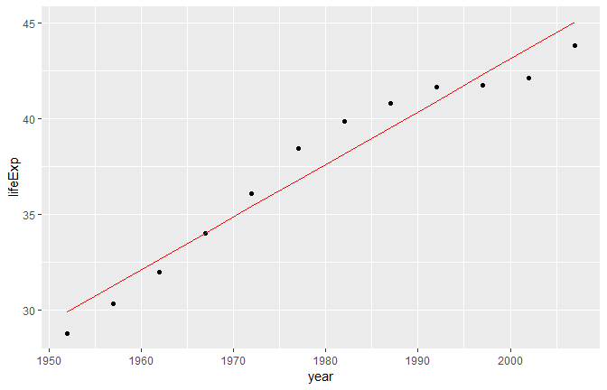
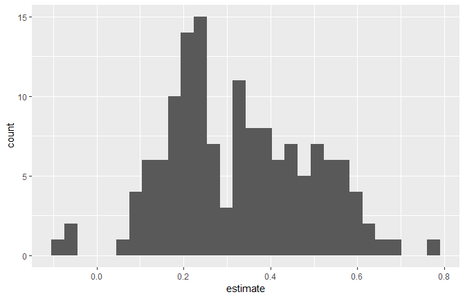
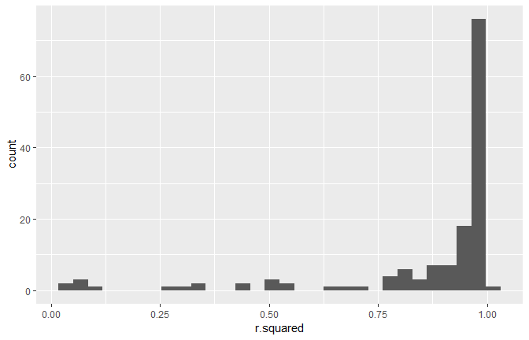
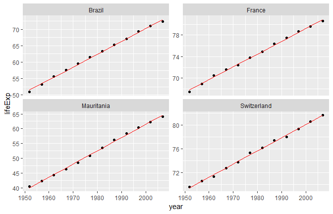
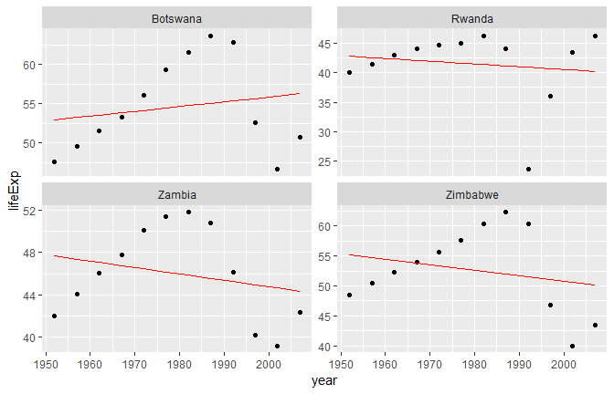

ML in Tidyverse
================
Koji Mizumura
2019-3-12 - 2019-04-17

  - [Foundations of “tidy” ML](#foundations-of-tidy-ml)
      - [Nesting the data](#nesting-the-data)
      - [Unnesting your data](#unnesting-your-data)
      - [Explore a nested cell](#explore-a-nested-cell)
      - [Map() function](#map-function)
      - [Mapping your data](#mapping-your-data)
      - [Mapping many models](#mapping-many-models)
      - [tidying models with broom](#tidying-models-with-broom)
      - [Extracting model statistics
        tidily](#extracting-model-statistics-tidily)
      - [Augmenting your data](#augmenting-your-data)
  - [Multiple models with broom](#multiple-models-with-broom)
      - [Exploring coefficients across
        models](#exploring-coefficients-across-models)
      - [What can we learn about these 77
        countries?](#what-can-we-learn-about-these-77-countries)
      - [Glance at the fit of your
        model](#glance-at-the-fit-of-your-model)
      - [Best and worst fitting models](#best-and-worst-fitting-models)
      - [Augment the fitted values of each
        model](#augment-the-fitted-values-of-each-model)
      - [Explore your best and worst fitting
        models](#explore-your-best-and-worst-fitting-models)
      - [Build better models](#build-better-models)
  - [Build Tune, Evaluate Regression
    Models](#build-tune-evaluate-regression-models)
      - [The test-train split](#the-test-train-split)
      - [Cross-validation dataframes](#cross-validation-dataframes)
      - [Measuring cross-validation
        performance](#measuring-cross-validation-performance)
      - [Build cross-validated models](#build-cross-validated-models)
      - [Preparing for evaluation](#preparing-for-evaluation)
      - [Evaluate model performance](#evaluate-model-performance)
      - [Building and tuning a random forest
        model](#building-and-tuning-a-random-forest-model)
      - [Build a random forest model by
        `ranger`](#build-a-random-forest-model-by-ranger)
      - [Evaluate a random forest
        model](#evaluate-a-random-forest-model)
      - [Fine tune your model](#fine-tune-your-model)
      - [The best performing parameter](#the-best-performing-parameter)
      - [](#section)
  - [Build, Tune & Evaluate classification
    models](#build-tune-evaluate-classification-models)
      - [Prepare train-test-validate
        parts](#prepare-train-test-validate-parts)
      - [Build cross-validated models](#build-cross-validated-models-1)
      - [Evaluating classification
        models](#evaluating-classification-models)
      - [Predicitons of a single model](#predicitons-of-a-single-model)
      - [cv\_models\_lr](#cv_models_lr)
      - [Prepare for cross-validated
        performance](#prepare-for-cross-validated-performance)
      - [Calculate cross-validated
        performance](#calculate-cross-validated-performance)
      - [Classification with random
        forests](#classification-with-random-forests)
      - [Tune random forest models](#tune-random-forest-models)
      - [Random forest performance](#random-forest-performance)
      - [Build final classification
        model](#build-final-classification-model)
      - [Measure final model
        performance](#measure-final-model-performance)

# Foundations of “tidy” ML

## Nesting the data

List column workflow is as follows.

1.  Make a list column: `nest()`
2.  Work with **list columns**: `map()`
3.  Simplify the list columns `unnest()` and `map_*`

In this course, you will work with a collection of economic and social
indicators for 77 countries over a period of 52 years. This data is
stored in the `gapminder` dataframe.

In this exercise, you will transform your `gapminder` data into a nested
dataframe by using the first tool needed to build the foundation of tidy
machine learning skills: `nest()`.

Note: This is a more granular version than the dataset available from
the gapminder package. This version is available in the `dslabs`
package.

``` r
library(gapminder)

# Explore gapminder
head(gapminder)
## # A tibble: 6 x 6
##   country     continent  year lifeExp      pop gdpPercap
##   <fct>       <fct>     <int>   <dbl>    <int>     <dbl>
## 1 Afghanistan Asia       1952    28.8  8425333      779.
## 2 Afghanistan Asia       1957    30.3  9240934      821.
## 3 Afghanistan Asia       1962    32.0 10267083      853.
## 4 Afghanistan Asia       1967    34.0 11537966      836.
## 5 Afghanistan Asia       1972    36.1 13079460      740.
## 6 Afghanistan Asia       1977    38.4 14880372      786.

# Prepare the nested dataframe gap_nested
library(tidyverse)

gap_nested <- gapminder %>% 
  group_by(country) %>% 
  nest()

# Explore gap_nested
head(gap_nested)
## # A tibble: 6 x 2
##   country     data             
##   <fct>       <list>           
## 1 Afghanistan <tibble [12 x 5]>
## 2 Albania     <tibble [12 x 5]>
## 3 Algeria     <tibble [12 x 5]>
## 4 Angola      <tibble [12 x 5]>
## 5 Argentina   <tibble [12 x 5]>
## 6 Australia   <tibble [12 x 5]>
```

## Unnesting your data

As you’ve seen in the previous exercise, a nested dataframe is simply a
way to shape your data. Essentially taking the `group_by()` windows and
packaging them in corresponding rows.

In the same way you can use the `nest()` function to break your data
into nested chunks, you can use the `unnest()` function to expand the
dataframes that are nested in these chunks.

``` r
# Create the unnested dataframe called gap_unnnested
gap_unnested <- gap_nested %>% 
  unnest()
  
# Confirm that your data was not modified  
identical(gapminder, gap_unnested)
## [1] TRUE
```

## Explore a nested cell

In the first exercise, you successfully created a nested dataframe
`gap_nested`. The `data` column contains tibbles for each country. In
this exercise, you will explore one of these nested chunks.

``` r
# Extract the data of Algeria
algeria_df <- gap_nested$data[[1]]
algeria_df %>% colnames()
## [1] "continent" "year"      "lifeExp"   "pop"       "gdpPercap"
# Calculate the minimum of the population vector
min(algeria_df$population)
## [1] Inf

# Calculate the maximum of the population vector
max(algeria_df$population)
## [1] -Inf

# Calculate the mean of the population vector
mean(algeria_df$population)
## [1] NA
```

## Map() function

\[
map(.x = , .f = )
\]

  - .x = `[vector]` or `[[list]]`
  - .f = `mean` or `~mean(.x)`

## Mapping your data

In combination with `mutate()`, you can use `map()` to append the
results of your calculation to a dataframe. Since the `map()` function
always returns a vector of lists you must use `unnest()` to extract this
information into a numeric vector.

Here you will explore this functionality by calculating the mean
population of each country in the gapminder dataset.

``` r
# Calculate the mean population for each country
gap_nested
## # A tibble: 142 x 2
##    country     data             
##    <fct>       <list>           
##  1 Afghanistan <tibble [12 x 5]>
##  2 Albania     <tibble [12 x 5]>
##  3 Algeria     <tibble [12 x 5]>
##  4 Angola      <tibble [12 x 5]>
##  5 Argentina   <tibble [12 x 5]>
##  6 Australia   <tibble [12 x 5]>
##  7 Austria     <tibble [12 x 5]>
##  8 Bahrain     <tibble [12 x 5]>
##  9 Bangladesh  <tibble [12 x 5]>
## 10 Belgium     <tibble [12 x 5]>
## # ... with 132 more rows
pop_nested <- gap_nested %>%
  mutate(mean_pop = map(data, ~mean(.x$population)))

# Take a look at pop_nested
head(pop_nested)
## # A tibble: 6 x 3
##   country     data              mean_pop 
##   <fct>       <list>            <list>   
## 1 Afghanistan <tibble [12 x 5]> <dbl [1]>
## 2 Albania     <tibble [12 x 5]> <dbl [1]>
## 3 Algeria     <tibble [12 x 5]> <dbl [1]>
## 4 Angola      <tibble [12 x 5]> <dbl [1]>
## 5 Argentina   <tibble [12 x 5]> <dbl [1]>
## 6 Australia   <tibble [12 x 5]> <dbl [1]>

# Extract the mean_pop value by using unnest
pop_mean <- pop_nested %>% 
  unnest(mean_pop)

# Take a look at pop_mean
head(pop_mean)
## # A tibble: 6 x 3
##   country     data              mean_pop
##   <fct>       <list>               <dbl>
## 1 Afghanistan <tibble [12 x 5]>       NA
## 2 Albania     <tibble [12 x 5]>       NA
## 3 Algeria     <tibble [12 x 5]>       NA
## 4 Angola      <tibble [12 x 5]>       NA
## 5 Argentina   <tibble [12 x 5]>       NA
## 6 Australia   <tibble [12 x 5]>       NA
```

``` r
# Calculate mean population and store result as a double
pop_mean <- gap_nested %>%
  mutate(mean_pop = map_dbl(data, ~mean(.x$population)))

# Take a look at pop_mean
head(pop_mean)
## # A tibble: 6 x 3
##   country     data              mean_pop
##   <fct>       <list>               <dbl>
## 1 Afghanistan <tibble [12 x 5]>       NA
## 2 Albania     <tibble [12 x 5]>       NA
## 3 Algeria     <tibble [12 x 5]>       NA
## 4 Angola      <tibble [12 x 5]>       NA
## 5 Argentina   <tibble [12 x 5]>       NA
## 6 Australia   <tibble [12 x 5]>       NA
```

## Mapping many models

The `gap_nested` dataframe available in your workspace contains the
gapminder dataset nested by country.

You will use this data to build a linear model for each country to
predict life expectancy using the year feature.

Note: The term feature is synonymous with the terms variable or
predictor. It refers to an attribute of your data that can be used to
build a machine learning model.

``` r
# Build a linear model for each country
gap_models <- gap_nested %>%
    mutate(model = map(data, ~lm(formula = lifeExp~year, data = .x)))
    
# Extract the model for Algeria    
algeria_model <- gap_models$model[[1]]

# View the summary for the Algeria model
summary(algeria_model)
## 
## Call:
## lm(formula = lifeExp ~ year, data = .x)
## 
## Residuals:
##     Min      1Q  Median      3Q     Max 
## -1.5447 -0.9905 -0.2757  0.8847  1.6868 
## 
## Coefficients:
##               Estimate Std. Error t value Pr(>|t|)    
## (Intercept) -507.53427   40.48416  -12.54 1.93e-07 ***
## year           0.27533    0.02045   13.46 9.84e-08 ***
## ---
## Signif. codes:  0 '***' 0.001 '**' 0.01 '*' 0.05 '.' 0.1 ' ' 1
## 
## Residual standard error: 1.223 on 10 degrees of freedom
## Multiple R-squared:  0.9477, Adjusted R-squared:  0.9425 
## F-statistic: 181.2 on 1 and 10 DF,  p-value: 9.835e-08
```

## tidying models with broom

To Work with list columns, we use `broom`, `Metrics`, `rsample` package
s etc.

  - `tidy()`: returns the statistical findings of the model (such as
    coefficients)
  - `glance()`: returns a concise one-row summary of the model
  - `augment()`: adds prediction columns to the data being modeled

<!-- end list -->

``` r
algeria_model %>% broom::tidy()
## # A tibble: 2 x 5
##   term        estimate std.error statistic      p.value
##   <chr>          <dbl>     <dbl>     <dbl>        <dbl>
## 1 (Intercept) -508.      40.5        -12.5 0.000000193 
## 2 year           0.275    0.0205      13.5 0.0000000984
algeria_model %>% glance()
## # A tibble: 1 x 11
##   r.squared adj.r.squared sigma statistic p.value    df logLik   AIC   BIC
## *     <dbl>         <dbl> <dbl>     <dbl>   <dbl> <int>  <dbl> <dbl> <dbl>
## 1     0.948         0.942  1.22      181. 9.84e-8     2  -18.3  42.7  44.1
## # ... with 2 more variables: deviance <dbl>, df.residual <int>
algeria_model %>% augment()
## # A tibble: 12 x 9
##    lifeExp  year .fitted .se.fit  .resid   .hat .sigma   .cooksd .std.resid
##  *   <dbl> <int>   <dbl>   <dbl>   <dbl>  <dbl>  <dbl>     <dbl>      <dbl>
##  1    28.8  1952    29.9   0.664 -1.11   0.295    1.21 0.243        -1.08  
##  2    30.3  1957    31.3   0.580 -0.952  0.225    1.24 0.113        -0.884 
##  3    32.0  1962    32.7   0.503 -0.664  0.169    1.27 0.0360       -0.595 
##  4    34.0  1967    34.0   0.436 -0.0172 0.127    1.29 0.0000165    -0.0151
##  5    36.1  1972    35.4   0.385  0.674  0.0991   1.27 0.0185        0.581 
##  6    38.4  1977    36.8   0.357  1.65   0.0851   1.15 0.0923        1.41  
##  7    39.9  1982    38.2   0.357  1.69   0.0851   1.15 0.0967        1.44  
##  8    40.8  1987    39.5   0.385  1.28   0.0991   1.21 0.0667        1.10  
##  9    41.7  1992    40.9   0.436  0.754  0.127    1.26 0.0317        0.660 
## 10    41.8  1997    42.3   0.503 -0.534  0.169    1.27 0.0233       -0.479 
## 11    42.1  2002    43.7   0.580 -1.54   0.225    1.15 0.299        -1.43  
## 12    43.8  2007    45.1   0.664 -1.22   0.295    1.19 0.296        -1.19
```

## Extracting model statistics tidily

In this exercise, you will use the `tidy()` and `glance()` functions to
extract information from algeria\_model in a tidy manner.

For a linear model, `tidy()` extracts the model coefficients while
`glance()` returns the model statistics such as the \(R^2\)

``` r
library(broom)
library(magrittr)

# Extract the coefficients of the algeria_model as a dataframe
broom::tidy(algeria_model)
## # A tibble: 2 x 5
##   term        estimate std.error statistic      p.value
##   <chr>          <dbl>     <dbl>     <dbl>        <dbl>
## 1 (Intercept) -508.      40.5        -12.5 0.000000193 
## 2 year           0.275    0.0205      13.5 0.0000000984
  
# Extract the statistics of the algeria_model as a dataframe
glance(algeria_model)
## # A tibble: 1 x 11
##   r.squared adj.r.squared sigma statistic p.value    df logLik   AIC   BIC
## *     <dbl>         <dbl> <dbl>     <dbl>   <dbl> <int>  <dbl> <dbl> <dbl>
## 1     0.948         0.942  1.22      181. 9.84e-8     2  -18.3  42.7  44.1
## # ... with 2 more variables: deviance <dbl>, df.residual <int>
```

## Augmenting your data

From the results of `glance()`, you learned that using the available
features the linear model fits well with an adjusted \(R^2\) of
\(0.99\). The `augment()` function can help you explore this fit by
appending the predictions to the original data.

Here you will leverage this to compare the predicted values of
`life_expectancy` with the original ones based on the `year` feature.

``` r
# Build the augmented dataframe
algeria_fitted <- augment(algeria_model)

# Compare the predicted values with the actual values of life expectancy
algeria_fitted %>% 
  ggplot(aes(x = year)) +
  geom_point(aes(y = lifeExp)) + 
  geom_line(aes(y = .fitted), color = "red")
```



# Multiple models with broom

## Exploring coefficients across models

Tidy up the coefficients of your models In this exercise you will
leverage the list column workflow along with the `tidy()` function from
broom to extract and explore the coefficients for the 77 models you
built.

Remember the `gap_models` dataframe contains a model predicting life
expectancy by year for 77
countries.

``` r
# Extract the coefficient statistics of each model into nested dataframes
model_coef_nested <- gap_models %>% 
    mutate(coef = map(model, ~broom::tidy(.x)))
    
# Simplify the coef dataframes for each model    
model_coef <- model_coef_nested %>%
    unnest(coef)

# Plot a histogram of the coefficient estimates for year         
model_coef %>% 
  filter(term == "year") %>% 
  ggplot(aes(x =estimate)) +
  geom_histogram()
```



## What can we learn about these 77 countries?

Explore the `model_coef` dataframe you just created to answer the
following question:

Which of the following conclusions can we make from the coefficients of
our models?

## Glance at the fit of your model

In this exercise you will use `glance()` to calculate how well the
linear models fit the data for each country.

``` r
# Extract the fit statistics of each model into dataframes
model_perf_nested <- gap_models %>% 
    mutate(fit = map(model, ~glance(.x)))

# Simplify the fit dataframes for each model    
model_perf <- model_perf_nested %>% 
    unnest(fit)
    
# Look at the first six rows of model_perf
head(model_perf)
## # A tibble: 6 x 14
##   country data  model r.squared adj.r.squared sigma statistic  p.value
##   <fct>   <lis> <lis>     <dbl>         <dbl> <dbl>     <dbl>    <dbl>
## 1 Afghan~ <tib~ <S3:~     0.948         0.942 1.22      181.  9.84e- 8
## 2 Albania <tib~ <S3:~     0.911         0.902 1.98      102.  1.46e- 6
## 3 Algeria <tib~ <S3:~     0.985         0.984 1.32      662.  1.81e-10
## 4 Angola  <tib~ <S3:~     0.888         0.877 1.41       79.1 4.59e- 6
## 5 Argent~ <tib~ <S3:~     0.996         0.995 0.292    2246.  4.22e-13
## 6 Austra~ <tib~ <S3:~     0.980         0.978 0.621     481.  8.67e-10
## # ... with 6 more variables: df <int>, logLik <dbl>, AIC <dbl>, BIC <dbl>,
## #   deviance <dbl>, df.residual <int>
```

## Best and worst fitting models

``` r
# Plot a histogram of rsquared for the 77 models    
model_perf
## # A tibble: 142 x 14
##    country data  model r.squared adj.r.squared sigma statistic  p.value
##    <fct>   <lis> <lis>     <dbl>         <dbl> <dbl>     <dbl>    <dbl>
##  1 Afghan~ <tib~ <S3:~     0.948         0.942 1.22      181.  9.84e- 8
##  2 Albania <tib~ <S3:~     0.911         0.902 1.98      102.  1.46e- 6
##  3 Algeria <tib~ <S3:~     0.985         0.984 1.32      662.  1.81e-10
##  4 Angola  <tib~ <S3:~     0.888         0.877 1.41       79.1 4.59e- 6
##  5 Argent~ <tib~ <S3:~     0.996         0.995 0.292    2246.  4.22e-13
##  6 Austra~ <tib~ <S3:~     0.980         0.978 0.621     481.  8.67e-10
##  7 Austria <tib~ <S3:~     0.992         0.991 0.407    1261.  7.44e-12
##  8 Bahrain <tib~ <S3:~     0.967         0.963 1.64      291.  1.02e- 8
##  9 Bangla~ <tib~ <S3:~     0.989         0.988 0.977     930.  3.37e-11
## 10 Belgium <tib~ <S3:~     0.995         0.994 0.293    1822.  1.20e-12
## # ... with 132 more rows, and 6 more variables: df <int>, logLik <dbl>,
## #   AIC <dbl>, BIC <dbl>, deviance <dbl>, df.residual <int>

model_perf %>% 
  ggplot(aes(x = r.squared)) + 
  geom_histogram()  
```



``` r
  
# Extract the 4 best fitting models
best_fit <- model_perf %>% 
  top_n(n = 4, wt = r.squared)

# Extract the 4 models with the worst fit
worst_fit <- model_perf %>% 
  top_n(n = 4, wt = -r.squared)
```

## Augment the fitted values of each model

In this exercise you will prepare your four best and worst fitting
models for further exploration by augmenting your model data with
`augment()`.

``` r
best_augmented <- best_fit %>% 
  # Build the augmented dataframe for each country model
  mutate(augmented = map(model, ~augment(.x))) %>% 
  # Expand the augmented dataframes
  unnest(augmented)

worst_augmented <- worst_fit %>% 
  # Build the augmented dataframe for each country model
  mutate(augmented = map(model, ~augment(.x))) %>% 
  # Expand the augmented dataframes
  unnest(augmented)
```

## Explore your best and worst fitting models

Let’s explore your four best and worst fitting models by comparing the
fitted lines with the actual
values.

``` r
# Compare the predicted values with the actual values of life expectancy 
# for the top 4 best fitting models
best_augmented %>% 
  ggplot(aes(x = year)) +
  geom_point(aes(y = lifeExp)) + 
  geom_line(aes(y = .fitted), color = "red") +
  facet_wrap(~country, scales = "free_y")
```



``` r

# Compare the predicted values with the actual values of life expectancy 
# for the top 4 worst fitting models
worst_augmented %>% 
  ggplot(aes(x = year)) +
  geom_point(aes(y = lifeExp)) + 
  geom_line(aes(y = .fitted), color = "red") +
  facet_wrap(~country, scales = "free_y")
```



To improve model fits…

## Build better models

Earlier you built a collection of simple models to fit life expectancy
using the year feature. Your previous analysis showed that some of these
models didn’t fit very well.

In this exercise you will build multiple regression models for each
country using all available features. You may be interested in comparing
the performance of the four worst fitting models so their adjusted
\(R^2\) are provided below:

``` r
# Build a linear model for each country using all features

gap_fullmodel <- gap_nested %>% 
  mutate(model = map(data, ~lm(formula = lifeExp ~ . , data = .x)))

fullmodel_perf <- gap_fullmodel %>% 
  # Extract the fit statistics of each model into dataframes
  mutate(fit = map(model, ~glance(.x))) %>% 
  # Simplify the fit dataframes for each model
  unnest(fit)
  
# View the performance for the four countries with the worst fitting 
# four simple models you looked at before
fullmodel_perf %>% 
  filter(country %in% worst_fit$country) %>% 
  select(country, adj.r.squared)
```

# Build Tune, Evaluate Regression Models

## The test-train split

In a disciplined machine learning workflow it is crucial to withhold a
portion of your data (**testing data**) from any decision-making
process. This allows you to independently assess the performance of your
model when it is finalized. The remaining data, the **training data**,
is used to build and select the best model.

In this exercise, you will use the `rsample` package to split your data
to perform the initial train-test split of your `gapminder` data.

Note: Since this is a random split of the data it is good practice to
set a seed before splitting it.

``` r
set.seed(42)

# Prepare the initial split object
gap_split <- initial_split(gapminder, prop = 0.75)

# Extract the training dataframe
training_data <- training(gap_split)

# Extract the testing dataframe
testing_data <- testing(gap_split)

# Calculate the dimensions of both training_data and testing_data
dim(training_data)
## [1] 1278    6
dim(testing_data)
## [1] 426   6
```

## Cross-validation dataframes

Now that you have withheld a portion of your data as **testing data**,
you can use the remaining portion to find the best performing model.

In this exercise, you will split the training data into a series of 5
train-validate sets using the `vfold_cv()` function from the `rsample`
package.

``` r
set.seed(42)

# Prepare the dataframe containing the cross validation partitions
cv_split <- vfold_cv(training_data, v = 5)
cv_split
## #  5-fold cross-validation 
## # A tibble: 5 x 2
##   splits           id   
##   <list>           <chr>
## 1 <split [1K/256]> Fold1
## 2 <split [1K/256]> Fold2
## 3 <split [1K/256]> Fold3
## 4 <split [1K/255]> Fold4
## 5 <split [1K/255]> Fold5

cv_data <- cv_split %>% 
  mutate(
    # Extract the train dataframe for each split
    train = map(splits, ~training(.x)), 
    # Extract the validate dataframe for each split
    validate = map(splits, ~testing(.x))
  )

# Use head() to preview cv_data
head(cv_data)
## # A tibble: 5 x 4
##   splits           id    train                validate          
## * <list>           <chr> <list>               <list>            
## 1 <split [1K/256]> Fold1 <tibble [1,022 x 6]> <tibble [256 x 6]>
## 2 <split [1K/256]> Fold2 <tibble [1,022 x 6]> <tibble [256 x 6]>
## 3 <split [1K/256]> Fold3 <tibble [1,022 x 6]> <tibble [256 x 6]>
## 4 <split [1K/255]> Fold4 <tibble [1,023 x 6]> <tibble [255 x 6]>
## 5 <split [1K/255]> Fold5 <tibble [1,023 x 6]> <tibble [255 x 6]>
```

## Measuring cross-validation performance

  - MAE: How much on average the model’s prediction differ from actual
    observations.

Three steps to calculate MAE: 1) Build cross-validated models 2) Predict
using trained models by `map2` 3) Compute MAE by `map2_dbl`

## Build cross-validated models

In this exercise, you will build a linear model predicting
life\_expectancy using all available features. You will do this for the
train data of each cross-validation
fold.

``` r
# Build a model using the train data for each fold of the cross validation
cv_data
## #  5-fold cross-validation 
## # A tibble: 5 x 4
##   splits           id    train                validate          
## * <list>           <chr> <list>               <list>            
## 1 <split [1K/256]> Fold1 <tibble [1,022 x 6]> <tibble [256 x 6]>
## 2 <split [1K/256]> Fold2 <tibble [1,022 x 6]> <tibble [256 x 6]>
## 3 <split [1K/256]> Fold3 <tibble [1,022 x 6]> <tibble [256 x 6]>
## 4 <split [1K/255]> Fold4 <tibble [1,023 x 6]> <tibble [255 x 6]>
## 5 <split [1K/255]> Fold5 <tibble [1,023 x 6]> <tibble [255 x 6]>

cv_models_lm <- cv_data %>% 
  mutate(model = map(train, ~lm(formula = lifeExp ~., data = .x)))
```

## Preparing for evaluation

In order to measure the validate performance of your models you need
compare the predicted values of `life_expectancy` for the observations
from validate set to the actual values recorded. Here you will prepare
both of these vectors for each partition.

``` r
cv_prep_lm <- cv_models_lm %>% 
  mutate(
    # Extract the recorded life expectancy for the records in the validate dataframes
    validate_actual = map(validate, ~.x$lifeExp),
    # Predict life expectancy for each validate set using its corresponding model
    validate_predicted = map2(.x = model, .y = validate, ~predict(.x, .y))
  )

cv_prep_lm
## #  5-fold cross-validation 
## # A tibble: 5 x 7
##   splits   id    train    validate  model validate_actual validate_predic~
## * <list>   <chr> <list>   <list>    <lis> <list>          <list>          
## 1 <split ~ Fold1 <tibble~ <tibble ~ <S3:~ <dbl [256]>     <dbl [256]>     
## 2 <split ~ Fold2 <tibble~ <tibble ~ <S3:~ <dbl [256]>     <dbl [256]>     
## 3 <split ~ Fold3 <tibble~ <tibble ~ <S3:~ <dbl [256]>     <dbl [256]>     
## 4 <split ~ Fold4 <tibble~ <tibble ~ <S3:~ <dbl [255]>     <dbl [255]>     
## 5 <split ~ Fold5 <tibble~ <tibble ~ <S3:~ <dbl [255]>     <dbl [255]>
```

## Evaluate model performance

Now that you have both the actual and predicted values of each fold you
can compare them to measure performance.

For this regression model, you will measure the **Mean Absolute Error
(MAE)** between these two vectors. This value tells you the average
difference between the actual and predicted values.

``` r
library(Metrics)
# Calculate the mean absolute error for each validate fold       
cv_eval_lm <- cv_prep_lm %>% 
  mutate(validate_mae = map2_dbl(validate_actual, validate_predicted, ~mae(actual = .x, predicted = .y)))

# Print the validate_mae column
cv_eval_lm$validate_mae
##        1        2        3        4        5 
## 2.661519 2.565902 2.551318 2.766936 2.834880

# Calculate the mean of validate_mae column
mean(cv_eval_lm$validate_mae)
## [1] 2.676111
```

## Building and tuning a random forest model

As another model, the random forest is beneficial for 1) handling
non-linear relationships, 2) handling interactions.

Model

``` r
rf_model <- ranger(
  formula = XX,
  data = XX,
  seed = XX
)
```

Prediction

``` r
prediction <- predict(
  rf_model,
  new_data
)$predictions
```

For random forest model, hyper parameters are

  - `mtry`: default is \(\sqrt{number of features}\), and the range is
    \(1:number of features\)
  - `num.trees`: default is \(500\), and the range is \(1:\infty\).

## Build a random forest model by `ranger`

Here you will use the same cross-validation data to build (using
`train`) and evaluate (using `validate`) random forests for each
partition. Since you are using the same cross-validation partitions as
your regression models, you are able to directly compare the performance
of the two models.

Note: We will limit our random forests to contain \(100\) trees to
ensure they finish fitting in a reasonable time. The *default number of
trees* for `ranger()` is \(500\).

``` r
library(ranger)

# Build a random forest model for each fold

cv_models_rf <- cv_data %>% 
  mutate(model = map(train, ~ranger(formula = lifeExp ~., data = .x,
                                    num.trees = 100, seed = 42)))

# Generate predictions using the random forest model
cv_data
## #  5-fold cross-validation 
## # A tibble: 5 x 4
##   splits           id    train                validate          
## * <list>           <chr> <list>               <list>            
## 1 <split [1K/256]> Fold1 <tibble [1,022 x 6]> <tibble [256 x 6]>
## 2 <split [1K/256]> Fold2 <tibble [1,022 x 6]> <tibble [256 x 6]>
## 3 <split [1K/256]> Fold3 <tibble [1,022 x 6]> <tibble [256 x 6]>
## 4 <split [1K/255]> Fold4 <tibble [1,023 x 6]> <tibble [255 x 6]>
## 5 <split [1K/255]> Fold5 <tibble [1,023 x 6]> <tibble [255 x 6]>
cv_models_rf
## #  5-fold cross-validation 
## # A tibble: 5 x 5
##   splits           id    train               validate          model      
## * <list>           <chr> <list>              <list>            <list>     
## 1 <split [1K/256]> Fold1 <tibble [1,022 x 6~ <tibble [256 x 6~ <S3: range~
## 2 <split [1K/256]> Fold2 <tibble [1,022 x 6~ <tibble [256 x 6~ <S3: range~
## 3 <split [1K/256]> Fold3 <tibble [1,022 x 6~ <tibble [256 x 6~ <S3: range~
## 4 <split [1K/255]> Fold4 <tibble [1,023 x 6~ <tibble [255 x 6~ <S3: range~
## 5 <split [1K/255]> Fold5 <tibble [1,023 x 6~ <tibble [255 x 6~ <S3: range~

cv_prep_rf <- cv_models_rf %>% 
  mutate(
    validate_actual = map(validate, ~.x$lifeExp),
    validate_predicted = map2(.x = model, .y = validate, ~predict(.x, .y)$predictions))
cv_prep_rf
## #  5-fold cross-validation 
## # A tibble: 5 x 7
##   splits   id    train    validate  model validate_actual validate_predic~
## * <list>   <chr> <list>   <list>    <lis> <list>          <list>          
## 1 <split ~ Fold1 <tibble~ <tibble ~ <S3:~ <dbl [256]>     <dbl [256]>     
## 2 <split ~ Fold2 <tibble~ <tibble ~ <S3:~ <dbl [256]>     <dbl [256]>     
## 3 <split ~ Fold3 <tibble~ <tibble ~ <S3:~ <dbl [256]>     <dbl [256]>     
## 4 <split ~ Fold4 <tibble~ <tibble ~ <S3:~ <dbl [255]>     <dbl [255]>     
## 5 <split ~ Fold5 <tibble~ <tibble ~ <S3:~ <dbl [255]>     <dbl [255]>
```

## Evaluate a random forest model

Similar to the linear regression model, you will use the MAE metric to
evaluate the performance of the random forest model.

``` r
library(ranger)

# Calculate validate MAE for each fold
cv_eval_rf <- cv_prep_rf %>% 
  mutate(validate_mae = map2_dbl(validate_actual, validate_predicted, ~mae(actual = .x, predicted = .y)))

# Print the validate_mae column
cv_eval_rf$validate_mae
##        1        2        3        4        5 
## 3.361439 2.969289 2.965947 3.002519 3.188108

# Calculate the mean of validate_mae column
mean(cv_eval_rf$validate_mae)
## [1] 3.097461
```

## Fine tune your model

Wow\! That was a significant improvement over a regression model. Now
let’s see if you can further improve this performance by fine tuning
your random forest models. To do this you will vary the `mtry` parameter
when building your random forest models on your `train` data.

The default value of `mtry` for ranger is the rounded down square root
of the total number of features (6). This results in a value of 2.

``` r
# Prepare for tuning your cross validation folds by varying mtry
cv_tune <- cv_data %>% 
  mutate(validate_actual = map(validate, ~.x$lifeExp)) %>% 
  crossing(mtry = 2:5) 

# Build a model for each fold & mtry combination
library(ranger)

cv_model_tunerf <- cv_tune %>% 
  mutate(model = map2(.x = train, .y = mtry, ~ranger(formula = lifeExp~., 
                                           data = .x, mtry = .y, 
                                           num.trees = 100, seed = 42)))
```

## The best performing parameter

You’ve now built models where you’ve varied the random forest-specific
hyperparameter `mtry` in the hopes of improving your model further. Now
you will measure the performance of each `mtry` value across the 5 cross
validation partitions to see if you can improve the model.

Remember that the validate MAE you calculated two exercises ago of
`0.795` was for the default mtry value of 2.

``` r
# Generate validate predictions for each model
cv_model_tunerf

cv_prep_tunerf <- cv_model_tunerf %>% 
  mutate(validate_predicted = map2(.x = model, .y = validate, ~predict(.x, .y)$predictions))

# Calculate validate MAE for each fold and mtry combination
cv_eval_tunerf <- cv_prep_tunerf %>% 
  mutate(validate_mae = map2_dbl(.x = validate_predicted, .y = validate_actual, ~mae(actual = .x, predicted = .y)))

# Calculate the mean validate_mae for each mtry used  
cv_eval_tunerf %>% 
  group_by(mtry) %>% 
  summarise(mean_mae = mean(validate_mae))
```

## 

The test portion was intentionally held out in order to evaluate the
final model with an independent set of data. The train portion of data
is further split into train and validate using cross validation for the
purpose of model selection.

Each train portion was build a model and the held out validate protion
was used to evaluate it. Resulting in measures of validation performance
for each cross validation fold for each model and hyperparameter.

Aggreagting the validation performance for each model allowed us to
compare multiple models as well as their respective hyperparameters to
select model hyper-parameter combination with the best overall
performance.

``` r
# Build the model using all training data and the best performing parameter
best_model <- ranger(formula = lifeExp~., data = training_data,
                     mtry = 4, num.trees = 100, seed = 42)

# Prepare the test_actual vector
test_actual <- testing_data$lifeExp

# Predict life_expectancy for the testing_data
test_predicted <- predict(best_model, testing_data)$predictions

# Calculate the test MAE
mae(test_actual, test_predicted)
## [1] 2.707168
```

# Build, Tune & Evaluate classification models

## Prepare train-test-validate parts

In this exercise, you will leverage the tools that you have learned thus
far to build a classification model to predict employee attrition.

You will work with the `attrition` dataset, which contains 30 features
about employees which you will use to predict if they have left the
company.

You will first prepare the training & testing data sets, then you will
further split the training data using cross-validation so that you can
search for the best performing

``` r
set.seed(42)
# Prepare the initial split object
data_split <- initial_split(attrition, prop = 0.75)

# Extract the training dataframe
training_data <- training(data_split)

# Extract the testing dataframe
testing_data <- testing(data_split)


set.seed(42)
cv_split <- vfold_cv(training_data, v = 5)

cv_split
## #  5-fold cross-validation 
## # A tibble: 5 x 2
##   splits            id   
##   <list>            <chr>
## 1 <split [882/221]> Fold1
## 2 <split [882/221]> Fold2
## 3 <split [882/221]> Fold3
## 4 <split [883/220]> Fold4
## 5 <split [883/220]> Fold5

cv_data <- cv_split %>% 
  mutate(
    # Extract the train dataframe for each split
    train = map(splits, ~training(.x)),
    # Extract the validate dataframe for each split
    validate = map(splits, ~testing(.x))
  )

cv_data
## #  5-fold cross-validation 
## # A tibble: 5 x 4
##   splits            id    train                   validate               
## * <list>            <chr> <list>                  <list>                 
## 1 <split [882/221]> Fold1 <data.frame [882 x 31]> <data.frame [221 x 31]>
## 2 <split [882/221]> Fold2 <data.frame [882 x 31]> <data.frame [221 x 31]>
## 3 <split [882/221]> Fold3 <data.frame [882 x 31]> <data.frame [221 x 31]>
## 4 <split [883/220]> Fold4 <data.frame [883 x 31]> <data.frame [220 x 31]>
## 5 <split [883/220]> Fold5 <data.frame [883 x 31]> <data.frame [220 x 31]>
```

## Build cross-validated models

In this exercise, you will build logistic regression models for each
fold in your cross-validation.

You will build this using the `glm()` function and by setting the family
argument to
`"binomial"`.

``` r
# Build a model using the train data for each fold of the cross validation

cv_models_lr <- cv_data %>% 
  mutate(model = map(train, ~glm(formula = Attrition~., 
                               data = .x, family = "binomial")))

cv_models_lr
## #  5-fold cross-validation 
## # A tibble: 5 x 5
##   splits          id    train                validate             model   
## * <list>          <chr> <list>               <list>               <list>  
## 1 <split [882/22~ Fold1 <data.frame [882 x ~ <data.frame [221 x ~ <S3: gl~
## 2 <split [882/22~ Fold2 <data.frame [882 x ~ <data.frame [221 x ~ <S3: gl~
## 3 <split [882/22~ Fold3 <data.frame [882 x ~ <data.frame [221 x ~ <S3: gl~
## 4 <split [883/22~ Fold4 <data.frame [883 x ~ <data.frame [220 x ~ <S3: gl~
## 5 <split [883/22~ Fold5 <data.frame [883 x ~ <data.frame [220 x ~ <S3: gl~
```

## Evaluating classification models

The ingredients needed to measure performance are the same as before.

  - Actual classes of your observations: actual `Attrition` classes
  - Predicted classes: predicted `attrition` classes
  - A metric to compare 1) and 2).

As a metric, `accuracy`, `precision` and `recall` can be used.

  - `accuracy`: how well your model predicted both the TRUE and FALSE
    classes
  - `precision`: appropriate when you want to minimize how often the
    model incorrectly predicts an observation to be in the positive
    class
  - `recall`: This metrics compares the number of observations the model
    has correctly identified as TRUE to the total number of TRUE
    observations.In other words, it measures the rate at which the model
    can capture the TRUE class. This metric would be appropriate when
    building a model that would capture as many risky employees as
    possible you should consider this metric.

## Predicitons of a single model

To calculate the performance of a classification model you need to
compare the actual values of `Attrition` to those predicted by the
model. When calculating metrics for binary classification tasks (such as
precision and recall), the actual and predicted vectors must be
converted to **binary** values.

In this exercise, you will learn how to prepare these vectors using the
model and validate dataframes from the first cross-validation fold as an
example.

``` r

# Extract the first model and validate 
model <- cv_models_lr$model[[1]]
validate <- cv_models_lr$validate[[1]]

# Prepare binary vector of actual Attrition values in validate
validate_actual <- validate$Attrition == "Yes"

# Predict the probabilities for the observations in validate
validate_prob <- predict(model, validate, type = "response")

# Prepare binary vector of predicted Attrition values for validate
validate_predicted <- validate_prob > 0.5
```

## cv\_models\_lr

Now that you have the binary vectors for the actual and predicted values
of the model, you can calculate many commonly used binary classification
metrics. In this exercise you will focus on:

  - **accuracy**: rate of correctly predicted values relative to all
    predictions.
  - **precision**: portion of predictions that the model correctly
    predicted as TRUE.
  - **recall**: portion of actual TRUE values that the model correctly
    recovered.

<!-- end list -->

``` r
library(Metrics)

# Compare the actual & predicted performance visually using a table
table(validate_actual, validate_predicted)
##                validate_predicted
## validate_actual FALSE TRUE
##           FALSE   176   13
##           TRUE     15   17

# Calculate the accuracy
accuracy(validate_actual, validate_predicted)
## [1] 0.8733032

# Calculate the precision
precision(validate_actual, validate_predicted)
## [1] 0.5666667

# Calculate the recall
recall(validate_actual, validate_predicted)
## [1] 0.53125
```

## Prepare for cross-validated performance

Now that you know how to calculate the performance metrics for a single
model, you are now ready to expand this for all the folds in the
cross-validation dataframe.

``` r
cv_models_lr$validate[[1]]
##      Age Attrition    BusinessTravel DailyRate           Department
## 11    30        No     Travel_Rarely      1358 Research_Development
## 13    36        No     Travel_Rarely      1299 Research_Development
## 21    32        No     Travel_Rarely       334 Research_Development
## 22    22        No        Non-Travel      1123 Research_Development
## 35    42        No     Travel_Rarely       691                Sales
## 39    33        No     Travel_Rarely       924 Research_Development
## 47    50       Yes     Travel_Rarely       869                Sales
## 52    33        No Travel_Frequently      1141                Sales
## 56    27        No Travel_Frequently       994                Sales
## 65    28       Yes     Travel_Rarely      1434 Research_Development
## 68    44        No     Travel_Rarely      1488                Sales
## 83    36        No     Travel_Rarely      1223 Research_Development
## 96    32        No     Travel_Rarely       548 Research_Development
## 110   34        No     Travel_Rarely      1153 Research_Development
## 134   32        No     Travel_Rarely       827 Research_Development
## 148   54        No        Non-Travel       142      Human_Resources
## 160   33        No        Non-Travel       750                Sales
## 161   56       Yes     Travel_Rarely       441 Research_Development
## 169   22        No     Travel_Rarely       594 Research_Development
## 183   25        No     Travel_Rarely       959                Sales
## 190   32       Yes     Travel_Rarely      1033 Research_Development
## 197   30        No     Travel_Rarely       201 Research_Development
## 202   40        No Travel_Frequently      1395 Research_Development
## 206   45        No     Travel_Rarely       194 Research_Development
## 208   29        No        Non-Travel      1496 Research_Development
## 211   51        No     Travel_Rarely      1169 Research_Development
## 254   55        No     Travel_Rarely       692 Research_Development
## 262   43        No        Non-Travel      1344 Research_Development
## 271   38        No     Travel_Rarely      1261 Research_Development
## 281   40        No     Travel_Rarely       905 Research_Development
## 284   22        No     Travel_Rarely      1136 Research_Development
## 293   27        No Travel_Frequently      1242                Sales
## 298   41        No     Travel_Rarely       896                Sales
## 308   31        No        Non-Travel       979 Research_Development
## 312   29        No Travel_Frequently      1413                Sales
## 329   52        No        Non-Travel       771                Sales
## 331   32       Yes     Travel_Rarely       515 Research_Development
## 349   29        No     Travel_Rarely      1247                Sales
## 351   42        No     Travel_Rarely       269 Research_Development
## 353   51        No     Travel_Rarely       833 Research_Development
## 379   21        No     Travel_Rarely       996 Research_Development
## 388   29        No Travel_Frequently       442                Sales
## 399   31        No Travel_Frequently       444                Sales
## 401   26       Yes     Travel_Rarely       950                Sales
## 419   36        No        Non-Travel      1105 Research_Development
## 422   58        No        Non-Travel       390 Research_Development
## 431   49        No     Travel_Rarely      1091 Research_Development
## 447   47        No     Travel_Rarely      1482 Research_Development
## 449   27        No        Non-Travel       210                Sales
## 483   40        No     Travel_Rarely      1171 Research_Development
## 485   33       Yes     Travel_Rarely       350                Sales
## 493   31        No     Travel_Rarely       408 Research_Development
## 514   30       Yes Travel_Frequently       464 Research_Development
## 515   37        No     Travel_Rarely      1107 Research_Development
## 522   54        No     Travel_Rarely       821 Research_Development
## 523   34        No        Non-Travel      1381                Sales
## 550   46        No     Travel_Rarely      1485 Research_Development
## 554   24       Yes     Travel_Rarely      1448                Sales
## 577   35        No     Travel_Rarely       144 Research_Development
## 604   31        No     Travel_Rarely       828                Sales
## 618   26        No     Travel_Rarely       775                Sales
## 631   32       Yes        Non-Travel      1474                Sales
## 632   24        No Travel_Frequently       535                Sales
## 635   37        No     Travel_Rarely       446 Research_Development
## 643   24        No     Travel_Rarely       823 Research_Development
## 650   31       Yes     Travel_Rarely      1365                Sales
## 652   35        No     Travel_Rarely       538 Research_Development
## 662   38        No     Travel_Rarely       362 Research_Development
## 680   30        No Travel_Frequently       160 Research_Development
## 691   35        No     Travel_Rarely      1017 Research_Development
## 692   33        No Travel_Frequently      1296 Research_Development
## 698   54        No     Travel_Rarely       397      Human_Resources
## 704   35        No        Non-Travel       727 Research_Development
## 714   27        No Travel_Frequently      1410                Sales
## 722   32        No     Travel_Rarely       929                Sales
## 746   47        No Travel_Frequently       217                Sales
## 752   42       Yes Travel_Frequently       933 Research_Development
## 754   43        No Travel_Frequently       775                Sales
## 780   33       Yes     Travel_Rarely       527 Research_Development
## 786   34        No     Travel_Rarely       304                Sales
## 787   55       Yes     Travel_Rarely       725 Research_Development
## 789   36        No        Non-Travel      1434                Sales
## 796   26       Yes     Travel_Rarely      1146                Sales
## 797   34        No     Travel_Rarely       182 Research_Development
## 804   34        No     Travel_Rarely       121 Research_Development
## 808   34        No     Travel_Rarely      1111                Sales
## 832   40        No Travel_Frequently       720 Research_Development
## 836   42        No     Travel_Rarely       933 Research_Development
## 843   43        No     Travel_Rarely       589 Research_Development
## 861   30        No Travel_Frequently      1012 Research_Development
## 864   45        No     Travel_Rarely       930                Sales
## 867   52        No Travel_Frequently       890 Research_Development
## 872   22        No     Travel_Rarely      1230 Research_Development
## 879   25        No     Travel_Rarely       141                Sales
## 880   35        No     Travel_Rarely       607 Research_Development
## 887   49        No     Travel_Rarely      1418 Research_Development
## 893   38        No     Travel_Rarely       395                Sales
## 902   43        No Travel_Frequently       422 Research_Development
## 912   29        No     Travel_Rarely      1086 Research_Development
## 913   44        No     Travel_Rarely       661 Research_Development
## 945   48        No     Travel_Rarely      1469 Research_Development
## 949   36        No     Travel_Rarely       188 Research_Development
## 954   40        No     Travel_Rarely       658                Sales
## 958   36        No     Travel_Rarely       938 Research_Development
## 994   29       Yes     Travel_Rarely       906 Research_Development
## 997   50        No     Travel_Rarely      1126 Research_Development
## 1001  27        No     Travel_Rarely      1134 Research_Development
## 1002  45        No        Non-Travel       248 Research_Development
## 1012  18        No        Non-Travel       287 Research_Development
## 1019  22        No     Travel_Rarely       217 Research_Development
## 1027  27        No     Travel_Rarely      1055 Research_Development
## 1033  37       Yes     Travel_Rarely      1141 Research_Development
## 1035  41        No        Non-Travel       247 Research_Development
## 1036  38        No     Travel_Rarely      1035                Sales
## 1044  33        No        Non-Travel      1038                Sales
## 1068  26        No Travel_Frequently       921 Research_Development
## 1079  21       Yes     Travel_Rarely      1334 Research_Development
## 1084  30        No     Travel_Rarely      1176 Research_Development
## 1088  38        No     Travel_Rarely       330 Research_Development
## 1094  27        No        Non-Travel      1277 Research_Development
## 1108  33       Yes     Travel_Rarely      1017 Research_Development
## 1121  28        No     Travel_Rarely       950 Research_Development
## 1132  39        No        Non-Travel       439 Research_Development
## 1133  36        No        Non-Travel       217 Research_Development
## 1136  28        No     Travel_Rarely      1451 Research_Development
## 1143  29        No Travel_Frequently       490 Research_Development
## 1152  38        No     Travel_Rarely       433      Human_Resources
## 1164  35        No     Travel_Rarely       528      Human_Resources
## 1180  40        No Travel_Frequently       902 Research_Development
## 1182  35        No     Travel_Rarely       819 Research_Development
## 1195  45        No     Travel_Rarely      1457 Research_Development
## 1204  46        No     Travel_Rarely      1402                Sales
## 1207  33        No     Travel_Rarely       147      Human_Resources
## 1215  50        No Travel_Frequently      1421 Research_Development
## 1219  24       Yes     Travel_Rarely       984 Research_Development
## 1226  20        No     Travel_Rarely       654                Sales
## 1228  46        No     Travel_Rarely       150 Research_Development
## 1238  33        No     Travel_Rarely       117 Research_Development
## 1245  54        No Travel_Frequently       966 Research_Development
## 1250  54        No     Travel_Rarely       685 Research_Development
## 1259  27        No     Travel_Rarely      1167 Research_Development
## 1273  25       Yes Travel_Frequently       599                Sales
## 1281  34        No     Travel_Rarely       131                Sales
## 1285  34        No Travel_Frequently       135 Research_Development
## 1295  44       Yes     Travel_Rarely       621 Research_Development
## 1308  58        No     Travel_Rarely       848 Research_Development
## 1346  40        No     Travel_Rarely       523 Research_Development
## 1360  58       Yes     Travel_Rarely       601 Research_Development
## 1379  31       Yes Travel_Frequently       703                Sales
## 1402  43        No     Travel_Rarely       930 Research_Development
## 1407  26        No     Travel_Rarely       683 Research_Development
## 1411  37        No     Travel_Rarely      1462 Research_Development
## 1419  29        No     Travel_Rarely       332      Human_Resources
## 1422  54        No     Travel_Rarely       971 Research_Development
## 1425  36        No     Travel_Rarely      1174                Sales
## 1440  37        No        Non-Travel      1413 Research_Development
## 1465  45        No     Travel_Rarely      1448 Research_Development
## 1471  44        No        Non-Travel       981 Research_Development
## 1529  35        No     Travel_Rarely      1029 Research_Development
## 1553  45        No     Travel_Rarely       538 Research_Development
## 1569  35       Yes     Travel_Rarely       104 Research_Development
## 1577  34        No     Travel_Rarely       479 Research_Development
## 1581  26        No     Travel_Rarely       474 Research_Development
## 1592  23        No     Travel_Rarely       977 Research_Development
## 1598  40        No     Travel_Rarely       118                Sales
## 1601  35        No     Travel_Rarely      1349 Research_Development
## 1615  34        No Travel_Frequently       426 Research_Development
## 1624  18       Yes Travel_Frequently       544                Sales
## 1627  39        No     Travel_Rarely       170 Research_Development
## 1633  39        No Travel_Frequently       711 Research_Development
## 1635  45        No     Travel_Rarely      1329 Research_Development
## 1639  35       Yes     Travel_Rarely       737                Sales
## 1655  49        No     Travel_Rarely       301 Research_Development
## 1662  36        No        Non-Travel       894 Research_Development
## 1664  36        No     Travel_Rarely      1040 Research_Development
## 1666  43        No     Travel_Rarely      1291 Research_Development
## 1667  35       Yes Travel_Frequently       880                Sales
## 1668  38        No Travel_Frequently      1189 Research_Development
## 1669  29        No     Travel_Rarely       991                Sales
## 1701  34        No     Travel_Rarely       678 Research_Development
## 1709  29        No     Travel_Rarely      1082 Research_Development
## 1720  32        No Travel_Frequently       585 Research_Development
## 1729  30        No     Travel_Rarely       793 Research_Development
## 1731  47        No        Non-Travel       543                Sales
## 1736  31        No Travel_Frequently       163 Research_Development
## 1739  32        No     Travel_Rarely       371                Sales
## 1747  30       Yes Travel_Frequently       600      Human_Resources
## 1753  29        No Travel_Frequently       461 Research_Development
## 1762  29        No     Travel_Rarely       590 Research_Development
## 1775  53        No        Non-Travel       661 Research_Development
## 1782  38        No     Travel_Rarely      1153 Research_Development
## 1787  37        No     Travel_Rarely       589                Sales
## 1816  30        No     Travel_Rarely      1092 Research_Development
## 1818  26       Yes     Travel_Rarely       920      Human_Resources
## 1823  34        No     Travel_Rarely       810                Sales
## 1839  18        No        Non-Travel      1431 Research_Development
## 1847  36        No     Travel_Rarely       430 Research_Development
## 1854  42        No        Non-Travel       355 Research_Development
## 1860  42        No     Travel_Rarely      1142 Research_Development
## 1867  48        No     Travel_Rarely      1224 Research_Development
## 1882  34        No     Travel_Rarely      1480                Sales
## 1886  35        No     Travel_Rarely       219 Research_Development
## 1898  27        No     Travel_Rarely       511                Sales
## 1912  31        No     Travel_Rarely      1079                Sales
## 1916  31        No     Travel_Rarely       471 Research_Development
## 1918  26        No Travel_Frequently      1096 Research_Development
## 1924  33        No     Travel_Rarely       217                Sales
## 1928  29       Yes Travel_Frequently       746                Sales
## 1937  38        No Travel_Frequently      1394 Research_Development
## 1947  28        No        Non-Travel      1103 Research_Development
## 1949  36        No        Non-Travel      1351 Research_Development
## 1966  32        No     Travel_Rarely      1373 Research_Development
## 1968  53       Yes     Travel_Rarely      1168                Sales
## 1969  54        No     Travel_Rarely       155 Research_Development
## 1989  30        No     Travel_Rarely       911 Research_Development
## 2007  22        No     Travel_Rarely       581 Research_Development
## 2020  44        No     Travel_Rarely      1037 Research_Development
## 2022  39        No        Non-Travel       105 Research_Development
## 2046  45        No     Travel_Rarely       374                Sales
## 2060  26        No     Travel_Rarely      1167                Sales
## 2065  49        No Travel_Frequently      1023                Sales
##      DistanceFromHome     Education   EducationField
## 11                 24 Below_College    Life_Sciences
## 13                 27      Bachelor          Medical
## 21                  5       College    Life_Sciences
## 22                 16       College          Medical
## 35                  8        Master        Marketing
## 39                  2      Bachelor          Medical
## 47                  3       College        Marketing
## 52                  1      Bachelor    Life_Sciences
## 56                  8      Bachelor    Life_Sciences
## 65                  5        Master Technical_Degree
## 68                  1        Doctor        Marketing
## 83                  8      Bachelor Technical_Degree
## 96                  1      Bachelor    Life_Sciences
## 110                 1       College          Medical
## 134                 1 Below_College    Life_Sciences
## 148                26      Bachelor  Human_Resources
## 160                22       College        Marketing
## 161                14        Master    Life_Sciences
## 169                 2 Below_College Technical_Degree
## 183                28      Bachelor    Life_Sciences
## 190                 9      Bachelor          Medical
## 197                 5      Bachelor Technical_Degree
## 202                26      Bachelor          Medical
## 206                 9      Bachelor    Life_Sciences
## 208                 1 Below_College Technical_Degree
## 211                 7        Master          Medical
## 254                14        Master          Medical
## 262                 7      Bachelor          Medical
## 271                 2        Master    Life_Sciences
## 281                19       College          Medical
## 284                 5      Bachelor    Life_Sciences
## 293                20      Bachelor    Life_Sciences
## 298                 6      Bachelor    Life_Sciences
## 308                 1        Master          Medical
## 312                 1 Below_College          Medical
## 329                 2        Master    Life_Sciences
## 331                 1      Bachelor    Life_Sciences
## 349                20       College        Marketing
## 351                 2      Bachelor          Medical
## 353                 1      Bachelor    Life_Sciences
## 379                 3       College          Medical
## 388                 2       College    Life_Sciences
## 399                 5      Bachelor        Marketing
## 401                 4        Master        Marketing
## 419                24        Master    Life_Sciences
## 422                 1        Master    Life_Sciences
## 431                 1       College Technical_Degree
## 447                 5        Doctor    Life_Sciences
## 449                 1 Below_College        Marketing
## 483                10        Master    Life_Sciences
## 485                 5      Bachelor        Marketing
## 493                 9        Master    Life_Sciences
## 514                 4      Bachelor Technical_Degree
## 515                14      Bachelor    Life_Sciences
## 522                 5       College          Medical
## 523                 4        Master        Marketing
## 550                18      Bachelor          Medical
## 554                 1 Below_College Technical_Degree
## 577                22      Bachelor    Life_Sciences
## 604                 2 Below_College    Life_Sciences
## 618                29       College          Medical
## 631                11        Master            Other
## 632                24      Bachelor          Medical
## 635                 1        Master    Life_Sciences
## 643                17       College            Other
## 650                13        Master          Medical
## 652                25       College            Other
## 662                 1 Below_College    Life_Sciences
## 680                 3      Bachelor          Medical
## 691                 6        Master    Life_Sciences
## 692                 6      Bachelor    Life_Sciences
## 698                19        Master          Medical
## 704                 3      Bachelor    Life_Sciences
## 714                 3 Below_College          Medical
## 722                10      Bachelor        Marketing
## 746                 3      Bachelor          Medical
## 752                19      Bachelor          Medical
## 754                15      Bachelor    Life_Sciences
## 780                 1        Master            Other
## 786                 2      Bachelor            Other
## 787                 2      Bachelor          Medical
## 789                 8        Master    Life_Sciences
## 796                 8      Bachelor Technical_Degree
## 797                 1        Master    Life_Sciences
## 804                 2        Master          Medical
## 808                 8       College    Life_Sciences
## 832                16        Master          Medical
## 836                29      Bachelor    Life_Sciences
## 843                14       College    Life_Sciences
## 861                 5        Master    Life_Sciences
## 864                 9      Bachelor        Marketing
## 867                25        Master          Medical
## 872                 1       College    Life_Sciences
## 879                 3 Below_College            Other
## 880                 9      Bachelor    Life_Sciences
## 887                 1      Bachelor Technical_Degree
## 893                 9      Bachelor        Marketing
## 902                 1      Bachelor    Life_Sciences
## 912                 7 Below_College          Medical
## 913                 9       College    Life_Sciences
## 945                20        Master          Medical
## 949                 7        Master            Other
## 954                10        Master        Marketing
## 958                 2        Master          Medical
## 994                10      Bachelor    Life_Sciences
## 997                 1       College          Medical
## 1001               16        Master Technical_Degree
## 1002               23       College    Life_Sciences
## 1012                5       College    Life_Sciences
## 1019                8 Below_College    Life_Sciences
## 1027                2        Master    Life_Sciences
## 1033               11       College          Medical
## 1035                7 Below_College    Life_Sciences
## 1036                3        Master    Life_Sciences
## 1044                8 Below_College    Life_Sciences
## 1068                1 Below_College          Medical
## 1079               10      Bachelor    Life_Sciences
## 1084               20      Bachelor            Other
## 1088               17 Below_College    Life_Sciences
## 1094                8        Doctor    Life_Sciences
## 1108               25      Bachelor          Medical
## 1121                3      Bachelor          Medical
## 1132                9      Bachelor    Life_Sciences
## 1133               18        Master    Life_Sciences
## 1136                2 Below_College    Life_Sciences
## 1143               10      Bachelor    Life_Sciences
## 1152                1      Bachelor  Human_Resources
## 1164                8        Master Technical_Degree
## 1180               26       College          Medical
## 1182                2      Bachelor    Life_Sciences
## 1195                7      Bachelor          Medical
## 1204                2      Bachelor        Marketing
## 1207                2      Bachelor  Human_Resources
## 1215                2      Bachelor          Medical
## 1219               17       College    Life_Sciences
## 1226               21      Bachelor        Marketing
## 1228                2        Master Technical_Degree
## 1238                9      Bachelor          Medical
## 1245                1        Master    Life_Sciences
## 1250                3      Bachelor    Life_Sciences
## 1259                4       College    Life_Sciences
## 1273               24 Below_College    Life_Sciences
## 1281                2      Bachelor        Marketing
## 1285               19      Bachelor          Medical
## 1295               15      Bachelor          Medical
## 1308               23        Master    Life_Sciences
## 1346                2      Bachelor    Life_Sciences
## 1360                7        Master          Medical
## 1379                2      Bachelor    Life_Sciences
## 1402                6      Bachelor          Medical
## 1407                2 Below_College          Medical
## 1411               11      Bachelor          Medical
## 1419               17      Bachelor            Other
## 1422                1      Bachelor          Medical
## 1425                3        Master        Marketing
## 1440                5       College Technical_Degree
## 1465               29      Bachelor Technical_Degree
## 1471                5      Bachelor    Life_Sciences
## 1529               16      Bachelor    Life_Sciences
## 1553                1        Master Technical_Degree
## 1569                2      Bachelor    Life_Sciences
## 1577                7        Master          Medical
## 1581                3      Bachelor    Life_Sciences
## 1592               10      Bachelor Technical_Degree
## 1598               14       College    Life_Sciences
## 1601                7       College    Life_Sciences
## 1615               10        Master    Life_Sciences
## 1624                3       College          Medical
## 1627                3       College          Medical
## 1633                4      Bachelor          Medical
## 1635                2       College            Other
## 1639               10      Bachelor          Medical
## 1655               22        Master            Other
## 1662                1        Master          Medical
## 1664                3       College    Life_Sciences
## 1666               15       College    Life_Sciences
## 1667               12        Master            Other
## 1668                1      Bachelor    Life_Sciences
## 1669                5      Bachelor          Medical
## 1701               19      Bachelor    Life_Sciences
## 1709                9        Master          Medical
## 1720               10      Bachelor    Life_Sciences
## 1729               16 Below_College    Life_Sciences
## 1731                2        Master        Marketing
## 1736               24 Below_College Technical_Degree
## 1739               19      Bachelor    Life_Sciences
## 1747                8      Bachelor  Human_Resources
## 1753                1      Bachelor    Life_Sciences
## 1762                4      Bachelor Technical_Degree
## 1775                1        Master          Medical
## 1782                6       College            Other
## 1787                9       College        Marketing
## 1816               10      Bachelor          Medical
## 1818               20       College          Medical
## 1823                8       College Technical_Degree
## 1839               14      Bachelor          Medical
## 1847                2        Master            Other
## 1854               10        Master Technical_Degree
## 1860                8      Bachelor    Life_Sciences
## 1867               10      Bachelor    Life_Sciences
## 1882                4      Bachelor    Life_Sciences
## 1886               16       College            Other
## 1898                2       College          Medical
## 1912               10       College          Medical
## 1916                4      Bachelor          Medical
## 1918                6      Bachelor            Other
## 1924               10        Master        Marketing
## 1928               24      Bachelor Technical_Degree
## 1937                8      Bachelor          Medical
## 1947               16      Bachelor          Medical
## 1949                9        Master    Life_Sciences
## 1966                5        Master    Life_Sciences
## 1968               24        Master    Life_Sciences
## 1969                9       College    Life_Sciences
## 1989                1       College          Medical
## 2007                1       College    Life_Sciences
## 2020                1      Bachelor          Medical
## 2022                9      Bachelor    Life_Sciences
## 2046               20      Bachelor    Life_Sciences
## 2060                5      Bachelor            Other
## 2065                2      Bachelor          Medical
##      EnvironmentSatisfaction Gender HourlyRate JobInvolvement JobLevel
## 11                 Very_High   Male         67           High        1
## 13                      High   Male         94           High        2
## 21                       Low   Male         80      Very_High        1
## 22                 Very_High   Male         96      Very_High        1
## 35                      High   Male         48           High        2
## 39                      High   Male         78           High        1
## 47                       Low   Male         86         Medium        1
## 52                      High Female         42      Very_High        2
## 56                 Very_High   Male         37           High        3
## 65                      High   Male         50           High        1
## 68                    Medium Female         75           High        2
## 83                      High Female         59           High        3
## 96                    Medium   Male         66           High        2
## 110                      Low   Male         94           High        2
## 134                Very_High   Male         71           High        1
## 148                Very_High Female         30      Very_High        4
## 160                     High   Male         95           High        2
## 161                   Medium Female         72           High        1
## 169                     High   Male        100           High        1
## 183                      Low   Male         41         Medium        2
## 190                      Low Female         41           High        1
## 197                Very_High Female         84           High        1
## 202                   Medium Female         54           High        2
## 206                   Medium   Male         60           High        2
## 208                Very_High   Male         41           High        2
## 211                   Medium   Male         34         Medium        2
## 254                     High   Male         61      Very_High        5
## 262                Very_High   Male         37      Very_High        1
## 271                Very_High   Male         88           High        2
## 281                     High   Male         99           High        2
## 284                Very_High   Male         60      Very_High        1
## 293                Very_High Female         90           High        2
## 298                Very_High Female         75           High        3
## 308                     High   Male         90            Low        2
## 312                   Medium Female         42           High        3
## 329                      Low   Male         79         Medium        5
## 331                Very_High   Male         62         Medium        1
## 349                Very_High   Male         45           High        2
## 351                Very_High Female         56         Medium        1
## 353                     High   Male         96           High        1
## 379                Very_High   Male        100         Medium        1
## 388                   Medium   Male         44           High        2
## 399                Very_High Female         84           High        1
## 401                Very_High   Male         48         Medium        2
## 419                   Medium Female         47           High        2
## 422                Very_High   Male         32            Low        2
## 431                     High Female         90         Medium        4
## 447                Very_High   Male         42           High        5
## 449                     High   Male         73           High        2
## 483                Very_High Female         46      Very_High        1
## 485                Very_High Female         34           High        1
## 493                     High   Male         42         Medium        1
## 514                     High   Male         40           High        1
## 515                Very_High Female         95           High        1
## 522                      Low   Male         86           High        5
## 523                     High Female         72           High        2
## 550                     High Female         87           High        2
## 554                      Low Female         62           High        1
## 577                Very_High   Male         46            Low        1
## 604                   Medium   Male         77           High        2
## 618                      Low   Male         45           High        2
## 631                Very_High   Male         60      Very_High        2
## 632                Very_High   Male         38           High        1
## 635                   Medium Female         65           High        2
## 643                Very_High   Male         94         Medium        1
## 650                   Medium   Male         46           High        2
## 652                      Low   Male         54         Medium        2
## 662                     High Female         43           High        1
## 680                     High Female         71           High        1
## 691                   Medium   Male         82            Low        2
## 692                     High   Male         30           High        2
## 698                     High   Male         88           High        3
## 704                     High   Male         41         Medium        1
## 714                Very_High Female         71      Very_High        2
## 722                Very_High   Male         55           High        2
## 746                Very_High Female         49           High        4
## 752                     High   Male         57      Very_High        1
## 754                Very_High   Male         47         Medium        2
## 780                Very_High   Male         63           High        1
## 786                Very_High   Male         60           High        2
## 787                Very_High   Male         78           High        5
## 789                      Low   Male         76         Medium        3
## 796                Very_High   Male         38         Medium        2
## 797                   Medium Female         72      Very_High        1
## 804                     High Female         86         Medium        1
## 808                     High Female         93           High        2
## 832                      Low   Male         51         Medium        2
## 836                   Medium   Male         98           High        2
## 843                   Medium   Male         94           High        4
## 861                   Medium   Male         75         Medium        1
## 864                Very_High   Male         74           High        3
## 867                     High Female         81         Medium        4
## 872                Very_High   Male         33         Medium        2
## 879                     High   Male         98           High        2
## 880                Very_High Female         66         Medium        3
## 887                     High Female         36           High        1
## 893                   Medium   Male         98         Medium        1
## 902                Very_High Female         33           High        2
## 912                      Low Female         62         Medium        1
## 913                   Medium   Male         61           High        1
## 945                Very_High   Male         51           High        1
## 949                   Medium   Male         65           High        1
## 954                      Low   Male         67         Medium        3
## 958                     High   Male         79           High        1
## 994                Very_High Female         92         Medium        1
## 997                Very_High   Male         66           High        4
## 1001                    High Female         37           High        1
## 1002               Very_High   Male         42           High        2
## 1012                  Medium   Male         73           High        1
## 1019                  Medium   Male         94            Low        1
## 1027                     Low Female         47           High        2
## 1033                     Low Female         61            Low        2
## 1035                  Medium Female         55            Low        5
## 1036                  Medium   Male         42           High        2
## 1044                  Medium Female         88         Medium        1
## 1068                     Low Female         66         Medium        1
## 1079                    High Female         36         Medium        1
## 1084                    High   Male         85           High        2
## 1088                    High Female         65         Medium        3
## 1094                     Low   Male         87            Low        1
## 1108                     Low   Male         55         Medium        1
## 1121               Very_High Female         93           High        3
## 1132                    High   Male         70           High        2
## 1133                     Low   Male         78           High        2
## 1136                     Low   Male         67         Medium        1
## 1143               Very_High Female         61           High        1
## 1152                    High   Male         37      Very_High        1
## 1164                    High   Male        100           High        1
## 1180                    High Female         92         Medium        2
## 1182                    High   Male         44         Medium        3
## 1195                     Low Female         83           High        1
## 1204                    High Female         69           High        4
## 1207                  Medium   Male         99           High        1
## 1215               Very_High Female         30           High        4
## 1219               Very_High Female         97           High        1
## 1226                    High   Male         43      Very_High        1
## 1228               Very_High   Male         60           High        2
## 1238                     Low   Male         60           High        1
## 1245               Very_High Female         53           High        3
## 1250               Very_High   Male         85           High        4
## 1259                     Low   Male         76           High        1
## 1273                    High   Male         73            Low        1
## 1281                    High Female         86           High        2
## 1285                    High Female         46           High        2
## 1295                     Low Female         73           High        3
## 1308                     Low   Male         88           High        1
## 1346                    High   Male         98           High        2
## 1360                    High Female         53         Medium        3
## 1379                    High Female         90         Medium        1
## 1402                     Low Female         73         Medium        2
## 1407                     Low   Male         36         Medium        1
## 1411                     Low Female         94           High        1
## 1419                  Medium   Male         51         Medium        3
## 1422               Very_High Female         54           High        4
## 1425                     Low Female         99           High        2
## 1440                    High   Male         84      Very_High        1
## 1465                  Medium   Male         55           High        3
## 1471                    High   Male         90         Medium        1
## 1529               Very_High Female         91         Medium        3
## 1553                     Low   Male         66           High        3
## 1569                     Low Female         69           High        1
## 1577                     Low   Male         35           High        1
## 1581                     Low Female         89           High        1
## 1592               Very_High   Male         45      Very_High        1
## 1598               Very_High Female         84           High        2
## 1601                    High   Male         63         Medium        1
## 1615                    High   Male         42      Very_High        2
## 1624                  Medium Female         70           High        1
## 1627                    High   Male         76         Medium        2
## 1633                     Low Female         81           High        2
## 1635               Very_High Female         59         Medium        2
## 1639               Very_High   Male         55         Medium        3
## 1655                     Low Female         72           High        4
## 1662               Very_High Female         33         Medium        2
## 1664               Very_High   Male         79      Very_High        2
## 1666                    High   Male         65         Medium        4
## 1667               Very_High   Male         36           High        2
## 1668               Very_High   Male         90           High        2
## 1669                     Low   Male         43         Medium        2
## 1701                  Medium Female         35         Medium        1
## 1709               Very_High Female         43           High        1
## 1720                     Low   Male         56           High        1
## 1729                  Medium   Male         33           High        1
## 1731                    High   Male         87           High        2
## 1736               Very_High Female         30           High        2
## 1739               Very_High   Male         80            Low        3
## 1747                    High Female         66         Medium        1
## 1753               Very_High   Male         70      Very_High        2
## 1762               Very_High Female         91         Medium        1
## 1775                     Low Female         60         Medium        4
## 1782               Very_High Female         40         Medium        1
## 1787                  Medium   Male         46         Medium        2
## 1816                     Low Female         64           High        3
## 1818               Very_High Female         69           High        1
## 1823                  Medium   Male         92      Very_High        2
## 1839                  Medium Female         33           High        1
## 1847               Very_High Female         73           High        2
## 1854                    High   Male         38           High        1
## 1860               Very_High   Male         81           High        1
## 1867               Very_High   Male         91         Medium        5
## 1882                    High   Male         64           High        3
## 1886               Very_High Female         44         Medium        2
## 1898                     Low Female         89      Very_High        2
## 1912                    High Female         86           High        2
## 1916                     Low Female         62      Very_High        1
## 1918                    High   Male         61      Very_High        1
## 1924                  Medium   Male         43           High        2
## 1928                    High   Male         45      Very_High        1
## 1937               Very_High Female         58         Medium        2
## 1947                    High   Male         49           High        1
## 1949                     Low   Male         66      Very_High        1
## 1966               Very_High   Male         56         Medium        2
## 1968                     Low   Male         66           High        3
## 1969                     Low Female         67           High        2
## 1989               Very_High   Male         76           High        1
## 2007               Very_High   Male         63           High        1
## 2020                  Medium   Male         42           High        1
## 2022               Very_High   Male         87           High        5
## 2046               Very_High Female         50           High        2
## 2060               Very_High Female         30         Medium        1
## 2065               Very_High   Male         63         Medium        2
##                        JobRole JobSatisfaction MaritalStatus MonthlyIncome
## 11       Laboratory_Technician            High      Divorced          2693
## 13   Healthcare_Representative            High       Married          5237
## 21          Research_Scientist          Medium      Divorced          3298
## 22       Laboratory_Technician       Very_High      Divorced          2935
## 35             Sales_Executive          Medium       Married          6825
## 39       Laboratory_Technician       Very_High        Single          2496
## 47        Sales_Representative            High       Married          2683
## 52             Sales_Executive             Low       Married          5376
## 56             Sales_Executive            High        Single          8726
## 65       Laboratory_Technician            High        Single          3441
## 68             Sales_Executive             Low      Divorced          5454
## 83   Healthcare_Representative            High      Divorced         10096
## 96          Research_Scientist          Medium       Married          6220
## 110     Manufacturing_Director          Medium       Married          4325
## 134         Research_Scientist             Low        Single          2956
## 148                    Manager       Very_High        Single         17328
## 160            Sales_Executive          Medium       Married          6146
## 161         Research_Scientist          Medium       Married          4963
## 169      Laboratory_Technician       Very_High       Married          2523
## 183            Sales_Executive            High       Married          8639
## 190      Laboratory_Technician             Low        Single          4200
## 197         Research_Scientist             Low      Divorced          3204
## 202         Research_Scientist          Medium      Divorced          5605
## 206      Laboratory_Technician          Medium      Divorced          2348
## 208     Manufacturing_Director            High       Married          4319
## 211     Manufacturing_Director            High       Married          6132
## 254          Research_Director          Medium        Single         18722
## 262         Research_Scientist       Very_High      Divorced          2089
## 271     Manufacturing_Director            High       Married          6553
## 281      Laboratory_Technician       Very_High       Married          2741
## 284         Research_Scientist          Medium      Divorced          2328
## 293            Sales_Executive            High        Single          9981
## 298                    Manager       Very_High        Single         13591
## 308     Manufacturing_Director            High       Married          4345
## 312            Sales_Executive       Very_High       Married          7918
## 329                    Manager            High        Single         19068
## 331      Laboratory_Technician            High        Single          3730
## 349            Sales_Executive       Very_High      Divorced          6931
## 351      Laboratory_Technician             Low      Divorced          2593
## 353         Research_Scientist       Very_High       Married          2723
## 379         Research_Scientist            High        Single          3230
## 388            Sales_Executive       Very_High        Single          4554
## 399       Sales_Representative          Medium      Divorced          2789
## 401            Sales_Executive       Very_High        Single          5828
## 419      Laboratory_Technician          Medium       Married          5674
## 422  Healthcare_Representative            High      Divorced          5660
## 431  Healthcare_Representative            High        Single         13964
## 447          Research_Director            High       Married         18300
## 449            Sales_Executive          Medium       Married          6349
## 483      Laboratory_Technician            High       Married          2213
## 485       Sales_Representative            High        Single          2851
## 493         Research_Scientist          Medium        Single          2657
## 514         Research_Scientist       Very_High        Single          2285
## 515      Laboratory_Technician             Low      Divorced          3034
## 522          Research_Director             Low       Married         19406
## 523            Sales_Executive            High       Married          6538
## 550     Manufacturing_Director            High      Divorced          4810
## 554       Sales_Representative          Medium        Single          3202
## 577      Laboratory_Technician            High        Single          4230
## 604            Sales_Executive       Very_High        Single          6582
## 618            Sales_Executive            High      Divorced          4306
## 631            Sales_Executive            High       Married          4707
## 632       Sales_Representative       Very_High       Married          2400
## 635     Manufacturing_Director          Medium       Married          6447
## 643      Laboratory_Technician          Medium       Married          2127
## 650            Sales_Executive             Low      Divorced          4233
## 652      Laboratory_Technician       Very_High        Single          3681
## 662         Research_Scientist             Low        Single          2619
## 680         Research_Scientist            High      Divorced          2083
## 691         Research_Scientist       Very_High        Single          6646
## 692  Healthcare_Representative       Very_High      Divorced          7725
## 698            Human_Resources          Medium       Married         10725
## 704      Laboratory_Technician            High       Married          1281
## 714            Sales_Executive       Very_High      Divorced          4647
## 722            Sales_Executive       Very_High        Single          5396
## 746            Sales_Executive            High      Divorced         13770
## 752         Research_Scientist            High      Divorced          2759
## 754            Sales_Executive       Very_High       Married          6804
## 780         Research_Scientist       Very_High        Single          2686
## 786            Sales_Executive       Very_High        Single          6274
## 787                    Manager             Low       Married         19859
## 789            Sales_Executive             Low        Single          7587
## 796            Sales_Executive             Low        Single          5326
## 797         Research_Scientist       Very_High        Single          3280
## 804         Research_Scientist             Low        Single          4381
## 808            Sales_Executive             Low       Married          6500
## 832      Laboratory_Technician            High        Single          5094
## 836     Manufacturing_Director          Medium       Married          4434
## 843          Research_Director             Low       Married         17159
## 861         Research_Scientist       Very_High      Divorced          3761
## 864            Sales_Executive             Low      Divorced         10761
## 867     Manufacturing_Director       Very_High       Married         13826
## 872     Manufacturing_Director       Very_High       Married          4775
## 879            Sales_Executive             Low       Married          4194
## 880     Manufacturing_Director            High       Married         10685
## 887         Research_Scientist             Low       Married          3580
## 893       Sales_Representative          Medium       Married          2899
## 902  Healthcare_Representative       Very_High       Married          5562
## 912      Laboratory_Technician       Very_High      Divorced          2532
## 913         Research_Scientist             Low       Married          2559
## 945         Research_Scientist            High       Married          2259
## 949         Research_Scientist       Very_High        Single          4678
## 954            Sales_Executive          Medium      Divorced          9705
## 958      Laboratory_Technician            High        Single          2519
## 994         Research_Scientist             Low        Single          2404
## 997          Research_Director       Very_High      Divorced         17399
## 1001     Laboratory_Technician          Medium       Married          2811
## 1002     Laboratory_Technician             Low       Married          3633
## 1012        Research_Scientist       Very_High        Single          1051
## 1019     Laboratory_Technician             Low       Married          2451
## 1027    Manufacturing_Director       Very_High       Married          4227
## 1033 Healthcare_Representative          Medium       Married          4777
## 1035         Research_Director            High      Divorced         19973
## 1036           Sales_Executive       Very_High        Single          6861
## 1044      Sales_Representative       Very_High        Single          2342
## 1068        Research_Scientist            High      Divorced          2007
## 1079     Laboratory_Technician             Low        Single          1416
## 1084    Manufacturing_Director             Low       Married          9957
## 1088 Healthcare_Representative            High       Married          8823
## 1094     Laboratory_Technician            High       Married          4621
## 1108        Research_Scientist          Medium        Single          2313
## 1121    Manufacturing_Director          Medium      Divorced          7655
## 1132     Laboratory_Technician          Medium        Single          6782
## 1133    Manufacturing_Director       Very_High        Single          7779
## 1136        Research_Scientist          Medium       Married          3201
## 1143        Research_Scientist          Medium      Divorced          3291
## 1152           Human_Resources            High       Married          2844
## 1164           Human_Resources            High        Single          4323
## 1180        Research_Scientist       Very_High       Married          4422
## 1182    Manufacturing_Director          Medium      Divorced         10274
## 1195        Research_Scientist            High       Married          4477
## 1204                   Manager             Low       Married         17048
## 1207           Human_Resources            High       Married          3600
## 1215                   Manager             Low       Married         17856
## 1219     Laboratory_Technician          Medium       Married          2210
## 1226      Sales_Representative       Very_High        Single          2678
## 1228    Manufacturing_Director       Very_High      Divorced          7379
## 1238        Research_Scientist       Very_High       Married          2781
## 1245    Manufacturing_Director            High      Divorced         10502
## 1250         Research_Director       Very_High       Married         17779
## 1259        Research_Scientist            High      Divorced          2517
## 1273      Sales_Representative       Very_High        Single          1118
## 1281           Sales_Executive             Low        Single          4538
## 1285     Laboratory_Technician          Medium      Divorced          4444
## 1295 Healthcare_Representative       Very_High       Married          7978
## 1308        Research_Scientist            High      Divorced          2372
## 1346        Research_Scientist       Very_High        Single          4661
## 1360    Manufacturing_Director             Low       Married         10008
## 1379      Sales_Representative       Very_High        Single          2785
## 1402        Research_Scientist            High        Single          4081
## 1407        Research_Scientist       Very_High        Single          3904
## 1411     Laboratory_Technician            High        Single          3629
## 1419           Human_Resources             Low        Single          7988
## 1422         Research_Director       Very_High        Single         17328
## 1425           Sales_Executive          Medium        Single          9278
## 1440     Laboratory_Technician            High        Single          3500
## 1465    Manufacturing_Director       Very_High       Married          9380
## 1471     Laboratory_Technician            High        Single          3162
## 1529 Healthcare_Representative          Medium        Single          8606
## 1553 Healthcare_Representative          Medium      Divorced          7441
## 1569     Laboratory_Technician             Low      Divorced          2074
## 1577        Research_Scientist       Very_High        Single          2972
## 1581        Research_Scientist       Very_High       Married          2061
## 1592        Research_Scientist            High       Married          2073
## 1598           Sales_Executive             Low       Married          4639
## 1601     Laboratory_Technician       Very_High       Married          2690
## 1615    Manufacturing_Director       Very_High      Divorced          4724
## 1624      Sales_Representative       Very_High        Single          1569
## 1627     Laboratory_Technician            High      Divorced          3069
## 1633    Manufacturing_Director            High        Single          5042
## 1635    Manufacturing_Director       Very_High      Divorced          5770
## 1639           Sales_Executive             Low       Married         10306
## 1655         Research_Director          Medium       Married         16413
## 1662    Manufacturing_Director            High       Married          4374
## 1664 Healthcare_Representative             Low      Divorced          6842
## 1666         Research_Director            High       Married         17603
## 1667           Sales_Executive       Very_High        Single          4581
## 1668        Research_Scientist       Very_High       Married          4735
## 1669           Sales_Executive          Medium      Divorced          4187
## 1701        Research_Scientist       Very_High       Married          2929
## 1709     Laboratory_Technician            High       Married          2974
## 1720        Research_Scientist            High       Married          3433
## 1729        Research_Scientist       Very_High       Married          2862
## 1731           Sales_Executive          Medium       Married          4978
## 1736    Manufacturing_Director       Very_High        Single          5238
## 1739           Sales_Executive            High       Married          9610
## 1747           Human_Resources       Very_High      Divorced          2180
## 1753 Healthcare_Representative            High        Single          6294
## 1762        Research_Scientist             Low      Divorced          2109
## 1775    Manufacturing_Director            High       Married         12965
## 1782     Laboratory_Technician            High       Married          3702
## 1787           Sales_Executive          Medium       Married          4189
## 1816    Manufacturing_Director            High        Single          9667
## 1818           Human_Resources          Medium       Married          2148
## 1823           Sales_Executive            High       Married          6799
## 1839        Research_Scientist            High        Single          1514
## 1847        Research_Scientist          Medium       Married          6962
## 1854        Research_Scientist            High       Married          2936
## 1860     Laboratory_Technician            High        Single          3968
## 1867         Research_Director          Medium       Married         19665
## 1882           Sales_Executive       Very_High       Married          9713
## 1886    Manufacturing_Director          Medium       Married          4788
## 1898           Sales_Executive            High        Single          6500
## 1912           Sales_Executive       Very_High      Divorced          6583
## 1916     Laboratory_Technician            High      Divorced          3978
## 1918     Laboratory_Technician       Very_High       Married          2544
## 1924           Sales_Executive            High        Single          5487
## 1928      Sales_Representative             Low        Single          1091
## 1937        Research_Scientist          Medium      Divorced          2133
## 1947        Research_Scientist            High        Single          2144
## 1949     Laboratory_Technician          Medium       Married          2810
## 1966    Manufacturing_Director       Very_High        Single          9679
## 1968           Sales_Executive             Low        Single         10448
## 1969        Research_Scientist            High       Married          2897
## 1989     Laboratory_Technician          Medium       Married          3748
## 2007        Research_Scientist            High        Single          3375
## 2020        Research_Scientist       Very_High        Single          2436
## 2022                   Manager       Very_High        Single         19431
## 2046           Sales_Executive            High        Single          4850
## 2060      Sales_Representative            High        Single          2966
## 2065           Sales_Executive          Medium       Married          5390
##      MonthlyRate NumCompaniesWorked OverTime PercentSalaryHike
## 11         13335                  1       No                22
## 13         16577                  6       No                13
## 21         15053                  0      Yes                12
## 22          7324                  1      Yes                13
## 35         21173                  0       No                11
## 39          6670                  4       No                11
## 47          3810                  1      Yes                14
## 52          3193                  2       No                19
## 56          2975                  1       No                15
## 65         11179                  1      Yes                13
## 68          4009                  5      Yes                21
## 83          8202                  1       No                13
## 96          7346                  1       No                17
## 110        17736                  1       No                15
## 134        15178                  1       No                13
## 148        13871                  2      Yes                12
## 160        15480                  0       No                13
## 161         4510                  9      Yes                18
## 169        19299                  0       No                14
## 183        24835                  2       No                18
## 190        10224                  7       No                22
## 197        10415                  5       No                14
## 202         8504                  1       No                11
## 206        10901                  8       No                18
## 208        26283                  1       No                13
## 211        13983                  2       No                17
## 254        13339                  8       No                11
## 262         5228                  4       No                14
## 271         7259                  9       No                14
## 281        16523                  8      Yes                15
## 284        12392                  1      Yes                16
## 293        12916                  1       No                14
## 298        14674                  3      Yes                18
## 308         4381                  0       No                12
## 312         6599                  1       No                14
## 329        21030                  1      Yes                18
## 331         9571                  0      Yes                14
## 349        10732                  2       No                14
## 351         8007                  0      Yes                11
## 353        23231                  1       No                11
## 379        10531                  1       No                17
## 388        20260                  1       No                18
## 399         3909                  1       No                11
## 401         8450                  1      Yes                12
## 419         6927                  7       No                15
## 422        17056                  2      Yes                13
## 431        17810                  7      Yes                12
## 447        16375                  4       No                11
## 449        22107                  0      Yes                13
## 483        22495                  3      Yes                13
## 485         9150                  1      Yes                13
## 493         7551                  0      Yes                16
## 514         3427                  9      Yes                23
## 515        26914                  1       No                12
## 522         8509                  4       No                11
## 523        12740                  9       No                15
## 550        26314                  2       No                14
## 554        21972                  1      Yes                16
## 577        19225                  0       No                15
## 604         8346                  4      Yes                13
## 618         4267                  5       No                12
## 631        23914                  8       No                12
## 632         5530                  0       No                13
## 635        15701                  6       No                12
## 643         9100                  1       No                21
## 650        11512                  2       No                17
## 652        14004                  4       No                14
## 662        14561                  3       No                17
## 680        22653                  1       No                20
## 691        19368                  1       No                13
## 692         5335                  3       No                23
## 698         6729                  2       No                15
## 704        16900                  1       No                18
## 714        16673                  1      Yes                20
## 722        21703                  1       No                12
## 746        10225                  9      Yes                12
## 752        20366                  6      Yes                12
## 754        23683                  3       No                18
## 780         5207                  1      Yes                13
## 786        18686                  1       No                22
## 787        21199                  5      Yes                13
## 789        14229                  1       No                15
## 796         3064                  6       No                17
## 797        13551                  2       No                16
## 804         7530                  1       No                11
## 808        13305                  5       No                17
## 832        11983                  6       No                14
## 836        11806                  1       No                13
## 843         5200                  6       No                24
## 861         2373                  9       No                12
## 864        19239                  4      Yes                12
## 867        19028                  3       No                22
## 872        19146                  6       No                22
## 879        14363                  1      Yes                18
## 880        23457                  1      Yes                20
## 887        10554                  2       No                16
## 893        12102                  0       No                19
## 902        21782                  4       No                13
## 912         6054                  6       No                14
## 913         7508                  1      Yes                13
## 945         5543                  4       No                17
## 949        23293                  2       No                18
## 954        20652                  2       No                12
## 958        12287                  4       No                21
## 994        11479                  6      Yes                20
## 997         6615                  9       No                22
## 1001       12086                  9       No                14
## 1002       14039                  1      Yes                15
## 1012       13493                  1       No                15
## 1019        6881                  1       No                15
## 1027        4658                  0       No                18
## 1033       14382                  5       No                15
## 1035       20284                  1       No                22
## 1036        4981                  8      Yes                12
## 1044       21437                  0       No                19
## 1068       25265                  1       No                13
## 1079       17258                  1       No                13
## 1084        9096                  0       No                15
## 1088       24608                  0       No                18
## 1094        5869                  1       No                19
## 1108        2993                  4      Yes                20
## 1121        8039                  0       No                17
## 1132        8770                  9       No                15
## 1133       23238                  2       No                20
## 1136       19911                  0       No                17
## 1143       17940                  0       No                14
## 1152        6004                  1       No                13
## 1164        7108                  1       No                17
## 1180       21203                  3      Yes                13
## 1182       19588                  2       No                18
## 1195       20100                  4      Yes                19
## 1204       24097                  8       No                23
## 1207        8429                  1       No                13
## 1215        9490                  2       No                22
## 1219        3372                  1       No                13
## 1226        5050                  1       No                17
## 1228       17433                  2       No                11
## 1238        6311                  0       No                13
## 1245        9659                  7       No                17
## 1250       23474                  3       No                14
## 1259        3208                  1       No                11
## 1273        8040                  1      Yes                14
## 1281        6039                  0      Yes                12
## 1285       22534                  4       No                13
## 1295       14075                  1       No                11
## 1308       26076                  1       No                12
## 1346       22455                  1       No                13
## 1360       12023                  7      Yes                14
## 1379       11882                  7       No                14
## 1402       20003                  1      Yes                14
## 1407        4050                  0       No                12
## 1411       19106                  4       No                18
## 1419        9769                  1       No                13
## 1422        5652                  6       No                19
## 1425       20763                  3      Yes                16
## 1440       25470                  0       No                14
## 1465       14720                  4      Yes                18
## 1471        7973                  3       No                14
## 1529       21195                  1       No                19
## 1553       20933                  1       No                12
## 1569       26619                  1      Yes                12
## 1577       22061                  1       No                13
## 1581       11133                  1       No                21
## 1592       12826                  2       No                16
## 1598       11262                  1       No                15
## 1601        7713                  1       No                18
## 1615       17000                  1       No                13
## 1624       18420                  1      Yes                12
## 1627       10302                  0       No                15
## 1633        3140                  0       No                13
## 1635        5388                  1       No                19
## 1639       21530                  9       No                17
## 1655        3498                  3       No                16
## 1662       15411                  0       No                15
## 1664       26308                  6       No                20
## 1666        3525                  1       No                24
## 1667       10414                  3      Yes                24
## 1668        9867                  7       No                15
## 1669        3356                  1      Yes                13
## 1701       20338                  1       No                12
## 1709       25412                  9       No                17
## 1720       17360                  6       No                13
## 1729        3811                  1       No                12
## 1731        3536                  7       No                11
## 1736        6670                  2       No                20
## 1739        3840                  3       No                13
## 1747        9732                  6       No                11
## 1753       23060                  8      Yes                12
## 1762       10007                  1       No                13
## 1775       22308                  4      Yes                20
## 1782       16376                  1       No                11
## 1787        8800                  1       No                14
## 1816        2739                  9       No                14
## 1818        6889                  0      Yes                11
## 1823       22128                  1       No                21
## 1839        8018                  1       No                16
## 1847       19573                  4      Yes                22
## 1854        6161                  3       No                22
## 1860       13624                  4       No                13
## 1867       13583                  4       No                12
## 1882       24444                  2      Yes                13
## 1886       25388                  0      Yes                11
## 1898       26997                  0       No                14
## 1912       20115                  2      Yes                11
## 1916       16031                  8       No                12
## 1918        7102                  0       No                18
## 1924       10410                  1       No                14
## 1928       10642                  1       No                17
## 1937       18115                  1      Yes                16
## 1947        2122                  1       No                14
## 1949        9238                  1       No                22
## 1966       10138                  8       No                24
## 1968        5843                  6      Yes                13
## 1969       22474                  3       No                11
## 1989        4077                  1       No                13
## 2007       17624                  0       No                12
## 2020       13422                  6      Yes                12
## 2022       15302                  2       No                13
## 2046       23333                  8       No                15
## 2060       21378                  0       No                18
## 2065       13243                  2       No                14
##      PerformanceRating RelationshipSatisfaction StockOptionLevel
## 11         Outstanding                   Medium                1
## 13           Excellent                   Medium                2
## 21           Excellent                Very_High                2
## 22           Excellent                   Medium                2
## 35           Excellent                Very_High                1
## 39           Excellent                Very_High                0
## 47           Excellent                     High                0
## 52           Excellent                      Low                2
## 56           Excellent                Very_High                0
## 65           Excellent                     High                0
## 68         Outstanding                     High                1
## 83           Excellent                   Medium                3
## 96           Excellent                   Medium                2
## 110          Excellent                     High                0
## 134          Excellent                Very_High                0
## 148          Excellent                     High                0
## 160          Excellent                      Low                1
## 161          Excellent                      Low                3
## 169          Excellent                     High                1
## 183          Excellent                Very_High                0
## 190        Outstanding                      Low                0
## 197          Excellent                Very_High                1
## 202          Excellent                      Low                1
## 206          Excellent                     High                1
## 208          Excellent                      Low                1
## 211          Excellent                     High                0
## 254          Excellent                Very_High                0
## 262          Excellent                Very_High                3
## 271          Excellent                   Medium                0
## 281          Excellent                     High                1
## 284          Excellent                      Low                1
## 293          Excellent                Very_High                0
## 298          Excellent                     High                0
## 308          Excellent                Very_High                1
## 312          Excellent                Very_High                1
## 329          Excellent                Very_High                0
## 331          Excellent                Very_High                0
## 349          Excellent                Very_High                1
## 351          Excellent                     High                1
## 353          Excellent                   Medium                0
## 379          Excellent                      Low                0
## 388          Excellent                      Low                0
## 399          Excellent                     High                1
## 401          Excellent                   Medium                0
## 419          Excellent                     High                1
## 422          Excellent                Very_High                1
## 431          Excellent                Very_High                0
## 447          Excellent                   Medium                1
## 449          Excellent                Very_High                1
## 483          Excellent                     High                1
## 485          Excellent                   Medium                0
## 493          Excellent                Very_High                0
## 514        Outstanding                     High                0
## 515          Excellent                     High                1
## 522          Excellent                     High                1
## 523          Excellent                      Low                1
## 550          Excellent                     High                1
## 554          Excellent                   Medium                0
## 577          Excellent                     High                0
## 604          Excellent                     High                0
## 618          Excellent                      Low                2
## 631          Excellent                Very_High                0
## 632          Excellent                     High                2
## 635          Excellent                   Medium                1
## 643        Outstanding                Very_High                1
## 650          Excellent                     High                0
## 652          Excellent                Very_High                0
## 662          Excellent                Very_High                0
## 680        Outstanding                     High                1
## 691          Excellent                   Medium                0
## 692        Outstanding                     High                1
## 698          Excellent                     High                1
## 704          Excellent                     High                2
## 714        Outstanding                   Medium                2
## 722          Excellent                Very_High                0
## 746          Excellent                Very_High                2
## 752          Excellent                Very_High                0
## 754          Excellent                     High                1
## 780          Excellent                     High                0
## 786        Outstanding                     High                0
## 787          Excellent                Very_High                1
## 789          Excellent                   Medium                0
## 796          Excellent                     High                0
## 797          Excellent                     High                0
## 804          Excellent                     High                0
## 808          Excellent                   Medium                1
## 832          Excellent                Very_High                0
## 836          Excellent                Very_High                1
## 843        Outstanding                     High                1
## 861          Excellent                   Medium                1
## 864          Excellent                     High                1
## 867        Outstanding                     High                0
## 872        Outstanding                      Low                2
## 879          Excellent                Very_High                0
## 880        Outstanding                   Medium                1
## 887          Excellent                   Medium                1
## 893          Excellent                Very_High                1
## 902          Excellent                   Medium                1
## 912          Excellent                     High                3
## 913          Excellent                Very_High                0
## 945          Excellent                      Low                2
## 949          Excellent                     High                0
## 954          Excellent                   Medium                1
## 958        Outstanding                     High                0
## 994        Outstanding                     High                0
## 997        Outstanding                     High                1
## 1001         Excellent                   Medium                1
## 1002         Excellent                     High                1
## 1012         Excellent                Very_High                0
## 1019         Excellent                      Low                1
## 1027         Excellent                   Medium                1
## 1033         Excellent                      Low                0
## 1035       Outstanding                   Medium                2
## 1036         Excellent                     High                0
## 1044         Excellent                Very_High                0
## 1068         Excellent                     High                2
## 1079         Excellent                      Low                0
## 1084         Excellent                     High                1
## 1088         Excellent                      Low                1
## 1094         Excellent                Very_High                3
## 1108       Outstanding                   Medium                0
## 1121         Excellent                   Medium                3
## 1132         Excellent                     High                0
## 1133       Outstanding                      Low                0
## 1136         Excellent                      Low                0
## 1143         Excellent                Very_High                2
## 1152         Excellent                Very_High                1
## 1164         Excellent                   Medium                0
## 1180         Excellent                Very_High                1
## 1182         Excellent                   Medium                1
## 1195         Excellent                     High                1
## 1204       Outstanding                      Low                0
## 1207         Excellent                Very_High                1
## 1215       Outstanding                     High                1
## 1219         Excellent                      Low                1
## 1226         Excellent                Very_High                0
## 1228         Excellent                     High                1
## 1238         Excellent                   Medium                1
## 1245         Excellent                      Low                1
## 1250         Excellent                      Low                0
## 1259         Excellent                   Medium                3
## 1273         Excellent                Very_High                0
## 1281         Excellent                Very_High                0
## 1285         Excellent                     High                2
## 1295         Excellent                Very_High                1
## 1308         Excellent                Very_High                2
## 1346         Excellent                     High                0
## 1360         Excellent                Very_High                0
## 1379         Excellent                     High                0
## 1402         Excellent                      Low                0
## 1407         Excellent                Very_High                0
## 1411         Excellent                      Low                0
## 1419         Excellent                      Low                0
## 1422         Excellent                Very_High                0
## 1425         Excellent                Very_High                0
## 1440         Excellent                      Low                0
## 1465         Excellent                Very_High                2
## 1471         Excellent                Very_High                0
## 1529         Excellent                Very_High                0
## 1553         Excellent                      Low                3
## 1569         Excellent                Very_High                1
## 1577         Excellent                     High                0
## 1581       Outstanding                      Low                0
## 1592         Excellent                Very_High                1
## 1598         Excellent                     High                1
## 1601         Excellent                Very_High                1
## 1615         Excellent                      Low                1
## 1624         Excellent                     High                0
## 1627         Excellent                Very_High                1
## 1633         Excellent                Very_High                0
## 1635         Excellent                      Low                2
## 1639         Excellent                     High                0
## 1655         Excellent                   Medium                2
## 1662         Excellent                     High                0
## 1664       Outstanding                      Low                1
## 1666       Outstanding                      Low                1
## 1667       Outstanding                      Low                0
## 1668         Excellent                Very_High                2
## 1669         Excellent                   Medium                1
## 1701         Excellent                   Medium                0
## 1709         Excellent                     High                1
## 1720         Excellent                      Low                1
## 1729         Excellent                   Medium                1
## 1731         Excellent                Very_High                1
## 1736       Outstanding                Very_High                0
## 1739         Excellent                     High                1
## 1747         Excellent                     High                1
## 1753         Excellent                Very_High                0
## 1762         Excellent                     High                1
## 1775       Outstanding                Very_High                3
## 1782         Excellent                   Medium                1
## 1787         Excellent                      Low                2
## 1816         Excellent                   Medium                0
## 1818         Excellent                     High                0
## 1823       Outstanding                     High                2
## 1839         Excellent                     High                0
## 1847       Outstanding                Very_High                1
## 1854       Outstanding                   Medium                2
## 1860         Excellent                Very_High                0
## 1867         Excellent                Very_High                0
## 1882         Excellent                Very_High                3
## 1886         Excellent                Very_High                0
## 1898         Excellent                   Medium                0
## 1912         Excellent                Very_High                1
## 1916         Excellent                   Medium                1
## 1918         Excellent                      Low                1
## 1924         Excellent                   Medium                0
## 1928         Excellent                Very_High                0
## 1937         Excellent                     High                1
## 1947         Excellent                     High                0
## 1949       Outstanding                   Medium                0
## 1966       Outstanding                   Medium                0
## 1968         Excellent                   Medium                0
## 1969         Excellent                     High                2
## 1989         Excellent                     High                0
## 2007         Excellent                Very_High                0
## 2020         Excellent                     High                0
## 2022         Excellent                     High                0
## 2046         Excellent                     High                0
## 2060         Excellent                Very_High                0
## 2065         Excellent                Very_High                0
##      TotalWorkingYears TrainingTimesLastYear WorkLifeBalance
## 11                   1                     2          Better
## 13                  17                     3            Good
## 21                   7                     5            Good
## 22                   1                     2            Good
## 35                  10                     2          Better
## 39                   7                     3          Better
## 47                   3                     2          Better
## 52                  10                     3          Better
## 56                   9                     0          Better
## 65                   2                     3            Good
## 68                   9                     2            Good
## 83                  17                     2          Better
## 96                  10                     3          Better
## 110                  5                     2          Better
## 134                  1                     2          Better
## 148                 23                     3          Better
## 160                  8                     2            Best
## 161                  7                     2          Better
## 169                  3                     2          Better
## 183                  6                     3          Better
## 190                 10                     2            Best
## 197                  8                     3          Better
## 202                 20                     2          Better
## 206                 20                     2             Bad
## 208                 10                     1          Better
## 211                 10                     2          Better
## 254                 36                     3          Better
## 262                  7                     3            Best
## 271                 14                     3          Better
## 281                 15                     2            Best
## 284                  4                     2            Good
## 293                  7                     2          Better
## 298                 16                     3          Better
## 308                  6                     2          Better
## 312                 11                     5          Better
## 329                 33                     2            Best
## 331                  4                     2             Bad
## 349                 10                     2          Better
## 351                 10                     4          Better
## 353                  1                     0            Good
## 379                  3                     4            Best
## 388                 10                     3            Good
## 399                  2                     5            Good
## 401                  8                     0          Better
## 419                 11                     3          Better
## 422                 12                     2          Better
## 431                 25                     2          Better
## 447                 21                     2          Better
## 449                  6                     0          Better
## 483                 10                     3          Better
## 485                  1                     2          Better
## 493                  3                     5          Better
## 514                  3                     4          Better
## 515                 18                     2            Good
## 522                 24                     4            Good
## 523                  6                     3          Better
## 550                 19                     5            Good
## 554                  6                     4          Better
## 577                  6                     2          Better
## 604                 10                     2            Best
## 618                  8                     5          Better
## 631                  6                     2          Better
## 632                  3                     3          Better
## 635                  8                     2            Good
## 643                  1                     2          Better
## 650                  9                     2             Bad
## 652                  9                     3          Better
## 662                  8                     3            Good
## 680                  1                     2          Better
## 691                 17                     3          Better
## 692                 15                     2             Bad
## 698                 16                     1            Best
## 704                  1                     3          Better
## 714                  6                     3          Better
## 722                 10                     2            Good
## 746                 28                     2            Good
## 752                  7                     2          Better
## 754                  7                     5          Better
## 780                 10                     2            Good
## 786                  6                     5          Better
## 787                 24                     2          Better
## 789                 10                     1          Better
## 796                  6                     2            Good
## 797                 10                     2          Better
## 804                  6                     3          Better
## 808                  6                     1          Better
## 832                 10                     6          Better
## 836                 10                     3            Good
## 843                 22                     3          Better
## 861                 10                     3            Good
## 864                 18                     2          Better
## 867                 31                     3          Better
## 872                  4                     2             Bad
## 879                  5                     3          Better
## 880                 17                     2          Better
## 887                  7                     2          Better
## 893                  3                     3          Better
## 902                 12                     2            Good
## 912                  8                     5          Better
## 913                  8                     0          Better
## 945                 13                     2            Good
## 949                  8                     6          Better
## 954                 11                     2            Good
## 958                 16                     6          Better
## 994                  3                     5          Better
## 997                 32                     1            Good
## 1001                 4                     2          Better
## 1002                 9                     2          Better
## 1012                 0                     2          Better
## 1019                 4                     3            Good
## 1027                 4                     2          Better
## 1033                15                     2             Bad
## 1035                21                     3          Better
## 1036                19                     1          Better
## 1044                 3                     2            Good
## 1068                 5                     5          Better
## 1079                 1                     6            Good
## 1084                 7                     1            Good
## 1088                20                     4            Good
## 1094                 3                     4          Better
## 1108                 5                     0          Better
## 1121                10                     3            Good
## 1132                 9                     2            Good
## 1133                18                     0          Better
## 1136                 6                     2             Bad
## 1143                 8                     2            Good
## 1152                 7                     2            Best
## 1164                 6                     2             Bad
## 1180                16                     3             Bad
## 1182                15                     2            Best
## 1195                 7                     2            Good
## 1204                28                     2          Better
## 1207                 5                     2          Better
## 1215                32                     3          Better
## 1219                 1                     3             Bad
## 1226                 2                     2          Better
## 1228                12                     3            Good
## 1238                15                     5          Better
## 1245                33                     2             Bad
## 1250                36                     2          Better
## 1259                 5                     2          Better
## 1273                 1                     4          Better
## 1281                 4                     3          Better
## 1285                15                     2            Best
## 1295                10                     2          Better
## 1308                 2                     3          Better
## 1346                 9                     4          Better
## 1360                31                     0            Good
## 1379                 3                     3            Best
## 1402                20                     3             Bad
## 1407                 5                     2          Better
## 1411                 8                     6          Better
## 1419                10                     3            Good
## 1422                29                     3            Good
## 1425                15                     3          Better
## 1440                 7                     2             Bad
## 1465                10                     4            Best
## 1471                 7                     5          Better
## 1529                11                     3             Bad
## 1553                10                     4          Better
## 1569                 1                     2          Better
## 1577                 1                     4             Bad
## 1581                 1                     5          Better
## 1592                 4                     2          Better
## 1598                 5                     2          Better
## 1601                 1                     5            Good
## 1615                 9                     3          Better
## 1624                 0                     2            Best
## 1627                11                     3          Better
## 1633                10                     2             Bad
## 1635                10                     3          Better
## 1639                15                     3          Better
## 1655                27                     2          Better
## 1662                 4                     6          Better
## 1664                13                     3          Better
## 1666                14                     3          Better
## 1667                13                     2            Best
## 1668                19                     4            Best
## 1669                10                     3            Good
## 1701                10                     3          Better
## 1709                 9                     2          Better
## 1720                10                     3            Good
## 1729                10                     2            Good
## 1731                 4                     3             Bad
## 1736                 9                     3            Good
## 1739                10                     2             Bad
## 1747                 6                     0            Good
## 1753                10                     5            Best
## 1762                 1                     2          Better
## 1775                27                     2            Good
## 1782                 5                     3          Better
## 1787                 5                     2          Better
## 1816                 9                     3          Better
## 1818                 6                     3          Better
## 1823                10                     5          Better
## 1839                 0                     4             Bad
## 1847                15                     2          Better
## 1854                10                     1            Good
## 1860                 8                     3          Better
## 1867                29                     3          Better
## 1882                 9                     3          Better
## 1886                 4                     2          Better
## 1898                 9                     5            Good
## 1912                 8                     2          Better
## 1916                 4                     0            Good
## 1918                 8                     3          Better
## 1924                10                     2            Good
## 1928                 1                     3          Better
## 1937                20                     3          Better
## 1947                 5                     3            Good
## 1949                 5                     3          Better
## 1966                 8                     1          Better
## 1968                15                     2            Good
## 1969                 9                     6            Good
## 1989                12                     6            Good
## 2007                 4                     2            Best
## 2020                 6                     2          Better
## 2022                21                     3            Good
## 2046                 8                     3          Better
## 2060                 5                     2          Better
## 2065                17                     3            Good
##      YearsAtCompany YearsInCurrentRole YearsSinceLastPromotion
## 11                1                  0                       0
## 13                7                  7                       7
## 21                6                  2                       0
## 22                1                  0                       0
## 35                9                  7                       4
## 39                1                  1                       0
## 47                3                  2                       0
## 52                5                  3                       1
## 56                9                  8                       1
## 65                2                  2                       2
## 68                4                  3                       1
## 83               17                 14                      12
## 96               10                  4                       0
## 110               5                  2                       1
## 134               1                  0                       0
## 148               5                  3                       4
## 160               7                  7                       0
## 161               5                  4                       4
## 169               2                  1                       2
## 183               2                  2                       2
## 190               5                  4                       0
## 197               3                  2                       2
## 202              20                  7                       2
## 206              17                  9                       0
## 208              10                  7                       0
## 211               1                  0                       0
## 254              24                 15                       2
## 262               5                  4                       2
## 271               1                  0                       0
## 281               7                  2                       3
## 284               4                  2                       2
## 293               7                  7                       0
## 298               1                  0                       0
## 308               5                  4                       1
## 312              11                 10                       4
## 329              33                  7                      15
## 331               3                  2                       1
## 349               3                  2                       0
## 351               9                  6                       7
## 353               1                  0                       0
## 379               3                  2                       1
## 388              10                  7                       0
## 399               2                  2                       2
## 401               8                  7                       7
## 419               9                  8                       0
## 422               5                  3                       1
## 431               7                  1                       0
## 447               3                  2                       1
## 449               5                  4                       1
## 483               7                  7                       1
## 485               1                  0                       0
## 493               2                  2                       2
## 514               1                  0                       0
## 515              18                  7                      12
## 522               4                  2                       1
## 523               3                  2                       1
## 550              10                  7                       0
## 554               5                  3                       1
## 577               5                  4                       4
## 604               6                  5                       0
## 618               0                  0                       0
## 631               4                  2                       1
## 632               2                  2                       2
## 635               6                  5                       4
## 643               1                  0                       0
## 650               3                  1                       1
## 652               3                  2                       0
## 662               0                  0                       0
## 680               1                  0                       0
## 691              17                 11                      11
## 692              13                 11                       4
## 698               9                  7                       7
## 704               1                  0                       0
## 714               6                  5                       0
## 722              10                  7                       0
## 746              22                  2                      11
## 752               2                  2                       2
## 754               2                  2                       2
## 780              10                  9                       7
## 786               6                  5                       1
## 787               5                  2                       1
## 789              10                  7                       0
## 796               4                  3                       1
## 797               4                  2                       1
## 804               6                  5                       1
## 808               3                  2                       1
## 832               1                  0                       0
## 836               9                  8                       7
## 843               4                  1                       1
## 861               5                  4                       0
## 864               5                  4                       0
## 867               9                  8                       0
## 872               2                  2                       2
## 879               5                  3                       0
## 880              17                 14                       5
## 887               4                  2                       0
## 893               2                  2                       1
## 902               5                  2                       2
## 912               4                  3                       0
## 913               8                  7                       7
## 945               0                  0                       0
## 949               6                  2                       0
## 954               1                  0                       0
## 958              11                  8                       3
## 994               0                  0                       0
## 997               5                  4                       1
## 1001              2                  2                       2
## 1002              9                  8                       0
## 1012              0                  0                       0
## 1019              4                  3                       1
## 1027              3                  2                       2
## 1033              1                  0                       0
## 1035             21                 16                       5
## 1036              1                  0                       0
## 1044              2                  2                       2
## 1068              5                  3                       1
## 1079              1                  0                       1
## 1084              6                  2                       0
## 1088             19                  9                       1
## 1094              3                  2                       1
## 1108              2                  2                       2
## 1121              9                  7                       1
## 1132              5                  4                       0
## 1133             11                  9                       0
## 1136              5                  3                       0
## 1143              7                  5                       1
## 1152              7                  6                       5
## 1164              5                  4                       1
## 1180              1                  1                       0
## 1182              7                  7                       6
## 1195              3                  2                       0
## 1204             26                 15                      15
## 1207              5                  4                       1
## 1215              2                  2                       2
## 1219              1                  0                       0
## 1226              2                  1                       2
## 1228              6                  3                       1
## 1238             14                 10                       4
## 1245              5                  4                       1
## 1250             10                  9                       0
## 1259              5                  3                       0
## 1273              1                  0                       1
## 1281              3                  2                       0
## 1285             11                  8                       5
## 1295             10                  7                       0
## 1308              2                  2                       2
## 1346              9                  8                       8
## 1360             10                  9                       5
## 1379              1                  0                       0
## 1402             20                  7                       1
## 1407              4                  3                       1
## 1411              3                  2                       0
## 1419             10                  9                       0
## 1422             20                  7                      12
## 1425              5                  4                       0
## 1440              6                  5                       1
## 1465              3                  1                       1
## 1471              5                  2                       0
## 1529             11                  8                       3
## 1553             10                  8                       7
## 1569              1                  0                       0
## 1577              1                  0                       0
## 1581              1                  0                       0
## 1592              2                  2                       2
## 1598              5                  4                       1
## 1601              1                  0                       0
## 1615              9                  7                       7
## 1624              0                  0                       0
## 1627             10                  8                       0
## 1633              9                  2                       3
## 1635             10                  7                       3
## 1639             13                 12                       6
## 1655              4                  2                       1
## 1662              3                  2                       1
## 1664              5                  4                       0
## 1666             14                 10                       6
## 1667             11                  9                       6
## 1668             13                 11                       2
## 1669             10                  0                       0
## 1701             10                  9                       8
## 1709              5                  3                       1
## 1720              5                  2                       1
## 1729             10                  0                       0
## 1731              1                  0                       0
## 1736              5                  4                       1
## 1739              4                  3                       0
## 1747              4                  2                       1
## 1753              3                  2                       0
## 1762              1                  0                       0
## 1775              3                  2                       0
## 1782              5                  4                       0
## 1787              5                  2                       0
## 1816              7                  7                       0
## 1818              5                  1                       1
## 1823             10                  8                       4
## 1839              0                  0                       0
## 1847              1                  0                       0
## 1854              6                  3                       3
## 1860              0                  0                       0
## 1867             22                 10                      12
## 1882              5                  3                       1
## 1886              3                  2                       0
## 1898              8                  7                       0
## 1912              5                  2                       1
## 1916              2                  2                       2
## 1918              7                  7                       7
## 1924             10                  4                       0
## 1928              1                  0                       0
## 1937             20                 11                       0
## 1947              5                  3                       1
## 1949              5                  4                       0
## 1966              1                  0                       0
## 1968              2                  2                       2
## 1969              4                  3                       2
## 1989             12                  8                       1
## 2007              3                  2                       1
## 2020              4                  3                       1
## 2022              6                  0                       1
## 2046              5                  3                       0
## 2060              4                  2                       0
## 2065              9                  6                       0
##      YearsWithCurrManager
## 11                      0
## 13                      7
## 21                      5
## 22                      0
## 35                      2
## 39                      0
## 47                      2
## 52                      3
## 56                      7
## 65                      2
## 68                      3
## 83                      8
## 96                      9
## 110                     3
## 134                     0
## 148                     4
## 160                     7
## 161                     3
## 169                     1
## 183                     2
## 190                     4
## 197                     2
## 202                    13
## 206                    15
## 208                     9
## 211                     0
## 254                    15
## 262                     2
## 271                     0
## 281                     7
## 284                     2
## 293                     7
## 298                     0
## 308                     4
## 312                     1
## 329                    12
## 331                     2
## 349                     2
## 351                     8
## 353                     0
## 379                     0
## 388                     9
## 399                     2
## 401                     4
## 419                     8
## 422                     2
## 431                     7
## 447                     1
## 449                     4
## 483                     7
## 485                     0
## 493                     2
## 514                     0
## 515                    17
## 522                     2
## 523                     2
## 550                     8
## 554                     4
## 577                     3
## 604                     5
## 618                     0
## 631                     2
## 632                     1
## 635                     3
## 643                     0
## 650                     2
## 652                     2
## 662                     0
## 680                     0
## 691                     8
## 692                     7
## 698                     1
## 704                     0
## 714                     4
## 722                     8
## 746                    13
## 752                     2
## 754                     2
## 780                     8
## 786                     4
## 787                     4
## 789                     9
## 796                     2
## 797                     3
## 804                     3
## 808                     2
## 832                     0
## 836                     8
## 843                     0
## 861                     3
## 864                     2
## 867                     0
## 872                     2
## 879                     3
## 880                    15
## 887                     2
## 893                     2
## 902                     2
## 912                     3
## 913                     1
## 945                     0
## 949                     1
## 954                     0
## 958                     9
## 994                     0
## 997                     3
## 1001                    2
## 1002                    8
## 1012                    0
## 1019                    1
## 1027                    2
## 1033                    0
## 1035                   10
## 1036                    0
## 1044                    2
## 1068                    3
## 1079                    0
## 1084                    2
## 1088                    9
## 1094                    2
## 1108                    2
## 1121                    7
## 1132                    3
## 1133                    9
## 1136                    4
## 1143                    1
## 1152                    0
## 1164                    4
## 1180                    0
## 1182                    4
## 1195                    2
## 1204                    9
## 1207                    4
## 1215                    2
## 1219                    0
## 1226                    2
## 1228                    4
## 1238                   10
## 1245                    4
## 1250                    9
## 1259                    3
## 1273                    0
## 1281                    2
## 1285                   10
## 1295                    5
## 1308                    2
## 1346                    8
## 1360                    9
## 1379                    0
## 1402                    8
## 1407                    1
## 1411                    2
## 1419                    9
## 1422                    7
## 1425                    1
## 1440                    3
## 1465                    2
## 1471                    3
## 1529                    3
## 1553                    7
## 1569                    0
## 1577                    0
## 1581                    0
## 1592                    2
## 1598                    2
## 1601                    1
## 1615                    2
## 1624                    0
## 1627                    7
## 1633                    8
## 1635                    9
## 1639                    0
## 1655                    2
## 1662                    2
## 1664                    4
## 1666                   11
## 1667                    7
## 1668                    9
## 1669                    9
## 1701                    7
## 1709                    2
## 1720                    3
## 1729                    8
## 1731                    0
## 1736                    4
## 1739                    2
## 1747                    2
## 1753                    2
## 1762                    0
## 1775                    2
## 1782                    4
## 1787                    3
## 1816                    2
## 1818                    4
## 1823                    8
## 1839                    0
## 1847                    0
## 1854                    3
## 1860                    0
## 1867                    9
## 1882                    0
## 1886                    2
## 1898                    7
## 1912                    4
## 1916                    2
## 1918                    7
## 1924                    9
## 1928                    0
## 1937                    7
## 1947                    4
## 1949                    2
## 1966                    0
## 1968                    2
## 1969                    3
## 1989                    7
## 2007                    2
## 2020                    2
## 2022                    3
## 2046                    1
## 2060                    0
## 2065                    8


cv_prep_lr <- cv_models_lr %>% 
  mutate(
    # Prepare binary vector of actual Attrition values in validate
    validate_actual = map(validate, ~.x$Attrition == "Yes"),
    # Prepare binary vector of predicted Attrition values for validate
    validate_predicted = map2(.x = model, .y = validate, ~predict(.x, .y, type = "response") > 0.5)
  )
```

## Calculate cross-validated performance

It is crucial to optimize models using a carefully selected metric aimed
at achieving the goal of the model.

Imagine that in this case you want to use this model to identify
employees that are predicted to leave the company. Ideally, you want a
model that can capture as many of the ready-to-leave employees as
possible so that you can intervene. The corresponding metric that
captures this is the recall metric. As such, you will exclusively use
recall to optimize and select your models.

``` r
# Calculate the validate recall for each cross validation fold

cv_prep_lr %>% colnames()
## [1] "splits"             "id"                 "train"             
## [4] "validate"           "model"              "validate_actual"   
## [7] "validate_predicted"

cv_perf_recall <- cv_prep_lr %>% 
  mutate(validate_recall = map2_dbl(validate_actual, validate_predicted, 
                                    ~recall(actual = .x, predicted = .y)))

# Print the validate_recall column
cv_perf_recall$validate_recall
##         1         2         3         4         5 
## 0.5312500 0.3750000 0.4318182 0.4000000 0.4210526

# Calculate the average of the validate_recall column
mean(cv_perf_recall$validate_recall)
## [1] 0.4318242
```

## Classification with random forests

`ranger()` for classification. Tuning and building process is same as
before. Since there are 30 features in the Attrition dataset, this value
can go as high as 30.For now, we will try a few `mtry` values.

## Tune random forest models

Now that you have a working logistic regression model you will prepare a
random forest model to compare it with.

``` r
library(ranger)

# Prepare for tuning your cross validation folds by varying mtry
cv_tune <- cv_data %>%
  crossing(mtry = c(2,4,8,16)) 

cv_tune
## # A tibble: 20 x 5
##    splits           id    train                 validate              mtry
##    <list>           <chr> <list>                <list>               <dbl>
##  1 <split [882/221~ Fold1 <data.frame [882 x 3~ <data.frame [221 x ~     2
##  2 <split [882/221~ Fold1 <data.frame [882 x 3~ <data.frame [221 x ~     4
##  3 <split [882/221~ Fold1 <data.frame [882 x 3~ <data.frame [221 x ~     8
##  4 <split [882/221~ Fold1 <data.frame [882 x 3~ <data.frame [221 x ~    16
##  5 <split [882/221~ Fold2 <data.frame [882 x 3~ <data.frame [221 x ~     2
##  6 <split [882/221~ Fold2 <data.frame [882 x 3~ <data.frame [221 x ~     4
##  7 <split [882/221~ Fold2 <data.frame [882 x 3~ <data.frame [221 x ~     8
##  8 <split [882/221~ Fold2 <data.frame [882 x 3~ <data.frame [221 x ~    16
##  9 <split [882/221~ Fold3 <data.frame [882 x 3~ <data.frame [221 x ~     2
## 10 <split [882/221~ Fold3 <data.frame [882 x 3~ <data.frame [221 x ~     4
## 11 <split [882/221~ Fold3 <data.frame [882 x 3~ <data.frame [221 x ~     8
## 12 <split [882/221~ Fold3 <data.frame [882 x 3~ <data.frame [221 x ~    16
## 13 <split [883/220~ Fold4 <data.frame [883 x 3~ <data.frame [220 x ~     2
## 14 <split [883/220~ Fold4 <data.frame [883 x 3~ <data.frame [220 x ~     4
## 15 <split [883/220~ Fold4 <data.frame [883 x 3~ <data.frame [220 x ~     8
## 16 <split [883/220~ Fold4 <data.frame [883 x 3~ <data.frame [220 x ~    16
## 17 <split [883/220~ Fold5 <data.frame [883 x 3~ <data.frame [220 x ~     2
## 18 <split [883/220~ Fold5 <data.frame [883 x 3~ <data.frame [220 x ~     4
## 19 <split [883/220~ Fold5 <data.frame [883 x 3~ <data.frame [220 x ~     8
## 20 <split [883/220~ Fold5 <data.frame [883 x 3~ <data.frame [220 x ~    16

# Build a cross validation model for each fold & mtry combination
cv_models_rf <- cv_tune %>% 
  mutate(model = map2(train, mtry, ~ranger(formula = Attrition~., 
                                           data = .x, mtry = .y,
                                           num.trees = 100, seed = 42)))
```

## Random forest performance

It is now time to see whether the random forests models you built in the
previous exercise are able to outperform the logistic regression model.

Remember that the validate recall for the logistic regression model was
0.43.

``` r
cv_prep_rf <- cv_models_rf %>% 
  mutate(
    # Prepare binary vector of actual Attrition values in validate
    validate_actual = map(validate, ~.x$Attrition == "Yes"),
    # Prepare binary vector of predicted Attrition values for validate
    validate_predicted = map2(.x = model, .y = validate, ~predict(.x, .y, type = "response")$predictions == "Yes")
  )

cv_prep_rf
## # A tibble: 20 x 8
##    splits id    train validate  mtry model validate_actual validate_predi~
##  * <list> <chr> <lis> <list>   <dbl> <lis> <list>          <list>         
##  1 <spli~ Fold1 <dat~ <data.f~     2 <S3:~ <lgl [221]>     <lgl [221]>    
##  2 <spli~ Fold1 <dat~ <data.f~     4 <S3:~ <lgl [221]>     <lgl [221]>    
##  3 <spli~ Fold1 <dat~ <data.f~     8 <S3:~ <lgl [221]>     <lgl [221]>    
##  4 <spli~ Fold1 <dat~ <data.f~    16 <S3:~ <lgl [221]>     <lgl [221]>    
##  5 <spli~ Fold2 <dat~ <data.f~     2 <S3:~ <lgl [221]>     <lgl [221]>    
##  6 <spli~ Fold2 <dat~ <data.f~     4 <S3:~ <lgl [221]>     <lgl [221]>    
##  7 <spli~ Fold2 <dat~ <data.f~     8 <S3:~ <lgl [221]>     <lgl [221]>    
##  8 <spli~ Fold2 <dat~ <data.f~    16 <S3:~ <lgl [221]>     <lgl [221]>    
##  9 <spli~ Fold3 <dat~ <data.f~     2 <S3:~ <lgl [221]>     <lgl [221]>    
## 10 <spli~ Fold3 <dat~ <data.f~     4 <S3:~ <lgl [221]>     <lgl [221]>    
## 11 <spli~ Fold3 <dat~ <data.f~     8 <S3:~ <lgl [221]>     <lgl [221]>    
## 12 <spli~ Fold3 <dat~ <data.f~    16 <S3:~ <lgl [221]>     <lgl [221]>    
## 13 <spli~ Fold4 <dat~ <data.f~     2 <S3:~ <lgl [220]>     <lgl [220]>    
## 14 <spli~ Fold4 <dat~ <data.f~     4 <S3:~ <lgl [220]>     <lgl [220]>    
## 15 <spli~ Fold4 <dat~ <data.f~     8 <S3:~ <lgl [220]>     <lgl [220]>    
## 16 <spli~ Fold4 <dat~ <data.f~    16 <S3:~ <lgl [220]>     <lgl [220]>    
## 17 <spli~ Fold5 <dat~ <data.f~     2 <S3:~ <lgl [220]>     <lgl [220]>    
## 18 <spli~ Fold5 <dat~ <data.f~     4 <S3:~ <lgl [220]>     <lgl [220]>    
## 19 <spli~ Fold5 <dat~ <data.f~     8 <S3:~ <lgl [220]>     <lgl [220]>    
## 20 <spli~ Fold5 <dat~ <data.f~    16 <S3:~ <lgl [220]>     <lgl [220]>

# Calculate the validate recall for each cross validation fold
cv_perf_recall <- cv_prep_rf %>% 
  mutate(recall = map2_dbl(.x = validate_actual, .y = validate_predicted, ~recall(actual = .x, predicted = .y)))

# Calculate the mean recall for each mtry used  
cv_perf_recall %>% 
  group_by(mtry) %>% 
  summarise(mean_recall = mean(recall))
## # A tibble: 4 x 2
##    mtry mean_recall
##   <dbl>       <dbl>
## 1     2       0.107
## 2     4       0.161
## 3     8       0.156
## 4    16       0.189
```

## Build final classification model

Comparing the recall performance between the logistic regression model
(0.4) and the best performing random forest model (0.2), you’ve learned
that the model with the best performance is the logistic regression
model. In this exercise, you will build the logistic regression model
using all of the train data and you will prepare the necessary vectors
for evaluating this model’s test performance.

``` r
# Build the logistic regression model using all training data
best_model <- glm(formula = Attrition~., 
                  data = training_data, family = "binomial")

# Prepare binary vector of actual Attrition values for testing_data
test_actual <- testing_data$Attrition == "Yes"

# Prepare binary vector of predicted Attrition values for testing_data
test_predicted <- predict(best_model, testing_data, type = "response") > 0.5
```

## Measure final model performance

Now its time to calculate the test performance of your final model
(logistic regression). Here you will use the held out testing data to
characterize the performance you would expect from this model when it is
applied to new data.

``` r
# Compare the actual & predicted performance visually using a table
table(test_actual, test_predicted)
##            test_predicted
## test_actual FALSE TRUE
##       FALSE   288   15
##       TRUE     41   23

# Calculate the test accuracy
accuracy(test_actual, test_predicted)
## [1] 0.8474114

# Calculate the test precision
precision(test_actual, test_predicted)
## [1] 0.6052632

# Calculate the test recall
recall(test_actual, test_predicted)
## [1] 0.359375
```
