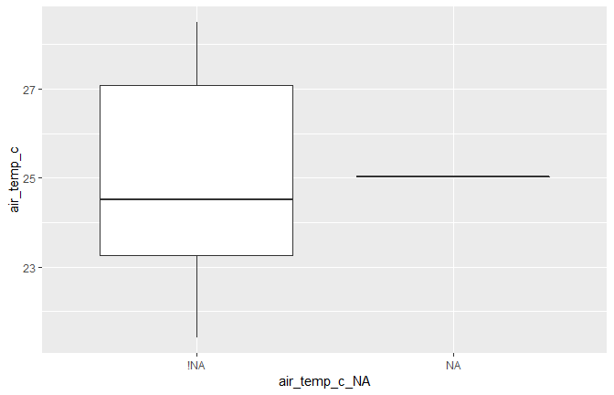

Dealing with Missing Data
================
Koji Mizumura
2019-4-1 - 2019-04-16

  - [Why care about missing data (NA)](#why-care-about-missing-data-na)
      - [Introduction](#introduction)
      - [Using and finding missing
        values](#using-and-finding-missing-values)
      - [How many missing values are
        there?](#how-many-missing-values-are-there)
      - [Working with missing values](#working-with-missing-values)
      - [Why care about missing values?](#why-care-about-missing-values)
      - [Summarizing missingness](#summarizing-missingness)
      - [Tabulating Missingness](#tabulating-missingness)
      - [Other summaries of
        missingness](#other-summaries-of-missingness)
      - [how do we visualize missing
        values?](#how-do-we-visualize-missing-values)
      - [Your first missing data
        visualizations](#your-first-missing-data-visualizations)
      - [Visualizing missing cases and
        variables](#visualizing-missing-cases-and-variables)
      - [Visualizing missingess
        patterns](#visualizing-missingess-patterns)
  - [Wrangling and tidying up missing
    values](#wrangling-and-tidying-up-missing-values)
      - [Searching for and replacing missing
        values](#searching-for-and-replacing-missing-values)
          - [Scoped variances of
            `replace_with_na`](#scoped-variances-of-replace_with_na)
      - [Using `miss_scan_count()`](#using-miss_scan_count)
      - [Using `replace_with_na`](#using-replace_with_na)
      - [Using replace\_with\_na scoped
        variants](#using-replace_with_na-scoped-variants)
      - [Filling down missing values](#filling-down-missing-values)
      - [Fix implicit missings using
        `complete()`](#fix-implicit-missings-using-complete)
      - [Fix explicit missings using
        `fill()`](#fix-explicit-missings-using-fill)
      - [Using `complete()` and `fill()`
        together](#using-complete-and-fill-together)
      - [Missing data dependence](#missing-data-dependence)
      - [Exploring missingness
        dependence](#exploring-missingness-dependence)
      - [Further exploring missingeness
        dependence](#further-exploring-missingeness-dependence)
  - [Testing missing relationships](#testing-missing-relationships)
      - [Missing data workflows: the shadow matrix and nabular
        data](#missing-data-workflows-the-shadow-matrix-and-nabular-data)
      - [Creating shadow matrix data](#creating-shadow-matrix-data)
      - [Performing grouped summaries of
        missingness](#performing-grouped-summaries-of-missingness)
      - [Further exploring more combinations of
        missingness](#further-exploring-more-combinations-of-missingness)
      - [Visualizing missingness across one
        variable](#visualizing-missingness-across-one-variable)
      - [Nabular data and filling by
        missingness](#nabular-data-and-filling-by-missingness)
      - [Nabular data and summarising by
        missingness](#nabular-data-and-summarising-by-missingness)
      - [Explore variation by
        missingness:boxplots](#explore-variation-by-missingnessboxplots)
      - [Visualizing missingenss across two
        variables](#visualizing-missingenss-across-two-variables)
      - [Exploring missing data with
        scatterplots](#exploring-missing-data-with-scatterplots)
      - [Using facets to explore
        missingness](#using-facets-to-explore-missingness)
      - [Faceting to explore missingness (multiple
        plots)](#faceting-to-explore-missingness-multiple-plots)
  - [Connecting the dots (Imputation)](#connecting-the-dots-imputation)
      - [Filling in the blanks](#filling-in-the-blanks)
      - [Impute data below range with nabular
        data](#impute-data-below-range-with-nabular-data)
      - [Visualize imputed values in a
        scatterplot](#visualize-imputed-values-in-a-scatterplot)
      - [Create histogram of imputed
        data](#create-histogram-of-imputed-data)
      - [What makes a good imputation](#what-makes-a-good-imputation)
      - [Evaluating bad imputations](#evaluating-bad-imputations)
      - [Evaluating imputations: The
        scale](#evaluating-imputations-the-scale)
      - [Evaluating imputations: Across many
        variables](#evaluating-imputations-across-many-variables)
      - [Performing imputations](#performing-imputations)

# Why care about missing data (NA)

``` r
library(tidyverse)
library(magrittr)
```

## Introduction

  - working with real-world data = working with missing data
  - Missing data can have unexpected effects on the analysis
  - Bad imputation can lead to poor estimates and decisions

We will learn;

  - What missing values are
  - How to find missing data
  - How to wrangle and tidy missing data
  - Explore why is data missing

The definition is

> missing values are values that should have been recored but were not.

``` r
x <- c(1,NA,3,NA,NA,5)

any_na(x)
are_na(x)
n_miss(x)
prop_miss(x)
```

## Using and finding missing values

When working with missing data, there are a couple of commands that you
should be familiar with - firstly, you should be able to identify if
there are any missing values, and where these are.

Using the `any_na()` and `are_na()` tools, identify which values are
missing.

``` r
# Create x, a vector, with values NA, NaN, Inf, ".", and "missing"
x <- c(NA, NaN, Inf, ".", "missing")

library(rlang)
library(Kmisc)


# Use any_na() and are_na() on to explore the missings
any_na(x)
are_na(x)
```

## How many missing values are there?

One of the first things that you will want to check with a new dataset
is if there are any missing missing values, and how many there are.

You could use `are_na()` to and count up the missing values, but the
most efficient way to count missings is to use the `n_miss()` function.
This will tell you the total number of missing values in the data.

You can then find the percent of missing values in the data with the
pct\_miss function. This will tell you the percentage of missing values
in the data.

``` r
# Use n_miss() to count the total number of missing values in dat_hw

head(dat_hw)
n_miss(dat_hw)

# Use n_miss() on dat_hw$weight to count the total number of missing values
n_miss(dat_hw$weight)

# Use n_complete() on dat_hw to count the total number of complete values
n_complete(dat_hw)

# Use n_complete() on dat_hw$weight to count the total number of complete values
n_complete(dat_hw$weight)

# Use prop_miss() and prop_complete() on dat_hw to count the total number of missing values in each of the variables
prop_miss(dat_hw)
prop_complete(dat_hw)
```

## Working with missing values

R stores missing values as NA, which have some special behavior. Now
that you can define missing data and understand how R stores missing
values, can you predict what will happen when we operate with some
missing values?

What is the output of the following four commands in R? Try them out in
the code console to test them before you submit your answer.

## Why care about missing values?

Two summaries 1. Basic summaries of missingness: `n_miss`, `n_complete`
2. Dataframe summaries of missingness: `miss_var_summary`,
`miss_case_summary`

These functions work with `group_by`, dplyr functions.

## Summarizing missingness

Now that you understand the behavior of missing values in R, and how to
count them, let’s scale up our summaries for cases (rows) and variables,
using `miss_var_summary()` and `miss_case_summary()`, and also explore
how they can be applied for groups in a dataframe, using the group\_by
function from dplyr.

``` r
# Summarise missingness in each variable of the `airquality` dataset
library(naniar)
miss_var_summary(airquality)
## # A tibble: 6 x 3
##   variable n_miss pct_miss
##   <chr>     <int>    <dbl>
## 1 Ozone        37    24.2 
## 2 Solar.R       7     4.58
## 3 Wind          0     0   
## 4 Temp          0     0   
## 5 Month         0     0   
## 6 Day           0     0

# Summarise missingness in each case of the `airquality` dataset
miss_case_summary(airquality)
## # A tibble: 153 x 3
##     case n_miss pct_miss
##    <int>  <int>    <dbl>
##  1     5      2     33.3
##  2    27      2     33.3
##  3     6      1     16.7
##  4    10      1     16.7
##  5    11      1     16.7
##  6    25      1     16.7
##  7    26      1     16.7
##  8    32      1     16.7
##  9    33      1     16.7
## 10    34      1     16.7
## # ... with 143 more rows

# Return the summary of missingness in each variable, grouped by Month, in the `airquality` dataset
airquality %>% dplyr::group_by(Month) %>% miss_var_summary()
## # A tibble: 25 x 4
##    Month variable n_miss pct_miss
##    <int> <chr>     <int>    <dbl>
##  1     5 Ozone         5     16.1
##  2     5 Solar.R       4     12.9
##  3     5 Wind          0      0  
##  4     5 Temp          0      0  
##  5     5 Day           0      0  
##  6     6 Ozone        21     70  
##  7     6 Solar.R       0      0  
##  8     6 Wind          0      0  
##  9     6 Temp          0      0  
## 10     6 Day           0      0  
## # ... with 15 more rows

# Return the summary of missingness in each case, grouped by Month, in the `airquality` dataset
airquality %>% dplyr::group_by(Month) %>% miss_case_summary()
## # A tibble: 153 x 4
##    Month  case n_miss pct_miss
##    <int> <int>  <int>    <dbl>
##  1     5     5      2       40
##  2     5    27      2       40
##  3     5     6      1       20
##  4     5    10      1       20
##  5     5    11      1       20
##  6     5    25      1       20
##  7     5    26      1       20
##  8     5     1      0        0
##  9     5     2      0        0
## 10     5     3      0        0
## # ... with 143 more rows
```

## Tabulating Missingness

The summaries of missingness we just calculated give us the number and
percentage of missing observations for the cases and variables.

Another way to summarise missingness is by tabulating the number of
times that there are 0, 1, 2, 3, missings in a variable, or in a case.

In this exercise we are going to tabulate the number of missings in each
case and variable using `miss_var_table()` and `miss_case_table()`, and
also combine these summaries with the the `group_by` operator from
`dplyr`. to explore the summaries over a grouping variable in the
dataset.

``` r
# Tabulate missingness in each variable and case of the `airquality` dataset
miss_var_table(airquality)
## # A tibble: 3 x 3
##   n_miss_in_var n_vars pct_vars
##           <int>  <int>    <dbl>
## 1             0      4     66.7
## 2             7      1     16.7
## 3            37      1     16.7
miss_case_table(airquality)
## # A tibble: 3 x 3
##   n_miss_in_case n_cases pct_cases
##            <int>   <int>     <dbl>
## 1              0     111     72.5 
## 2              1      40     26.1 
## 3              2       2      1.31

# Tabulate the missingness in each variable, grouped by Month, in the `airquality` dataset
library(dplyr)
airquality %>% group_by(Month) %>% miss_var_table()
## # A tibble: 12 x 4
##    Month n_miss_in_var n_vars pct_vars
##    <int>         <int>  <int>    <dbl>
##  1     5             0      3       60
##  2     5             4      1       20
##  3     5             5      1       20
##  4     6             0      4       80
##  5     6            21      1       20
##  6     7             0      4       80
##  7     7             5      1       20
##  8     8             0      3       60
##  9     8             3      1       20
## 10     8             5      1       20
## 11     9             0      4       80
## 12     9             1      1       20

# Tabulate of missingness in each case, grouped by Month, in the `airquality` dataset
airquality %>% group_by(Month) %>% miss_case_table()
## # A tibble: 11 x 4
##    Month n_miss_in_case n_cases pct_cases
##    <int>          <int>   <int>     <dbl>
##  1     5              0      24     77.4 
##  2     5              1       5     16.1 
##  3     5              2       2      6.45
##  4     6              0       9     30   
##  5     6              1      21     70   
##  6     7              0      26     83.9 
##  7     7              1       5     16.1 
##  8     8              0      23     74.2 
##  9     8              1       8     25.8 
## 10     9              0      29     96.7 
## 11     9              1       1      3.33
```

## Other summaries of missingness

Some summaries of missingness are particularly useful for different
types of data. For example, miss\_var\_span() and miss\_var\_run().

  - `miss_var_span()` calculates the number of missing values in a
    specified variable for a repeating span. This is really useful in
    time series data, to look for weekly (7 day) patterns of missingness

  - `miss_var_run()` calculates the number of “runs” or “streaks” of
    missingness. This is useful to find unusual patterns of missingness,
    for example, you might find a repeating pattern of 5 complete and 5
    missings.

Both `miss_var_span()` and `miss_var_run()` work with the `group_by`
operator from
dplyr.

``` r
# Calculate the summaries for each run of missingness for the variable, hourly_counts
pedestrian %>% colnames()
## [1] "hourly_counts" "date_time"     "year"          "month"        
## [5] "month_day"     "week_day"      "hour"          "sensor_id"    
## [9] "sensor_name"
miss_var_run(pedestrian, var = hourly_counts)
## # A tibble: 35 x 2
##    run_length is_na   
##         <int> <chr>   
##  1       6628 complete
##  2          1 missing 
##  3       5250 complete
##  4        624 missing 
##  5       3652 complete
##  6          1 missing 
##  7       1290 complete
##  8        744 missing 
##  9       7420 complete
## 10          1 missing 
## # ... with 25 more rows

# Calculate the summaries for each span of missingness, for a span of 4000, for the variable hourly_counts
miss_var_span(pedestrian, var = hourly_counts, span_every = 4000)
## # A tibble: 10 x 5
##    span_counter n_miss n_complete prop_miss prop_complete
##           <int>  <int>      <dbl>     <dbl>         <dbl>
##  1            1      0       4000   0               1    
##  2            2      1       3999   0.00025         1.000
##  3            3    121       3879   0.0302          0.970
##  4            4    503       3497   0.126           0.874
##  5            5    745       3255   0.186           0.814
##  6            6      0       4000   0               1    
##  7            7      1       3999   0.00025         1.000
##  8            8      0       4000   0               1    
##  9            9    745       3255   0.186           0.814
## 10           10    432       3568   0.108           0.892

# For each `month` variable, calculate the run of missingness for hourly_counts
pedestrian %>% group_by(month) %>% miss_var_run(var = hourly_counts)
## # A tibble: 51 x 3
##    month    run_length is_na   
##    <ord>         <int> <chr>   
##  1 January        2976 complete
##  2 February       2784 complete
##  3 March          2976 complete
##  4 April           888 complete
##  5 April           552 missing 
##  6 April          1440 complete
##  7 May             744 complete
##  8 May              72 missing 
##  9 May            2160 complete
## 10 June           2880 complete
## # ... with 41 more rows

# For each `month` variable, calculate the span of missingness of a span of 2000, for the variable hourly_counts
pedestrian %>% group_by(month) %>% miss_var_span(var = hourly_counts, span_every = 2000)
## # A tibble: 25 x 6
##    month    span_counter n_miss n_complete prop_miss prop_complete
##    <ord>           <int>  <int>      <dbl>     <dbl>         <dbl>
##  1 January             1      0       2000     0             1    
##  2 January             2      0       2000     0             1    
##  3 February            1      0       2000     0             1    
##  4 February            2      0       2000     0             1    
##  5 March               1      0       2000     0             1    
##  6 March               2      0       2000     0             1    
##  7 April               1    552       1448     0.276         0.724
##  8 April               2      0       2000     0             1    
##  9 May                 1     72       1928     0.036         0.964
## 10 May                 2      0       2000     0             1    
## # ... with 15 more rows
```

## how do we visualize missing values?

Built-in visualization in `naniar` package.

We will cover: - How to get a bird’s eye view of the data - How to look
at missings in the variable and cases - How to generate visualizations
for missing spans and across groups in thd
data

``` r
naniar::vis_miss(airquality)
```


``` r

# actiate clustering
naniar::vis_miss(airquality, cluster = T)
```


When we want to look at missings in variables and cases.

``` r
library(naniar)
gg_miss_var(airquality)
```


``` r
gg_miss_case(airquality)
```


`gg_miss_var` and `gg_miss_case` can be used for faceting
together.

``` r
gg_miss_var(airquality, facet = Month)
```


With combination, we can use `gg_miss_upset`

``` r
library(UpSetR)

airquality %>% 
  as_shadow_upset() %>% 
  upset()
```


``` r

# gg_miss_upset(airquality)
```

``` r
gg_miss_fct(x = airquality, fct = Month)
```


``` r
gg_miss_span(pedestrian, hourly_counts,
             span_every = 3000)
```


## Your first missing data visualizations

It can be difficult to get a handle on where the missing values are in
your data, and here is where visualization can really help.

The function `vis_miss()` creates an overview visualization of the
missingness in the data. It also has options to cluster rows based on
missingness, using `cluster = TRUE`; as well as options for sorting the
columns, from most missing to least missing (`sort_miss = TRUE`).

``` r
# Visualize all of the missingness in the `riskfactors`  dataset
vis_miss(riskfactors)
```


``` r

# Visualize and cluster all of the missingness in the `riskfactors` dataset
vis_miss(riskfactors, cluster = TRUE)
```


``` r

# visualise and sort the columns by missingness in the `riskfactors` dataset
vis_miss(riskfactors, sort_miss = TRUE)
```


## Visualizing missing cases and variables

To get a clear picture of the missingness across variables and cases,
use `gg_miss_var()` and `gg_miss_case()`. These are the visual
counterpart to `miss_var_summary()` and `miss_case_summary()`.

These can be split up into multiple plots with one for each category by
choosing a variable to facet by.

``` r
# Visualize the number of missings in cases using `gg_miss_case()`
gg_miss_case(riskfactors)
```


``` r

# Explore the number of missings in cases using `gg_miss_case()` and facet by the variable `education`
gg_miss_case(riskfactors, facet = education)
```


``` r

# Visualize the number of missings in variables using `gg_miss_var()`
gg_miss_var(riskfactors)
```


``` r

# Explore the number of missings in variables using `gg_miss_var()` and facet by the variable `education`
gg_miss_var(riskfactors, facet = education)
```


## Visualizing missingess patterns

Let’s practice a few different ways to visualize patterns of missingness
using:

  - `gg_miss_upset()` to give an overall pattern of missingness.
  - `gg_miss_fct()` for a dataset that has a factor of interest:
    marriage.
  - and `gg_miss_span()` to explore the missingness in a time series
    dataset.

<!-- end list -->

``` r
# Using the airquality dataset, explore the missingness pattern using gg_miss_upset()
library(naniar)
gg_miss_upset(airquality)
```


``` r

# With the riskfactors dataset, explore how the missingness changes across the marital variable using gg_miss_fct()
gg_miss_fct(x = riskfactors, fct = marital)
```


``` r

# Using the pedestrian dataset, explore how the missingness of hourly_counts changes over a span of 3000 
gg_miss_span(pedestrian, var = hourly_counts, span_every = 3000)
```


``` r

# Using the pedestrian dataset, explore the impact of month by facetting by month
# and explore how missingness changes for a span of 1000
gg_miss_span(pedestrian, var = hourly_counts , span_every = 1000, facet = month)
```


# Wrangling and tidying up missing values

## Searching for and replacing missing values

  - How to look for hidden missing values
  - Replacing missing value labels with `NA`
  - Checking your assumptions on missingness

To search for and replace missing values

The idea is NA, however, it can be coded incorrectly (e.g., “missing”
etc.).

``` r
chaos <- tibble::tribble(
  ~ score, ~ grade, ~ place,
  3, "N/A", -99,
  -99, "E", 97,
  4, "missing", 95,
  -99, "na", 92,
  7, "n/a", -98,
  1, " ", "missing",
  12, ".", 88,
  16, " ", ".",
  9, "N/a", 86
)

chaos
## # A tibble: 9 x 3
##   score grade   place  
##   <dbl> <chr>   <chr>  
## 1     3 N/A     -99    
## 2   -99 E       97     
## 3     4 missing 95     
## 4   -99 na      92     
## 5     7 n/a     -98    
## 6     1 " "     missing
## 7    12 .       88     
## 8    16 " "     .      
## 9     9 N/a     86
```

``` r
chaos %>% 
  miss_scan_count(search = list("N/A", "N/a"))
## # A tibble: 3 x 2
##   Variable     n
##   <chr>    <int>
## 1 score        0
## 2 grade        2
## 3 place        0
```

``` r

chaos %>% 
  replace_with_na(
    replace = list(grade = c("N/A", "N/a"))
  )
## # A tibble: 9 x 3
##   score grade   place  
##   <dbl> <chr>   <chr>  
## 1     3 <NA>    -99    
## 2   -99 E       97     
## 3     4 missing 95     
## 4   -99 na      92     
## 5     7 n/a     -98    
## 6     1 " "     missing
## 7    12 .       88     
## 8    16 " "     .      
## 9     9 <NA>    86
```

### Scoped variances of `replace_with_na`

`replace_with_na` can be repetitive:

  - Use it across many different variables and values
  - Complex cases, replacing values less than -1, only affect character
    columns.

Thus, there are other functions 1. `replace_with_na_all()`: All
variables 2. `replace_with_na_at()`: A subset of selected viriables. 3.
`replace_with_na_if()`: A subset of variables that fullfill some
conditions (numeric, character)

``` r
chaos %>% 
  replace_with_na_all(condition = ~.x==-99)
## # A tibble: 9 x 3
##   score grade   place  
##   <dbl> <chr>   <chr>  
## 1     3 N/A     <NA>   
## 2    NA E       97     
## 3     4 missing 95     
## 4    NA na      92     
## 5     7 n/a     -98    
## 6     1 " "     missing
## 7    12 .       88     
## 8    16 " "     .      
## 9     9 N/a     86

chaos %>% 
  replace_with_na_all(condition =  ~ .x %in% c("N/A", "missing", "na"))
## # A tibble: 9 x 3
##   score grade place
##   <dbl> <chr> <chr>
## 1     3 <NA>  -99  
## 2   -99 E     97   
## 3     4 <NA>  95   
## 4   -99 <NA>  92   
## 5     7 n/a   -98  
## 6     1 " "   <NA> 
## 7    12 .     88   
## 8    16 " "   .    
## 9     9 N/a   86
```

## Using `miss_scan_count()`

You have a dataset with missing values coded as `"N/A"`, `"missing"`,
and `"na"`. But before we go ahead and start replacing these with `NA`,
we should get an idea of how big the problem is.

Use `miss_scan_count` to count the possible missings in the dataset,
`pacman`, a dataset of pacman scores, containing three columns:

  - `year`: the year that person made that score.
  - `initial`: the initials of the person.
  - `score`: the scores of that person.

<!-- end list -->

``` r
library(pacman)

# Explore the strange missing values "N/A"
miss_scan_count(data = pacman, search = list("N/A"))

# Explore the strange missing values "missing"
miss_scan_count(data = pacman, search = list("missing"))

# Explore the strange missing values "na"
miss_scan_count(data = pacman, search = list("na"))

# Explore the strange missing values " " (a single space)
miss_scan_count(data = pacman, search = list(" "))

# Explore all of the strange missing values, "N/A", "missing", "na", " "
miss_scan_count(data = pacman, search = list("N/A", "missing", "na", " "))
```

## Using `replace_with_na`

Following on from the previous dataset, we now know that we have a few
strange missing values.

Now, we are going to do something about it, and replace these values
with missings (e.g. `NA`) using the function `replace_with_na()`.

``` r
# Print the top of the pacman data using `head()`
head(pacman)

# Replace the strange missing values "N/A", "na", and "missing" with `NA` for the variables, year, and score
pacman_clean <- replace_with_na(pacman, replace = list(year = c("N/A", "na", "missing"),
                                score = c("N/A", "na", "missing")))
                                        
# Test if `pacman_clean` still has these values in it?
miss_scan_count(pacman_clean, search = list("N/A", "na", "missing"))
```

## Using replace\_with\_na scoped variants

To reduce code repetition when replacing values with `NA`, use the
“scoped vatriants” of `replace_with_na()`:

  - `replace_with_na_at()`
  - `replace_with_na_if()`
  - `replace_with_na_all()`

The syntax of replacement looks like this:

``` r
~.x == "N/A"
```

This replaces all cases that are equal to “N/A”.

``` r
~.x %in% c("N/A", "missing", "na", " ")
```

Replaces all cases that have “N/A”, “missing”, “na”, or " ".

``` r
# Use `replace_with_na_at()` to replace with NA
replace_with_na_at(pacman,
                   .vars = c("year", "month", "day"), 
                   ~.x %in% c("N/A", "missing", "na", " "))

# Use `replace_with_na_if()` to replace with NA the character values using `is.character`
replace_with_na_if(pacman,
                   .predicate = is.character, 
                   ~.x %in% c("N/A", "missing", "na", " "))

# Use `replace_with_na_all()` to replace with NA
replace_with_na_all(pacman, ~.x %in% c("N/A", "missing", "na", " "))
```

## Filling down missing values

How to handle implicit missing values.

Perspective on missing data,

  - Explicitly: They are missing with `NA`
  - Implicitly: Not shown in the data, but implied

We will use `tidyr::complete` for checking implicit missingness.

``` r
tetris %>% 
  tidyr::complete(name, time)
```

Sometimes, the `tidyr::fill` is useful for filling data. But, the
warning is that it only solves only a few missing data problems.

## Fix implicit missings using `complete()`

We are going to explore a new dataset, `frogger`.

This dataset contains 4 scores per player recorded at different times:

  - `morning`
  - `afternoon`
  - `evening`
  - `late_night`

Every player should have played 4 games, one at each of these times, but
it looks like not every player completed all of these games.

Use the `complete()` function to make these implicit missing values
explicit

``` r
# Print the frogger data to have a look at it
frogger

# Use `complete()` on the `time` variable to make implicit missing values explicit
frogger_tidy <- frogger %>% complete(name, time)
```

## Fix explicit missings using `fill()`

One type of missing value that can be obvious to deal with is where the
first entry of a group is where the first entry of a group is given, but
subsequent entries are marked `NA`.

These missing values often result from empty values in spreadsheets to
avoid entering multiple names multiple times; as well as for “human
readability”.

This type of problem can be solved by using the `fill()` function. from
the `tidyr` package.

``` r
# Print the frogger data to have a look at it
frogger

# Use `fill()` to fill down the name variable in the frogger dataset
frogger %>% fill(name)
```

## Using `complete()` and `fill()` together

Use `complete()` and `fill()` together to fix explicit and implicitly
missing values in the frogger dataset.

``` r
# Print the frogger data to have a look at it
frogger

# Correctly fill() and complete() missing values so that our dataset becomes sensible

frogger %>% 
  fill(name) %>%
  complete(name, time)
```

## Missing data dependence

  - **MCAR**: missing completely at random
  - **MAR**: missing at random
  - **MNAR**: Missing not at random

MCAR, missingness has no association with any data you have observed, or
not observed.

For **MCAR**, the imputation is advisable. Deleting observation may
reduce sample size, limiting inference, but will not bias.

MAR, missing depends on data observed, but not data observed.

For **MAR**, the imputation is recommended, delteting observaion is not
ideal, as it may lead to bias.

MNAR, missingness of the reponse is related to an unobserved value
relevant to the asessment of interest.

For **MNAR**, data will be biased from deletion and imoutation,
inference can be limited, proceed with caution.

## Exploring missingness dependence

To learn about the structure of the missingness in data, you can explore
how sorting changes how missingness is presented.

For the `oceanbuoys` dataset, explore the missingness with `vis_miss()`,
and then arrange by a few different variables

This is not a definitive process, but it will get you started to ask the
right questions of your data. We explore more powerful techniques in the
next chapter.

``` r
# naniar::vis_miss()
# Arrange by year
oceanbuoys %>% arrange(year) %>% vis_miss()
```


``` r

# Arrange by latitude
oceanbuoys %>% arrange(latitude) %>% vis_miss()
```


``` r

# Arrange by wind_ew (wind east west)
oceanbuoys %>% arrange(wind_ew) %>% vis_miss()
```


## Further exploring missingeness dependence

Using the information from earlier on the oceanbuoys dataset, which of
these statements makes the most appropriate statement on the missingness
type?

Try using gg\_miss\_var(), and gg\_miss\_case(), facetting by year to
get more information. For example:

``` r
library(naniar)
gg_miss_var(oceanbuoys, facet = year)
```


# Testing missing relationships

## Missing data workflows: the shadow matrix and nabular data

Census data containing, `income` and `education`

Shadow matrix is a clear representation of binary form of data(`0`, `1`
or `!NA` or `NA`). The two main features are

1.  Coordinated names
2.  Clear values

Nabular data can be used instead of shadow matrix (The nabular data
include both NA and original data input). The nabular data can be
created by `bind_shadow`.

## Creating shadow matrix data

Missing data can be tricky to think about, as they don’t usually
proclaim themselves for you, and instead hide amongst the weeds of the
data.

One way to help expose missing values is to change the way we think
about the data - by thinking about every single data value being missing
or not missing.

The `as_shadow()` function in R transforms a dataframe into a shadow
matrix, a special data format where the values are either missing
(`NA`), or Not Missing (`!NA`).

``` r
# Create shadow matrix data with `as_shadow()`
as_shadow(oceanbuoys)
## # A tibble: 736 x 8
##    year_NA latitude_NA longitude_NA sea_temp_c_NA air_temp_c_NA humidity_NA
##    <fct>   <fct>       <fct>        <fct>         <fct>         <fct>      
##  1 !NA     !NA         !NA          !NA           !NA           !NA        
##  2 !NA     !NA         !NA          !NA           !NA           !NA        
##  3 !NA     !NA         !NA          !NA           !NA           !NA        
##  4 !NA     !NA         !NA          !NA           !NA           !NA        
##  5 !NA     !NA         !NA          !NA           !NA           !NA        
##  6 !NA     !NA         !NA          !NA           !NA           !NA        
##  7 !NA     !NA         !NA          !NA           !NA           !NA        
##  8 !NA     !NA         !NA          !NA           !NA           !NA        
##  9 !NA     !NA         !NA          !NA           !NA           !NA        
## 10 !NA     !NA         !NA          !NA           !NA           !NA        
## # ... with 726 more rows, and 2 more variables: wind_ew_NA <fct>,
## #   wind_ns_NA <fct>

# Create nabular data by binding the shadow to the data with `bind_shadow()`
bind_shadow(oceanbuoys)
## # A tibble: 736 x 16
##     year latitude longitude sea_temp_c air_temp_c humidity wind_ew wind_ns
##    <dbl>    <dbl>     <dbl>      <dbl>      <dbl>    <dbl>   <dbl>   <dbl>
##  1  1997        0      -110       27.6       27.1     79.6   -6.40    5.40
##  2  1997        0      -110       27.5       27.0     75.8   -5.30    5.30
##  3  1997        0      -110       27.6       27       76.5   -5.10    4.5 
##  4  1997        0      -110       27.6       26.9     76.2   -4.90    2.5 
##  5  1997        0      -110       27.6       26.8     76.4   -3.5     4.10
##  6  1997        0      -110       27.8       26.9     76.7   -4.40    1.60
##  7  1997        0      -110       28.0       27.0     76.5   -2       3.5 
##  8  1997        0      -110       28.0       27.1     78.3   -3.70    4.5 
##  9  1997        0      -110       28.0       27.2     78.6   -4.20    5   
## 10  1997        0      -110       28.0       27.2     76.9   -3.60    3.5 
## # ... with 726 more rows, and 8 more variables: year_NA <fct>,
## #   latitude_NA <fct>, longitude_NA <fct>, sea_temp_c_NA <fct>,
## #   air_temp_c_NA <fct>, humidity_NA <fct>, wind_ew_NA <fct>,
## #   wind_ns_NA <fct>

# Bind only the variables with missing values by using bind_shadow(only_miss = TRUE)
bind_shadow(oceanbuoys, only_miss = TRUE)
## # A tibble: 736 x 11
##     year latitude longitude sea_temp_c air_temp_c humidity wind_ew wind_ns
##    <dbl>    <dbl>     <dbl>      <dbl>      <dbl>    <dbl>   <dbl>   <dbl>
##  1  1997        0      -110       27.6       27.1     79.6   -6.40    5.40
##  2  1997        0      -110       27.5       27.0     75.8   -5.30    5.30
##  3  1997        0      -110       27.6       27       76.5   -5.10    4.5 
##  4  1997        0      -110       27.6       26.9     76.2   -4.90    2.5 
##  5  1997        0      -110       27.6       26.8     76.4   -3.5     4.10
##  6  1997        0      -110       27.8       26.9     76.7   -4.40    1.60
##  7  1997        0      -110       28.0       27.0     76.5   -2       3.5 
##  8  1997        0      -110       28.0       27.1     78.3   -3.70    4.5 
##  9  1997        0      -110       28.0       27.2     78.6   -4.20    5   
## 10  1997        0      -110       28.0       27.2     76.9   -3.60    3.5 
## # ... with 726 more rows, and 3 more variables: sea_temp_c_NA <fct>,
## #   air_temp_c_NA <fct>, humidity_NA <fct>
```

## Performing grouped summaries of missingness

Now that you can create nabular data, let’s use it to explore the data.
Let’s calculate summary statistics based on the missingness of another
variable.

To do this we are going to use the following steps:

  - First, `bind_shadow()` turns the data into nabular data.
  - Next, perform some summaries on the data using `group_by()` and
    `summarise()` to calculate the mean and standard deviation, using
    the `mean()` and `sd()` functions.

<!-- end list -->

``` r
# `bind_shadow()` and `group_by()` humidity missingness (`humidity_NA`)
oceanbuoys %>%
  bind_shadow() %>%
  group_by(humidity_NA) %>% 
  summarise(wind_ew_mean = mean(wind_ew), # calculate mean of wind_ew
            wind_ew_sd = sd(wind_ew)) # calculate standard deviation of wind_ew
## # A tibble: 2 x 3
##   humidity_NA wind_ew_mean wind_ew_sd
##   <fct>              <dbl>      <dbl>
## 1 !NA                -3.78       1.90
## 2 NA                 -3.30       2.31
  
# Repeat this, but calculating summaries for wind north south (`wind_ns`).
oceanbuoys %>%
  bind_shadow() %>%
  group_by(humidity_NA) %>%
  summarise(wind_ns_mean = mean(wind_ns),
            wind_ns_sd = sd(wind_ns))
## # A tibble: 2 x 3
##   humidity_NA wind_ns_mean wind_ns_sd
##   <fct>              <dbl>      <dbl>
## 1 !NA                 2.78       2.06
## 2 NA                  1.66       2.23
```

## Further exploring more combinations of missingness

It can be useful to get a bit of extra information about the number of
cases in each missing condition.

In this exercise, we are going to add information about the number of
observed cases using `n()` inside the `summarise()` function.

We will then add an additional level of grouping by looking at the
combination of humidity being missing (`humidity_NA`) and sea
temperature being missing (`sea_temp_c_NA`).

``` r
# Summarise wind_ew by the missingness of `air_temp_c_NA`
oceanbuoys %>% 
  bind_shadow() %>%
  group_by(air_temp_c_NA) %>%
  summarise(wind_ew_mean = mean(wind_ew),
            wind_ew_sd = sd(wind_ew),
            n_obs = n())
## # A tibble: 2 x 4
##   air_temp_c_NA wind_ew_mean wind_ew_sd n_obs
##   <fct>                <dbl>      <dbl> <int>
## 1 !NA                  -3.91       1.85   655
## 2 NA                   -2.17       2.14    81

# Summarise wind_ew by missingness of `air_temp_c_NA` and `humidity_NA`
oceanbuoys %>% 
  bind_shadow() %>%
  group_by(air_temp_c_NA, humidity_NA) %>%
  summarise(wind_ew_mean = mean(wind_ew),
            wind_ew_sd = sd(wind_ew),
            n_obs = n())
## # A tibble: 4 x 5
## # Groups:   air_temp_c_NA [?]
##   air_temp_c_NA humidity_NA wind_ew_mean wind_ew_sd n_obs
##   <fct>         <fct>              <dbl>      <dbl> <int>
## 1 !NA           !NA                -4.01       1.74   565
## 2 !NA           NA                 -3.24       2.31    90
## 3 NA            !NA                -2.06       2.08    78
## 4 NA            NA                 -4.97       1.74     3
```

## Visualizing missingness across one variable

We explore conditional missings with ggplot

  - How to use nabular data to explore how values change according to
    the other values going missing
  - Explore visualizations:
      - densities
      - boxplots
      - dofferent methods of splitting the visualization

When we want to visualize missings using densities

``` r
ggplot(airquality,
       aes(x=Temp))+
  geom_density()
```


``` r

airquality %>% 
  bind_shadow() %>% 
  ggplot(aes(x=Temp, col=Ozone_NA))+
  geom_density()
```


``` r

airquality %>% 
  bind_shadow() %>% 
  ggplot(aes(x=Temp))+
  geom_density()+
  facet_wrap(~Ozone_NA)
```


``` r

airquality %>% 
  bind_shadow() %>% 
  ggplot(aes(x = Temp,
             color = Ozone_NA))+
  geom_density()+
  facet_wrap(~Solar.R_NA)
```


## Nabular data and filling by missingness

Summary statistics are useful to calculate, but as they say, a picture
tells you a thousand words.

In this exercise, we are going to explore how you can use `nabular` data
to explore the variation in a variable by the missingness of another.

We are going to use the oceanbuoys dataset from
`naniar`.

``` r
# First explore the missingness structure of `oceanbuoys` using `vis_miss()`
vis_miss(oceanbuoys)
```


``` r

# Explore the distribution of `wind_ew` for the missingness of `air_temp_c_NA` using  `geom_density()`
bind_shadow(oceanbuoys) %>%
  ggplot(aes(x = wind_ew, 
             color = air_temp_c_NA)) + 
  geom_density()
```


``` r

# Explore the distribution of sea temperature for the missingness of humidity (humidity_NA) using  `geom_density()`
  bind_shadow(oceanbuoys) %>%
  ggplot(aes(x = sea_temp_c,
             color = humidity_NA)) + 
  geom_density()
```


## Nabular data and summarising by missingness

In this exercise, we are going to explore how to use `nabular` data to
explore the variation in a variable by the missingness of another.

We are going to use the `oceanbuoys` dataset from
`naniar`

``` r
# Explore the distribution of wind east west (`wind_ew`) for the missingness of air temperature using  `geom_density()` and facetting by the missingness of air temperature (`air_temp_c_NA`).
oceanbuoys %>%
  bind_shadow() %>%
  ggplot(aes(x = wind_ew)) + 
  geom_density() + 
  facet_wrap(~air_temp_c_NA)
```


``` r

# Build upon this visualisation by filling by the missingness of humidity (`humidity_NA`).
oceanbuoys %>%
  bind_shadow() %>%
  ggplot(aes(x = wind_ew,
             color = humidity_NA)) + 
  geom_density() + 
  facet_wrap(~humidity_NA)
```


## Explore variation by missingness:boxplots

Previous exercises use `nabular` data along with density plots to
explore the variation in a variable by the missingness of another.

We are going to use the `oceanbuoys` dataset from `naniar`, using
boxplots instead of facets or others to explore different layers of
missingness.

``` r
# Explore the distribution of wind east west (`wind_ew`) for the missingness of air temperature using  `geom_boxplot()`
oceanbuoys %>%
  bind_shadow() %>%
  ggplot(aes(x = air_temp_c_NA,
             y = wind_ew)) + 
  geom_boxplot()
```


``` r

# Build upon this visualisation by facetting by the missingness of humidity (`humidity_NA`).
oceanbuoys %>%
  bind_shadow() %>%
  ggplot(aes(x = air_temp_c_NA,
             y = wind_ew)) + 
  geom_boxplot() + 
  facet_wrap(~humidity_NA)
```


## Visualizing missingenss across two variables

Missing values are typically ignored in the scatterplot.
`geom_miss_point` transforms and impute the missing values in the
dataset. This is utilized with `facet` syntax as well.

``` r
ggplot(airquality,
       aes(x=Ozone, y = Solar.R))+
  geom_point()
```


``` r

ggplot(airquality,
       aes(x=Ozone, y = Solar.R))+
  geom_miss_point()
```


``` r

airquality %>% 
  bind_shadow() %>% 
  ggplot(aes(x = Wind,
             y = Ozone))+
  geom_miss_point()+
  facet_wrap(~Solar.R_NA)
```


## Exploring missing data with scatterplots

Missing values in a scatterplot in `ggplot2` are removed by default,
with a warning.

We can display missing values in a scatterplot, using
`geom_miss_point()` - a special `ggplot2` geom that shifts the missing
values into the plot, displaying them 10% below the minimum of the
variable.

Let’s practice using this visualisation with the `oceanbuoys`
dataset.

``` r
# Explore the missingness in wind and air temperature, and display the missingness using `geom_miss_point()`
ggplot(oceanbuoys,
       aes(x = wind_ew,
           y = air_temp_c)) + 
  geom_miss_point()
```


``` r

# Explore the missingness in humidity and air temperature, and display the missingness using `geom_miss_point()`
ggplot(oceanbuoys,
       aes(x = humidity,
           y = air_temp_c)) + 
  geom_miss_point()
```


## Using facets to explore missingness

Because `geom_miss_point()` is a ggplot geom, you can use it with
`ggplot2` features like facetting.

This means we can rapidly explore the missingness and stay within the
familar bounds of
`ggplot2`.

``` r
# Explore the missingness in wind and air temperature, and display the missingness using `geom_miss_point()`. Facet by year to explore this further.
ggplot(oceanbuoys,
       aes(x = wind_ew,
           y = air_temp_c)) + 
  geom_miss_point() + 
  facet_wrap(~year)
```


``` r

# Explore the missingness in humidity and air temperature, and display the missingness using `geom_miss_point()` Facet by year to explore this further.
ggplot(oceanbuoys,
       aes(x = humidity,
           y = air_temp_c)) + 
  geom_miss_point() + 
  facet_wrap(~year)
```


## Faceting to explore missingness (multiple plots)

Another useful technique with `geommisspoint()` is to explore the
missingness by creating multiple plots.

Just as we have done in the previous exercises, we can use the `nabular`
data to help us create additional facetted plots.

We can even create multiple facetted plots according to values in the
data, such as year, and features of the data, such as
missingness.

``` r
# Use geom_miss_point() and facet_wrap to explore how the missingness in wind_ew and air_temp_c is different for missingness of humidity
bind_shadow(oceanbuoys) %>%
  ggplot(aes(x = wind_ew,
           y = air_temp_c)) + 
  geom_miss_point() + 
  facet_wrap(~humidity_NA)
```


``` r

# Use geom_miss_point() and facet_grid to explore how the missingness in wind_ew and air_temp_c is different for missingness of humidity AND by year - by using `facet_grid(humidity_NA ~ year)`
bind_shadow(oceanbuoys) %>%
  ggplot(aes(x = wind_ew,
             y = air_temp_c)) + 
  geom_miss_point() + 
  facet_grid(humidity_NA~year)
```


# Connecting the dots (Imputation)

## Filling in the blanks

Exloring the missing dat help us to understand the dataset. - **Using
imputation to understand data structure** - **Visualizing + Exploring
imputed values**

1)  Imputing data to explore missingness
2)  Track missing values
3)  Visualize imputed values against data

<!-- end list -->

``` r
impute_below(c(5,6,7,NA,9,10))
## [1]  5.00000  6.00000  7.00000  4.40271  9.00000 10.00000
```

  - `impute_below_if()`:

<!-- end list -->

``` r
impute_below_if(data, is.numeric)
```

  - `impute_below_at()`:

<!-- end list -->

``` r
impute_below_at(data, vars(var1, var2))
```

  - `impute_below_all`

<!-- end list -->

``` r
impute_below_all(data)
```

``` r
df <- tibble(
  var1 = c(5,6,7,NA,9,10)
)

df %>% 
  impute_below_all()
## # A tibble: 6 x 1
##    var1
##   <dbl>
## 1  5   
## 2  6   
## 3  7   
## 4  4.40
## 5  9   
## 6 10

df %>% 
  bind_shadow()
## # A tibble: 6 x 2
##    var1 var1_NA
##   <dbl> <fct>  
## 1     5 !NA    
## 2     6 !NA    
## 3     7 !NA    
## 4    NA NA     
## 5     9 !NA    
## 6    10 !NA

df %>% 
  bind_shadow() %>% 
  impute_below_all()
## # A tibble: 6 x 2
##    var1 var1_NA
##   <dbl> <fct>  
## 1  5    !NA    
## 2  6    !NA    
## 3  7    !NA    
## 4  4.40 NA     
## 5  9    !NA    
## 6 10    !NA
```

We can explore a number of missing for single variable.

``` r
aq_imp <- airquality %>% 
  bind_shadow() %>% 
  impute_below_all()

ggplot(aq_imp,
       aes( x= Ozone,
            fill = Ozone_NA))+
  geom_histogram()+
  facet_wrap(~Month)
```


``` r

ggplot(aq_imp,
       aes( x= Ozone,
            fill = Ozone_NA))+
  geom_histogram()+
  facet_wrap(~Solar.R_NA)
```


To visualize Missing values for two variables, the `add_label_missings`
will do this for us.

``` r
aq_imp <- airquality %>% 
  bind_shadow() %>% 
  add_label_missings() %>% 
  impute_below_all()

ggplot(aq_imp,
       aes(x = Ozone,
           y = Solar.R,
           color = any_missing))+
  geom_point()
```


## Impute data below range with nabular data

We want to keep track of values we imputed. If we don’t, it is very
difficult to assess how good the imputed values are.

We are going to practice imputing data and recreate visualizations in
the previous set of exercises by imputing values below the range of the
data.

This is a very useful way to help further explore missingness, and also
provides the framework for imputing missing values.

First, we are going to impute the data below the range using
`impute_below_all()`, and then visualize the data. We notice that
although we can see where the missing values are in this instance, we
need some way to track them. The track missing data programming pattern
can help with this.

``` r
# Impute the oceanbuoys data below the range using `impute_below`.
ocean_imp <- impute_below_all(oceanbuoys)

# Visualise the new missing values
ggplot(ocean_imp, 
       aes(x = wind_ew, y = air_temp_c)) +  
  geom_point()
```


``` r

# Impute and track data with `bind_shadow`, `impute_below_all`, and `add_label_shadow`
ocean_imp_track <- bind_shadow(oceanbuoys) %>% 
  impute_below_all() %>% 
  add_label_shadow()

# Look at the imputed values
ocean_imp_track
## # A tibble: 736 x 17
##     year latitude longitude sea_temp_c air_temp_c humidity wind_ew wind_ns
##    <dbl>    <dbl>     <dbl>      <dbl>      <dbl>    <dbl>   <dbl>   <dbl>
##  1  1997        0      -110       27.6       27.1     79.6   -6.40    5.40
##  2  1997        0      -110       27.5       27.0     75.8   -5.30    5.30
##  3  1997        0      -110       27.6       27       76.5   -5.10    4.5 
##  4  1997        0      -110       27.6       26.9     76.2   -4.90    2.5 
##  5  1997        0      -110       27.6       26.8     76.4   -3.5     4.10
##  6  1997        0      -110       27.8       26.9     76.7   -4.40    1.60
##  7  1997        0      -110       28.0       27.0     76.5   -2       3.5 
##  8  1997        0      -110       28.0       27.1     78.3   -3.70    4.5 
##  9  1997        0      -110       28.0       27.2     78.6   -4.20    5   
## 10  1997        0      -110       28.0       27.2     76.9   -3.60    3.5 
## # ... with 726 more rows, and 9 more variables: year_NA <fct>,
## #   latitude_NA <fct>, longitude_NA <fct>, sea_temp_c_NA <fct>,
## #   air_temp_c_NA <fct>, humidity_NA <fct>, wind_ew_NA <fct>,
## #   wind_ns_NA <fct>, any_missing <chr>

bind_shadow(oceanbuoys) %>% 
  impute_below_all() %>% 
  add_label_shadow()
## # A tibble: 736 x 17
##     year latitude longitude sea_temp_c air_temp_c humidity wind_ew wind_ns
##    <dbl>    <dbl>     <dbl>      <dbl>      <dbl>    <dbl>   <dbl>   <dbl>
##  1  1997        0      -110       27.6       27.1     79.6   -6.40    5.40
##  2  1997        0      -110       27.5       27.0     75.8   -5.30    5.30
##  3  1997        0      -110       27.6       27       76.5   -5.10    4.5 
##  4  1997        0      -110       27.6       26.9     76.2   -4.90    2.5 
##  5  1997        0      -110       27.6       26.8     76.4   -3.5     4.10
##  6  1997        0      -110       27.8       26.9     76.7   -4.40    1.60
##  7  1997        0      -110       28.0       27.0     76.5   -2       3.5 
##  8  1997        0      -110       28.0       27.1     78.3   -3.70    4.5 
##  9  1997        0      -110       28.0       27.2     78.6   -4.20    5   
## 10  1997        0      -110       28.0       27.2     76.9   -3.60    3.5 
## # ... with 726 more rows, and 9 more variables: year_NA <fct>,
## #   latitude_NA <fct>, longitude_NA <fct>, sea_temp_c_NA <fct>,
## #   air_temp_c_NA <fct>, humidity_NA <fct>, wind_ew_NA <fct>,
## #   wind_ns_NA <fct>, any_missing <chr>
```

## Visualize imputed values in a scatterplot

Now, let’s recreate one of the previous plots we saw in chapter three
that used `geom_miss_point()`.

To do this, we need to impute the data below the range of the data. This
is a special kind of imputation to explore the data. This imputation
will illustrate what we need to practice: how to track missing values.
To impute the data below the range of the data, we use the function
`impute_below_all()`.

``` r
# Impute and track the missing values
ocean_imp_track <- bind_shadow(oceanbuoys) %>% 
  impute_below_all() %>% 
  add_label_shadow()

# Visualise the missingness in wind and air temperature, coloring missing air temp values with air_temp_c_NA
ggplot(ocean_imp_track, 
       aes(x = wind_ew, y = air_temp_c, color = air_temp_c_NA)) + 
  geom_point()
```


``` r

# Visualise humidity and air temp, coloring any missing cases using the variable any_missing
ggplot(ocean_imp_track, 
       aes(x = humidity, y = air_temp_c, color = any_missing)) +  
  geom_point()
```


## Create histogram of imputed data

Now that we can recreate the first visualization of geom\_miss\_point(),
let’s explore how we can apply this to other exploratory tasks.

One useful task is to evaluate the number of missings in a given
variable using a histogram. We can do this using the ocean\_imp\_track
dataset we created in the last exercise, which is loaded into this
session.

``` r
# Explore the values of air_temp_c, visualising the amount of missings with `air_temp_c_NA`.
p <- ggplot(ocean_imp_track, aes(x = air_temp_c, fill = air_temp_c_NA)) +  geom_histogram()

# Expore the missings in humidity using humidity_NA
p2 <- ggplot(ocean_imp_track,  aes(x = humidity, fill = humidity_NA)) + geom_histogram()

# Explore the missings in air_temp_c according to year, using `facet_wrap(~year)`.
p + facet_wrap(~year)
```


``` r

# Explore the missings in humidity according to year, using `facet_wrap(~year)`.
p2 + facet_wrap(~year)
```


## What makes a good imputation

  - Understand good/bad imputations
  - Evaluate missing values(e.g., mean, scale, spread)
  - Using visualization
      - boxplots
      - scatterplots
      - histogram
      - many variables

Bad example is mean imputation. To examine ad imputation, we have

  - `impute_mean(data$variable)`
  - `impute_mean_if(data, is.numeric`
  - `impute_mean_at(data, vars(var1, var2))`
  - `impute_mean_all(data`

Similar to impute below, we can work on vectors, or some conditions.

``` r
aq_impute_mean <-  airquality %>% 
  bind_shadow(only_miss = T) %>% 
  impute_mean_all() %>% 
  add_label_shadow()

aq_impute_mean
## # A tibble: 153 x 9
##    Ozone Solar.R  Wind  Temp Month   Day Ozone_NA Solar.R_NA any_missing
##    <dbl>   <dbl> <dbl> <dbl> <dbl> <dbl> <fct>    <fct>      <chr>      
##  1  41      190    7.4    67     5     1 !NA      !NA        Not Missing
##  2  36      118    8      72     5     2 !NA      !NA        Not Missing
##  3  12      149   12.6    74     5     3 !NA      !NA        Not Missing
##  4  18      313   11.5    62     5     4 !NA      !NA        Not Missing
##  5  42.1    186.  14.3    56     5     5 NA       NA         Missing    
##  6  28      186.  14.9    66     5     6 !NA      NA         Missing    
##  7  23      299    8.6    65     5     7 !NA      !NA        Not Missing
##  8  19       99   13.8    59     5     8 !NA      !NA        Not Missing
##  9   8       19   20.1    61     5     9 !NA      !NA        Not Missing
## 10  42.1    194    8.6    69     5    10 NA       !NA        Missing    
## # ... with 143 more rows
```

When evaluating imputation, explore changes/similarities in

  - the mean/median(boxplot)
  - the spread
  - the scale

<!-- end list -->

``` r
ggplot(aq_impute_mean,
       aes(x = Ozone_NA,
           y = Ozone))+
  geom_boxplot()
```


The spread imputation can be explored by scatter plot. When evaluating
imputation,s explore changes/similarities in

  - **the spread( scatterplot)**

<!-- end list -->

``` r
ggplot(aq_impute_mean,
       aes( x = Ozone,
            y = Solar.R,
            col = any_missing))+
  geom_point()
```


## Evaluating bad imputations

In order to evaluate imputations, it helps to know what something bad
looks like. To explore this, let’s look at a typically bad imputation
method: imputing using the mean value.

In this exercise we are going to explore how the mean imputation method
works using a boxplot, using the `oceanbuoys` dataset.

``` r
# Impute the mean value and track the imputations 
ocean_imp_mean <- bind_shadow(oceanbuoys) %>% 
  impute_mean_all() %>% 
  add_label_shadow()

# Explore the mean values in humidity in the imputed dataset
ggplot(ocean_imp_mean, 
       aes(x = humidity_NA, y = humidity)) + 
  geom_boxplot()
```


``` r

# Explore the values in air temperature in the imputed dataset
ggplot(ocean_imp_mean, 
       aes(x = air_temp_c_NA, y =  air_temp_c)) + 
  geom_boxplot()
```



## Evaluating imputations: The scale

While the mean imputation might not look so bad when we compare it using
a boxplot, it is important to get a sense of the variation in the data.
This is why it is important to explore how the scale and spread of
imputed values changes compared to the data.

One way to evaluate the appropriateness of the scale of the imputations
is to use a scatterplot to explore whether or not the values are
appropriate.

``` r
# Explore imputations in air temperature and humidity, coloring by the variable, any_missing
ggplot(ocean_imp_mean, 
       aes(x = air_temp_c, y = humidity, color = any_missing)) + 
  geom_point()
```


``` r

# Explore imputations in air temperature and humidity, coloring by the variable, any_missing, and faceting by year
ggplot(ocean_imp_mean, 
       aes(x = air_temp_c, y = humidity, color = any_missing)) + 
  geom_point() 
```


``` r
  facet_wrap(~year)
## <ggproto object: Class FacetWrap, Facet, gg>
##     compute_layout: function
##     draw_back: function
##     draw_front: function
##     draw_labels: function
##     draw_panels: function
##     finish_data: function
##     init_scales: function
##     map_data: function
##     params: list
##     setup_data: function
##     setup_params: function
##     shrink: TRUE
##     train_scales: function
##     vars: function
##     super:  <ggproto object: Class FacetWrap, Facet, gg>
```

## Evaluating imputations: Across many variables

So far, we have covered ways to look at individual variables or pairs of
variables and their imputed values. However, sometimes you want to look
at imputations for many variables. To do this, you need to perform some
data munging and re-arranging. This lesson covers how to perform this
data wrangling, which can get a little bit hairy when considering its
usage in `nabular` data. The function, `shadow_long()` gets the data
into the right shape for these kinds of visualizations.

``` r
# Gather the imputed data 
ocean_imp_mean_gather <- shadow_long(ocean_imp_mean,
                                     humidity,
                                     air_temp_c)
# Inspect the data
ocean_imp_mean_gather
## # A tibble: 1,472 x 4
##    variable   value       variable_NA   value_NA
##    <chr>      <chr>       <chr>         <chr>   
##  1 air_temp_c 27.14999962 air_temp_c_NA !NA     
##  2 air_temp_c 27.02000046 air_temp_c_NA !NA     
##  3 air_temp_c 27          air_temp_c_NA !NA     
##  4 air_temp_c 26.93000031 air_temp_c_NA !NA     
##  5 air_temp_c 26.84000015 air_temp_c_NA !NA     
##  6 air_temp_c 26.94000053 air_temp_c_NA !NA     
##  7 air_temp_c 27.04000092 air_temp_c_NA !NA     
##  8 air_temp_c 27.11000061 air_temp_c_NA !NA     
##  9 air_temp_c 27.20999908 air_temp_c_NA !NA     
## 10 air_temp_c 27.25       air_temp_c_NA !NA     
## # ... with 1,462 more rows

# Explore the imputations in a histogram 
ggplot(ocean_imp_mean_gather, 
       aes(x = value, fill = value_NA)) + 
  geom_histogram(stat="count") + 
  facet_wrap(~variable)
```


## Performing imputations

  - `simputation` package for imputation.
  - We will focus on using linear model to impute values with
    `impute_lm`
  - Assess new imputation
  - Build many imputation models
  - Compare imputations across different models and variables.

<!-- end list -->

``` r
df <- tibble::tribble(
  ~y, ~var1, ~var2,
  2.67, 2.43, 3.27,
  3.87, 3.55, 1.45,
  NA, 2.90, 1.49,
  5.21, 2.72, 1.84,
  NA, 4.29, 1.15
)

library(simputation)
df %>% 
  bind_shadow(only_miss = TRUE) %>% 
  add_label_shadow() %>% 
  impute_lm(y~var1+var2)
## # A tibble: 5 x 5
##       y  var1  var2 y_NA  any_missing
## * <dbl> <dbl> <dbl> <fct> <chr>      
## 1  2.67  2.43  3.27 !NA   Not Missing
## 2  3.87  3.55  1.45 !NA   Not Missing
## 3  5.54  2.9   1.49 NA    Missing    
## 4  5.21  2.72  1.84 !NA   Not Missing
## 5  2.56  4.29  1.15 NA    Missing
```

We will use `impute_lm` for `airquality` data.
