Unsupervised Learning
================
Koji Mizumura
2019-04-24

  - [Unsupervised learning](#unsupervised-learning)
      - [k-means clustering](#k-means-clustering)
      - [Results of k-means](#results-of-k-means)
      - [Visualizing and interpreting results of
        kmeans()](#visualizing-and-interpreting-results-of-kmeans)
      - [How kmeans() works and practical
        matters](#how-kmeans-works-and-practical-matters)
          - [Objective](#objective)
          - [For model selection](#for-model-selection)
          - [Determine number of
            clusters](#determine-number-of-clusters)
      - [Handling random algorithms](#handling-random-algorithms)
      - [Selecting number of clusters](#selecting-number-of-clusters)
      - [Practical matters: working with real
        data](#practical-matters-working-with-real-data)
  - [Hierachical clustering](#hierachical-clustering)
      - [Hierarchical clustering with
        results](#hierarchical-clustering-with-results)
      - [Selecting number of clusters](#selecting-number-of-clusters-1)
          - [Dendrogram](#dendrogram)
      - [Cutting the tree](#cutting-the-tree)
      - [Linkage methods](#linkage-methods)
      - [Comparing linkage methods](#comparing-linkage-methods)
      - [Practical matters: scaling](#practical-matters-scaling)
      - [Comparing kmeans() and hclust()](#comparing-kmeans-and-hclust)
  - [Dimensionality reduction by PCA](#dimensionality-reduction-by-pca)
      - [Introduction to PCA](#introduction-to-pca)
      - [PCA using prcomp()](#pca-using-prcomp)
      - [Results of PCA](#results-of-pca)
      - [Additional results of PCA](#additional-results-of-pca)
      - [Variance explained](#variance-explained)
      - [Visualize variance explained](#visualize-variance-explained)
      - [Practical issues with PCA](#practical-issues-with-pca)
      - [Practical issues: scaling](#practical-issues-scaling)
  - [Putting it all together with a case
    study](#putting-it-all-together-with-a-case-study)
      - [Introduction](#introduction)
      - [Preparing the data](#preparing-the-data)
      - [EDA](#eda)
      - [Peform PCA](#peform-pca)
      - [Interpreting PCA results](#interpreting-pca-results)
      - [Variance explained](#variance-explained-1)
      - [Communicating PCA results](#communicating-pca-results)
      - [PCA review and next steps](#pca-review-and-next-steps)

``` r
library(tidyverse)
```

    ## Warning: package 'tidyverse' was built under R version 3.5.1

    ## -- Attaching packages --------

    ## √ ggplot2 3.1.0     √ purrr   0.2.5
    ## √ tibble  1.4.2     √ dplyr   0.7.8
    ## √ tidyr   0.8.1     √ stringr 1.3.1
    ## √ readr   1.1.1     √ forcats 0.3.0

    ## Warning: package 'ggplot2' was built under R version 3.5.1

    ## Warning: package 'purrr' was built under R version 3.5.1

    ## Warning: package 'dplyr' was built under R version 3.5.1

    ## -- Conflicts -----------------
    ## x dplyr::filter() masks stats::filter()
    ## x dplyr::lag()    masks stats::lag()

``` r
library(magrittr)
```

    ## 
    ## Attaching package: 'magrittr'

    ## The following object is masked from 'package:purrr':
    ## 
    ##     set_names

    ## The following object is masked from 'package:tidyr':
    ## 
    ##     extract

# Unsupervised learning

## k-means clustering

We have created some two-dimensional data and stored it in a variable
called `x` in your workspace. The scatter plot on the right is a visual
representation of the data.

In this exercise, your task is to create a k-means model of the x data
using 3 clusters, then to look at the structure of the resulting model
using the `summary()` function.

``` r
iris
```

    ##     Sepal.Length Sepal.Width Petal.Length Petal.Width    Species
    ## 1            5.1         3.5          1.4         0.2     setosa
    ## 2            4.9         3.0          1.4         0.2     setosa
    ## 3            4.7         3.2          1.3         0.2     setosa
    ## 4            4.6         3.1          1.5         0.2     setosa
    ## 5            5.0         3.6          1.4         0.2     setosa
    ## 6            5.4         3.9          1.7         0.4     setosa
    ## 7            4.6         3.4          1.4         0.3     setosa
    ## 8            5.0         3.4          1.5         0.2     setosa
    ## 9            4.4         2.9          1.4         0.2     setosa
    ## 10           4.9         3.1          1.5         0.1     setosa
    ## 11           5.4         3.7          1.5         0.2     setosa
    ## 12           4.8         3.4          1.6         0.2     setosa
    ## 13           4.8         3.0          1.4         0.1     setosa
    ## 14           4.3         3.0          1.1         0.1     setosa
    ## 15           5.8         4.0          1.2         0.2     setosa
    ## 16           5.7         4.4          1.5         0.4     setosa
    ## 17           5.4         3.9          1.3         0.4     setosa
    ## 18           5.1         3.5          1.4         0.3     setosa
    ## 19           5.7         3.8          1.7         0.3     setosa
    ## 20           5.1         3.8          1.5         0.3     setosa
    ## 21           5.4         3.4          1.7         0.2     setosa
    ## 22           5.1         3.7          1.5         0.4     setosa
    ## 23           4.6         3.6          1.0         0.2     setosa
    ## 24           5.1         3.3          1.7         0.5     setosa
    ## 25           4.8         3.4          1.9         0.2     setosa
    ## 26           5.0         3.0          1.6         0.2     setosa
    ## 27           5.0         3.4          1.6         0.4     setosa
    ## 28           5.2         3.5          1.5         0.2     setosa
    ## 29           5.2         3.4          1.4         0.2     setosa
    ## 30           4.7         3.2          1.6         0.2     setosa
    ## 31           4.8         3.1          1.6         0.2     setosa
    ## 32           5.4         3.4          1.5         0.4     setosa
    ## 33           5.2         4.1          1.5         0.1     setosa
    ## 34           5.5         4.2          1.4         0.2     setosa
    ## 35           4.9         3.1          1.5         0.2     setosa
    ## 36           5.0         3.2          1.2         0.2     setosa
    ## 37           5.5         3.5          1.3         0.2     setosa
    ## 38           4.9         3.6          1.4         0.1     setosa
    ## 39           4.4         3.0          1.3         0.2     setosa
    ## 40           5.1         3.4          1.5         0.2     setosa
    ## 41           5.0         3.5          1.3         0.3     setosa
    ## 42           4.5         2.3          1.3         0.3     setosa
    ## 43           4.4         3.2          1.3         0.2     setosa
    ## 44           5.0         3.5          1.6         0.6     setosa
    ## 45           5.1         3.8          1.9         0.4     setosa
    ## 46           4.8         3.0          1.4         0.3     setosa
    ## 47           5.1         3.8          1.6         0.2     setosa
    ## 48           4.6         3.2          1.4         0.2     setosa
    ## 49           5.3         3.7          1.5         0.2     setosa
    ## 50           5.0         3.3          1.4         0.2     setosa
    ## 51           7.0         3.2          4.7         1.4 versicolor
    ## 52           6.4         3.2          4.5         1.5 versicolor
    ## 53           6.9         3.1          4.9         1.5 versicolor
    ## 54           5.5         2.3          4.0         1.3 versicolor
    ## 55           6.5         2.8          4.6         1.5 versicolor
    ## 56           5.7         2.8          4.5         1.3 versicolor
    ## 57           6.3         3.3          4.7         1.6 versicolor
    ## 58           4.9         2.4          3.3         1.0 versicolor
    ## 59           6.6         2.9          4.6         1.3 versicolor
    ## 60           5.2         2.7          3.9         1.4 versicolor
    ## 61           5.0         2.0          3.5         1.0 versicolor
    ## 62           5.9         3.0          4.2         1.5 versicolor
    ## 63           6.0         2.2          4.0         1.0 versicolor
    ## 64           6.1         2.9          4.7         1.4 versicolor
    ## 65           5.6         2.9          3.6         1.3 versicolor
    ## 66           6.7         3.1          4.4         1.4 versicolor
    ## 67           5.6         3.0          4.5         1.5 versicolor
    ## 68           5.8         2.7          4.1         1.0 versicolor
    ## 69           6.2         2.2          4.5         1.5 versicolor
    ## 70           5.6         2.5          3.9         1.1 versicolor
    ## 71           5.9         3.2          4.8         1.8 versicolor
    ## 72           6.1         2.8          4.0         1.3 versicolor
    ## 73           6.3         2.5          4.9         1.5 versicolor
    ## 74           6.1         2.8          4.7         1.2 versicolor
    ## 75           6.4         2.9          4.3         1.3 versicolor
    ## 76           6.6         3.0          4.4         1.4 versicolor
    ## 77           6.8         2.8          4.8         1.4 versicolor
    ## 78           6.7         3.0          5.0         1.7 versicolor
    ## 79           6.0         2.9          4.5         1.5 versicolor
    ## 80           5.7         2.6          3.5         1.0 versicolor
    ## 81           5.5         2.4          3.8         1.1 versicolor
    ## 82           5.5         2.4          3.7         1.0 versicolor
    ## 83           5.8         2.7          3.9         1.2 versicolor
    ## 84           6.0         2.7          5.1         1.6 versicolor
    ## 85           5.4         3.0          4.5         1.5 versicolor
    ## 86           6.0         3.4          4.5         1.6 versicolor
    ## 87           6.7         3.1          4.7         1.5 versicolor
    ## 88           6.3         2.3          4.4         1.3 versicolor
    ## 89           5.6         3.0          4.1         1.3 versicolor
    ## 90           5.5         2.5          4.0         1.3 versicolor
    ## 91           5.5         2.6          4.4         1.2 versicolor
    ## 92           6.1         3.0          4.6         1.4 versicolor
    ## 93           5.8         2.6          4.0         1.2 versicolor
    ## 94           5.0         2.3          3.3         1.0 versicolor
    ## 95           5.6         2.7          4.2         1.3 versicolor
    ## 96           5.7         3.0          4.2         1.2 versicolor
    ## 97           5.7         2.9          4.2         1.3 versicolor
    ## 98           6.2         2.9          4.3         1.3 versicolor
    ## 99           5.1         2.5          3.0         1.1 versicolor
    ## 100          5.7         2.8          4.1         1.3 versicolor
    ## 101          6.3         3.3          6.0         2.5  virginica
    ## 102          5.8         2.7          5.1         1.9  virginica
    ## 103          7.1         3.0          5.9         2.1  virginica
    ## 104          6.3         2.9          5.6         1.8  virginica
    ## 105          6.5         3.0          5.8         2.2  virginica
    ## 106          7.6         3.0          6.6         2.1  virginica
    ## 107          4.9         2.5          4.5         1.7  virginica
    ## 108          7.3         2.9          6.3         1.8  virginica
    ## 109          6.7         2.5          5.8         1.8  virginica
    ## 110          7.2         3.6          6.1         2.5  virginica
    ## 111          6.5         3.2          5.1         2.0  virginica
    ## 112          6.4         2.7          5.3         1.9  virginica
    ## 113          6.8         3.0          5.5         2.1  virginica
    ## 114          5.7         2.5          5.0         2.0  virginica
    ## 115          5.8         2.8          5.1         2.4  virginica
    ## 116          6.4         3.2          5.3         2.3  virginica
    ## 117          6.5         3.0          5.5         1.8  virginica
    ## 118          7.7         3.8          6.7         2.2  virginica
    ## 119          7.7         2.6          6.9         2.3  virginica
    ## 120          6.0         2.2          5.0         1.5  virginica
    ## 121          6.9         3.2          5.7         2.3  virginica
    ## 122          5.6         2.8          4.9         2.0  virginica
    ## 123          7.7         2.8          6.7         2.0  virginica
    ## 124          6.3         2.7          4.9         1.8  virginica
    ## 125          6.7         3.3          5.7         2.1  virginica
    ## 126          7.2         3.2          6.0         1.8  virginica
    ## 127          6.2         2.8          4.8         1.8  virginica
    ## 128          6.1         3.0          4.9         1.8  virginica
    ## 129          6.4         2.8          5.6         2.1  virginica
    ## 130          7.2         3.0          5.8         1.6  virginica
    ## 131          7.4         2.8          6.1         1.9  virginica
    ## 132          7.9         3.8          6.4         2.0  virginica
    ## 133          6.4         2.8          5.6         2.2  virginica
    ## 134          6.3         2.8          5.1         1.5  virginica
    ## 135          6.1         2.6          5.6         1.4  virginica
    ## 136          7.7         3.0          6.1         2.3  virginica
    ## 137          6.3         3.4          5.6         2.4  virginica
    ## 138          6.4         3.1          5.5         1.8  virginica
    ## 139          6.0         3.0          4.8         1.8  virginica
    ## 140          6.9         3.1          5.4         2.1  virginica
    ## 141          6.7         3.1          5.6         2.4  virginica
    ## 142          6.9         3.1          5.1         2.3  virginica
    ## 143          5.8         2.7          5.1         1.9  virginica
    ## 144          6.8         3.2          5.9         2.3  virginica
    ## 145          6.7         3.3          5.7         2.5  virginica
    ## 146          6.7         3.0          5.2         2.3  virginica
    ## 147          6.3         2.5          5.0         1.9  virginica
    ## 148          6.5         3.0          5.2         2.0  virginica
    ## 149          6.2         3.4          5.4         2.3  virginica
    ## 150          5.9         3.0          5.1         1.8  virginica

``` r
# Create the k-means model: km.out
km.out <- kmeans(iris[,1:4], centers=3, nstart=20)

# Inspect the result
summary(km.out)
```

    ##              Length Class  Mode   
    ## cluster      150    -none- numeric
    ## centers       12    -none- numeric
    ## totss          1    -none- numeric
    ## withinss       3    -none- numeric
    ## tot.withinss   1    -none- numeric
    ## betweenss      1    -none- numeric
    ## size           3    -none- numeric
    ## iter           1    -none- numeric
    ## ifault         1    -none- numeric

## Results of k-means

The `kmeans()` function produces several outputs. In the video, we
discussed one output of modeling, the cluster membership.

In this exercise, you will access the `cluster` component directly. This
is useful anytime you need the cluster membership for each observation
of the data used to build the clustering model. A future exercise will
show an example of how this cluster membership might be used to help
communicate the results of k-means modeling.

k-means models also have a print method to give a human friendly output
of basic modeling results. This is available by using `print()` or
simply typing the name of the model.

``` r
# Print the cluster membership component of the model
km.out$cluster
```

    ##   [1] 3 3 3 3 3 3 3 3 3 3 3 3 3 3 3 3 3 3 3 3 3 3 3 3 3 3 3 3 3 3 3 3 3 3 3
    ##  [36] 3 3 3 3 3 3 3 3 3 3 3 3 3 3 3 2 2 1 2 2 2 2 2 2 2 2 2 2 2 2 2 2 2 2 2
    ##  [71] 2 2 2 2 2 2 2 1 2 2 2 2 2 2 2 2 2 2 2 2 2 2 2 2 2 2 2 2 2 2 1 2 1 1 1
    ## [106] 1 2 1 1 1 1 1 1 2 2 1 1 1 1 2 1 2 1 2 1 1 2 2 1 1 1 1 1 2 1 1 1 1 2 1
    ## [141] 1 1 2 1 1 1 2 1 1 2

``` r
# Print the km.out object
km.out
```

    ## K-means clustering with 3 clusters of sizes 38, 62, 50
    ## 
    ## Cluster means:
    ##   Sepal.Length Sepal.Width Petal.Length Petal.Width
    ## 1     6.850000    3.073684     5.742105    2.071053
    ## 2     5.901613    2.748387     4.393548    1.433871
    ## 3     5.006000    3.428000     1.462000    0.246000
    ## 
    ## Clustering vector:
    ##   [1] 3 3 3 3 3 3 3 3 3 3 3 3 3 3 3 3 3 3 3 3 3 3 3 3 3 3 3 3 3 3 3 3 3 3 3
    ##  [36] 3 3 3 3 3 3 3 3 3 3 3 3 3 3 3 2 2 1 2 2 2 2 2 2 2 2 2 2 2 2 2 2 2 2 2
    ##  [71] 2 2 2 2 2 2 2 1 2 2 2 2 2 2 2 2 2 2 2 2 2 2 2 2 2 2 2 2 2 2 1 2 1 1 1
    ## [106] 1 2 1 1 1 1 1 1 2 2 1 1 1 1 2 1 2 1 2 1 1 2 2 1 1 1 1 1 2 1 1 1 1 2 1
    ## [141] 1 1 2 1 1 1 2 1 1 2
    ## 
    ## Within cluster sum of squares by cluster:
    ## [1] 23.87947 39.82097 15.15100
    ##  (between_SS / total_SS =  88.4 %)
    ## 
    ## Available components:
    ## 
    ## [1] "cluster"      "centers"      "totss"        "withinss"    
    ## [5] "tot.withinss" "betweenss"    "size"         "iter"        
    ## [9] "ifault"

## Visualizing and interpreting results of kmeans()

One of the more intuitive ways to interpret the results of k-means
models is by plotting the data as a scatter plot and using color to
label the samples’ cluster membership. In this exercise, you will use
the standard `plot()` function to accomplish this.

To create a scatter plot, you can pass data with two features
(i.e. columns) to `plot()` with an extra argument `col =
km.out$cluster`, which sets the color of each point in the scatter plot
according to its cluster membership.

``` r
# Scatter plot of x
plot(iris, col = km.out$cluster)
```

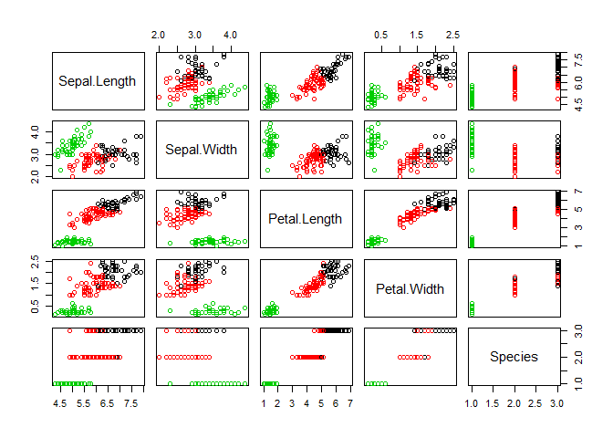<!-- -->

## How kmeans() works and practical matters

### Objective

  - Explain how k-means algorithm is implemented visually
  - Model selection: determining numbers of clusters

### For model selection

  - recall k-means has a random component
  - best outcome is based on total within cluster sum of squares
      - for each cluster
      - For each observation in the cluster
      - Determine squared distance from the observation to cluster
        center
      - sum of them altogether

We can select `nstart`, running algorithm multiple times helps to find
the global minimum total within cluster sum of squares.

``` r
# k-means algorithm with 5 centers, run 20 times
kmeans(x, centers =5, nstart=20)
```

### Determine number of clusters

  - Trial and error is not the best approach
  - One approach is elbow plot.

## Handling random algorithms

``` r
# Set up 2 x 3 plotting grid
par(mfrow = c(2, 3))

# Set seed
set.seed(1)

x <- iris[,1:4]

for(i in 1:6) {
  # Run kmeans() on x with three clusters and one start
  km.out <- kmeans(x, centers = 3, nstart = 1)
  
  # Plot clusters
  plot(x, col = km.out$cluster, 
       main = km.out$tot.withinss)
}
```

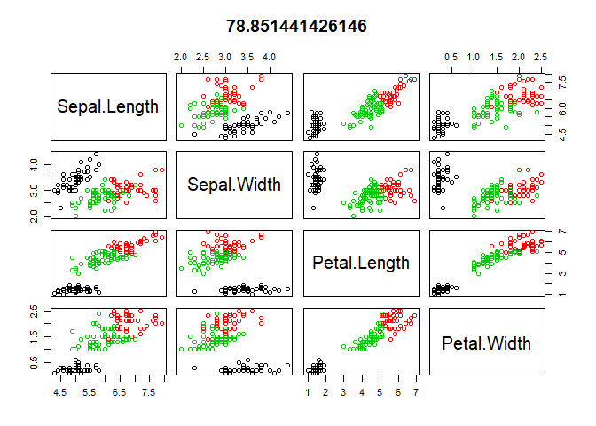<!-- -->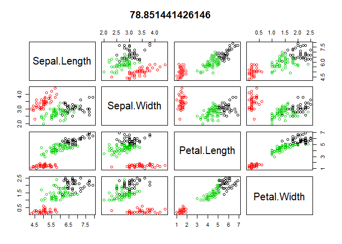<!-- -->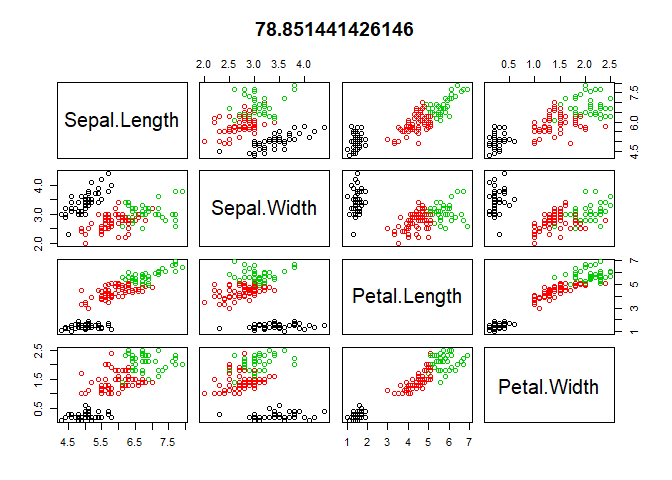<!-- --><!-- -->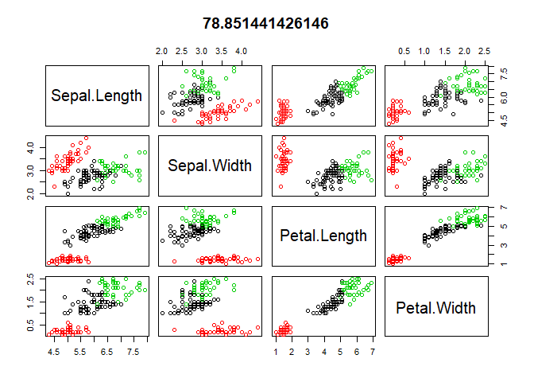<!-- -->

## Selecting number of clusters

The k-means algorithm assumes the number of clusters as part of the
input. If you know the number of clusters in advance (e.g. due to
certain business constraints) this makes setting the number of clusters
easy. However, as you saw in the video, if you do not know the number of
clusters and need to determine it, you will need to run the algorithm
multiple times, each time with a different number of clusters. From
this, you can observe how a measure of model quality changes with the
number of clusters.

In this exercise, you will run `kmeans()` multiple times to see how
model quality changes as the number of clusters changes. Plots
displaying this information help to determine the number of clusters and
are often referred to as scree plots.

The ideal plot will have an elbow where the quality measure improves
more slowly as the number of clusters increases. This indicates that the
quality of the model is no longer improving substantially as the model
complexity (i.e. number of clusters) increases. In other words, the
elbow indicates the number of clusters inherent in the data.

``` r
# Initialize total within sum of squares error: wss
wss <- 0

# For 1 to 15 cluster centers
for (i in 1:15) {
  km.out <- kmeans(x, centers = i, nstart=20)
  # Save total within sum of squares to wss variable
  wss[i] <- km.out$tot.withinss
}

# Plot total within sum of squares vs. number of clusters
plot(1:15, wss, type = "b", 
     xlab = "Number of Clusters", 
     ylab = "Within groups sum of squares")
```

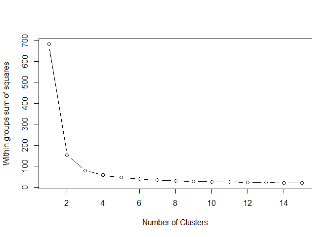<!-- -->

``` r
# Set k equal to the number of clusters corresponding to the elbow location
k <- 2
```

## Practical matters: working with real data

Dealing with real data is often more challenging than dealing with
synthetic data. Synthetic data helps with learning new concepts and
techniques, but the next few exercises will deal with data that is
closer to the type of real data you might find in your professional or
academic pursuits.

The first challenge with the Pokemon data is that there is no
pre-determined number of clusters. You will determine the appropriate
number of clusters, keeping in mind that in real data the elbow in the
scree plot might be less of a sharp elbow than in synthetic data. Use
your judgement on making the determination of the number of clusters.

The second part of this exercise includes plotting the outcomes of the
clustering on two dimensions, or features, of the data. These features
were chosen somewhat arbitrarily for this exercise. Think about how you
would use plotting and clustering to communicate interesting groups of
Pokemon to other people.

An additional note: this exercise utilizes the iter.max argument to
`kmeans()`. As you’ve seen, `kmeans()` is an iterative algorithm,
repeating over and over until some stopping criterion is reached. The
default number of iterations for `kmeans()` is 10, which is not enough
for the algorithm to converge and reach its stopping criterion, so we’ll
set the number of iterations to 50 to overcome this issue. To see what
happens when `kmeans()` does not converge, try running the example with
a lower number of iterations (e.g. 3). This is another example of what
might happen when you encounter real data and use real
cases.

``` r
pokemon <- readr::read_csv("C:/Protected/Data Science/Datacamp/5. Unsupervised learning/Pokemon.csv")
```

    ## Parsed with column specification:
    ## cols(
    ##   Number = col_integer(),
    ##   Name = col_character(),
    ##   Type1 = col_character(),
    ##   Type2 = col_character(),
    ##   Total = col_integer(),
    ##   HitPoints = col_integer(),
    ##   Attack = col_integer(),
    ##   Defense = col_integer(),
    ##   SpecialAttack = col_integer(),
    ##   SpecialDefense = col_integer(),
    ##   Speed = col_integer(),
    ##   Generation = col_integer(),
    ##   Legendary = col_character()
    ## )

``` r
# Initialize total within sum of squares error: wss
wss <- 0
# Look over 1 to 15 possible clusters
for (i in 1:15) {
  # Fit the model: km.out
  km.out <- kmeans(pokemon[,5:12], centers = i, nstart = 20, iter.max = 50)
  # Save the within cluster sum of squares
  wss[i] <- km.out$tot.withinss
}

# Produce a scree plot
plot(1:15, wss, type = "b", 
     xlab = "Number of Clusters", 
     ylab = "Within groups sum of squares")
```

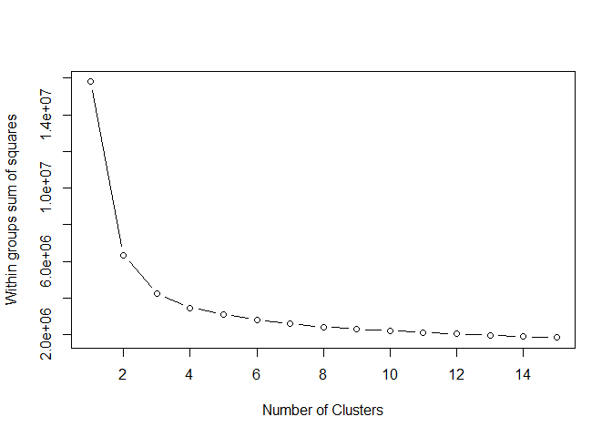<!-- -->

``` r
# Select number of clusters
k <- 3

# Build model with k clusters: km.out
km.out <- kmeans(pokemon[,5:12], centers = k, nstart = 20, iter.max = 50)

# View the resulting model
km.out
```

    ## K-means clustering with 3 clusters of sizes 123, 288, 389
    ## 
    ## Cluster means:
    ##      Total HitPoints    Attack   Defense SpecialAttack SpecialDefense
    ## 1 622.5691  88.91057 117.72358 100.65854     116.33333      101.86179
    ## 2 303.8958  50.14931  53.95486  52.78472      47.85417       49.49306
    ## 3 472.9666  77.19280  85.30077  80.95373      77.54499       79.02057
    ##      Speed Generation
    ## 1 97.08130   3.341463
    ## 2 49.65972   3.315972
    ## 3 72.95373   3.323907
    ## 
    ## Clustering vector:
    ##   [1] 2 3 3 1 2 3 3 1 1 2 3 3 1 2 2 3 2 2 3 3 2 2 3 1 2 3 2 3 2 3 2 3 2 3 2
    ##  [36] 2 3 2 2 3 2 3 2 3 2 3 2 3 2 3 3 2 3 2 3 2 3 2 3 2 3 2 3 2 1 2 2 3 2 3
    ##  [71] 3 1 2 3 3 2 3 3 2 3 2 3 3 3 3 2 3 1 2 3 2 2 3 2 3 2 3 2 3 2 3 3 1 2 2
    ## [106] 3 2 3 2 3 2 3 2 3 3 3 2 2 3 2 3 3 3 3 1 2 3 2 3 2 3 3 3 3 3 3 3 1 3 2
    ## [141] 3 1 3 2 2 3 3 3 3 2 3 2 3 3 1 3 1 1 1 2 3 1 1 1 1 1 2 3 3 2 3 3 2 3 3
    ## [176] 2 3 2 3 2 3 2 3 3 2 3 2 2 2 2 3 2 3 2 2 3 1 3 2 3 3 3 2 2 3 2 2 3 3 2
    ## [211] 3 3 3 3 3 3 2 3 3 2 3 3 3 3 1 2 3 3 3 1 3 3 1 3 2 3 2 3 2 3 2 2 3 2 3
    ## [246] 3 2 3 1 3 2 3 3 3 2 2 3 2 2 2 3 3 1 1 1 2 3 1 1 1 1 1 2 3 3 1 2 3 3 1
    ## [281] 2 3 3 1 2 3 2 3 2 2 3 2 2 2 2 3 2 2 3 2 3 2 3 2 2 3 1 2 3 2 3 2 3 1 2
    ## [316] 3 2 2 2 3 2 3 2 2 2 2 2 3 2 3 2 3 3 1 2 3 3 2 3 1 3 3 3 3 3 2 3 2 3 1
    ## [351] 3 3 2 3 1 3 2 3 2 2 2 3 2 3 2 3 1 3 3 3 3 2 3 2 3 2 3 2 3 2 3 2 3 3 3
    ## [386] 2 3 1 2 3 3 3 3 1 2 2 3 1 2 3 3 2 3 3 3 2 2 3 1 1 2 3 1 1 1 1 1 1 1 1
    ## [421] 1 1 1 1 1 1 1 1 1 1 1 1 2 3 3 2 3 3 2 3 3 2 2 3 2 3 2 2 2 2 3 2 3 2 3
    ## [456] 2 3 2 3 3 3 3 2 3 3 2 3 2 3 2 3 3 2 3 2 3 1 3 3 2 3 2 2 3 2 3 2 2 2 3
    ## [491] 3 2 3 1 1 3 2 3 1 2 3 2 3 2 3 3 2 3 2 2 3 1 3 3 3 3 3 3 3 3 3 3 3 3 3
    ## [526] 3 3 1 3 3 3 3 3 3 3 3 3 1 1 1 1 1 1 1 1 1 1 3 1 1 1 1 1 1 2 3 3 2 3 3
    ## [561] 2 3 3 2 3 2 2 3 2 3 2 3 2 3 2 3 2 3 2 2 3 2 3 2 3 3 2 3 2 3 3 3 2 3 3
    ## [596] 2 2 3 3 3 2 2 3 2 2 3 2 3 2 3 3 2 2 3 2 3 3 3 2 3 2 3 3 2 3 2 3 3 1 2
    ## [631] 3 2 3 2 3 2 3 3 2 2 3 2 3 2 3 3 2 3 3 2 3 2 3 2 3 3 2 3 2 3 2 3 3 2 3
    ## [666] 3 2 3 2 2 3 2 3 3 2 3 3 2 3 3 2 3 3 2 3 2 3 3 2 3 2 3 3 3 2 3 1 2 1 1
    ## [701] 1 1 1 1 1 1 1 1 1 1 1 1 1 1 1 1 1 1 2 3 3 2 3 3 2 3 3 2 3 2 2 3 2 2 3
    ## [736] 2 3 2 2 1 2 3 2 3 3 2 3 3 2 3 3 3 2 3 2 3 2 3 2 3 2 3 2 3 2 3 2 3 2 3
    ## [771] 3 3 3 3 2 3 1 3 2 3 2 2 2 2 3 3 3 3 2 3 2 3 1 1 1 1 1 1 1 1
    ## 
    ## Within cluster sum of squares by cluster:
    ## [1]  908595.3 1152885.3 2189884.7
    ##  (between_SS / total_SS =  73.1 %)
    ## 
    ## Available components:
    ## 
    ## [1] "cluster"      "centers"      "totss"        "withinss"    
    ## [5] "tot.withinss" "betweenss"    "size"         "iter"        
    ## [9] "ifault"

``` r
# Plot of Defense vs. Speed by cluster membership
plot(pokemon[, c("Defense", "Speed")],
     col = km.out$cluster,
     main = paste("k-means clustering of Pokemon with", k, "clusters"),
     xlab = "Defense", ylab = "Speed")
```

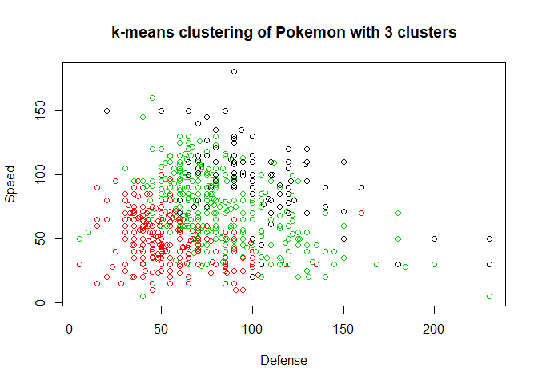<!-- -->

# Hierachical clustering

  - Number of clusters is not know ahead of time
  - Two kinds: bottom-up and top-down, this course bottom-up

<!-- end list -->

``` r
# calculate similarity as Euclidean distance between observations

dist_matrix <- dist(x)

# retruns hierachical clustering model
hclust(d=dist_matrix)
```

    ## 
    ## Call:
    ## hclust(d = dist_matrix)
    ## 
    ## Cluster method   : complete 
    ## Distance         : euclidean 
    ## Number of objects: 150

## Hierarchical clustering with results

In this exercise, you will create your first hierarchical clustering
model using the `hclust()` function.

We have created some data that has two dimensions and placed it in a
variable called `x`. Your task is to create a hierarchical clustering
model of `x`. Remember from the video that the first step to
hierarchical clustering is determining the similarity between
observations, which you will do with the `dist()` function.

You will look at the structure of the resulting model using the
`summary()` function.

``` r
# Create hierarchical clustering model: hclust.out
hclust.out <- hclust(dist(x))

library(magrittr)
x %>% dist() %>% head()
```

    ## [1] 0.5385165 0.5099020 0.6480741 0.1414214 0.6164414 0.5196152

``` r
# Inspect the result
summary(hclust.out)
```

    ##             Length Class  Mode     
    ## merge       298    -none- numeric  
    ## height      149    -none- numeric  
    ## order       150    -none- numeric  
    ## labels        0    -none- NULL     
    ## method        1    -none- character
    ## call          2    -none- call     
    ## dist.method   1    -none- character

## Selecting number of clusters

``` r
# create hierachical cluster model: hclust.out
hclust.out <- hclust(dist(x))

# inspect the results
summary(hclust.out)
```

    ##             Length Class  Mode     
    ## merge       298    -none- numeric  
    ## height      149    -none- numeric  
    ## order       150    -none- numeric  
    ## labels        0    -none- NULL     
    ## method        1    -none- character
    ## call          2    -none- call     
    ## dist.method   1    -none- character

### Dendrogram

Tree shaped strcuture used to interpret hierachical clustering models

``` r
# draw a dendrogram
plot(hclust.out)
abline(h=2, col="red")
```

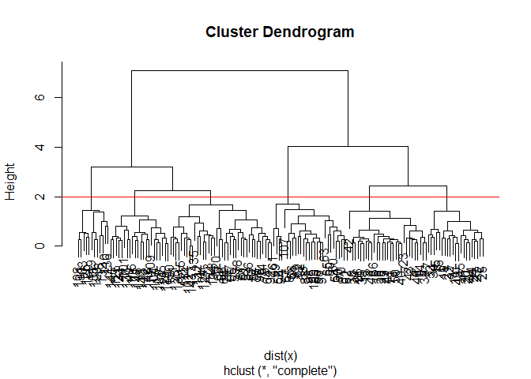<!-- -->

need to cut the tree to get cluster assigments

``` r
# cut by heright h
cutree(hclust.out, h=2) 
```

    ##   [1] 1 1 1 1 1 2 1 1 1 1 2 2 1 1 2 2 2 1 2 2 2 2 1 2 2 1 2 1 1 1 1 2 2 2 1
    ##  [36] 1 2 1 1 1 1 1 1 2 2 1 2 1 2 1 3 3 3 4 3 4 3 4 3 4 4 4 4 3 4 3 4 4 3 4
    ##  [71] 3 4 3 3 3 3 3 3 3 4 4 4 4 3 4 3 3 3 4 4 4 3 4 4 4 4 4 3 4 4 5 3 6 5 5
    ## [106] 6 4 6 5 6 5 3 5 3 3 5 5 6 6 3 5 3 6 3 5 6 3 3 5 6 6 6 5 3 3 6 5 5 3 5
    ## [141] 5 5 3 5 5 5 3 5 5 3

``` r
# cut by number of cluster k
cutree(hclust.out, k=6)
```

    ##   [1] 1 1 1 1 1 2 1 1 1 1 2 2 1 1 2 2 2 1 2 2 2 2 1 2 2 1 2 1 1 1 1 2 2 2 1
    ##  [36] 1 2 1 1 1 1 1 1 2 2 1 2 1 2 1 3 3 3 4 3 4 3 4 3 4 4 4 4 3 4 3 4 4 3 4
    ##  [71] 3 4 3 3 3 3 3 3 3 4 4 4 4 3 4 3 3 3 4 4 4 3 4 4 4 4 4 3 4 4 5 3 6 5 5
    ## [106] 6 4 6 5 6 5 3 5 3 3 5 5 6 6 3 5 3 6 3 5 6 3 3 5 6 6 6 5 3 3 6 5 5 3 5
    ## [141] 5 5 3 5 5 5 3 5 5 3

## Cutting the tree

Remember from the video that `cutree()` is the R function that cuts a
hierarchical model. The h and k arguments to `cutree()` allow you to cut
the tree based on a certain height h or a certain number of clusters k.

In this exercise, you will use `cutree()` to cut the hierarchical model
you created earlier based on each of these two criteria.

``` r
# Cut by height
library(magrittr)
hclust.out %>% cutree(h=7)
```

    ##   [1] 1 1 1 1 1 1 1 1 1 1 1 1 1 1 1 1 1 1 1 1 1 1 1 1 1 1 1 1 1 1 1 1 1 1 1
    ##  [36] 1 1 1 1 1 1 1 1 1 1 1 1 1 1 1 2 2 2 1 2 1 2 1 2 1 1 1 1 2 1 2 1 1 2 1
    ##  [71] 2 1 2 2 2 2 2 2 2 1 1 1 1 2 1 2 2 2 1 1 1 2 1 1 1 1 1 2 1 1 2 2 2 2 2
    ## [106] 2 1 2 2 2 2 2 2 2 2 2 2 2 2 2 2 2 2 2 2 2 2 2 2 2 2 2 2 2 2 2 2 2 2 2
    ## [141] 2 2 2 2 2 2 2 2 2 2

``` r
# Cut by number of clusters
hclust.out %>% cutree(k=3)
```

    ##   [1] 1 1 1 1 1 1 1 1 1 1 1 1 1 1 1 1 1 1 1 1 1 1 1 1 1 1 1 1 1 1 1 1 1 1 1
    ##  [36] 1 1 1 1 1 1 1 1 1 1 1 1 1 1 1 2 2 2 3 2 3 2 3 2 3 3 3 3 2 3 2 3 3 2 3
    ##  [71] 2 3 2 2 2 2 2 2 2 3 3 3 3 2 3 2 2 2 3 3 3 2 3 3 3 3 3 2 3 3 2 2 2 2 2
    ## [106] 2 3 2 2 2 2 2 2 2 2 2 2 2 2 2 2 2 2 2 2 2 2 2 2 2 2 2 2 2 2 2 2 2 2 2
    ## [141] 2 2 2 2 2 2 2 2 2 2

## Linkage methods

In this exercise, you will produce hierarchical clustering models using
different linkages and plot the dendrogram for each, observing the
overall structure of the trees.

You’ll be asked to interpret the results in the next exercise.

``` r
# Cluster using complete linkage: hclust.complete
hclust.complete <- hclust(dist(x), method = "complete")

# Cluster using average linkage: hclust.average
hclust.average <- hclust(dist(x), method = "average")

# Cluster using single linkage: hclust.single
hclust.single <- hclust(dist(x), method = "single")

# Plot dendrogram of hclust.complete
plot(hclust.complete, main="Complete")
```

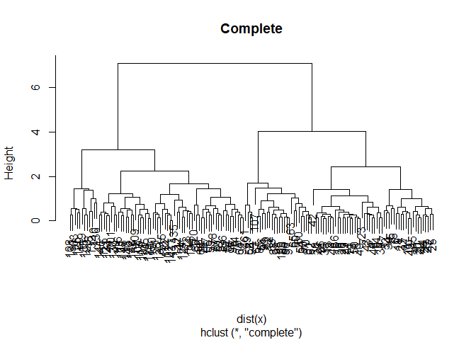<!-- -->

``` r
# Plot dendrogram of hclust.average
plot(hclust.average,main="Average")
```

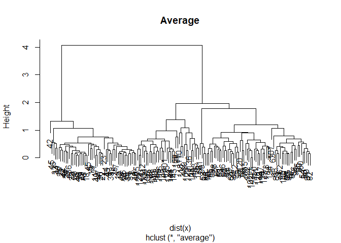<!-- -->

``` r
# Plot dendrogram of hclust.single
plot(hclust.single,
main="Single")
```

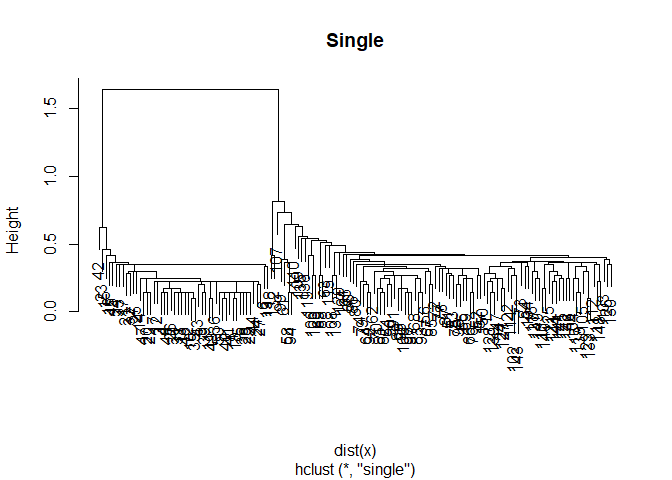<!-- -->

## Comparing linkage methods

The models you created in the last exercise— `hclust.complete`,
`hclust.average`, and hclust.single—are available in your workspace.

Which linkage(s) produce balanced trees?

## Practical matters: scaling

Recall from the video that clustering real data may require scaling the
features if they have different distributions. So far in this chapter,
you have been working with synthetic data that did not need scaling.

In this exercise, you will go back to working with “real” data, the
pokemon dataset introduced in the first chapter. You will observe the
distribution (mean and standard deviation) of each feature, scale the
data accordingly, then produce a hierarchical clustering model using the
complete linkage method.

``` r
# View column means
library(magrittr)
pokemon %>% colMeans()

# View column standard deviations
apply(pokemon, sd, MARGIN=2)

# Scale the data
pokemon.scaled <- scale(pokemon)

# Create hierarchical clustering model: hclust.pokemon
hclust.pokemon = hclust(dist(pokemon.scaled), method="complete")
```

## Comparing kmeans() and hclust()

Comparing k-means and hierarchical clustering, you’ll see the two
methods produce different cluster memberships. This is because the two
algorithms make different assumptions about how the data is generated.
In a more advanced course, we could choose to use one model over another
based on the quality of the models’ assumptions, but for now, it’s
enough to observe that they are different.

``` r
# Apply cutree() to hclust.pokemon: cut.pokemon
cut.pokemon <- cutree(hclust.pokemon, k=3)

# Compare methods
table(km.pokemon$cluster, cut.pokemon)
```

# Dimensionality reduction by PCA

## Introduction to PCA

  - Two methods of clustering - finding groups of homogeneous items
  - Next up, dimensionality reduction

Dimensionality reduction is

  - A popular method is PCA
  - Three goals when finding lower dimensional representation of
    features
      - Find linear combination of variables to create principla
        components
      - Maintain most variance in the data
      - Principal componnets are uncorrelated (i.e., orthogonal to each
        other)

<!-- end list -->

``` r
pr.iris <- prcomp(
  x = iris[-5],
  scale = FALSE,
  center = TRUE
)

summary(pr.iris)
```

    ## Importance of components:
    ##                           PC1     PC2    PC3     PC4
    ## Standard deviation     2.0563 0.49262 0.2797 0.15439
    ## Proportion of Variance 0.9246 0.05307 0.0171 0.00521
    ## Cumulative Proportion  0.9246 0.97769 0.9948 1.00000

``` r
pr.iris$x %>% 
  plot()
```

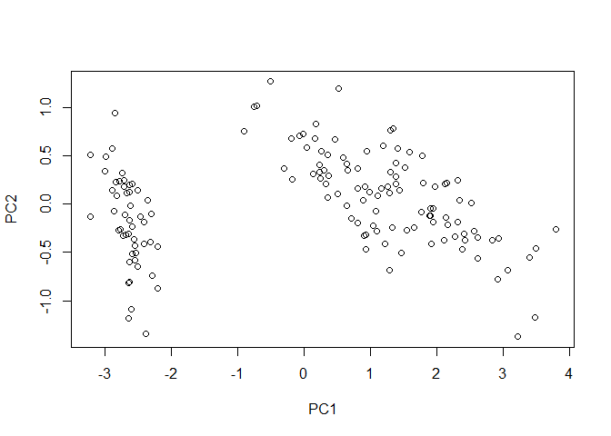<!-- -->

## PCA using prcomp()

In this exercise, you will create your first PCA model and observe the
diagnostic results.

We have loaded the Pokemon data from earlier, which has four dimensions,
and placed it in a variable called pokemon. Your task is to create a PCA
model of the data, then to inspect the resulting model using the
`summary()` function.

``` r
# Perform scaled PCA: pr.out
pokemon <- iris[-5]

pr.out <- prcomp(pokemon, scale=TRUE)

# Inspect model output
summary(pr.out)
```

    ## Importance of components:
    ##                           PC1    PC2     PC3     PC4
    ## Standard deviation     1.7084 0.9560 0.38309 0.14393
    ## Proportion of Variance 0.7296 0.2285 0.03669 0.00518
    ## Cumulative Proportion  0.7296 0.9581 0.99482 1.00000

## Results of PCA

This exercise will check your understanding of the `summary()` of a PCA
model. Your model from the last exercise, pr.out, and the pokemon
dataset are still available in your workspace.

What is the minimum number of principal components that are required to
describe at least 75% of the cumulative variance in this dataset?

## Additional results of PCA

PCA models in R produce additional diagnostic and output components:

  - `center`: the column means used to center to the data, or FALSE if
    the data weren’t centered
  - `scale`: the column standard deviations used to scale the data, or
    FALSE if the data weren’t scaled
  - `rotation`: the directions of the principal component vectors in
    terms of the original features/variables. This information allows
    you to define new data in terms of the original principal components
  - `x`: the value of each observation in the original dataset projected
    to the principal components

You can access these the same as other model components. For example,
use pr.out$rotation to access the rotation component.

Which of the following statements is not correct regarding the pr.out
model fit on the pokemon data?

The directions of the principal component vectors are presented in a
table with the same dimensions as the original data

## Variance explained

The second common plot type for understanding PCA models is a scree
plot. A scree plot shows the variance explained as the number of
principal components increases. Sometimes the cumulative variance
explained is plotted as well.

In this and the next exercise, you will prepare data from the pr.out
model you created at the beginning of the chapter for use in a scree
plot. Preparing the data for plotting is required because there is not a
built-in function in R to create this type of plot.

``` r
# Variability of each principal component: pr.var
pr.var <- pr.out$sdev^2

# Variance explained by each principal component: pve
pve <- pr.var / sum(pr.var)
```

## Visualize variance explained

Now you will create a scree plot showing the proportion of variance
explained by each principal component, as well as the cumulative
proportion of variance explained.

Recall from the video that these plots can help to determine the number
of principal components to retain. One way to determine the number of
principal components to retain is by looking for an elbow in the scree
plot showing that as the number of principal components increases, the
rate at which variance is explained decreases substantially. In the
absence of a clear elbow, you can use the scree plot as a guide for
setting a threshold.

``` r
# Plot variance explained for each principal component
library(magrittr)
pve
```

    ## [1] 0.729624454 0.228507618 0.036689219 0.005178709

``` r
plot(pve, xlab = "Principal Component",
     ylab = "Proportion of Variance Explained",
     ylim = c(0, 1), type = "b")
```

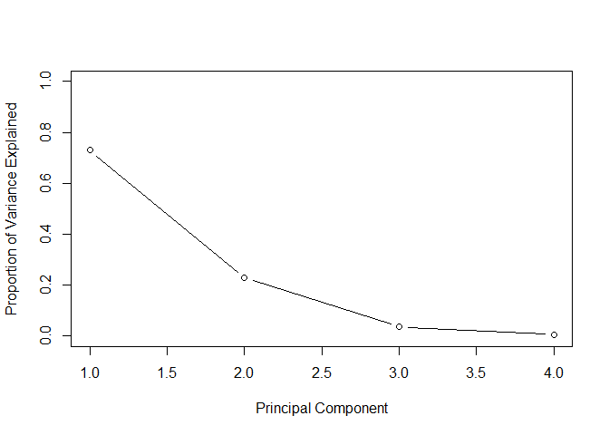<!-- -->

``` r
# Plot cumulative proportion of variance explained
plot(cumsum(pve), xlab = "Principal Component",
     ylab = "Cumulative Proportion of Variance Explained",
     ylim = c(0, 1), type = "b")
```

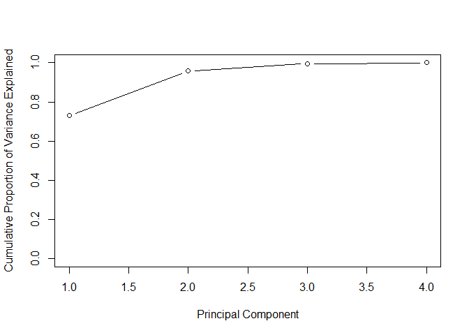<!-- -->

## Practical issues with PCA

  - Scaling the data:
  - Missing values:
      - Drop observations with missing values
      - Impute / estimate missing values
  - categorical data:
      - Do not use categorical data features
      - Encode categorical features as numbers

<!-- end list -->

``` r
data(mtcars)
head(mtcars)
```

    ##                    mpg cyl disp  hp drat    wt  qsec vs am gear carb
    ## Mazda RX4         21.0   6  160 110 3.90 2.620 16.46  0  1    4    4
    ## Mazda RX4 Wag     21.0   6  160 110 3.90 2.875 17.02  0  1    4    4
    ## Datsun 710        22.8   4  108  93 3.85 2.320 18.61  1  1    4    1
    ## Hornet 4 Drive    21.4   6  258 110 3.08 3.215 19.44  1  0    3    1
    ## Hornet Sportabout 18.7   8  360 175 3.15 3.440 17.02  0  0    3    2
    ## Valiant           18.1   6  225 105 2.76 3.460 20.22  1  0    3    1

``` r
# Means and standard deviation vary a lot
round(colMeans(mtcars),2)
```

    ##    mpg    cyl   disp     hp   drat     wt   qsec     vs     am   gear 
    ##  20.09   6.19 230.72 146.69   3.60   3.22  17.85   0.44   0.41   3.69 
    ##   carb 
    ##   2.81

``` r
round(apply(mtcars, 2,sd),2)
```

    ##    mpg    cyl   disp     hp   drat     wt   qsec     vs     am   gear 
    ##   6.03   1.79 123.94  68.56   0.53   0.98   1.79   0.50   0.50   0.74 
    ##   carb 
    ##   1.62

Scaling and PCA in R

``` r
prcomp(x, center = TRUE, scale = FALSE)
```

## Practical issues: scaling

You saw in the video that scaling your data before doing PCA changes the
results of the PCA modeling. Here, you will perform PCA with and without
scaling, then visualize the results using biplots.

Sometimes scaling is appropriate when the variances of the variables are
substantially different. This is commonly the case when variables have
different units of measurement, for example, degrees Fahrenheit
(temperature) and miles (distance). Making the decision to use scaling
is an important step in performing a principal component analysis.

``` r
# Mean of each variable
colMeans(pokemon)
```

    ## Sepal.Length  Sepal.Width Petal.Length  Petal.Width 
    ##     5.843333     3.057333     3.758000     1.199333

``` r
# Standard deviation of each variable
apply(pokemon, 2, sd)
```

    ## Sepal.Length  Sepal.Width Petal.Length  Petal.Width 
    ##    0.8280661    0.4358663    1.7652982    0.7622377

``` r
# PCA model with scaling: pr.with.scaling
pr.with.scaling <- prcomp(pokemon, scale=TRUE)

# PCA model without scaling: pr.without.scaling
pr.without.scaling <- prcomp(pokemon, scale=FALSE)

# Create biplots of both for comparison
biplot(pr.with.scaling)
```

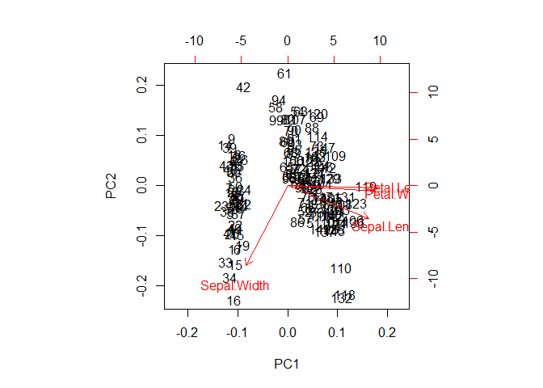<!-- -->

``` r
biplot(pr.without.scaling)
```

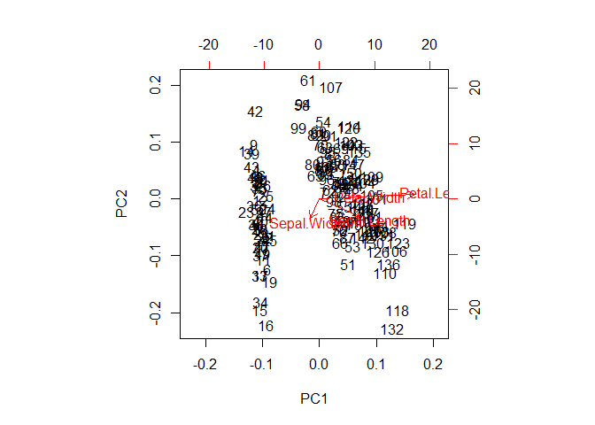<!-- -->

# Putting it all together with a case study

## Introduction

  - Download data and prepare data for modeling
  - Exploratory data analysis (\#observation, \#features, etc.)
  - Perform PCa nad interpret results
  - Complete two types of clustering
  - Inderstand and compare two types
  - Combine PCA and
clustering

## Preparing the data

``` r
url <- "http://s3.amazonaws.com/assets.datacamp.com/production/course_1903/datasets/WisconsinCancer.csv"

# Download the data: wisc.df
wisc.df <- read.csv(url)

# Convert the features of the data: wisc.data
wisc.data = as.matrix(wisc.df[,3:32])

# Set the row names of wisc.data
row.names(wisc.data) <- wisc.df$id

# Create diagnosis vector
diagnosis <- as.numeric(wisc.df$diagnosis == "M")
```

## EDA

The first step of any data analysis, unsupervised or supervised, is to
familiarize yourself with the data.

The variables you created before, wisc.data and diagnosis, are still
available in your workspace. Explore the data to answer the following
questions:

1.  How many observations are in this dataset?
2.  How many variables/features in the data are suffixed with \_mean?
3.  How many of the observations have a malignant
    diagnosis?

<!-- end list -->

``` r
wisc.df
```

    ##            id diagnosis radius_mean texture_mean perimeter_mean area_mean
    ## 1      842302         M      17.990        10.38         122.80    1001.0
    ## 2      842517         M      20.570        17.77         132.90    1326.0
    ## 3    84300903         M      19.690        21.25         130.00    1203.0
    ## 4    84348301         M      11.420        20.38          77.58     386.1
    ## 5    84358402         M      20.290        14.34         135.10    1297.0
    ## 6      843786         M      12.450        15.70          82.57     477.1
    ## 7      844359         M      18.250        19.98         119.60    1040.0
    ## 8    84458202         M      13.710        20.83          90.20     577.9
    ## 9      844981         M      13.000        21.82          87.50     519.8
    ## 10   84501001         M      12.460        24.04          83.97     475.9
    ## 11     845636         M      16.020        23.24         102.70     797.8
    ## 12   84610002         M      15.780        17.89         103.60     781.0
    ## 13     846226         M      19.170        24.80         132.40    1123.0
    ## 14     846381         M      15.850        23.95         103.70     782.7
    ## 15   84667401         M      13.730        22.61          93.60     578.3
    ## 16   84799002         M      14.540        27.54          96.73     658.8
    ## 17     848406         M      14.680        20.13          94.74     684.5
    ## 18   84862001         M      16.130        20.68         108.10     798.8
    ## 19     849014         M      19.810        22.15         130.00    1260.0
    ## 20    8510426         B      13.540        14.36          87.46     566.3
    ## 21    8510653         B      13.080        15.71          85.63     520.0
    ## 22    8510824         B       9.504        12.44          60.34     273.9
    ## 23    8511133         M      15.340        14.26         102.50     704.4
    ## 24     851509         M      21.160        23.04         137.20    1404.0
    ## 25     852552         M      16.650        21.38         110.00     904.6
    ## 26     852631         M      17.140        16.40         116.00     912.7
    ## 27     852763         M      14.580        21.53          97.41     644.8
    ## 28     852781         M      18.610        20.25         122.10    1094.0
    ## 29     852973         M      15.300        25.27         102.40     732.4
    ## 30     853201         M      17.570        15.05         115.00     955.1
    ## 31     853401         M      18.630        25.11         124.80    1088.0
    ## 32     853612         M      11.840        18.70          77.93     440.6
    ## 33   85382601         M      17.020        23.98         112.80     899.3
    ## 34     854002         M      19.270        26.47         127.90    1162.0
    ## 35     854039         M      16.130        17.88         107.00     807.2
    ## 36     854253         M      16.740        21.59         110.10     869.5
    ## 37     854268         M      14.250        21.72          93.63     633.0
    ## 38     854941         B      13.030        18.42          82.61     523.8
    ## 39     855133         M      14.990        25.20          95.54     698.8
    ## 40     855138         M      13.480        20.82          88.40     559.2
    ## 41     855167         M      13.440        21.58          86.18     563.0
    ## 42     855563         M      10.950        21.35          71.90     371.1
    ## 43     855625         M      19.070        24.81         128.30    1104.0
    ## 44     856106         M      13.280        20.28          87.32     545.2
    ## 45   85638502         M      13.170        21.81          85.42     531.5
    ## 46     857010         M      18.650        17.60         123.70    1076.0
    ## 47   85713702         B       8.196        16.84          51.71     201.9
    ## 48      85715         M      13.170        18.66          85.98     534.6
    ## 49     857155         B      12.050        14.63          78.04     449.3
    ## 50     857156         B      13.490        22.30          86.91     561.0
    ## 51     857343         B      11.760        21.60          74.72     427.9
    ## 52     857373         B      13.640        16.34          87.21     571.8
    ## 53     857374         B      11.940        18.24          75.71     437.6
    ## 54     857392         M      18.220        18.70         120.30    1033.0
    ## 55     857438         M      15.100        22.02          97.26     712.8
    ## 56   85759902         B      11.520        18.75          73.34     409.0
    ## 57     857637         M      19.210        18.57         125.50    1152.0
    ## 58     857793         M      14.710        21.59          95.55     656.9
    ## 59     857810         B      13.050        19.31          82.61     527.2
    ## 60     858477         B       8.618        11.79          54.34     224.5
    ## 61     858970         B      10.170        14.88          64.55     311.9
    ## 62     858981         B       8.598        20.98          54.66     221.8
    ## 63     858986         M      14.250        22.15          96.42     645.7
    ## 64     859196         B       9.173        13.86          59.20     260.9
    ## 65   85922302         M      12.680        23.84          82.69     499.0
    ## 66     859283         M      14.780        23.94          97.40     668.3
    ## 67     859464         B       9.465        21.01          60.11     269.4
    ## 68     859465         B      11.310        19.04          71.80     394.1
    ## 69     859471         B       9.029        17.33          58.79     250.5
    ## 70     859487         B      12.780        16.49          81.37     502.5
    ## 71     859575         M      18.940        21.31         123.60    1130.0
    ## 72     859711         B       8.888        14.64          58.79     244.0
    ## 73     859717         M      17.200        24.52         114.20     929.4
    ## 74     859983         M      13.800        15.79          90.43     584.1
    ## 75    8610175         B      12.310        16.52          79.19     470.9
    ## 76    8610404         M      16.070        19.65         104.10     817.7
    ## 77    8610629         B      13.530        10.94          87.91     559.2
    ## 78    8610637         M      18.050        16.15         120.20    1006.0
    ## 79    8610862         M      20.180        23.97         143.70    1245.0
    ## 80    8610908         B      12.860        18.00          83.19     506.3
    ## 81     861103         B      11.450        20.97          73.81     401.5
    ## 82    8611161         B      13.340        15.86          86.49     520.0
    ## 83    8611555         M      25.220        24.91         171.50    1878.0
    ## 84    8611792         M      19.100        26.29         129.10    1132.0
    ## 85    8612080         B      12.000        15.65          76.95     443.3
    ## 86    8612399         M      18.460        18.52         121.10    1075.0
    ## 87   86135501         M      14.480        21.46          94.25     648.2
    ## 88   86135502         M      19.020        24.59         122.00    1076.0
    ## 89     861597         B      12.360        21.80          79.78     466.1
    ## 90     861598         B      14.640        15.24          95.77     651.9
    ## 91     861648         B      14.620        24.02          94.57     662.7
    ## 92     861799         M      15.370        22.76         100.20     728.2
    ## 93     861853         B      13.270        14.76          84.74     551.7
    ## 94     862009         B      13.450        18.30          86.60     555.1
    ## 95     862028         M      15.060        19.83         100.30     705.6
    ## 96      86208         M      20.260        23.03         132.40    1264.0
    ## 97      86211         B      12.180        17.84          77.79     451.1
    ## 98     862261         B       9.787        19.94          62.11     294.5
    ## 99     862485         B      11.600        12.84          74.34     412.6
    ## 100    862548         M      14.420        19.77          94.48     642.5
    ## 101    862717         M      13.610        24.98          88.05     582.7
    ## 102    862722         B       6.981        13.43          43.79     143.5
    ## 103    862965         B      12.180        20.52          77.22     458.7
    ## 104    862980         B       9.876        19.40          63.95     298.3
    ## 105    862989         B      10.490        19.29          67.41     336.1
    ## 106    863030         M      13.110        15.56          87.21     530.2
    ## 107    863031         B      11.640        18.33          75.17     412.5
    ## 108    863270         B      12.360        18.54          79.01     466.7
    ## 109     86355         M      22.270        19.67         152.80    1509.0
    ## 110    864018         B      11.340        21.26          72.48     396.5
    ## 111    864033         B       9.777        16.99          62.50     290.2
    ## 112     86408         B      12.630        20.76          82.15     480.4
    ## 113     86409         B      14.260        19.65          97.83     629.9
    ## 114    864292         B      10.510        20.19          68.64     334.2
    ## 115    864496         B       8.726        15.83          55.84     230.9
    ## 116    864685         B      11.930        21.53          76.53     438.6
    ## 117    864726         B       8.950        15.76          58.74     245.2
    ## 118    864729         M      14.870        16.67          98.64     682.5
    ## 119    864877         M      15.780        22.91         105.70     782.6
    ## 120    865128         M      17.950        20.01         114.20     982.0
    ## 121    865137         B      11.410        10.82          73.34     403.3
    ## 122     86517         M      18.660        17.12         121.40    1077.0
    ## 123    865423         M      24.250        20.20         166.20    1761.0
    ## 124    865432         B      14.500        10.89          94.28     640.7
    ## 125    865468         B      13.370        16.39          86.10     553.5
    ## 126     86561         B      13.850        17.21          88.44     588.7
    ## 127    866083         M      13.610        24.69          87.76     572.6
    ## 128    866203         M      19.000        18.91         123.40    1138.0
    ## 129    866458         B      15.100        16.39          99.58     674.5
    ## 130    866674         M      19.790        25.12         130.40    1192.0
    ## 131    866714         B      12.190        13.29          79.08     455.8
    ## 132      8670         M      15.460        19.48         101.70     748.9
    ## 133  86730502         M      16.160        21.54         106.20     809.8
    ## 134    867387         B      15.710        13.93         102.00     761.7
    ## 135    867739         M      18.450        21.91         120.20    1075.0
    ## 136    868202         M      12.770        22.47          81.72     506.3
    ## 137    868223         B      11.710        16.67          74.72     423.6
    ## 138    868682         B      11.430        15.39          73.06     399.8
    ## 139    868826         M      14.950        17.57          96.85     678.1
    ## 140    868871         B      11.280        13.39          73.00     384.8
    ## 141    868999         B       9.738        11.97          61.24     288.5
    ## 142    869104         M      16.110        18.05         105.10     813.0
    ## 143    869218         B      11.430        17.31          73.66     398.0
    ## 144    869224         B      12.900        15.92          83.74     512.2
    ## 145    869254         B      10.750        14.97          68.26     355.3
    ## 146    869476         B      11.900        14.65          78.11     432.8
    ## 147    869691         M      11.800        16.58          78.99     432.0
    ## 148  86973701         B      14.950        18.77          97.84     689.5
    ## 149  86973702         B      14.440        15.18          93.97     640.1
    ## 150    869931         B      13.740        17.91          88.12     585.0
    ## 151 871001501         B      13.000        20.78          83.51     519.4
    ## 152 871001502         B       8.219        20.70          53.27     203.9
    ## 153   8710441         B       9.731        15.34          63.78     300.2
    ## 154     87106         B      11.150        13.08          70.87     381.9
    ## 155   8711002         B      13.150        15.34          85.31     538.9
    ## 156   8711003         B      12.250        17.94          78.27     460.3
    ## 157   8711202         M      17.680        20.74         117.40     963.7
    ## 158   8711216         B      16.840        19.46         108.40     880.2
    ## 159    871122         B      12.060        12.74          76.84     448.6
    ## 160    871149         B      10.900        12.96          68.69     366.8
    ## 161   8711561         B      11.750        20.18          76.10     419.8
    ## 162   8711803         M      19.190        15.94         126.30    1157.0
    ## 163    871201         M      19.590        18.15         130.70    1214.0
    ## 164   8712064         B      12.340        22.22          79.85     464.5
    ## 165   8712289         M      23.270        22.04         152.10    1686.0
    ## 166   8712291         B      14.970        19.76          95.50     690.2
    ## 167     87127         B      10.800         9.71          68.77     357.6
    ## 168   8712729         M      16.780        18.80         109.30     886.3
    ## 169   8712766         M      17.470        24.68         116.10     984.6
    ## 170   8712853         B      14.970        16.95          96.22     685.9
    ## 171  87139402         B      12.320        12.39          78.85     464.1
    ## 172     87163         M      13.430        19.63          85.84     565.4
    ## 173     87164         M      15.460        11.89         102.50     736.9
    ## 174    871641         B      11.080        14.71          70.21     372.7
    ## 175    871642         B      10.660        15.15          67.49     349.6
    ## 176    872113         B       8.671        14.45          54.42     227.2
    ## 177    872608         B       9.904        18.06          64.60     302.4
    ## 178  87281702         M      16.460        20.11         109.30     832.9
    ## 179    873357         B      13.010        22.22          82.01     526.4
    ## 180    873586         B      12.810        13.06          81.29     508.8
    ## 181    873592         M      27.220        21.87         182.10    2250.0
    ## 182    873593         M      21.090        26.57         142.70    1311.0
    ## 183    873701         M      15.700        20.31         101.20     766.6
    ## 184    873843         B      11.410        14.92          73.53     402.0
    ## 185    873885         M      15.280        22.41          98.92     710.6
    ## 186    874158         B      10.080        15.11          63.76     317.5
    ## 187    874217         M      18.310        18.58         118.60    1041.0
    ## 188    874373         B      11.710        17.19          74.68     420.3
    ## 189    874662         B      11.810        17.39          75.27     428.9
    ## 190    874839         B      12.300        15.90          78.83     463.7
    ## 191    874858         M      14.220        23.12          94.37     609.9
    ## 192    875093         B      12.770        21.41          82.02     507.4
    ## 193    875099         B       9.720        18.22          60.73     288.1
    ## 194    875263         M      12.340        26.86          81.15     477.4
    ## 195  87556202         M      14.860        23.21         100.40     671.4
    ## 196    875878         B      12.910        16.33          82.53     516.4
    ## 197    875938         M      13.770        22.29          90.63     588.9
    ## 198    877159         M      18.080        21.84         117.40    1024.0
    ## 199    877486         M      19.180        22.49         127.50    1148.0
    ## 200    877500         M      14.450        20.22          94.49     642.7
    ## 201    877501         B      12.230        19.56          78.54     461.0
    ## 202    877989         M      17.540        19.32         115.10     951.6
    ## 203    878796         M      23.290        26.67         158.90    1685.0
    ## 204     87880         M      13.810        23.75          91.56     597.8
    ## 205     87930         B      12.470        18.60          81.09     481.9
    ## 206    879523         M      15.120        16.68          98.78     716.6
    ## 207    879804         B       9.876        17.27          62.92     295.4
    ## 208    879830         M      17.010        20.26         109.70     904.3
    ## 209   8810158         B      13.110        22.54          87.02     529.4
    ## 210   8810436         B      15.270        12.91          98.17     725.5
    ## 211 881046502         M      20.580        22.14         134.70    1290.0
    ## 212   8810528         B      11.840        18.94          75.51     428.0
    ## 213   8810703         M      28.110        18.47         188.50    2499.0
    ## 214 881094802         M      17.420        25.56         114.50     948.0
    ## 215   8810955         M      14.190        23.81          92.87     610.7
    ## 216   8810987         M      13.860        16.93          90.96     578.9
    ## 217   8811523         B      11.890        18.35          77.32     432.2
    ## 218   8811779         B      10.200        17.48          65.05     321.2
    ## 219   8811842         M      19.800        21.56         129.70    1230.0
    ## 220  88119002         M      19.530        32.47         128.00    1223.0
    ## 221   8812816         B      13.650        13.16          87.88     568.9
    ## 222   8812818         B      13.560        13.90          88.59     561.3
    ## 223   8812844         B      10.180        17.53          65.12     313.1
    ## 224   8812877         M      15.750        20.25         102.60     761.3
    ## 225   8813129         B      13.270        17.02          84.55     546.4
    ## 226  88143502         B      14.340        13.47          92.51     641.2
    ## 227  88147101         B      10.440        15.46          66.62     329.6
    ## 228  88147102         B      15.000        15.51          97.45     684.5
    ## 229  88147202         B      12.620        23.97          81.35     496.4
    ## 230    881861         M      12.830        22.33          85.26     503.2
    ## 231    881972         M      17.050        19.08         113.40     895.0
    ## 232  88199202         B      11.320        27.08          71.76     395.7
    ## 233  88203002         B      11.220        33.81          70.79     386.8
    ## 234  88206102         M      20.510        27.81         134.40    1319.0
    ## 235    882488         B       9.567        15.91          60.21     279.6
    ## 236  88249602         B      14.030        21.25          89.79     603.4
    ## 237  88299702         M      23.210        26.97         153.50    1670.0
    ## 238    883263         M      20.480        21.46         132.50    1306.0
    ## 239    883270         B      14.220        27.85          92.55     623.9
    ## 240  88330202         M      17.460        39.28         113.40     920.6
    ## 241  88350402         B      13.640        15.60          87.38     575.3
    ## 242    883539         B      12.420        15.04          78.61     476.5
    ## 243    883852         B      11.300        18.19          73.93     389.4
    ## 244  88411702         B      13.750        23.77          88.54     590.0
    ## 245    884180         M      19.400        23.50         129.10    1155.0
    ## 246    884437         B      10.480        19.86          66.72     337.7
    ## 247    884448         B      13.200        17.43          84.13     541.6
    ## 248    884626         B      12.890        14.11          84.95     512.2
    ## 249  88466802         B      10.650        25.22          68.01     347.0
    ## 250    884689         B      11.520        14.93          73.87     406.3
    ## 251    884948         M      20.940        23.56         138.90    1364.0
    ## 252  88518501         B      11.500        18.45          73.28     407.4
    ## 253    885429         M      19.730        19.82         130.70    1206.0
    ## 254   8860702         M      17.300        17.08         113.00     928.2
    ## 255    886226         M      19.450        19.33         126.50    1169.0
    ## 256    886452         M      13.960        17.05          91.43     602.4
    ## 257  88649001         M      19.550        28.77         133.60    1207.0
    ## 258    886776         M      15.320        17.27         103.20     713.3
    ## 259    887181         M      15.660        23.20         110.20     773.5
    ## 260  88725602         M      15.530        33.56         103.70     744.9
    ## 261    887549         M      20.310        27.06         132.90    1288.0
    ## 262    888264         M      17.350        23.06         111.00     933.1
    ## 263    888570         M      17.290        22.13         114.40     947.8
    ## 264    889403         M      15.610        19.38         100.00     758.6
    ## 265    889719         M      17.190        22.07         111.60     928.3
    ## 266  88995002         M      20.730        31.12         135.70    1419.0
    ## 267   8910251         B      10.600        18.95          69.28     346.4
    ## 268   8910499         B      13.590        21.84          87.16     561.0
    ## 269   8910506         B      12.870        16.21          82.38     512.2
    ## 270   8910720         B      10.710        20.39          69.50     344.9
    ## 271   8910721         B      14.290        16.82          90.30     632.6
    ## 272   8910748         B      11.290        13.04          72.23     388.0
    ## 273   8910988         M      21.750        20.99         147.30    1491.0
    ## 274   8910996         B       9.742        15.67          61.50     289.9
    ## 275   8911163         M      17.930        24.48         115.20     998.9
    ## 276   8911164         B      11.890        17.36          76.20     435.6
    ## 277   8911230         B      11.330        14.16          71.79     396.6
    ## 278   8911670         M      18.810        19.98         120.90    1102.0
    ## 279   8911800         B      13.590        17.84          86.24     572.3
    ## 280   8911834         B      13.850        15.18          88.99     587.4
    ## 281   8912049         M      19.160        26.60         126.20    1138.0
    ## 282   8912055         B      11.740        14.02          74.24     427.3
    ## 283     89122         M      19.400        18.18         127.20    1145.0
    ## 284   8912280         M      16.240        18.77         108.80     805.1
    ## 285   8912284         B      12.890        15.70          84.08     516.6
    ## 286   8912521         B      12.580        18.40          79.83     489.0
    ## 287   8912909         B      11.940        20.76          77.87     441.0
    ## 288      8913         B      12.890        13.12          81.89     515.9
    ## 289   8913049         B      11.260        19.96          73.72     394.1
    ## 290  89143601         B      11.370        18.89          72.17     396.0
    ## 291  89143602         B      14.410        19.73          96.03     651.0
    ## 292      8915         B      14.960        19.10          97.03     687.3
    ## 293    891670         B      12.950        16.02          83.14     513.7
    ## 294    891703         B      11.850        17.46          75.54     432.7
    ## 295    891716         B      12.720        13.78          81.78     492.1
    ## 296    891923         B      13.770        13.27          88.06     582.7
    ## 297    891936         B      10.910        12.35          69.14     363.7
    ## 298    892189         M      11.760        18.14          75.00     431.1
    ## 299    892214         B      14.260        18.17          91.22     633.1
    ## 300    892399         B      10.510        23.09          66.85     334.2
    ## 301    892438         M      19.530        18.90         129.50    1217.0
    ## 302    892604         B      12.460        19.89          80.43     471.3
    ## 303  89263202         M      20.090        23.86         134.70    1247.0
    ## 304    892657         B      10.490        18.61          66.86     334.3
    ## 305     89296         B      11.460        18.16          73.59     403.1
    ## 306    893061         B      11.600        24.49          74.23     417.2
    ## 307     89344         B      13.200        15.82          84.07     537.3
    ## 308     89346         B       9.000        14.40          56.36     246.3
    ## 309    893526         B      13.500        12.71          85.69     566.2
    ## 310    893548         B      13.050        13.84          82.71     530.6
    ## 311    893783         B      11.700        19.11          74.33     418.7
    ## 312  89382601         B      14.610        15.69          92.68     664.9
    ## 313  89382602         B      12.760        13.37          82.29     504.1
    ## 314    893988         B      11.540        10.72          73.73     409.1
    ## 315    894047         B       8.597        18.60          54.09     221.2
    ## 316    894089         B      12.490        16.85          79.19     481.6
    ## 317    894090         B      12.180        14.08          77.25     461.4
    ## 318    894326         M      18.220        18.87         118.70    1027.0
    ## 319    894329         B       9.042        18.90          60.07     244.5
    ## 320    894335         B      12.430        17.00          78.60     477.3
    ## 321    894604         B      10.250        16.18          66.52     324.2
    ## 322    894618         M      20.160        19.66         131.10    1274.0
    ## 323    894855         B      12.860        13.32          82.82     504.8
    ## 324    895100         M      20.340        21.51         135.90    1264.0
    ## 325  89511501         B      12.200        15.21          78.01     457.9
    ## 326  89511502         B      12.670        17.30          81.25     489.9
    ## 327     89524         B      14.110        12.88          90.03     616.5
    ## 328    895299         B      12.030        17.93          76.09     446.0
    ## 329   8953902         M      16.270        20.71         106.90     813.7
    ## 330    895633         M      16.260        21.88         107.50     826.8
    ## 331    896839         M      16.030        15.51         105.80     793.2
    ## 332    896864         B      12.980        19.35          84.52     514.0
    ## 333    897132         B      11.220        19.86          71.94     387.3
    ## 334    897137         B      11.250        14.78          71.38     390.0
    ## 335    897374         B      12.300        19.02          77.88     464.4
    ## 336  89742801         M      17.060        21.00         111.80     918.6
    ## 337    897604         B      12.990        14.23          84.08     514.3
    ## 338    897630         M      18.770        21.43         122.90    1092.0
    ## 339    897880         B      10.050        17.53          64.41     310.8
    ## 340     89812         M      23.510        24.27         155.10    1747.0
    ## 341     89813         B      14.420        16.54          94.15     641.2
    ## 342    898143         B       9.606        16.84          61.64     280.5
    ## 343     89827         B      11.060        14.96          71.49     373.9
    ## 344    898431         M      19.680        21.68         129.90    1194.0
    ## 345  89864002         B      11.710        15.45          75.03     420.3
    ## 346    898677         B      10.260        14.71          66.20     321.6
    ## 347    898678         B      12.060        18.90          76.66     445.3
    ## 348     89869         B      14.760        14.74          94.87     668.7
    ## 349    898690         B      11.470        16.03          73.02     402.7
    ## 350    899147         B      11.950        14.96          77.23     426.7
    ## 351    899187         B      11.660        17.07          73.70     421.0
    ## 352    899667         M      15.750        19.22         107.10     758.6
    ## 353    899987         M      25.730        17.46         174.20    2010.0
    ## 354   9010018         M      15.080        25.74          98.00     716.6
    ## 355    901011         B      11.140        14.07          71.24     384.6
    ## 356   9010258         B      12.560        19.07          81.92     485.8
    ## 357   9010259         B      13.050        18.59          85.09     512.0
    ## 358    901028         B      13.870        16.21          88.52     593.7
    ## 359   9010333         B       8.878        15.49          56.74     241.0
    ## 360 901034301         B       9.436        18.32          59.82     278.6
    ## 361 901034302         B      12.540        18.07          79.42     491.9
    ## 362    901041         B      13.300        21.57          85.24     546.1
    ## 363   9010598         B      12.760        18.84          81.87     496.6
    ## 364   9010872         B      16.500        18.29         106.60     838.1
    ## 365   9010877         B      13.400        16.95          85.48     552.4
    ## 366    901088         M      20.440        21.78         133.80    1293.0
    ## 367   9011494         M      20.200        26.83         133.70    1234.0
    ## 368   9011495         B      12.210        18.02          78.31     458.4
    ## 369   9011971         M      21.710        17.25         140.90    1546.0
    ## 370   9012000         M      22.010        21.90         147.20    1482.0
    ## 371   9012315         M      16.350        23.29         109.00     840.4
    ## 372   9012568         B      15.190        13.21          97.65     711.8
    ## 373   9012795         M      21.370        15.10         141.30    1386.0
    ## 374    901288         M      20.640        17.35         134.80    1335.0
    ## 375   9013005         B      13.690        16.07          87.84     579.1
    ## 376    901303         B      16.170        16.07         106.30     788.5
    ## 377    901315         B      10.570        20.22          70.15     338.3
    ## 378   9013579         B      13.460        28.21          85.89     562.1
    ## 379   9013594         B      13.660        15.15          88.27     580.6
    ## 380   9013838         M      11.080        18.83          73.30     361.6
    ## 381    901549         B      11.270        12.96          73.16     386.3
    ## 382    901836         B      11.040        14.93          70.67     372.7
    ## 383     90250         B      12.050        22.72          78.75     447.8
    ## 384     90251         B      12.390        17.48          80.64     462.9
    ## 385    902727         B      13.280        13.72          85.79     541.8
    ## 386     90291         M      14.600        23.29          93.97     664.7
    ## 387    902975         B      12.210        14.09          78.78     462.0
    ## 388    902976         B      13.880        16.16          88.37     596.6
    ## 389    903011         B      11.270        15.50          73.38     392.0
    ## 390     90312         M      19.550        23.21         128.90    1174.0
    ## 391  90317302         B      10.260        12.22          65.75     321.6
    ## 392    903483         B       8.734        16.84          55.27     234.3
    ## 393    903507         M      15.490        19.97         102.40     744.7
    ## 394    903516         M      21.610        22.28         144.40    1407.0
    ## 395    903554         B      12.100        17.72          78.07     446.2
    ## 396    903811         B      14.060        17.18          89.75     609.1
    ## 397  90401601         B      13.510        18.89          88.10     558.1
    ## 398  90401602         B      12.800        17.46          83.05     508.3
    ## 399    904302         B      11.060        14.83          70.31     378.2
    ## 400    904357         B      11.800        17.26          75.26     431.9
    ## 401  90439701         M      17.910        21.02         124.40     994.0
    ## 402    904647         B      11.930        10.91          76.14     442.7
    ## 403    904689         B      12.960        18.29          84.18     525.2
    ## 404      9047         B      12.940        16.17          83.18     507.6
    ## 405    904969         B      12.340        14.95          78.29     469.1
    ## 406    904971         B      10.940        18.59          70.39     370.0
    ## 407    905189         B      16.140        14.86         104.30     800.0
    ## 408    905190         B      12.850        21.37          82.63     514.5
    ## 409  90524101         M      17.990        20.66         117.80     991.7
    ## 410    905501         B      12.270        17.92          78.41     466.1
    ## 411    905502         B      11.360        17.57          72.49     399.8
    ## 412    905520         B      11.040        16.83          70.92     373.2
    ## 413    905539         B       9.397        21.68          59.75     268.8
    ## 414    905557         B      14.990        22.11          97.53     693.7
    ## 415    905680         M      15.130        29.81          96.71     719.5
    ## 416    905686         B      11.890        21.17          76.39     433.8
    ## 417    905978         B       9.405        21.70          59.60     271.2
    ## 418  90602302         M      15.500        21.08         102.90     803.1
    ## 419    906024         B      12.700        12.17          80.88     495.0
    ## 420    906290         B      11.160        21.41          70.95     380.3
    ## 421    906539         B      11.570        19.04          74.20     409.7
    ## 422    906564         B      14.690        13.98          98.22     656.1
    ## 423    906616         B      11.610        16.02          75.46     408.2
    ## 424    906878         B      13.660        19.13          89.46     575.3
    ## 425    907145         B       9.742        19.12          61.93     289.7
    ## 426    907367         B      10.030        21.28          63.19     307.3
    ## 427    907409         B      10.480        14.98          67.49     333.6
    ## 428     90745         B      10.800        21.98          68.79     359.9
    ## 429  90769601         B      11.130        16.62          70.47     381.1
    ## 430  90769602         B      12.720        17.67          80.98     501.3
    ## 431    907914         M      14.900        22.53         102.10     685.0
    ## 432    907915         B      12.400        17.68          81.47     467.8
    ## 433    908194         M      20.180        19.54         133.80    1250.0
    ## 434    908445         M      18.820        21.97         123.70    1110.0
    ## 435    908469         B      14.860        16.94          94.89     673.7
    ## 436    908489         M      13.980        19.62          91.12     599.5
    ## 437    908916         B      12.870        19.54          82.67     509.2
    ## 438    909220         B      14.040        15.98          89.78     611.2
    ## 439    909231         B      13.850        19.60          88.68     592.6
    ## 440    909410         B      14.020        15.66          89.59     606.5
    ## 441    909411         B      10.970        17.20          71.73     371.5
    ## 442    909445         M      17.270        25.42         112.40     928.8
    ## 443  90944601         B      13.780        15.79          88.37     585.9
    ## 444    909777         B      10.570        18.32          66.82     340.9
    ## 445   9110127         M      18.030        16.85         117.50     990.0
    ## 446   9110720         B      11.990        24.89          77.61     441.3
    ## 447   9110732         M      17.750        28.03         117.30     981.6
    ## 448   9110944         B      14.800        17.66          95.88     674.8
    ## 449    911150         B      14.530        19.34          94.25     659.7
    ## 450 911157302         M      21.100        20.52         138.10    1384.0
    ## 451   9111596         B      11.870        21.54          76.83     432.0
    ## 452   9111805         M      19.590        25.00         127.70    1191.0
    ## 453   9111843         B      12.000        28.23          76.77     442.5
    ## 454    911201         B      14.530        13.98          93.86     644.2
    ## 455    911202         B      12.620        17.15          80.62     492.9
    ## 456   9112085         B      13.380        30.72          86.34     557.2
    ## 457   9112366         B      11.630        29.29          74.87     415.1
    ## 458   9112367         B      13.210        25.25          84.10     537.9
    ## 459   9112594         B      13.000        25.13          82.61     520.2
    ## 460   9112712         B       9.755        28.20          61.68     290.9
    ## 461 911296201         M      17.080        27.15         111.20     930.9
    ## 462 911296202         M      27.420        26.27         186.90    2501.0
    ## 463   9113156         B      14.400        26.99          92.25     646.1
    ## 464 911320501         B      11.600        18.36          73.88     412.7
    ## 465 911320502         B      13.170        18.22          84.28     537.3
    ## 466   9113239         B      13.240        20.13          86.87     542.9
    ## 467   9113455         B      13.140        20.74          85.98     536.9
    ## 468   9113514         B       9.668        18.10          61.06     286.3
    ## 469   9113538         M      17.600        23.33         119.00     980.5
    ## 470    911366         B      11.620        18.18          76.38     408.8
    ## 471   9113778         B       9.667        18.49          61.49     289.1
    ## 472   9113816         B      12.040        28.14          76.85     449.9
    ## 473    911384         B      14.920        14.93          96.45     686.9
    ## 474   9113846         B      12.270        29.97          77.42     465.4
    ## 475    911391         B      10.880        15.62          70.41     358.9
    ## 476    911408         B      12.830        15.73          82.89     506.9
    ## 477    911654         B      14.200        20.53          92.41     618.4
    ## 478    911673         B      13.900        16.62          88.97     599.4
    ## 479    911685         B      11.490        14.59          73.99     404.9
    ## 480    911916         M      16.250        19.51         109.80     815.8
    ## 481    912193         B      12.160        18.03          78.29     455.3
    ## 482     91227         B      13.900        19.24          88.73     602.9
    ## 483    912519         B      13.470        14.06          87.32     546.3
    ## 484    912558         B      13.700        17.64          87.76     571.1
    ## 485    912600         B      15.730        11.28         102.80     747.2
    ## 486    913063         B      12.450        16.41          82.85     476.7
    ## 487    913102         B      14.640        16.85          94.21     666.0
    ## 488    913505         M      19.440        18.82         128.10    1167.0
    ## 489    913512         B      11.680        16.17          75.49     420.5
    ## 490    913535         M      16.690        20.20         107.10     857.6
    ## 491  91376701         B      12.250        22.44          78.18     466.5
    ## 492  91376702         B      17.850        13.23         114.60     992.1
    ## 493    914062         M      18.010        20.56         118.40    1007.0
    ## 494    914101         B      12.460        12.83          78.83     477.3
    ## 495    914102         B      13.160        20.54          84.06     538.7
    ## 496    914333         B      14.870        20.21          96.12     680.9
    ## 497    914366         B      12.650        18.17          82.69     485.6
    ## 498    914580         B      12.470        17.31          80.45     480.1
    ## 499    914769         M      18.490        17.52         121.30    1068.0
    ## 500     91485         M      20.590        21.24         137.80    1320.0
    ## 501    914862         B      15.040        16.74          98.73     689.4
    ## 502     91504         M      13.820        24.49          92.33     595.9
    ## 503     91505         B      12.540        16.32          81.25     476.3
    ## 504    915143         M      23.090        19.83         152.10    1682.0
    ## 505    915186         B       9.268        12.87          61.49     248.7
    ## 506    915276         B       9.676        13.14          64.12     272.5
    ## 507  91544001         B      12.220        20.04          79.47     453.1
    ## 508  91544002         B      11.060        17.12          71.25     366.5
    ## 509    915452         B      16.300        15.70         104.70     819.8
    ## 510    915460         M      15.460        23.95         103.80     731.3
    ## 511     91550         B      11.740        14.69          76.31     426.0
    ## 512    915664         B      14.810        14.70          94.66     680.7
    ## 513    915691         M      13.400        20.52          88.64     556.7
    ## 514    915940         B      14.580        13.66          94.29     658.8
    ## 515  91594602         M      15.050        19.07          97.26     701.9
    ## 516    916221         B      11.340        18.61          72.76     391.2
    ## 517    916799         M      18.310        20.58         120.80    1052.0
    ## 518    916838         M      19.890        20.26         130.50    1214.0
    ## 519    917062         B      12.880        18.22          84.45     493.1
    ## 520    917080         B      12.750        16.70          82.51     493.8
    ## 521    917092         B       9.295        13.90          59.96     257.8
    ## 522  91762702         M      24.630        21.60         165.50    1841.0
    ## 523     91789         B      11.260        19.83          71.30     388.1
    ## 524    917896         B      13.710        18.68          88.73     571.0
    ## 525    917897         B       9.847        15.68          63.00     293.2
    ## 526     91805         B       8.571        13.10          54.53     221.3
    ## 527  91813701         B      13.460        18.75          87.44     551.1
    ## 528  91813702         B      12.340        12.27          78.94     468.5
    ## 529    918192         B      13.940        13.17          90.31     594.2
    ## 530    918465         B      12.070        13.44          77.83     445.2
    ## 531     91858         B      11.750        17.56          75.89     422.9
    ## 532  91903901         B      11.670        20.02          75.21     416.2
    ## 533  91903902         B      13.680        16.33          87.76     575.5
    ## 534  91930402         M      20.470        20.67         134.70    1299.0
    ## 535    919537         B      10.960        17.62          70.79     365.6
    ## 536    919555         M      20.550        20.86         137.80    1308.0
    ## 537  91979701         M      14.270        22.55          93.77     629.8
    ## 538    919812         B      11.690        24.44          76.37     406.4
    ## 539    921092         B       7.729        25.49          47.98     178.8
    ## 540    921362         B       7.691        25.44          48.34     170.4
    ## 541    921385         B      11.540        14.44          74.65     402.9
    ## 542    921386         B      14.470        24.99          95.81     656.4
    ## 543    921644         B      14.740        25.42          94.70     668.6
    ## 544    922296         B      13.210        28.06          84.88     538.4
    ## 545    922297         B      13.870        20.70          89.77     584.8
    ## 546    922576         B      13.620        23.23          87.19     573.2
    ## 547    922577         B      10.320        16.35          65.31     324.9
    ## 548    922840         B      10.260        16.58          65.85     320.8
    ## 549    923169         B       9.683        19.34          61.05     285.7
    ## 550    923465         B      10.820        24.21          68.89     361.6
    ## 551    923748         B      10.860        21.48          68.51     360.5
    ## 552    923780         B      11.130        22.44          71.49     378.4
    ## 553    924084         B      12.770        29.43          81.35     507.9
    ## 554    924342         B       9.333        21.94          59.01     264.0
    ## 555    924632         B      12.880        28.92          82.50     514.3
    ## 556    924934         B      10.290        27.61          65.67     321.4
    ## 557    924964         B      10.160        19.59          64.73     311.7
    ## 558    925236         B       9.423        27.88          59.26     271.3
    ## 559    925277         B      14.590        22.68          96.39     657.1
    ## 560    925291         B      11.510        23.93          74.52     403.5
    ## 561    925292         B      14.050        27.15          91.38     600.4
    ## 562    925311         B      11.200        29.37          70.67     386.0
    ## 563    925622         M      15.220        30.62         103.40     716.9
    ## 564    926125         M      20.920        25.09         143.00    1347.0
    ## 565    926424         M      21.560        22.39         142.00    1479.0
    ## 566    926682         M      20.130        28.25         131.20    1261.0
    ## 567    926954         M      16.600        28.08         108.30     858.1
    ## 568    927241         M      20.600        29.33         140.10    1265.0
    ## 569     92751         B       7.760        24.54          47.92     181.0
    ##     smoothness_mean compactness_mean concavity_mean concave.points_mean
    ## 1           0.11840          0.27760      0.3001000            0.147100
    ## 2           0.08474          0.07864      0.0869000            0.070170
    ## 3           0.10960          0.15990      0.1974000            0.127900
    ## 4           0.14250          0.28390      0.2414000            0.105200
    ## 5           0.10030          0.13280      0.1980000            0.104300
    ## 6           0.12780          0.17000      0.1578000            0.080890
    ## 7           0.09463          0.10900      0.1127000            0.074000
    ## 8           0.11890          0.16450      0.0936600            0.059850
    ## 9           0.12730          0.19320      0.1859000            0.093530
    ## 10          0.11860          0.23960      0.2273000            0.085430
    ## 11          0.08206          0.06669      0.0329900            0.033230
    ## 12          0.09710          0.12920      0.0995400            0.066060
    ## 13          0.09740          0.24580      0.2065000            0.111800
    ## 14          0.08401          0.10020      0.0993800            0.053640
    ## 15          0.11310          0.22930      0.2128000            0.080250
    ## 16          0.11390          0.15950      0.1639000            0.073640
    ## 17          0.09867          0.07200      0.0739500            0.052590
    ## 18          0.11700          0.20220      0.1722000            0.102800
    ## 19          0.09831          0.10270      0.1479000            0.094980
    ## 20          0.09779          0.08129      0.0666400            0.047810
    ## 21          0.10750          0.12700      0.0456800            0.031100
    ## 22          0.10240          0.06492      0.0295600            0.020760
    ## 23          0.10730          0.21350      0.2077000            0.097560
    ## 24          0.09428          0.10220      0.1097000            0.086320
    ## 25          0.11210          0.14570      0.1525000            0.091700
    ## 26          0.11860          0.22760      0.2229000            0.140100
    ## 27          0.10540          0.18680      0.1425000            0.087830
    ## 28          0.09440          0.10660      0.1490000            0.077310
    ## 29          0.10820          0.16970      0.1683000            0.087510
    ## 30          0.09847          0.11570      0.0987500            0.079530
    ## 31          0.10640          0.18870      0.2319000            0.124400
    ## 32          0.11090          0.15160      0.1218000            0.051820
    ## 33          0.11970          0.14960      0.2417000            0.120300
    ## 34          0.09401          0.17190      0.1657000            0.075930
    ## 35          0.10400          0.15590      0.1354000            0.077520
    ## 36          0.09610          0.13360      0.1348000            0.060180
    ## 37          0.09823          0.10980      0.1319000            0.055980
    ## 38          0.08983          0.03766      0.0256200            0.029230
    ## 39          0.09387          0.05131      0.0239800            0.028990
    ## 40          0.10160          0.12550      0.1063000            0.054390
    ## 41          0.08162          0.06031      0.0311000            0.020310
    ## 42          0.12270          0.12180      0.1044000            0.056690
    ## 43          0.09081          0.21900      0.2107000            0.099610
    ## 44          0.10410          0.14360      0.0984700            0.061580
    ## 45          0.09714          0.10470      0.0825900            0.052520
    ## 46          0.10990          0.16860      0.1974000            0.100900
    ## 47          0.08600          0.05943      0.0158800            0.005917
    ## 48          0.11580          0.12310      0.1226000            0.073400
    ## 49          0.10310          0.09092      0.0659200            0.027490
    ## 50          0.08752          0.07698      0.0475100            0.033840
    ## 51          0.08637          0.04966      0.0165700            0.011150
    ## 52          0.07685          0.06059      0.0185700            0.017230
    ## 53          0.08261          0.04751      0.0197200            0.013490
    ## 54          0.11480          0.14850      0.1772000            0.106000
    ## 55          0.09056          0.07081      0.0525300            0.033340
    ## 56          0.09524          0.05473      0.0303600            0.022780
    ## 57          0.10530          0.12670      0.1323000            0.089940
    ## 58          0.11370          0.13650      0.1293000            0.081230
    ## 59          0.08060          0.03789      0.0006920            0.004167
    ## 60          0.09752          0.05272      0.0206100            0.007799
    ## 61          0.11340          0.08061      0.0108400            0.012900
    ## 62          0.12430          0.08963      0.0300000            0.009259
    ## 63          0.10490          0.20080      0.2135000            0.086530
    ## 64          0.07721          0.08751      0.0598800            0.021800
    ## 65          0.11220          0.12620      0.1128000            0.068730
    ## 66          0.11720          0.14790      0.1267000            0.090290
    ## 67          0.10440          0.07773      0.0217200            0.015040
    ## 68          0.08139          0.04701      0.0370900            0.022300
    ## 69          0.10660          0.14130      0.3130000            0.043750
    ## 70          0.09831          0.05234      0.0365300            0.028640
    ## 71          0.09009          0.10290      0.1080000            0.079510
    ## 72          0.09783          0.15310      0.0860600            0.028720
    ## 73          0.10710          0.18300      0.1692000            0.079440
    ## 74          0.10070          0.12800      0.0778900            0.050690
    ## 75          0.09172          0.06829      0.0337200            0.022720
    ## 76          0.09168          0.08424      0.0976900            0.066380
    ## 77          0.12910          0.10470      0.0687700            0.065560
    ## 78          0.10650          0.21460      0.1684000            0.108000
    ## 79          0.12860          0.34540      0.3754000            0.160400
    ## 80          0.09934          0.09546      0.0388900            0.023150
    ## 81          0.11020          0.09362      0.0459100            0.022330
    ## 82          0.10780          0.15350      0.1169000            0.069870
    ## 83          0.10630          0.26650      0.3339000            0.184500
    ## 84          0.12150          0.17910      0.1937000            0.146900
    ## 85          0.09723          0.07165      0.0415100            0.018630
    ## 86          0.09874          0.10530      0.1335000            0.087950
    ## 87          0.09444          0.09947      0.1204000            0.049380
    ## 88          0.09029          0.12060      0.1468000            0.082710
    ## 89          0.08772          0.09445      0.0601500            0.037450
    ## 90          0.11320          0.13390      0.0996600            0.070640
    ## 91          0.08974          0.08606      0.0310200            0.029570
    ## 92          0.09200          0.10360      0.1122000            0.074830
    ## 93          0.07355          0.05055      0.0326100            0.026480
    ## 94          0.10220          0.08165      0.0397400            0.027800
    ## 95          0.10390          0.15530      0.1700000            0.088150
    ## 96          0.09078          0.13130      0.1465000            0.086830
    ## 97          0.10450          0.07057      0.0249000            0.029410
    ## 98          0.10240          0.05301      0.0068290            0.007937
    ## 99          0.08983          0.07525      0.0419600            0.033500
    ## 100         0.09752          0.11410      0.0938800            0.058390
    ## 101         0.09488          0.08511      0.0862500            0.044890
    ## 102         0.11700          0.07568      0.0000000            0.000000
    ## 103         0.08013          0.04038      0.0238300            0.017700
    ## 104         0.10050          0.09697      0.0615400            0.030290
    ## 105         0.09989          0.08578      0.0299500            0.012010
    ## 106         0.13980          0.17650      0.2071000            0.096010
    ## 107         0.11420          0.10170      0.0707000            0.034850
    ## 108         0.08477          0.06815      0.0264300            0.019210
    ## 109         0.13260          0.27680      0.4264000            0.182300
    ## 110         0.08759          0.06575      0.0513300            0.018990
    ## 111         0.10370          0.08404      0.0433400            0.017780
    ## 112         0.09933          0.12090      0.1065000            0.060210
    ## 113         0.07837          0.22330      0.3003000            0.077980
    ## 114         0.11220          0.13030      0.0647600            0.030680
    ## 115         0.11500          0.08201      0.0413200            0.019240
    ## 116         0.09768          0.07849      0.0332800            0.020080
    ## 117         0.09462          0.12430      0.0926300            0.023080
    ## 118         0.11620          0.16490      0.1690000            0.089230
    ## 119         0.11550          0.17520      0.2133000            0.094790
    ## 120         0.08402          0.06722      0.0729300            0.055960
    ## 121         0.09373          0.06685      0.0351200            0.026230
    ## 122         0.10540          0.11000      0.1457000            0.086650
    ## 123         0.14470          0.28670      0.4268000            0.201200
    ## 124         0.11010          0.10990      0.0884200            0.057780
    ## 125         0.07115          0.07325      0.0809200            0.028000
    ## 126         0.08785          0.06136      0.0142000            0.011410
    ## 127         0.09258          0.07862      0.0528500            0.030850
    ## 128         0.08217          0.08028      0.0927100            0.056270
    ## 129         0.11500          0.18070      0.1138000            0.085340
    ## 130         0.10150          0.15890      0.2545000            0.114900
    ## 131         0.10660          0.09509      0.0285500            0.028820
    ## 132         0.10920          0.12230      0.1466000            0.080870
    ## 133         0.10080          0.12840      0.1043000            0.056130
    ## 134         0.09462          0.09462      0.0713500            0.059330
    ## 135         0.09430          0.09709      0.1153000            0.068470
    ## 136         0.09055          0.05761      0.0471100            0.027040
    ## 137         0.10510          0.06095      0.0359200            0.026000
    ## 138         0.09639          0.06889      0.0350300            0.028750
    ## 139         0.11670          0.13050      0.1539000            0.086240
    ## 140         0.11640          0.11360      0.0463500            0.047960
    ## 141         0.09250          0.04102      0.0000000            0.000000
    ## 142         0.09721          0.11370      0.0944700            0.059430
    ## 143         0.10920          0.09486      0.0203100            0.018610
    ## 144         0.08677          0.09509      0.0489400            0.030880
    ## 145         0.07793          0.05139      0.0225100            0.007875
    ## 146         0.11520          0.12960      0.0371000            0.030030
    ## 147         0.10910          0.17000      0.1659000            0.074150
    ## 148         0.08138          0.11670      0.0905000            0.035620
    ## 149         0.09970          0.10210      0.0848700            0.055320
    ## 150         0.07944          0.06376      0.0288100            0.013290
    ## 151         0.11350          0.07589      0.0313600            0.026450
    ## 152         0.09405          0.13050      0.1321000            0.021680
    ## 153         0.10720          0.15990      0.4108000            0.078570
    ## 154         0.09754          0.05113      0.0198200            0.017860
    ## 155         0.09384          0.08498      0.0929300            0.034830
    ## 156         0.08654          0.06679      0.0388500            0.023310
    ## 157         0.11150          0.16650      0.1855000            0.105400
    ## 158         0.07445          0.07223      0.0515000            0.027710
    ## 159         0.09311          0.05241      0.0197200            0.019630
    ## 160         0.07515          0.03718      0.0030900            0.006588
    ## 161         0.10890          0.11410      0.0684300            0.037380
    ## 162         0.08694          0.11850      0.1193000            0.096670
    ## 163         0.11200          0.16660      0.2508000            0.128600
    ## 164         0.10120          0.10150      0.0537000            0.028220
    ## 165         0.08439          0.11450      0.1324000            0.097020
    ## 166         0.08421          0.05352      0.0194700            0.019390
    ## 167         0.09594          0.05736      0.0253100            0.016980
    ## 168         0.08865          0.09182      0.0842200            0.065760
    ## 169         0.10490          0.16030      0.2159000            0.104300
    ## 170         0.09855          0.07885      0.0260200            0.037810
    ## 171         0.10280          0.06981      0.0398700            0.037000
    ## 172         0.09048          0.06288      0.0585800            0.034380
    ## 173         0.12570          0.15550      0.2032000            0.109700
    ## 174         0.10060          0.05743      0.0236300            0.025830
    ## 175         0.08792          0.04302      0.0000000            0.000000
    ## 176         0.09138          0.04276      0.0000000            0.000000
    ## 177         0.09699          0.12940      0.1307000            0.037160
    ## 178         0.09831          0.15560      0.1793000            0.088660
    ## 179         0.06251          0.01938      0.0015950            0.001852
    ## 180         0.08739          0.03774      0.0091930            0.013300
    ## 181         0.10940          0.19140      0.2871000            0.187800
    ## 182         0.11410          0.28320      0.2487000            0.149600
    ## 183         0.09597          0.08799      0.0659300            0.051890
    ## 184         0.09059          0.08155      0.0618100            0.023610
    ## 185         0.09057          0.10520      0.0537500            0.032630
    ## 186         0.09267          0.04695      0.0015970            0.002404
    ## 187         0.08588          0.08468      0.0816900            0.058140
    ## 188         0.09774          0.06141      0.0380900            0.032390
    ## 189         0.10070          0.05562      0.0235300            0.015530
    ## 190         0.08080          0.07253      0.0384400            0.016540
    ## 191         0.10750          0.24130      0.1981000            0.066180
    ## 192         0.08749          0.06601      0.0311200            0.028640
    ## 193         0.06950          0.02344      0.0000000            0.000000
    ## 194         0.10340          0.13530      0.1085000            0.045620
    ## 195         0.10440          0.19800      0.1697000            0.088780
    ## 196         0.07941          0.05366      0.0387300            0.023770
    ## 197         0.12000          0.12670      0.1385000            0.065260
    ## 198         0.07371          0.08642      0.1103000            0.057780
    ## 199         0.08523          0.14280      0.1114000            0.067720
    ## 200         0.09872          0.12060      0.1180000            0.059800
    ## 201         0.09586          0.08087      0.0418700            0.041070
    ## 202         0.08968          0.11980      0.1036000            0.074880
    ## 203         0.11410          0.20840      0.3523000            0.162000
    ## 204         0.13230          0.17680      0.1558000            0.091760
    ## 205         0.09965          0.10580      0.0800500            0.038210
    ## 206         0.08876          0.09588      0.0755000            0.040790
    ## 207         0.10890          0.07232      0.0175600            0.019520
    ## 208         0.08772          0.07304      0.0695000            0.053900
    ## 209         0.10020          0.14830      0.0870500            0.051020
    ## 210         0.08182          0.06230      0.0589200            0.031570
    ## 211         0.09090          0.13480      0.1640000            0.095610
    ## 212         0.08871          0.06900      0.0266900            0.013930
    ## 213         0.11420          0.15160      0.3201000            0.159500
    ## 214         0.10060          0.11460      0.1682000            0.065970
    ## 215         0.09463          0.13060      0.1115000            0.064620
    ## 216         0.10260          0.15170      0.0990100            0.056020
    ## 217         0.09363          0.11540      0.0663600            0.031420
    ## 218         0.08054          0.05907      0.0577400            0.010710
    ## 219         0.09383          0.13060      0.1272000            0.086910
    ## 220         0.08420          0.11300      0.1145000            0.066370
    ## 221         0.09646          0.08711      0.0388800            0.025630
    ## 222         0.10510          0.11920      0.0786000            0.044510
    ## 223         0.10610          0.08502      0.0176800            0.019150
    ## 224         0.10250          0.12040      0.1147000            0.064620
    ## 225         0.08445          0.04994      0.0355400            0.024560
    ## 226         0.09906          0.07624      0.0572400            0.046030
    ## 227         0.10530          0.07722      0.0066430            0.012160
    ## 228         0.08371          0.10960      0.0650500            0.037800
    ## 229         0.07903          0.07529      0.0543800            0.020360
    ## 230         0.10880          0.17990      0.1695000            0.068610
    ## 231         0.11410          0.15720      0.1910000            0.109000
    ## 232         0.06883          0.03813      0.0163300            0.003125
    ## 233         0.07780          0.03574      0.0049670            0.006434
    ## 234         0.09159          0.10740      0.1554000            0.083400
    ## 235         0.08464          0.04087      0.0165200            0.016670
    ## 236         0.09070          0.06945      0.0146200            0.018960
    ## 237         0.09509          0.16820      0.1950000            0.123700
    ## 238         0.08355          0.08348      0.0904200            0.060220
    ## 239         0.08223          0.10390      0.1103000            0.044080
    ## 240         0.09812          0.12980      0.1417000            0.088110
    ## 241         0.09423          0.06630      0.0470500            0.037310
    ## 242         0.07926          0.03393      0.0105300            0.011080
    ## 243         0.09592          0.13250      0.1548000            0.028540
    ## 244         0.08043          0.06807      0.0469700            0.023440
    ## 245         0.10270          0.15580      0.2049000            0.088860
    ## 246         0.10700          0.05971      0.0483100            0.030700
    ## 247         0.07215          0.04524      0.0433600            0.011050
    ## 248         0.08760          0.13460      0.1374000            0.039800
    ## 249         0.09657          0.07234      0.0237900            0.016150
    ## 250         0.10130          0.07808      0.0432800            0.029290
    ## 251         0.10070          0.16060      0.2712000            0.131000
    ## 252         0.09345          0.05991      0.0263800            0.020690
    ## 253         0.10620          0.18490      0.2417000            0.097400
    ## 254         0.10080          0.10410      0.1266000            0.083530
    ## 255         0.10350          0.11880      0.1379000            0.085910
    ## 256         0.10960          0.12790      0.0978900            0.052460
    ## 257         0.09260          0.20630      0.1784000            0.114400
    ## 258         0.13350          0.22840      0.2448000            0.124200
    ## 259         0.11090          0.31140      0.3176000            0.137700
    ## 260         0.10630          0.16390      0.1751000            0.083990
    ## 261         0.10000          0.10880      0.1519000            0.093330
    ## 262         0.08662          0.06290      0.0289100            0.028370
    ## 263         0.08999          0.12730      0.0969700            0.075070
    ## 264         0.07840          0.05616      0.0420900            0.028470
    ## 265         0.09726          0.08995      0.0906100            0.065270
    ## 266         0.09469          0.11430      0.1367000            0.086460
    ## 267         0.09688          0.11470      0.0638700            0.026420
    ## 268         0.07956          0.08259      0.0407200            0.021420
    ## 269         0.09425          0.06219      0.0390000            0.016150
    ## 270         0.10820          0.12890      0.0844800            0.028670
    ## 271         0.06429          0.02675      0.0072500            0.006250
    ## 272         0.09834          0.07608      0.0326500            0.027550
    ## 273         0.09401          0.19610      0.2195000            0.108800
    ## 274         0.09037          0.04689      0.0110300            0.014070
    ## 275         0.08855          0.07027      0.0569900            0.047440
    ## 276         0.12250          0.07210      0.0592900            0.074040
    ## 277         0.09379          0.03872      0.0014870            0.003333
    ## 278         0.08923          0.05884      0.0802000            0.058430
    ## 279         0.07948          0.04052      0.0199700            0.012380
    ## 280         0.09516          0.07688      0.0447900            0.037110
    ## 281         0.10200          0.14530      0.1921000            0.096640
    ## 282         0.07813          0.04340      0.0224500            0.027630
    ## 283         0.10370          0.14420      0.1626000            0.094640
    ## 284         0.10660          0.18020      0.1948000            0.090520
    ## 285         0.07818          0.09580      0.1115000            0.033900
    ## 286         0.08393          0.04216      0.0018600            0.002924
    ## 287         0.08605          0.10110      0.0657400            0.037910
    ## 288         0.06955          0.03729      0.0226000            0.011710
    ## 289         0.08020          0.11810      0.0927400            0.055880
    ## 290         0.08713          0.05008      0.0239900            0.021730
    ## 291         0.08757          0.16760      0.1362000            0.066020
    ## 292         0.08992          0.09823      0.0594000            0.048190
    ## 293         0.10050          0.07943      0.0615500            0.033700
    ## 294         0.08372          0.05642      0.0268800            0.022800
    ## 295         0.09667          0.08393      0.0128800            0.019240
    ## 296         0.09198          0.06221      0.0106300            0.019170
    ## 297         0.08518          0.04721      0.0123600            0.013690
    ## 298         0.09968          0.05914      0.0268500            0.035150
    ## 299         0.06576          0.05220      0.0247500            0.013740
    ## 300         0.10150          0.06797      0.0249500            0.018750
    ## 301         0.11500          0.16420      0.2197000            0.106200
    ## 302         0.08451          0.10140      0.0683000            0.030990
    ## 303         0.10800          0.18380      0.2283000            0.128000
    ## 304         0.10680          0.06678      0.0229700            0.017800
    ## 305         0.08853          0.07694      0.0334400            0.015020
    ## 306         0.07474          0.05688      0.0197400            0.013130
    ## 307         0.08511          0.05251      0.0014610            0.003261
    ## 308         0.07005          0.03116      0.0036810            0.003472
    ## 309         0.07376          0.03614      0.0027580            0.004419
    ## 310         0.08352          0.03735      0.0045590            0.008829
    ## 311         0.08814          0.05253      0.0158300            0.011480
    ## 312         0.07618          0.03515      0.0144700            0.018770
    ## 313         0.08794          0.07948      0.0405200            0.025480
    ## 314         0.08597          0.05969      0.0136700            0.008907
    ## 315         0.10740          0.05847      0.0000000            0.000000
    ## 316         0.08511          0.03834      0.0044730            0.006423
    ## 317         0.07734          0.03212      0.0112300            0.005051
    ## 318         0.09746          0.11170      0.1130000            0.079500
    ## 319         0.09968          0.19720      0.1975000            0.049080
    ## 320         0.07557          0.03454      0.0134200            0.016990
    ## 321         0.10610          0.11110      0.0672600            0.039650
    ## 322         0.08020          0.08564      0.1155000            0.077260
    ## 323         0.11340          0.08834      0.0380000            0.034000
    ## 324         0.11700          0.18750      0.2565000            0.150400
    ## 325         0.08673          0.06545      0.0199400            0.016920
    ## 326         0.10280          0.07664      0.0319300            0.021070
    ## 327         0.09309          0.05306      0.0176500            0.027330
    ## 328         0.07683          0.03892      0.0015460            0.005592
    ## 329         0.11690          0.13190      0.1478000            0.084880
    ## 330         0.11650          0.12830      0.1799000            0.079810
    ## 331         0.09491          0.13710      0.1204000            0.070410
    ## 332         0.09579          0.11250      0.0710700            0.029500
    ## 333         0.10540          0.06779      0.0050060            0.007583
    ## 334         0.08306          0.04458      0.0009737            0.002941
    ## 335         0.08313          0.04202      0.0077560            0.008535
    ## 336         0.11190          0.10560      0.1508000            0.099340
    ## 337         0.09462          0.09965      0.0373800            0.020980
    ## 338         0.09116          0.14020      0.1060000            0.060900
    ## 339         0.10070          0.07326      0.0251100            0.017750
    ## 340         0.10690          0.12830      0.2308000            0.141000
    ## 341         0.09751          0.11390      0.0800700            0.042230
    ## 342         0.08481          0.09228      0.0842200            0.022920
    ## 343         0.10330          0.09097      0.0539700            0.033410
    ## 344         0.09797          0.13390      0.1863000            0.110300
    ## 345         0.11500          0.07281      0.0400600            0.032500
    ## 346         0.09882          0.09159      0.0358100            0.020370
    ## 347         0.08386          0.05794      0.0075100            0.008488
    ## 348         0.08875          0.07780      0.0460800            0.035280
    ## 349         0.09076          0.05886      0.0258700            0.023220
    ## 350         0.11580          0.12060      0.0117100            0.017870
    ## 351         0.07561          0.03630      0.0083060            0.011620
    ## 352         0.12430          0.23640      0.2914000            0.124200
    ## 353         0.11490          0.23630      0.3368000            0.191300
    ## 354         0.10240          0.09769      0.1235000            0.065530
    ## 355         0.07274          0.06064      0.0450500            0.014710
    ## 356         0.08760          0.10380      0.1030000            0.043910
    ## 357         0.10820          0.13040      0.0960300            0.056030
    ## 358         0.08743          0.05492      0.0150200            0.020880
    ## 359         0.08293          0.07698      0.0472100            0.023810
    ## 360         0.10090          0.05956      0.0271000            0.014060
    ## 361         0.07436          0.02650      0.0011940            0.005449
    ## 362         0.08582          0.06373      0.0334400            0.024240
    ## 363         0.09676          0.07952      0.0268800            0.017810
    ## 364         0.09686          0.08468      0.0586200            0.048350
    ## 365         0.07937          0.05696      0.0218100            0.014730
    ## 366         0.09150          0.11310      0.0979900            0.077850
    ## 367         0.09905          0.16690      0.1641000            0.126500
    ## 368         0.09231          0.07175      0.0439200            0.020270
    ## 369         0.09384          0.08562      0.1168000            0.084650
    ## 370         0.10630          0.19540      0.2448000            0.150100
    ## 371         0.09742          0.14970      0.1811000            0.087730
    ## 372         0.07963          0.06934      0.0339300            0.026570
    ## 373         0.10010          0.15150      0.1932000            0.125500
    ## 374         0.09446          0.10760      0.1527000            0.089410
    ## 375         0.08302          0.06374      0.0255600            0.020310
    ## 376         0.09880          0.14380      0.0665100            0.053970
    ## 377         0.09073          0.16600      0.2280000            0.059410
    ## 378         0.07517          0.04726      0.0127100            0.011170
    ## 379         0.08268          0.07548      0.0424900            0.024710
    ## 380         0.12160          0.21540      0.1689000            0.063670
    ## 381         0.12370          0.11110      0.0790000            0.055500
    ## 382         0.07987          0.07079      0.0354600            0.020740
    ## 383         0.06935          0.10730      0.0794300            0.029780
    ## 384         0.10420          0.12970      0.0589200            0.028800
    ## 385         0.08363          0.08575      0.0507700            0.028640
    ## 386         0.08682          0.06636      0.0839000            0.052710
    ## 387         0.08108          0.07823      0.0683900            0.025340
    ## 388         0.07026          0.04831      0.0204500            0.008507
    ## 389         0.08365          0.11140      0.1007000            0.027570
    ## 390         0.10100          0.13180      0.1856000            0.102100
    ## 391         0.09996          0.07542      0.0192300            0.019680
    ## 392         0.10390          0.07428      0.0000000            0.000000
    ## 393         0.11600          0.15620      0.1891000            0.091130
    ## 394         0.11670          0.20870      0.2810000            0.156200
    ## 395         0.10290          0.09758      0.0478300            0.033260
    ## 396         0.08045          0.05361      0.0268100            0.032510
    ## 397         0.10590          0.11470      0.0858000            0.053810
    ## 398         0.08044          0.08895      0.0739000            0.040830
    ## 399         0.07741          0.04768      0.0271200            0.007246
    ## 400         0.09087          0.06232      0.0285300            0.016380
    ## 401         0.12300          0.25760      0.3189000            0.119800
    ## 402         0.08872          0.05242      0.0260600            0.017960
    ## 403         0.07351          0.07899      0.0405700            0.018830
    ## 404         0.09879          0.08836      0.0329600            0.023900
    ## 405         0.08682          0.04571      0.0210900            0.020540
    ## 406         0.10040          0.07460      0.0494400            0.029320
    ## 407         0.09495          0.08501      0.0550000            0.045280
    ## 408         0.07551          0.08316      0.0612600            0.018670
    ## 409         0.10360          0.13040      0.1201000            0.088240
    ## 410         0.08685          0.06526      0.0321100            0.026530
    ## 411         0.08858          0.05313      0.0278300            0.021000
    ## 412         0.10770          0.07804      0.0304600            0.024800
    ## 413         0.07969          0.06053      0.0373500            0.005128
    ## 414         0.08515          0.10250      0.0685900            0.038760
    ## 415         0.08320          0.04605      0.0468600            0.027390
    ## 416         0.09773          0.08120      0.0255500            0.021790
    ## 417         0.10440          0.06159      0.0204700            0.012570
    ## 418         0.11200          0.15710      0.1522000            0.084810
    ## 419         0.08785          0.05794      0.0236000            0.024020
    ## 420         0.10180          0.05978      0.0089550            0.010760
    ## 421         0.08546          0.07722      0.0548500            0.014280
    ## 422         0.10310          0.18360      0.1450000            0.063000
    ## 423         0.10880          0.11680      0.0709700            0.044970
    ## 424         0.09057          0.11470      0.0965700            0.048120
    ## 425         0.10750          0.08333      0.0089340            0.019670
    ## 426         0.08117          0.03912      0.0024700            0.005159
    ## 427         0.09816          0.10130      0.0633500            0.022180
    ## 428         0.08801          0.05743      0.0361400            0.014040
    ## 429         0.08151          0.03834      0.0136900            0.013700
    ## 430         0.07896          0.04522      0.0140200            0.018350
    ## 431         0.09947          0.22250      0.2733000            0.097110
    ## 432         0.10540          0.13160      0.0774100            0.027990
    ## 433         0.11330          0.14890      0.2133000            0.125900
    ## 434         0.10180          0.13890      0.1594000            0.087440
    ## 435         0.08924          0.07074      0.0334600            0.028770
    ## 436         0.10600          0.11330      0.1126000            0.064630
    ## 437         0.09136          0.07883      0.0179700            0.020900
    ## 438         0.08458          0.05895      0.0353400            0.029440
    ## 439         0.08684          0.06330      0.0134200            0.022930
    ## 440         0.07966          0.05581      0.0208700            0.026520
    ## 441         0.08915          0.11130      0.0945700            0.036130
    ## 442         0.08331          0.11090      0.1204000            0.057360
    ## 443         0.08817          0.06718      0.0105500            0.009937
    ## 444         0.08142          0.04462      0.0199300            0.011110
    ## 445         0.08947          0.12320      0.1090000            0.062540
    ## 446         0.10300          0.09218      0.0544100            0.042740
    ## 447         0.09997          0.13140      0.1698000            0.082930
    ## 448         0.09179          0.08890      0.0406900            0.022600
    ## 449         0.08388          0.07800      0.0881700            0.029250
    ## 450         0.09684          0.11750      0.1572000            0.115500
    ## 451         0.06613          0.10640      0.0877700            0.023860
    ## 452         0.10320          0.09871      0.1655000            0.090630
    ## 453         0.08437          0.06450      0.0405500            0.019450
    ## 454         0.10990          0.09242      0.0689500            0.064950
    ## 455         0.08583          0.05430      0.0296600            0.022720
    ## 456         0.09245          0.07426      0.0281900            0.032640
    ## 457         0.09357          0.08574      0.0716000            0.020170
    ## 458         0.08791          0.05205      0.0277200            0.020680
    ## 459         0.08369          0.05073      0.0120600            0.017620
    ## 460         0.07984          0.04626      0.0154100            0.010430
    ## 461         0.09898          0.11100      0.1007000            0.064310
    ## 462         0.10840          0.19880      0.3635000            0.168900
    ## 463         0.06995          0.05223      0.0347600            0.017370
    ## 464         0.08508          0.05855      0.0336700            0.017770
    ## 465         0.07466          0.05994      0.0485900            0.028700
    ## 466         0.08284          0.12230      0.1010000            0.028330
    ## 467         0.08675          0.10890      0.1085000            0.035100
    ## 468         0.08311          0.05428      0.0147900            0.005769
    ## 469         0.09289          0.20040      0.2136000            0.100200
    ## 470         0.11750          0.14830      0.1020000            0.055640
    ## 471         0.08946          0.06258      0.0294800            0.015140
    ## 472         0.08752          0.06000      0.0236700            0.023770
    ## 473         0.08098          0.08549      0.0553900            0.032210
    ## 474         0.07699          0.03398      0.0000000            0.000000
    ## 475         0.10070          0.10690      0.0511500            0.015710
    ## 476         0.09040          0.08269      0.0583500            0.030780
    ## 477         0.08931          0.11080      0.0506300            0.030580
    ## 478         0.06828          0.05319      0.0222400            0.013390
    ## 479         0.10460          0.08228      0.0530800            0.019690
    ## 480         0.10260          0.18930      0.2236000            0.091940
    ## 481         0.09087          0.07838      0.0291600            0.015270
    ## 482         0.07991          0.05326      0.0299500            0.020700
    ## 483         0.10710          0.11550      0.0578600            0.052660
    ## 484         0.09950          0.07957      0.0454800            0.031600
    ## 485         0.10430          0.12990      0.1191000            0.062110
    ## 486         0.09514          0.15110      0.1544000            0.048460
    ## 487         0.08641          0.06698      0.0519200            0.027910
    ## 488         0.10890          0.14480      0.2256000            0.119400
    ## 489         0.11280          0.09263      0.0427900            0.031320
    ## 490         0.07497          0.07112      0.0364900            0.023070
    ## 491         0.08192          0.05200      0.0171400            0.012610
    ## 492         0.07838          0.06217      0.0444500            0.041780
    ## 493         0.10010          0.12890      0.1170000            0.077620
    ## 494         0.07372          0.04043      0.0071730            0.011490
    ## 495         0.07335          0.05275      0.0180000            0.012560
    ## 496         0.09587          0.08345      0.0682400            0.049510
    ## 497         0.10760          0.13340      0.0801700            0.050740
    ## 498         0.08928          0.07630      0.0360900            0.023690
    ## 499         0.10120          0.13170      0.1491000            0.091830
    ## 500         0.10850          0.16440      0.2188000            0.112100
    ## 501         0.09883          0.13640      0.0772100            0.061420
    ## 502         0.11620          0.16810      0.1357000            0.067590
    ## 503         0.11580          0.10850      0.0592800            0.032790
    ## 504         0.09342          0.12750      0.1676000            0.100300
    ## 505         0.16340          0.22390      0.0973000            0.052520
    ## 506         0.12550          0.22040      0.1188000            0.070380
    ## 507         0.10960          0.11520      0.0817500            0.021660
    ## 508         0.11940          0.10710      0.0406300            0.042680
    ## 509         0.09427          0.06712      0.0552600            0.045630
    ## 510         0.11830          0.18700      0.2030000            0.085200
    ## 511         0.08099          0.09661      0.0672600            0.026390
    ## 512         0.08472          0.05016      0.0341600            0.025410
    ## 513         0.11060          0.14690      0.1445000            0.081720
    ## 514         0.09832          0.08918      0.0822200            0.043490
    ## 515         0.09215          0.08597      0.0748600            0.043350
    ## 516         0.10490          0.08499      0.0430200            0.025940
    ## 517         0.10680          0.12480      0.1569000            0.094510
    ## 518         0.10370          0.13100      0.1411000            0.094310
    ## 519         0.12180          0.16610      0.0482500            0.053030
    ## 520         0.11250          0.11170      0.0388000            0.029950
    ## 521         0.13710          0.12250      0.0333200            0.024210
    ## 522         0.10300          0.21060      0.2310000            0.147100
    ## 523         0.08511          0.04413      0.0050670            0.005664
    ## 524         0.09916          0.10700      0.0538500            0.037830
    ## 525         0.09492          0.08419      0.0233000            0.024160
    ## 526         0.10360          0.07632      0.0256500            0.015100
    ## 527         0.10750          0.11380      0.0420100            0.031520
    ## 528         0.09003          0.06307      0.0295800            0.026470
    ## 529         0.12480          0.09755      0.1010000            0.066150
    ## 530         0.11000          0.09009      0.0378100            0.027980
    ## 531         0.10730          0.09713      0.0528200            0.044400
    ## 532         0.10160          0.09453      0.0420000            0.021570
    ## 533         0.09277          0.07255      0.0175200            0.018800
    ## 534         0.09156          0.13130      0.1523000            0.101500
    ## 535         0.09687          0.09752      0.0526300            0.027880
    ## 536         0.10460          0.17390      0.2085000            0.132200
    ## 537         0.10380          0.11540      0.1463000            0.061390
    ## 538         0.12360          0.15520      0.0451500            0.045310
    ## 539         0.08098          0.04878      0.0000000            0.000000
    ## 540         0.08668          0.11990      0.0925200            0.013640
    ## 541         0.09984          0.11200      0.0673700            0.025940
    ## 542         0.08837          0.12300      0.1009000            0.038900
    ## 543         0.08275          0.07214      0.0410500            0.030270
    ## 544         0.08671          0.06877      0.0298700            0.032750
    ## 545         0.09578          0.10180      0.0368800            0.023690
    ## 546         0.09246          0.06747      0.0297400            0.024430
    ## 547         0.09434          0.04994      0.0101200            0.005495
    ## 548         0.08877          0.08066      0.0435800            0.024380
    ## 549         0.08491          0.05030      0.0233700            0.009615
    ## 550         0.08192          0.06602      0.0154800            0.008160
    ## 551         0.07431          0.04227      0.0000000            0.000000
    ## 552         0.09566          0.08194      0.0482400            0.022570
    ## 553         0.08276          0.04234      0.0199700            0.014990
    ## 554         0.09240          0.05605      0.0399600            0.012820
    ## 555         0.08123          0.05824      0.0619500            0.023430
    ## 556         0.09030          0.07658      0.0599900            0.027380
    ## 557         0.10030          0.07504      0.0050250            0.011160
    ## 558         0.08123          0.04971      0.0000000            0.000000
    ## 559         0.08473          0.13300      0.1029000            0.037360
    ## 560         0.09261          0.10210      0.1112000            0.041050
    ## 561         0.09929          0.11260      0.0446200            0.043040
    ## 562         0.07449          0.03558      0.0000000            0.000000
    ## 563         0.10480          0.20870      0.2550000            0.094290
    ## 564         0.10990          0.22360      0.3174000            0.147400
    ## 565         0.11100          0.11590      0.2439000            0.138900
    ## 566         0.09780          0.10340      0.1440000            0.097910
    ## 567         0.08455          0.10230      0.0925100            0.053020
    ## 568         0.11780          0.27700      0.3514000            0.152000
    ## 569         0.05263          0.04362      0.0000000            0.000000
    ##     symmetry_mean fractal_dimension_mean radius_se texture_se perimeter_se
    ## 1          0.2419                0.07871    1.0950     0.9053       8.5890
    ## 2          0.1812                0.05667    0.5435     0.7339       3.3980
    ## 3          0.2069                0.05999    0.7456     0.7869       4.5850
    ## 4          0.2597                0.09744    0.4956     1.1560       3.4450
    ## 5          0.1809                0.05883    0.7572     0.7813       5.4380
    ## 6          0.2087                0.07613    0.3345     0.8902       2.2170
    ## 7          0.1794                0.05742    0.4467     0.7732       3.1800
    ## 8          0.2196                0.07451    0.5835     1.3770       3.8560
    ## 9          0.2350                0.07389    0.3063     1.0020       2.4060
    ## 10         0.2030                0.08243    0.2976     1.5990       2.0390
    ## 11         0.1528                0.05697    0.3795     1.1870       2.4660
    ## 12         0.1842                0.06082    0.5058     0.9849       3.5640
    ## 13         0.2397                0.07800    0.9555     3.5680      11.0700
    ## 14         0.1847                0.05338    0.4033     1.0780       2.9030
    ## 15         0.2069                0.07682    0.2121     1.1690       2.0610
    ## 16         0.2303                0.07077    0.3700     1.0330       2.8790
    ## 17         0.1586                0.05922    0.4727     1.2400       3.1950
    ## 18         0.2164                0.07356    0.5692     1.0730       3.8540
    ## 19         0.1582                0.05395    0.7582     1.0170       5.8650
    ## 20         0.1885                0.05766    0.2699     0.7886       2.0580
    ## 21         0.1967                0.06811    0.1852     0.7477       1.3830
    ## 22         0.1815                0.06905    0.2773     0.9768       1.9090
    ## 23         0.2521                0.07032    0.4388     0.7096       3.3840
    ## 24         0.1769                0.05278    0.6917     1.1270       4.3030
    ## 25         0.1995                0.06330    0.8068     0.9017       5.4550
    ## 26         0.3040                0.07413    1.0460     0.9760       7.2760
    ## 27         0.2252                0.06924    0.2545     0.9832       2.1100
    ## 28         0.1697                0.05699    0.8529     1.8490       5.6320
    ## 29         0.1926                0.06540    0.4390     1.0120       3.4980
    ## 30         0.1739                0.06149    0.6003     0.8225       4.6550
    ## 31         0.2183                0.06197    0.8307     1.4660       5.5740
    ## 32         0.2301                0.07799    0.4825     1.0300       3.4750
    ## 33         0.2248                0.06382    0.6009     1.3980       3.9990
    ## 34         0.1853                0.06261    0.5558     0.6062       3.5280
    ## 35         0.1998                0.06515    0.3340     0.6857       2.1830
    ## 36         0.1896                0.05656    0.4615     0.9197       3.0080
    ## 37         0.1885                0.06125    0.2860     1.0190       2.6570
    ## 38         0.1467                0.05863    0.1839     2.3420       1.1700
    ## 39         0.1565                0.05504    1.2140     2.1880       8.0770
    ## 40         0.1720                0.06419    0.2130     0.5914       1.5450
    ## 41         0.1784                0.05587    0.2385     0.8265       1.5720
    ## 42         0.1895                0.06870    0.2366     1.4280       1.8220
    ## 43         0.2310                0.06343    0.9811     1.6660       8.8300
    ## 44         0.1974                0.06782    0.3704     0.8249       2.4270
    ## 45         0.1746                0.06177    0.1938     0.6123       1.3340
    ## 46         0.1907                0.06049    0.6289     0.6633       4.2930
    ## 47         0.1769                0.06503    0.1563     0.9567       1.0940
    ## 48         0.2128                0.06777    0.2871     0.8937       1.8970
    ## 49         0.1675                0.06043    0.2636     0.7294       1.8480
    ## 50         0.1809                0.05718    0.2338     1.3530       1.7350
    ## 51         0.1495                0.05888    0.4062     1.2100       2.6350
    ## 52         0.1353                0.05953    0.1872     0.9234       1.4490
    ## 53         0.1868                0.06110    0.2273     0.6329       1.5200
    ## 54         0.2092                0.06310    0.8337     1.5930       4.8770
    ## 55         0.1616                0.05684    0.3105     0.8339       2.0970
    ## 56         0.1920                0.05907    0.3249     0.9591       2.1830
    ## 57         0.1917                0.05961    0.7275     1.1930       4.8370
    ## 58         0.2027                0.06758    0.4226     1.1500       2.7350
    ## 59         0.1819                0.05501    0.4040     1.2140       2.5950
    ## 60         0.1683                0.07187    0.1559     0.5796       1.0460
    ## 61         0.2743                0.06960    0.5158     1.4410       3.3120
    ## 62         0.1828                0.06757    0.3582     2.0670       2.4930
    ## 63         0.1949                0.07292    0.7036     1.2680       5.3730
    ## 64         0.2341                0.06963    0.4098     2.2650       2.6080
    ## 65         0.1905                0.06590    0.4255     1.1780       2.9270
    ## 66         0.1953                0.06654    0.3577     1.2810       2.4500
    ## 67         0.1717                0.06899    0.2351     2.0110       1.6600
    ## 68         0.1516                0.05667    0.2727     0.9429       1.8310
    ## 69         0.2111                0.08046    0.3274     1.1940       1.8850
    ## 70         0.1590                0.05653    0.2368     0.8732       1.4710
    ## 71         0.1582                0.05461    0.7888     0.7975       5.4860
    ## 72         0.1902                0.08980    0.5262     0.8522       3.1680
    ## 73         0.1927                0.06487    0.5907     1.0410       3.7050
    ## 74         0.1662                0.06566    0.2787     0.6205       1.9570
    ## 75         0.1720                0.05914    0.2505     1.0250       1.7400
    ## 76         0.1798                0.05391    0.7474     1.0160       5.0290
    ## 77         0.2403                0.06641    0.4101     1.0140       2.6520
    ## 78         0.2152                0.06673    0.9806     0.5505       6.3110
    ## 79         0.2906                0.08142    0.9317     1.8850       8.6490
    ## 80         0.1718                0.05997    0.2655     1.0950       1.7780
    ## 81         0.1842                0.07005    0.3251     2.1740       2.0770
    ## 82         0.1942                0.06902    0.2860     1.0160       1.5350
    ## 83         0.1829                0.06782    0.8973     1.4740       7.3820
    ## 84         0.1634                0.07224    0.5190     2.9100       5.8010
    ## 85         0.2079                0.05968    0.2271     1.2550       1.4410
    ## 86         0.2132                0.06022    0.6997     1.4750       4.7820
    ## 87         0.2075                0.05636    0.4204     2.2200       3.3010
    ## 88         0.1953                0.05629    0.5495     0.6636       3.0550
    ## 89         0.1930                0.06404    0.2978     1.5020       2.2030
    ## 90         0.2116                0.06346    0.5115     0.7372       3.8140
    ## 91         0.1685                0.05866    0.3721     1.1110       2.2790
    ## 92         0.1717                0.06097    0.3129     0.8413       2.0750
    ## 93         0.1386                0.05318    0.4057     1.1530       2.7010
    ## 94         0.1638                0.05710    0.2950     1.3730       2.0990
    ## 95         0.1855                0.06284    0.4768     0.9644       3.7060
    ## 96         0.2095                0.05649    0.7576     1.5090       4.5540
    ## 97         0.1900                0.06635    0.3661     1.5110       2.4100
    ## 98         0.1350                0.06890    0.3350     2.0430       2.1320
    ## 99         0.1620                0.06582    0.2315     0.5391       1.4750
    ## 100        0.1879                0.06390    0.2895     1.8510       2.3760
    ## 101        0.1609                0.05871    0.4565     1.2900       2.8610
    ## 102        0.1930                0.07818    0.2241     1.5080       1.5530
    ## 103        0.1739                0.05677    0.1924     1.5710       1.1830
    ## 104        0.1945                0.06322    0.1803     1.2220       1.5280
    ## 105        0.2217                0.06481    0.3550     1.5340       2.3020
    ## 106        0.1925                0.07692    0.3908     0.9238       2.4100
    ## 107        0.1801                0.06520    0.3060     1.6570       2.1550
    ## 108        0.1602                0.06066    0.1199     0.8944       0.8484
    ## 109        0.2556                0.07039    1.2150     1.5450      10.0500
    ## 110        0.1487                0.06529    0.2344     0.9861       1.5970
    ## 111        0.1584                0.07065    0.4030     1.4240       2.7470
    ## 112        0.1735                0.07070    0.3424     1.8030       2.7110
    ## 113        0.1704                0.07769    0.3628     1.4900       3.3990
    ## 114        0.1922                0.07782    0.3336     1.8600       2.0410
    ## 115        0.1649                0.07633    0.1665     0.5864       1.3540
    ## 116        0.1688                0.06194    0.3118     0.9227       2.0000
    ## 117        0.1305                0.07163    0.3132     0.9789       3.2800
    ## 118        0.2157                0.06768    0.4266     0.9489       2.9890
    ## 119        0.2096                0.07331    0.5520     1.0720       3.5980
    ## 120        0.2129                0.05025    0.5506     1.2140       3.3570
    ## 121        0.1667                0.06113    0.1408     0.4607       1.1030
    ## 122        0.1966                0.06213    0.7128     1.5810       4.8950
    ## 123        0.2655                0.06877    1.5090     3.1200       9.8070
    ## 124        0.1856                0.06402    0.2929     0.8570       1.9280
    ## 125        0.1422                0.05823    0.1639     1.1400       1.2230
    ## 126        0.1614                0.05890    0.2185     0.8561       1.4950
    ## 127        0.1761                0.06130    0.2310     1.0050       1.7520
    ## 128        0.1946                0.05044    0.6896     1.3420       5.2160
    ## 129        0.2001                0.06467    0.4309     1.0680       2.7960
    ## 130        0.2202                0.06113    0.4953     1.1990       2.7650
    ## 131        0.1880                0.06471    0.2005     0.8163       1.9730
    ## 132        0.1931                0.05796    0.4743     0.7859       3.0940
    ## 133        0.2160                0.05891    0.4332     1.2650       2.8440
    ## 134        0.1816                0.05723    0.3117     0.8155       1.9720
    ## 135        0.1692                0.05727    0.5959     1.2020       3.7660
    ## 136        0.1585                0.06065    0.2367     1.3800       1.4570
    ## 137        0.1339                0.05945    0.4489     2.5080       3.2580
    ## 138        0.1734                0.05865    0.1759     0.9938       1.1430
    ## 139        0.1957                0.06216    1.2960     1.4520       8.4190
    ## 140        0.1771                0.06072    0.3384     1.3430       1.8510
    ## 141        0.1903                0.06422    0.1988     0.4960       1.2180
    ## 142        0.1861                0.06248    0.7049     1.3320       4.5330
    ## 143        0.1645                0.06562    0.2843     1.9080       1.9370
    ## 144        0.1778                0.06235    0.2143     0.7712       1.6890
    ## 145        0.1399                0.05688    0.2525     1.2390       1.8060
    ## 146        0.1995                0.07839    0.3962     0.6538       3.0210
    ## 147        0.2678                0.07371    0.3197     1.4260       2.2810
    ## 148        0.1744                0.06493    0.4220     1.9090       3.2710
    ## 149        0.1724                0.06081    0.2406     0.7394       2.1200
    ## 150        0.1473                0.05580    0.2500     0.7574       1.5730
    ## 151        0.2540                0.06087    0.4202     1.3220       2.8730
    ## 152        0.2222                0.08261    0.1935     1.9620       1.2430
    ## 153        0.2548                0.09296    0.8245     2.6640       4.0730
    ## 154        0.1830                0.06105    0.2251     0.7815       1.4290
    ## 155        0.1822                0.06207    0.2710     0.7927       1.8190
    ## 156        0.1970                0.06228    0.2200     0.9823       1.4840
    ## 157        0.1971                0.06166    0.8113     1.4000       5.5400
    ## 158        0.1844                0.05268    0.4789     2.0600       3.4790
    ## 159        0.1590                0.05907    0.1822     0.7285       1.1710
    ## 160        0.1442                0.05743    0.2818     0.7614       1.8080
    ## 161        0.1993                0.06453    0.5018     1.6930       3.9260
    ## 162        0.1741                0.05176    1.0000     0.6336       6.9710
    ## 163        0.2027                0.06082    0.7364     1.0480       4.7920
    ## 164        0.1551                0.06761    0.2949     1.6560       1.9550
    ## 165        0.1801                0.05553    0.6642     0.8561       4.6030
    ## 166        0.1515                0.05266    0.1840     1.0650       1.2860
    ## 167        0.1381                0.06400    0.1728     0.4064       1.1260
    ## 168        0.1893                0.05534    0.5990     1.3910       4.1290
    ## 169        0.1538                0.06365    1.0880     1.4100       7.3370
    ## 170        0.1780                0.05650    0.2713     1.2170       1.8930
    ## 171        0.1959                0.05955    0.2360     0.6656       1.6700
    ## 172        0.1598                0.05671    0.4697     1.1470       3.1420
    ## 173        0.1966                0.07069    0.4209     0.6583       2.8050
    ## 174        0.1566                0.06669    0.2073     1.8050       1.3770
    ## 175        0.1928                0.05975    0.3309     1.9250       2.1550
    ## 176        0.1722                0.06724    0.2204     0.7873       1.4350
    ## 177        0.1669                0.08116    0.4311     2.2610       3.1320
    ## 178        0.1794                0.06323    0.3037     1.2840       2.4820
    ## 179        0.1395                0.05234    0.1731     1.1420       1.1010
    ## 180        0.1466                0.06133    0.2889     0.9899       1.7780
    ## 181        0.1800                0.05770    0.8361     1.4810       5.8200
    ## 182        0.2395                0.07398    0.6298     0.7629       4.4140
    ## 183        0.1618                0.05549    0.3699     1.1500       2.4060
    ## 184        0.1167                0.06217    0.3344     1.1080       1.9020
    ## 185        0.1727                0.06317    0.2054     0.4956       1.3440
    ## 186        0.1703                0.06048    0.4245     1.2680       2.6800
    ## 187        0.1621                0.05425    0.2577     0.4757       1.8170
    ## 188        0.1516                0.06095    0.2451     0.7655       1.7420
    ## 189        0.1718                0.05780    0.1859     1.9260       1.0110
    ## 190        0.1667                0.05474    0.2382     0.8355       1.6870
    ## 191        0.2384                0.07542    0.2860     2.1100       2.1120
    ## 192        0.1694                0.06287    0.7311     1.7480       5.1180
    ## 193        0.1653                0.06447    0.3539     4.8850       2.2300
    ## 194        0.1943                0.06937    0.4053     1.8090       2.6420
    ## 195        0.1737                0.06672    0.2796     0.9622       3.5910
    ## 196        0.1829                0.05667    0.1942     0.9086       1.4930
    ## 197        0.1834                0.06877    0.6191     2.1120       4.9060
    ## 198        0.1770                0.05340    0.6362     1.3050       4.3120
    ## 199        0.1767                0.05529    0.4357     1.0730       3.8330
    ## 200        0.1950                0.06466    0.2092     0.6509       1.4460
    ## 201        0.1979                0.06013    0.3534     1.3260       2.3080
    ## 202        0.1506                0.05491    0.3971     0.8282       3.0880
    ## 203        0.2200                0.06229    0.5539     1.5600       4.6670
    ## 204        0.2251                0.07421    0.5648     1.9300       3.9090
    ## 205        0.1925                0.06373    0.3961     1.0440       2.4970
    ## 206        0.1594                0.05986    0.2711     0.3621       1.9740
    ## 207        0.1934                0.06285    0.2137     1.3420       1.5170
    ## 208        0.2026                0.05223    0.5858     0.8554       4.1060
    ## 209        0.1850                0.07310    0.1931     0.9223       1.4910
    ## 210        0.1359                0.05526    0.2134     0.3628       1.5250
    ## 211        0.1765                0.05024    0.8601     1.4800       7.0290
    ## 212        0.1533                0.06057    0.2222     0.8652       1.4440
    ## 213        0.1648                0.05525    2.8730     1.4760      21.9800
    ## 214        0.1308                0.05866    0.5296     1.6670       3.7670
    ## 215        0.2235                0.06433    0.4207     1.8450       3.5340
    ## 216        0.2106                0.06916    0.2563     1.1940       1.9330
    ## 217        0.1967                0.06314    0.2963     1.5630       2.0870
    ## 218        0.1964                0.06315    0.3567     1.9220       2.7470
    ## 219        0.2094                0.05581    0.9553     1.1860       6.4870
    ## 220        0.1428                0.05313    0.7392     1.3210       4.7220
    ## 221        0.1360                0.06344    0.2102     0.4336       1.3910
    ## 222        0.1962                0.06303    0.2569     0.4981       2.0110
    ## 223        0.1910                0.06908    0.2467     1.2170       1.6410
    ## 224        0.1935                0.06303    0.3473     0.9209       2.2440
    ## 225        0.1496                0.05674    0.2927     0.8907       2.0440
    ## 226        0.2075                0.05448    0.5220     0.8121       3.7630
    ## 227        0.1788                0.06450    0.1913     0.9027       1.2080
    ## 228        0.1881                0.05907    0.2318     0.4966       2.2760
    ## 229        0.1514                0.06019    0.2449     1.0660       1.4450
    ## 230        0.2123                0.07254    0.3061     1.0690       2.2570
    ## 231        0.2131                0.06325    0.2959     0.6790       2.1530
    ## 232        0.1869                0.05628    0.1210     0.8927       1.0590
    ## 233        0.1845                0.05828    0.2239     1.6470       1.4890
    ## 234        0.1448                0.05592    0.5240     1.1890       3.7670
    ## 235        0.1551                0.06403    0.2152     0.8301       1.2150
    ## 236        0.1517                0.05835    0.2589     1.5030       1.6670
    ## 237        0.1909                0.06309    1.0580     0.9635       7.2470
    ## 238        0.1467                0.05177    0.6874     1.0410       5.1440
    ## 239        0.1342                0.06129    0.3354     2.3240       2.1050
    ## 240        0.1809                0.05966    0.5366     0.8561       3.0020
    ## 241        0.1717                0.05660    0.3242     0.6612       1.9960
    ## 242        0.1546                0.05754    0.1153     0.6745       0.7570
    ## 243        0.2054                0.07669    0.2428     1.6420       2.3690
    ## 244        0.1773                0.05429    0.4347     1.0570       2.8290
    ## 245        0.1978                0.06000    0.5243     1.8020       4.0370
    ## 246        0.1737                0.06440    0.3719     2.6120       2.5170
    ## 247        0.1487                0.05635    0.1630     1.6010       0.8730
    ## 248        0.1596                0.06409    0.2025     0.4402       2.3930
    ## 249        0.1897                0.06329    0.2497     1.4930       1.4970
    ## 250        0.1883                0.06168    0.2562     1.0380       1.6860
    ## 251        0.2205                0.05898    1.0040     0.8208       6.3720
    ## 252        0.1834                0.05934    0.3927     0.8429       2.6840
    ## 253        0.1733                0.06697    0.7661     0.7800       4.1150
    ## 254        0.1813                0.05613    0.3093     0.8568       2.1930
    ## 255        0.1776                0.05647    0.5959     0.6342       3.7970
    ## 256        0.1908                0.06130    0.4250     0.8098       2.5630
    ## 257        0.1893                0.06232    0.8426     1.1990       7.1580
    ## 258        0.2398                0.07596    0.6592     1.0590       4.0610
    ## 259        0.2495                0.08104    1.2920     2.4540      10.1200
    ## 260        0.2091                0.06650    0.2419     1.2780       1.9030
    ## 261        0.1814                0.05572    0.3977     1.0330       2.5870
    ## 262        0.1564                0.05307    0.4007     1.3170       2.5770
    ## 263        0.2108                0.05464    0.8348     1.6330       6.1460
    ## 264        0.1547                0.05443    0.2298     0.9988       1.5340
    ## 265        0.1867                0.05580    0.4203     0.7383       2.8190
    ## 266        0.1769                0.05674    1.1720     1.6170       7.7490
    ## 267        0.1922                0.06491    0.4505     1.1970       3.4300
    ## 268        0.1635                0.05859    0.3380     1.9160       2.5910
    ## 269        0.2010                0.05769    0.2345     1.2190       1.5460
    ## 270        0.1668                0.06862    0.3198     1.4890       2.2300
    ## 271        0.1508                0.05376    0.1302     0.7198       0.8439
    ## 272        0.1769                0.06270    0.1904     0.5293       1.1640
    ## 273        0.1721                0.06194    1.1670     1.3520       8.8670
    ## 274        0.2081                0.06312    0.2684     1.4090       1.7500
    ## 275        0.1538                0.05510    0.4212     1.4330       2.7650
    ## 276        0.2015                0.05875    0.6412     2.2930       4.0210
    ## 277        0.1954                0.05821    0.2375     1.2800       1.5650
    ## 278        0.1550                0.04996    0.3283     0.8280       2.3630
    ## 279        0.1573                0.05520    0.2580     1.1660       1.6830
    ## 280        0.2110                0.05853    0.2479     0.9195       1.8300
    ## 281        0.1902                0.06220    0.6361     1.0010       4.3210
    ## 282        0.2101                0.06113    0.5619     1.2680       3.7170
    ## 283        0.1893                0.05892    0.4709     0.9951       2.9030
    ## 284        0.1876                0.06684    0.2873     0.9173       2.4640
    ## 285        0.1432                0.05935    0.2913     1.3890       2.3470
    ## 286        0.1697                0.05855    0.2719     1.3500       1.7210
    ## 287        0.1588                0.06766    0.2742     1.3900       3.1980
    ## 288        0.1337                0.05581    0.1532     0.4690       1.1150
    ## 289        0.2595                0.06233    0.4866     1.9050       2.8770
    ## 290        0.2013                0.05955    0.2656     1.9740       1.9540
    ## 291        0.1714                0.07192    0.8811     1.7700       4.3600
    ## 292        0.1879                0.05852    0.2877     0.9480       2.1710
    ## 293        0.1730                0.06470    0.2094     0.7636       1.2310
    ## 294        0.1875                0.05715    0.2070     1.2380       1.2340
    ## 295        0.1638                0.06100    0.1807     0.6931       1.3400
    ## 296        0.1592                0.05912    0.2191     0.6946       1.4790
    ## 297        0.1449                0.06031    0.1753     1.0270       1.2670
    ## 298        0.1619                0.06287    0.6450     2.1050       4.1380
    ## 299        0.1635                0.05586    0.2300     0.6690       1.6610
    ## 300        0.1695                0.06556    0.2868     1.1430       2.2890
    ## 301        0.1792                0.06552    1.1110     1.1610       7.2370
    ## 302        0.1781                0.06249    0.3642     1.0400       2.5790
    ## 303        0.2249                0.07469    1.0720     1.7430       7.8040
    ## 304        0.1482                0.06600    0.1485     1.5630       1.0350
    ## 305        0.1411                0.06243    0.3278     1.0590       2.4750
    ## 306        0.1935                0.05878    0.2512     1.7860       1.9610
    ## 307        0.1632                0.05894    0.1903     0.5735       1.2040
    ## 308        0.1788                0.06833    0.1746     1.3050       1.1440
    ## 309        0.1365                0.05335    0.2244     0.6864       1.5090
    ## 310        0.1453                0.05518    0.3975     0.8285       2.5670
    ## 311        0.1936                0.06128    0.1601     1.4300       1.1090
    ## 312        0.1632                0.05255    0.3160     0.9115       1.9540
    ## 313        0.1601                0.06140    0.3265     0.6594       2.3460
    ## 314        0.1833                0.06100    0.1312     0.3602       1.1070
    ## 315        0.2163                0.07359    0.3368     2.7770       2.2220
    ## 316        0.1215                0.05673    0.1716     0.7151       1.0470
    ## 317        0.1673                0.05649    0.2113     0.5996       1.4380
    ## 318        0.1807                0.05664    0.4041     0.5503       2.5470
    ## 319        0.2330                0.08743    0.4653     1.9110       3.7690
    ## 320        0.1472                0.05561    0.3778     2.2000       2.4870
    ## 321        0.1743                0.07279    0.3677     1.4710       1.5970
    ## 322        0.1928                0.05096    0.5925     0.6863       3.8680
    ## 323        0.1543                0.06476    0.2212     1.0420       1.6140
    ## 324        0.2569                0.06670    0.5702     1.0230       4.0120
    ## 325        0.1638                0.06129    0.2575     0.8073       1.9590
    ## 326        0.1707                0.05984    0.2100     0.9505       1.5660
    ## 327        0.1373                0.05700    0.2571     1.0810       1.5580
    ## 328        0.1382                0.06070    0.2335     0.9097       1.4660
    ## 329        0.1948                0.06277    0.4375     1.2320       3.2700
    ## 330        0.1869                0.06532    0.5706     1.4570       2.9610
    ## 331        0.1782                0.05976    0.3371     0.7476       2.6290
    ## 332        0.1761                0.06540    0.2684     0.5664       2.4650
    ## 333        0.1940                0.06028    0.2976     1.9660       1.9590
    ## 334        0.1773                0.06081    0.2144     0.9961       1.5290
    ## 335        0.1539                0.05945    0.1840     1.5320       1.1990
    ## 336        0.1727                0.06071    0.8161     2.1290       6.0760
    ## 337        0.1652                0.07238    0.1814     0.6412       0.9219
    ## 338        0.1953                0.06083    0.6422     1.5300       4.3690
    ## 339        0.1890                0.06331    0.2619     2.0150       1.7780
    ## 340        0.1797                0.05506    1.0090     0.9245       6.4620
    ## 341        0.1912                0.06412    0.3491     0.7706       2.6770
    ## 342        0.2036                0.07125    0.1844     0.9429       1.4290
    ## 343        0.1776                0.06907    0.1601     0.8225       1.3550
    ## 344        0.2082                0.05715    0.6226     2.2840       5.1730
    ## 345        0.2009                0.06506    0.3446     0.7395       2.3550
    ## 346        0.1633                0.07005    0.3380     2.5090       2.3940
    ## 347        0.1555                0.06048    0.2430     1.1520       1.5590
    ## 348        0.1521                0.05912    0.3428     0.3981       2.5370
    ## 349        0.1634                0.06372    0.1707     0.7615       1.0900
    ## 350        0.2459                0.06581    0.3610     1.0500       2.4550
    ## 351        0.1671                0.05731    0.3534     0.6724       2.2250
    ## 352        0.2375                0.07603    0.5204     1.3240       3.4770
    ## 353        0.1956                0.06121    0.9948     0.8509       7.2220
    ## 354        0.1647                0.06464    0.6534     1.5060       4.1740
    ## 355        0.1690                0.06083    0.4222     0.8092       3.3300
    ## 356        0.1533                0.06184    0.3602     1.4780       3.2120
    ## 357        0.2035                0.06501    0.3106     1.5100       2.5900
    ## 358        0.1424                0.05883    0.2543     1.3630       1.7370
    ## 359        0.1930                0.06621    0.5381     1.2000       4.2770
    ## 360        0.1506                0.06959    0.5079     1.2470       3.2670
    ## 361        0.1528                0.05185    0.3511     0.9527       2.3290
    ## 362        0.1815                0.05696    0.2621     1.5390       2.0280
    ## 363        0.1759                0.06183    0.2213     1.2850       1.5350
    ## 364        0.1495                0.05593    0.3389     1.4390       2.3440
    ## 365        0.1650                0.05701    0.1584     0.6124       1.0360
    ## 366        0.1618                0.05557    0.5781     0.9168       4.2180
    ## 367        0.1875                0.06020    0.9761     1.8920       7.1280
    ## 368        0.1695                0.05916    0.2527     0.7786       1.8740
    ## 369        0.1717                0.05054    1.2070     1.0510       7.7330
    ## 370        0.1824                0.06140    1.0080     0.6999       7.5610
    ## 371        0.2175                0.06218    0.4312     1.0220       2.9720
    ## 372        0.1721                0.05544    0.1783     0.4125       1.3380
    ## 373        0.1973                0.06183    0.3414     1.3090       2.4070
    ## 374        0.1571                0.05478    0.6137     0.6575       4.1190
    ## 375        0.1872                0.05669    0.1705     0.5066       1.3720
    ## 376        0.1990                0.06572    0.1745     0.4890       1.3490
    ## 377        0.2188                0.08450    0.1115     1.2310       2.3630
    ## 378        0.1421                0.05763    0.1689     1.1500       1.4000
    ## 379        0.1792                0.05897    0.1402     0.5417       1.1010
    ## 380        0.2196                0.07950    0.2114     1.0270       1.7190
    ## 381        0.2018                0.06914    0.2562     0.9858       1.8090
    ## 382        0.2003                0.06246    0.1642     1.0310       1.2810
    ## 383        0.1203                0.06659    0.1194     1.4340       1.7780
    ## 384        0.1779                0.06588    0.2608     0.8730       2.1170
    ## 385        0.1617                0.05594    0.1833     0.5308       1.5920
    ## 386        0.1627                0.05416    0.4157     1.6270       2.9140
    ## 387        0.1646                0.06154    0.2666     0.8309       2.0970
    ## 388        0.1607                0.05474    0.2541     0.6218       1.7090
    ## 389        0.1810                0.07252    0.3305     1.0670       2.5690
    ## 390        0.1989                0.05884    0.6107     2.8360       5.3830
    ## 391        0.1800                0.06569    0.1911     0.5477       1.3480
    ## 392        0.1985                0.07098    0.5169     2.0790       3.1670
    ## 393        0.1929                0.06744    0.6470     1.3310       4.6750
    ## 394        0.2162                0.06606    0.6242     0.9209       4.1580
    ## 395        0.1937                0.06161    0.2841     1.6520       1.8690
    ## 396        0.1641                0.05764    0.1504     1.6850       1.2370
    ## 397        0.1806                0.06079    0.2136     1.3320       1.5130
    ## 398        0.1574                0.05750    0.3639     1.2650       2.6680
    ## 399        0.1535                0.06214    0.1855     0.6881       1.2630
    ## 400        0.1847                0.06019    0.3438     1.1400       2.2250
    ## 401        0.2113                0.07115    0.4030     0.7747       3.1230
    ## 402        0.1601                0.05541    0.2522     1.0450       1.6490
    ## 403        0.1874                0.05899    0.2357     1.2990       2.3970
    ## 404        0.1735                0.06200    0.1458     0.9050       0.9975
    ## 405        0.1571                0.05708    0.3833     0.9078       2.6020
    ## 406        0.1486                0.06615    0.3796     1.7430       3.0180
    ## 407        0.1735                0.05875    0.2387     0.6372       1.7290
    ## 408        0.1580                0.06114    0.4993     1.7980       2.5520
    ## 409        0.1992                0.06069    0.4537     0.8733       3.0610
    ## 410        0.1966                0.05597    0.3342     1.7810       2.0790
    ## 411        0.1601                0.05913    0.1916     1.5550       1.3590
    ## 412        0.1714                0.06340    0.1967     1.3870       1.3420
    ## 413        0.1274                0.06724    0.1186     1.1820       1.1740
    ## 414        0.1944                0.05913    0.3186     1.3360       2.3100
    ## 415        0.1852                0.05294    0.4681     1.6270       3.0430
    ## 416        0.2019                0.06290    0.2747     1.2030       1.9300
    ## 417        0.2025                0.06601    0.4302     2.8780       2.7590
    ## 418        0.2085                0.06864    1.3700     1.2130       9.4240
    ## 419        0.1583                0.06275    0.2253     0.6457       1.5270
    ## 420        0.1615                0.06144    0.2865     1.6780       1.9680
    ## 421        0.2031                0.06267    0.2864     1.4400       2.2060
    ## 422        0.2086                0.07406    0.5462     1.5110       4.7950
    ## 423        0.1886                0.06320    0.2456     0.7339       1.6670
    ## 424        0.1848                0.06181    0.2244     0.8950       1.8040
    ## 425        0.2538                0.07029    0.6965     1.7470       4.6070
    ## 426        0.1630                0.06439    0.1851     1.3410       1.1840
    ## 427        0.1925                0.06915    0.3276     1.1270       2.5640
    ## 428        0.2016                0.05977    0.3077     1.6210       2.2400
    ## 429        0.1511                0.06148    0.1415     0.9671       0.9680
    ## 430        0.1459                0.05544    0.2954     0.8836       2.1090
    ## 431        0.2041                0.06898    0.2530     0.8749       3.4660
    ## 432        0.1811                0.07102    0.1767     1.4600       2.2040
    ## 433        0.1724                0.06053    0.4331     1.0010       3.0080
    ## 434        0.1943                0.06132    0.8191     1.9310       4.4930
    ## 435        0.1573                0.05703    0.3028     0.6683       1.6120
    ## 436        0.1669                0.06544    0.2208     0.9533       1.6020
    ## 437        0.1861                0.06347    0.3665     0.7693       2.5970
    ## 438        0.1714                0.05898    0.3892     1.0460       2.6440
    ## 439        0.1555                0.05673    0.3419     1.6780       2.3310
    ## 440        0.1589                0.05586    0.2142     0.6549       1.6060
    ## 441        0.1489                0.06640    0.2574     1.3760       2.8060
    ## 442        0.1467                0.05407    0.5100     1.6790       3.2830
    ## 443        0.1405                0.05848    0.3563     0.4833       2.2350
    ## 444        0.2372                0.05768    0.1818     2.5420       1.2770
    ## 445        0.1720                0.05780    0.2986     0.5906       1.9210
    ## 446        0.1820                0.06850    0.2623     1.2040       1.8650
    ## 447        0.1713                0.05916    0.3897     1.0770       2.8730
    ## 448        0.1893                0.05886    0.2204     0.6221       1.4820
    ## 449        0.1473                0.05746    0.2535     1.3540       1.9940
    ## 450        0.1554                0.05661    0.6643     1.3610       4.5420
    ## 451        0.1349                0.06612    0.2560     1.5540       1.9550
    ## 452        0.1663                0.05391    0.4674     1.3750       2.9160
    ## 453        0.1615                0.06104    0.1912     1.7050       1.5160
    ## 454        0.1650                0.06121    0.3060     0.7213       2.1430
    ## 455        0.1799                0.05826    0.1692     0.6674       1.1160
    ## 456        0.1375                0.06016    0.3408     1.9240       2.2870
    ## 457        0.1799                0.06166    0.3135     2.4260       2.1500
    ## 458        0.1619                0.05584    0.2084     1.3500       1.3140
    ## 459        0.1667                0.05449    0.2621     1.2320       1.6570
    ## 460        0.1621                0.05952    0.1781     1.6870       1.2430
    ## 461        0.1793                0.06281    0.9291     1.1520       6.0510
    ## 462        0.2061                0.05623    2.5470     1.3060      18.6500
    ## 463        0.1707                0.05433    0.2315     0.9112       1.7270
    ## 464        0.1516                0.05859    0.1816     0.7656       1.3030
    ## 465        0.1454                0.05549    0.2023     0.6850       1.2360
    ## 466        0.1601                0.06432    0.2810     0.8135       3.3690
    ## 467        0.1562                0.06020    0.3152     0.7884       2.3120
    ## 468        0.1680                0.06412    0.3416     1.3120       2.2750
    ## 469        0.1696                0.07369    0.9289     1.4650       5.8010
    ## 470        0.1957                0.07255    0.4101     1.7400       3.0270
    ## 471        0.2238                0.06413    0.3776     1.3500       2.5690
    ## 472        0.1854                0.05698    0.6061     2.6430       4.0990
    ## 473        0.1687                0.05669    0.2446     0.4334       1.8260
    ## 474        0.1701                0.05960    0.4455     3.6470       2.8840
    ## 475        0.1861                0.06837    0.1482     0.5380       1.3010
    ## 476        0.1705                0.05913    0.1499     0.4875       1.1950
    ## 477        0.1506                0.06009    0.3478     1.0180       2.7490
    ## 478        0.1813                0.05536    0.1555     0.5762       1.3920
    ## 479        0.1779                0.06574    0.2034     1.1660       1.5670
    ## 480        0.2151                0.06578    0.3147     0.9857       3.0700
    ## 481        0.1464                0.06284    0.2194     1.1900       1.6780
    ## 482        0.1579                0.05594    0.3316     0.9264       2.0560
    ## 483        0.1779                0.06639    0.1588     0.5733       1.1020
    ## 484        0.1732                0.06088    0.2431     0.9462       1.5640
    ## 485        0.1784                0.06259    0.1630     0.3871       1.1430
    ## 486        0.2082                0.07325    0.3921     1.2070       5.0040
    ## 487        0.1409                0.05355    0.2204     1.0060       1.4710
    ## 488        0.1823                0.06115    0.5659     1.4080       3.6310
    ## 489        0.1853                0.06401    0.3713     1.1540       2.5540
    ## 490        0.1846                0.05325    0.2473     0.5679       1.7750
    ## 491        0.1544                0.05976    0.2239     1.1390       1.5770
    ## 492        0.1220                0.05243    0.4834     1.0460       3.1630
    ## 493        0.2116                0.06077    0.7548     1.2880       5.3530
    ## 494        0.1613                0.06013    0.3276     1.4860       2.1080
    ## 495        0.1713                0.05888    0.3237     1.4730       2.3260
    ## 496        0.1487                0.05748    0.2323     1.6360       1.5960
    ## 497        0.1641                0.06854    0.2324     0.6332       1.6960
    ## 498        0.1526                0.06046    0.1532     0.7810       1.2530
    ## 499        0.1832                0.06697    0.7923     1.0450       4.8510
    ## 500        0.1848                0.06222    0.5904     1.2160       4.2060
    ## 501        0.1668                0.06869    0.3720     0.8423       2.3040
    ## 502        0.2275                0.07237    0.4751     1.5280       2.9740
    ## 503        0.1943                0.06612    0.2577     1.0950       1.5660
    ## 504        0.1505                0.05484    1.2910     0.7452       9.6350
    ## 505        0.2378                0.09502    0.4076     1.0930       3.0140
    ## 506        0.2057                0.09575    0.2744     1.3900       1.7870
    ## 507        0.2124                0.06894    0.1811     0.7959       0.9857
    ## 508        0.1954                0.07976    0.1779     1.0300       1.3180
    ## 509        0.1711                0.05657    0.2067     0.4706       1.1460
    ## 510        0.1807                0.07083    0.3331     1.9610       2.9370
    ## 511        0.1499                0.06758    0.1924     0.6417       1.3450
    ## 512        0.1659                0.05348    0.2182     0.6232       1.6770
    ## 513        0.2116                0.07325    0.3906     0.9306       3.0930
    ## 514        0.1739                0.05640    0.4165     0.6237       2.5610
    ## 515        0.1561                0.05915    0.3860     1.1980       2.6300
    ## 516        0.1927                0.06211    0.2430     1.0100       1.4910
    ## 517        0.1860                0.05941    0.5449     0.9225       3.2180
    ## 518        0.1802                0.06188    0.5079     0.8737       3.6540
    ## 519        0.1709                0.07253    0.4426     1.1690       3.1760
    ## 520        0.2120                0.06623    0.3834     1.0030       2.4950
    ## 521        0.2197                0.07696    0.3538     1.1300       2.3880
    ## 522        0.1991                0.06739    0.9915     0.9004       7.0500
    ## 523        0.1637                0.06343    0.1344     1.0830       0.9812
    ## 524        0.1714                0.06843    0.3191     1.2490       2.2840
    ## 525        0.1387                0.06891    0.2498     1.2160       1.9760
    ## 526        0.1678                0.07126    0.1267     0.6793       1.0690
    ## 527        0.1723                0.06317    0.1998     0.6068       1.4430
    ## 528        0.1689                0.05808    0.1166     0.4957       0.7714
    ## 529        0.1976                0.06457    0.5461     2.6350       4.0910
    ## 530        0.1657                0.06608    0.2513     0.5040       1.7140
    ## 531        0.1598                0.06677    0.4384     1.9070       3.1490
    ## 532        0.1859                0.06461    0.2067     0.8745       1.3930
    ## 533        0.1631                0.06155    0.2047     0.4801       1.3730
    ## 534        0.2166                0.05419    0.8336     1.7360       5.1680
    ## 535        0.1619                0.06408    0.1507     1.5830       1.1650
    ## 536        0.2127                0.06251    0.6986     0.9901       4.7060
    ## 537        0.1926                0.05982    0.2027     1.8510       1.8950
    ## 538        0.2131                0.07405    0.2957     1.9780       2.1580
    ## 539        0.1870                0.07285    0.3777     1.4620       2.4920
    ## 540        0.2037                0.07751    0.2196     1.4790       1.4450
    ## 541        0.1818                0.06782    0.2784     1.7680       1.6280
    ## 542        0.1872                0.06341    0.2542     1.0790       2.6150
    ## 543        0.1840                0.05680    0.3031     1.3850       2.1770
    ## 544        0.1628                0.05781    0.2351     1.5970       1.5390
    ## 545        0.1620                0.06688    0.2720     1.0470       2.0760
    ## 546        0.1664                0.05801    0.3460     1.3360       2.0660
    ## 547        0.1885                0.06201    0.2104     0.9670       1.3560
    ## 548        0.1669                0.06714    0.1144     1.0230       0.9887
    ## 549        0.1580                0.06235    0.2957     1.3630       2.0540
    ## 550        0.1976                0.06328    0.5196     1.9180       3.5640
    ## 551        0.1661                0.05948    0.3163     1.3040       2.1150
    ## 552        0.2030                0.06552    0.2800     1.4670       1.9940
    ## 553        0.1539                0.05637    0.2409     1.3670       1.4770
    ## 554        0.1692                0.06576    0.3013     1.8790       2.1210
    ## 555        0.1566                0.05708    0.2116     1.3600       1.5020
    ## 556        0.1593                0.06127    0.2199     2.2390       1.4370
    ## 557        0.1791                0.06331    0.2441     2.0900       1.6480
    ## 558        0.1742                0.06059    0.5375     2.9270       3.6180
    ## 559        0.1454                0.06147    0.2254     1.1080       2.2240
    ## 560        0.1388                0.06570    0.2388     2.9040       1.9360
    ## 561        0.1537                0.06171    0.3645     1.4920       2.8880
    ## 562        0.1060                0.05502    0.3141     3.8960       2.0410
    ## 563        0.2128                0.07152    0.2602     1.2050       2.3620
    ## 564        0.2149                0.06879    0.9622     1.0260       8.7580
    ## 565        0.1726                0.05623    1.1760     1.2560       7.6730
    ## 566        0.1752                0.05533    0.7655     2.4630       5.2030
    ## 567        0.1590                0.05648    0.4564     1.0750       3.4250
    ## 568        0.2397                0.07016    0.7260     1.5950       5.7720
    ## 569        0.1587                0.05884    0.3857     1.4280       2.5480
    ##     area_se smoothness_se compactness_se concavity_se concave.points_se
    ## 1   153.400      0.006399       0.049040    0.0537300          0.015870
    ## 2    74.080      0.005225       0.013080    0.0186000          0.013400
    ## 3    94.030      0.006150       0.040060    0.0383200          0.020580
    ## 4    27.230      0.009110       0.074580    0.0566100          0.018670
    ## 5    94.440      0.011490       0.024610    0.0568800          0.018850
    ## 6    27.190      0.007510       0.033450    0.0367200          0.011370
    ## 7    53.910      0.004314       0.013820    0.0225400          0.010390
    ## 8    50.960      0.008805       0.030290    0.0248800          0.014480
    ## 9    24.320      0.005731       0.035020    0.0355300          0.012260
    ## 10   23.940      0.007149       0.072170    0.0774300          0.014320
    ## 11   40.510      0.004029       0.009269    0.0110100          0.007591
    ## 12   54.160      0.005771       0.040610    0.0279100          0.012820
    ## 13  116.200      0.003139       0.082970    0.0889000          0.040900
    ## 14   36.580      0.009769       0.031260    0.0505100          0.019920
    ## 15   19.210      0.006429       0.059360    0.0550100          0.016280
    ## 16   32.550      0.005607       0.042400    0.0474100          0.010900
    ## 17   45.400      0.005718       0.011620    0.0199800          0.011090
    ## 18   54.180      0.007026       0.025010    0.0318800          0.012970
    ## 19  112.400      0.006494       0.018930    0.0339100          0.015210
    ## 20   23.560      0.008462       0.014600    0.0238700          0.013150
    ## 21   14.670      0.004097       0.018980    0.0169800          0.006490
    ## 22   15.700      0.009606       0.014320    0.0198500          0.014210
    ## 23   44.910      0.006789       0.053280    0.0644600          0.022520
    ## 24   93.990      0.004728       0.012590    0.0171500          0.010380
    ## 25  102.600      0.006048       0.018820    0.0274100          0.011300
    ## 26  111.400      0.008029       0.037990    0.0373200          0.023970
    ## 27   21.050      0.004452       0.030550    0.0268100          0.013520
    ## 28   93.540      0.010750       0.027220    0.0508100          0.019110
    ## 29   43.500      0.005233       0.030570    0.0357600          0.010830
    ## 30   61.100      0.005627       0.030330    0.0340700          0.013540
    ## 31  105.000      0.006248       0.033740    0.0519600          0.011580
    ## 32   41.000      0.005551       0.034140    0.0420500          0.010440
    ## 33   67.780      0.008268       0.030820    0.0504200          0.011120
    ## 34   68.170      0.005015       0.033180    0.0349700          0.009643
    ## 35   35.030      0.004185       0.028680    0.0266400          0.009067
    ## 36   45.190      0.005776       0.024990    0.0369500          0.011950
    ## 37   24.910      0.005878       0.029950    0.0481500          0.011610
    ## 38   14.160      0.004352       0.004899    0.0134300          0.011640
    ## 39  106.000      0.006883       0.010940    0.0181800          0.019170
    ## 40   18.520      0.005367       0.022390    0.0304900          0.012620
    ## 41   20.530      0.003280       0.011020    0.0139000          0.006881
    ## 42   16.970      0.008064       0.017640    0.0259500          0.010370
    ## 43  104.900      0.006548       0.100600    0.0972300          0.026380
    ## 44   31.330      0.005072       0.021470    0.0218500          0.009560
    ## 45   14.490      0.003350       0.013840    0.0145200          0.006853
    ## 46   71.560      0.006294       0.039940    0.0555400          0.016950
    ## 47    8.205      0.008968       0.016460    0.0158800          0.005917
    ## 48   24.250      0.006532       0.023360    0.0290500          0.012150
    ## 49   19.870      0.005488       0.014270    0.0232200          0.005660
    ## 50   20.200      0.004455       0.013820    0.0209500          0.011840
    ## 51   28.470      0.005857       0.009758    0.0116800          0.007445
    ## 52   14.550      0.004477       0.011770    0.0107900          0.007956
    ## 53   17.470      0.007210       0.008380    0.0131100          0.008000
    ## 54   98.810      0.003899       0.029610    0.0281700          0.009222
    ## 55   29.910      0.004675       0.010300    0.0160300          0.009222
    ## 56   23.470      0.008328       0.008722    0.0134900          0.008670
    ## 57  102.500      0.006458       0.023060    0.0294500          0.015380
    ## 58   40.090      0.003659       0.028550    0.0257200          0.012720
    ## 59   32.960      0.007491       0.008593    0.0006920          0.004167
    ## 60    8.322      0.010110       0.010550    0.0198100          0.005742
    ## 61   34.620      0.007514       0.010990    0.0076650          0.008193
    ## 62   18.390      0.011930       0.031620    0.0300000          0.009259
    ## 63   60.780      0.009407       0.070560    0.0689900          0.018480
    ## 64   23.520      0.008738       0.039380    0.0431200          0.015600
    ## 65   36.460      0.007781       0.026480    0.0297300          0.012900
    ## 66   35.240      0.006703       0.023100    0.0231500          0.011840
    ## 67   14.200      0.010520       0.017550    0.0171400          0.009333
    ## 68   18.150      0.009282       0.009216    0.0206300          0.008965
    ## 69   17.670      0.009549       0.086060    0.3038000          0.033220
    ## 70   18.330      0.007962       0.005612    0.0158500          0.008662
    ## 71   96.050      0.004444       0.016520    0.0226900          0.013700
    ## 72   25.440      0.017210       0.093680    0.0567100          0.017660
    ## 73   69.470      0.005820       0.056160    0.0425200          0.011270
    ## 74   23.350      0.004717       0.020650    0.0175900          0.009206
    ## 75   19.680      0.004854       0.018190    0.0182600          0.007965
    ## 76   79.250      0.010820       0.022030    0.0350000          0.018090
    ## 77   32.650      0.013400       0.028390    0.0116200          0.008239
    ## 78  134.800      0.007940       0.058390    0.0465800          0.020700
    ## 79  116.400      0.010380       0.068350    0.1091000          0.025930
    ## 80   20.350      0.005293       0.016610    0.0207100          0.008179
    ## 81   24.620      0.010370       0.017060    0.0258600          0.007506
    ## 82   12.960      0.006794       0.035750    0.0398000          0.013830
    ## 83  120.000      0.008166       0.056930    0.0573000          0.020300
    ## 84   67.100      0.007545       0.060500    0.0213400          0.018430
    ## 85   16.160      0.005969       0.018120    0.0200700          0.007027
    ## 86   80.600      0.006471       0.016490    0.0280600          0.014200
    ## 87   38.870      0.009369       0.029830    0.0537100          0.017610
    ## 88   57.650      0.003872       0.018420    0.0371000          0.012000
    ## 89   20.950      0.007112       0.024930    0.0270300          0.012930
    ## 90   42.760      0.005508       0.044120    0.0443600          0.016230
    ## 91   33.760      0.004868       0.018180    0.0112100          0.008606
    ## 92   29.440      0.009882       0.024440    0.0453100          0.017630
    ## 93   36.350      0.004481       0.010380    0.0135800          0.010820
    ## 94   25.220      0.005884       0.014910    0.0187200          0.009366
    ## 95   47.140      0.009250       0.037150    0.0486700          0.018510
    ## 96   87.870      0.006016       0.034820    0.0423200          0.012690
    ## 97   24.440      0.005433       0.011790    0.0113100          0.015190
    ## 98   20.050      0.011130       0.014630    0.0053080          0.005250
    ## 99   15.750      0.006153       0.013300    0.0169300          0.006884
    ## 100  26.850      0.008005       0.028950    0.0332100          0.014240
    ## 101  43.140      0.005872       0.014880    0.0264700          0.009921
    ## 102   9.833      0.010190       0.010840    0.0000000          0.000000
    ## 103  14.680      0.005080       0.006098    0.0106900          0.006797
    ## 104  11.770      0.009058       0.021960    0.0302900          0.011120
    ## 105  23.130      0.007595       0.022190    0.0288000          0.008614
    ## 106  34.660      0.007162       0.029120    0.0547300          0.013880
    ## 107  20.620      0.008540       0.023100    0.0294500          0.013980
    ## 108   9.227      0.003457       0.010470    0.0116700          0.005558
    ## 109 170.000      0.006515       0.086680    0.1040000          0.024800
    ## 110  16.410      0.009113       0.015570    0.0244300          0.006435
    ## 111  22.870      0.013850       0.029320    0.0272200          0.010230
    ## 112  20.480      0.012910       0.040420    0.0510100          0.022950
    ## 113  29.250      0.005298       0.074460    0.1435000          0.022920
    ## 114  19.910      0.011880       0.037470    0.0459100          0.015440
    ## 115   8.966      0.008261       0.022130    0.0325900          0.010400
    ## 116  24.790      0.007803       0.025070    0.0183500          0.007711
    ## 117  16.940      0.018350       0.067600    0.0926300          0.023080
    ## 118  41.180      0.006985       0.025630    0.0301100          0.012710
    ## 119  58.630      0.008699       0.039760    0.0595000          0.013900
    ## 120  54.040      0.004024       0.008422    0.0229100          0.009863
    ## 121  10.500      0.006040       0.015290    0.0151400          0.006460
    ## 122  90.470      0.008102       0.021010    0.0334200          0.016010
    ## 123 233.000      0.023330       0.098060    0.1278000          0.018220
    ## 124  24.190      0.003818       0.012760    0.0288200          0.012000
    ## 125  14.660      0.005919       0.032700    0.0495700          0.010380
    ## 126  17.910      0.004599       0.009169    0.0091270          0.004814
    ## 127  19.830      0.004088       0.011740    0.0179600          0.006880
    ## 128  81.230      0.004428       0.027310    0.0404000          0.013610
    ## 129  39.840      0.009006       0.041850    0.0320400          0.022580
    ## 130  63.330      0.005033       0.031790    0.0475500          0.010430
    ## 131  15.240      0.006773       0.024560    0.0101800          0.008094
    ## 132  48.310      0.006240       0.014840    0.0281300          0.010930
    ## 133  43.680      0.004877       0.019520    0.0221900          0.009231
    ## 134  27.940      0.005217       0.015150    0.0167800          0.012680
    ## 135  68.350      0.006001       0.014220    0.0285500          0.009148
    ## 136  19.870      0.007499       0.012020    0.0233200          0.008920
    ## 137  34.370      0.006578       0.013800    0.0266200          0.013070
    ## 138  12.670      0.005133       0.015210    0.0143400          0.008602
    ## 139 101.900      0.010000       0.034800    0.0657700          0.028010
    ## 140  26.330      0.011270       0.034980    0.0218700          0.019650
    ## 141  12.260      0.006040       0.005656    0.0000000          0.000000
    ## 142  74.080      0.006770       0.019380    0.0306700          0.011670
    ## 143  21.380      0.006664       0.017350    0.0115800          0.009520
    ## 144  16.640      0.005324       0.015630    0.0151000          0.007584
    ## 145  17.740      0.006547       0.017810    0.0201800          0.005612
    ## 146  25.030      0.010170       0.047410    0.0278900          0.011100
    ## 147  24.720      0.005427       0.036330    0.0464900          0.018430
    ## 148  39.430      0.005790       0.048770    0.0530300          0.015270
    ## 149  21.200      0.005706       0.022970    0.0311400          0.014930
    ## 150  21.470      0.002838       0.015920    0.0178000          0.005828
    ## 151  34.780      0.007017       0.011420    0.0194900          0.011530
    ## 152  10.210      0.012430       0.054160    0.0775300          0.010220
    ## 153  49.850      0.010970       0.095860    0.3960000          0.052790
    ## 154  15.480      0.009019       0.008985    0.0119600          0.008232
    ## 155  22.790      0.008584       0.020170    0.0304700          0.009536
    ## 156  16.510      0.005518       0.015620    0.0199400          0.007924
    ## 157  93.910      0.009037       0.049540    0.0520600          0.018410
    ## 158  46.610      0.003443       0.026610    0.0305600          0.011100
    ## 159  13.250      0.005528       0.009789    0.0083420          0.006273
    ## 160  18.540      0.006142       0.006134    0.0018350          0.003576
    ## 161  38.340      0.009433       0.024050    0.0416700          0.011520
    ## 162 119.300      0.009406       0.030550    0.0434400          0.027940
    ## 163  97.070      0.004057       0.022770    0.0402900          0.013030
    ## 164  21.550      0.011340       0.031750    0.0312500          0.011350
    ## 165  97.850      0.004910       0.025440    0.0282200          0.016230
    ## 166  16.640      0.003634       0.007983    0.0082680          0.006432
    ## 167  11.480      0.007809       0.009816    0.0109900          0.005344
    ## 168  67.340      0.006123       0.024700    0.0262600          0.016040
    ## 169 122.300      0.006174       0.036340    0.0464400          0.015690
    ## 170  24.280      0.005080       0.013700    0.0072760          0.009073
    ## 171  17.430      0.008045       0.011800    0.0168300          0.012410
    ## 172  43.400      0.006003       0.010630    0.0215100          0.009443
    ## 173  44.640      0.005393       0.023210    0.0430300          0.013200
    ## 174  19.080      0.014960       0.021210    0.0145300          0.015830
    ## 175  21.980      0.008713       0.010170    0.0000000          0.000000
    ## 176  11.360      0.009172       0.008007    0.0000000          0.000000
    ## 177  27.480      0.012860       0.088080    0.1197000          0.024600
    ## 178  31.590      0.006627       0.040940    0.0537100          0.018130
    ## 179  14.340      0.003418       0.002252    0.0015950          0.001852
    ## 180  21.790      0.008534       0.006364    0.0061800          0.007408
    ## 181 128.700      0.004631       0.025370    0.0310900          0.012410
    ## 182  81.460      0.004253       0.047590    0.0387200          0.015670
    ## 183  40.980      0.004626       0.022630    0.0195400          0.009767
    ## 184  22.770      0.007356       0.037280    0.0591500          0.017120
    ## 185  19.530      0.003290       0.013950    0.0177400          0.006009
    ## 186  26.430      0.014390       0.012000    0.0015970          0.002404
    ## 187  28.920      0.002866       0.009181    0.0141200          0.006719
    ## 188  17.860      0.006905       0.008704    0.0197800          0.011850
    ## 189  14.470      0.007831       0.008776    0.0155600          0.006240
    ## 190  18.320      0.005996       0.022120    0.0211700          0.006433
    ## 191  31.720      0.007970       0.135400    0.1166000          0.016660
    ## 192  53.650      0.004571       0.017900    0.0217600          0.017570
    ## 193  21.690      0.001713       0.006736    0.0000000          0.000000
    ## 194  34.440      0.009098       0.038450    0.0376300          0.013210
    ## 195  25.200      0.008081       0.051220    0.0555100          0.018830
    ## 196  15.750      0.005298       0.015870    0.0232100          0.008420
    ## 197  49.700      0.013800       0.033480    0.0466500          0.020600
    ## 198  76.360      0.005530       0.052960    0.0611000          0.014440
    ## 199  54.220      0.005524       0.036980    0.0270600          0.012210
    ## 200  19.420      0.004044       0.015970    0.0200000          0.007303
    ## 201  27.240      0.007514       0.017790    0.0140100          0.011400
    ## 202  40.730      0.006090       0.025690    0.0271300          0.013450
    ## 203  83.160      0.009327       0.051210    0.0895800          0.024650
    ## 204  52.720      0.008824       0.031080    0.0311200          0.012910
    ## 205  30.290      0.006953       0.019110    0.0270100          0.010370
    ## 206  26.440      0.005472       0.019190    0.0203900          0.008260
    ## 207  12.330      0.009719       0.012490    0.0079750          0.007527
    ## 208  68.460      0.005038       0.015030    0.0194600          0.011230
    ## 209  15.090      0.005251       0.030410    0.0252600          0.008304
    ## 210  20.000      0.004291       0.012360    0.0184100          0.007373
    ## 211 111.700      0.008124       0.036110    0.0548900          0.027650
    ## 212  17.120      0.005517       0.017270    0.0204500          0.006747
    ## 213 525.600      0.013450       0.027720    0.0638900          0.014070
    ## 214  58.530      0.031130       0.085550    0.1438000          0.039270
    ## 215  31.000      0.010880       0.037100    0.0368800          0.016270
    ## 216  22.690      0.005960       0.034380    0.0390900          0.014350
    ## 217  21.460      0.008872       0.041920    0.0594600          0.017850
    ## 218  22.790      0.004680       0.031200    0.0577400          0.010710
    ## 219 124.400      0.006804       0.031690    0.0344600          0.017120
    ## 220 109.900      0.005539       0.026440    0.0266400          0.010780
    ## 221  17.400      0.004133       0.016950    0.0165200          0.006659
    ## 222  21.030      0.005851       0.023140    0.0254400          0.008360
    ## 223  15.050      0.007899       0.014000    0.0085340          0.007624
    ## 224  32.190      0.004766       0.023740    0.0238400          0.008637
    ## 225  24.680      0.006032       0.011040    0.0225900          0.009057
    ## 226  48.290      0.007089       0.014280    0.0236000          0.012860
    ## 227  11.860      0.006513       0.008061    0.0028170          0.004972
    ## 228  19.880      0.004119       0.032070    0.0364400          0.011550
    ## 229  18.510      0.005169       0.022940    0.0301600          0.008691
    ## 230  25.130      0.006983       0.038580    0.0468300          0.014990
    ## 231  31.980      0.005532       0.020080    0.0305500          0.013840
    ## 232   8.605      0.003653       0.016470    0.0163300          0.003125
    ## 233  15.460      0.004359       0.006813    0.0032230          0.003419
    ## 234  70.010      0.005020       0.020620    0.0345700          0.010910
    ## 235  12.640      0.011640       0.010400    0.0118600          0.009623
    ## 236  22.070      0.007389       0.013830    0.0073020          0.010040
    ## 237 155.800      0.006428       0.028630    0.0449700          0.017160
    ## 238  83.500      0.007959       0.031330    0.0425700          0.016710
    ## 239  29.960      0.006307       0.028450    0.0385000          0.010110
    ## 240  49.000      0.004860       0.027850    0.0260200          0.013740
    ## 241  27.190      0.006470       0.012480    0.0181000          0.011030
    ## 242   9.006      0.003265       0.004930    0.0064930          0.003762
    ## 243  16.390      0.006663       0.059140    0.0888000          0.013140
    ## 244  39.930      0.004351       0.026670    0.0337100          0.010070
    ## 245  60.410      0.010610       0.032520    0.0391500          0.015590
    ## 246  23.220      0.016040       0.013860    0.0186500          0.011330
    ## 247  13.560      0.006261       0.015690    0.0307900          0.005383
    ## 248  16.350      0.005501       0.055920    0.0815800          0.013700
    ## 249  16.640      0.007189       0.010350    0.0108100          0.006245
    ## 250  18.620      0.006662       0.012280    0.0210500          0.010060
    ## 251 137.900      0.005283       0.039080    0.0951800          0.018640
    ## 252  26.990      0.006380       0.010650    0.0124500          0.009175
    ## 253  92.810      0.008482       0.050570    0.0680000          0.019710
    ## 254  33.630      0.004757       0.015030    0.0233200          0.012620
    ## 255  71.000      0.004649       0.018000    0.0274900          0.012670
    ## 256  35.740      0.006351       0.026790    0.0311900          0.013420
    ## 257 106.400      0.006356       0.047650    0.0386300          0.015190
    ## 258  59.460      0.010150       0.045880    0.0498300          0.021270
    ## 259 138.500      0.012360       0.059950    0.0823200          0.030240
    ## 260  23.020      0.005345       0.025560    0.0288900          0.010220
    ## 261  52.340      0.005043       0.015780    0.0211700          0.008185
    ## 262  44.410      0.005726       0.011060    0.0124600          0.007671
    ## 263  90.940      0.006717       0.059810    0.0463800          0.021490
    ## 264  22.180      0.002826       0.009105    0.0131100          0.005174
    ## 265  45.420      0.004493       0.012060    0.0204800          0.009875
    ## 266 199.700      0.004551       0.014780    0.0214300          0.009280
    ## 267  27.100      0.007470       0.035810    0.0335400          0.013650
    ## 268  26.760      0.005436       0.024060    0.0309900          0.009919
    ## 269  18.240      0.005518       0.021780    0.0258900          0.006330
    ## 270  20.740      0.008902       0.047850    0.0733900          0.017450
    ## 271  10.770      0.003492       0.003710    0.0048260          0.003608
    ## 272  13.170      0.006472       0.011220    0.0128200          0.008849
    ## 273 156.800      0.005687       0.049600    0.0632900          0.015610
    ## 274  16.390      0.013800       0.010670    0.0083470          0.009472
    ## 275  45.810      0.005444       0.011690    0.0162200          0.008522
    ## 276  48.840      0.014180       0.014890    0.0126700          0.019100
    ## 277  17.090      0.008426       0.008998    0.0014870          0.003333
    ## 278  36.740      0.007571       0.011140    0.0262300          0.014630
    ## 279  22.220      0.003741       0.005274    0.0106500          0.005044
    ## 280  19.410      0.004235       0.015410    0.0145700          0.010430
    ## 281  69.650      0.007392       0.024490    0.0398800          0.012930
    ## 282  37.830      0.008034       0.014420    0.0151400          0.018460
    ## 283  53.160      0.005654       0.021990    0.0305900          0.014990
    ## 284  28.090      0.004563       0.034810    0.0387200          0.012090
    ## 285  23.290      0.006418       0.039610    0.0792700          0.017740
    ## 286  22.450      0.006383       0.008008    0.0018600          0.002924
    ## 287  21.910      0.006719       0.051560    0.0438700          0.016330
    ## 288  12.680      0.004731       0.013450    0.0165200          0.005905
    ## 289  34.680      0.015740       0.082620    0.0809900          0.034870
    ## 290  17.490      0.006538       0.013950    0.0137600          0.009924
    ## 291  77.110      0.007762       0.106400    0.0996000          0.027710
    ## 292  24.870      0.005332       0.021150    0.0153600          0.011870
    ## 293  17.670      0.008725       0.020030    0.0233500          0.011320
    ## 294  13.880      0.007595       0.015000    0.0141200          0.008578
    ## 295  13.380      0.006064       0.011800    0.0065640          0.007978
    ## 296  17.740      0.004348       0.008153    0.0042720          0.006829
    ## 297  11.090      0.003478       0.012210    0.0107200          0.009393
    ## 298  49.110      0.005596       0.010050    0.0127200          0.014320
    ## 299  20.560      0.003169       0.013770    0.0107900          0.005243
    ## 300  20.560      0.010170       0.014430    0.0186100          0.012500
    ## 301 133.000      0.006056       0.032030    0.0563800          0.017330
    ## 302  28.320      0.006530       0.033690    0.0471200          0.014030
    ## 303 130.800      0.007964       0.047320    0.0764900          0.019360
    ## 304  10.080      0.008875       0.009362    0.0180800          0.009199
    ## 305  22.930      0.006652       0.026520    0.0222100          0.007807
    ## 306  18.210      0.006122       0.023370    0.0159600          0.006998
    ## 307  15.500      0.003632       0.007861    0.0011280          0.002386
    ## 308   9.789      0.007389       0.004883    0.0036810          0.003472
    ## 309  20.390      0.003338       0.003746    0.0020300          0.003242
    ## 310  33.010      0.004148       0.004711    0.0028310          0.004821
    ## 311  11.280      0.006064       0.009110    0.0104200          0.007638
    ## 312  28.900      0.005031       0.006021    0.0053250          0.006324
    ## 313  25.180      0.006494       0.027680    0.0313700          0.010690
    ## 314   9.438      0.004124       0.013400    0.0100300          0.004667
    ## 315  17.810      0.020750       0.014030    0.0000000          0.000000
    ## 316  12.690      0.004928       0.003012    0.0026200          0.003390
    ## 317  15.820      0.005343       0.005767    0.0112300          0.005051
    ## 318  48.900      0.004821       0.016590    0.0240800          0.011430
    ## 319  24.200      0.009845       0.065900    0.1027000          0.025270
    ## 320  31.160      0.007357       0.010790    0.0099590          0.011200
    ## 321  22.680      0.010490       0.042650    0.0400400          0.015440
    ## 322  74.850      0.004536       0.013760    0.0264500          0.012470
    ## 323  16.570      0.005910       0.020160    0.0190200          0.010110
    ## 324  69.060      0.005485       0.024310    0.0319000          0.013690
    ## 325  19.010      0.005403       0.014180    0.0105100          0.005142
    ## 326  17.610      0.006809       0.009514    0.0132900          0.006474
    ## 327  23.920      0.006692       0.011320    0.0057170          0.006627
    ## 328  16.970      0.004729       0.006887    0.0011840          0.003951
    ## 329  44.410      0.006697       0.020830    0.0324800          0.013920
    ## 330  57.720      0.010560       0.037560    0.0583900          0.011860
    ## 331  33.270      0.005839       0.032450    0.0371500          0.014590
    ## 332  20.650      0.005727       0.032550    0.0439300          0.009811
    ## 333  19.620      0.012890       0.011040    0.0032970          0.004967
    ## 334  15.070      0.005617       0.007124    0.0009737          0.002941
    ## 335  13.240      0.007881       0.008432    0.0070040          0.006522
    ## 336  87.170      0.006455       0.017970    0.0450200          0.017440
    ## 337  14.410      0.005231       0.023050    0.0311300          0.007315
    ## 338  88.250      0.007548       0.038970    0.0391400          0.018160
    ## 339  16.850      0.007803       0.014490    0.0169000          0.008043
    ## 340 164.100      0.006292       0.019710    0.0358200          0.013010
    ## 341  32.140      0.004577       0.030530    0.0384000          0.012430
    ## 342  12.070      0.005954       0.034710    0.0502800          0.008510
    ## 343  10.800      0.007416       0.018770    0.0275800          0.010100
    ## 344  67.660      0.004756       0.033680    0.0434500          0.018060
    ## 345  24.530      0.009536       0.010970    0.0165100          0.011210
    ## 346  19.330      0.017360       0.046710    0.0261100          0.012960
    ## 347  18.020      0.007180       0.010960    0.0058320          0.005495
    ## 348  29.060      0.004732       0.015060    0.0185500          0.010670
    ## 349  12.250      0.009191       0.008548    0.0094000          0.006315
    ## 350  26.650      0.005800       0.024170    0.0078160          0.010520
    ## 351  26.030      0.006583       0.006991    0.0059490          0.006296
    ## 352  51.220      0.009329       0.065590    0.0995300          0.022830
    ## 353 153.100      0.006369       0.042430    0.0426600          0.015080
    ## 354  63.370      0.010520       0.024310    0.0491200          0.017460
    ## 355  28.840      0.005541       0.033870    0.0450500          0.014710
    ## 356  27.490      0.009853       0.042350    0.0627100          0.019660
    ## 357  21.570      0.007807       0.039320    0.0511200          0.018760
    ## 358  20.740      0.005638       0.007939    0.0052540          0.006042
    ## 359  30.180      0.010930       0.028990    0.0321400          0.015060
    ## 360  30.480      0.006836       0.008982    0.0234800          0.006565
    ## 361  28.300      0.005783       0.004693    0.0007929          0.003617
    ## 362  20.980      0.005498       0.020450    0.0179500          0.006399
    ## 363  17.260      0.005608       0.016460    0.0152900          0.009997
    ## 364  33.580      0.007257       0.018050    0.0183200          0.010330
    ## 365  13.220      0.004394       0.012500    0.0145100          0.005484
    ## 366  72.440      0.006208       0.019060    0.0237500          0.014610
    ## 367 103.600      0.008439       0.046740    0.0590400          0.025360
    ## 368  18.570      0.005833       0.013880    0.0200000          0.007087
    ## 369 224.100      0.005568       0.011120    0.0209600          0.011970
    ## 370 130.200      0.003978       0.028210    0.0357600          0.014710
    ## 371  45.500      0.005635       0.039170    0.0607200          0.016560
    ## 372  17.720      0.005012       0.014850    0.0155100          0.009155
    ## 373  39.060      0.004426       0.026750    0.0343700          0.013430
    ## 374  77.020      0.006211       0.018950    0.0268100          0.012320
    ## 375  14.000      0.004230       0.015870    0.0116900          0.006335
    ## 376  14.910      0.004510       0.018120    0.0195100          0.011960
    ## 377   7.228      0.008499       0.076430    0.1535000          0.029190
    ## 378  14.910      0.004942       0.012030    0.0075080          0.005179
    ## 379  11.350      0.005212       0.029840    0.0244300          0.008356
    ## 380  13.990      0.007405       0.045490    0.0458800          0.013390
    ## 381  16.040      0.006635       0.017770    0.0210100          0.011640
    ## 382  11.680      0.005296       0.019030    0.0172300          0.006960
    ## 383   9.549      0.005042       0.045600    0.0430500          0.016670
    ## 384  19.200      0.006715       0.037050    0.0475700          0.010510
    ## 385  15.260      0.004271       0.020730    0.0282800          0.008468
    ## 386  33.010      0.008312       0.017420    0.0338900          0.015760
    ## 387  19.960      0.004405       0.030260    0.0434400          0.010870
    ## 388  23.120      0.003728       0.014150    0.0198800          0.007016
    ## 389  22.970      0.010380       0.066690    0.0947200          0.020470
    ## 390  70.100      0.011240       0.040970    0.0746900          0.034410
    ## 391  11.880      0.005682       0.013650    0.0084960          0.006929
    ## 392  28.850      0.015820       0.019660    0.0000000          0.000000
    ## 393  66.910      0.007269       0.029280    0.0497200          0.016390
    ## 394  80.990      0.005215       0.037260    0.0471800          0.012880
    ## 395  22.220      0.008146       0.016310    0.0184300          0.007513
    ## 396  12.670      0.005371       0.012730    0.0113200          0.009155
    ## 397  19.290      0.005442       0.019570    0.0330400          0.013670
    ## 398  30.570      0.005421       0.034770    0.0454500          0.013840
    ## 399  12.980      0.004259       0.014690    0.0194000          0.004168
    ## 400  25.060      0.005463       0.019640    0.0207900          0.005398
    ## 401  41.510      0.007159       0.037180    0.0616500          0.010510
    ## 402  18.950      0.006175       0.012040    0.0137600          0.005832
    ## 403  20.210      0.003629       0.037130    0.0345200          0.010650
    ## 404  11.360      0.002887       0.012850    0.0161300          0.007308
    ## 405  30.150      0.007702       0.008491    0.0130700          0.010300
    ## 406  25.780      0.009519       0.021340    0.0199000          0.011550
    ## 407  21.830      0.003958       0.012460    0.0183100          0.008747
    ## 408  41.240      0.006011       0.044800    0.0517500          0.013410
    ## 409  49.810      0.007231       0.027720    0.0250900          0.014800
    ## 410  25.790      0.005888       0.023100    0.0205900          0.010750
    ## 411  13.660      0.005391       0.009947    0.0116300          0.005872
    ## 412  13.540      0.005158       0.009355    0.0105600          0.007483
    ## 413   6.802      0.005515       0.026740    0.0373500          0.005128
    ## 414  28.510      0.004449       0.028080    0.0331200          0.011960
    ## 415  45.380      0.006831       0.014270    0.0248900          0.009087
    ## 416  19.530      0.009895       0.030530    0.0163000          0.009276
    ## 417  25.170      0.014740       0.016740    0.0136700          0.008674
    ## 418 176.500      0.008198       0.038890    0.0449300          0.021390
    ## 419  17.370      0.006131       0.012630    0.0090750          0.008231
    ## 420  18.990      0.006908       0.009442    0.0069720          0.006159
    ## 421  20.300      0.007278       0.020470    0.0444700          0.008799
    ## 422  49.450      0.009976       0.052440    0.0527800          0.015800
    ## 423  15.890      0.005884       0.020050    0.0263100          0.013040
    ## 424  19.360      0.003980       0.028090    0.0366900          0.012740
    ## 425  43.520      0.013070       0.018850    0.0060210          0.010520
    ## 426  11.600      0.005724       0.005697    0.0020740          0.003527
    ## 427  20.770      0.007364       0.038670    0.0526300          0.012640
    ## 428  20.200      0.006543       0.021480    0.0299100          0.010450
    ## 429   9.704      0.005883       0.006263    0.0093980          0.006189
    ## 430  23.240      0.007337       0.011740    0.0053830          0.005623
    ## 431  24.190      0.006965       0.062130    0.0792600          0.022340
    ## 432  15.430      0.010000       0.032950    0.0486100          0.011670
    ## 433  52.490      0.009087       0.027150    0.0554600          0.019100
    ## 434 103.900      0.008074       0.040880    0.0532100          0.018340
    ## 435  23.920      0.005756       0.016650    0.0146100          0.008281
    ## 436  18.850      0.005314       0.017910    0.0218500          0.009567
    ## 437  26.500      0.005910       0.013620    0.0070660          0.006502
    ## 438  32.740      0.007976       0.012950    0.0160800          0.009046
    ## 439  29.630      0.005836       0.010950    0.0058120          0.007039
    ## 440  19.250      0.004837       0.009238    0.0092130          0.010760
    ## 441  18.150      0.008565       0.046380    0.0643000          0.017680
    ## 442  58.380      0.008109       0.043080    0.0494200          0.017420
    ## 443  29.340      0.006432       0.011560    0.0077410          0.005657
    ## 444  13.120      0.010720       0.013310    0.0199300          0.011110
    ## 445  35.770      0.004117       0.015600    0.0297500          0.009753
    ## 446  19.390      0.008320       0.020250    0.0233400          0.016650
    ## 447  43.950      0.004714       0.020150    0.0369700          0.011100
    ## 448  19.750      0.004796       0.011710    0.0175800          0.006897
    ## 449  23.040      0.004147       0.020480    0.0337900          0.008848
    ## 450  81.890      0.005467       0.020750    0.0318500          0.014660
    ## 451  20.240      0.006854       0.060630    0.0666300          0.015530
    ## 452  56.180      0.011900       0.019290    0.0490700          0.014990
    ## 453  13.860      0.007334       0.025890    0.0294100          0.009166
    ## 454  25.700      0.006133       0.012510    0.0161500          0.011360
    ## 455  13.320      0.003888       0.008539    0.0125600          0.006888
    ## 456  28.930      0.005841       0.012460    0.0079360          0.009128
    ## 457  23.130      0.009861       0.024180    0.0427500          0.009215
    ## 458  17.580      0.005768       0.008082    0.0151000          0.006451
    ## 459  21.190      0.006054       0.008974    0.0056810          0.006336
    ## 460  11.280      0.006588       0.012700    0.0145000          0.006104
    ## 461 115.200      0.008740       0.022190    0.0272100          0.014580
    ## 462 542.200      0.007650       0.053740    0.0805500          0.025980
    ## 463  20.520      0.005356       0.016790    0.0197100          0.006370
    ## 464  12.890      0.006709       0.017010    0.0208000          0.007497
    ## 465  16.890      0.005969       0.014930    0.0156400          0.008463
    ## 466  23.810      0.004929       0.066570    0.0768300          0.013680
    ## 467  27.400      0.007295       0.031790    0.0461500          0.012540
    ## 468  20.980      0.010980       0.012570    0.0103100          0.003934
    ## 469 104.900      0.006766       0.070250    0.0659100          0.023110
    ## 470  27.850      0.014590       0.032060    0.0496100          0.018410
    ## 471  22.730      0.007501       0.019890    0.0271400          0.009883
    ## 472  44.960      0.007517       0.015550    0.0146500          0.011830
    ## 473  23.310      0.003271       0.017700    0.0231000          0.008399
    ## 474  35.130      0.007339       0.008243    0.0000000          0.000000
    ## 475   9.597      0.004474       0.030930    0.0275700          0.006691
    ## 476  11.640      0.004873       0.017960    0.0331800          0.008360
    ## 477  31.010      0.004107       0.032880    0.0282100          0.013500
    ## 478  14.030      0.003308       0.013150    0.0099040          0.004832
    ## 479  14.340      0.004957       0.021140    0.0415600          0.008038
    ## 480  33.120      0.009197       0.054700    0.0807900          0.022150
    ## 481  16.260      0.004911       0.016660    0.0139700          0.005161
    ## 482  28.410      0.003704       0.010820    0.0153000          0.006275
    ## 483  12.840      0.004450       0.014520    0.0133400          0.008791
    ## 484  20.640      0.003245       0.008186    0.0169800          0.009233
    ## 485  13.870      0.006034       0.018200    0.0333600          0.010670
    ## 486  30.190      0.007234       0.074710    0.1114000          0.027210
    ## 487  19.980      0.003535       0.013930    0.0180000          0.006144
    ## 488  67.740      0.005288       0.028330    0.0425600          0.011760
    ## 489  27.570      0.008998       0.012920    0.0185100          0.011670
    ## 490  22.950      0.002667       0.014460    0.0142300          0.005297
    ## 491  18.040      0.005096       0.012050    0.0094100          0.004551
    ## 492  50.950      0.004369       0.008274    0.0115300          0.007437
    ## 493  89.740      0.007997       0.027000    0.0373700          0.016480
    ## 494  24.600      0.010390       0.010030    0.0064160          0.007895
    ## 495  26.070      0.007802       0.020520    0.0134100          0.005564
    ## 496  21.840      0.005415       0.013710    0.0215300          0.011830
    ## 497  18.400      0.005704       0.025020    0.0263600          0.010320
    ## 498  11.910      0.003796       0.013710    0.0134600          0.007096
    ## 499  95.770      0.007974       0.032140    0.0443500          0.015730
    ## 500  75.090      0.006666       0.027910    0.0406200          0.014790
    ## 501  34.840      0.004123       0.018190    0.0199600          0.010040
    ## 502  39.050      0.009680       0.038560    0.0347600          0.016160
    ## 503  18.490      0.009702       0.015670    0.0257500          0.011610
    ## 504 180.200      0.005753       0.033560    0.0397600          0.021560
    ## 505  20.040      0.009783       0.045420    0.0348300          0.021880
    ## 506  17.670      0.021770       0.048880    0.0518900          0.014500
    ## 507  12.580      0.006272       0.021980    0.0396600          0.009894
    ## 508  12.300      0.012620       0.023480    0.0180000          0.012850
    ## 509  20.670      0.007394       0.012030    0.0247000          0.014310
    ## 510  32.520      0.009538       0.049400    0.0601900          0.020410
    ## 511  13.040      0.006982       0.039160    0.0401700          0.015280
    ## 512  20.720      0.006708       0.011970    0.0148200          0.010560
    ## 513  33.670      0.005414       0.022650    0.0345200          0.013340
    ## 514  37.110      0.004953       0.018120    0.0303500          0.008648
    ## 515  38.490      0.004952       0.016300    0.0296700          0.009423
    ## 516  18.190      0.008577       0.016410    0.0209900          0.011070
    ## 517  67.360      0.006176       0.018770    0.0291300          0.010460
    ## 518  59.700      0.005089       0.023030    0.0305200          0.011780
    ## 519  34.370      0.005273       0.023290    0.0140500          0.012440
    ## 520  28.620      0.007509       0.015610    0.0197700          0.009199
    ## 521  19.630      0.015460       0.025400    0.0219700          0.015800
    ## 522 139.900      0.004989       0.032120    0.0357100          0.015970
    ## 523   9.332      0.004200       0.005900    0.0038460          0.004065
    ## 524  26.450      0.006739       0.022510    0.0208600          0.013520
    ## 525  15.240      0.008732       0.020420    0.0106200          0.006801
    ## 526   7.254      0.007897       0.017620    0.0180100          0.007320
    ## 527  16.070      0.004413       0.014430    0.0150900          0.007369
    ## 528   8.955      0.003681       0.009169    0.0087320          0.005740
    ## 529  44.740      0.010040       0.032470    0.0476300          0.028530
    ## 530  18.540      0.007327       0.011530    0.0179800          0.007986
    ## 531  30.660      0.006587       0.018150    0.0173700          0.013160
    ## 532  15.340      0.005251       0.017270    0.0184000          0.005298
    ## 533  17.250      0.003828       0.007228    0.0070780          0.005077
    ## 534 100.400      0.004938       0.030890    0.0409300          0.016990
    ## 535  10.090      0.009501       0.033780    0.0440100          0.013460
    ## 536  87.780      0.004578       0.026160    0.0400500          0.014210
    ## 537  18.540      0.006113       0.025830    0.0464500          0.012760
    ## 538  20.950      0.012880       0.034950    0.0186500          0.017660
    ## 539  19.140      0.012660       0.009692    0.0000000          0.000000
    ## 540  11.730      0.015470       0.064570    0.0925200          0.013640
    ## 541  20.860      0.012150       0.041120    0.0555300          0.014940
    ## 542  23.110      0.007138       0.046530    0.0382900          0.011620
    ## 543  27.410      0.004775       0.011720    0.0194700          0.012690
    ## 544  17.850      0.004973       0.013720    0.0149800          0.009117
    ## 545  23.120      0.006298       0.021720    0.0261500          0.009061
    ## 546  31.240      0.005868       0.020990    0.0202100          0.009064
    ## 547  12.970      0.007086       0.007247    0.0101200          0.005495
    ## 548   7.326      0.010270       0.030840    0.0261300          0.010970
    ## 549  18.240      0.007440       0.011230    0.0233700          0.009615
    ## 550  33.000      0.008263       0.018700    0.0127700          0.005917
    ## 551  20.670      0.009579       0.011040    0.0000000          0.000000
    ## 552  17.850      0.003495       0.030510    0.0344500          0.010240
    ## 553  18.760      0.008835       0.012330    0.0132800          0.009305
    ## 554  17.860      0.010940       0.018340    0.0399600          0.012820
    ## 555  16.830      0.008412       0.021530    0.0389800          0.007620
    ## 556  14.460      0.012050       0.027360    0.0480400          0.017210
    ## 557  16.800      0.012910       0.022220    0.0041740          0.007082
    ## 558  29.110      0.011590       0.011240    0.0000000          0.000000
    ## 559  19.540      0.004242       0.046390    0.0657800          0.016060
    ## 560  16.970      0.008200       0.029820    0.0573800          0.012670
    ## 561  29.840      0.007256       0.026780    0.0207100          0.016260
    ## 562  22.810      0.007594       0.008878    0.0000000          0.000000
    ## 563  22.650      0.004625       0.048440    0.0735900          0.016080
    ## 564 118.800      0.006399       0.043100    0.0784500          0.026240
    ## 565 158.700      0.010300       0.028910    0.0519800          0.024540
    ## 566  99.040      0.005769       0.024230    0.0395000          0.016780
    ## 567  48.550      0.005903       0.037310    0.0473000          0.015570
    ## 568  86.220      0.006522       0.061580    0.0711700          0.016640
    ## 569  19.150      0.007189       0.004660    0.0000000          0.000000
    ##     symmetry_se fractal_dimension_se radius_worst texture_worst
    ## 1      0.030030            0.0061930       25.380         17.33
    ## 2      0.013890            0.0035320       24.990         23.41
    ## 3      0.022500            0.0045710       23.570         25.53
    ## 4      0.059630            0.0092080       14.910         26.50
    ## 5      0.017560            0.0051150       22.540         16.67
    ## 6      0.021650            0.0050820       15.470         23.75
    ## 7      0.013690            0.0021790       22.880         27.66
    ## 8      0.014860            0.0054120       17.060         28.14
    ## 9      0.021430            0.0037490       15.490         30.73
    ## 10     0.017890            0.0100800       15.090         40.68
    ## 11     0.014600            0.0030420       19.190         33.88
    ## 12     0.020080            0.0041440       20.420         27.28
    ## 13     0.044840            0.0128400       20.960         29.94
    ## 14     0.029810            0.0030020       16.840         27.66
    ## 15     0.019610            0.0080930       15.030         32.01
    ## 16     0.018570            0.0054660       17.460         37.13
    ## 17     0.014100            0.0020850       19.070         30.88
    ## 18     0.016890            0.0041420       20.960         31.48
    ## 19     0.013560            0.0019970       27.320         30.88
    ## 20     0.019800            0.0023000       15.110         19.26
    ## 21     0.016780            0.0024250       14.500         20.49
    ## 22     0.020270            0.0029680       10.230         15.66
    ## 23     0.036720            0.0043940       18.070         19.08
    ## 24     0.010830            0.0019870       29.170         35.59
    ## 25     0.014680            0.0028010       26.460         31.56
    ## 26     0.023080            0.0074440       22.250         21.40
    ## 27     0.014540            0.0037110       17.620         33.21
    ## 28     0.022930            0.0042170       21.310         27.26
    ## 29     0.017680            0.0029670       20.270         36.71
    ## 30     0.019250            0.0037420       20.010         19.52
    ## 31     0.020070            0.0045600       23.150         34.01
    ## 32     0.022730            0.0056670       16.820         28.12
    ## 33     0.021020            0.0038540       20.880         32.09
    ## 34     0.015430            0.0038960       24.150         30.90
    ## 35     0.017030            0.0038170       20.210         27.26
    ## 36     0.027890            0.0026650       20.010         29.02
    ## 37     0.020280            0.0040220       15.890         30.36
    ## 38     0.026710            0.0017770       13.300         22.81
    ## 39     0.007882            0.0017540       14.990         25.20
    ## 40     0.013770            0.0031870       15.530         26.02
    ## 41     0.013800            0.0012860       15.930         30.25
    ## 42     0.013570            0.0030400       12.840         35.34
    ## 43     0.053330            0.0076460       24.090         33.17
    ## 44     0.017190            0.0033170       17.380         28.00
    ## 45     0.011130            0.0017200       16.230         29.89
    ## 46     0.024280            0.0035350       22.820         21.32
    ## 47     0.025740            0.0025820        8.964         21.96
    ## 48     0.017430            0.0036430       15.670         27.95
    ## 49     0.014280            0.0024220       13.760         20.70
    ## 50     0.016410            0.0019560       15.150         31.82
    ## 51     0.024060            0.0017690       12.980         25.72
    ## 52     0.013250            0.0025510       14.670         23.19
    ## 53     0.019960            0.0026350       13.100         21.33
    ## 54     0.026740            0.0051260       20.600         24.13
    ## 55     0.010950            0.0016290       18.100         31.69
    ## 56     0.032180            0.0023860       12.840         22.47
    ## 57     0.018520            0.0026080       26.140         28.14
    ## 58     0.018170            0.0041080       17.870         30.70
    ## 59     0.021900            0.0029900       14.230         22.25
    ## 60     0.020900            0.0027880        9.507         15.40
    ## 61     0.041830            0.0059530       11.020         17.45
    ## 62     0.033570            0.0030480        9.565         27.04
    ## 63     0.017000            0.0061130       17.670         29.51
    ## 64     0.041920            0.0058220       10.010         19.23
    ## 65     0.016350            0.0036010       17.090         33.47
    ## 66     0.019000            0.0032240       17.310         33.39
    ## 67     0.022790            0.0042370       10.410         31.56
    ## 68     0.021830            0.0021460       12.330         23.84
    ## 69     0.041970            0.0095590       10.310         22.65
    ## 70     0.022540            0.0019060       13.460         19.76
    ## 71     0.013860            0.0016980       24.860         26.58
    ## 72     0.025410            0.0219300        9.733         15.67
    ## 73     0.015270            0.0062990       23.320         33.82
    ## 74     0.012200            0.0031300       16.570         20.86
    ## 75     0.013860            0.0023040       14.110         23.21
    ## 76     0.015500            0.0019480       19.770         24.56
    ## 77     0.025720            0.0061640       14.080         12.49
    ## 78     0.025910            0.0070540       22.390         18.91
    ## 79     0.078950            0.0059870       23.370         31.72
    ## 80     0.017480            0.0028480       14.240         24.82
    ## 81     0.018160            0.0039760       13.110         32.16
    ## 82     0.021340            0.0046030       15.530         23.19
    ## 83     0.010650            0.0058930       30.000         33.62
    ## 84     0.030560            0.0103900       20.330         32.72
    ## 85     0.019720            0.0026070       13.670         24.90
    ## 86     0.023700            0.0037550       22.930         27.68
    ## 87     0.024180            0.0032490       16.210         29.25
    ## 88     0.019640            0.0033370       24.560         30.41
    ## 89     0.019580            0.0044630       13.830         30.50
    ## 90     0.024270            0.0048410       16.340         18.24
    ## 91     0.020850            0.0028930       16.110         29.11
    ## 92     0.024710            0.0021420       16.430         25.84
    ## 93     0.010690            0.0014350       16.360         22.35
    ## 94     0.018840            0.0018170       15.100         25.94
    ## 95     0.014980            0.0035200       18.230         24.23
    ## 96     0.026570            0.0044110       24.220         31.59
    ## 97     0.022200            0.0034080       12.830         20.92
    ## 98     0.018010            0.0056670       10.920         26.29
    ## 99     0.016510            0.0025510       13.060         17.16
    ## 100    0.014620            0.0044520       16.330         30.86
    ## 101    0.014650            0.0023550       16.990         35.27
    ## 102    0.026590            0.0041000        7.930         19.54
    ## 103    0.014470            0.0015320       13.340         32.84
    ## 104    0.016090            0.0035700       10.760         26.83
    ## 105    0.027100            0.0034510       11.540         23.31
    ## 106    0.015470            0.0070980       16.310         22.40
    ## 107    0.015650            0.0038400       13.140         29.26
    ## 108    0.012510            0.0013560       13.290         27.49
    ## 109    0.031120            0.0050370       28.400         28.01
    ## 110    0.015680            0.0024770       13.010         29.15
    ## 111    0.032810            0.0046380       11.050         21.47
    ## 112    0.021440            0.0058910       13.330         25.47
    ## 113    0.025660            0.0129800       15.300         23.73
    ## 114    0.022870            0.0067920       11.160         22.75
    ## 115    0.017080            0.0038060        9.628         19.62
    ## 116    0.012780            0.0038560       13.670         26.15
    ## 117    0.023840            0.0056010        9.414         17.07
    ## 118    0.016020            0.0038840       18.810         27.37
    ## 119    0.014950            0.0059840       20.190         30.50
    ## 120    0.050140            0.0019020       20.580         27.83
    ## 121    0.013440            0.0022060       12.820         15.97
    ## 122    0.020450            0.0045700       22.250         24.90
    ## 123    0.045470            0.0098750       26.020         23.99
    ## 124    0.019100            0.0028080       15.700         15.98
    ## 125    0.012080            0.0040760       14.260         22.75
    ## 126    0.012470            0.0017080       15.490         23.58
    ## 127    0.013230            0.0014650       16.890         35.64
    ## 128    0.020300            0.0026860       22.320         25.73
    ## 129    0.023530            0.0049840       16.110         18.33
    ## 130    0.015780            0.0032240       22.630         33.58
    ## 131    0.026620            0.0041430       13.340         17.81
    ## 132    0.013970            0.0024610       19.260         26.00
    ## 133    0.015350            0.0023730       19.470         31.68
    ## 134    0.016690            0.0023300       17.500         19.25
    ## 135    0.014920            0.0022050       22.520         31.39
    ## 136    0.016470            0.0026290       14.490         33.37
    ## 137    0.013590            0.0037070       13.330         25.48
    ## 138    0.015010            0.0015880       12.320         22.02
    ## 139    0.051680            0.0028870       18.550         21.43
    ## 140    0.015800            0.0034420       11.920         15.77
    ## 141    0.022770            0.0032200       10.620         14.10
    ## 142    0.018750            0.0034340       19.920         25.27
    ## 143    0.022820            0.0035260       12.780         26.76
    ## 144    0.021040            0.0018870       14.480         21.82
    ## 145    0.016710            0.0023600       11.950         20.72
    ## 146    0.031270            0.0094230       13.150         16.51
    ## 147    0.056280            0.0046350       13.740         26.38
    ## 148    0.033560            0.0093680       16.250         25.47
    ## 149    0.014540            0.0025280       15.850         19.85
    ## 150    0.013290            0.0019760       15.340         22.46
    ## 151    0.029510            0.0015330       14.160         24.11
    ## 152    0.023090            0.0117800        9.092         29.72
    ## 153    0.035460            0.0298400       11.020         19.49
    ## 154    0.023880            0.0016190       11.990         16.30
    ## 155    0.027690            0.0034790       14.770         20.50
    ## 156    0.017990            0.0024840       13.590         25.22
    ## 157    0.017780            0.0049680       20.470         25.11
    ## 158    0.015200            0.0015190       18.220         28.07
    ## 159    0.014650            0.0025300       13.140         18.41
    ## 160    0.016370            0.0026650       12.360         18.20
    ## 161    0.033970            0.0050610       13.320         26.21
    ## 162    0.031560            0.0033620       22.030         17.81
    ## 163    0.016860            0.0033180       26.730         26.39
    ## 164    0.018790            0.0053480       13.580         28.68
    ## 165    0.019560            0.0037400       28.010         28.22
    ## 166    0.019240            0.0015200       15.980         25.82
    ## 167    0.012540            0.0021200       11.600         12.02
    ## 168    0.020910            0.0034930       20.050         26.30
    ## 169    0.011450            0.0051200       23.140         32.33
    ## 170    0.013500            0.0017060       16.110         23.00
    ## 171    0.019240            0.0022480       13.500         15.64
    ## 172    0.015200            0.0018680       17.980         29.87
    ## 173    0.017920            0.0041680       18.790         17.04
    ## 174    0.030820            0.0047850       11.350         16.82
    ## 175    0.032650            0.0010020       11.540         19.20
    ## 176    0.027110            0.0033990        9.262         17.04
    ## 177    0.038800            0.0179200       11.260         24.39
    ## 178    0.016820            0.0045840       17.790         28.45
    ## 179    0.016130            0.0009683       14.000         29.02
    ## 180    0.010650            0.0033510       13.630         16.15
    ## 181    0.015750            0.0027470       33.120         32.85
    ## 182    0.017980            0.0052950       26.680         33.48
    ## 183    0.015470            0.0024300       20.110         32.82
    ## 184    0.021650            0.0047840       12.370         17.70
    ## 185    0.011720            0.0025750       17.800         28.03
    ## 186    0.025380            0.0034700       11.870         21.18
    ## 187    0.010690            0.0010870       21.310         26.36
    ## 188    0.018970            0.0016710       13.010         21.39
    ## 189    0.031390            0.0019880       12.570         26.48
    ## 190    0.020250            0.0017250       13.350         19.59
    ## 191    0.051130            0.0117200       15.740         37.18
    ## 192    0.033730            0.0058750       13.750         23.50
    ## 193    0.037990            0.0016880        9.968         20.83
    ## 194    0.018780            0.0056720       15.650         39.34
    ## 195    0.025450            0.0043120       16.080         27.78
    ## 196    0.018530            0.0021520       13.880         22.00
    ## 197    0.026890            0.0043060       16.390         34.01
    ## 198    0.021400            0.0050360       19.760         24.70
    ## 199    0.014150            0.0033970       23.360         32.06
    ## 200    0.015220            0.0019760       18.330         30.12
    ## 201    0.015030            0.0033380       14.440         28.36
    ## 202    0.015940            0.0026580       20.420         25.84
    ## 203    0.021750            0.0051950       25.120         32.68
    ## 204    0.019980            0.0045060       19.200         41.85
    ## 205    0.017820            0.0035860       14.970         24.64
    ## 206    0.015230            0.0028810       17.770         20.24
    ## 207    0.022100            0.0024720       10.420         23.22
    ## 208    0.022940            0.0025810       19.800         25.05
    ## 209    0.025140            0.0041980       14.550         29.16
    ## 210    0.009539            0.0016560       17.380         15.92
    ## 211    0.031760            0.0023650       23.240         27.84
    ## 212    0.016160            0.0029220       13.300         24.99
    ## 213    0.047830            0.0044760       28.110         18.47
    ## 214    0.021750            0.0125600       18.070         28.07
    ## 215    0.044990            0.0047680       16.860         34.85
    ## 216    0.019390            0.0045600       15.750         26.93
    ## 217    0.027930            0.0047750       13.250         27.10
    ## 218    0.025600            0.0046130       11.480         24.47
    ## 219    0.018970            0.0040450       25.730         28.64
    ## 220    0.013320            0.0022560       27.900         45.41
    ## 221    0.013710            0.0027350       15.340         16.35
    ## 222    0.018420            0.0029180       14.980         17.13
    ## 223    0.026370            0.0037610       11.170         22.84
    ## 224    0.017720            0.0031310       19.560         30.29
    ## 225    0.014820            0.0024960       15.140         23.60
    ## 226    0.022660            0.0014630       16.770         16.90
    ## 227    0.015020            0.0028210       11.520         19.80
    ## 228    0.013910            0.0032040       16.410         19.31
    ## 229    0.013650            0.0034070       14.200         31.31
    ## 230    0.016800            0.0056170       15.200         30.15
    ## 231    0.011770            0.0023360       19.590         24.89
    ## 232    0.015370            0.0020520       12.080         33.75
    ## 233    0.019160            0.0025340       12.360         41.78
    ## 234    0.012980            0.0028870       24.470         37.38
    ## 235    0.023830            0.0035400       10.510         19.16
    ## 236    0.012630            0.0029250       15.330         30.28
    ## 237    0.015900            0.0030530       31.010         34.51
    ## 238    0.013410            0.0039330       24.220         26.17
    ## 239    0.011850            0.0035890       15.750         40.54
    ## 240    0.012260            0.0027590       22.510         44.87
    ## 241    0.018980            0.0017940       14.850         19.05
    ## 242    0.017200            0.0013600       13.200         20.37
    ## 243    0.019950            0.0086750       12.580         27.96
    ## 244    0.025980            0.0030870       15.010         26.34
    ## 245    0.021860            0.0039490       21.650         30.53
    ## 246    0.034760            0.0035600       11.480         29.46
    ## 247    0.019620            0.0022500       13.940         27.82
    ## 248    0.012660            0.0075550       14.390         17.70
    ## 249    0.021580            0.0026190       12.250         35.19
    ## 250    0.016770            0.0027840       12.650         21.19
    ## 251    0.024010            0.0050020       25.580         27.00
    ## 252    0.022920            0.0014610       12.970         22.46
    ## 253    0.014670            0.0072590       25.280         25.59
    ## 254    0.013940            0.0023620       19.850         25.09
    ## 255    0.013650            0.0025500       25.700         24.57
    ## 256    0.020620            0.0026950       16.390         22.07
    ## 257    0.019360            0.0052520       25.050         36.27
    ## 258    0.018840            0.0086600       17.730         22.66
    ## 259    0.023370            0.0060420       19.850         31.64
    ## 260    0.009947            0.0033590       18.490         49.54
    ## 261    0.012820            0.0018920       24.330         39.16
    ## 262    0.014110            0.0015780       19.850         31.47
    ## 263    0.027470            0.0058380       20.390         27.24
    ## 264    0.010130            0.0013450       17.910         31.67
    ## 265    0.011440            0.0015750       21.580         29.33
    ## 266    0.013670            0.0022990       32.490         47.16
    ## 267    0.035040            0.0033180       11.880         22.94
    ## 268    0.020300            0.0030090       14.800         30.04
    ## 269    0.025930            0.0021570       13.900         23.64
    ## 270    0.027280            0.0076100       11.690         25.21
    ## 271    0.015360            0.0013810       14.910         20.65
    ## 272    0.016920            0.0028170       12.320         16.18
    ## 273    0.019240            0.0046140       28.190         28.18
    ## 274    0.017980            0.0042610       10.750         20.88
    ## 275    0.014190            0.0027510       20.920         34.69
    ## 276    0.026780            0.0030020       12.400         18.99
    ## 277    0.023580            0.0016270       12.200         18.99
    ## 278    0.019300            0.0016760       19.960         24.30
    ## 279    0.013440            0.0011260       15.500         26.10
    ## 280    0.015280            0.0015930       14.980         21.74
    ## 281    0.014350            0.0034460       23.720         35.90
    ## 282    0.029210            0.0020050       13.310         18.26
    ## 283    0.016230            0.0019650       23.790         28.65
    ## 284    0.013880            0.0040810       18.550         25.09
    ## 285    0.018780            0.0036960       13.900         19.69
    ## 286    0.025710            0.0020150       13.500         23.08
    ## 287    0.018720            0.0080150       13.240         27.29
    ## 288    0.016190            0.0020810       13.620         15.54
    ## 289    0.034180            0.0065170       11.860         22.33
    ## 290    0.034160            0.0029280       12.360         26.14
    ## 291    0.040770            0.0228600       15.770         22.13
    ## 292    0.015220            0.0028150       16.250         26.19
    ## 293    0.026250            0.0047260       13.740         19.93
    ## 294    0.017920            0.0017840       13.060         25.75
    ## 295    0.013740            0.0013920       13.500         17.48
    ## 296    0.021540            0.0018020       14.670         16.93
    ## 297    0.029410            0.0034280       11.370         14.82
    ## 298    0.015750            0.0027580       13.360         23.39
    ## 299    0.011030            0.0019570       16.220         25.26
    ## 300    0.034640            0.0019710       10.930         24.22
    ## 301    0.018840            0.0047870       25.930         26.24
    ## 302    0.027400            0.0046510       13.460         23.07
    ## 303    0.027360            0.0059280       23.680         29.43
    ## 304    0.017910            0.0033170       11.060         24.54
    ## 305    0.018940            0.0034110       12.680         21.61
    ## 306    0.031940            0.0022110       12.440         31.62
    ## 307    0.013440            0.0025850       14.410         20.45
    ## 308    0.027010            0.0021530        9.699         20.07
    ## 309    0.014800            0.0015660       14.970         16.94
    ## 310    0.014220            0.0022730       14.730         17.40
    ## 311    0.023490            0.0016610       12.610         26.55
    ## 312    0.014940            0.0008948       16.460         21.75
    ## 313    0.017310            0.0043920       14.190         16.40
    ## 314    0.020320            0.0019520       12.340         12.87
    ## 315    0.061460            0.0068200        8.952         22.44
    ## 316    0.013930            0.0013440       13.340         19.71
    ## 317    0.019770            0.0009502       12.850         16.47
    ## 318    0.012750            0.0024510       21.840         25.00
    ## 319    0.034910            0.0078770       10.060         23.40
    ## 320    0.034330            0.0029610       12.900         20.21
    ## 321    0.027190            0.0075960       11.280         20.61
    ## 322    0.021930            0.0015890       23.060         23.03
    ## 323    0.012020            0.0031070       14.040         21.08
    ## 324    0.027680            0.0033450       25.300         31.86
    ## 325    0.013330            0.0020650       13.750         21.38
    ## 326    0.020570            0.0017840       13.710         21.10
    ## 327    0.014160            0.0024760       15.530         18.00
    ## 328    0.014660            0.0017550       13.070         22.25
    ## 329    0.015360            0.0027890       19.280         30.38
    ## 330    0.040220            0.0061870       17.730         25.21
    ## 331    0.014670            0.0031210       18.760         21.98
    ## 332    0.027510            0.0045720       14.420         21.95
    ## 333    0.042430            0.0019630       11.980         25.78
    ## 334    0.017000            0.0020300       12.760         22.06
    ## 335    0.019390            0.0022220       13.350         28.46
    ## 336    0.018290            0.0037330       20.990         33.15
    ## 337    0.016390            0.0057010       13.720         16.91
    ## 338    0.021680            0.0044450       24.540         34.37
    ## 339    0.021000            0.0027780       11.160         26.84
    ## 340    0.014790            0.0031180       30.670         30.73
    ## 341    0.018730            0.0033730       16.670         21.51
    ## 342    0.017500            0.0040310       10.750         23.07
    ## 343    0.023480            0.0029170       11.920         19.90
    ## 344    0.037560            0.0032880       22.750         34.66
    ## 345    0.019530            0.0031000       13.060         18.16
    ## 346    0.036750            0.0067580       10.880         19.48
    ## 347    0.019820            0.0027540       13.640         27.06
    ## 348    0.021630            0.0027830       17.270         17.93
    ## 349    0.017550            0.0030090       12.510         20.79
    ## 350    0.027340            0.0031140       12.810         17.72
    ## 351    0.022160            0.0026680       13.280         19.74
    ## 352    0.055430            0.0073300       17.360         24.17
    ## 353    0.023350            0.0033850       33.130         23.58
    ## 354    0.021200            0.0048670       18.510         33.22
    ## 355    0.031020            0.0048310       12.120         15.82
    ## 356    0.026390            0.0042050       13.370         22.43
    ## 357    0.028600            0.0057150       14.190         24.85
    ## 358    0.015440            0.0020870       15.110         25.58
    ## 359    0.028370            0.0041740        9.981         17.70
    ## 360    0.019420            0.0027130       12.020         25.02
    ## 361    0.020430            0.0010580       13.720         20.98
    ## 362    0.018290            0.0019560       14.200         29.20
    ## 363    0.019090            0.0021330       13.750         25.99
    ## 364    0.016940            0.0020010       18.130         25.45
    ## 365    0.012910            0.0020740       14.730         21.70
    ## 366    0.014450            0.0019060       24.310         26.37
    ## 367    0.037100            0.0042860       24.190         33.81
    ## 368    0.019380            0.0019600       14.290         24.04
    ## 369    0.012630            0.0018030       30.750         26.44
    ## 370    0.015180            0.0037960       27.660         25.80
    ## 371    0.031970            0.0040850       19.380         31.03
    ## 372    0.016470            0.0017670       16.200         15.73
    ## 373    0.016750            0.0043670       22.690         21.84
    ## 374    0.012760            0.0017110       25.370         23.17
    ## 375    0.019430            0.0021770       14.840         20.21
    ## 376    0.019340            0.0036960       16.970         19.14
    ## 377    0.016170            0.0122000       10.850         22.82
    ## 378    0.014420            0.0016840       14.690         35.63
    ## 379    0.018180            0.0048680       14.540         19.64
    ## 380    0.017380            0.0044350       13.240         32.82
    ## 381    0.021080            0.0037210       12.840         20.53
    ## 382    0.018800            0.0019410       12.090         20.83
    ## 383    0.024700            0.0073580       12.570         28.71
    ## 384    0.018380            0.0068840       14.180         23.13
    ## 385    0.014610            0.0026130       14.240         17.37
    ## 386    0.017400            0.0028710       15.790         31.71
    ## 387    0.019210            0.0046220       13.130         19.29
    ## 388    0.016470            0.0019700       15.510         19.97
    ## 389    0.012190            0.0123300       12.040         18.93
    ## 390    0.027680            0.0062400       20.820         30.44
    ## 391    0.019380            0.0023710       11.380         15.65
    ## 392    0.018650            0.0067360       10.170         22.80
    ## 393    0.018520            0.0042320       21.200         29.41
    ## 394    0.020450            0.0040280       26.230         28.74
    ## 395    0.020150            0.0017980       13.560         25.80
    ## 396    0.017190            0.0014440       14.920         25.34
    ## 397    0.013150            0.0024640       14.800         27.20
    ## 398    0.018690            0.0040670       13.740         21.06
    ## 399    0.011910            0.0035370       12.680         20.35
    ## 400    0.014770            0.0030710       13.450         24.49
    ## 401    0.015910            0.0050990       20.800         27.78
    ## 402    0.010960            0.0018570       13.800         20.14
    ## 403    0.026320            0.0037050       14.130         24.61
    ## 404    0.018700            0.0019720       13.860         23.02
    ## 405    0.029700            0.0014320       13.180         16.85
    ## 406    0.020790            0.0027010       12.400         25.58
    ## 407    0.015000            0.0016210       17.710         19.58
    ## 408    0.026690            0.0077310       14.400         27.01
    ## 409    0.014140            0.0033360       21.080         25.41
    ## 410    0.025780            0.0022670       14.100         28.88
    ## 411    0.013410            0.0016590       13.050         36.32
    ## 412    0.017180            0.0021980       12.410         26.44
    ## 413    0.019510            0.0045830        9.965         27.99
    ## 414    0.019060            0.0040150       16.760         31.55
    ## 415    0.031510            0.0017500       17.260         36.91
    ## 416    0.022580            0.0022720       13.050         27.21
    ## 417    0.030440            0.0045900       10.850         31.24
    ## 418    0.020180            0.0058150       23.170         27.65
    ## 419    0.017130            0.0044140       13.650         16.92
    ## 420    0.026940            0.0020600       12.360         28.92
    ## 421    0.018680            0.0033390       13.070         26.98
    ## 422    0.026530            0.0054440       16.460         18.34
    ## 423    0.018480            0.0019820       12.640         19.67
    ## 424    0.015810            0.0039560       15.140         25.50
    ## 425    0.031000            0.0042250       11.210         23.17
    ## 426    0.014450            0.0024110       11.110         28.94
    ## 427    0.021610            0.0048300       12.130         21.57
    ## 428    0.018440            0.0026900       12.760         32.04
    ## 429    0.020090            0.0023770       11.680         20.29
    ## 430    0.019400            0.0011800       13.820         20.96
    ## 431    0.014990            0.0057840       16.350         27.57
    ## 432    0.021870            0.0060050       12.880         22.91
    ## 433    0.024510            0.0040050       22.030         25.07
    ## 434    0.023830            0.0045150       22.660         30.93
    ## 435    0.015510            0.0021680       16.310         20.54
    ## 436    0.012230            0.0028460       17.040         30.80
    ## 437    0.022230            0.0023780       14.450         24.38
    ## 438    0.020050            0.0028300       15.660         21.58
    ## 439    0.020140            0.0023260       15.630         28.01
    ## 440    0.011710            0.0021040       14.910         19.31
    ## 441    0.015160            0.0049760       12.360         26.87
    ## 442    0.015940            0.0037390       20.380         35.46
    ## 443    0.012270            0.0025640       15.270         17.50
    ## 444    0.017170            0.0044920       10.940         23.31
    ## 445    0.012950            0.0024360       20.380         22.02
    ## 446    0.020940            0.0036740       12.980         30.36
    ## 447    0.012370            0.0025560       21.530         38.54
    ## 448    0.022540            0.0019710       16.430         22.74
    ## 449    0.013940            0.0023270       16.300         28.39
    ## 450    0.010290            0.0022050       25.680         32.07
    ## 451    0.023540            0.0089250       12.790         28.18
    ## 452    0.016410            0.0018070       21.440         30.96
    ## 453    0.017450            0.0043020       13.090         37.88
    ## 454    0.022070            0.0035630       15.800         16.93
    ## 455    0.016080            0.0016380       14.340         22.15
    ## 456    0.015640            0.0029850       15.050         41.61
    ## 457    0.024750            0.0021280       13.120         38.81
    ## 458    0.013470            0.0018280       14.350         34.23
    ## 459    0.012150            0.0015140       14.340         31.88
    ## 460    0.015740            0.0022680       10.670         36.92
    ## 461    0.020450            0.0044170       22.960         34.49
    ## 462    0.016970            0.0045580       36.040         31.37
    ## 463    0.014140            0.0018920       15.400         31.98
    ## 464    0.021240            0.0027680       12.770         24.02
    ## 465    0.010930            0.0016720       14.900         23.89
    ## 466    0.015260            0.0081330       15.440         25.50
    ## 467    0.015610            0.0032300       14.800         25.46
    ## 468    0.026930            0.0029790       11.150         24.62
    ## 469    0.016730            0.0113000       21.570         28.87
    ## 470    0.018070            0.0052170       13.360         25.40
    ## 471    0.019600            0.0039130       11.140         25.62
    ## 472    0.020470            0.0038830       13.600         33.33
    ## 473    0.011480            0.0023790       17.180         18.22
    ## 474    0.031410            0.0031360       13.450         38.05
    ## 475    0.012120            0.0046720       11.940         19.35
    ## 476    0.016010            0.0022890       14.090         19.35
    ## 477    0.016100            0.0027440       16.450         27.26
    ## 478    0.013160            0.0020950       15.140         21.80
    ## 479    0.018430            0.0036140       12.400         21.90
    ## 480    0.027730            0.0063550       17.390         23.05
    ## 481    0.014540            0.0018580       13.340         27.87
    ## 482    0.010620            0.0022170       16.410         26.42
    ## 483    0.016980            0.0027870       14.830         18.32
    ## 484    0.012850            0.0015240       14.960         23.53
    ## 485    0.011750            0.0022560       17.010         14.20
    ## 486    0.032320            0.0096270       13.780         21.03
    ## 487    0.012540            0.0012190       16.460         25.44
    ## 488    0.017170            0.0032110       23.960         30.39
    ## 489    0.021520            0.0032130       13.320         21.59
    ## 490    0.019610            0.0017000       19.180         26.56
    ## 491    0.016080            0.0023990       14.170         31.99
    ## 492    0.013020            0.0013090       19.820         18.42
    ## 493    0.028970            0.0039960       21.530         26.06
    ## 494    0.028690            0.0048210       13.190         16.36
    ## 495    0.020860            0.0027010       14.500         28.46
    ## 496    0.019590            0.0018120       16.010         28.48
    ## 497    0.017590            0.0035630       14.380         22.15
    ## 498    0.015360            0.0015410       14.060         24.34
    ## 499    0.016170            0.0052550       22.750         22.88
    ## 500    0.011170            0.0037270       23.860         30.76
    ## 501    0.010550            0.0032370       16.760         20.43
    ## 502    0.024340            0.0069950       16.010         32.94
    ## 503    0.028010            0.0024800       13.570         21.40
    ## 504    0.022010            0.0028970       30.790         23.87
    ## 505    0.025420            0.0104500       10.280         16.38
    ## 506    0.026320            0.0114800       10.600         18.04
    ## 507    0.013200            0.0038130       13.160         24.17
    ## 508    0.022200            0.0083130       11.690         20.74
    ## 509    0.013440            0.0025690       17.320         17.76
    ## 510    0.021050            0.0060000       17.110         36.33
    ## 511    0.022600            0.0068220       12.450         17.60
    ## 512    0.015800            0.0017790       15.610         17.58
    ## 513    0.017050            0.0040050       16.410         29.66
    ## 514    0.015390            0.0022810       16.760         17.24
    ## 515    0.011520            0.0017180       17.580         28.06
    ## 516    0.024340            0.0012170       12.470         23.03
    ## 517    0.015590            0.0027250       21.860         26.20
    ## 518    0.010570            0.0033910       23.730         25.23
    ## 519    0.018160            0.0032990       15.050         24.37
    ## 520    0.018050            0.0036290       14.450         21.74
    ## 521    0.039970            0.0039010       10.570         17.84
    ## 522    0.018790            0.0047600       29.920         26.93
    ## 523    0.014870            0.0022950       11.930         26.43
    ## 524    0.018700            0.0037470       15.110         25.63
    ## 525    0.018240            0.0034940       11.240         22.99
    ## 526    0.015920            0.0039250        9.473         18.45
    ## 527    0.013540            0.0017870       15.350         25.16
    ## 528    0.011290            0.0013660       13.610         19.27
    ## 529    0.017150            0.0055280       14.620         15.38
    ## 530    0.019620            0.0022340       13.450         15.77
    ## 531    0.018350            0.0023180       13.500         27.98
    ## 532    0.014490            0.0026710       13.350         28.81
    ## 533    0.010540            0.0016970       15.850         20.20
    ## 534    0.028160            0.0027190       23.230         27.15
    ## 535    0.013220            0.0035340       11.620         26.51
    ## 536    0.019480            0.0026890       24.300         25.48
    ## 537    0.014510            0.0037560       15.290         34.27
    ## 538    0.015600            0.0058240       12.980         32.19
    ## 539    0.028820            0.0068720        9.077         30.92
    ## 540    0.021050            0.0075510        8.678         31.89
    ## 541    0.018400            0.0055120       12.260         19.68
    ## 542    0.020680            0.0061110       16.220         31.73
    ## 543    0.018700            0.0026260       16.510         32.29
    ## 544    0.017240            0.0013430       14.370         37.17
    ## 545    0.014900            0.0035990       15.050         24.75
    ## 546    0.020870            0.0025830       15.350         29.09
    ## 547    0.015600            0.0026060       11.250         21.77
    ## 548    0.022770            0.0058900       10.830         22.04
    ## 549    0.022030            0.0041540       10.930         25.59
    ## 550    0.024660            0.0029770       13.030         31.45
    ## 551    0.030040            0.0022280       11.660         24.77
    ## 552    0.029120            0.0047230       12.020         28.26
    ## 553    0.018970            0.0017260       13.870         36.00
    ## 554    0.037590            0.0046230        9.845         25.05
    ## 555    0.016950            0.0028010       13.890         35.74
    ## 556    0.018430            0.0049380       10.840         34.91
    ## 557    0.025720            0.0022780       10.650         22.88
    ## 558    0.030040            0.0033240       10.490         34.24
    ## 559    0.016380            0.0044060       15.480         27.27
    ## 560    0.014880            0.0047380       12.480         37.16
    ## 561    0.020800            0.0053040       15.300         33.17
    ## 562    0.019890            0.0017730       11.920         38.30
    ## 563    0.021370            0.0061420       17.520         42.79
    ## 564    0.020570            0.0062130       24.290         29.41
    ## 565    0.011140            0.0042390       25.450         26.40
    ## 566    0.018980            0.0024980       23.690         38.25
    ## 567    0.013180            0.0038920       18.980         34.12
    ## 568    0.023240            0.0061850       25.740         39.42
    ## 569    0.026760            0.0027830        9.456         30.37
    ##     perimeter_worst area_worst smoothness_worst compactness_worst
    ## 1            184.60     2019.0          0.16220           0.66560
    ## 2            158.80     1956.0          0.12380           0.18660
    ## 3            152.50     1709.0          0.14440           0.42450
    ## 4             98.87      567.7          0.20980           0.86630
    ## 5            152.20     1575.0          0.13740           0.20500
    ## 6            103.40      741.6          0.17910           0.52490
    ## 7            153.20     1606.0          0.14420           0.25760
    ## 8            110.60      897.0          0.16540           0.36820
    ## 9            106.20      739.3          0.17030           0.54010
    ## 10            97.65      711.4          0.18530           1.05800
    ## 11           123.80     1150.0          0.11810           0.15510
    ## 12           136.50     1299.0          0.13960           0.56090
    ## 13           151.70     1332.0          0.10370           0.39030
    ## 14           112.00      876.5          0.11310           0.19240
    ## 15           108.80      697.7          0.16510           0.77250
    ## 16           124.10      943.2          0.16780           0.65770
    ## 17           123.40     1138.0          0.14640           0.18710
    ## 18           136.80     1315.0          0.17890           0.42330
    ## 19           186.80     2398.0          0.15120           0.31500
    ## 20            99.70      711.2          0.14400           0.17730
    ## 21            96.09      630.5          0.13120           0.27760
    ## 22            65.13      314.9          0.13240           0.11480
    ## 23           125.10      980.9          0.13900           0.59540
    ## 24           188.00     2615.0          0.14010           0.26000
    ## 25           177.00     2215.0          0.18050           0.35780
    ## 26           152.40     1461.0          0.15450           0.39490
    ## 27           122.40      896.9          0.15250           0.66430
    ## 28           139.90     1403.0          0.13380           0.21170
    ## 29           149.30     1269.0          0.16410           0.61100
    ## 30           134.90     1227.0          0.12550           0.28120
    ## 31           160.50     1670.0          0.14910           0.42570
    ## 32           119.40      888.7          0.16370           0.57750
    ## 33           136.10     1344.0          0.16340           0.35590
    ## 34           161.40     1813.0          0.15090           0.65900
    ## 35           132.70     1261.0          0.14460           0.58040
    ## 36           133.50     1229.0          0.15630           0.38350
    ## 37           116.20      799.6          0.14460           0.42380
    ## 38            84.46      545.9          0.09701           0.04619
    ## 39            95.54      698.8          0.09387           0.05131
    ## 40           107.30      740.4          0.16100           0.42250
    ## 41           102.50      787.9          0.10940           0.20430
    ## 42            87.22      514.0          0.19090           0.26980
    ## 43           177.40     1651.0          0.12470           0.74440
    ## 44           113.10      907.2          0.15300           0.37240
    ## 45           105.50      740.7          0.15030           0.39040
    ## 46           150.60     1567.0          0.16790           0.50900
    ## 47            57.26      242.2          0.12970           0.13570
    ## 48           102.80      759.4          0.17860           0.41660
    ## 49            89.88      582.6          0.14940           0.21560
    ## 50            99.00      698.8          0.11620           0.17110
    ## 51            82.98      516.5          0.10850           0.08615
    ## 52            96.08      656.7          0.10890           0.15820
    ## 53            83.67      527.2          0.11440           0.08906
    ## 54           135.10     1321.0          0.12800           0.22970
    ## 55           117.70     1030.0          0.13890           0.20570
    ## 56            81.81      506.2          0.12490           0.08720
    ## 57           170.10     2145.0          0.16240           0.35110
    ## 58           115.70      985.5          0.13680           0.42900
    ## 59            90.24      624.1          0.10210           0.06191
    ## 60            59.90      274.9          0.17330           0.12390
    ## 61            69.86      368.6          0.12750           0.09866
    ## 62            62.06      273.9          0.16390           0.16980
    ## 63           119.10      959.5          0.16400           0.62470
    ## 64            65.59      310.1          0.09836           0.16780
    ## 65           111.80      888.3          0.18510           0.40610
    ## 66           114.60      925.1          0.16480           0.34160
    ## 67            67.03      330.7          0.15480           0.16640
    ## 68            78.00      466.7          0.12900           0.09148
    ## 69            65.50      324.7          0.14820           0.43650
    ## 70            85.67      554.9          0.12960           0.07061
    ## 71           165.90     1866.0          0.11930           0.23360
    ## 72            62.56      284.4          0.12070           0.24360
    ## 73           151.60     1681.0          0.15850           0.73940
    ## 74           110.30      812.4          0.14110           0.35420
    ## 75            89.71      611.1          0.11760           0.18430
    ## 76           128.80     1223.0          0.15000           0.20450
    ## 77            91.36      605.5          0.14510           0.13790
    ## 78           150.10     1610.0          0.14780           0.56340
    ## 79           170.30     1623.0          0.16390           0.61640
    ## 80            91.88      622.1          0.12890           0.21410
    ## 81            84.53      525.1          0.15570           0.16760
    ## 82            96.66      614.9          0.15360           0.47910
    ## 83           211.70     2562.0          0.15730           0.60760
    ## 84           141.30     1298.0          0.13920           0.28170
    ## 85            87.78      567.9          0.13770           0.20030
    ## 86           152.20     1603.0          0.13980           0.20890
    ## 87           108.40      808.9          0.13060           0.19760
    ## 88           152.90     1623.0          0.12490           0.32060
    ## 89            91.46      574.7          0.13040           0.24630
    ## 90           109.40      803.6          0.12770           0.30890
    ## 91           102.90      803.7          0.11150           0.17660
    ## 92           107.50      830.9          0.12570           0.19970
    ## 93           104.50      830.6          0.10060           0.12380
    ## 94            97.59      699.4          0.13390           0.17510
    ## 95           123.50     1025.0          0.15510           0.42030
    ## 96           156.10     1750.0          0.11900           0.35390
    ## 97            82.14      495.2          0.11400           0.09358
    ## 98            68.81      366.1          0.13160           0.09473
    ## 99            82.96      512.5          0.14310           0.18510
    ## 100          109.50      826.4          0.14310           0.30260
    ## 101          108.60      906.5          0.12650           0.19430
    ## 102           50.41      185.2          0.15840           0.12020
    ## 103           84.58      547.8          0.11230           0.08862
    ## 104           72.22      361.2          0.15590           0.23020
    ## 105           74.22      402.8          0.12190           0.14860
    ## 106          106.40      827.2          0.18620           0.40990
    ## 107           85.51      521.7          0.16880           0.26600
    ## 108           85.56      544.1          0.11840           0.19630
    ## 109          206.80     2360.0          0.17010           0.69970
    ## 110           83.99      518.1          0.16990           0.21960
    ## 111           71.68      367.0          0.14670           0.17650
    ## 112           89.00      527.4          0.12870           0.22500
    ## 113          107.00      709.0          0.08949           0.41930
    ## 114           72.62      374.4          0.13000           0.20490
    ## 115           64.48      284.4          0.17240           0.23640
    ## 116           87.54      583.0          0.15000           0.23990
    ## 117           63.34      270.0          0.11790           0.18790
    ## 118          127.10     1095.0          0.18780           0.44800
    ## 119          130.30     1272.0          0.18550           0.49250
    ## 120          129.20     1261.0          0.10720           0.12020
    ## 121           83.74      510.5          0.15480           0.23900
    ## 122          145.40     1549.0          0.15030           0.22910
    ## 123          180.90     2073.0          0.16960           0.42440
    ## 124          102.80      745.5          0.13130           0.17880
    ## 125           91.99      632.1          0.10250           0.25310
    ## 126          100.30      725.9          0.11570           0.13500
    ## 127          113.20      848.7          0.14710           0.28840
    ## 128          148.20     1538.0          0.10210           0.22640
    ## 129          105.90      762.6          0.13860           0.28830
    ## 130          148.70     1589.0          0.12750           0.38610
    ## 131           91.38      545.2          0.14270           0.25850
    ## 132          124.90     1156.0          0.15460           0.23940
    ## 133          129.70     1175.0          0.13950           0.30550
    ## 134          114.30      922.8          0.12230           0.19490
    ## 135          145.60     1590.0          0.14650           0.22750
    ## 136           92.04      653.6          0.14190           0.15230
    ## 137           86.16      546.7          0.12710           0.10280
    ## 138           79.93      462.0          0.11900           0.16480
    ## 139          121.40      971.4          0.14110           0.21640
    ## 140           76.53      434.0          0.13670           0.18220
    ## 141           66.53      342.9          0.12340           0.07204
    ## 142          129.00     1233.0          0.13140           0.22360
    ## 143           82.66      503.0          0.14130           0.17920
    ## 144           97.17      643.8          0.13120           0.25480
    ## 145           77.79      441.2          0.10760           0.12230
    ## 146           86.26      509.6          0.14240           0.25170
    ## 147           91.93      591.7          0.13850           0.40920
    ## 148          107.10      809.7          0.09970           0.25210
    ## 149          108.60      766.9          0.13160           0.27350
    ## 150           97.19      725.9          0.09711           0.18240
    ## 151           90.82      616.7          0.12970           0.11050
    ## 152           58.08      249.8          0.16300           0.43100
    ## 153           71.04      380.5          0.12920           0.27720
    ## 154           76.25      440.8          0.13410           0.08971
    ## 155           97.67      677.3          0.14780           0.22560
    ## 156           86.60      564.2          0.12170           0.17880
    ## 157          132.90     1302.0          0.14180           0.34980
    ## 158          120.30     1032.0          0.08774           0.17100
    ## 159           84.08      532.8          0.12750           0.12320
    ## 160           78.07      470.0          0.11710           0.08294
    ## 161           88.91      543.9          0.13580           0.18920
    ## 162          146.60     1495.0          0.11240           0.20160
    ## 163          174.90     2232.0          0.14380           0.38460
    ## 164           87.36      553.0          0.14520           0.23380
    ## 165          184.20     2403.0          0.12280           0.35830
    ## 166          102.30      782.1          0.10450           0.09995
    ## 167           73.66      414.0          0.14360           0.12570
    ## 168          130.70     1260.0          0.11680           0.21190
    ## 169          155.30     1660.0          0.13760           0.38300
    ## 170          104.60      793.7          0.12160           0.16370
    ## 171           86.97      549.1          0.13850           0.12660
    ## 172          116.60      993.6          0.14010           0.15460
    ## 173          125.00     1102.0          0.15310           0.35830
    ## 174           72.01      396.5          0.12160           0.08240
    ## 175           73.20      408.3          0.10760           0.06791
    ## 176           58.36      259.2          0.11620           0.07057
    ## 177           73.07      390.2          0.13010           0.29500
    ## 178          123.50      981.2          0.14150           0.46670
    ## 179           88.18      608.8          0.08125           0.03432
    ## 180           86.70      570.7          0.11620           0.05445
    ## 181          220.80     3216.0          0.14720           0.40340
    ## 182          176.50     2089.0          0.14910           0.75840
    ## 183          129.30     1269.0          0.14140           0.35470
    ## 184           79.12      467.2          0.11210           0.16100
    ## 185          113.80      973.1          0.13010           0.32990
    ## 186           75.39      437.0          0.15210           0.10190
    ## 187          139.20     1410.0          0.12340           0.24450
    ## 188           84.42      521.5          0.13230           0.10400
    ## 189           79.57      489.5          0.13560           0.10000
    ## 190           86.65      546.7          0.10960           0.16500
    ## 191          106.40      762.4          0.15330           0.93270
    ## 192           89.04      579.5          0.09388           0.08978
    ## 193           62.25      303.8          0.07117           0.02729
    ## 194          101.70      768.9          0.17850           0.47060
    ## 195          118.60      784.7          0.13160           0.46480
    ## 196           90.81      600.6          0.10970           0.15060
    ## 197          111.60      806.9          0.17370           0.31220
    ## 198          129.10     1228.0          0.08822           0.19630
    ## 199          166.40     1688.0          0.13220           0.56010
    ## 200          117.90     1044.0          0.15520           0.40560
    ## 201           92.15      638.4          0.14290           0.20420
    ## 202          139.50     1239.0          0.13810           0.34200
    ## 203          177.00     1986.0          0.15360           0.41670
    ## 204          128.50     1153.0          0.22260           0.52090
    ## 205           96.05      677.9          0.14260           0.23780
    ## 206          117.70      989.5          0.14910           0.33310
    ## 207           67.08      331.6          0.14150           0.12470
    ## 208          130.00     1210.0          0.11110           0.14860
    ## 209           99.48      639.3          0.13490           0.44020
    ## 210          113.70      932.7          0.12220           0.21860
    ## 211          158.30     1656.0          0.11780           0.29200
    ## 212           85.22      546.3          0.12800           0.18800
    ## 213          188.50     2499.0          0.11420           0.15160
    ## 214          120.40     1021.0          0.12430           0.17930
    ## 215          115.00      811.3          0.15590           0.40590
    ## 216          104.40      750.1          0.14600           0.43700
    ## 217           86.20      531.2          0.14050           0.30460
    ## 218           75.40      403.7          0.09527           0.13970
    ## 219          170.30     2009.0          0.13530           0.32350
    ## 220          180.20     2477.0          0.14080           0.40970
    ## 221           99.71      706.2          0.13110           0.24740
    ## 222          101.10      686.6          0.13760           0.26980
    ## 223           71.94      375.6          0.14060           0.14400
    ## 224          125.90     1088.0          0.15520           0.44800
    ## 225           98.84      708.8          0.12760           0.13110
    ## 226          110.40      873.2          0.12970           0.15250
    ## 227           73.47      395.4          0.13410           0.11530
    ## 228          114.20      808.2          0.11360           0.36270
    ## 229           90.67      624.0          0.12270           0.34540
    ## 230          105.30      706.0          0.17770           0.53430
    ## 231          133.50     1189.0          0.17030           0.39340
    ## 232           79.82      452.3          0.09203           0.14320
    ## 233           78.44      470.9          0.09994           0.06885
    ## 234          162.70     1872.0          0.12230           0.27610
    ## 235           65.74      335.9          0.15040           0.09515
    ## 236           98.27      715.5          0.12870           0.15130
    ## 237          206.00     2944.0          0.14810           0.41260
    ## 238          161.70     1750.0          0.12280           0.23110
    ## 239          102.50      764.0          0.10810           0.24260
    ## 240          141.20     1408.0          0.13650           0.37350
    ## 241           94.11      683.4          0.12780           0.12910
    ## 242           83.85      543.4          0.10370           0.07776
    ## 243           87.16      472.9          0.13470           0.48480
    ## 244           98.00      706.0          0.09368           0.14420
    ## 245          144.90     1417.0          0.14630           0.29680
    ## 246           73.68      402.8          0.15150           0.10260
    ## 247           88.28      602.0          0.11010           0.15080
    ## 248          105.00      639.1          0.12540           0.58490
    ## 249           77.98      455.7          0.14990           0.13980
    ## 250           80.88      491.8          0.13890           0.15820
    ## 251          165.30     2010.0          0.12110           0.31720
    ## 252           83.12      508.9          0.11830           0.10490
    ## 253          159.80     1933.0          0.17100           0.59550
    ## 254          130.90     1222.0          0.14160           0.24050
    ## 255          163.10     1972.0          0.14970           0.31610
    ## 256          108.10      826.0          0.15120           0.32620
    ## 257          178.60     1926.0          0.12810           0.53290
    ## 258          119.80      928.8          0.17650           0.45030
    ## 259          143.70     1226.0          0.15040           0.51720
    ## 260          126.30     1035.0          0.18830           0.55640
    ## 261          162.30     1844.0          0.15220           0.29450
    ## 262          128.20     1218.0          0.12400           0.14860
    ## 263          137.90     1295.0          0.11340           0.28670
    ## 264          115.90      988.6          0.10840           0.18070
    ## 265          140.50     1436.0          0.15580           0.25670
    ## 266          214.00     3432.0          0.14010           0.26440
    ## 267           78.28      424.8          0.12130           0.25150
    ## 268           97.66      661.5          0.10050           0.17300
    ## 269           89.27      597.5          0.12560           0.18080
    ## 270           76.51      410.4          0.13350           0.25500
    ## 271           94.44      684.6          0.08567           0.05036
    ## 272           78.27      457.5          0.13580           0.15070
    ## 273          195.90     2384.0          0.12720           0.47250
    ## 274           68.09      355.2          0.14670           0.09370
    ## 275          135.10     1320.0          0.13150           0.18060
    ## 276           79.46      472.4          0.13590           0.08368
    ## 277           77.37      458.0          0.12590           0.07348
    ## 278          129.00     1236.0          0.12430           0.11600
    ## 279           98.91      739.1          0.10500           0.07622
    ## 280           98.37      670.0          0.11850           0.17240
    ## 281          159.80     1724.0          0.17820           0.38410
    ## 282           84.70      533.7          0.10360           0.08500
    ## 283          152.40     1628.0          0.15180           0.37490
    ## 284          126.90     1031.0          0.13650           0.47060
    ## 285           92.12      595.6          0.09926           0.23170
    ## 286           85.56      564.1          0.10380           0.06624
    ## 287           92.20      546.1          0.11160           0.28130
    ## 288           87.40      577.0          0.09616           0.11470
    ## 289           78.27      437.6          0.10280           0.18430
    ## 290           79.29      459.3          0.11180           0.09708
    ## 291          101.70      767.3          0.09983           0.24720
    ## 292          109.10      809.8          0.13130           0.30300
    ## 293           88.81      585.4          0.14830           0.20680
    ## 294           84.35      517.8          0.13690           0.17580
    ## 295           88.54      553.7          0.12980           0.14720
    ## 296           94.17      661.1          0.11700           0.10720
    ## 297           72.42      392.2          0.09312           0.07506
    ## 298           85.10      553.6          0.11370           0.07974
    ## 299          105.80      819.7          0.09445           0.21670
    ## 300           70.10      362.7          0.11430           0.08614
    ## 301          171.10     2053.0          0.14950           0.41160
    ## 302           88.13      551.3          0.10500           0.21580
    ## 303          158.80     1696.0          0.13470           0.33910
    ## 304           70.76      375.4          0.14130           0.10440
    ## 305           82.69      489.8          0.11440           0.17890
    ## 306           81.39      476.5          0.09545           0.13610
    ## 307           92.00      636.9          0.11280           0.13460
    ## 308           60.90      285.5          0.09861           0.05232
    ## 309           95.48      698.7          0.09023           0.05836
    ## 310           93.96      672.4          0.10160           0.05847
    ## 311           80.92      483.1          0.12230           0.10870
    ## 312          103.70      840.8          0.10110           0.07087
    ## 313           92.04      618.8          0.11940           0.22080
    ## 314           81.23      467.8          0.10920           0.16260
    ## 315           56.65      240.1          0.13470           0.07767
    ## 316           84.48      544.2          0.11040           0.04953
    ## 317           81.60      513.1          0.10010           0.05332
    ## 318          140.90     1485.0          0.14340           0.27630
    ## 319           68.62      297.1          0.12210           0.37480
    ## 320           81.76      515.9          0.08409           0.04712
    ## 321           71.53      390.4          0.14020           0.23600
    ## 322          150.20     1657.0          0.10540           0.15370
    ## 323           92.80      599.5          0.15470           0.22310
    ## 324          171.10     1938.0          0.15920           0.44920
    ## 325           91.11      583.1          0.12560           0.19280
    ## 326           88.70      574.4          0.13840           0.12120
    ## 327           98.40      749.9          0.12810           0.11090
    ## 328           82.74      523.4          0.10130           0.07390
    ## 329          129.80     1121.0          0.15900           0.29470
    ## 330          113.70      975.2          0.14260           0.21160
    ## 331          124.30     1070.0          0.14350           0.44780
    ## 332           99.21      634.3          0.12880           0.32530
    ## 333           76.91      436.1          0.14240           0.09669
    ## 334           82.08      492.7          0.11660           0.09794
    ## 335           84.53      544.3          0.12220           0.09052
    ## 336          143.20     1362.0          0.14490           0.20530
    ## 337           87.38      576.0          0.11420           0.19750
    ## 338          161.10     1873.0          0.14980           0.48270
    ## 339           71.98      384.0          0.14020           0.14020
    ## 340          202.40     2906.0          0.15150           0.26780
    ## 341          111.40      862.1          0.12940           0.33710
    ## 342           71.25      353.6          0.12330           0.34160
    ## 343           79.76      440.0          0.14180           0.22100
    ## 344          157.60     1540.0          0.12180           0.34580
    ## 345           84.16      516.4          0.14600           0.11150
    ## 346           70.89      357.1          0.13600           0.16360
    ## 347           86.54      562.6          0.12890           0.13520
    ## 348          114.20      880.8          0.12200           0.20090
    ## 349           79.67      475.8          0.15310           0.11200
    ## 350           83.09      496.2          0.12930           0.18850
    ## 351           83.61      542.5          0.09958           0.06476
    ## 352          119.40      915.3          0.15500           0.50460
    ## 353          229.30     3234.0          0.15300           0.59370
    ## 354          121.20     1050.0          0.16600           0.23560
    ## 355           79.62      453.5          0.08864           0.12560
    ## 356           89.02      547.4          0.10960           0.20020
    ## 357           94.22      591.2          0.13430           0.26580
    ## 358           96.74      694.4          0.11530           0.10080
    ## 359           65.27      302.0          0.10150           0.12480
    ## 360           75.79      439.6          0.13330           0.10490
    ## 361           86.82      585.7          0.09293           0.04327
    ## 362           92.94      621.2          0.11400           0.16670
    ## 363           87.82      579.7          0.12980           0.18390
    ## 364          117.20     1009.0          0.13380           0.16790
    ## 365           93.76      663.5          0.12130           0.16760
    ## 366          161.20     1780.0          0.13270           0.23760
    ## 367          160.00     1671.0          0.12780           0.34160
    ## 368           93.85      624.6          0.13680           0.21700
    ## 369          199.50     3143.0          0.13630           0.16280
    ## 370          195.00     2227.0          0.12940           0.38850
    ## 371          129.30     1165.0          0.14150           0.46650
    ## 372          104.50      819.1          0.11260           0.17370
    ## 373          152.10     1535.0          0.11920           0.28400
    ## 374          166.80     1946.0          0.15620           0.30550
    ## 375           99.16      670.6          0.11050           0.20960
    ## 376          113.10      861.5          0.12350           0.25500
    ## 377           76.51      351.9          0.11430           0.36190
    ## 378           97.11      680.6          0.11080           0.14570
    ## 379           97.96      657.0          0.12750           0.31040
    ## 380           91.76      508.1          0.21840           0.93790
    ## 381           84.93      476.1          0.16100           0.24290
    ## 382           79.73      447.1          0.10950           0.19820
    ## 383           87.36      488.4          0.08799           0.32140
    ## 384           95.23      600.5          0.14270           0.35930
    ## 385           96.59      623.7          0.11660           0.26850
    ## 386          102.20      758.2          0.13120           0.15810
    ## 387           87.65      529.9          0.10260           0.24310
    ## 388           99.66      745.3          0.08484           0.12330
    ## 389           79.73      450.0          0.11020           0.28090
    ## 390          142.00     1313.0          0.12510           0.24140
    ## 391           73.23      394.5          0.13430           0.16500
    ## 392           64.01      317.0          0.14600           0.13100
    ## 393          142.10     1359.0          0.16810           0.39130
    ## 394          172.00     2081.0          0.15020           0.57170
    ## 395           88.33      559.5          0.14320           0.17730
    ## 396           96.42      684.5          0.10660           0.12310
    ## 397           97.33      675.2          0.14280           0.25700
    ## 398           90.72      591.0          0.09534           0.18120
    ## 399           80.79      496.7          0.11200           0.18790
    ## 400           86.00      562.0          0.12440           0.17260
    ## 401          149.60     1304.0          0.18730           0.59170
    ## 402           87.64      589.5          0.13740           0.15750
    ## 403           96.31      621.9          0.09329           0.23180
    ## 404           89.69      580.9          0.11720           0.19580
    ## 405           84.11      533.1          0.10480           0.06744
    ## 406           82.76      472.4          0.13630           0.16440
    ## 407          115.90      947.9          0.12060           0.17220
    ## 408           91.63      645.8          0.09402           0.19360
    ## 409          138.10     1349.0          0.14820           0.37350
    ## 410           89.00      610.2          0.12400           0.17950
    ## 411           85.07      521.3          0.14530           0.16220
    ## 412           79.93      471.4          0.13690           0.14820
    ## 413           66.61      301.0          0.10860           0.18870
    ## 414          110.20      867.1          0.10770           0.33450
    ## 415          110.10      931.4          0.11480           0.09866
    ## 416           85.09      522.9          0.14260           0.21870
    ## 417           68.73      359.4          0.15260           0.11930
    ## 418          157.10     1748.0          0.15170           0.40020
    ## 419           88.12      566.9          0.13140           0.16070
    ## 420           79.26      458.0          0.12820           0.11080
    ## 421           86.43      520.5          0.12490           0.19370
    ## 422          114.10      809.2          0.13120           0.36350
    ## 423           81.93      475.7          0.14150           0.21700
    ## 424          101.40      708.8          0.11470           0.31670
    ## 425           71.79      380.9          0.13980           0.13520
    ## 426           69.92      376.3          0.11260           0.07094
    ## 427           81.41      440.4          0.13270           0.29960
    ## 428           83.69      489.5          0.13030           0.16960
    ## 429           74.35      421.1          0.10300           0.06219
    ## 430           88.87      586.8          0.10680           0.09605
    ## 431          125.40      832.7          0.14190           0.70900
    ## 432           89.61      515.8          0.14500           0.26290
    ## 433          146.00     1479.0          0.16650           0.29420
    ## 434          145.30     1603.0          0.13900           0.34630
    ## 435          102.30      777.5          0.12180           0.15500
    ## 436          113.90      869.3          0.16130           0.35680
    ## 437           95.14      626.9          0.12140           0.16520
    ## 438          101.20      750.0          0.11950           0.12520
    ## 439          100.90      749.1          0.11180           0.11410
    ## 440           96.53      688.9          0.10340           0.10170
    ## 441           90.14      476.4          0.13910           0.40820
    ## 442          132.80     1284.0          0.14360           0.41220
    ## 443           97.90      706.6          0.10720           0.10710
    ## 444           69.35      366.3          0.09794           0.06542
    ## 445          133.30     1292.0          0.12630           0.26660
    ## 446           84.48      513.9          0.13110           0.18220
    ## 447          145.40     1437.0          0.14010           0.37620
    ## 448          105.90      829.5          0.12260           0.18810
    ## 449          108.10      830.5          0.10890           0.26490
    ## 450          168.20     2022.0          0.13680           0.31010
    ## 451           83.51      507.2          0.09457           0.33990
    ## 452          139.80     1421.0          0.15280           0.18450
    ## 453           85.07      523.7          0.12080           0.18560
    ## 454          103.10      749.9          0.13470           0.14780
    ## 455           91.62      633.5          0.12250           0.15170
    ## 456           96.69      705.6          0.11720           0.14210
    ## 457           86.04      527.8          0.14060           0.20310
    ## 458           91.29      632.9          0.12890           0.10630
    ## 459           91.06      628.5          0.12180           0.10930
    ## 460           68.03      349.9          0.11100           0.11090
    ## 461          152.10     1648.0          0.16000           0.24440
    ## 462          251.20     4254.0          0.13570           0.42560
    ## 463          100.40      734.6          0.10170           0.14600
    ## 464           82.68      495.1          0.13420           0.18080
    ## 465           95.10      687.6          0.12820           0.19650
    ## 466          115.00      733.5          0.12010           0.56460
    ## 467          100.90      689.1          0.13510           0.35490
    ## 468           71.11      380.2          0.13880           0.12550
    ## 469          143.60     1437.0          0.12070           0.47850
    ## 470           88.14      528.1          0.17800           0.28780
    ## 471           70.88      385.2          0.12340           0.15420
    ## 472           87.24      567.6          0.10410           0.09726
    ## 473          112.00      906.6          0.10650           0.27910
    ## 474           85.08      558.9          0.09422           0.05213
    ## 475           80.78      433.1          0.13320           0.38980
    ## 476           93.22      605.8          0.13260           0.26100
    ## 477          112.10      828.5          0.11530           0.34290
    ## 478          101.20      718.9          0.09384           0.20060
    ## 479           82.04      467.6          0.13520           0.20100
    ## 480          122.10      939.7          0.13770           0.44620
    ## 481           88.83      547.4          0.12080           0.22790
    ## 482          104.40      830.5          0.10640           0.14150
    ## 483           94.94      660.2          0.13930           0.24990
    ## 484           95.78      686.5          0.11990           0.13460
    ## 485          112.50      854.3          0.15410           0.29790
    ## 486           97.82      580.6          0.11750           0.40610
    ## 487          106.00      831.0          0.11420           0.20700
    ## 488          153.90     1740.0          0.15140           0.37250
    ## 489           86.57      549.8          0.15260           0.14770
    ## 490          127.30     1084.0          0.10090           0.29200
    ## 491           92.74      622.9          0.12560           0.18040
    ## 492          127.10     1210.0          0.09862           0.09976
    ## 493          143.40     1426.0          0.13090           0.23270
    ## 494           83.24      534.0          0.09439           0.06477
    ## 495           95.29      648.3          0.11180           0.16460
    ## 496          103.90      783.6          0.12160           0.13880
    ## 497           95.29      633.7          0.15330           0.38420
    ## 498           92.82      607.3          0.12760           0.25060
    ## 499          146.40     1600.0          0.14120           0.30890
    ## 500          163.20     1760.0          0.14640           0.35970
    ## 501          109.70      856.9          0.11350           0.21760
    ## 502          106.00      788.0          0.17940           0.39660
    ## 503           86.67      552.0          0.15800           0.17510
    ## 504          211.50     2782.0          0.11990           0.36250
    ## 505           69.05      300.2          0.19020           0.34410
    ## 506           69.47      328.1          0.20060           0.36630
    ## 507           85.13      515.3          0.14020           0.23150
    ## 508           76.08      411.1          0.16620           0.20310
    ## 509          109.80      928.2          0.13540           0.13610
    ## 510          117.70      909.4          0.17320           0.49670
    ## 511           81.25      473.8          0.10730           0.27930
    ## 512          101.70      760.2          0.11390           0.10110
    ## 513          113.30      844.4          0.15740           0.38560
    ## 514          108.50      862.0          0.12230           0.19280
    ## 515          113.80      967.0          0.12460           0.21010
    ## 516           79.15      478.6          0.14830           0.15740
    ## 517          142.20     1493.0          0.14920           0.25360
    ## 518          160.50     1646.0          0.14170           0.33090
    ## 519           99.31      674.7          0.14560           0.29610
    ## 520           93.63      624.1          0.14750           0.19790
    ## 521           67.84      326.6          0.18500           0.20970
    ## 522          205.70     2642.0          0.13420           0.41880
    ## 523           76.38      435.9          0.11080           0.07723
    ## 524           99.43      701.9          0.14250           0.25660
    ## 525           74.32      376.5          0.14190           0.22430
    ## 526           63.30      275.6          0.16410           0.22350
    ## 527          101.90      719.8          0.16240           0.31240
    ## 528           87.22      564.9          0.12920           0.20740
    ## 529           94.52      653.3          0.13940           0.13640
    ## 530           86.92      549.9          0.15210           0.16320
    ## 531           88.52      552.3          0.13490           0.18540
    ## 532           87.00      550.6          0.15500           0.29640
    ## 533          101.60      773.4          0.12640           0.15640
    ## 534          152.00     1645.0          0.10970           0.25340
    ## 535           76.43      407.5          0.14280           0.25100
    ## 536          160.20     1809.0          0.12680           0.31350
    ## 537          104.30      728.3          0.13800           0.27330
    ## 538           86.12      487.7          0.17680           0.32510
    ## 539           57.17      248.0          0.12560           0.08340
    ## 540           54.49      223.6          0.15960           0.30640
    ## 541           78.78      457.8          0.13450           0.21180
    ## 542          113.50      808.9          0.13400           0.42020
    ## 543          107.40      826.4          0.10600           0.13760
    ## 544           92.48      629.6          0.10720           0.13810
    ## 545           99.17      688.6          0.12640           0.20370
    ## 546           97.58      729.8          0.12160           0.15170
    ## 547           71.12      384.9          0.12850           0.08842
    ## 548           71.08      357.4          0.14610           0.22460
    ## 549           69.10      364.2          0.11990           0.09546
    ## 550           83.90      505.6          0.12040           0.16330
    ## 551           74.08      412.3          0.10010           0.07348
    ## 552           77.80      436.6          0.10870           0.17820
    ## 553           88.10      594.7          0.12340           0.10640
    ## 554           62.86      295.8          0.11030           0.08298
    ## 555           88.84      595.7          0.12270           0.16200
    ## 556           69.57      357.6          0.13840           0.17100
    ## 557           67.88      347.3          0.12650           0.12000
    ## 558           66.50      330.6          0.10730           0.07158
    ## 559          105.90      733.5          0.10260           0.31710
    ## 560           82.28      474.2          0.12980           0.25170
    ## 561          100.20      706.7          0.12410           0.22640
    ## 562           75.19      439.6          0.09267           0.05494
    ## 563          128.70      915.0          0.14170           0.79170
    ## 564          179.10     1819.0          0.14070           0.41860
    ## 565          166.10     2027.0          0.14100           0.21130
    ## 566          155.00     1731.0          0.11660           0.19220
    ## 567          126.70     1124.0          0.11390           0.30940
    ## 568          184.60     1821.0          0.16500           0.86810
    ## 569           59.16      268.6          0.08996           0.06444
    ##     concavity_worst concave.points_worst symmetry_worst
    ## 1          0.711900             0.265400         0.4601
    ## 2          0.241600             0.186000         0.2750
    ## 3          0.450400             0.243000         0.3613
    ## 4          0.686900             0.257500         0.6638
    ## 5          0.400000             0.162500         0.2364
    ## 6          0.535500             0.174100         0.3985
    ## 7          0.378400             0.193200         0.3063
    ## 8          0.267800             0.155600         0.3196
    ## 9          0.539000             0.206000         0.4378
    ## 10         1.105000             0.221000         0.4366
    ## 11         0.145900             0.099750         0.2948
    ## 12         0.396500             0.181000         0.3792
    ## 13         0.363900             0.176700         0.3176
    ## 14         0.232200             0.111900         0.2809
    ## 15         0.694300             0.220800         0.3596
    ## 16         0.702600             0.171200         0.4218
    ## 17         0.291400             0.160900         0.3029
    ## 18         0.478400             0.207300         0.3706
    ## 19         0.537200             0.238800         0.2768
    ## 20         0.239000             0.128800         0.2977
    ## 21         0.189000             0.072830         0.3184
    ## 22         0.088670             0.062270         0.2450
    ## 23         0.630500             0.239300         0.4667
    ## 24         0.315500             0.200900         0.2822
    ## 25         0.469500             0.209500         0.3613
    ## 26         0.385300             0.255000         0.4066
    ## 27         0.553900             0.270100         0.4264
    ## 28         0.344600             0.149000         0.2341
    ## 29         0.633500             0.202400         0.4027
    ## 30         0.248900             0.145600         0.2756
    ## 31         0.613300             0.184800         0.3444
    ## 32         0.695600             0.154600         0.4761
    ## 33         0.558800             0.184700         0.3530
    ## 34         0.609100             0.178500         0.3672
    ## 35         0.527400             0.186400         0.4270
    ## 36         0.540900             0.181300         0.4863
    ## 37         0.518600             0.144700         0.3591
    ## 38         0.048330             0.050130         0.1987
    ## 39         0.023980             0.028990         0.1565
    ## 40         0.503000             0.225800         0.2807
    ## 41         0.208500             0.111200         0.2994
    ## 42         0.402300             0.142400         0.2964
    ## 43         0.724200             0.249300         0.4670
    ## 44         0.366400             0.149200         0.3739
    ## 45         0.372800             0.160700         0.3693
    ## 46         0.734500             0.237800         0.3799
    ## 47         0.068800             0.025640         0.3105
    ## 48         0.500600             0.208800         0.3900
    ## 49         0.305000             0.065480         0.2747
    ## 50         0.228200             0.128200         0.2871
    ## 51         0.055230             0.037150         0.2433
    ## 52         0.105000             0.085860         0.2346
    ## 53         0.092030             0.062960         0.2785
    ## 54         0.262300             0.132500         0.3021
    ## 55         0.271200             0.153000         0.2675
    ## 56         0.090760             0.063160         0.3306
    ## 57         0.387900             0.209100         0.3537
    ## 58         0.358700             0.183400         0.3698
    ## 59         0.001845             0.011110         0.2439
    ## 60         0.116800             0.044190         0.3220
    ## 61         0.021680             0.025790         0.3557
    ## 62         0.090010             0.027780         0.2972
    ## 63         0.692200             0.178500         0.2844
    ## 64         0.139700             0.050870         0.3282
    ## 65         0.402400             0.171600         0.3383
    ## 66         0.302400             0.161400         0.3321
    ## 67         0.094120             0.065170         0.2878
    ## 68         0.144400             0.069610         0.2400
    ## 69         1.252000             0.175000         0.4228
    ## 70         0.103900             0.058820         0.2383
    ## 71         0.268700             0.178900         0.2551
    ## 72         0.143400             0.047860         0.2254
    ## 73         0.656600             0.189900         0.3313
    ## 74         0.277900             0.138300         0.2589
    ## 75         0.170300             0.086600         0.2618
    ## 76         0.282900             0.152000         0.2650
    ## 77         0.085390             0.074070         0.2710
    ## 78         0.378600             0.210200         0.3751
    ## 79         0.768100             0.250800         0.5440
    ## 80         0.173100             0.079260         0.2779
    ## 81         0.175500             0.061270         0.2762
    ## 82         0.485800             0.170800         0.3527
    ## 83         0.647600             0.286700         0.2355
    ## 84         0.243200             0.184100         0.2311
    ## 85         0.226700             0.076320         0.3379
    ## 86         0.315700             0.164200         0.3695
    ## 87         0.334900             0.122500         0.3020
    ## 88         0.575500             0.195600         0.3956
    ## 89         0.243400             0.120500         0.2972
    ## 90         0.260400             0.139700         0.3151
    ## 91         0.091890             0.069460         0.2522
    ## 92         0.284600             0.147600         0.2556
    ## 93         0.135000             0.100100         0.2027
    ## 94         0.138100             0.079110         0.2678
    ## 95         0.520300             0.211500         0.2834
    ## 96         0.409800             0.157300         0.3689
    ## 97         0.049800             0.058820         0.2227
    ## 98         0.020490             0.023810         0.1934
    ## 99         0.192200             0.084490         0.2772
    ## 100        0.319400             0.156500         0.2718
    ## 101        0.316900             0.118400         0.2651
    ## 102        0.000000             0.000000         0.2932
    ## 103        0.114500             0.074310         0.2694
    ## 104        0.264400             0.097490         0.2622
    ## 105        0.079870             0.032030         0.2826
    ## 106        0.637600             0.198600         0.3147
    ## 107        0.287300             0.121800         0.2806
    ## 108        0.193700             0.084420         0.2983
    ## 109        0.960800             0.291000         0.4055
    ## 110        0.312000             0.082780         0.2829
    ## 111        0.130000             0.053340         0.2533
    ## 112        0.221600             0.110500         0.2226
    ## 113        0.678300             0.150500         0.2398
    ## 114        0.129500             0.061360         0.2383
    ## 115        0.245600             0.105000         0.2926
    ## 116        0.150300             0.072470         0.2438
    ## 117        0.154400             0.038460         0.1652
    ## 118        0.470400             0.202700         0.3585
    ## 119        0.735600             0.203400         0.3274
    ## 120        0.224900             0.118500         0.4882
    ## 121        0.210200             0.089580         0.3016
    ## 122        0.327200             0.167400         0.2894
    ## 123        0.580300             0.224800         0.3222
    ## 124        0.256000             0.122100         0.2889
    ## 125        0.330800             0.089780         0.2048
    ## 126        0.081150             0.051040         0.2364
    ## 127        0.379600             0.132900         0.3470
    ## 128        0.320700             0.121800         0.2841
    ## 129        0.196000             0.142300         0.2590
    ## 130        0.567300             0.173200         0.3305
    ## 131        0.099150             0.081870         0.3469
    ## 132        0.379100             0.151400         0.2837
    ## 133        0.299200             0.131200         0.3480
    ## 134        0.170900             0.137400         0.2723
    ## 135        0.396500             0.137900         0.3109
    ## 136        0.217700             0.093310         0.2829
    ## 137        0.104600             0.069680         0.1712
    ## 138        0.139900             0.084760         0.2676
    ## 139        0.335500             0.166700         0.3414
    ## 140        0.086690             0.086110         0.2102
    ## 141        0.000000             0.000000         0.3105
    ## 142        0.280200             0.121600         0.2792
    ## 143        0.077080             0.064020         0.2584
    ## 144        0.209000             0.101200         0.3549
    ## 145        0.097550             0.034130         0.2300
    ## 146        0.094200             0.060420         0.2727
    ## 147        0.450400             0.186500         0.5774
    ## 148        0.250000             0.084050         0.2852
    ## 149        0.310300             0.159900         0.2691
    ## 150        0.156400             0.060190         0.2350
    ## 151        0.081120             0.062960         0.3196
    ## 152        0.538100             0.078790         0.3322
    ## 153        0.821600             0.157100         0.3108
    ## 154        0.071160             0.055060         0.2859
    ## 155        0.300900             0.097220         0.3849
    ## 156        0.194300             0.082110         0.3113
    ## 157        0.358300             0.151500         0.2463
    ## 158        0.188200             0.084360         0.2527
    ## 159        0.086360             0.070250         0.2514
    ## 160        0.018540             0.039530         0.2738
    ## 161        0.195600             0.079090         0.3168
    ## 162        0.226400             0.177700         0.2443
    ## 163        0.681000             0.224700         0.3643
    ## 164        0.168800             0.081940         0.2268
    ## 165        0.394800             0.234600         0.3589
    ## 166        0.077500             0.057540         0.2646
    ## 167        0.104700             0.046030         0.2090
    ## 168        0.231800             0.147400         0.2810
    ## 169        0.489000             0.172100         0.2160
    ## 170        0.066480             0.084850         0.2404
    ## 171        0.124200             0.093910         0.2827
    ## 172        0.264400             0.116000         0.2884
    ## 173        0.583000             0.182700         0.3216
    ## 174        0.039380             0.043060         0.1902
    ## 175        0.000000             0.000000         0.2710
    ## 176        0.000000             0.000000         0.2592
    ## 177        0.348600             0.099100         0.2614
    ## 178        0.586200             0.203500         0.3054
    ## 179        0.007977             0.009259         0.2295
    ## 180        0.027580             0.039900         0.1783
    ## 181        0.534000             0.268800         0.2856
    ## 182        0.678000             0.290300         0.4098
    ## 183        0.290200             0.154100         0.3437
    ## 184        0.164800             0.062960         0.1811
    ## 185        0.363000             0.122600         0.3175
    ## 186        0.006920             0.010420         0.2933
    ## 187        0.353800             0.157100         0.3206
    ## 188        0.152100             0.109900         0.2572
    ## 189        0.088030             0.043060         0.3200
    ## 190        0.142300             0.048150         0.2482
    ## 191        0.848800             0.177200         0.5166
    ## 192        0.051860             0.047730         0.2179
    ## 193        0.000000             0.000000         0.1909
    ## 194        0.442500             0.145900         0.3215
    ## 195        0.458900             0.172700         0.3000
    ## 196        0.176400             0.082350         0.3024
    ## 197        0.380900             0.167300         0.3080
    ## 198        0.253500             0.091810         0.2369
    ## 199        0.386500             0.170800         0.3193
    ## 200        0.496700             0.183800         0.4753
    ## 201        0.137700             0.108000         0.2668
    ## 202        0.350800             0.193900         0.2928
    ## 203        0.789200             0.273300         0.3198
    ## 204        0.464600             0.201300         0.4432
    ## 205        0.267100             0.101500         0.3014
    ## 206        0.332700             0.125200         0.3415
    ## 207        0.062130             0.055880         0.2989
    ## 208        0.193200             0.109600         0.3275
    ## 209        0.316200             0.112600         0.4128
    ## 210        0.296200             0.103500         0.2320
    ## 211        0.386100             0.192000         0.2909
    ## 212        0.147100             0.069130         0.2535
    ## 213        0.320100             0.159500         0.1648
    ## 214        0.280300             0.109900         0.1603
    ## 215        0.374400             0.177200         0.4724
    ## 216        0.463600             0.165400         0.3630
    ## 217        0.280600             0.113800         0.3397
    ## 218        0.192500             0.035710         0.2868
    ## 219        0.361700             0.182000         0.3070
    ## 220        0.399500             0.162500         0.2713
    ## 221        0.175900             0.080560         0.2380
    ## 222        0.257700             0.090900         0.3065
    ## 223        0.065720             0.055750         0.3055
    ## 224        0.397600             0.147900         0.3993
    ## 225        0.178600             0.096780         0.2506
    ## 226        0.163200             0.108700         0.3062
    ## 227        0.026390             0.044640         0.2615
    ## 228        0.340200             0.137900         0.2954
    ## 229        0.391100             0.118000         0.2826
    ## 230        0.628200             0.197700         0.3407
    ## 231        0.501800             0.254300         0.3109
    ## 232        0.108900             0.020830         0.2849
    ## 233        0.023180             0.030020         0.2911
    ## 234        0.414600             0.156300         0.2437
    ## 235        0.071610             0.072220         0.2757
    ## 236        0.062310             0.079630         0.2226
    ## 237        0.582000             0.259300         0.3103
    ## 238        0.315800             0.144500         0.2238
    ## 239        0.306400             0.082190         0.1890
    ## 240        0.324100             0.206600         0.2853
    ## 241        0.153300             0.092220         0.2530
    ## 242        0.062430             0.040520         0.2901
    ## 243        0.743600             0.121800         0.3308
    ## 244        0.135900             0.061060         0.2663
    ## 245        0.345800             0.156400         0.2920
    ## 246        0.118100             0.067360         0.2883
    ## 247        0.229800             0.049700         0.2767
    ## 248        0.772700             0.156100         0.2639
    ## 249        0.112500             0.061360         0.3409
    ## 250        0.180400             0.096080         0.2664
    ## 251        0.699100             0.210500         0.3126
    ## 252        0.081050             0.065440         0.2740
    ## 253        0.848900             0.250700         0.2749
    ## 254        0.337800             0.185700         0.3138
    ## 255        0.431700             0.199900         0.3379
    ## 256        0.320900             0.137400         0.3068
    ## 257        0.425100             0.194100         0.2818
    ## 258        0.442900             0.222900         0.3258
    ## 259        0.618100             0.246200         0.3277
    ## 260        0.570300             0.201400         0.3512
    ## 261        0.378800             0.169700         0.3151
    ## 262        0.121100             0.082350         0.2452
    ## 263        0.229800             0.152800         0.3067
    ## 264        0.226000             0.085680         0.2683
    ## 265        0.388900             0.198400         0.3216
    ## 266        0.344200             0.165900         0.2868
    ## 267        0.191600             0.079260         0.2940
    ## 268        0.145300             0.061890         0.2446
    ## 269        0.199200             0.057800         0.3604
    ## 270        0.253400             0.086000         0.2605
    ## 271        0.038660             0.033330         0.2458
    ## 272        0.127500             0.087500         0.2733
    ## 273        0.580700             0.184100         0.2833
    ## 274        0.040430             0.051590         0.2841
    ## 275        0.208000             0.113600         0.2504
    ## 276        0.071530             0.089460         0.2220
    ## 277        0.004955             0.011110         0.2758
    ## 278        0.221000             0.129400         0.2567
    ## 279        0.106000             0.051850         0.2335
    ## 280        0.145600             0.099930         0.2955
    ## 281        0.575400             0.187200         0.3258
    ## 282        0.067350             0.082900         0.3101
    ## 283        0.431600             0.225200         0.3590
    ## 284        0.502600             0.173200         0.2770
    ## 285        0.334400             0.101700         0.1999
    ## 286        0.005579             0.008772         0.2505
    ## 287        0.236500             0.115500         0.2465
    ## 288        0.118600             0.053660         0.2309
    ## 289        0.154600             0.093140         0.2955
    ## 290        0.075290             0.062030         0.3267
    ## 291        0.222000             0.102100         0.2272
    ## 292        0.180400             0.148900         0.2962
    ## 293        0.224100             0.105600         0.3380
    ## 294        0.131600             0.091400         0.3101
    ## 295        0.052330             0.063430         0.2369
    ## 296        0.037320             0.058020         0.2823
    ## 297        0.028840             0.031940         0.2143
    ## 298        0.061200             0.071600         0.1978
    ## 299        0.156500             0.075300         0.2636
    ## 300        0.041580             0.031250         0.2227
    ## 301        0.612100             0.198000         0.2968
    ## 302        0.190400             0.076250         0.2685
    ## 303        0.493200             0.192300         0.3294
    ## 304        0.084230             0.065280         0.2213
    ## 305        0.122600             0.055090         0.2208
    ## 306        0.072390             0.048150         0.3244
    ## 307        0.011200             0.025000         0.2651
    ## 308        0.014720             0.013890         0.2991
    ## 309        0.013790             0.022100         0.2267
    ## 310        0.018240             0.035320         0.2107
    ## 311        0.079150             0.057410         0.3487
    ## 312        0.047460             0.058130         0.2530
    ## 313        0.176900             0.084110         0.2564
    ## 314        0.083240             0.047150         0.3390
    ## 315        0.000000             0.000000         0.3142
    ## 316        0.019380             0.027840         0.1917
    ## 317        0.041160             0.018520         0.2293
    ## 318        0.385300             0.177600         0.2812
    ## 319        0.460900             0.114500         0.3135
    ## 320        0.022370             0.028320         0.1901
    ## 321        0.189800             0.097440         0.2608
    ## 322        0.260600             0.142500         0.3055
    ## 323        0.179100             0.115500         0.2382
    ## 324        0.534400             0.268500         0.5558
    ## 325        0.116700             0.055560         0.2661
    ## 326        0.102000             0.056020         0.2688
    ## 327        0.053070             0.058900         0.2100
    ## 328        0.007732             0.027960         0.2171
    ## 329        0.359700             0.158300         0.3103
    ## 330        0.334400             0.104700         0.2736
    ## 331        0.495600             0.198100         0.3019
    ## 332        0.343900             0.098580         0.3596
    ## 333        0.013350             0.020220         0.3292
    ## 334        0.005518             0.016670         0.2815
    ## 335        0.036190             0.039830         0.2554
    ## 336        0.392000             0.182700         0.2623
    ## 337        0.145000             0.058500         0.2432
    ## 338        0.463400             0.204800         0.3679
    ## 339        0.105500             0.064990         0.2894
    ## 340        0.481900             0.208900         0.2593
    ## 341        0.375500             0.141400         0.3053
    ## 342        0.434100             0.081200         0.2982
    ## 343        0.229900             0.107500         0.3301
    ## 344        0.473400             0.225500         0.4045
    ## 345        0.108700             0.078640         0.2765
    ## 346        0.071620             0.040740         0.2434
    ## 347        0.045060             0.050930         0.2880
    ## 348        0.215100             0.125100         0.3109
    ## 349        0.098230             0.065480         0.2851
    ## 350        0.031220             0.047660         0.3124
    ## 351        0.030460             0.042620         0.2731
    ## 352        0.687200             0.213500         0.4245
    ## 353        0.645100             0.275600         0.3690
    ## 354        0.402900             0.152600         0.2654
    ## 355        0.120100             0.039220         0.2576
    ## 356        0.238800             0.092650         0.2121
    ## 357        0.257300             0.125800         0.3113
    ## 358        0.052850             0.055560         0.2362
    ## 359        0.094410             0.047620         0.2434
    ## 360        0.114400             0.050520         0.2454
    ## 361        0.003581             0.016350         0.2233
    ## 362        0.121200             0.056140         0.2637
    ## 363        0.125500             0.083120         0.2744
    ## 364        0.166300             0.091230         0.2394
    ## 365        0.136400             0.069870         0.2741
    ## 366        0.270200             0.176500         0.2609
    ## 367        0.370300             0.215200         0.3271
    ## 368        0.241300             0.088290         0.3218
    ## 369        0.286100             0.182000         0.2510
    ## 370        0.475600             0.243200         0.2741
    ## 371        0.708700             0.224800         0.4824
    ## 372        0.136200             0.081780         0.2487
    ## 373        0.402400             0.196600         0.2730
    ## 374        0.415900             0.211200         0.2689
    ## 375        0.134600             0.069870         0.3323
    ## 376        0.211400             0.125100         0.3153
    ## 377        0.603000             0.146500         0.2597
    ## 378        0.079340             0.057810         0.2694
    ## 379        0.256900             0.105400         0.3387
    ## 380        0.840200             0.252400         0.4154
    ## 381        0.224700             0.131800         0.3343
    ## 382        0.155300             0.067540         0.3202
    ## 383        0.291200             0.109200         0.2191
    ## 384        0.320600             0.098040         0.2819
    ## 385        0.286600             0.091730         0.2736
    ## 386        0.267500             0.135900         0.2477
    ## 387        0.307600             0.091400         0.2677
    ## 388        0.109100             0.045370         0.2542
    ## 389        0.302100             0.082720         0.2157
    ## 390        0.382900             0.182500         0.2576
    ## 391        0.086150             0.066960         0.2937
    ## 392        0.000000             0.000000         0.2445
    ## 393        0.555300             0.212100         0.3187
    ## 394        0.705300             0.242200         0.3828
    ## 395        0.160300             0.062660         0.3049
    ## 396        0.084600             0.079110         0.2523
    ## 397        0.343800             0.145300         0.2666
    ## 398        0.190100             0.082960         0.1988
    ## 399        0.207900             0.055560         0.2590
    ## 400        0.144900             0.053560         0.2779
    ## 401        0.903400             0.196400         0.3245
    ## 402        0.151400             0.068760         0.2460
    ## 403        0.160400             0.066080         0.3207
    ## 404        0.181000             0.083880         0.3297
    ## 405        0.049210             0.047930         0.2298
    ## 406        0.141200             0.078870         0.2251
    ## 407        0.231000             0.112900         0.2778
    ## 408        0.183800             0.056010         0.2488
    ## 409        0.330100             0.197400         0.3060
    ## 410        0.137700             0.095320         0.3455
    ## 411        0.181100             0.086980         0.2973
    ## 412        0.106700             0.074310         0.2998
    ## 413        0.186800             0.025640         0.2376
    ## 414        0.311400             0.130800         0.3163
    ## 415        0.154700             0.065750         0.3233
    ## 416        0.116400             0.082630         0.3075
    ## 417        0.061410             0.037700         0.2872
    ## 418        0.421100             0.213400         0.3003
    ## 419        0.093850             0.082240         0.2775
    ## 420        0.035820             0.043060         0.2976
    ## 421        0.256000             0.066640         0.3035
    ## 422        0.321900             0.110800         0.2827
    ## 423        0.230200             0.110500         0.2787
    ## 424        0.366000             0.140700         0.2744
    ## 425        0.020850             0.045890         0.3196
    ## 426        0.012350             0.025790         0.2349
    ## 427        0.293900             0.093100         0.3020
    ## 428        0.192700             0.074850         0.2965
    ## 429        0.045800             0.040440         0.2383
    ## 430        0.034690             0.036120         0.2165
    ## 431        0.901900             0.247500         0.2866
    ## 432        0.240300             0.073700         0.2556
    ## 433        0.530800             0.217300         0.3032
    ## 434        0.391200             0.170800         0.3007
    ## 435        0.122000             0.079710         0.2525
    ## 436        0.406900             0.182700         0.3179
    ## 437        0.071270             0.063840         0.3313
    ## 438        0.111700             0.074530         0.2725
    ## 439        0.047530             0.058900         0.2513
    ## 440        0.062600             0.082160         0.2136
    ## 441        0.477900             0.155500         0.2540
    ## 442        0.503600             0.173900         0.2500
    ## 443        0.035170             0.033120         0.1859
    ## 444        0.039860             0.022220         0.2699
    ## 445        0.429000             0.153500         0.2842
    ## 446        0.160900             0.120200         0.2599
    ## 447        0.639900             0.197000         0.2972
    ## 448        0.206000             0.083080         0.3600
    ## 449        0.377900             0.095940         0.2471
    ## 450        0.439900             0.228000         0.2268
    ## 451        0.321800             0.087500         0.2305
    ## 452        0.397700             0.146600         0.2293
    ## 453        0.181100             0.071160         0.2447
    ## 454        0.137300             0.106900         0.2606
    ## 455        0.188700             0.098510         0.3270
    ## 456        0.070030             0.077630         0.2196
    ## 457        0.292300             0.068350         0.2884
    ## 458        0.139000             0.060050         0.2444
    ## 459        0.044620             0.059210         0.2306
    ## 460        0.071900             0.048660         0.2321
    ## 461        0.263900             0.155500         0.3010
    ## 462        0.683300             0.262500         0.2641
    ## 463        0.147200             0.055630         0.2345
    ## 464        0.186000             0.082880         0.3210
    ## 465        0.187600             0.104500         0.2235
    ## 466        0.655600             0.135700         0.2845
    ## 467        0.450400             0.118100         0.2563
    ## 468        0.064090             0.025000         0.3057
    ## 469        0.516500             0.199600         0.2301
    ## 470        0.318600             0.141600         0.2660
    ## 471        0.127700             0.065600         0.3174
    ## 472        0.055240             0.055470         0.2404
    ## 473        0.315100             0.114700         0.2688
    ## 474        0.000000             0.000000         0.2409
    ## 475        0.336500             0.079660         0.2581
    ## 476        0.347600             0.097830         0.3006
    ## 477        0.251200             0.133900         0.2534
    ## 478        0.138400             0.062220         0.2679
    ## 479        0.259600             0.074310         0.2941
    ## 480        0.589700             0.177500         0.3318
    ## 481        0.162000             0.056900         0.2406
    ## 482        0.167300             0.081500         0.2356
    ## 483        0.184800             0.133500         0.3227
    ## 484        0.174200             0.090770         0.2518
    ## 485        0.400400             0.145200         0.2557
    ## 486        0.489600             0.134200         0.3231
    ## 487        0.243700             0.078280         0.2455
    ## 488        0.593600             0.206000         0.3266
    ## 489        0.149000             0.098150         0.2804
    ## 490        0.247700             0.087370         0.4677
    ## 491        0.123000             0.063350         0.3100
    ## 492        0.104800             0.083410         0.1783
    ## 493        0.254400             0.148900         0.3251
    ## 494        0.016740             0.026800         0.2280
    ## 495        0.076980             0.041950         0.2687
    ## 496        0.170000             0.101700         0.2369
    ## 497        0.358200             0.140700         0.3230
    ## 498        0.202800             0.105300         0.3035
    ## 499        0.353300             0.166300         0.2510
    ## 500        0.517900             0.211300         0.2480
    ## 501        0.185600             0.101800         0.2177
    ## 502        0.338100             0.152100         0.3651
    ## 503        0.188900             0.084110         0.3155
    ## 504        0.379400             0.226400         0.2908
    ## 505        0.209900             0.102500         0.3038
    ## 506        0.291300             0.107500         0.2848
    ## 507        0.353500             0.080880         0.2709
    ## 508        0.125600             0.095140         0.2780
    ## 509        0.194700             0.135700         0.2300
    ## 510        0.591100             0.216300         0.3013
    ## 511        0.269000             0.105600         0.2604
    ## 512        0.110100             0.079550         0.2334
    ## 513        0.510600             0.205100         0.3585
    ## 514        0.249200             0.091860         0.2626
    ## 515        0.286600             0.112000         0.2282
    ## 516        0.162400             0.085420         0.3060
    ## 517        0.375900             0.151000         0.3074
    ## 518        0.418500             0.161300         0.2549
    ## 519        0.124600             0.109600         0.2582
    ## 520        0.142300             0.080450         0.3071
    ## 521        0.099960             0.072620         0.3681
    ## 522        0.465800             0.247500         0.3157
    ## 523        0.025330             0.028320         0.2557
    ## 524        0.193500             0.128400         0.2849
    ## 525        0.084340             0.065280         0.2502
    ## 526        0.175400             0.085120         0.2983
    ## 527        0.265400             0.142700         0.3518
    ## 528        0.179100             0.107000         0.3110
    ## 529        0.155900             0.101500         0.2160
    ## 530        0.162200             0.073930         0.2781
    ## 531        0.136600             0.101000         0.2478
    ## 532        0.275800             0.081200         0.3206
    ## 533        0.120600             0.087040         0.2806
    ## 534        0.309200             0.161300         0.3220
    ## 535        0.212300             0.098610         0.2289
    ## 536        0.443300             0.214800         0.3077
    ## 537        0.423400             0.136200         0.2698
    ## 538        0.139500             0.130800         0.2803
    ## 539        0.000000             0.000000         0.3058
    ## 540        0.339300             0.050000         0.2790
    ## 541        0.179700             0.069180         0.2329
    ## 542        0.404000             0.120500         0.3187
    ## 543        0.161100             0.109500         0.2722
    ## 544        0.106200             0.079580         0.2473
    ## 545        0.137700             0.068450         0.2249
    ## 546        0.104900             0.071740         0.2642
    ## 547        0.043840             0.023810         0.2681
    ## 548        0.178300             0.083330         0.2691
    ## 549        0.093500             0.038460         0.2552
    ## 550        0.061940             0.032640         0.3059
    ## 551        0.000000             0.000000         0.2458
    ## 552        0.156400             0.064130         0.3169
    ## 553        0.086530             0.064980         0.2407
    ## 554        0.079930             0.025640         0.2435
    ## 555        0.243900             0.064930         0.2372
    ## 556        0.200000             0.091270         0.2226
    ## 557        0.010050             0.022320         0.2262
    ## 558        0.000000             0.000000         0.2475
    ## 559        0.366200             0.110500         0.2258
    ## 560        0.363000             0.096530         0.2112
    ## 561        0.132600             0.104800         0.2250
    ## 562        0.000000             0.000000         0.1566
    ## 563        1.170000             0.235600         0.4089
    ## 564        0.659900             0.254200         0.2929
    ## 565        0.410700             0.221600         0.2060
    ## 566        0.321500             0.162800         0.2572
    ## 567        0.340300             0.141800         0.2218
    ## 568        0.938700             0.265000         0.4087
    ## 569        0.000000             0.000000         0.2871
    ##     fractal_dimension_worst  X
    ## 1                   0.11890 NA
    ## 2                   0.08902 NA
    ## 3                   0.08758 NA
    ## 4                   0.17300 NA
    ## 5                   0.07678 NA
    ## 6                   0.12440 NA
    ## 7                   0.08368 NA
    ## 8                   0.11510 NA
    ## 9                   0.10720 NA
    ## 10                  0.20750 NA
    ## 11                  0.08452 NA
    ## 12                  0.10480 NA
    ## 13                  0.10230 NA
    ## 14                  0.06287 NA
    ## 15                  0.14310 NA
    ## 16                  0.13410 NA
    ## 17                  0.08216 NA
    ## 18                  0.11420 NA
    ## 19                  0.07615 NA
    ## 20                  0.07259 NA
    ## 21                  0.08183 NA
    ## 22                  0.07773 NA
    ## 23                  0.09946 NA
    ## 24                  0.07526 NA
    ## 25                  0.09564 NA
    ## 26                  0.10590 NA
    ## 27                  0.12750 NA
    ## 28                  0.07421 NA
    ## 29                  0.09876 NA
    ## 30                  0.07919 NA
    ## 31                  0.09782 NA
    ## 32                  0.14020 NA
    ## 33                  0.08482 NA
    ## 34                  0.11230 NA
    ## 35                  0.12330 NA
    ## 36                  0.08633 NA
    ## 37                  0.10140 NA
    ## 38                  0.06169 NA
    ## 39                  0.05504 NA
    ## 40                  0.10710 NA
    ## 41                  0.07146 NA
    ## 42                  0.09606 NA
    ## 43                  0.10380 NA
    ## 44                  0.10270 NA
    ## 45                  0.09618 NA
    ## 46                  0.09185 NA
    ## 47                  0.07409 NA
    ## 48                  0.11790 NA
    ## 49                  0.08301 NA
    ## 50                  0.06917 NA
    ## 51                  0.06563 NA
    ## 52                  0.08025 NA
    ## 53                  0.07408 NA
    ## 54                  0.07987 NA
    ## 55                  0.07873 NA
    ## 56                  0.07036 NA
    ## 57                  0.08294 NA
    ## 58                  0.10940 NA
    ## 59                  0.06289 NA
    ## 60                  0.09026 NA
    ## 61                  0.08020 NA
    ## 62                  0.07712 NA
    ## 63                  0.11320 NA
    ## 64                  0.08490 NA
    ## 65                  0.10310 NA
    ## 66                  0.08911 NA
    ## 67                  0.09211 NA
    ## 68                  0.06641 NA
    ## 69                  0.11750 NA
    ## 70                  0.06410 NA
    ## 71                  0.06589 NA
    ## 72                  0.10840 NA
    ## 73                  0.13390 NA
    ## 74                  0.10300 NA
    ## 75                  0.07609 NA
    ## 76                  0.06387 NA
    ## 77                  0.07191 NA
    ## 78                  0.11080 NA
    ## 79                  0.09964 NA
    ## 80                  0.07918 NA
    ## 81                  0.08851 NA
    ## 82                  0.10160 NA
    ## 83                  0.10510 NA
    ## 84                  0.09203 NA
    ## 85                  0.07924 NA
    ## 86                  0.08579 NA
    ## 87                  0.06846 NA
    ## 88                  0.09288 NA
    ## 89                  0.09261 NA
    ## 90                  0.08473 NA
    ## 91                  0.07246 NA
    ## 92                  0.06828 NA
    ## 93                  0.06206 NA
    ## 94                  0.06603 NA
    ## 95                  0.08234 NA
    ## 96                  0.08368 NA
    ## 97                  0.07376 NA
    ## 98                  0.08988 NA
    ## 99                  0.08756 NA
    ## 100                 0.09353 NA
    ## 101                 0.07397 NA
    ## 102                 0.09382 NA
    ## 103                 0.06878 NA
    ## 104                 0.08490 NA
    ## 105                 0.07552 NA
    ## 106                 0.14050 NA
    ## 107                 0.09097 NA
    ## 108                 0.07185 NA
    ## 109                 0.09789 NA
    ## 110                 0.08832 NA
    ## 111                 0.08468 NA
    ## 112                 0.08486 NA
    ## 113                 0.10820 NA
    ## 114                 0.09026 NA
    ## 115                 0.10170 NA
    ## 116                 0.08541 NA
    ## 117                 0.07722 NA
    ## 118                 0.10650 NA
    ## 119                 0.12520 NA
    ## 120                 0.06111 NA
    ## 121                 0.08523 NA
    ## 122                 0.08456 NA
    ## 123                 0.08009 NA
    ## 124                 0.08006 NA
    ## 125                 0.07628 NA
    ## 126                 0.07182 NA
    ## 127                 0.07900 NA
    ## 128                 0.06541 NA
    ## 129                 0.07779 NA
    ## 130                 0.08465 NA
    ## 131                 0.09241 NA
    ## 132                 0.08019 NA
    ## 133                 0.07619 NA
    ## 134                 0.07071 NA
    ## 135                 0.07610 NA
    ## 136                 0.08067 NA
    ## 137                 0.07343 NA
    ## 138                 0.06765 NA
    ## 139                 0.07147 NA
    ## 140                 0.06784 NA
    ## 141                 0.08151 NA
    ## 142                 0.08158 NA
    ## 143                 0.08096 NA
    ## 144                 0.08118 NA
    ## 145                 0.06769 NA
    ## 146                 0.10360 NA
    ## 147                 0.10300 NA
    ## 148                 0.09218 NA
    ## 149                 0.07683 NA
    ## 150                 0.07014 NA
    ## 151                 0.06435 NA
    ## 152                 0.14860 NA
    ## 153                 0.12590 NA
    ## 154                 0.06772 NA
    ## 155                 0.08633 NA
    ## 156                 0.08132 NA
    ## 157                 0.07738 NA
    ## 158                 0.05972 NA
    ## 159                 0.07898 NA
    ## 160                 0.07685 NA
    ## 161                 0.07987 NA
    ## 162                 0.06251 NA
    ## 163                 0.09223 NA
    ## 164                 0.09082 NA
    ## 165                 0.09187 NA
    ## 166                 0.06085 NA
    ## 167                 0.07699 NA
    ## 168                 0.07228 NA
    ## 169                 0.09300 NA
    ## 170                 0.06428 NA
    ## 171                 0.06771 NA
    ## 172                 0.07371 NA
    ## 173                 0.10100 NA
    ## 174                 0.07313 NA
    ## 175                 0.06164 NA
    ## 176                 0.07848 NA
    ## 177                 0.11620 NA
    ## 178                 0.09519 NA
    ## 179                 0.05843 NA
    ## 180                 0.07319 NA
    ## 181                 0.08082 NA
    ## 182                 0.12840 NA
    ## 183                 0.08631 NA
    ## 184                 0.07427 NA
    ## 185                 0.09772 NA
    ## 186                 0.07697 NA
    ## 187                 0.06938 NA
    ## 188                 0.07097 NA
    ## 189                 0.06576 NA
    ## 190                 0.06306 NA
    ## 191                 0.14460 NA
    ## 192                 0.06871 NA
    ## 193                 0.06559 NA
    ## 194                 0.12050 NA
    ## 195                 0.08701 NA
    ## 196                 0.06949 NA
    ## 197                 0.09333 NA
    ## 198                 0.06558 NA
    ## 199                 0.09221 NA
    ## 200                 0.10130 NA
    ## 201                 0.08174 NA
    ## 202                 0.07867 NA
    ## 203                 0.08762 NA
    ## 204                 0.10860 NA
    ## 205                 0.08750 NA
    ## 206                 0.09740 NA
    ## 207                 0.07380 NA
    ## 208                 0.06469 NA
    ## 209                 0.10760 NA
    ## 210                 0.07474 NA
    ## 211                 0.05865 NA
    ## 212                 0.07993 NA
    ## 213                 0.05525 NA
    ## 214                 0.06818 NA
    ## 215                 0.10260 NA
    ## 216                 0.10590 NA
    ## 217                 0.08365 NA
    ## 218                 0.07809 NA
    ## 219                 0.08255 NA
    ## 220                 0.07568 NA
    ## 221                 0.08718 NA
    ## 222                 0.08177 NA
    ## 223                 0.08797 NA
    ## 224                 0.10640 NA
    ## 225                 0.07623 NA
    ## 226                 0.06072 NA
    ## 227                 0.08269 NA
    ## 228                 0.08362 NA
    ## 229                 0.09585 NA
    ## 230                 0.12430 NA
    ## 231                 0.09061 NA
    ## 232                 0.07087 NA
    ## 233                 0.07307 NA
    ## 234                 0.08328 NA
    ## 235                 0.08178 NA
    ## 236                 0.07617 NA
    ## 237                 0.08677 NA
    ## 238                 0.07127 NA
    ## 239                 0.07796 NA
    ## 240                 0.08496 NA
    ## 241                 0.06510 NA
    ## 242                 0.06783 NA
    ## 243                 0.12970 NA
    ## 244                 0.06321 NA
    ## 245                 0.07614 NA
    ## 246                 0.07748 NA
    ## 247                 0.07198 NA
    ## 248                 0.11780 NA
    ## 249                 0.08147 NA
    ## 250                 0.07809 NA
    ## 251                 0.07849 NA
    ## 252                 0.06487 NA
    ## 253                 0.12970 NA
    ## 254                 0.08113 NA
    ## 255                 0.08950 NA
    ## 256                 0.07957 NA
    ## 257                 0.10050 NA
    ## 258                 0.11910 NA
    ## 259                 0.10190 NA
    ## 260                 0.12040 NA
    ## 261                 0.07999 NA
    ## 262                 0.06515 NA
    ## 263                 0.07484 NA
    ## 264                 0.06829 NA
    ## 265                 0.07570 NA
    ## 266                 0.08218 NA
    ## 267                 0.07587 NA
    ## 268                 0.07024 NA
    ## 269                 0.07062 NA
    ## 270                 0.08701 NA
    ## 271                 0.06120 NA
    ## 272                 0.08022 NA
    ## 273                 0.08858 NA
    ## 274                 0.08175 NA
    ## 275                 0.07948 NA
    ## 276                 0.06033 NA
    ## 277                 0.06386 NA
    ## 278                 0.05737 NA
    ## 279                 0.06263 NA
    ## 280                 0.06912 NA
    ## 281                 0.09720 NA
    ## 282                 0.06688 NA
    ## 283                 0.07787 NA
    ## 284                 0.10630 NA
    ## 285                 0.07127 NA
    ## 286                 0.06431 NA
    ## 287                 0.09981 NA
    ## 288                 0.06915 NA
    ## 289                 0.07009 NA
    ## 290                 0.06994 NA
    ## 291                 0.08799 NA
    ## 292                 0.08472 NA
    ## 293                 0.09584 NA
    ## 294                 0.07007 NA
    ## 295                 0.06922 NA
    ## 296                 0.06794 NA
    ## 297                 0.06643 NA
    ## 298                 0.06915 NA
    ## 299                 0.07676 NA
    ## 300                 0.06777 NA
    ## 301                 0.09929 NA
    ## 302                 0.07764 NA
    ## 303                 0.09469 NA
    ## 304                 0.07842 NA
    ## 305                 0.07638 NA
    ## 306                 0.06745 NA
    ## 307                 0.08385 NA
    ## 308                 0.07804 NA
    ## 309                 0.06192 NA
    ## 310                 0.06580 NA
    ## 311                 0.06958 NA
    ## 312                 0.05695 NA
    ## 313                 0.08253 NA
    ## 314                 0.07434 NA
    ## 315                 0.08116 NA
    ## 316                 0.06174 NA
    ## 317                 0.06037 NA
    ## 318                 0.08198 NA
    ## 319                 0.10550 NA
    ## 320                 0.05932 NA
    ## 321                 0.09702 NA
    ## 322                 0.05933 NA
    ## 323                 0.08553 NA
    ## 324                 0.10240 NA
    ## 325                 0.07961 NA
    ## 326                 0.06888 NA
    ## 327                 0.07083 NA
    ## 328                 0.07037 NA
    ## 329                 0.08200 NA
    ## 330                 0.07953 NA
    ## 331                 0.09124 NA
    ## 332                 0.09166 NA
    ## 333                 0.06522 NA
    ## 334                 0.07418 NA
    ## 335                 0.07207 NA
    ## 336                 0.07599 NA
    ## 337                 0.10090 NA
    ## 338                 0.09870 NA
    ## 339                 0.07664 NA
    ## 340                 0.07738 NA
    ## 341                 0.08764 NA
    ## 342                 0.09825 NA
    ## 343                 0.09080 NA
    ## 344                 0.07918 NA
    ## 345                 0.07806 NA
    ## 346                 0.08488 NA
    ## 347                 0.08083 NA
    ## 348                 0.08187 NA
    ## 349                 0.08763 NA
    ## 350                 0.07590 NA
    ## 351                 0.06825 NA
    ## 352                 0.10500 NA
    ## 353                 0.08815 NA
    ## 354                 0.09438 NA
    ## 355                 0.07018 NA
    ## 356                 0.07188 NA
    ## 357                 0.08317 NA
    ## 358                 0.07113 NA
    ## 359                 0.07431 NA
    ## 360                 0.08136 NA
    ## 361                 0.05521 NA
    ## 362                 0.06658 NA
    ## 363                 0.07238 NA
    ## 364                 0.06469 NA
    ## 365                 0.07582 NA
    ## 366                 0.06735 NA
    ## 367                 0.07632 NA
    ## 368                 0.07470 NA
    ## 369                 0.06494 NA
    ## 370                 0.08574 NA
    ## 371                 0.09614 NA
    ## 372                 0.06766 NA
    ## 373                 0.08666 NA
    ## 374                 0.07055 NA
    ## 375                 0.07701 NA
    ## 376                 0.08960 NA
    ## 377                 0.12000 NA
    ## 378                 0.07061 NA
    ## 379                 0.09638 NA
    ## 380                 0.14030 NA
    ## 381                 0.09215 NA
    ## 382                 0.07287 NA
    ## 383                 0.09349 NA
    ## 384                 0.11180 NA
    ## 385                 0.07320 NA
    ## 386                 0.06836 NA
    ## 387                 0.08824 NA
    ## 388                 0.06623 NA
    ## 389                 0.10430 NA
    ## 390                 0.07602 NA
    ## 391                 0.07722 NA
    ## 392                 0.08865 NA
    ## 393                 0.10190 NA
    ## 394                 0.10070 NA
    ## 395                 0.07081 NA
    ## 396                 0.06609 NA
    ## 397                 0.07686 NA
    ## 398                 0.07053 NA
    ## 399                 0.09158 NA
    ## 400                 0.08121 NA
    ## 401                 0.11980 NA
    ## 402                 0.07262 NA
    ## 403                 0.07247 NA
    ## 404                 0.07834 NA
    ## 405                 0.05974 NA
    ## 406                 0.07732 NA
    ## 407                 0.07012 NA
    ## 408                 0.08151 NA
    ## 409                 0.08503 NA
    ## 410                 0.06896 NA
    ## 411                 0.07745 NA
    ## 412                 0.07881 NA
    ## 413                 0.09206 NA
    ## 414                 0.09251 NA
    ## 415                 0.06165 NA
    ## 416                 0.07351 NA
    ## 417                 0.08304 NA
    ## 418                 0.10480 NA
    ## 419                 0.09464 NA
    ## 420                 0.07123 NA
    ## 421                 0.08284 NA
    ## 422                 0.09208 NA
    ## 423                 0.07427 NA
    ## 424                 0.08839 NA
    ## 425                 0.08009 NA
    ## 426                 0.08061 NA
    ## 427                 0.09646 NA
    ## 428                 0.07662 NA
    ## 429                 0.07083 NA
    ## 430                 0.06025 NA
    ## 431                 0.11550 NA
    ## 432                 0.09359 NA
    ## 433                 0.08075 NA
    ## 434                 0.08314 NA
    ## 435                 0.06827 NA
    ## 436                 0.10550 NA
    ## 437                 0.07735 NA
    ## 438                 0.07234 NA
    ## 439                 0.06911 NA
    ## 440                 0.06710 NA
    ## 441                 0.09532 NA
    ## 442                 0.07944 NA
    ## 443                 0.06810 NA
    ## 444                 0.06736 NA
    ## 445                 0.08225 NA
    ## 446                 0.08251 NA
    ## 447                 0.09075 NA
    ## 448                 0.07285 NA
    ## 449                 0.07463 NA
    ## 450                 0.07425 NA
    ## 451                 0.09952 NA
    ## 452                 0.06091 NA
    ## 453                 0.08194 NA
    ## 454                 0.07810 NA
    ## 455                 0.07330 NA
    ## 456                 0.07675 NA
    ## 457                 0.07220 NA
    ## 458                 0.06788 NA
    ## 459                 0.06291 NA
    ## 460                 0.07211 NA
    ## 461                 0.09060 NA
    ## 462                 0.07427 NA
    ## 463                 0.06464 NA
    ## 464                 0.07863 NA
    ## 465                 0.06925 NA
    ## 466                 0.12490 NA
    ## 467                 0.08174 NA
    ## 468                 0.07875 NA
    ## 469                 0.12240 NA
    ## 470                 0.09270 NA
    ## 471                 0.08524 NA
    ## 472                 0.06639 NA
    ## 473                 0.08273 NA
    ## 474                 0.06743 NA
    ## 475                 0.10800 NA
    ## 476                 0.07802 NA
    ## 477                 0.07858 NA
    ## 478                 0.07698 NA
    ## 479                 0.09180 NA
    ## 480                 0.09136 NA
    ## 481                 0.07729 NA
    ## 482                 0.07603 NA
    ## 483                 0.09326 NA
    ## 484                 0.06960 NA
    ## 485                 0.08181 NA
    ## 486                 0.10340 NA
    ## 487                 0.06596 NA
    ## 488                 0.09009 NA
    ## 489                 0.08024 NA
    ## 490                 0.07623 NA
    ## 491                 0.08203 NA
    ## 492                 0.05871 NA
    ## 493                 0.07625 NA
    ## 494                 0.07028 NA
    ## 495                 0.07429 NA
    ## 496                 0.06599 NA
    ## 497                 0.10330 NA
    ## 498                 0.07661 NA
    ## 499                 0.09445 NA
    ## 500                 0.08999 NA
    ## 501                 0.08549 NA
    ## 502                 0.11830 NA
    ## 503                 0.07538 NA
    ## 504                 0.07277 NA
    ## 505                 0.12520 NA
    ## 506                 0.13640 NA
    ## 507                 0.08839 NA
    ## 508                 0.11680 NA
    ## 509                 0.07230 NA
    ## 510                 0.10670 NA
    ## 511                 0.09879 NA
    ## 512                 0.06142 NA
    ## 513                 0.11090 NA
    ## 514                 0.07048 NA
    ## 515                 0.06954 NA
    ## 516                 0.06783 NA
    ## 517                 0.07863 NA
    ## 518                 0.09136 NA
    ## 519                 0.08893 NA
    ## 520                 0.08557 NA
    ## 521                 0.08982 NA
    ## 522                 0.09671 NA
    ## 523                 0.07613 NA
    ## 524                 0.09031 NA
    ## 525                 0.09209 NA
    ## 526                 0.10490 NA
    ## 527                 0.08665 NA
    ## 528                 0.07592 NA
    ## 529                 0.07253 NA
    ## 530                 0.08052 NA
    ## 531                 0.07757 NA
    ## 532                 0.08950 NA
    ## 533                 0.07782 NA
    ## 534                 0.06386 NA
    ## 535                 0.08278 NA
    ## 536                 0.07569 NA
    ## 537                 0.08351 NA
    ## 538                 0.09970 NA
    ## 539                 0.09938 NA
    ## 540                 0.10660 NA
    ## 541                 0.08134 NA
    ## 542                 0.10230 NA
    ## 543                 0.06956 NA
    ## 544                 0.06443 NA
    ## 545                 0.08492 NA
    ## 546                 0.06953 NA
    ## 547                 0.07399 NA
    ## 548                 0.09479 NA
    ## 549                 0.07920 NA
    ## 550                 0.07626 NA
    ## 551                 0.06592 NA
    ## 552                 0.08032 NA
    ## 553                 0.06484 NA
    ## 554                 0.07393 NA
    ## 555                 0.07242 NA
    ## 556                 0.08283 NA
    ## 557                 0.06742 NA
    ## 558                 0.06969 NA
    ## 559                 0.08004 NA
    ## 560                 0.08732 NA
    ## 561                 0.08321 NA
    ## 562                 0.05905 NA
    ## 563                 0.14090 NA
    ## 564                 0.09873 NA
    ## 565                 0.07115 NA
    ## 566                 0.06637 NA
    ## 567                 0.07820 NA
    ## 568                 0.12400 NA
    ## 569                 0.07039 NA

``` r
wisc.df %>% dim()
```

    ## [1] 569  33

## Peform PCA

The next step in your analysis is to perform PCA on wisc.data.

You saw in the last chapter that it’s important to check if the data
need to be scaled before performing PCA. Recall two common reasons for
scaling data:

1.  The input variables use different units of measurement.
2.  The input variables have significantly different variances.

<!-- end list -->

``` r
# Check column means and standard deviations
dim(wisc.data)
```

    ## [1] 569  30

``` r
colMeans(wisc.data)
```

    ##             radius_mean            texture_mean          perimeter_mean 
    ##            1.412729e+01            1.928965e+01            9.196903e+01 
    ##               area_mean         smoothness_mean        compactness_mean 
    ##            6.548891e+02            9.636028e-02            1.043410e-01 
    ##          concavity_mean     concave.points_mean           symmetry_mean 
    ##            8.879932e-02            4.891915e-02            1.811619e-01 
    ##  fractal_dimension_mean               radius_se              texture_se 
    ##            6.279761e-02            4.051721e-01            1.216853e+00 
    ##            perimeter_se                 area_se           smoothness_se 
    ##            2.866059e+00            4.033708e+01            7.040979e-03 
    ##          compactness_se            concavity_se       concave.points_se 
    ##            2.547814e-02            3.189372e-02            1.179614e-02 
    ##             symmetry_se    fractal_dimension_se            radius_worst 
    ##            2.054230e-02            3.794904e-03            1.626919e+01 
    ##           texture_worst         perimeter_worst              area_worst 
    ##            2.567722e+01            1.072612e+02            8.805831e+02 
    ##        smoothness_worst       compactness_worst         concavity_worst 
    ##            1.323686e-01            2.542650e-01            2.721885e-01 
    ##    concave.points_worst          symmetry_worst fractal_dimension_worst 
    ##            1.146062e-01            2.900756e-01            8.394582e-02

``` r
apply(wisc.data, 2, sd)
```

    ##             radius_mean            texture_mean          perimeter_mean 
    ##            3.524049e+00            4.301036e+00            2.429898e+01 
    ##               area_mean         smoothness_mean        compactness_mean 
    ##            3.519141e+02            1.406413e-02            5.281276e-02 
    ##          concavity_mean     concave.points_mean           symmetry_mean 
    ##            7.971981e-02            3.880284e-02            2.741428e-02 
    ##  fractal_dimension_mean               radius_se              texture_se 
    ##            7.060363e-03            2.773127e-01            5.516484e-01 
    ##            perimeter_se                 area_se           smoothness_se 
    ##            2.021855e+00            4.549101e+01            3.002518e-03 
    ##          compactness_se            concavity_se       concave.points_se 
    ##            1.790818e-02            3.018606e-02            6.170285e-03 
    ##             symmetry_se    fractal_dimension_se            radius_worst 
    ##            8.266372e-03            2.646071e-03            4.833242e+00 
    ##           texture_worst         perimeter_worst              area_worst 
    ##            6.146258e+00            3.360254e+01            5.693570e+02 
    ##        smoothness_worst       compactness_worst         concavity_worst 
    ##            2.283243e-02            1.573365e-01            2.086243e-01 
    ##    concave.points_worst          symmetry_worst fractal_dimension_worst 
    ##            6.573234e-02            6.186747e-02            1.806127e-02

``` r
# Execute PCA, scaling if appropriate: wisc.pr
wisc.pr = prcomp(wisc.data, scale=TRUE)

# Look at summary of results
summary(wisc.pr)
```

    ## Importance of components:
    ##                           PC1    PC2     PC3     PC4     PC5     PC6
    ## Standard deviation     3.6444 2.3857 1.67867 1.40735 1.28403 1.09880
    ## Proportion of Variance 0.4427 0.1897 0.09393 0.06602 0.05496 0.04025
    ## Cumulative Proportion  0.4427 0.6324 0.72636 0.79239 0.84734 0.88759
    ##                            PC7     PC8    PC9    PC10   PC11    PC12
    ## Standard deviation     0.82172 0.69037 0.6457 0.59219 0.5421 0.51104
    ## Proportion of Variance 0.02251 0.01589 0.0139 0.01169 0.0098 0.00871
    ## Cumulative Proportion  0.91010 0.92598 0.9399 0.95157 0.9614 0.97007
    ##                           PC13    PC14    PC15    PC16    PC17    PC18
    ## Standard deviation     0.49128 0.39624 0.30681 0.28260 0.24372 0.22939
    ## Proportion of Variance 0.00805 0.00523 0.00314 0.00266 0.00198 0.00175
    ## Cumulative Proportion  0.97812 0.98335 0.98649 0.98915 0.99113 0.99288
    ##                           PC19    PC20   PC21    PC22    PC23   PC24
    ## Standard deviation     0.22244 0.17652 0.1731 0.16565 0.15602 0.1344
    ## Proportion of Variance 0.00165 0.00104 0.0010 0.00091 0.00081 0.0006
    ## Cumulative Proportion  0.99453 0.99557 0.9966 0.99749 0.99830 0.9989
    ##                           PC25    PC26    PC27    PC28    PC29    PC30
    ## Standard deviation     0.12442 0.09043 0.08307 0.03987 0.02736 0.01153
    ## Proportion of Variance 0.00052 0.00027 0.00023 0.00005 0.00002 0.00000
    ## Cumulative Proportion  0.99942 0.99969 0.99992 0.99997 1.00000 1.00000

## Interpreting PCA results

Now you’ll use some visualizations to better understand your PCA model.
You were introduced to one of these visualizations, the biplot, in an
earlier chapter.

You’ll run into some common challenges with using biplots on real-world
data containing a non-trivial number of observations and variables, then
you’ll look at some alternative visualizations. You are encouraged to
experiment with additional visualizations before moving on to the next
exercise.

``` r
# Create a biplot of wisc.pr
biplot(wisc.pr)
```

<!-- -->

``` r
wisc.pr$x
```

    ##                    PC1           PC2          PC3          PC4
    ## 842302     -9.18475521  -1.946870030 -1.122178766  3.630536408
    ## 842517     -2.38570263   3.764859063 -0.528827374  1.117280773
    ## 84300903   -5.72885549   1.074228589 -0.551262540  0.911280840
    ## 84348301   -7.11669126 -10.266555635 -3.229947535  0.152412923
    ## 84358402   -3.93184247   1.946358977  1.388544953  2.938054169
    ## 843786     -2.37815462  -3.946456430 -2.932296681  0.940209586
    ## 844359     -2.23691506   2.687666414 -1.638471247  0.149208600
    ## 84458202   -2.14141428  -2.338186649 -0.871180715 -0.126931171
    ## 844981     -3.17213315  -3.388831138 -3.117243065 -0.600768440
    ## 84501001   -6.34616284  -7.720380945 -4.338098744 -3.372234369
    ## 845636      0.80970132   2.656937673 -0.488400053 -1.671096176
    ## 84610002   -2.64876984  -0.066509405 -1.525113359  0.051216497
    ## 846226     -8.17783882  -2.698602007  5.725193241 -1.111278747
    ## 846381     -0.34182514   0.967428026  1.715661982 -0.594479872
    ## 84667401   -4.33856172  -4.856809832 -2.813639832 -1.453278303
    ## 84799002   -4.07207318  -2.974443983 -3.122526655 -2.455909915
    ## 848406     -0.22985277   1.563382114 -0.801813642 -0.650010973
    ## 84862001   -4.41412695  -1.417423150 -2.268323145 -0.186108659
    ## 849014     -4.94435304   4.110716528 -0.314472408 -0.088128974
    ## 8510426     1.23597583   0.188049490 -0.592761930  1.594942716
    ## 8510653     1.57677384  -0.572304625 -1.799863016  1.124286473
    ## 8510824     3.55420904  -1.661487969  0.450790799  2.071941593
    ## 8511133    -4.72904972  -3.302058265 -1.465247427  2.039355666
    ## 851509     -4.20482441   5.123858059 -0.751740573 -0.861951843
    ## 852552     -4.94528075   1.542395143 -1.711687827  0.046718059
    ## 852631     -7.09232236  -2.016835734 -0.028984132  2.585675482
    ## 852763     -3.50717666  -2.169715994 -3.891122637 -1.294620549
    ## 852781     -3.06136021   1.874902631  2.579478032  0.128371462
    ## 852973     -4.00374127  -0.536769860 -2.759197831 -1.896718595
    ## 853201     -1.71380176   1.522365502  0.146058578  1.909706071
    ## 853401     -6.05411853   0.756511800 -0.348932376 -1.063281958
    ## 853612     -2.89968469  -4.001774373 -2.998823809 -0.325030387
    ## 85382601   -4.55077848  -0.337239419 -0.753637681 -0.699714306
    ## 854002     -4.98621538   1.131593223 -2.575118337 -1.216191663
    ## 854039     -2.98271631  -0.757756497 -3.490690279  0.054212589
    ## 854253     -2.76393718   0.354044421 -1.895295337 -0.533786198
    ## 854268     -1.29505925  -0.912393466 -1.574383382 -1.042249570
    ## 854941      3.74601730   1.412230504  1.730784885 -0.564945456
    ## 855133      0.99719148   3.348346731  4.301788720 -0.560716245
    ## 855138     -0.76459136  -0.885464837 -2.702540362 -0.274538185
    ## 855167      2.14906252   1.922300194 -1.179446370 -1.112219391
    ## 855563      0.09324934  -2.258764532 -1.903051997 -1.441039161
    ## 855625     -9.08001023  -2.016898441  2.139343894 -1.068304028
    ## 856106     -0.98958304  -0.984064148 -2.308702241 -0.276582144
    ## 85638502    0.29328849   0.136978564 -3.299029123 -1.008898141
    ## 857010     -5.37620991   0.134758404 -1.677366657  1.506369463
    ## 85713702    4.57790860  -1.482915508  0.042037623  0.295968708
    ## 85715      -1.69851237  -2.350203862 -3.075383081 -0.065962912
    ## 857155      2.13456708  -0.095745364 -1.491099878  1.120077655
    ## 857156      1.56610099   1.207370855 -0.368834570 -1.474331566
    ## 857343      3.53979091   1.281368110  1.017315805 -0.607621596
    ## 857373      3.15503795   1.687473796 -0.495857416  0.193841543
    ## 857374      3.44745515   0.497780720 -0.152383875  0.574980496
    ## 857392     -3.29964761   1.129943574  0.825666100  0.981853085
    ## 857438      0.67402621   2.114549137 -1.394992302 -1.042221635
    ## 85759902    2.85564577  -0.152588874  0.428557855  0.482635650
    ## 857637     -4.64465207   2.308301508 -0.728168145  0.639379104
    ## 857793     -2.17494916  -0.971261438 -1.942179421 -0.736670095
    ## 857810      3.71818738   1.786070097  1.278807604  0.115464169
    ## 858477      4.13232693  -2.401679261 -1.241865694  2.046545722
    ## 858970      2.38373822  -2.755233814  1.213018303  1.792911568
    ## 858981      2.57661610  -3.135912650  1.399049169 -0.763194998
    ## 858986     -4.75492832  -3.009032875 -0.166094576 -0.605295233
    ## 859196      2.31209785  -3.265116721  2.793766025  0.565229094
    ## 85922302   -1.69012080  -1.539322116 -1.798262954 -1.389367072
    ## 859283     -1.81071217  -0.722104815 -1.464960560 -1.197676214
    ## 859464      2.78347559  -2.308617372  0.472309720 -1.605747397
    ## 859465      3.51555502   0.657730736  0.590855071 -0.010793189
    ## 859471     -4.32619605  -9.194435552  1.491650337  0.319666023
    ## 859487      3.25841241   0.937013647  0.204949679  1.089113223
    ## 859575     -2.70221851   4.433240985  0.307075192  0.488263229
    ## 859711      0.30758513  -7.381317396  3.815728542  2.131680166
    ## 859717     -5.49886689  -0.937500513 -2.208188675 -1.522456429
    ## 859983      0.36139121  -0.119633821 -2.039161544  1.057953093
    ## 8610175     2.62766457   0.696696349 -0.583428281  0.337884296
    ## 8610404    -1.42691206   1.965372092  1.110961327  0.752248984
    ## 8610629     0.83378424  -1.963876860  0.789737653  3.434609101
    ## 8610637    -6.22541880  -0.919260690  0.089748341  2.536926544
    ## 8610862   -11.65845644  -4.744442593  2.004115633  0.318768543
    ## 8610908     2.01980045   0.254675746 -0.647302452  0.059199217
    ## 861103      1.63694460  -1.714440587  0.433824539 -1.526622964
    ## 8611161    -1.16643527  -2.512305286 -1.904043397  0.637750373
    ## 8611555   -10.75977535   2.255997858  0.038801648 -0.389043228
    ## 8611792    -5.03038488  -0.773728357  2.679979922 -1.665039071
    ## 8612080     2.17255269  -0.496441169 -0.948257444  0.207037052
    ## 8612399    -3.28534463   1.666770480  0.146802675  0.437108401
    ## 86135501   -0.60707378  -0.162071919  1.635935419 -1.113531850
    ## 86135502   -3.58041324   2.204721916 -1.703037100 -0.800589442
    ## 861597      0.93333687  -0.926885919 -0.040128345 -1.352209082
    ## 861598     -1.25849730  -1.014684255 -0.080521995  2.049531496
    ## 861648      1.58686770   1.618232954  0.309726682 -1.091038889
    ## 861799     -0.25227559   0.530884425  0.588809736 -0.110441165
    ## 861853      2.84492835   2.891103732  0.527524677  0.598290300
    ## 862009      1.96322268   0.964308498 -0.081136715 -0.093998029
    ## 862028     -2.77342525  -0.557509977 -0.605238702  0.499390598
    ## 86208      -4.39236314   2.121640892  0.579000549 -0.776729960
    ## 86211       2.58980407  -0.213446120  1.034701089  0.661423462
    ## 862261      3.90090576  -1.189020421  1.550616806 -0.934952821
    ## 862485      2.81575365  -0.367560567 -1.350247556  1.736886645
    ## 862548     -0.61573908  -0.638349988 -0.199743121 -1.096533937
    ## 862717      0.43247968   1.390820523 -0.082646762 -1.933578565
    ## 862722      4.55102442  -3.525683788 -0.215074716  1.090925794
    ## 862965      3.44515217   1.423370040 -0.088646005 -1.709223842
    ## 862980      2.11410008  -1.847747782 -0.556184595 -0.463948150
    ## 862989      2.68898618  -1.418813334  0.968298772 -0.002857011
    ## 863030     -3.21109134  -4.043198634 -2.712997305  1.327457319
    ## 863031      0.74861266  -1.796058175 -0.567866143 -0.560006237
    ## 863270      3.15622889   1.034838878 -1.489373670 -0.592646911
    ## 86355     -13.04464395  -0.980650357  0.598286247  1.471636087
    ## 864018      2.22672053  -0.666823902 -1.090600727 -1.077353762
    ## 864033      2.49063954  -2.596401708  1.668257671  0.632929090
    ## 86408       0.10325957  -2.278139015  2.107708229 -0.351536677
    ## 86409      -3.58813694  -3.922881433  2.045207163 -0.231562584
    ## 864292      1.34776279  -3.553098748  1.730668471 -0.046949434
    ## 864496      2.50791098  -3.248461200 -1.686140767  1.188915291
    ## 864685      2.04423086  -0.304616836 -0.533369397 -0.489411120
    ## 864726      2.09522559  -3.663872062  3.629007335  1.538433194
    ## 864729     -3.10779316  -1.568009873 -2.611638159  0.617924024
    ## 864877     -4.95236801  -2.382749650 -1.933405900 -0.610304229
    ## 865128     -0.85026612   2.304707468  0.566963050 -0.043586897
    ## 865137      2.96339173  -0.371179883 -2.064716427  2.070684315
    ## 86517      -3.33120209   1.324392029  0.727373652  1.002316780
    ## 865423    -12.88327621  -2.314585873  6.323133317  1.940496559
    ## 865432      0.77006610   0.064052860 -1.133411514  2.508256103
    ## 865468      2.20057925   0.734958544  0.266845303 -0.037586447
    ## 86561       3.14064881   1.875758557 -0.669779705  0.303065257
    ## 866083      0.63831885   0.910564828 -2.140840449 -2.139033534
    ## 866203     -1.91744627   3.534971966  1.253821297  0.335703696
    ## 866458     -1.40762980  -1.303782215  0.640864876  1.885297508
    ## 866674     -4.63960895   1.480714297 -1.169651383 -1.217534223
    ## 866714      1.87581684  -1.421979452 -1.069870821  1.707830258
    ## 8670       -1.43081046   1.048681220 -1.260901861  0.532720319
    ## 86730502   -1.35143790   1.153126842 -1.208729712 -0.827378497
    ## 867387      0.70849143   1.566853657 -0.669405084  1.685780647
    ## 867739     -2.16950708   2.823776101 -0.561613332 -0.660250673
    ## 868202      1.97510247   0.419018755 -0.380240597 -1.737931013
    ## 868223      2.59850310   0.481911436  1.870726668 -0.437633248
    ## 868682      3.25514318   0.417953651 -0.691197447  0.659273518
    ## 868826     -3.77870160  -0.859625218  3.667773435  2.046019895
    ## 868871      1.99028348  -1.328186508  1.134246527  2.044634146
    ## 868999      5.01059989  -0.574194748 -0.841697543  2.167755281
    ## 869104     -1.34383800   1.273650278  0.555354894  0.574366142
    ## 869218      2.45380972  -0.897665441  0.352823033 -0.367668079
    ## 869224      1.83566648   0.090946742 -1.444010288  0.671957291
    ## 869254      4.34266862   0.892786708  0.638694049  0.425252734
    ## 869476      0.73216868  -3.698927716  0.657926113  2.234161633
    ## 869691     -2.39788795  -4.833735642 -1.027253164  0.342615376
    ## 86973701   -0.39275308  -1.082115915  2.245629588 -0.461452569
    ## 86973702    0.41196533   0.389288784 -1.044851048  1.365044596
    ## 869931      3.04724369   2.235817239 -0.469040276  0.182614048
    ## 871001501   1.44129554  -0.305601552  0.551062974  0.355761009
    ## 871001502  -0.08311297  -7.144073768 -0.059957215 -1.801496676
    ## 8710441    -7.08707084 -12.562140869  7.352238887  1.224264329
    ## 87106       3.74011364  -0.250281306 -0.097297641  1.930448497
    ## 8711002     0.96832079  -0.944113582 -0.890028129  1.095568323
    ## 8711003     2.41659356  -0.005547532 -0.797678511 -0.070829748
    ## 8711202    -4.09718264   0.378470806  1.445046044  0.701751100
    ## 8711216     0.75094226   3.067949187  1.447907672 -0.952587697
    ## 871122      3.65143365   0.674055644 -0.906188637  1.509832817
    ## 871149      4.67609710   1.102886823 -0.257081973  1.245379911
    ## 8711561     0.59725624  -1.784081072  1.480433343 -0.177715866
    ## 8711803    -3.38435289   2.908477953  3.004594027  2.825801426
    ## 871201     -6.14447970   2.015878994 -1.564766888  0.970791871
    ## 8712064     1.32386648  -1.468002337  0.847675513 -1.141761837
    ## 8712289    -5.48932277   4.162167037 -0.600732185  0.149568094
    ## 8712291     2.99476813   2.736453261 -0.161042080 -0.412806573
    ## 87127       4.38287625  -0.006866240 -0.947274735  2.795545994
    ## 8712729    -1.21256768   2.037246395  0.979834026  0.238756035
    ## 8712766    -5.06520424   1.783582969  1.172615291 -0.693122956
    ## 8712853     1.97596280   1.841159394 -0.277115927  0.549266608
    ## 87139402    2.51266554  -0.114151857 -0.496186180  2.352277364
    ## 87163       0.94665494   1.683272444 -0.350877607 -0.576703303
    ## 87164      -2.81688978  -1.263990953 -2.151251366  2.706077979
    ## 871641      3.48092345  -1.618268077  2.673117328  1.252511728
    ## 871642      4.65463399   0.222718846  1.557987797  0.510643007
    ## 872113      5.34691339  -1.025855214  0.324700222  1.367479190
    ## 872608     -1.16986842  -7.008319996  4.268106508 -0.332347396
    ## 87281702   -2.95370292  -0.705800822 -1.041419103 -0.521690540
    ## 873357      4.97132782   3.383227983  0.439451738 -1.576183104
    ## 873586      4.06045289   1.245070643  0.573972801  1.703893823
    ## 873592     -9.50430706   5.598558052 -0.636679193  0.224024081
    ## 873593     -8.99924714  -0.580520281 -3.131959404 -0.861511555
    ## 873701     -0.75821134   1.607118481 -1.513763762 -1.075114038
    ## 873843      2.65702172  -0.539461132  1.705514033  1.200694830
    ## 873885      0.38967611   0.988372689 -2.582896564 -0.783837500
    ## 874158      3.88564657  -0.815354285  1.014824328  0.824193256
    ## 874217     -0.36455538   3.571318842 -2.222023387  0.222971846
    ## 874373      2.83339783   0.398379162 -0.347139642  0.812532578
    ## 874662      3.30737348  -0.155604280  0.541002917 -0.512033374
    ## 874839      3.35435293   1.102762109  0.151956099  0.827459950
    ## 874858     -6.51738201  -8.004126824 -0.326136731 -2.769361777
    ## 875093      1.71622508   0.542688019  3.295475582 -0.087253972
    ## 875099      5.56084294   0.477427493  4.123834207 -2.350422636
    ## 875263     -1.77809695  -2.774146213 -0.941934046 -3.071649469
    ## 87556202   -2.60918908  -1.560049030 -0.217995141 -0.492342056
    ## 875878      2.81656023   0.969257722 -0.382255094  0.463382873
    ## 875938     -2.49624245  -2.276479790  1.318318594 -1.179800454
    ## 877159     -1.27590451   2.441111044  2.464148795 -0.129776372
    ## 877486     -3.47014398   2.275846405 -1.237595112 -1.112162383
    ## 877500     -1.25557034  -0.382057094 -3.834946034 -0.716289870
    ## 877501      1.47213604  -0.116787496 -0.214479145 -0.490377374
    ## 877989     -1.64801062   2.100442902 -0.974414210  0.187878371
    ## 878796     -9.02864522   0.654596849  0.221085545 -0.764058327
    ## 87880      -4.55058603  -3.083925626 -2.268408346 -2.189192919
    ## 87930       0.78050321  -0.652275325 -0.643091145  0.214279700
    ## 879523      0.22289648   0.701204504 -2.268765765  0.997753580
    ## 879804      3.45185811  -1.305789765 -0.029238791  0.330213202
    ## 879830     -0.44615183   2.785257008  0.443991604  0.471613571
    ## 8810158    -0.31416180  -2.075734301 -2.081480386 -1.067600421
    ## 8810436     2.05738166   2.470613908 -1.460433790  1.866439637
    ## 881046502  -4.80474158   3.026440019  2.741606351  0.283114502
    ## 8810528     2.99607430   0.396429212 -0.595941573 -0.207862040
    ## 8810703   -12.27421974   7.536778599 10.103533703  5.189703614
    ## 881094802  -3.36923202  -2.585550416  7.085840019 -0.367171665
    ## 8810955    -2.50656080  -2.612349885  0.206198902 -1.893080135
    ## 8810987    -1.31690973  -2.152585453 -1.785061911 -0.010160725
    ## 8811523     0.38841453  -2.274796314  0.626780574 -0.429349217
    ## 8811779     2.75450931  -1.085879226  1.705737291 -0.516377016
    ## 8811842    -4.93923501   2.845820436  0.913075404  0.334889341
    ## 88119002   -4.29429880   4.662172958 -0.006834994 -3.650173128
    ## 8812816     2.37141521   0.732757814 -1.524685925  1.851700285
    ## 8812818     0.96634003  -0.438052741 -1.446423567  1.988611655
    ## 8812844     2.97318270  -1.809381711 -0.223238842  0.391290904
    ## 8812877    -1.80166175  -0.166314618 -2.626288708 -0.643175553
    ## 8813129     2.47618073   1.417329346 -0.316254972  0.328213945
    ## 88143502    0.82531310   1.249148354  0.267725157  2.308595141
    ## 88147101    3.89127342  -0.538097276 -0.880783727  1.037886765
    ## 88147102    0.38923560   0.613875324 -1.351679911  1.174159176
    ## 88147202    1.45604019   0.201549415 -1.097912687 -2.004011649
    ## 881861     -2.75314552  -3.462726769 -2.471875866 -1.007392449
    ## 881972     -3.25439115   0.125090426 -2.893551435  0.748931137
    ## 88199202    4.01560693   1.353056834 -0.360155815 -2.633480577
    ## 88203002    3.67318128   1.290493562  0.424237023 -4.597664394
    ## 88206102   -3.31340866   3.935689268 -0.205273062 -2.116361469
    ## 882488      4.03305870  -1.161524089  0.189581014  0.939690169
    ## 88249602    2.33218128   1.347793816  0.232482459 -1.211847619
    ## 88299702   -8.39645911   4.150252991  0.046927784 -0.551357625
    ## 883263     -2.64524110   3.947699392  1.370675284  0.207636553
    ## 883270      0.68116951   1.134992457  1.232581929 -3.861102774
    ## 88330202   -3.34735048   2.152675899 -1.107968825 -4.345184373
    ## 88350402    2.22576208   1.213931555 -0.192244621  1.469984705
    ## 883539      4.47364832   1.739598699 -0.887426246  0.763980319
    ## 883852     -1.32145867  -4.785266054 -0.661952674 -1.020298051
    ## 88411702    1.84846341   1.582735509  1.262806090 -0.801397452
    ## 884180     -3.79222888   1.025330459  0.897845626 -0.759791922
    ## 884437      2.27931254  -2.075859442  2.428512195 -1.185017124
    ## 884448      3.22593164   1.171043084  0.264431658 -1.002062865
    ## 884626     -1.02499890  -2.359186109 -1.615464155  1.144955805
    ## 88466802    2.58028546  -0.728572047 -0.547660903 -2.330028998
    ## 884689      2.48369783  -0.460191483 -0.598393817  0.997839640
    ## 884948     -7.13756174   2.073018195  1.087430513  0.715703759
    ## 88518501    3.02981522   0.648897838  0.310409540  0.579772365
    ## 885429     -7.07878207  -0.527758800 -1.278861780  0.650990489
    ## 8860702    -1.31294375   1.773865017 -1.671161321  0.694009370
    ## 886226     -3.70838653   2.805008998 -1.754649703  0.903310417
    ## 886452     -0.46007427  -0.393819769 -1.003815294  1.074442849
    ## 88649001   -6.38703001   1.821491443  0.479427881 -1.694969593
    ## 886776     -5.25092469  -3.891107226 -0.833120389  1.680122512
    ## 887181     -8.72618338  -3.276993966  2.901146761 -0.276944482
    ## 88725602   -3.68807276  -1.064709236 -3.512498419 -4.769000799
    ## 887549     -3.37528098   3.368264175 -1.765224543 -2.076130195
    ## 888264      0.83947101   3.497008034  0.182323228 -1.241480335
    ## 888570     -3.28148526   0.989802279  2.552140777 -0.122718992
    ## 889403      1.90709089   3.119201237 -1.062121558 -1.061133233
    ## 889719     -1.61336234   2.472397898 -1.989384336 -0.378757895
    ## 88995002   -6.61390681   5.997998811  0.988507976 -2.884219766
    ## 8910251     1.46338831  -1.685149061  1.168877382  0.325375950
    ## 8910499     2.01038350   1.102516460  1.336847795 -1.614259260
    ## 8910506     2.28233204  -0.009485293 -0.450043551  0.295519714
    ## 8910720     0.73909276  -3.149749158  1.468565664 -0.314616789
    ## 8910721     4.50260070   3.166486414 -0.187896260  0.390816184
    ## 8910748     3.15597737  -0.409941090 -1.107842420  1.969885542
    ## 8910988    -7.66940121   3.072602737  1.480656591  0.551916238
    ## 8910996     3.63593673  -1.588189625  0.715650110  0.669795890
    ## 8911163    -0.33704893   3.141609173 -0.115619749 -1.813699425
    ## 8911164     1.27546111  -0.848306563  3.067369195  1.165472001
    ## 8911230     4.34219338   0.321694999  0.388133185  1.106173921
    ## 8911670    -0.01741547   3.456302110  0.306650981  0.475151814
    ## 8911800     3.48935577   2.631766723 -0.072124181 -0.307707020
    ## 8911834     1.86490793   0.901271186 -0.870402828  1.027910020
    ## 8912049    -4.95590744   1.339944038 -1.455772409 -1.466907423
    ## 8912055     2.46855062   0.137904923  1.793307382  1.546266616
    ## 89122      -3.78173258   1.900235409 -1.742708503  0.391939754
    ## 8912280    -2.63493731  -0.576647607 -1.992946242  0.272309546
    ## 8912284     1.37147827  -0.005800358  1.547927203  0.583925361
    ## 8912521     4.13524399   1.375298123  0.877276691 -0.059803630
    ## 8912909     0.68633639  -1.693519506  1.025310679 -0.874708540
    ## 8913        4.30833870   1.976746804 -0.251085558  1.573526614
    ## 8913049    -0.40295486  -3.720160654  4.582436940  0.215721385
    ## 89143601    3.00096526  -0.353848878  1.232930128 -0.716826045
    ## 89143602   -3.13125303  -4.269702670  5.861122345  0.596058607
    ## 8915        0.41746954   0.807865734 -1.092330348 -0.089650892
    ## 891670      1.41897459  -1.392752638 -0.836251021  1.104473313
    ## 891703      2.86806475   0.268408338 -0.468574962 -0.245287741
    ## 891716      3.36288672   0.806890637 -0.806369895  1.662223414
    ## 891923      3.31208587   1.440908382 -0.583119519  1.783361666
    ## 891936      4.76551701   0.542484530  0.893082182  1.729539559
    ## 892189      2.38378528   0.823391074  1.982219343  0.055206875
    ## 892214      2.78464581   2.530807159 -0.883257225 -0.259446372
    ## 892399      3.39085817  -0.753301131  1.770235939 -0.276430081
    ## 892438     -6.58444233   1.483557076  0.361022239  1.187401386
    ## 892604      1.45405111  -0.591422478  1.145332613  0.078947827
    ## 89263202   -7.17661843  -0.055097580  2.011148288  0.082703332
    ## 892657      3.57568917  -0.890799182  0.261257526 -0.253872371
    ## 89296       3.05434514   0.179055836  0.621226832  0.261168580
    ## 893061      3.07173303   0.305789373  1.258146621 -2.206685025
    ## 89344       3.85015201   1.523386003 -1.143503482  0.814334011
    ## 89346       5.38551771  -0.555766489  0.559577694  0.471440565
    ## 893526      4.65358767   3.062692587 -0.075942289  1.507190163
    ## 893548      4.02400169   2.540671520  0.352906609  1.513056174
    ## 893783      3.34487880   0.068502773 -0.269955756 -0.627084568
    ## 89382601    3.29694105   3.135950089  0.148761476  0.741837997
    ## 89382602    2.13452598   0.004388987 -0.055090483  1.786540911
    ## 893988      4.03446724   0.240486452 -1.326959165  2.438086999
    ## 894047      3.76210430  -4.394333943  3.946735131 -0.306998155
    ## 894089      4.86695697   2.337158334 -0.168146877  0.694278950
    ## 894090      4.74307511   1.796820963  0.169570993  1.550246788
    ## 894326     -1.89365006   2.390134936 -1.675017462  0.711402276
    ## 894329     -1.57154834  -6.503377021  2.165253786  0.030049446
    ## 894335      4.02308037   1.400973753  3.183698584  0.019535088
    ## 894604      1.29372783  -3.467757378  1.108552569  0.766005357
    ## 894618     -1.83322742   4.317723823  0.316406925  0.996312898
    ## 894855      1.80878902  -0.395858988 -1.229252510  1.275533990
    ## 895100     -7.23012357   0.035670411 -2.838568987  0.038607870
    ## 89511501    3.14288478   0.741873771 -0.861593396  0.754499772
    ## 89511502    2.88472980   0.464323069 -0.475325102  0.761631787
    ## 89524       3.14688506   1.769691255 -0.035802185  1.505914596
    ## 895299      4.62431058   1.834004631  0.064174505  0.094110332
    ## 8953902    -2.24853190   0.348229535 -1.063814825 -0.231555660
    ## 895633     -2.10594822  -1.120987593  1.773597643  0.262444379
    ## 896839     -1.78437991   0.268984957 -1.721001037  1.031779098
    ## 896864      0.52723271  -1.264758769 -0.919631937  0.429094010
    ## 897132      3.21067592  -1.102473082  1.610564041 -0.486005834
    ## 897137      4.38256677   0.760434627 -0.400245248  0.586341023
    ## 897374      3.80666840   0.909118626  0.442778081 -0.949587668
    ## 89742801   -3.31675558   1.575666422  1.359532256 -0.693532863
    ## 897604      2.39117199  -0.989160421 -0.756844005  1.553615921
    ## 897630     -4.67605183   0.967741443 -0.291016193 -1.073327945
    ## 897880      3.06499827  -1.134839030  0.374293207 -0.626302932
    ## 89812      -7.34675421   5.238014242  0.316677175  0.431659928
    ## 89813      -0.29505357  -0.226735533 -1.088458865  0.946589841
    ## 898143      1.93726491  -2.542750760 -1.000543159  0.025717223
    ## 89827       2.07535283  -1.804931340 -1.166053416  1.141225718
    ## 898431     -4.97078859   1.331400687  0.870211875 -1.290995242
    ## 89864002    2.17500311  -0.958068260 -0.234058923  1.852842435
    ## 898677      2.42941383  -3.444173357  3.453905770  0.493225969
    ## 898678      3.36500493   0.562434015 -0.192404359 -0.569877839
    ## 89869       1.20553704   1.315886497 -0.929922572  1.703291193
    ## 898690      3.32315522  -0.474753848 -0.897496041  0.812772706
    ## 899147      1.92709976  -1.460184989 -0.100554033  1.819163615
    ## 899187      4.03828183   1.355724562  0.537868401  0.833178809
    ## 899667     -6.17684877  -5.103514894  0.520682438  0.939912167
    ## 899987    -10.92468559   3.699998472 -0.890910165  2.341447352
    ## 9010018    -2.11663452  -0.296368297  0.866722769 -1.449012414
    ## 901011      3.00954689  -0.243545681  1.981989096  1.678249015
    ## 9010258     0.98178471  -0.796551513  2.367338148  0.156784682
    ## 9010259    -0.35757923  -2.125968004  0.707586438  0.184582384
    ## 901028      3.19111003   1.847526445  0.099310968 -0.022762481
    ## 9010333     2.99060189  -1.629958015  2.554470244  1.344703963
    ## 901034301   3.19110631  -0.578830133  0.489333658  0.044554975
    ## 901034302   4.58792496   2.758699732  0.979680613  0.362519486
    ## 901041      2.48373073   1.187894183  0.348470172 -1.255187427
    ## 9010598     2.39655663   0.250524355 -0.326850211 -0.277129058
    ## 9010872     0.77892982   2.122475872  0.320506876  0.079179253
    ## 9010877     3.13722800   1.486714010 -1.197824530  0.453050754
    ## 901088     -2.73260737   3.941699950 -0.017154393  0.299846924
    ## 9011494    -6.22155168   1.388887616  2.731833465 -1.092200460
    ## 9011495     2.22182078   0.356846723 -1.100713817  0.186058986
    ## 9011971    -5.30247440   6.717504288  1.484358772  1.774948969
    ## 9012000    -7.24162919   3.652255530 -0.155565119  1.225750236
    ## 9012315    -4.20352196  -1.175208822 -1.588620367 -0.977982825
    ## 9012568     2.49743889   2.016761090 -0.730631718  1.983278202
    ## 9012795    -3.63181933   1.954720962 -0.828046542  1.378539602
    ## 901288     -3.51615443   3.855214937 -1.021630135  1.382926471
    ## 9013005     2.61264945   1.101505251 -1.239645246  0.908676936
    ## 901303      0.09602363   0.129733431 -1.669994689  1.526133855
    ## 901315     -2.04305926  -6.421169887  1.273001142 -0.109645013
    ## 9013579     3.06405348   2.180177374 -0.278817341 -2.935974046
    ## 9013594     1.60217670  -0.292338995 -1.584830948  0.908898609
    ## 9013838    -3.76262144  -5.980033549 -4.876070721 -1.119887331
    ## 901549      0.92475292  -2.300457270 -1.594708683  1.674764766
    ## 901836      3.28545874  -0.201134359 -0.627204410  0.612295926
    ## 90250       1.55348525  -0.978996316  1.195507876 -1.773616381
    ## 90251       0.39842934  -2.159312724 -0.944773717  0.372153562
    ## 902727      2.29854534   0.931258175 -1.128959899  1.451099756
    ## 90291       0.54242409   1.315910048  0.994879134 -1.483570015
    ## 902975      2.05700950  -0.320153445 -0.122350756  1.019962435
    ## 902976      3.42150749   2.443368505  0.045009146  0.785450794
    ## 903011      0.47199125  -3.699574203  1.952067274  0.995440694
    ## 90312      -4.69936579   0.195783486  3.753730061 -1.003344863
    ## 90317302    3.64017727  -0.786168171 -1.161124120  2.097029762
    ## 903483      3.59152918  -2.602797030  1.850401478  0.089806410
    ## 903507     -4.14544978  -0.766814129 -0.887194062 -0.008362190
    ## 903516     -7.66539681   0.859727681 -2.151756805  0.254499442
    ## 903554      2.00861205  -0.429311811 -0.103997306 -0.160151144
    ## 903811      2.91826573   1.698977554  0.295467269 -0.413812779
    ## 90401601    0.50029759  -0.106637635 -1.027843564 -0.304616687
    ## 90401602    1.90981814   0.650821226  1.449013512  0.400350786
    ## 904302      3.78177167   0.325859645 -1.057150017  0.605475000
    ## 904357      2.70601296   0.219472629 -0.314228262  0.055204339
    ## 90439701   -6.28414409  -2.034757025 -3.179284831  0.155406788
    ## 904647      3.42775463   0.991737410 -0.731051348  1.342541631
    ## 904689      1.99962900   0.293068594  0.618659534 -0.352201845
    ## 9047        2.47111877   0.334752480 -1.481058853  0.464828450
    ## 904969      3.64405137   1.240273815  1.385405524  1.612540488
    ## 904971      2.34412427  -0.682141105  1.131738080 -0.302837266
    ## 905189      1.14199209   1.960446508 -1.239628958  1.477776286
    ## 905190      1.34966974  -0.369249002  2.484489568 -1.139714833
    ## 90524101   -2.76094145   1.077685260 -1.178586912  0.413794976
    ## 905501      1.96759233   0.175693916  0.420361503 -0.785620740
    ## 905502      2.92861019   0.494421191 -1.016176763 -1.684940447
    ## 905520      2.92380175  -0.377000536 -0.886014238 -0.115243469
    ## 905539      3.99267514  -0.959012260  0.204224433 -1.508902626
    ## 905557     -0.15500167   0.437623166 -0.461040030 -1.453254393
    ## 905680      0.93326963   2.104094210  1.431657320 -2.891717258
    ## 905686      1.92792536  -0.891682104  0.042307522 -0.558392976
    ## 905978      2.62003325  -2.499901968  2.432858840 -1.876362157
    ## 90602302   -5.99833869   0.090949196  1.709697317  0.946542059
    ## 906024      2.91930912   0.009204582 -0.900511128  1.789753754
    ## 906290      3.33900683   0.022205192  0.502858739 -1.141258134
    ## 906539      2.01314368  -0.777767778  0.125468395 -0.659155792
    ## 906564     -1.98671401  -2.314011967  1.235217081  1.768220225
    ## 906616      1.66813615  -0.861560770 -1.009417991  1.322731355
    ## 906878      0.37085180  -0.113512779 -0.997485893 -0.155233295
    ## 907145      1.84733447  -2.538995601  2.003584668  0.483946194
    ## 907367      4.69890766   0.431922385  0.005300424 -1.369403704
    ## 907409      1.28205907  -2.548666752 -0.083786622  0.770833997
    ## 90745       2.31221232  -0.401678043  0.274381769 -1.668994639
    ## 90769601    4.65498928   0.781611021  0.191953023  0.493247906
    ## 90769602    3.94000659   2.028231657  0.691127602  0.512954900
    ## 907914     -4.94550694  -3.003421435 -1.752529645 -0.671769430
    ## 907915      0.91499842  -2.476833776  0.362287911  0.261736218
    ## 908194     -4.54511193   0.815283142 -0.518299038  0.915534201
    ## 908445     -4.43843746   0.991566424  1.441051113 -0.574529073
    ## 908469      2.19305464   1.803766114 -0.434726892  0.953104432
    ## 908489     -0.66385679  -0.436476802 -2.678425146 -0.728585540
    ## 908916      2.23890605   0.454189872 -0.465118333  0.188558748
    ## 909220      2.12331215   1.193746541  0.489940891  0.854644353
    ## 909231      2.61301823   1.830449830  0.763657618 -0.822442197
    ## 909410      3.20814515   2.233177743 -0.166078298  1.129064342
    ## 909411      0.30648073  -2.183077955  0.039251705 -0.486027975
    ## 909445     -2.47018342   1.498506224  0.590933256 -2.265358224
    ## 90944601    3.45168126   2.134583340  0.196989342  1.532828161
    ## 909777      3.89709781  -0.730133530  2.134193239 -0.780486142
    ## 9110127    -0.98086448   2.208486712 -1.698424795  0.970118413
    ## 9110720     1.25614629  -1.066752885  0.259247160 -1.240660490
    ## 9110732    -3.24256054   1.776795240 -1.791577273 -2.482874793
    ## 9110944     1.55585043   1.037014643 -1.300101127  0.621126067
    ## 911150      1.24815985   1.587442008 -0.326126484 -0.924508658
    ## 911157302  -4.32784530   4.045772565 -0.192336290 -0.290357973
    ## 9111596     1.07650412  -1.802032564  1.779475879 -1.627520204
    ## 9111805    -2.50954497   2.526584455  0.797500590 -0.822950476
    ## 9111843     2.21514321  -0.029865010  0.635900610 -3.373732618
    ## 911201      1.17279871   0.474422064 -0.481147553  2.142074589
    ## 911202      2.83380799   1.017230750 -1.485323075  0.456004436
    ## 9112085     1.85545330   1.570011674  0.825756166 -3.926794310
    ## 9112366     1.32744636  -0.776412499  1.255653387 -3.782215661
    ## 9112367     2.80030738   1.664836753 -0.193847761 -2.231144249
    ## 9112594     3.17177797   2.073908798  0.074834422 -1.868185223
    ## 9112712     4.08348433   0.484283961  0.630808963 -3.399741429
    ## 911296201  -3.47243837   1.671413723  0.856073545 -1.155750941
    ## 911296202 -16.30488665   7.769016888  6.229933870  2.326026514
    ## 9113156     2.55786437   2.491852880  0.170162861 -2.107901855
    ## 911320501   2.96627878   0.068786611 -0.777727248 -0.046625788
    ## 911320502   2.75500634   1.792341696 -0.757147909  0.024097077
    ## 9113239    -1.36913518  -2.108156394 -0.852969723 -0.723132156
    ## 9113455     0.41729731  -0.116417262 -0.535671262 -0.363878888
    ## 9113514     3.83502421  -0.898388162  0.699948069 -0.219746414
    ## 9113538    -5.92575082  -1.227216861  1.720074272 -0.473165926
    ## 911366     -0.64491119  -3.422999542  0.607750202  0.234280083
    ## 9113778     2.68148698  -1.442286469  0.339105123 -0.244601788
    ## 9113816     2.03986918   0.902461858  2.840741857 -2.883294431
    ## 911384      1.39806620   1.770668244 -1.478260847  1.306959009
    ## 9113846     3.53330636   1.245758018  3.382434941 -4.661948944
    ## 911391      1.98877953  -1.897792693 -2.029212586  0.911103793
    ## 911408      1.99642872   0.206189711 -1.639882150  1.038296903
    ## 911654      0.52020039   0.972512103 -0.323850426 -0.543521127
    ## 911673      3.16958159   2.087215768 -0.977945244  0.386756799
    ## 911685      2.20077374  -1.284908734 -0.886619084  0.700486694
    ## 911916     -3.82107090  -2.303209735  0.027521977  0.669669644
    ## 912193      2.98286009   0.672747298 -0.589970772 -0.593827781
    ## 91227       2.47887396   2.361880555 -0.432234246 -0.383132558
    ## 912519      1.27099312  -0.509385643 -2.237023334  1.670906156
    ## 912558      2.23319191   1.297562775 -0.900644424  0.433712494
    ## 912600      0.05613371   0.227183495 -2.253532782  2.708217480
    ## 913063     -2.31535334  -4.385275755  1.776847691  0.968563355
    ## 913102      2.28232306   2.464672105 -0.820466562 -0.040767325
    ## 913505     -4.75043499   1.488114177 -1.252648906 -0.052540766
    ## 913512      1.72479328  -0.997300316 -0.080167877  1.063711106
    ## 913535      0.74112965   2.449879331 -1.995953713 -0.457537180
    ## 91376701    2.89176621   0.977084588 -0.804935982 -1.719266485
    ## 91376702    1.65306732   4.551659142  0.751661685  1.646873743
    ## 914062     -3.10079133   1.235066483  1.286223339  0.608113830
    ## 914101      4.06069761   0.560461075  2.174771231  1.374658804
    ## 914102      2.79087498   1.076940539  0.843799658 -1.109231547
    ## 914333      1.47362330   1.589695437  0.319710133 -0.798129881
    ## 914366      0.22919297  -1.514570755 -2.214334625  0.555081328
    ## 914580      2.55101378   0.763228924 -1.607988258  0.059875184
    ## 914769     -3.71243855   1.057755506  0.521494703  1.395773631
    ## 91485      -5.09036286   2.017432706 -0.708746074 -0.082722167
    ## 914862      0.60008810   0.837717560 -0.686437977  1.154318132
    ## 91504      -2.78794673  -3.382584454 -0.752414277 -1.332009710
    ## 91505       1.40753273  -1.504446838 -0.353584900  1.120754558
    ## 915143     -7.25279714   5.490904302  1.909245947  1.894050092
    ## 915186     -1.29772469  -7.723057325 -0.688309017  2.890184346
    ## 915276     -1.07574673  -8.287483337  0.433810751  1.952471847
    ## 91544001    1.24866183  -1.594281055 -1.355282076  0.126156474
    ## 91544002    1.25582341  -4.113567176 -0.412366931  1.053246923
    ## 915452      1.16550969   1.664229389 -0.737229323  1.760617958
    ## 915460     -4.09054331  -2.800463137 -0.506987325 -1.975580106
    ## 91550       1.88597978  -1.670721680  0.119692299  1.217144238
    ## 915664      2.76500279   2.159148972 -0.021077623  1.608860107
    ## 915691     -2.22503669  -1.939927827 -2.283594176 -0.339561903
    ## 915940      1.13058210   1.409761524 -0.564556376  1.993206904
    ## 91594602    0.73312738   1.941988438 -0.274994234 -0.337526159
    ## 916221      2.33161916  -0.789451973 -0.349735677  0.440471990
    ## 916799     -2.69485257   1.942001189 -0.959719996  0.459104689
    ## 916838     -3.37604410   2.331377578 -1.200875536  0.553126259
    ## 917062      0.19969487  -1.075413752 -0.672557052  0.627893020
    ## 917080      1.17499204  -1.010481061 -0.711142576  1.065131254
    ## 917092      1.29150016  -4.959860548  0.345622908  2.238565182
    ## 91762702   -8.62316838   3.456410638 -0.178899380  1.176129200
    ## 91789       4.42556234   0.785345015 -0.473002900 -0.696004578
    ## 917896      0.61929383  -0.635789842 -0.488421490 -0.015141135
    ## 917897      3.24945659  -1.284794677 -0.218284421  0.307537632
    ## 91805       3.34997942  -2.670950443 -1.777523046  1.388364375
    ## 91813701    0.85904712  -0.096763381 -2.811570840  0.184161855
    ## 91813702    3.15384692   0.870776432 -2.193784489  1.448593014
    ## 918192     -0.34622347  -1.539870352  2.843951628  1.908132516
    ## 918465      2.45924278  -0.600319751 -1.170435277  2.209110148
    ## 91858       1.52875558  -0.404861554  0.603933344 -0.346866279
    ## 91903901    1.77202587  -0.803503014 -2.026135257 -0.686728928
    ## 91903902    2.67808519   1.483403662 -1.740162222  1.022590841
    ## 91930402   -4.02489378   2.938844225  1.658026507  0.224969353
    ## 919537      2.13447312  -1.517245623  0.178807901 -0.500336469
    ## 919555     -5.16086993   2.380108987 -0.421906048  0.882650977
    ## 91979701   -0.53546080  -0.380380451 -0.442745212 -1.877719723
    ## 919812     -0.34282174  -3.531373815  0.069607554 -1.549307121
    ## 921092      4.19339024  -2.365311059  1.325978010 -2.037710987
    ## 921362      1.14182718  -5.594535868  1.299893249 -2.186325923
    ## 921385      1.66401100  -2.387517361  1.500928782  0.875181074
    ## 921386     -1.01082308  -1.091429307 -0.632142163 -1.756972472
    ## 921644      1.29978604   1.819814057  0.372979316 -1.846544182
    ## 922296      2.37134219   1.680097929  0.384190094 -3.014076570
    ## 922297      1.66440651   0.213774641 -0.147942249 -0.196878516
    ## 922576      1.92598353   1.136739705  0.477781900 -1.156482818
    ## 922577      4.23349159  -0.184110499 -0.326131445  0.587786142
    ## 922840      2.67551655  -2.313756961 -0.053800867  0.340150357
    ## 923169      3.83312511  -0.495813665  0.922428047 -0.551386509
    ## 923465      2.54919727  -0.228129228  1.412934778 -1.969057256
    ## 923748      4.69079604   0.766803238  1.542607509 -0.778334167
    ## 923780      2.02325691  -1.260133116  0.504482203 -1.134529125
    ## 924084      2.89340232   1.450359601  0.779859803 -2.967836815
    ## 924342      3.49912218  -1.799249342  2.764024589 -0.865545694
    ## 924632      2.15201013   0.829339088  0.564300199 -3.009108230
    ## 924934      2.05327740  -1.615038205  1.837342797 -3.110797801
    ## 924964      3.87388097  -1.083301553  1.858308794 -0.433358360
    ## 925236      4.06028949  -0.122061034  3.235925374 -3.466133119
    ## 925277      0.09858059   0.213372093  0.388587548 -1.011820230
    ## 925291      1.08841850  -1.291711328  1.428122289 -3.369171941
    ## 925292      0.48134743   0.177863190  1.031200235 -2.008512908
    ## 925311      4.86602793   2.129232607  3.411187296 -5.129474909
    ## 925622     -5.91241029  -3.479575000 -3.259923297 -3.914141413
    ## 926125     -8.73365338   0.573350185  0.896301447  0.384811315
    ## 926424     -6.43365455   3.573672989  2.457324373  1.176279049
    ## 926682     -3.79004753   3.580897052  2.086640366 -2.503824654
    ## 926954     -1.25507494   1.900624364  0.562235817 -2.087390339
    ## 927241    -10.36567336  -1.670540206 -1.875379194 -2.353959892
    ## 92751       5.47042990   0.670047220  1.489132801 -2.297135901
    ##                     PC5          PC6           PC7          PC8
    ## 842302     1.1940594778  1.410183639  2.1574715203  0.398056982
    ## 842517    -0.6212283647  0.028631162  0.0133463502 -0.240776600
    ## 84300903   0.1769302185  0.540976145 -0.6675790845 -0.097288135
    ## 84348301   2.9582754313  3.050737497  1.4286536346 -1.058633755
    ## 84358402  -0.5462667446 -1.225416405 -0.9353895017 -0.635816609
    ## 843786     1.0551135428 -0.450642134  0.4900139551  0.165298432
    ## 844359    -0.0403240371 -0.128835073 -0.3013023315 -0.083624609
    ## 84458202   1.4261817833 -1.255934103  0.9732434974  0.652763899
    ## 844981     1.5209521144  0.559052820 -0.2149145974  0.686736938
    ## 84501001  -1.7087596141 -0.723272337  2.5176245802 -0.364827879
    ## 845636    -0.2755690974  0.127219899  0.6244628561 -0.165603833
    ## 84610002  -0.3316592904  0.764194227  0.6655068738 -0.619000411
    ## 846226    -1.0425531111  2.592290301  0.9406696600  3.318863750
    ## 846381    -0.4675990720  1.006774257 -1.7974995418 -1.105684467
    ## 84667401  -1.2889287269 -0.349408795  0.7422274132  0.280679206
    ## 84799002   0.4079831402  0.495342130  0.9142524133 -0.302257713
    ## 848406     0.4942761390 -0.761520960 -0.0867706702 -0.029483040
    ## 84862001   1.4226094459 -0.751827782  0.4415962916  0.413405991
    ## 849014     0.0566653163 -1.136688687 -0.2510619539 -0.741499503
    ## 8510426    0.4417655273 -0.048594023 -1.2006310194 -0.403270875
    ## 8510653    0.3949222435  0.430462491  0.3381860916  0.861201670
    ## 8510824    0.4903150736 -0.769391365 -0.1908707908  0.244247147
    ## 8511133    0.0261970715  3.020386239 -1.0062943167 -0.104544724
    ## 851509     0.4705538779 -0.595316618 -0.0747626295 -0.180094245
    ## 852552     1.7377012054 -0.812165001  0.7996017629 -0.419539913
    ## 852631     2.0375470912  1.183160422  0.6013244034  1.306262282
    ## 852763     0.0681580703  0.786665153  0.2896641020  0.495541562
    ## 852781     0.1165625639 -0.906797174 -0.6452669891 -0.340174492
    ## 852973     0.5252107652  0.192679233  0.1609885641 -0.378501497
    ## 853201    -0.5356519265  0.036227947  0.1838685926  0.218709799
    ## 853401     0.7454493340  0.241867529  0.4615706215  0.291813749
    ## 853612     0.8546038749  1.233593969  1.9763494638 -0.202453666
    ## 85382601   1.5471839770 -0.190839648 -0.8888020606  0.243842164
    ## 854002    -0.6693259394  0.267243832  1.0317090641 -1.141727259
    ## 854039    -0.1669530505  1.000905829  0.7700944229 -0.210139235
    ## 854253     0.8832432812  2.009267717 -0.7199616429 -1.411392236
    ## 854268    -0.4143571251  0.568095150 -0.1425954318 -0.488198042
    ## 854941    -0.0802687991  0.290013739 -0.8043318792  1.707341340
    ## 855133     0.4639645611 -1.493142577  1.2791292757  1.498249655
    ## 855138    -0.8097169787 -1.036438899 -0.1775681622 -0.198083551
    ## 855167    -0.4480774771  0.928295680  0.0418357439  0.048599880
    ## 855563     1.7038647386 -2.120772389 -0.4965417472  0.484027443
    ## 855625    -0.7972299505  4.307303747  0.4337837927 -1.387017258
    ## 856106     0.6399478981  0.242568260  0.6132339088  0.067809257
    ## 85638502   0.0224910920  0.110049368  0.2333988676 -0.174872997
    ## 857010    -0.1518645822  0.423532149 -0.7874816331 -0.790091300
    ## 85713702   0.7132249498  0.575420451  0.2230057137 -0.867569780
    ## 85715      1.0555376469 -0.281861620 -0.1604792421 -0.018943396
    ## 857155     0.0679774156 -0.692882067  0.1971605392  0.040044188
    ## 857156    -0.1725985690  0.544804546 -0.6838772921  0.555862941
    ## 857343     0.2194428358  0.266013819  0.4536379429 -0.123851495
    ## 857373    -1.4386516886 -0.256313209  0.4449438979  0.057879905
    ## 857374     0.0522688899  0.629337135  0.0607736151 -0.510873270
    ## 857392     1.1942122234  0.707227400  0.6479398411  1.537761700
    ## 857438    -0.2416042153 -0.656077776 -0.2152637743 -0.207515896
    ## 85759902   1.5092086632  1.277739611 -0.3925629141 -0.745416793
    ## 857637     1.1573061797 -0.178434830 -0.1853434904 -0.309233059
    ## 857793     0.3954358798  0.461927636  0.5362098378  0.951178388
    ## 857810     0.5258196576  0.705119501  0.4873781448 -0.297723909
    ## 858477     1.1646276518 -0.900267281  0.4064726785 -1.225062124
    ## 858970     3.3352233901  2.538550035  0.7457813449  0.909941133
    ## 858981     2.7816479152 -0.815018482 -0.3959097935 -0.230734976
    ## 858986    -1.1406976712 -1.218994501  0.8193030850 -0.330742314
    ## 859196     0.3814984103  2.955682829  0.2103798445  0.627427082
    ## 85922302   1.2116088977 -1.242117920 -0.0057834579 -0.385706296
    ## 859283     1.4267861675 -0.727422417 -0.5309593004  0.474393258
    ## 859464     1.6114402596 -1.188527693  0.1693780934 -0.029824460
    ## 859465    -0.0205709988 -0.405353080 -0.5265287503 -1.082071976
    ## 859471    -4.7240139158  2.213816387 -2.5787909992 -1.298010892
    ## 859487     0.4599452518 -0.433947228 -0.8493285940 -0.334869937
    ## 859575    -0.3721675732 -0.291543973  0.2832433298 -0.086188560
    ## 859711    -2.7083196796 -1.638316786  2.4262266414 -1.317108728
    ## 859717    -0.9240784393 -0.539586813  1.5624901202 -0.593662500
    ## 859983    -0.7564437850 -0.919638446  0.6971724884  0.393036492
    ## 8610175   -0.4671344130  0.034838302  0.1200189004  0.459971988
    ## 8610404    0.5394071070 -0.994688029 -0.9081210535 -1.100360740
    ## 8610629    2.3524809639 -0.612562561 -0.7756714142  0.246838044
    ## 8610637   -0.0620812262  0.682870529  1.3985754634 -0.719241167
    ## 8610862    3.3883795562  4.876508199 -1.1544779461 -0.483077495
    ## 8610908    0.0547996477 -0.072350138  0.0536554932  0.355866547
    ## 861103     1.7678261507 -1.501869476  0.1435614258  0.486258862
    ## 8611161   -0.2359734956  0.138012244 -0.3263920580  0.151919734
    ## 8611555   -1.1862447821 -2.186236690  0.0355707110  0.547079286
    ## 8611792    0.3113456414 -1.421297891 -0.0432176692  2.012767522
    ## 8612080    0.8845677371  0.882263930 -0.2550878307  0.229994161
    ## 8612399    1.3673667927  0.967176566 -0.1536701262  0.192125163
    ## 86135501   0.5403198078  0.567360307 -1.6613223577  0.349250281
    ## 86135502  -0.3650009185  1.560091353 -0.1983680707 -0.643025712
    ## 861597    -0.0648850467  0.223702425  0.0769126070  0.148776905
    ## 861598    -0.1373994614  0.842299884 -0.1736551116  0.614011283
    ## 861648    -0.0537268234  0.325518164  0.2995505173  0.128752056
    ## 861799    -0.4283042881 -0.199459121 -1.7255946363 -0.786058401
    ## 861853    -1.4344348070 -0.292110132  0.0957807360  0.413725996
    ## 862009     0.5495403920 -0.321113861 -0.5677543179  0.395718555
    ## 862028    -0.4994662006 -1.066707998 -1.0421552988 -0.283564277
    ## 86208      0.3035669597  1.783555798  0.0004244298 -0.292506839
    ## 86211      0.5402889624 -0.096852967 -0.0225249946  1.596299697
    ## 862261     0.7074978792 -2.351934315  1.1157841763  0.148452301
    ## 862485    -0.2840715251 -0.430903499  0.4844971328 -0.290694588
    ## 862548    -0.1185853914 -0.853188272 -0.5060704070  0.634423963
    ## 862717     0.0344302397 -0.595802895  0.0029648840  0.062601958
    ## 862722     2.7559240651 -0.899700995  1.4116521142  0.324334412
    ## 862965     0.1065229834  0.342937555 -0.2377974400  0.513345470
    ## 862980     0.4744968363 -0.991047162 -0.5084776263 -0.051816347
    ## 862989     1.2554137475  0.940750946  0.1577998775  0.592437419
    ## 863030     0.2214783192 -2.202856495  0.5190182681  0.919491499
    ## 863031     0.9322757208 -1.608771501 -0.4979118440  0.452844869
    ## 863270    -0.5136339075  0.359599477  0.1231328050  0.263560697
    ## 86355      0.5993856696  1.020860934 -0.0954075198  0.767942841
    ## 864018     0.2988661489 -1.439608866  0.2115695617 -1.388075349
    ## 864033     1.1557305724 -1.095444306  0.2037178296 -1.218964989
    ## 86408     -0.6219347413 -1.458702835 -1.0401187280  0.120431563
    ## 86409     -5.4604591892  0.833123888  0.4111745398  0.970303417
    ## 864292     0.3449474850 -1.261777184  0.1057625720  0.713697894
    ## 864496     0.4551865326 -1.706440486  0.5119879213 -0.337466388
    ## 864685     0.0678524055 -1.337752701  0.4595072608 -0.488509104
    ## 864726    -2.2345636748 -2.293687595 -0.9185965070 -1.898086528
    ## 864729     1.1807403791 -0.767555623 -0.2067958374  0.209629326
    ## 864877     0.1480794337 -1.492492721  0.4264319465 -0.275527717
    ## 865128     2.0922055990  4.975158195 -0.9917687699 -1.044205851
    ## 865137    -0.1628943517 -0.438000429  0.0569341545 -0.463647307
    ## 86517      0.9328861016 -0.579613971 -0.2505498519  0.361729650
    ## 865423     3.1574494112 -0.946220851 -1.2957391097 -0.792061520
    ## 865432    -0.0202192366  0.180693692 -0.5030415897  1.294717404
    ## 865468    -2.9314571580 -0.247250211 -0.1912870373 -0.070698364
    ## 86561     -0.4077106627 -0.226920405  0.3213445519  0.269963020
    ## 866083     0.4287624850  0.148751350 -0.0415938395 -0.272031126
    ## 866203    -0.5885511025  1.467236870 -0.1445960967  0.172105084
    ## 866458     0.0362201276 -0.533827466 -1.2652594966  0.721508750
    ## 866674    -0.1779160105  0.678064911 -0.7403080258  0.634019823
    ## 866714     0.8837714798  0.654051923  0.3144589921 -0.222639255
    ## 8670       0.6261456617 -0.785225256 -0.6210090246  0.214754724
    ## 86730502   0.9859398192  0.686370956 -0.3132321125  0.524909363
    ## 867387    -0.3390165106  0.246141926 -0.8388130034  0.525219945
    ## 867739     0.4745525764 -0.384108551 -0.1387712566 -0.400629913
    ## 868202     0.3083668329 -0.711654240 -0.3170822284 -0.423054123
    ## 868223    -0.0160686443 -2.039215085 -0.0047169897  1.745367912
    ## 868682    -0.1214593563  0.067229553 -0.4386830029  0.624428298
    ## 868826     2.1818702714  1.472940622 -0.5628536813 -0.555419588
    ## 868871     0.2519061287 -1.755538141 -1.3946449979  0.617942137
    ## 868999     0.8812268193  0.931116209  1.1324945722 -0.264624374
    ## 869104     0.4704353120 -0.173947054  0.5618521558  0.297047282
    ## 869218     1.1033160270 -0.778202592  0.1691115541  0.976926700
    ## 869224     0.1360791853  1.073297753  0.0989681910 -0.372823313
    ## 869254    -0.9556015217 -0.099111239  0.3467449413 -0.147442289
    ## 869476     0.3361716375 -0.382201396  1.3607862474 -0.371332854
    ## 869691     2.3897699977  5.129714191 -0.7872305021  0.097521762
    ## 86973701  -1.6901413981  1.553852814  0.6731568921  0.319662491
    ## 86973702  -0.8627479982 -0.352050345 -0.8854496990  0.372603697
    ## 869931    -1.5744606816  0.408442142  0.4895595362  0.223726132
    ## 871001501  2.7005428427  1.498389276 -0.8305491921  0.805487601
    ## 871001502 -0.7374637239 -0.563724446  1.6243774954 -0.607342092
    ## 8710441   -7.4838486945  0.814014293 -1.6795722858  1.612763338
    ## 87106      1.0426741051  0.154082267 -0.5847800143 -0.491749917
    ## 8711002    0.6129630899  0.970037522 -0.4276196991 -1.276188474
    ## 8711003    0.0772419138  0.864745584  0.1069268147  0.109240323
    ## 8711202   -0.0006644087 -1.035185529 -0.3174416715  0.420352680
    ## 8711216   -0.8911446262  1.296096186 -0.2213926516  1.237220024
    ## 871122    -0.2935538042 -0.413587977  0.1419468227  0.121703479
    ## 871149    -0.4142538767  0.153281267  0.9054318895 -0.623447958
    ## 8711561    1.5878294278  0.588778074 -0.0348880820 -0.015419238
    ## 8711803   -0.5078995524  0.588871013 -0.8310914625 -1.017671016
    ## 871201     0.3360742118  0.343422459 -0.0707133402  0.641697510
    ## 8712064    0.0477797028 -1.889969783  0.0290416393 -0.417881679
    ## 8712289   -0.6250164993  1.042121842 -0.0704226922 -0.832185834
    ## 8712291   -0.4051896121  0.723455982 -0.4223737010  0.138398073
    ## 87127     -0.4453390247 -1.686598428  0.2821154593 -0.372316236
    ## 8712729   -0.0856932721  0.626105499 -0.3516309352  0.257336906
    ## 8712766   -0.6480853131 -1.976653127  1.5974667481  0.479005437
    ## 8712853    0.2067144089 -0.283614915 -0.5536495883  0.912792548
    ## 87139402   0.6887689035 -0.044220048 -1.0475041547  0.026274210
    ## 87163      0.3412418770 -0.422267087  0.0357420256 -0.352737039
    ## 87164      0.0400092558 -0.565776004 -0.2672482462  1.064477530
    ## 871641     0.5984548400 -1.342695187 -1.0265266652 -0.442934433
    ## 871642     1.8952731945  1.346133180  0.2723286751  0.164406007
    ## 872113     0.9178537547  0.220842652  1.1241630693 -0.637406602
    ## 872608    -2.9068870248 -0.388805486  0.7135687514 -0.502118964
    ## 87281702  -1.4123928506 -0.268706635 -0.9944966018  0.217537500
    ## 873357    -1.0328868993  0.925966830  0.4519886400 -0.091733964
    ## 873586    -0.6153230400 -1.507807056  0.3330008518  0.077576227
    ## 873592     0.4061861282 -0.835878816 -0.7140340991  0.801923303
    ## 873593    -0.0456818494  0.725136194  0.8451468587  0.591019652
    ## 873701     0.0491913464  0.094248735 -0.0607585087 -0.365255024
    ## 873843    -2.3526717446 -1.003522807 -0.2666554566 -0.089381943
    ## 873885    -0.7336657053  0.183576123  0.6909743372 -0.214640324
    ## 874158     2.1316971080 -0.793026617  0.4370590422 -1.900279550
    ## 874217    -0.7778465452  0.509781798 -0.5622981929 -0.235231929
    ## 874373     0.0392461561 -0.634963902 -0.5973256464 -0.160681786
    ## 874662     1.7863073596  0.695238561 -0.9098868735  0.019838578
    ## 874839    -0.7336137377  0.692017491 -0.1875842559 -0.316611583
    ## 874858    -1.5975261925  3.668891109  0.4667888874 -1.321343281
    ## 875093    -0.0840995519  1.004175357  0.9998306814  0.995368772
    ## 875099     1.0515357688  2.091661791  1.1663610596  3.949687763
    ## 875263     0.6945219915 -1.200309594  0.6282875359 -0.457500580
    ## 87556202  -1.1034164923  0.005813478 -0.8631588057 -0.204826688
    ## 875878    -0.5513017565  1.207398464 -0.3659380358 -0.113716688
    ## 875938     1.8980601601 -1.698608135 -0.9030444488 -0.446979767
    ## 877159    -2.1534113490  1.216994994 -0.0181619840 -0.178446492
    ## 877486    -1.0083717623  0.321490348  0.1679841528 -0.668695410
    ## 877500     0.6505837048  1.218190964  0.0219492848 -0.541114545
    ## 877501     0.7132142476 -0.540711745 -0.1667847179  0.291643165
    ## 877989    -0.9160201700 -0.329410354 -0.7272507563 -0.621172092
    ## 878796    -0.5644000271 -0.331940888 -2.6682527030  0.260934777
    ## 87880      3.4583122917 -1.178677385  0.0130692386  0.157838548
    ## 87930      0.4372951306 -0.160348396  0.1870705062  0.068129717
    ## 879523    -0.6459195774  0.042891323  0.3408804873 -1.098677759
    ## 879804     1.8602747487 -0.328051695 -0.4422390617  0.035987807
    ## 879830     0.5295236919  1.655133960 -0.1692217695 -0.255999646
    ## 8810158    0.2176779819  1.188797426  0.8614230375 -0.268868458
    ## 8810436   -1.8369468233 -0.524561146 -0.0988150737 -0.349465313
    ## 881046502 -0.1937940455  0.984117981 -1.5402069105 -0.537234103
    ## 8810528   -0.5678601226 -0.372458536  0.4026089615 -0.245693256
    ## 8810703    3.8491201120 -0.876727724  5.4124568722 -1.601546092
    ## 881094802 -2.7681374358 -4.214059597 -4.0810933903 -4.358470616
    ## 8810955    2.1228977028  2.462907510 -0.7760274006 -1.521890501
    ## 8810987   -0.1670054272  0.568593508 -0.0375813211  0.444521903
    ## 8811523   -0.1192752256  0.849146479 -0.9034469827 -0.408260911
    ## 8811779   -0.8063132292  1.783916798  0.4964759023  0.964015097
    ## 8811842    0.4829010175  0.355062946  0.4844374568 -0.320536073
    ## 88119002  -0.1785458275 -0.913070016  0.6709919473 -1.295853267
    ## 8812816   -1.1820779548 -0.857117020  0.6581421465  0.062330011
    ## 8812818    0.0938834761  0.292755395 -0.1124577318  0.153206926
    ## 8812844    1.5280262811  0.046760633  0.4462389349  0.165792656
    ## 8812877    0.5214235661  0.569291646  0.3320511903 -0.314333010
    ## 8813129   -0.6614306092 -0.446353582 -0.0683543013 -0.371168573
    ## 88143502   1.0139214702  0.900837275 -0.8016182365 -0.026199906
    ## 88147101   0.8083176466 -0.690391433  0.5062420785  0.515035942
    ## 88147102  -1.7883197584  0.959424511 -0.0400455864  0.003659275
    ## 88147202  -1.4772623926 -0.085304557  0.6038288041 -0.582829665
    ## 881861    -0.1549996143 -0.700792123  0.2700147671  0.072412480
    ## 881972     0.3525453547 -0.804236090 -1.3941815505  0.685226377
    ## 88199202  -0.7345986421  1.516942945  0.5780963622 -0.269711476
    ## 88203002   0.7402578603  1.038822749  0.6763976986  0.147290366
    ## 88206102  -0.9691280654 -0.890030772 -0.0926084812 -0.237610416
    ## 882488     0.5651016963 -0.806029481 -0.1591975032 -1.607654814
    ## 88249602  -0.0515295475 -1.235632066 -0.1740702317  0.134050863
    ## 88299702   0.2878270868 -0.506613364  0.7184808835 -0.698205899
    ## 883263    -1.4038189712 -0.903717776 -0.3234838610 -0.997750278
    ## 883270    -1.4270964368 -1.290293959  0.0752679863  0.825013438
    ## 88330202  -0.0623295495 -0.685112901 -0.2163534283 -0.370994646
    ## 88350402  -0.0196978073 -0.058885827 -0.6896860257 -0.135270646
    ## 883539    -0.6046080177  1.003687888  0.2324638017  0.025848947
    ## 883852    -2.1481343740  0.450052375  1.1164334665  0.340265625
    ## 88411702  -0.7107861777  1.595210063  0.0810279083 -0.149568201
    ## 884180     0.7571812276 -0.522270310 -1.3872740609 -0.096569976
    ## 884437     2.8564899050 -0.998150469 -1.0888060717 -0.743267755
    ## 884448    -0.8936812738  0.628671869 -0.2497484553 -0.329460238
    ## 884626    -4.1408350383 -0.207346366  0.7354213374 -0.618596827
    ## 88466802   1.8336515859  0.140043001  0.1218586500 -0.272622878
    ## 884689     0.4299455562 -0.379287969 -0.3312609399  0.477990400
    ## 884948    -0.8191801992  1.143542079 -0.2892828096  0.019289575
    ## 88518501   0.7322406058  0.571505400 -0.0084180317 -0.048843880
    ## 885429    -1.8521950854 -1.809707548  0.5349981047 -0.952330507
    ## 8860702   -0.1127114795 -0.087452080 -1.1187672423  0.345621386
    ## 886226     0.0709235923 -0.206007291 -0.2040466544 -0.344470735
    ## 886452     0.4271589571 -0.091326697 -0.5442092996  0.052696179
    ## 88649001  -0.5561879657 -0.106678519  1.3410477484 -0.265822425
    ## 886776     0.7836374535 -1.385869456 -0.1099038534  0.949416401
    ## 887181     1.0609133753 -0.567192615  0.7894890717  1.433308037
    ## 88725602   0.8017786584 -1.140588120 -0.0039648327 -0.075112284
    ## 887549     0.5972560049 -0.490350510 -0.8241070307 -0.298749034
    ## 888264     0.1084218681 -0.416633188 -0.2494236088 -0.207117555
    ## 888570    -0.3505294554  1.476085254 -0.0651095050  0.053026872
    ## 889403    -0.9564549675  0.328246316  0.0299221763  0.212049424
    ## 889719     0.4428590571 -0.244151997 -0.6667984383 -0.260732796
    ## 88995002   1.6938934564 -0.798969733  2.2856565722 -0.444898382
    ## 8910251    0.4644646263  1.247321486  0.1156640899 -0.144033450
    ## 8910499   -0.6911126965  0.540714416  0.0930637439  0.615958610
    ## 8910506    0.8031608330  1.777454961 -0.4348833906 -0.097706455
    ## 8910720   -0.9468561582 -0.530973923 -0.2795294819  0.038370027
    ## 8910721   -1.3839888843  1.137777811  0.1492725906 -0.141888201
    ## 8910748    0.0585356134 -0.282166375 -0.0791985509  0.044264635
    ## 8910988   -0.8854262609 -0.082454948  1.6506700297 -0.134880881
    ## 8910996    1.5759444757 -0.744617791 -0.3062773317 -0.836321069
    ## 8911163   -0.0352621513 -0.715582217 -0.0550843684 -0.119393051
    ## 8911164    2.6757698121 -1.359312667 -1.6476780917  0.844245490
    ## 8911230    1.5020111044  0.537319419 -0.1768614746 -0.087479840
    ## 8911670   -0.4003842967 -0.156769522 -1.8725673919 -0.779396667
    ## 8911800   -0.5245541387  0.233184620  0.1134728330  0.463406890
    ## 8911834    0.2316732520  0.915502848 -0.5682843472  0.932033004
    ## 8912049    0.6119216765 -1.084851887 -0.1857573608 -0.804790729
    ## 8912055    0.6967490495  1.866934703 -0.2545557542  0.038255406
    ## 89122      0.3389814297  0.129569928 -1.2765834790  0.054444065
    ## 8912280   -1.1957159307 -0.487433642  0.0393713862  0.946383796
    ## 8912284   -3.0022368265 -0.001371246 -0.8124335431  0.298426343
    ## 8912521    0.5970712749  0.831364802  0.3673441399 -0.004485919
    ## 8912909   -2.1727638053 -0.296527349  0.8403551858  0.163416046
    ## 8913      -1.9816674884  0.467795801  0.2450200664 -0.524284787
    ## 8913049   -0.8070907499  1.824521023 -2.4466982524 -0.636805829
    ## 89143601   1.3114083326  1.995111435 -0.4474969098  0.438993216
    ## 89143602  -4.1973346842  0.870504292  1.4288153440  0.056604771
    ## 8915      -0.2568431865  0.245372994 -0.2532806962  0.131339272
    ## 891670     0.3640802623  0.089387450 -0.2632432645 -0.963857814
    ## 891703     0.5574288140  0.414086721 -0.6568800189 -0.389574742
    ## 891716    -0.0505417655 -0.656055820 -0.1831651809  0.302520981
    ## 891923     0.0192555651  0.629424293 -0.0059656014  0.134317338
    ## 891936    -1.0008319932  0.962920440  0.2364685754  0.700921264
    ## 892189     0.5052838506 -0.988693412  0.5669876696  1.830877240
    ## 892214    -1.6463839898  0.942635213  0.7515115049 -0.175107129
    ## 892399     1.0849483019 -0.028761357 -0.4132414468 -0.448944354
    ## 892438     0.1208047145 -0.892012107  1.1708230247  0.240630468
    ## 892604    -1.0867825344  1.057049565  0.0641942198 -0.174584753
    ## 89263202   0.6651964595  0.424230119  0.8009641178  0.689452532
    ## 892657     0.5990662990 -1.764318755 -0.3089463278  0.389324396
    ## 89296     -0.8959467593 -0.524107614  0.7087397770 -0.139625312
    ## 893061     0.6058786167  2.355994261  0.0138795016 -0.129463186
    ## 89344     -0.4926180820  0.287352467  1.0458411839  0.048345725
    ## 89346      0.3994468273  1.475361121  0.9496661823 -0.136253368
    ## 893526    -1.2716964644  0.555206557  0.5520636775  0.099323502
    ## 893548    -0.6669118526 -0.096172883  0.8390301222  0.333065881
    ## 893783     1.1246979202  1.348798860 -0.3750342427  0.121358042
    ## 89382601  -0.3941040424  0.640709233 -0.1712752620 -0.041463185
    ## 89382602  -1.2993021931 -0.063062086  0.4144020234 -0.299714987
    ## 893988    -0.2771454326  1.692163170  0.4138464332 -0.105494615
    ## 894047     4.7854456445  0.965426537  0.0242816003 -1.745049356
    ## 894089    -0.8202171408 -0.823767200  0.2426330221 -0.067426170
    ## 894090    -0.5346670358  0.790884787  0.0580936404 -0.151511818
    ## 894326    -0.3830648490 -0.392077864 -0.5981913512 -0.092751687
    ## 894329    -1.0524851013  1.107967691  0.2535400835  1.033294964
    ## 894335    -0.1794905224  0.918487309 -0.2108079992  0.510943642
    ## 894604    -0.2103251163 -0.839717979  0.2101197168 -0.007380881
    ## 894618    -0.2544647520  1.653345461 -0.7582083636 -0.325742123
    ## 894855    -0.0070705863 -1.780840926 -0.1290603427  0.721153100
    ## 895100     2.4525784786  2.497823419 -0.8609207404  0.089329955
    ## 89511501  -0.2998611546 -0.165391824  0.6992422401 -0.028307053
    ## 89511502   0.8524662824 -0.306019363 -0.4082098698 -0.011823166
    ## 89524     -0.3529936101 -1.161994329 -0.0940292730  0.101312448
    ## 895299    -0.7997554706 -0.169471369  0.8785198528  0.075574125
    ## 8953902    1.0036176419 -0.873783104 -0.8699189934  0.601710948
    ## 895633     0.9599662498  0.056799921 -0.8509265272 -0.509763807
    ## 896839    -1.1840685475 -0.130364002 -0.5498907189 -0.153975062
    ## 896864    -0.5602900988  1.251070642  0.4213268531 -0.848948545
    ## 897132     3.4562087554  0.859009322 -0.8427620321 -1.032726115
    ## 897137     0.3762481427  0.535295153  0.7321018980  0.070591958
    ## 897374     0.3513268837 -0.277500386 -0.1028043410 -0.251533257
    ## 89742801   0.9081313503 -1.171186789 -0.3369893508  1.221789702
    ## 897604    -1.4301998125 -0.342888793  1.2080801113  0.475067195
    ## 897630     0.1324405011  0.503248640  0.1330836287 -0.831947763
    ## 897880     1.4424249065 -0.191668549 -0.1697594667  0.758849309
    ## 89812      0.7054132905 -1.262075777  0.1690277622 -0.378814788
    ## 89813     -0.7284538257  0.579500486  0.1083178964  0.256990853
    ## 898143    -1.2050388549  0.731456554  0.8157567587  0.123534229
    ## 89827      0.4132078419  0.118133276 -0.0990057335 -0.184177825
    ## 898431     0.9611232170  2.579043663 -1.2321200879  0.712326972
    ## 89864002   1.4804780811 -0.768666415 -0.3893955715  0.018800331
    ## 898677     1.0448376978 -1.007952827 -0.3752347168 -0.933075801
    ## 898678     0.3514194212 -0.040227674  0.4880610951 -0.622764931
    ## 89869     -0.7180879050  0.637627242  0.1715272186 -0.605037603
    ## 898690     0.5848648524 -0.881613711  0.0840694378 -0.951022679
    ## 899147     1.9342391900  1.313127920  0.1202364501  1.192514395
    ## 899187    -0.1785899127  0.990838126  0.5648967235 -0.666618662
    ## 899667     0.6059916654  2.459430541 -1.4669198274 -0.268414566
    ## 899987     0.4883558953  0.196263785 -0.1096444713 -0.219649140
    ## 9010018    0.5390360723 -1.731849219 -0.2168000270 -0.862140516
    ## 901011    -1.7021761518  1.848179158  0.4979044533 -0.319120828
    ## 9010258   -1.5450702314 -0.253099881 -0.9257667152 -0.247856204
    ## 9010259    0.1024797906  0.562703391 -0.9865070284  0.529379640
    ## 901028    -0.1788449118 -0.492383289  0.1775429194  0.372823286
    ## 9010333   -0.0407045185  0.616447564  0.5127726501 -0.312525294
    ## 901034301  0.7229711106 -1.036485505  1.2894520107  0.255403446
    ## 901034302 -0.2198878361  0.689897235  0.3410957237 -0.353052690
    ## 901041     0.1292803966  0.539107939 -0.1461860392  0.383045970
    ## 9010598    0.3545026443  0.019355922 -0.2921769518  0.461028812
    ## 9010872    0.0857346246 -0.892345371 -0.8858311167  0.085595916
    ## 9010877   -0.8401627046  0.322633323  0.1555598145 -0.293727223
    ## 901088    -0.2830181364 -0.576806951 -0.6629676646 -0.335487200
    ## 9011494    0.5821459417  0.988060282 -0.7970441849 -0.245890513
    ## 9011495    0.2390645934  0.398140618 -0.0645026624 -0.560973305
    ## 9011971    1.0726100091 -0.832344744  1.4919773252 -0.496542165
    ## 9012000   -0.2973284171 -0.477923128  0.8442636938  0.636164367
    ## 9012315    0.1174778025  2.667823055 -0.9407899084 -0.869846292
    ## 9012568   -1.1349569236  0.617275952 -0.4793053363 -0.220678981
    ## 9012795   -0.9935467144  0.253631779 -1.1782462018  1.518653064
    ## 901288    -0.3203822623 -1.030121857 -0.7467180332 -0.695323516
    ## 9013005   -0.3781480185  1.617443807  0.0938490707 -0.344280981
    ## 901303    -0.4027131208  0.775977838 -0.2614574286  0.536962646
    ## 901315    -4.5986701548 -0.062587840 -0.3217196360  0.885498583
    ## 9013579   -0.4728184934  0.048936764  0.3139548052 -0.557032840
    ## 9013594   -1.2347827015  1.034252471  0.2979977108 -0.774880424
    ## 9013838    0.5637410178 -0.931622121  0.5558930985 -0.315289940
    ## 901549     1.4257318574 -0.413238965 -0.3265681118  0.841546961
    ## 901836    -0.1706180435  1.511904788  0.1107862663  0.294876597
    ## 90250     -3.4960491469  0.311959374  0.6410425845 -0.019752353
    ## 90251     -1.0117604959 -0.535690225  0.8239055160 -0.169622036
    ## 902727    -1.5542727004  0.514203265 -0.1400589671 -0.134319768
    ## 90291     -0.2027995563 -0.634221424 -1.2036581988 -0.193479374
    ## 902975    -2.0773397982  0.836900468  0.5372471084  0.120920306
    ## 902976    -1.6017729103  1.269631553  0.3369059661 -0.144015062
    ## 903011    -3.8110426797 -0.903282021  0.7048671644 -0.198298707
    ## 90312     -0.3283619127 -0.252360512 -2.5925659101  0.988134973
    ## 90317302   0.4236952100  0.156093205  0.3242076866  0.190087018
    ## 903483     2.4403924824 -1.848848148  1.5475878305 -0.444033150
    ## 903507     0.6044479220 -1.016195655 -0.0050197039  0.316577899
    ## 903516     0.2362625219  0.485646865 -0.4029431540  0.372494053
    ## 903554     1.5081790902 -0.076639013 -0.5411420517  0.397793364
    ## 903811    -0.3635999269  0.386466855 -0.6426712317  0.749554481
    ## 90401601  -0.1389987468 -0.744129779 -1.0668559939  0.971925397
    ## 90401602  -2.0611887662  0.203701388 -0.0995017006  0.539132750
    ## 904302    -1.5248138903  0.073042200  1.2376399689 -0.109921920
    ## 904357     0.0482116178  0.168954300  0.6871762127  0.258398388
    ## 90439701  -0.2023110488 -1.256879923 -0.2859010637  0.218312252
    ## 904647    -0.2356318119 -0.691195823 -0.0520373351  0.085710694
    ## 904689    -1.1637958353  2.427978134  0.2056036891  0.168971978
    ## 9047      -0.0489496329  0.937091754  0.0225694328  0.698185070
    ## 904969     0.1728393129  0.596538718 -0.2936325230 -0.407229995
    ## 904971     0.5411994776 -1.417278885  0.0553933955  0.185171279
    ## 905189    -0.4837568556  0.304102683 -0.5350338384  0.436699305
    ## 905190    -1.9041890533  0.930130928  0.7878753397  0.029225670
    ## 90524101   0.1644668356 -0.458760443 -0.7423665358 -0.046636181
    ## 905501     0.8604953761  1.585292486 -0.5745969577  0.221364008
    ## 905502     0.5652328718 -0.468516238 -0.0341846701  0.193174732
    ## 905520     0.9848137147 -0.334162053 -0.0186481656  0.896362158
    ## 905539    -1.7077458028 -0.285445134  1.2889735007 -0.311529970
    ## 905557    -0.8550878945  1.241782183  0.1692927893  0.303507283
    ## 905680     1.2742945854  1.625262058 -0.5471226180 -0.849327394
    ## 905686     1.2792046734  0.116726716 -0.4680111924 -0.667070503
    ## 905978     3.1480466996 -0.782964929 -0.1884663582 -0.156368535
    ## 90602302   1.1740030698 -0.855452257  2.5023943225 -0.056270488
    ## 906024    -0.5764724361 -0.239599175  0.6754089610 -0.295097428
    ## 906290     1.5633857813  0.167610330  0.0754607928  0.124933842
    ## 906539     0.0219104429  0.688714769  0.0754987298  0.045200434
    ## 906564    -0.1438692164  0.133478398  0.3651157986  0.498157183
    ## 906616     0.2813203167 -0.239186164 -0.7274351177  0.590751188
    ## 906878    -1.4746581730  0.475543714 -0.0888980901  0.594727093
    ## 907145     3.5055609223  0.534064618  0.6990198575 -0.021404230
    ## 907367     0.0850247711 -0.329783732  0.9938632467  0.373519271
    ## 907409    -0.5564209652  0.269764170  0.5109650849  0.068952658
    ## 90745      0.5362392557  0.507927890 -0.1387719046  0.215789438
    ## 90769601  -0.5356508029  0.225843093  0.2262523820  0.059322537
    ## 90769602  -0.3398155529 -0.065040152  0.0501820538 -0.579122858
    ## 907914    -2.8622552978 -0.306811042 -0.6492623125  0.204735773
    ## 907915    -0.1383500423 -0.990364525 -0.0511584766  0.093881253
    ## 908194     0.0714231738 -0.930064293 -2.2544646797 -0.466263010
    ## 908445     0.3572756344 -0.029941068 -0.3229932215  0.184135669
    ## 908469    -0.5533135626 -0.168463334 -0.2352388721 -0.258165645
    ## 908489     0.0277629459 -1.081099413 -0.0010498906  0.127505394
    ## 908916     0.8275650396  0.952481157  0.6728863814 -0.317435674
    ## 909220     0.1058427332  0.195170967 -0.0034491992 -0.433572768
    ## 909231     0.3005228170  0.089858744  0.1462143751  0.377690612
    ## 909410    -1.2590809462 -0.103500301 -0.2351662467  0.290218440
    ## 909411    -2.0876130896 -1.103172853 -0.1347436553 -0.336778691
    ## 909445    -1.4046042766 -0.964009904 -0.8135868399 -0.909974880
    ## 90944601  -0.9420463979 -0.936292265  0.6826624088 -0.219293278
    ## 909777     0.8318195830  0.897031883 -0.8902959516  1.094199056
    ## 9110127   -1.1822180725  0.143526659 -0.4567092765  0.067773791
    ## 9110720    0.3928701037 -0.699155425 -0.4977435511  0.227881449
    ## 9110732   -0.5498682865 -0.598086185 -0.4691884880 -0.028367892
    ## 9110944    0.3790198963  1.534348384 -0.2905432068 -0.389028021
    ## 911150    -1.5340001134  0.012054627 -0.1010876325  0.373277438
    ## 911157302 -0.6103038017 -1.422336801 -0.6695517414  0.494477666
    ## 9111596   -3.7384644652  0.342133611  0.9291469178 -0.519441949
    ## 9111805    0.4288865709 -1.829924638 -2.4021852235 -0.892011579
    ## 9111843   -0.4795727546 -0.484220288  0.0429605111 -0.189466889
    ## 911201     0.2430866392 -0.482435963 -0.5070647518  0.404778479
    ## 911202    -0.1146041549  0.972979646 -0.1503289773 -0.049308997
    ## 9112085    0.2206325260 -1.198785425  0.3364916499  0.494756697
    ## 9112366    1.2439684480 -0.225426032 -0.7491044280 -0.224370438
    ## 9112367    0.2050662449 -0.571668797 -0.3612489115  0.006881983
    ## 9112594    0.2091427763 -0.482141691 -0.1794272022 -0.043697576
    ## 9112712    0.0182086861 -0.309548924  0.2304236421  0.114637527
    ## 911296201  1.3813559853 -0.999041862  1.1146528459 -1.117284997
    ## 911296202  1.7079531344 -1.123832614  4.9581336925 -0.886731866
    ## 9113156   -0.9783779753  0.488325468 -0.0462299464 -0.531369578
    ## 911320501 -0.2280062503  0.344589192 -0.0765341769 -1.082624362
    ## 911320502 -1.2827836689 -0.658253511 -0.3129584449 -0.594959424
    ## 9113239   -3.8210171185  0.223223930  1.4700860059 -0.804221019
    ## 9113455   -1.5121265752 -0.555212156 -0.2170958245 -0.809387767
    ## 9113514    1.3359873635  0.076677038  0.6404792504 -1.356209300
    ## 9113538   -2.8810043579 -1.099270464  2.0225405128  0.483563669
    ## 911366     1.2086350824 -2.425717007 -0.9408861129 -0.133959458
    ## 9113778    0.7919949893  0.924815954  0.4955679709  0.271493006
    ## 9113816    1.0158156443  0.104368624  0.3193046533  1.032390830
    ## 911384    -1.8037276563  0.614923390  0.2799737367  0.064837589
    ## 9113846    1.8740788308  0.889614864  0.9246961441  1.085823439
    ## 911391    -1.2304717877 -0.419258899  1.2867603886  0.403282990
    ## 911408    -0.9034160493  0.367305570 -0.3444775333 -0.345062063
    ## 911654    -1.4281800593 -0.049155752  0.2225068454  0.195224752
    ## 911673    -1.4182276802  1.337188809  0.5365858519 -0.041952920
    ## 911685    -0.1796630638 -0.024030956  0.2726963978  0.651189204
    ## 911916    -1.2886313605  0.808383394 -1.5668970121 -0.294290441
    ## 912193    -0.4615631694 -0.544923618  0.6168567753  0.360787470
    ## 91227     -1.0372087673 -0.020448924  0.5596010017  0.238972704
    ## 912519     0.1175030515 -0.015465239  0.0341998123  0.556776251
    ## 912558    -0.1827652155 -0.163288967 -0.2363141916  1.110535207
    ## 912600    -0.8010805172 -0.959725312 -1.0374933742  0.281339803
    ## 913063    -2.6430509823  1.555748208 -0.0074068986  0.103548840
    ## 913102    -1.0918206156 -0.100925216 -0.2480033888  0.236855524
    ## 913505     0.0965398306 -0.355060598 -0.6249667494  0.532054753
    ## 913512     1.4343549437 -0.865293960 -0.3426305869  0.107911866
    ## 913535    -0.2610613824  3.200742182  0.1681848622 -1.037468192
    ## 91376701   0.0289580691  0.211717707  0.6719224926 -0.478277765
    ## 91376702  -1.4018393993 -0.552916738  0.1223216364  0.339129401
    ## 914062     1.1212732858  0.929231997 -0.1972060738 -0.161505829
    ## 914101    -0.1992898120  0.564240369  0.2686459455 -0.516024743
    ## 914102    -0.0048653882  0.565106052  0.4685793512 -0.573882748
    ## 914333    -0.1579186103 -0.437681039 -1.0429086282  0.759487730
    ## 914366    -0.2509810467 -0.602030766  0.4096827364 -0.141544270
    ## 914580    -0.5054003068  0.213609008  0.0982391416 -0.007360691
    ## 914769    -0.3682903454 -1.103639415  0.6339022355  0.059087104
    ## 91485     -0.3834794788 -1.446663003 -0.5729903088  0.649548750
    ## 914862    -0.9815689274 -0.852480433  0.7049106403  1.345754994
    ## 91504      1.5841377430 -0.507970681  0.2069805672 -0.080099530
    ## 91505      1.8100776146 -0.241932508 -1.0452388229 -0.209946317
    ## 915143    -0.3960294570  0.066333057  1.1529703725 -0.991695109
    ## 915186     2.0135831354 -2.200919526  1.0250951989  2.028889513
    ## 915276     1.3946448821 -3.508790828  0.6042606963 -1.278500206
    ## 91544001  -0.0233994859 -0.484723076 -0.1359505647  0.665044251
    ## 91544002   1.1385251781 -1.947329468  0.4881934312 -0.255064594
    ## 915452    -0.7377031703 -0.833977551 -1.4088879023 -0.297979389
    ## 915460    -0.1327084112 -1.602111794 -1.0533691956  0.356568603
    ## 91550     -2.5658122684  0.253668588  0.5472551225 -0.542053825
    ## 915664    -0.7157489170  0.032979942 -0.8752970956 -0.295663965
    ## 915691     0.5363853531 -0.136700223  0.3929176231  0.614735076
    ## 915940    -0.5280229629  0.072494321 -0.1758143289  0.255077079
    ## 91594602  -0.6604100570 -0.773624515 -0.1454686759  0.499925801
    ## 916221     1.4212995780  0.046608047 -1.0005231004 -0.306962199
    ## 916799     0.5839845732 -0.491293222 -0.5167539200  0.050028508
    ## 916838    -0.5274167311 -1.017677377 -0.0261084918  0.443355468
    ## 917062     0.8395117260 -1.286369931  0.7480548590  1.375305788
    ## 917080     1.4206509043 -0.265206232  0.1942744924  0.462310866
    ## 917092     3.8371535988 -0.548135411 -0.8140726857 -0.987108671
    ## 91762702   0.0228851505 -0.006685146  0.9611743974  0.397621795
    ## 91789     -0.1037131678  0.097095633  0.7218828231  0.508127340
    ## 917896     0.1063131129 -0.600188263  0.1391868086  0.295156517
    ## 917897     0.0993416275 -1.401965911  0.9527774834 -0.299971512
    ## 91805      0.3541295063 -1.210209018  0.8160391133 -0.373064638
    ## 91813701   0.6295214724 -0.364718273 -0.0462160782 -0.125638066
    ## 91813702  -0.4310565911  0.325770470 -0.0944504391  0.149150397
    ## 918192     0.5713316529 -1.686010994 -1.7109061685  2.408540813
    ## 918465     0.6913036191 -0.851940525 -0.0288485824 -0.205098471
    ## 91858      0.7853562456 -1.101161685  0.0869517853  1.295452125
    ## 91903901   0.6155504122 -0.289073515  0.4730366470 -0.069618747
    ## 91903902  -0.2972072410 -0.197903630  0.4337496082  0.168973422
    ## 91930402   0.5131432277  1.934520374 -0.7275859760  0.757319150
    ## 919537    -0.6824469628 -1.550311718 -0.7176961616  0.139629661
    ## 919555     0.2092240560  0.578720770 -0.5430102167  0.951930849
    ## 91979701  -0.2266699710 -0.523378449 -1.1495594767  1.091132033
    ## 919812     1.9552004887 -2.337461193 -0.4830815304  0.501982823
    ## 921092     1.7603677988  0.042391707  2.1668488112 -1.479915189
    ## 921362    -0.7649016389 -1.158207647  0.1913668076 -1.796559226
    ## 921385    -0.4841195986 -1.188472456 -0.6771595730  0.146514414
    ## 921386    -1.0459061568  0.425520296  0.3979358310 -0.835301076
    ## 921644    -0.1994515741  0.765081147 -0.4663049042  0.398228821
    ## 922296     0.0382130321  0.068753051 -0.4148574879  0.507946096
    ## 922297    -0.5559910407 -0.930763180  0.5238585798  0.300437607
    ## 922576     0.2021640255  0.114797260 -0.1161527345 -0.013618636
    ## 922577     0.7040073381 -0.145962831  0.2596286888  0.149437375
    ## 922840    -0.4502519824 -0.677751360  0.0640445882 -0.970113001
    ## 923169    -0.0799652223 -0.112569772  0.4740694793 -0.169694808
    ## 923465     1.4550448383  0.854769667  1.0210226174 -0.160349809
    ## 923748     0.7842069600  0.850625097  0.7520064103 -1.069484886
    ## 923780     0.1141621816  1.783207929  0.3901520318  0.873654798
    ## 924084     0.3568359788 -0.582689902 -0.6178681677 -0.938396865
    ## 924342     0.6248149194  0.411907169 -0.3073955477 -0.357594218
    ## 924632    -0.5653278607 -0.549918834 -0.4839795902 -0.892397382
    ## 924934    -0.2108571316 -1.640362885 -1.0878956916 -0.349885533
    ## 924964     1.6859553304 -0.814176294 -0.4706597676 -0.071321985
    ## 925236     2.2399371646  0.174755382  1.0763071056 -0.129380621
    ## 925277    -2.9864399976  0.012441261 -0.2900018002  0.312069081
    ## 925291    -0.9465087393 -1.724352624 -0.3536636324  1.163315907
    ## 925292    -0.3268156112 -0.991190143 -0.0485030055  0.195049336
    ## 925311     0.4884909563 -1.109815814  0.4879418774  1.288150901
    ## 925622    -1.7148732547  1.012707855  0.2712037562 -0.091882489
    ## 926125    -0.6784463175 -0.300488375  0.0947410215  0.733436507
    ## 926424     0.0747585153 -2.373104852 -0.5956056075  0.035439747
    ## 926682     0.5102735378 -0.246493221 -0.7156966020  1.112380784
    ## 926954    -1.8084001296 -0.533977345 -0.1925887705 -0.341586475
    ## 927241     0.0337122683  0.567437190  0.2228855560  0.279992246
    ## 92751      0.1845409324  1.616415088  1.6974579729 -1.045433644
    ##                    PC9          PC10         PC11          PC12
    ## 842302    -0.156980233 -0.8766305374 -0.262724285 -0.8582592992
    ## 842517    -0.711278966  1.1060217613 -0.812404827  0.1577837523
    ## 84300903   0.024044486  0.4538760367  0.605071514  0.1242777100
    ## 84348301  -1.404204115 -1.1159933184  1.150501182  1.0104267377
    ## 84358402  -0.263573547  0.3773724202 -0.650787016 -0.1104182769
    ## 843786    -0.133355760 -0.5299649041 -0.109669824  0.0813699015
    ## 844359    -0.079954220  0.2189506984 -0.393343607  0.2419761651
    ## 84458202   0.247965464  0.9997064885  0.196313828 -0.2777917914
    ## 844981     0.511473855  0.0291618051  0.560021577  0.0788169039
    ## 84501001  -0.716766009 -1.1646060593 -0.548555069 -1.0841629631
    ## 845636    -0.301115608  0.3759046163 -0.294276512  0.6099198621
    ## 84610002  -0.400588340 -0.3307781202  0.150099383 -0.8725334105
    ## 846226    -0.747130974  0.3955980681  1.119190867  0.0520074379
    ## 846381     0.267389882  0.4391951701  0.853628961  0.0628135272
    ## 84667401  -0.674510305 -0.1155553104  0.637371253 -0.5439530565
    ## 84799002   0.456538430  0.4467643551 -0.089892055 -0.0929155801
    ## 848406     0.502783775 -0.4992331367 -0.283115330  0.3228336349
    ## 84862001   0.018656683  0.3563165037 -0.077022788  0.1450773283
    ## 849014     0.410086322 -0.5708248435 -0.382631859  0.0680073259
    ## 8510426    0.404944121  0.0059203674 -0.087947737 -0.3232036086
    ## 8510653   -0.187036602  0.3606065559  0.252743308  0.1820993618
    ## 8510824    0.546415425  0.0076299444  0.295829357 -0.1193713638
    ## 8511133    0.168363304 -0.2454047607  0.747761739 -0.7897394650
    ## 851509    -0.363806008  0.6909368005 -0.845138812  0.1995874763
    ## 852552     0.810965561  0.0214595144 -0.600095326  0.2321645154
    ## 852631     1.100042783  2.2842657360  0.196585356 -0.8095860291
    ## 852763     0.113090873  0.2951812417  0.441362589 -0.9739851395
    ## 852781    -0.043873679 -0.3961957456 -0.412668030 -0.3158058348
    ## 852973     0.356974453 -0.5691360315  0.370382886 -0.1246372082
    ## 853201    -0.381333094 -0.0364970759  0.246904961 -0.0031839923
    ## 853401     0.284492214  0.1182178679 -0.496378073 -0.1044630774
    ## 853612     0.564148659 -0.2297663753 -0.756864461 -0.2657615457
    ## 85382601   0.442519010  0.1433737325 -0.585836567  0.2547032178
    ## 854002    -0.566293378  0.2446991603  0.077919478 -0.1992975316
    ## 854039    -0.585132155 -0.0747302216 -0.326307877 -0.4066154950
    ## 854253     0.196789071 -0.7431027433 -0.328257659  0.2292843967
    ## 854268     0.390894097 -0.3824484486 -0.217741168 -0.0195015091
    ## 854941    -0.891664549 -1.0876247249 -0.032328754  0.4115801153
    ## 855133     2.100532774  0.0114924931  1.047288688 -0.6130946673
    ## 855138     0.431153558 -0.4385877226  0.591014507 -0.0004681369
    ## 855167     0.666574547  0.3902914311  0.145009410 -0.0423201249
    ## 855563     0.912512891 -0.4303234931 -0.115306889  0.3312318699
    ## 855625    -0.352517752 -0.9339783433  1.277954488 -0.8309410010
    ## 856106     0.282512565  0.1518262957  0.160272727  0.1311301054
    ## 85638502   0.544441256 -0.2067359385  0.240085901  0.1091591008
    ## 857010     0.111457042 -1.0551322678  0.003089503 -0.1206287088
    ## 85713702   0.328258562 -0.1456716219  0.090090936 -0.0249037139
    ## 85715      0.591809797 -0.1053337966 -0.289430944 -0.0732252281
    ## 857155     0.419441177 -0.6168907916 -0.324354020  0.0931121402
    ## 857156     0.605703404  0.1987895162  0.237322628 -0.0116411885
    ## 857343     0.259381187 -0.4343429520  0.639460669  0.6058597387
    ## 857373    -0.492076521 -0.2410267010  0.079686662  0.0240053741
    ## 857374     0.413623505  0.8230489282  0.025165467  0.1593213356
    ## 857392    -0.614290601  0.0886086788 -0.274018692  0.6533266173
    ## 857438     0.505338373  0.1085018162  0.058487255  0.2677384961
    ## 85759902   0.301153902  0.0751610030  0.197754405  0.5401834853
    ## 857637     0.012534355 -0.1128753503 -0.605550553 -0.1156566994
    ## 857793     0.073379908  0.1941817154  0.381160012  0.2814152874
    ## 857810    -0.127261763  0.7362638224 -0.228334046 -0.1991733623
    ## 858477     0.345609537 -0.4642608787 -0.621205924  0.3367435600
    ## 858970     0.262199059  1.3178790775 -0.369405174  0.4379929489
    ## 858981     0.102956869 -0.9272860914  0.341145747  0.3759209730
    ## 858986     0.528189577 -0.4855301241  0.717323304 -1.1859167706
    ## 859196    -0.232120660  0.0413657355 -0.511053316 -1.0091261525
    ## 85922302   0.801372546 -0.1817471124  0.223067407  0.0582255955
    ## 859283     0.003939003  0.1728882560  0.510796559  0.5421158683
    ## 859464    -0.111145907 -0.2713131090 -0.231340120  0.1520401549
    ## 859465     0.427426065 -0.3912329742  0.171674515  0.0917544994
    ## 859471     3.780791875 -2.7357511959 -2.301916714  1.9478812125
    ## 859487    -0.004978691 -0.3104418547  0.131584973  0.5400548609
    ## 859575     0.326867199  0.0333168740  0.428848750  0.2049555851
    ## 859711    -1.883468421  3.1898325590 -0.057789430  0.5105820620
    ## 859717    -0.672507942  0.0611282077  0.018812465 -0.7441487192
    ## 859983    -0.357905538 -0.1474184494  0.379838236 -0.1163449791
    ## 8610175    0.314694924 -0.0155400843 -0.007559389 -0.2732435321
    ## 8610404    1.244777578  0.0926553152  0.140571180 -0.7691753712
    ## 8610629   -0.772831741  1.5166900630 -0.408291577 -0.3217815151
    ## 8610637   -0.096664805  0.5085691762  0.845106205 -0.7038553721
    ## 8610862   -1.170391748 -1.3237161139  1.209082105  1.2860572446
    ## 8610908    0.048832592 -0.1077491295  0.127065020  0.1355485485
    ## 861103    -0.122378079 -0.0390292436 -0.786967580  0.0345574874
    ## 8611161   -0.226864771 -0.5036154424  0.195944932 -0.3957884419
    ## 8611555   -1.647859246  0.3961746350  0.253381955 -0.5690714729
    ## 8611792   -2.966728252  0.0222412116  0.711729247  1.0499747090
    ## 8612080    0.423649141  0.1477716874 -0.745878240 -0.4598049292
    ## 8612399   -0.083450911  0.4426520533 -1.004759517  0.0873877036
    ## 86135501   0.571523884 -0.1210561314 -0.552045457 -0.8029870413
    ## 86135502   0.183841722  0.4623711739 -0.433326769  0.5703689588
    ## 861597     0.262252261  0.4555666494  0.016642280 -0.3158031850
    ## 861598     0.283254129  0.3987023515  0.741940542  0.0200969537
    ## 861648    -0.246304891  0.5210683990  0.724144967  0.5554322605
    ## 861799     0.116745956  0.1441268207  0.937374393  0.4067146390
    ## 861853     0.390523505 -0.5899606072  0.049407605 -0.6890916537
    ## 862009     0.058107568 -0.4912485698  0.148850187  0.1462808064
    ## 862028     0.637899776 -0.2969722678  0.609344020 -0.7423625667
    ## 86208     -0.580370555  0.4991648297 -0.644167720 -0.1613821271
    ## 86211      0.179428829  0.4099629648  0.585191831  0.4438091073
    ## 862261    -0.906614963 -0.3165086702 -0.329894644  0.3323522602
    ## 862485     0.057293175 -0.3825068496 -0.146550183  0.0692879791
    ## 862548    -0.237141676  0.1392901935 -0.407700886 -0.7112958461
    ## 862717     0.797723981 -0.2095356865  0.237747713  0.4271403452
    ## 862722    -0.505544952 -0.1898542596 -0.610239332  0.4132517311
    ## 862965     0.454774516  0.1528759939 -0.443071154 -0.2120443990
    ## 862980     0.885904532  0.1673165990  0.020059110 -0.4442424967
    ## 862989     0.477922672  0.6483605373 -0.021288531 -0.1327134811
    ## 863030     0.024774004 -0.5966611023 -0.564911664  0.9193590685
    ## 863031     0.527102050 -0.4592233167 -0.154806897 -0.1866572122
    ## 863270     0.289616641 -0.1759008102  0.066405975  0.0760311613
    ## 86355      0.627017416 -1.0979068211  0.090596486 -0.7421530470
    ## 864018     0.448512027 -0.6290141193 -0.320799033  0.1800812978
    ## 864033    -0.570481422 -0.7426654271  0.327746967  0.2046597881
    ## 86408     -0.227163027  0.3361622567  0.650777643 -0.2933259538
    ## 86409     -0.535303964 -0.2484248020 -0.284942699  0.7269431412
    ## 864292    -0.410313572  0.6957360576  0.313444155  0.1805138306
    ## 864496     0.678858808 -0.4910440978  0.287039611  0.8103129309
    ## 864685     0.354100824  0.4414446401  0.262233097 -0.0114082847
    ## 864726     0.154241095 -0.4446864733  1.325817930 -0.5164890912
    ## 864729     0.284564474 -0.0334444954 -0.350864753 -0.3624834189
    ## 864877     0.357573419  0.0964420085 -0.621096064  0.0271540484
    ## 865128    -0.483438131 -0.3707162449 -0.461739260  1.1619715314
    ## 865137     0.245730642 -0.4929124233 -0.400226119 -0.3973995978
    ## 86517     -0.241886354  0.1402872611 -0.884232338 -0.0265148144
    ## 865423    -1.694971898 -0.0776531867 -1.605406626 -1.1915246645
    ## 865432    -0.091526472 -0.3633815227 -0.169709366  0.4297105020
    ## 865468    -0.197988493 -0.4727441430 -0.362363688 -0.6734598556
    ## 86561     -0.171115561  0.2946382608 -0.110403142  0.1048734656
    ## 866083     0.771906177 -0.0588503290 -0.072071812  0.3284031569
    ## 866203     0.253497334  0.2448693537 -0.527253976 -0.5854540578
    ## 866458    -0.385475878  0.5934329421  1.402586521 -0.2463677463
    ## 866674    -0.195963883  0.7616033847 -0.572576039  0.0549812995
    ## 866714    -0.683091883 -0.0068671508  0.126816678  0.1476258572
    ## 8670       0.669006569  0.1309451308 -0.107029230  0.2008584867
    ## 86730502   0.333859949  0.7119644915 -0.317576548 -0.3185102735
    ## 867387    -0.232429603  0.2414018451  0.108520078 -0.2176028380
    ## 867739     0.015768321 -0.1420031613 -0.789606706  0.3201095342
    ## 868202     0.296085713 -0.1660916070 -0.329505157  0.3784692157
    ## 868223     0.054013249 -1.3406194472 -0.353033591 -0.1571192120
    ## 868682     0.431789796 -0.1857668917  0.236340337 -0.2435946108
    ## 868826     1.433116172 -1.8906385275  1.531930455  0.7707769845
    ## 868871     0.193853924  0.0783272296  0.970602631 -0.9099026342
    ## 868999    -0.047778911  0.4226037049 -0.575442560  0.3454684410
    ## 869104     0.162636806  0.0261558272 -0.343156256 -0.1147671451
    ## 869218    -0.507861462 -0.6639930913  0.089613812  0.2591418464
    ## 869224    -0.071154664 -0.2542790364  0.036775131 -0.1562905573
    ## 869254    -0.015463023 -0.7720259012 -0.172759701 -0.4754195170
    ## 869476    -1.206190790  1.1885364740  0.545356609  0.8622912790
    ## 869691    -0.086192705 -0.6385226560  0.266675473  0.5922329773
    ## 86973701  -1.417845937  0.0564845959 -0.336633147  0.3355040357
    ## 86973702   0.234052632 -0.2163808465  0.440640427 -0.2167079531
    ## 869931    -0.053221807 -0.1308288722  0.216156546  0.0487509004
    ## 871001501  1.033081869  1.1995311622  0.225107376  0.2011519624
    ## 871001502 -0.282872795  0.6994208962 -1.883858710 -0.5162678419
    ## 8710441    3.684764211  1.0737087368 -4.876432202  3.6696899639
    ## 87106      0.213116694 -0.0635198173 -0.063082235 -0.0291023645
    ## 8711002   -0.121835356 -0.4266320967 -0.563183027  0.1984810265
    ## 8711003    0.453530595  0.4909214506 -0.283355513 -0.1936733563
    ## 8711202    0.213503999  0.2869782720  0.513428613 -0.5042363221
    ## 8711216   -0.004753582  0.0768239658 -0.515292934 -1.1345398531
    ## 871122    -0.083959957 -0.1483935553 -0.227865132  0.0365776243
    ## 871149    -0.044924496 -0.3461897877 -0.398844589 -0.1954767829
    ## 8711561    0.186223933 -0.2572771820  0.099698087  0.4650163199
    ## 8711803    0.523162928 -0.0911605179  1.357000000 -0.2047718302
    ## 871201    -0.013645624 -0.3983688340 -0.944014228  0.1626078423
    ## 8712064   -0.629496118  0.0577694399  0.162634267  0.0759686030
    ## 8712289   -1.088425879  0.7422035975 -0.489780134  0.1825823628
    ## 8712291   -0.455293689 -0.0506963170  0.109620313  0.5161052587
    ## 87127     -0.110448647 -0.6643564473 -0.089845835  0.0284098358
    ## 8712729    0.098062925  0.3097561544 -0.014198536 -0.4133691845
    ## 8712766    0.658932179 -0.5988452380  0.465146381  0.1401908142
    ## 8712853   -0.223496888  0.3784836258  0.143728624 -0.2563406778
    ## 87139402   0.505731618  0.3347146313  0.051281260 -0.1958633611
    ## 87163      0.808130669 -0.4802621497 -0.333332612  0.1116416150
    ## 87164     -0.093245598 -0.6385242481 -0.364413383  0.4868152678
    ## 871641    -1.288967588 -0.2346218069  0.211001158 -0.1842548597
    ## 871642    -0.669318625 -0.5370750064 -0.598515985 -0.6850927904
    ## 872113    -0.424652143  0.0577518712 -0.124944831  0.3664054955
    ## 872608    -1.248884797  0.1510833104 -0.787484776  1.0356294206
    ## 87281702  -0.231151234 -0.4710279564  0.163931601 -0.5054315228
    ## 873357    -0.179338922  0.1021444906 -0.038496417  0.2570638315
    ## 873586    -0.396246129  0.2634730538 -0.419867789 -0.2163387111
    ## 873592    -2.159841626  0.0290996051 -0.993120046  0.4602459816
    ## 873593    -1.014728770  1.2015974832  0.858346272 -0.2430450902
    ## 873701    -0.120588274 -0.4112053722 -0.177671601 -0.0913136937
    ## 873843    -0.084952464 -1.1914664073  0.676003971  0.4775175352
    ## 873885    -0.096784999  0.4605384186  0.073512430  0.4110661206
    ## 874158    -0.315356103 -0.1041326653 -0.743766554 -0.5770899743
    ## 874217    -0.325336092  0.1245710431 -0.363495591  0.2332040450
    ## 874373     0.540712933 -0.5131869412  0.571973775  0.5811657463
    ## 874662    -0.533804197 -0.9625494330 -0.590320909  0.3467165180
    ## 874839     0.063671760 -0.2430371800  0.219907187 -0.4734478984
    ## 874858    -1.944665503 -0.9460823770  0.005215540 -0.9856956934
    ## 875093     0.232326073 -0.1188888078  1.001487773  0.9174199615
    ## 875099    -2.059344309 -2.6696617876 -1.643727374 -1.1555118871
    ## 875263     0.252184555  0.0222141330 -0.114908379 -0.3537747957
    ## 87556202  -0.356562840 -0.4112333371  1.742514555  0.0259122550
    ## 875878     0.329933369  0.1978627710 -0.289289560 -0.3395417378
    ## 875938     0.339740677 -0.7976099029  0.203635452 -0.1399853829
    ## 877159    -0.124884357  0.5853707934 -0.036030520 -0.3066397032
    ## 877486    -0.891981952  0.3036968071  0.128233805 -1.0366957736
    ## 877500     0.337415356 -0.1588964980 -0.497805931  0.1017268386
    ## 877501     0.597355421  0.6557436271 -0.001739409 -0.5161797046
    ## 877989    -0.447107905 -0.4501480072  0.400360423 -0.2202371891
    ## 878796    -0.462552726  0.4348839944 -0.414253443  0.2695645954
    ## 87880      0.532754157 -0.2797121016 -0.489642714 -0.0024456412
    ## 87930      0.533288806  0.1893951033 -0.086160239 -0.0528821445
    ## 879523    -0.280446322 -0.2526169016 -0.217434632  0.0022517410
    ## 879804     0.286456784  0.1438416822  0.036100754 -0.1032849312
    ## 879830     0.485893978  0.7863878199 -0.060619947  0.1227221173
    ## 8810158   -0.719578899  0.0280288685  0.579608125  0.5842777514
    ## 8810436   -0.279453917 -0.5850820279 -0.258447343 -0.2139704610
    ## 881046502  0.409349077 -0.6771736584  1.042564221 -0.2708401359
    ## 8810528    0.147674701 -0.1689819943  0.185596078  0.2813533509
    ## 8810703    1.863118463 -2.5592250517  0.378647800  0.6986338892
    ## 881094802 -0.658094683  1.7059309508  0.074426811 -0.4816484060
    ## 8810955   -0.521797791 -0.2906150561  0.026999796 -0.2258723100
    ## 8810987   -0.033533870  0.0725430982 -0.117869827 -0.5693710438
    ## 8811523    0.385297416 -0.2190552567  0.037107887 -0.4708908238
    ## 8811779    0.671555113 -0.2348864080 -0.737024791 -0.2671105881
    ## 8811842    0.443124416  0.7960803929 -0.218659224 -0.5544294924
    ## 88119002  -0.019650933  0.0057462290  0.133146590  0.3251239668
    ## 8812816   -0.626168404 -0.6027208383  0.251875834  0.4201197563
    ## 8812818    0.018529085  0.2058319590  0.111018352 -0.0748522227
    ## 8812844   -0.149773741  0.1922274916  0.147906291  0.5219320723
    ## 8812877   -0.215946868 -0.0229196017 -0.378566164 -0.0051948343
    ## 8813129    0.293040037 -0.2993126563 -0.222310376  0.1085567292
    ## 88143502   0.868973747  0.1559299040  0.011238144 -0.4841072131
    ## 88147101   0.081764424  0.3676489873  0.028307023  0.2285370998
    ## 88147102   0.119994088  0.3597261890  0.227163102 -0.8053873232
    ## 88147202   0.337061968 -0.3472837941  0.124815567 -0.1637464203
    ## 881861     0.495533123  0.0191778760  0.150033621 -0.3471637357
    ## 881972     0.294524200  0.3136095403  0.107152583 -0.1383837825
    ## 88199202   0.829990465  1.1753840062  0.224907678  0.1152994696
    ## 88203002   0.676859609  1.2382494903  0.359532820  0.8444742313
    ## 88206102  -0.660896047  0.1093584634 -0.145978226  0.8549545470
    ## 882488     0.070038705 -0.2046041522 -0.070091830  0.0968012376
    ## 88249602  -0.358511123  0.2935775385  0.101452920 -0.0700201709
    ## 88299702   0.159408379  0.5520467724 -0.179743655  0.2708408362
    ## 883263    -0.292941036  0.3083451879 -0.185985434 -0.1485685108
    ## 883270    -0.389172223 -0.5523496558  0.026156528 -0.0918083714
    ## 88330202   0.729965633  1.4467832473  1.670502768  1.1137258889
    ## 88350402   0.376989944 -0.0245837325  0.302067294  0.1062609923
    ## 883539    -0.089820951 -0.1378378139 -0.223685908  0.3679614257
    ## 883852     0.229727626 -0.3974829468 -1.249763338 -0.5313896484
    ## 88411702   0.443593566  0.3213134284  0.656631641  0.4235582343
    ## 884180    -0.855574174  0.4300033612 -0.301707760 -0.3197116281
    ## 884437    -0.630228537 -0.9259195171 -0.583530520 -0.2469311618
    ## 884448    -0.421907737 -0.7932796398 -0.997376090 -0.3280300433
    ## 884626     0.142529390 -0.9038995527 -0.247317674 -0.9139279730
    ## 88466802   0.609119288  0.3501634761 -0.075030845  0.5391111901
    ## 884689     0.578680459  0.0232041342 -0.142407091 -0.1317814373
    ## 884948     1.215491504  0.3076783243 -0.487916827  0.7119559738
    ## 88518501   0.811082749  0.1060671975  0.606535585  0.2118398750
    ## 885429    -0.438592865 -0.4041279943 -0.542400560 -0.2484511879
    ## 8860702   -0.115039522  0.0585142743 -0.311006957  0.1074263601
    ## 886226    -0.098395243  0.1002134806 -0.465400766  0.3383253947
    ## 886452     0.438792411 -0.2764020986  0.506819885 -0.0611551555
    ## 88649001  -0.490099054  0.6886186372  1.077726097 -0.3632959928
    ## 886776     0.023672239  1.0780323451  0.318497268 -0.0728833977
    ## 887181     1.516262370 -0.1085414992  1.067792159 -1.7642310673
    ## 88725602   0.562144147  0.6858084775  0.207160737  0.1835331891
    ## 887549    -0.485778469  0.6828238073 -0.504823025  0.7206952430
    ## 888264    -0.348075484  0.3473867744 -0.219073885  0.1956858957
    ## 888570     0.264119377  0.7556059257  0.685432162 -0.7913279720
    ## 889403    -0.068027290  0.0440478431 -0.443773054  0.0148299550
    ## 889719     0.618202157  0.3259894208 -0.299673764  0.1858626430
    ## 88995002   0.640447374  0.5178407826 -0.905461006  0.7061305168
    ## 8910251    0.360654884 -0.4902625137  1.192341833  0.0161626827
    ## 8910499   -0.211508964 -0.2076463770  0.017592584 -0.2820297564
    ## 8910506    0.149334167 -0.1204520153 -0.606593334 -0.1257868390
    ## 8910720    0.095345241 -0.3087819605  0.511473102  0.7778741390
    ## 8910721   -0.429341857  0.3482367910 -0.298193672  0.0579755176
    ## 8910748    0.258342239  0.1089881896  0.120110163  0.0904894283
    ## 8910988   -0.242658491 -0.6487268459 -0.135749516 -0.4442850198
    ## 8910996    0.368149277  1.0821009919 -0.889860302 -1.0794848457
    ## 8911163   -0.554515615  0.2714144990 -0.425657843  0.4821448814
    ## 8911164    0.405610070 -0.1378978996  0.441427326 -0.7604816486
    ## 8911230   -0.110728997  0.2011409440 -0.588909662 -0.4654702796
    ## 8911670   -0.351923437  0.1590632493  0.012288404  0.4797731999
    ## 8911800    0.146974944 -0.0629999213 -0.357495245  0.0059732664
    ## 8911834    0.526729940  0.7322502890 -0.030279831 -0.4804166181
    ## 8912049    0.270818544  0.2883866791 -0.450334358  0.3657094007
    ## 8912055    0.973848011  0.3248817632  0.302521226 -0.8081025245
    ## 89122     -0.297078738 -0.1025595747 -0.244156007 -0.1381255956
    ## 8912280   -0.634171740 -0.0891777259  0.317429730 -0.2228483120
    ## 8912284    0.333751972 -1.1255027577  0.111997913 -0.4665427996
    ## 8912521   -0.577371216  0.0397140778 -0.163030750  0.1943291389
    ## 8912909   -0.337454150  0.3308918426  0.570125433 -0.0415064475
    ## 8913      -0.342791222 -0.4211079082 -0.035443112 -0.0833957947
    ## 8913049    1.026624574  1.9821273445  0.932867250 -2.0985824713
    ## 89143601  -0.154339792 -0.1535414595 -0.277206954 -0.0422846114
    ## 89143602  -1.772331697  1.6749304819  0.237326970  1.6735162547
    ## 8915       0.013100900  0.5285901781  0.338431318 -0.4870938128
    ## 891670    -0.475551131 -0.0781849151 -0.180312647  0.5953905235
    ## 891703     0.447437433  0.1298348252 -0.340780810 -0.7285137341
    ## 891716    -0.106866323  0.0604470360  0.392085228 -0.1216187537
    ## 891923    -0.521742080 -0.2066610311  0.134962389  0.4682047835
    ## 891936    -0.667458810 -0.8409535457  0.502782270  0.6769980481
    ## 892189     0.694029609 -0.5472157675  0.307321494 -0.1440419354
    ## 892214    -0.008041250  0.4998271246 -0.149692355 -0.5197252999
    ## 892399     0.065937661 -0.0979387721  1.452522271  0.9968522964
    ## 892438     0.401231594 -0.7912809587 -0.351114631  0.3595133405
    ## 892604     0.162311622  0.1211142829  0.664735903  0.2259499994
    ## 89263202   0.179814011  0.4398645110 -0.179573257  0.4081703284
    ## 892657    -0.194847252 -0.4738750247  0.039986224  0.5791866340
    ## 89296     -0.164868485 -0.5004026881  0.580828480  0.0998787038
    ## 893061    -0.085067064  0.2108086852  0.253060661 -0.1227125073
    ## 89344     -0.373310733  0.5402341226 -0.250901652  0.2609815550
    ## 89346     -0.293049733 -0.0729297836 -0.545581330 -0.2114179787
    ## 893526    -0.477005324 -0.2717178095 -0.232470936  0.0269566899
    ## 893548    -0.012531062 -0.1732876433 -0.104002346  0.0792832483
    ## 893783     0.212737541  0.2187874168 -0.320491299  0.0486251311
    ## 89382601   0.012850947  0.2322531073 -0.289201048 -0.3145039817
    ## 89382602  -0.072517447 -0.0724498885  0.084866691 -0.2025110086
    ## 893988    -0.011203650  0.0929704694 -0.152232082 -0.1392634217
    ## 894047    -2.616377669 -0.2425580614 -1.046330290  0.1276190479
    ## 894089    -0.339172721 -0.4694609147  0.284290870  0.6240328371
    ## 894090     0.165573364  0.0738077799 -0.031576420 -0.0383255327
    ## 894326    -0.095361501  0.3808674010 -0.170075984  0.1724475324
    ## 894329     0.725213626 -0.0372435655  0.568079833 -0.2368258974
    ## 894335    -1.009637831 -1.0435900733  0.100888808 -0.1788481816
    ## 894604    -0.574251329 -0.0623371359  0.238171433  0.2313781552
    ## 894618    -0.083176746  0.7060239933 -0.218616623  0.1901245794
    ## 894855    -0.173707173 -0.5799252749  0.053655806  0.1818251818
    ## 895100    -0.422982928  0.7628408464 -0.743066917  0.4325156820
    ## 89511501   0.080348403 -0.0472513095 -0.113144248 -0.2940506450
    ## 89511502  -0.039315377 -0.1435087596  0.107381925  0.4532417073
    ## 89524     -0.818015688 -0.4490053241 -0.323757179 -0.0448228485
    ## 895299    -0.237928202 -0.0648401994  0.203318032  0.2781663495
    ## 8953902    0.317069376  0.0801964858 -0.006727782  0.2938249415
    ## 895633    -1.074084075 -0.3657954165 -0.056410643  1.4551643459
    ## 896839    -0.069296560 -0.4632741256  0.155351031 -0.8603490431
    ## 896864    -0.052247225 -0.2610975143  0.413645282  0.6624067289
    ## 897132    -0.896751382 -0.4990305818 -0.121604962  0.1642798341
    ## 897137    -0.001496864  0.3046607270 -0.482822615 -0.2166491806
    ## 897374    -0.417536590 -0.1122292945 -0.351015532  0.0045454744
    ## 89742801   0.626654097 -0.8952329706 -0.421098135  0.3535512960
    ## 897604    -0.913102227  0.5634705913 -0.179423928  0.7002998109
    ## 897630    -0.337531473  0.1135276446 -0.460097784 -0.8075690166
    ## 897880     0.241418936 -0.3559199338 -0.503324212 -0.3936123908
    ## 89812     -0.138532596  0.3758008887 -0.805398817  0.8436605083
    ## 89813      0.255809327 -0.0397007789  0.191218123 -0.1799771219
    ## 898143     0.811545504  0.0162942334 -0.378210741 -0.6661071353
    ## 89827      0.040445295 -0.4327405001  0.122581944  0.3709652757
    ## 898431    -0.775579936 -0.9206243625 -0.321909167 -0.0351770352
    ## 89864002   0.624350969  0.6546084706  0.128641916  0.3174592077
    ## 898677    -1.949205608 -0.6491992838 -0.307211257 -0.9229878742
    ## 898678    -0.303784458 -0.0312109403 -0.148133462  0.1608723596
    ## 89869     -0.249194299 -0.4076237348  0.293085360  0.4842279047
    ## 898690    -0.116238263  0.1148804416 -0.398844599  0.1970551049
    ## 899147     0.239478450  1.1662413968  0.588962408 -0.1801539516
    ## 899187     0.239247500  0.3490824551  0.130136152  0.1150328977
    ## 899667    -0.808542976 -1.0643248406  0.654869126  1.1212643248
    ## 899987    -1.761477643 -0.4618662767 -0.406205112 -0.1174517170
    ## 9010018    0.588515021 -0.2734208950 -0.065095963  0.6714907343
    ## 901011     0.358581393 -0.2388524303  0.523128326  0.1077162930
    ## 9010258    0.071692000 -0.6721084793  0.818136292 -0.1863240082
    ## 9010259    0.008710522  0.1451343324  0.418559341  0.1639345834
    ## 901028    -0.643033117 -0.3497338368 -0.273359186  0.1089694643
    ## 9010333    0.805940351  0.1839341180  0.683738171 -0.7471603955
    ## 901034301  0.745715181 -0.7847461519  0.140884039  0.7948117431
    ## 901034302  0.065820790 -0.0888106425  0.173262411 -0.0837234817
    ## 901041     0.070827778  0.2219526587 -0.056671165 -0.3114605395
    ## 9010598    0.079894984 -0.0224846989  0.272495420  0.0879583115
    ## 9010872   -0.738289398 -0.3903247866 -0.093584507  0.0175657790
    ## 9010877    0.071866445  0.2951562312 -0.228000354 -0.0887009292
    ## 901088    -0.455693026  0.3707330956  0.233465520  0.1718618080
    ## 9011494   -0.272785401 -0.3651742847  1.161832358  0.3491957492
    ## 9011495    0.467678796 -0.3926243393  0.002548720  0.1374354989
    ## 9011971    0.708345052 -0.0169532931 -1.271239171 -0.1029785262
    ## 9012000   -0.204859009  0.1625337312  0.578136791  0.4252391640
    ## 9012315    0.423379905 -0.4379865500 -0.098682436  0.1762986191
    ## 9012568   -0.323424153  0.3717467237  0.031865243 -0.3558514954
    ## 9012795   -1.823630553  0.5338030161 -0.776581336 -0.0370483456
    ## 901288    -0.378361717 -0.3918087362 -0.418798901 -0.0515635673
    ## 9013005   -0.066635392  0.5216969893 -0.044703429 -0.1532369271
    ## 901303    -0.783668674  1.0015978141  0.387857372  0.3768217896
    ## 901315     1.237510046  1.2853970174 -0.412380050  0.2950669856
    ## 9013579    0.002152141  0.3847686640  0.490624019  0.6020346605
    ## 9013594   -0.414667982  0.3611762162 -0.386482205 -0.3545484371
    ## 9013838    0.568236652 -1.3305107926  0.382416123 -1.4166836339
    ## 901549     0.281467270 -0.2092956126  0.023040886  0.3677072988
    ## 901836     0.346448987  0.2913150267 -0.228523015 -0.7967181894
    ## 90250     -1.081107861 -0.6097535576  1.111573387  0.3647717547
    ## 90251     -0.256319858  0.1735146645 -0.065049702  0.1529932438
    ## 902727     0.133553755 -0.3932263761  0.052047232 -0.4612886638
    ## 90291      0.611419040 -0.2077215786  0.059462620 -0.1560667897
    ## 902975     0.128158478 -0.3976112633 -0.116472278 -0.2020605259
    ## 902976     0.021957292  0.2938631449 -0.022465320 -0.1349551710
    ## 903011     0.173642809  1.4348701722 -0.571734777 -0.4160611848
    ## 90312     -0.261475490  0.1414039098 -0.131779797 -0.4744049286
    ## 90317302   0.241888734 -0.0729502673  0.257458994  0.1302194642
    ## 903483    -0.620675476  0.8826008510 -1.208782259 -1.0659981988
    ## 903507     0.564083320 -0.6156462037 -0.206405193  0.0991475001
    ## 903516    -0.926441986  0.1201789382 -0.246691921  0.2219615111
    ## 903554     0.113082074 -0.1676621390 -0.336083811 -0.4253343499
    ## 903811    -0.569956095 -0.1439670700 -0.300752016 -0.4632650235
    ## 90401601   0.503561293 -0.2890358887  0.165331700 -0.1236199473
    ## 90401602   0.148387464 -0.2783778826  0.479277878 -0.3584464601
    ## 904302     0.120093235 -0.1420028943 -0.519969435 -0.1316691737
    ## 904357     0.479129168  0.2528963004 -0.440310179 -0.3065410224
    ## 90439701  -0.496045403 -0.4166135405 -0.438206909  0.0888777631
    ## 904647     0.268108418 -0.5865594042 -0.758587193 -0.8180822761
    ## 904689    -0.140625905  0.1210694614  0.150337906 -0.3993862072
    ## 9047      -0.069564406 -0.2315344151  0.109155653  0.4568207641
    ## 904969    -0.043375151 -0.6090000775  0.610142878  0.2405879879
    ## 904971    -0.011947767 -0.9140086363  0.387078954 -0.0838721845
    ## 905189    -0.283793452  0.1341185165 -0.094267600  0.2091173584
    ## 905190    -0.455179924  0.0062052408 -0.105270793  0.1929470142
    ## 90524101  -0.192821288  0.8051984520  0.241143862 -0.3479014693
    ## 905501     0.333111833 -0.2584899018 -0.318697241 -0.6233579002
    ## 905502     0.476183993 -0.6798151650 -0.677671343 -0.2159180821
    ## 905520     0.189516651 -0.3990721033 -0.063369501  0.3763914823
    ## 905539    -0.208444094 -0.6821807718  0.156790292  0.7567981019
    ## 905557    -0.023140989  0.4959808194 -0.001625438 -0.3830751167
    ## 905680     0.368361131  0.2919367892  0.119265127  0.7928085556
    ## 905686     0.265822576  0.6191312844  0.406477939 -0.4893377649
    ## 905978    -0.283818610 -0.0656566128 -0.933175325 -0.6875903983
    ## 90602302   1.908727005  0.0312926640  0.568446712 -0.3870840783
    ## 906024    -0.499193238  0.0692051297 -0.367942018  0.1367986529
    ## 906290    -0.160893226 -0.5877873340  0.244338863  0.6943607622
    ## 906539     0.778613227  0.3058606674 -0.775878601 -0.4982578607
    ## 906564    -0.711742176  0.0052272732  0.230666382 -0.9340130494
    ## 906616     0.733215705 -0.1561666581  0.784287378  0.1005947754
    ## 906878     0.241075301  0.1971506440  0.348665710 -0.1681611672
    ## 907145     0.814478925  1.3128052104  0.039388237 -0.7705711328
    ## 907367     0.178584068  0.3765056070 -0.105409000  0.2189295380
    ## 907409     0.529911757 -0.2080990691 -0.098066039 -0.3714077431
    ## 90745      1.148416888  0.3339800541 -0.294018385 -0.4432421508
    ## 90769601  -0.221416174 -0.1343794131  0.075191001  0.3949339823
    ## 90769602  -0.197427671 -0.2002923800  0.409537036 -0.1470984446
    ## 907914     0.498195417 -0.3822299065  1.011034162 -1.2466625351
    ## 907915    -0.626421919  0.1094714105 -0.196847173  0.0977631101
    ## 908194    -0.779551562 -0.4944820815 -0.153839783  0.8933575853
    ## 908445    -0.211715686 -0.1099176849 -0.370490599 -0.2814114776
    ## 908469    -0.232065607  0.1692935309  0.201968069  0.1436794229
    ## 908489    -0.009932973 -0.4806494971 -0.094637704  0.2392740350
    ## 908916     0.138036068  0.5451107699  0.375750654  0.3569979786
    ## 909220    -0.140699333  0.1874799788 -0.292076005 -0.1976388340
    ## 909231    -0.542497574 -0.2190587029 -0.078430690  0.0188002577
    ## 909410     0.059239661  0.5054990744  0.314208108 -0.1641884052
    ## 909411     0.554968936 -1.1858618222  0.263217116 -0.8953011390
    ## 909445    -0.011726962 -0.7359070393  0.127443698 -0.7420749754
    ## 90944601  -0.308724084  0.2824428958  0.408904198  0.1995708358
    ## 909777     0.255568406  1.5382410183 -1.438452742 -1.7938747444
    ## 9110127   -0.449875463  0.0829893004 -0.375278992  0.0304745502
    ## 9110720    0.450993502  0.6764541937  1.113054181  0.7086041606
    ## 9110732    0.235193368 -0.1530934151  0.024414131  0.4975854996
    ## 9110944   -0.115317167  0.3463440740 -0.133231991  0.4019948571
    ## 911150    -0.072018973 -0.8150752476 -0.254891123 -0.1987226600
    ## 911157302 -0.504225601 -0.3499116171 -0.304759560 -0.0710633358
    ## 9111596   -0.838453134 -0.3223334058  0.282046443 -0.1482442235
    ## 9111805   -0.152064160  0.0759597638 -0.377946437  0.2722833864
    ## 9111843    0.115269170  0.4091777819  0.174111125  0.3164155124
    ## 911201    -0.553293100 -0.1734093525  0.331494073  0.8308225070
    ## 911202     0.506948394  0.1720798859 -0.179513237  0.1084479294
    ## 9112085   -0.147821627  0.1016758719  0.797047053  0.8962375496
    ## 9112366    0.477457642 -0.5361690702 -0.204478448 -0.0879105786
    ## 9112367    0.436844123  0.3019340195 -0.035684549  0.4289464068
    ## 9112594    0.510127264  0.6733694070  0.312084352  0.0333102098
    ## 9112712    0.665361229  0.3199077091  0.389759897  0.1576981922
    ## 911296201  0.689040819  0.5537425764  0.174174817  0.6699233670
    ## 911296202  3.591598013 -0.5871910850 -0.303026281 -0.4863006614
    ## 9113156    0.383751065  1.0189269660  0.339949255  0.0650662525
    ## 911320501  0.163092490 -0.4963524427  0.048554101  0.3066206167
    ## 911320502  0.256698161 -0.1600514117  0.197027639 -0.3979179614
    ## 9113239   -0.005541270 -0.4061653296  0.010409429 -0.6880358416
    ## 9113455    0.563504122 -0.5881572108  0.439378419 -0.3404106882
    ## 9113514   -0.068321249 -0.3122139454 -0.364180390 -0.1631137476
    ## 9113538   -0.679068588  0.6046420108  0.535093911 -0.0377950008
    ## 911366     0.374829645  0.0300465387 -0.031264444 -0.6301533197
    ## 9113778    1.207045823  0.9402146855 -0.426781323 -0.6005732735
    ## 9113816    0.608291184  0.3973472073  0.143857161 -0.3980403216
    ## 911384     0.000246286  0.1024202377 -0.061735650 -0.4849848951
    ## 9113846   -1.206656818 -0.4839705795 -0.924547217 -0.1650804727
    ## 911391     0.138807336  0.2209332151  0.138131568 -0.3317485069
    ## 911408     0.425223320 -0.3655267250 -0.080959244 -0.0289294939
    ## 911654     0.027736360 -0.4073010683  1.085108710 -0.1974767354
    ## 911673    -0.041897079  0.7863400612 -0.234743745 -0.6218627235
    ## 911685     0.259076986 -0.5098708464 -0.571209393  0.3346104094
    ## 911916    -0.135446630  0.2353454104  0.359354672 -0.2436266529
    ## 912193    -0.185386117 -0.6053952951  0.210596861  0.0019211493
    ## 91227      0.281984868  0.2297284929 -0.182316821 -0.0185594843
    ## 912519    -0.410366430 -0.0001525405  0.270190534  0.4252029656
    ## 912558     0.404965671  0.0866869538  0.200475839  0.4272385494
    ## 912600    -0.273903950 -0.2516387236 -0.234680765 -0.2387525922
    ## 913063     0.620787469  0.0066500562  0.430098593  0.0027740551
    ## 913102    -0.190191595 -0.7367867541 -0.131537575 -0.0758429334
    ## 913505    -0.572942001 -0.7416972638 -0.910120607  0.1278456077
    ## 913512     0.387462633 -0.0895571414  0.136164018  0.2297130909
    ## 913535    -0.233454240  0.5205880964 -0.488433850 -0.0030835220
    ## 91376701   0.094544374 -0.0149590726 -0.118056633  0.3172047241
    ## 91376702  -0.965159125 -0.6851658328 -0.236364830 -0.1156699908
    ## 914062     0.030338925  0.5659987102  0.083064008  0.1525496447
    ## 914101    -1.234008136  0.0270632156 -0.573934139 -0.4560072102
    ## 914102    -0.356776050  0.2895432749 -0.295988005 -0.5455273504
    ## 914333    -0.479171345 -0.6395383847  0.231234573  0.4316795917
    ## 914366    -0.126704802 -0.5507565750  0.610689995  0.3742372700
    ## 914580     0.100535897 -0.5819463924  0.300126379  0.1155013169
    ## 914769    -0.286816236  0.3931897963 -0.353942968  0.0204796200
    ## 91485     -0.535576844  0.2509909032 -0.312833478  0.0177142577
    ## 914862    -0.488514486  0.4163000633  0.524760738  0.2833474941
    ## 91504     -0.051659333  0.9747986067  0.078581127  0.1589725855
    ## 91505     -0.039368061 -0.1874087571  0.144988459  0.4971942289
    ## 915143     0.167376682 -0.5695827223  0.568692192  0.1591408726
    ## 915186    -0.236610613  1.1453491173  1.080449875  1.2872881358
    ## 915276    -1.872556795  1.0201289746 -0.532755725 -0.2330164053
    ## 91544001   0.777877875  0.9392975863 -0.085401709  0.3217213228
    ## 91544002  -0.906528375  1.2755281468 -0.108770577  0.8129051426
    ## 915452    -0.073731957  0.6470988652 -0.019377981  0.1656588036
    ## 915460    -0.428904878 -0.7303104811  0.315947790 -0.0633472245
    ## 91550     -0.617650801 -0.0916288468  0.484421963  0.1018668018
    ## 915664    -0.033414237  0.3412769300  0.031575776 -0.2221749564
    ## 915691     0.714787485  0.1215931340  0.135649014  0.2492132654
    ## 915940     0.311421297 -0.2139098582 -0.135202274 -0.0543952913
    ## 91594602   0.270529716 -0.4082811925 -0.064727834 -0.0224106269
    ## 916221     0.655600375 -0.0907347030  0.451158779  0.1301333251
    ## 916799    -0.131357405  0.2258787420 -0.378334890  0.4585978463
    ## 916838    -0.658166813  0.5299438963 -0.307955690  0.2155187072
    ## 917062    -0.257540461 -0.2080778673  1.360660429  0.5824280478
    ## 917080     0.357702019  0.7940768989 -0.102785755  0.0738025801
    ## 917092    -0.070507407 -0.0537361968  0.612723387  0.5085776252
    ## 91762702  -1.256638663  0.8486917334 -0.051582825  0.4547128004
    ## 91789      0.060557805  0.3878654534 -0.033046285  0.5166550389
    ## 917896    -0.243768633  0.0023377369  0.355608475  0.1695525595
    ## 917897    -0.503892654 -0.7846233548  0.277677070 -0.0613360894
    ## 91805      0.292981675 -0.3609872357 -0.198384362  0.1371981708
    ## 91813701   0.312293703 -0.2469249564  0.309372372  0.3712575625
    ## 91813702   0.318904984 -0.2288534014 -0.231142007 -0.3013142461
    ## 918192     0.332918111 -0.1176166151 -0.219224214 -0.7394725201
    ## 918465     0.032406632 -0.3895059803  0.216413846  0.6185806863
    ## 91858      0.161515938 -0.9103205148  0.451754145 -0.0200918317
    ## 91903901   0.543463275  0.0572082633 -0.086230934  0.1354021183
    ## 91903902   0.024829540  0.3191275798 -0.001336357  0.3487433903
    ## 91930402  -0.175980334  0.2702433954 -0.166751294 -0.3515839280
    ## 919537     0.188290346 -0.3701820155  0.025043256 -0.7064204808
    ## 919555    -0.247809950  0.5286878926  0.119327440  0.2425811937
    ## 91979701   0.323915796 -0.1038818740 -0.464140951 -0.1730744501
    ## 919812    -0.069804388  1.2788258192  0.664816782 -0.4952302847
    ## 921092    -0.322804378  1.1801175946 -0.458713646  0.5591542720
    ## 921362     0.876067543  0.9484780485 -0.391631186 -0.5494563493
    ## 921385    -0.291391323  0.1026424111 -0.459932233 -0.8716409253
    ## 921386    -0.383809102  0.6190792834  0.266156193 -0.2189951786
    ## 921644     0.364670551  0.7941292239  0.344308231  0.2851593715
    ## 922296     0.278027691  0.2875814970  0.754494648  0.4561970056
    ## 922297    -0.356308724  0.4182343622  0.378936346  0.4402644382
    ## 922576     0.058006015  0.1323174915  0.365464087  0.4277763898
    ## 922577     0.564356936  0.5746698535 -0.337592217 -0.0267608899
    ## 922840    -0.454875027  0.0952997770 -0.043766957 -0.1056845291
    ## 923169     0.410188208 -0.2194120652 -0.048982818  0.3764808300
    ## 923465     0.446749349  0.3987268089 -0.110930947 -0.4798931054
    ## 923748    -0.588800008  0.0688498920  0.128935162 -0.0436164575
    ## 923780     0.310967487  0.3653727356  0.349763750  0.7505424152
    ## 924084     0.362221796  0.4485215927  0.644600706  0.4766294202
    ## 924342    -0.143055766 -0.4514830478  0.301796214  0.7442879709
    ## 924632     0.435103530  0.2439245685  0.098400188  0.3661140595
    ## 924934     0.514611257 -0.0049422107  0.135366891 -0.1830112191
    ## 924964    -0.701263764 -0.0705817127  0.187702105 -0.8112516794
    ## 925236    -0.426655069 -0.2770426795 -0.372813857 -0.5775177218
    ## 925277    -0.067804247 -0.3254840515  0.907324382  0.1933450191
    ## 925291    -0.207312716 -1.3904847631 -0.645197281 -0.3143226726
    ## 925292    -0.325578857  0.4286949972  1.315903353  0.7410877051
    ## 925311    -1.389256180 -1.7451271378 -0.569745725 -0.5567515908
    ## 925622     0.372148526 -0.6298691742  0.241409376 -0.1284484850
    ## 926125     0.830362739  0.4502424273  0.747115186  0.5137902382
    ## 926424     0.987060511  0.2567626672  0.062596180  0.1232334490
    ## 926682    -0.105114917 -0.1085369986 -0.244588350  0.2225567578
    ## 926954     0.393570521  0.5204194692  0.839772720  0.0963880851
    ## 927241    -0.541558028 -0.0892176149  0.178471102 -0.6968480142
    ## 92751      0.373772231 -0.0476836145  0.143967465 -0.1793386428
    ##                   PC13          PC14         PC15          PC16
    ## 842302     0.103296775 -0.6901967966  0.601264078  0.7444607451
    ## 842517    -0.942699807 -0.6529008436 -0.008966977 -0.6482383131
    ## 84300903  -0.410265611  0.0166650952 -0.482994760  0.3248247158
    ## 84348301  -0.932450704 -0.4869883986  0.168699395  0.0513250859
    ## 84358402   0.387606915 -0.5387065429 -0.310046684 -0.1524716533
    ## 843786    -0.026251351  0.0031339435 -0.178447576 -0.0127056581
    ## 844359    -0.351941936 -0.2216015267  0.060855369 -0.0279433054
    ## 84458202  -0.460630835 -0.0961356710  0.187478261 -0.3365097518
    ## 844981     0.493001875  0.1120530076 -0.034237132  0.5070582930
    ## 84501001  -0.375475245 -0.0006033716 -1.206141020 -1.1318257248
    ## 845636    -0.692298563 -0.1301140961  0.091099184 -0.0138706093
    ## 84610002  -0.978852628  0.4132851288 -0.076575493 -0.0187810714
    ## 846226    -1.983208918 -0.2667913889  0.492408131 -0.2920952462
    ## 846381     0.194455743 -0.1212264306 -0.151174299 -0.1992780260
    ## 84667401   0.152152510  0.0208341513 -0.504094726 -0.1618282348
    ## 84799002   0.272937688  0.4193736451 -0.531937246 -0.6382781617
    ## 848406    -0.873313571 -0.2068809463  0.026977460  0.2443739278
    ## 84862001  -0.056826726 -0.5557727446  0.357788221  0.2215767406
    ## 849014    -0.762829689 -0.1781151366  0.186075363 -0.1393548032
    ## 8510426   -0.240304220 -0.1497219434 -0.277740235  0.1209221166
    ## 8510653    0.534747411  0.5364927035  0.630306593 -0.1439936507
    ## 8510824   -0.105109885 -0.5505241800  0.208888166 -0.2156163397
    ## 8511133    0.018967583 -0.3939657391  0.178368816  0.0779077052
    ## 851509    -0.760017755  0.1495561475  0.585041105 -0.1695420732
    ## 852552    -0.719018102  0.0560160318  0.622570169  0.2252070093
    ## 852631    -0.394727262 -0.9305675819 -0.282237083  0.5428895558
    ## 852763    -0.516422067 -0.7074323955 -0.383724915  0.0290689442
    ## 852781    -0.298472337 -0.2950812415 -0.235804579 -0.2633107617
    ## 852973     0.129900549  0.1958202715  0.175956263  0.3507423311
    ## 853201    -0.222279620  0.1283529520  0.091747519  0.0540947447
    ## 853401     0.885636344  0.0692396351 -0.376293016  0.3051862215
    ## 853612    -0.522186276 -0.3000453967  0.072356014 -0.6162327985
    ## 85382601   1.119529771  0.2184706425 -0.403789163  0.5443556733
    ## 854002     0.307173136  0.2036374012  0.068495324 -0.6799791601
    ## 854039    -0.351748055 -0.0564880712 -0.224784255 -0.2649508034
    ## 854253    -0.619894462  0.2143138994 -0.067766013  0.3963311465
    ## 854268     0.032551005  0.1704452228 -0.479641248 -0.1353052207
    ## 854941    -0.245663247 -0.3627028769 -0.150524126 -0.4865692197
    ## 855133    -0.290379074  0.1249868104 -0.401912364 -0.5775705797
    ## 855138    -0.235544182 -0.4578511130 -0.668135575 -0.2486170983
    ## 855167     0.029903294  0.0054147710  0.005022251  0.0858440131
    ## 855563     0.019742154  0.2321540822 -0.128765770  0.4138240100
    ## 855625    -0.922742372  0.9892697016  0.220725927 -0.1168940426
    ## 856106    -0.144226466 -0.1816995714  0.160135565  0.2139096807
    ## 85638502  -0.164573360 -0.0950096841 -0.193897144  0.3840819798
    ## 857010    -0.149769253  0.3143049855 -0.268535008 -0.0516728726
    ## 85713702   0.378695789 -0.2394451655  0.277696370  0.4341320342
    ## 85715     -0.561084977 -0.2625113637 -0.646184357 -0.0343499856
    ## 857155     0.393569102  0.5995102295 -0.169047859  0.0675974293
    ## 857156    -0.208908133 -0.1508619753 -0.058578846  0.1742017650
    ## 857343     0.224644982 -0.0446479438 -0.040260858 -0.0583889171
    ## 857373    -0.377273811 -0.4453178247  0.108861412  0.0267599697
    ## 857374     0.246020193 -0.5093448931 -0.077987883 -0.1451536668
    ## 857392     0.601165133  0.6072878098 -0.501815152  0.4610520393
    ## 857438    -0.399395210 -0.0450747265 -0.036176457 -0.0273991255
    ## 85759902   0.058602197 -0.1399689340 -0.349863814 -0.0455436441
    ## 857637    -1.096994917  0.1275301954  0.597982425 -0.0136346681
    ## 857793    -0.376294366 -0.0229779469 -0.331463457  0.0076276816
    ## 857810     0.421272292  0.2167665417 -0.342304785 -0.2005621445
    ## 858477    -0.148838932 -0.4425445128  0.511520357  0.2370915417
    ## 858970     0.090549052  0.3353742675 -0.536697760 -0.5946048047
    ## 858981     0.161076437  1.1878815701  0.321697375 -0.1743616455
    ## 858986     0.589385595  0.3030289831  0.129915286  0.1448061468
    ## 859196    -0.229682636 -0.7934928857  0.139211976 -0.0842293958
    ## 85922302  -0.512702935  0.1419434406 -0.178536288  0.2644121106
    ## 859283     0.129143047  0.1548683357 -0.008334256  0.4712897357
    ## 859464    -0.494456567 -0.0986237426  0.137340458  0.0720499724
    ## 859465     0.214040320 -0.4676657086 -0.320276347  0.2757212862
    ## 859471     1.103679434  0.2450717685  1.060326663 -1.0626005498
    ## 859487     0.277961017  0.1141297357 -0.357009919 -0.1078434849
    ## 859575    -0.371823339 -0.1793614799  0.291771882  0.0723592874
    ## 859711    -0.335217803  0.4799300038 -0.246973803  1.4898419365
    ## 859717    -0.132429495  0.9380256690 -0.369608299 -0.7025900371
    ## 859983    -0.053581681 -0.1557475752 -0.059940319 -0.2314069611
    ## 8610175    0.012174976  0.2578796832 -0.032393640  0.0555184949
    ## 8610404   -0.428252247 -0.1639715182 -0.078397551  0.1968371132
    ## 8610629    0.814890878  0.8570418853 -0.590679517  0.0605687046
    ## 8610637   -0.692840046  0.3237751499 -0.106235419  0.2213986609
    ## 8610862    1.339239602 -0.5384927467  0.904755029 -0.1022416133
    ## 8610908    0.028337746  0.5169396446 -0.020759654 -0.0569375771
    ## 861103     0.033439840  0.1843125970  0.447952176 -0.1250507711
    ## 8611161   -0.141772499 -0.0148270384 -0.153420304  0.1507082688
    ## 8611555    0.753989687 -0.5460281371  0.432021867  0.2951609043
    ## 8611792   -0.491325487  0.2623538872 -0.562578819  0.8991911377
    ## 8612080   -0.091626105  0.5523153709 -0.050962065  0.0541482024
    ## 8612399   -0.757338038 -0.4174802891 -0.021205962  0.0009987429
    ## 86135501  -0.067392082  0.1127709163 -0.092173983 -0.0404448228
    ## 86135502  -0.119188327 -0.4170696748 -0.396379852 -0.2263974440
    ## 861597    -0.382598138 -0.4374455309 -0.208840242  0.0511789943
    ## 861598    -0.065901136  0.8226864857 -0.236364320  0.0248136798
    ## 861648     0.214432986  0.3277344219 -0.037958812 -0.1835520312
    ## 861799     0.563287417 -0.7725393225  0.029255733 -0.0532671413
    ## 861853    -0.464225889 -0.4063362427  0.014895270  0.3440552885
    ## 862009    -0.128365565  0.7090543979  0.102181427  0.0633872491
    ## 862028     0.222233620 -0.2428698410 -0.129345613  0.3622171113
    ## 86208     -0.079839276  0.2971928632 -0.073910222 -0.1499599397
    ## 86211     -0.230398088 -0.1827187582 -0.061170624 -0.6014543270
    ## 862261    -0.138254531 -0.1072538655 -0.178613587 -0.0996387794
    ## 862485    -0.002258044 -0.4559046799  0.100650887  0.2297949692
    ## 862548    -0.473288604 -0.2122558723 -0.075410969  0.0263312435
    ## 862717     0.204387799 -0.0197655248 -0.095573905  0.2603574888
    ## 862722     0.433086920  0.1177467385  0.467007135 -0.0648161007
    ## 862965    -0.079804331 -0.2584303490 -0.021044615  0.3166072907
    ## 862980     0.246073297  0.1099355080 -0.277245907  0.1904717597
    ## 862989     0.583529561  0.4492001813  0.109180374 -0.3723552575
    ## 863030     0.012370125 -0.2168197204 -0.865838150 -0.3423285309
    ## 863031    -0.633643189  0.4039318163 -0.108589053  0.0260291585
    ## 863270     0.128667473 -0.0370781851  0.297765381  0.3955030905
    ## 86355      1.075751502  0.9368104783  0.533299888  0.4535034431
    ## 864018     0.032265835 -0.3023335385  0.215077193  0.2303559150
    ## 864033     0.120237817 -0.1783615485  0.194251397 -0.1147786362
    ## 86408     -0.112544389 -0.7586715299  0.283199791 -0.0914461903
    ## 86409      1.212935475 -0.7159944693  0.251522069  0.5978782675
    ## 864292     0.390237981 -0.1019964618  0.592050290 -0.3616205824
    ## 864496    -0.230171199 -0.1255945235  0.341881787 -0.1170660795
    ## 864685     0.074866229  0.6410038747 -0.136567267  0.0181444217
    ## 864726     0.796713304 -0.1042779720  1.230334163  0.0188024294
    ## 864729    -0.267331949 -0.0465436932 -0.121090198  0.3784407497
    ## 864877     0.412231332 -0.2522319704 -0.251715646 -0.3174913261
    ## 865128    -0.678297726 -0.0717007331 -0.361842486  0.0741606002
    ## 865137    -0.287870867  0.1832657469 -0.054754724  0.3232157136
    ## 86517     -0.611872230 -0.2217926975 -0.115027379 -0.1508543945
    ## 865423     2.585042825  1.4099705217 -0.170480479  0.8654238320
    ## 865432    -0.047285037  0.0122072432 -0.036636413 -0.0786214283
    ## 865468     0.401537066 -0.1036802249 -0.014825254  0.1787431134
    ## 86561      0.245746438  0.2803976055  0.304557047 -0.2137144308
    ## 866083    -0.153101749  0.1037941218  0.303579465  0.1945433447
    ## 866203    -0.196247938  0.4671088272 -0.058378954 -0.4075855406
    ## 866458    -0.066270509  0.2971831513 -0.052689797  0.1487266791
    ## 866674     1.581189240 -0.0155871349 -0.138038169  0.1997560730
    ## 866714    -0.512886476  0.5304867215 -0.094368210 -0.0321454015
    ## 8670       0.446006724  0.1601414909 -0.417882075  0.2690891739
    ## 86730502   0.169930917  0.5385371207  0.257834920  0.1883770526
    ## 867387    -0.246663060 -0.1122800805 -0.130306412  0.1255354782
    ## 867739    -0.079950656  0.0860593677  0.240075552  0.0498471273
    ## 868202    -0.267213663 -0.1702569329  0.026414747  0.1514154715
    ## 868223    -0.825311501  0.3718701966 -0.226420414 -0.0442347181
    ## 868682     0.154797172  0.2682689068 -0.072006787  0.3202988718
    ## 868826    -0.892271606 -0.2731473901 -0.350272945 -0.2593608716
    ## 868871    -0.218520602  0.6656889737 -0.102185136  0.1013765431
    ## 868999     0.439023367  0.1286825140 -0.141030598  0.0517904171
    ## 869104    -0.111714903 -0.1119664738  0.188766533 -0.1154530442
    ## 869218    -0.512083663  0.5144532498  0.227154614 -0.0604180818
    ## 869224    -0.128441182 -0.2541570849  0.301604642  0.2921293899
    ## 869254     0.207302817  0.0873913224  0.051752943  0.4046408528
    ## 869476    -0.067397491  0.6296050172  0.109547175 -0.2809777491
    ## 869691    -0.613282147 -0.7548395707  0.001306301  0.3205850216
    ## 86973701  -0.635699644  0.2328835498 -0.185111431 -0.0076659266
    ## 86973702  -0.186168597 -0.0918504234 -0.064821094  0.0256794586
    ## 869931     0.338975688  0.3024316895  0.042148416 -0.0776378141
    ## 871001501  0.451616733  0.6483182707 -0.081813798 -0.7943278066
    ## 871001502  0.211840954 -0.4405724174 -0.396785851 -0.3291534591
    ## 8710441   -1.073732583  0.1126090408  0.052311406  0.2923351063
    ## 87106      0.146254330 -0.0593644859  0.022899677 -0.0479786785
    ## 8711002   -0.188108879 -0.1526039710 -0.072466719  0.2108569576
    ## 8711003    0.109508898 -0.2004632486  0.056960603 -0.0111404858
    ## 8711202    0.553244673  0.7053686323 -0.121635286  0.3261857915
    ## 8711216   -0.053939378  0.3936331150  0.386157821 -0.2234369779
    ## 871122    -0.189581650  0.1166185252 -0.225894322  0.0960065509
    ## 871149    -0.310578956 -0.3335332676 -0.178960133  0.5371407724
    ## 8711561    0.099488405  0.3445297677 -0.210509494 -0.0172732266
    ## 8711803   -0.867747813 -0.6261315721 -0.449798994 -0.1739718477
    ## 871201     0.255858628 -0.2672042032 -0.080772466  0.1985593591
    ## 8712064   -0.025276560  0.1336082635  0.137099934 -0.1408167763
    ## 8712289   -1.124863782 -0.5377603796  0.116041790 -0.5541220604
    ## 8712291    0.034472312  0.3811196278 -0.028240701 -0.0270993383
    ## 87127      0.287059437 -0.0510103836  0.124995004  0.1403572442
    ## 8712729   -0.651871424 -0.0775843489 -0.212245786  0.0344464249
    ## 8712766    0.286748688 -0.0212027519 -0.220383314  0.3396355704
    ## 8712853   -0.014448411  0.5727701136  0.055215331 -0.0661256124
    ## 87139402  -0.116103049  0.0625618790 -0.167715425  0.0391426633
    ## 87163     -0.539899497 -0.0242891297  0.091977503  0.3088400863
    ## 87164      0.532103307 -0.3165469086 -0.318353526  0.0376962680
    ## 871641    -0.165004650 -0.6447695076 -0.099236083 -0.5747261180
    ## 871642     0.808006853  0.1436154067  0.058720958 -0.2285366523
    ## 872113     0.845792170 -0.3100083917 -0.101113159  0.0109532065
    ## 872608    -1.261753574  0.4469427053 -0.205643519  0.5164396427
    ## 87281702   0.033485820 -0.2285266260 -0.281137933  0.1464495735
    ## 873357     0.551936269 -0.2393680598  0.027923468  0.1946412331
    ## 873586     0.012862546 -0.3492984258 -0.060250651 -0.2200842643
    ## 873592     0.475762029 -0.2778000954  0.367602552  0.2114141290
    ## 873593     0.573328596 -0.5008586213  0.286037154 -0.2225498258
    ## 873701    -0.982116044  0.5513046795  0.046563749  0.2272033167
    ## 873843    -0.213895712  0.2393608117  0.190413679  0.0295154840
    ## 873885     0.182394733 -0.0916176368  0.092795108 -0.4914878279
    ## 874158     0.019703477  0.1296891451 -0.124152313  0.2838187400
    ## 874217    -0.009443621 -0.0355881816  0.186982760  0.1822433229
    ## 874373    -0.203036830 -0.3816654598 -0.081799193  0.1251816990
    ## 874662    -0.194244861  0.5081602730 -0.022239934  0.0694488122
    ## 874839     0.641008930  0.4093875668 -0.017413708  0.1989354501
    ## 874858    -0.179164188  2.6238251341  0.177985012  0.0274062008
    ## 875093    -0.646344070 -0.3132076686 -0.536434367 -0.3179827150
    ## 875099     0.035642630 -0.8005438352 -0.022724838 -0.5209914969
    ## 875263    -0.544544834  0.1232671318 -0.191064014 -0.2098332786
    ## 87556202   0.723434349 -0.0102151078  0.214263644  0.3124876970
    ## 875878     0.069171689 -0.1175130969 -0.064395200  0.1770079804
    ## 875938    -0.705965619 -0.2448691221  0.066463292 -0.1348518138
    ## 877159     0.413044666  0.7412864140 -0.025616202  0.0521662649
    ## 877486    -0.448883841  0.4936670672  0.265808247 -0.2704826632
    ## 877500    -0.386831755 -0.3577256012  0.209529540  0.4910418586
    ## 877501    -0.364048403  0.0459486057 -0.297421286  0.2009052555
    ## 877989    -0.510926746 -0.0809381815 -0.148691573  0.3382421473
    ## 878796     1.137689346 -0.3415613586 -0.208256526 -0.0652740257
    ## 87880     -0.949772260  0.5368268857  0.535594418  0.7866758195
    ## 87930      0.075259789  0.0106035284 -0.097154547  0.0469967313
    ## 879523    -0.419715736 -0.0521053261 -0.078692996 -0.0765467950
    ## 879804     0.162883527  0.3143436566 -0.107107833  0.1156793582
    ## 879830    -0.119180292  0.2074798235 -0.340407091 -0.0080428913
    ## 8810158    0.143618810 -0.1926671850  0.431126507  0.0746465476
    ## 8810436    0.045623921 -0.0600426626 -0.083241733 -0.1202554113
    ## 881046502 -0.673113658 -0.1273722492 -0.092013612 -0.2299887504
    ## 8810528    0.050181061  0.2369583430  0.010685212  0.0881409127
    ## 8810703    1.967720980  0.2201432654 -1.777001726 -0.0043657767
    ## 881094802 -0.195342248  0.2994397545  0.267075219 -0.3280752245
    ## 8810955   -1.030657675 -0.5342329156 -0.262183912  0.0745458266
    ## 8810987   -0.364412148 -0.0970139538  0.122027326 -0.1401682643
    ## 8811523   -0.613610048  0.3627303654  0.291202340  0.1204862045
    ## 8811779    0.132833852  0.1226388162  0.156988026 -0.0197829404
    ## 8811842   -0.654487352  0.1982227827  0.016678270 -0.2489323575
    ## 88119002  -0.408165978  0.5349730435  0.794964266 -0.0878989253
    ## 8812816   -0.033105011  0.2598552476  0.180758856 -0.2140069327
    ## 8812818    0.544170421  0.5017225831  0.045452753 -0.0126251998
    ## 8812844   -0.057222558 -0.0324141898  0.050810436 -0.1113935203
    ## 8812877   -0.393298442  0.2308321636 -0.063945181 -0.0396836816
    ## 8813129   -0.368785646 -0.1635700971 -0.174469482  0.0859000891
    ## 88143502  -0.152834203  0.3003116751 -0.180319687 -0.0052202408
    ## 88147101   0.191438257  0.2878180595 -0.005447322 -0.0570632676
    ## 88147102   0.065728152  0.1875405430  0.025220601 -0.1775209441
    ## 88147202  -0.068173073 -0.2339849396 -0.384423849 -0.1856365517
    ## 881861     0.084740617 -0.2973101241 -0.390209965 -0.1220120480
    ## 881972     0.371242553 -0.3884448479 -0.432857565  0.2815331446
    ## 88199202   0.944976877  0.1425949694 -0.064264462  0.1315069728
    ## 88203002   0.530497679 -0.0869442015 -0.249077120  0.0972843743
    ## 88206102   0.320772753 -0.0708573218  0.049900853 -0.3429463496
    ## 882488    -0.435647328 -0.8890290600 -0.199989406  0.3235929826
    ## 88249602  -0.467290040  0.1501055721  0.065417593 -0.1121982875
    ## 88299702  -0.198851900 -0.6503830808  0.894472461 -0.3702896832
    ## 883263    -0.617313619  0.3045750227  0.107068711 -0.4898973868
    ## 883270     0.626202846 -0.1261223521  0.219254442  0.2555223214
    ## 88330202   0.439939206 -0.0595138695 -0.199016896  0.1020011914
    ## 88350402   0.076957775  0.0834415941 -0.234774741  0.0305306183
    ## 883539     0.114851710 -0.0936871863  0.108560059  0.2383365895
    ## 883852     0.302250220  0.0908357315 -0.082945912 -0.5631538211
    ## 88411702   0.450563891  0.4915544132 -0.251398570 -0.0522342593
    ## 884180     0.536352432 -0.0136000381  0.114760479  0.0737243972
    ## 884437    -0.341687750 -0.4866269748 -0.231380444 -0.0772387452
    ## 884448     0.127081608 -0.0984880569  0.149573908  0.1332534723
    ## 884626     0.294411870  0.3773669080 -0.738732372 -0.4612965213
    ## 88466802  -0.105237330  0.1359436925  0.106120515  0.3145563331
    ## 884689    -0.048761638  0.0646063771 -0.225192995  0.0364562060
    ## 884948     1.200822872 -0.0423291312 -0.354106936 -0.0620284278
    ## 88518501   0.243522788 -0.0062904422 -0.082096451  0.0255359879
    ## 885429    -0.290356514 -0.1900281861 -0.495838637 -0.8638116824
    ## 8860702   -0.344966198 -0.1474764335 -0.363630338  0.2816880189
    ## 886226    -0.625446420  0.0787133225  0.033458797 -0.2426161764
    ## 886452     0.002336691  0.5693310525 -0.055267338  0.0230836971
    ## 88649001   0.300653604 -0.0134209695  0.141069776  0.0308417958
    ## 886776     0.109352741 -0.2243447591 -0.664863191  0.4673054010
    ## 887181     0.653304897 -1.4986102983  0.856219237  0.7889883348
    ## 88725602   0.304418842 -0.0614828612 -0.333353192  0.0617577456
    ## 887549     0.257837824  0.2687455725  0.129701621  0.0846896924
    ## 888264    -0.182820090  0.4971824824  0.278756086 -0.3048531478
    ## 888570    -0.874210469  0.8953497957 -0.241429296  0.2213854129
    ## 889403     0.047804028  0.1391822887  0.232038391  0.1742376687
    ## 889719    -0.392031761  0.0890324420 -0.067448681  0.1360113793
    ## 88995002  -0.642969361  0.2683093331  1.239199859 -0.2537027900
    ## 8910251    0.284311703  0.2031265384  0.071686116 -0.0270296306
    ## 8910499    0.080407857  0.1085623002  0.267060548 -0.0194450809
    ## 8910506    0.075662200  0.7968393705  0.071867751  0.0250026681
    ## 8910720   -0.074350876  0.7700267780  0.125275388  0.0630012654
    ## 8910721    0.356243474 -0.3528919572  0.082279014  0.0159252237
    ## 8910748   -0.025201055 -0.1093153724 -0.189817621  0.1124701116
    ## 8910988    0.257513569  0.3117147565  0.738063260 -0.0891058616
    ## 8910996   -0.238887211 -0.5653113632 -0.273670791  0.0754468104
    ## 8911163   -0.416470152  0.1549852920 -0.035283714 -0.2941732820
    ## 8911164   -0.152942368 -0.0822269180 -0.987721096 -0.1645327823
    ## 8911230    0.396591945  0.4649954055 -0.009786149 -0.1284983278
    ## 8911670   -0.192043493 -0.0458847515 -0.240938554 -0.2623855379
    ## 8911800    0.176125418  0.0638549984  0.170523174  0.0359600096
    ## 8911834    0.053598579  0.2286075149  0.018155883 -0.0062052802
    ## 8912049    0.153478269 -0.1481606984  0.035348883 -0.0426346249
    ## 8912055   -0.811773168 -1.1214328985  0.016565912 -0.1614033366
    ## 89122     -0.445088583 -0.0915416950  0.343974646  0.3220593206
    ## 8912280    0.831383074 -0.1403734243 -0.214943694 -0.0973090094
    ## 8912284    0.300242703 -0.1404270194  0.290016096 -0.0219824185
    ## 8912521    0.492611354  0.1480402132  0.045287570 -0.2418614465
    ## 8912909   -0.674798628 -0.0322582225 -0.159310127  0.2654393615
    ## 8913       0.202037683 -0.3255912438 -0.067758093  0.1187594237
    ## 8913049   -0.401508117 -0.0845700532  0.375464341  0.0185379652
    ## 89143601  -0.371415886 -0.2211221276 -0.241763533  0.0032926540
    ## 89143602  -1.573073843  1.7028543946 -1.033291705  1.7306733245
    ## 8915      -0.441684474 -0.0578212808 -0.236739821  0.0767104081
    ## 891670    -0.544430507 -0.2023067806 -0.371734841 -0.1357465194
    ## 891703    -0.273589930 -0.0334471840 -0.009670032  0.4311772505
    ## 891716     0.158672897  0.2577470054  0.355050450 -0.0359002461
    ## 891923    -0.177092022  0.1838994031  0.169196015 -0.0359540824
    ## 891936    -0.097897587 -0.1444918714 -0.277117156 -0.0623161530
    ## 892189    -0.581013854 -0.2544013287 -0.151602944 -0.0783434746
    ## 892214     0.104815532 -0.2706433988  0.099130121 -0.0240669780
    ## 892399     0.748607350 -0.3467296949  0.055333360 -0.7080910320
    ## 892438    -0.181800706  0.0136505267  0.052748728 -0.3691329997
    ## 892604     0.278140183 -0.0252785162  0.010860867 -0.0364037073
    ## 89263202   0.531588450 -0.5509165296  0.568468410 -0.1063083444
    ## 892657    -0.074522542 -0.0444773700  0.053932321 -0.0984353973
    ## 89296      0.264726346  0.2065804982  0.091931653  0.1103280214
    ## 893061     0.281314491 -0.1043492938  0.097031706  0.1243768701
    ## 89344      0.087410800  0.3184795476  0.002361662 -0.2407899713
    ## 89346      0.337379256 -1.3662480739  0.412443996  0.1383270463
    ## 893526     0.142633512  0.0574317628  0.054087715  0.0942795651
    ## 893548    -0.014250504  0.1756854830 -0.215439705 -0.0019587500
    ## 893783    -0.179464839 -0.1169267606  0.319261972  0.1196348033
    ## 89382601   0.013385423 -0.0210800645  0.121358121  0.1053576845
    ## 89382602  -0.209530493  0.1514316977 -0.065854779  0.0321245083
    ## 893988     0.139590217  0.1000392175  0.205271488  0.1337868335
    ## 894047     0.762110996 -0.6132749639 -0.480614056 -0.7158764798
    ## 894089     0.426607796  0.1283355021  0.034908661  0.0670721507
    ## 894090     0.655435298 -0.1279713471  0.048713741 -0.1779536662
    ## 894326    -0.042387277 -0.0134728046 -0.193728158 -0.1030032003
    ## 894329     0.758348545 -0.9870913218  1.116070240 -0.1170628557
    ## 894335    -0.178816523 -0.5549053938 -0.478292505 -0.3921784880
    ## 894604    -0.408592240 -0.0095016933 -0.135617669  0.1487226771
    ## 894618     0.214591166 -0.2903401717 -0.062764893 -0.1124495769
    ## 894855    -0.536763246  0.5967985822  0.083314281 -0.0080752727
    ## 895100    -0.190408431 -0.7335093640  0.112903636  0.7143474187
    ## 89511501   0.073363757  0.1006927741  0.219286239  0.0945349575
    ## 89511502   0.335902831  0.4793350666  0.068541479 -0.0846723880
    ## 89524     -0.271451301  0.3238010555 -0.045415870  0.0159973624
    ## 895299     0.290365721 -0.3389927697  0.222316330  0.0570802030
    ## 8953902    0.070230993  0.2758279078  0.048575438  0.1872396228
    ## 895633     1.063409914  0.5280949520 -0.477689192 -0.1436310417
    ## 896839    -0.264814842 -0.0490911231 -0.200827607  0.0057864165
    ## 896864     0.138422625  0.3166139521  0.063948985 -0.1385223091
    ## 897132     0.265097920  0.4150233011 -0.023339605 -0.3248890235
    ## 897137     0.123075942  0.0200354776  0.262059758  0.1392239770
    ## 897374    -0.192121793 -0.1807524515  0.205337620  0.0383791994
    ## 89742801  -0.664089773 -0.1547574918 -0.238394926  0.2730885555
    ## 897604     0.271376276 -0.1849332023  0.331649381 -0.5018284193
    ## 897630    -1.463531431  0.1189436654  0.569271004 -0.4523645724
    ## 897880    -0.225417242  0.2012224243  0.079304696  0.2060285813
    ## 89812      0.331413404  0.0483766565 -0.028010873 -0.0882555693
    ## 89813     -0.042846358  0.2054435691  0.129493464 -0.3036936506
    ## 898143     0.844481640 -0.3390341282  0.210319214 -0.1325575015
    ## 89827     -0.088502368 -0.3583884281  0.189200188 -0.0174724365
    ## 898431    -0.759481169 -0.2926798117 -0.255110057  0.2014708145
    ## 89864002   0.099858038  0.1175194896 -0.177940143 -0.2964118783
    ## 898677    -0.341409011 -0.0829728261  0.214200984 -0.0577377095
    ## 898678    -0.321163763 -0.0973908890  0.138106989  0.1650694962
    ## 89869     -0.631932911 -0.2595449456 -0.076393667 -0.0655513846
    ## 898690    -0.163274641 -0.4358207945 -0.052522544  0.1844994381
    ## 899147     0.254930859  1.0214669372  0.189751377 -0.5545452855
    ## 899187     0.113717586 -0.4674644050 -0.266170357  0.1518487133
    ## 899667     0.871364843 -0.0987844903 -0.161364477  0.0615883667
    ## 899987     0.610315605 -0.0704891362  0.556228992  0.4051706721
    ## 9010018   -0.514755612 -0.4438896161 -0.269194660 -0.2308689660
    ## 901011    -0.089237751 -0.1798093444 -0.013709230  0.0806423781
    ## 9010258    0.235467006 -0.2269359669  0.158526931 -0.0141637997
    ## 9010259   -0.333283959  0.3784112936 -0.094843414  0.0566911583
    ## 901028    -0.226717037  0.0010360267  0.210946478  0.0867879433
    ## 9010333    0.322351740 -0.8473880399 -0.022650803  0.0778511646
    ## 901034301  0.070205319 -0.2656575078  0.354688145  0.0593329537
    ## 901034302  0.527932636  0.0293885132 -0.264955143  0.0354918422
    ## 901041     0.397663127  0.4696051094  0.060634581  0.0866163014
    ## 9010598   -0.149468594  0.2890520335  0.261685360 -0.1002148392
    ## 9010872   -0.118372690  0.4637041397  0.197199444  0.0010213764
    ## 9010877    0.061886406  0.1055239987  0.035828864  0.0576544703
    ## 901088    -0.346328404 -0.1006266934  0.430798747 -0.2153910985
    ## 9011494   -0.698482771 -0.3113838778  0.104746099  0.0610591411
    ## 9011495   -0.013225407  0.2270840277  0.034058686  0.1906477315
    ## 9011971   -0.922581790  0.3252409515  0.620120060 -0.1758941965
    ## 9012000    0.568665448 -0.4587171522 -0.109454390  0.3844171729
    ## 9012315   -0.183521464 -0.2592450594 -0.316110243  0.2063110033
    ## 9012568    0.147913290  0.0054617665  0.064851563 -0.2220302355
    ## 9012795    0.432908608 -0.5223914992 -0.234149675 -0.0069534123
    ## 901288    -0.291956234 -0.0577465119  0.181237566  0.1260876200
    ## 9013005    0.036715549  0.2120975459 -0.077472248 -0.0643500541
    ## 901303     0.104699580 -0.2491167409  0.212029941 -0.3651435887
    ## 901315     0.644471815 -0.8292508851  0.587560331 -0.1463293762
    ## 9013579    0.172658131 -0.0602668704  0.272147454  0.1553156432
    ## 9013594   -0.509797248  0.2785802389 -0.427668164  0.0033908603
    ## 9013838   -0.207562551  0.1197456190 -0.113760434 -0.1463315016
    ## 901549    -0.363493152  0.1904282520 -0.181755847  0.2371035800
    ## 901836     0.340720994 -0.2688417551  0.306265576  0.3159254555
    ## 90250     -0.370102598 -0.7028971968 -0.104911895  0.2003347706
    ## 90251     -0.207885917  0.7233012429 -0.340528113 -0.4091292888
    ## 902727     0.209941692  0.2945552287 -0.183853727  0.1648746117
    ## 90291     -0.361590201 -0.3371969346 -0.520197855  0.2488114757
    ## 902975     0.017251550 -0.1185644985 -0.274477956 -0.0087005620
    ## 902976     0.274700876 -0.0545817096  0.149873828 -0.1514417428
    ## 903011    -0.230630227  0.1767877449  0.037330592  0.1918224037
    ## 90312     -1.156670578 -0.5756640818 -0.215591819 -0.6478945118
    ## 90317302   0.064932900  0.0869479670  0.175032138  0.2208119470
    ## 903483     0.499052183  0.2075837941 -0.119392634  0.1509829008
    ## 903507    -0.311628372 -0.2433812342 -0.005266698  0.0384949638
    ## 903516     1.019517104 -0.1352680936 -0.099880431  0.0998226090
    ## 903554     0.291375422  0.4304974265  0.303586129  0.2156567616
    ## 903811    -0.200022554 -0.3054306410  0.236474839  0.0671510677
    ## 90401601   0.007858463  0.2188194249 -0.104977879  0.1216300352
    ## 90401602   0.295903600  0.0822406363 -0.204350207  0.2254388591
    ## 904302     0.071194999 -0.2789928553 -0.155780772  0.0074742257
    ## 904357     0.125455528  0.4812692987 -0.068628703  0.0817691942
    ## 90439701   1.978919261  0.0152038791 -0.323051684 -0.0833591875
    ## 904647    -0.268177255  0.3972630174 -0.094157815  0.3744590676
    ## 904689    -0.112242670  0.3341658275  0.307473655  0.1847504132
    ## 9047      -0.043969313  0.2948475922  0.213223696  0.0111722119
    ## 904969     0.198666479 -0.3284271704 -0.216594902 -0.2617227443
    ## 904971    -0.136636638 -0.2317445035  0.213592809  0.0641643227
    ## 905189     0.133761054  0.1116756438  0.178823472 -0.1587492325
    ## 905190    -0.348901865  0.3820806097 -0.179557248  0.1863543693
    ## 90524101  -0.201124122  0.0046512576 -0.112298767 -0.0429222796
    ## 905501    -0.688916720  0.3327703592 -0.007506200  0.4412085793
    ## 905502    -0.606937153  0.1228892262  0.194983160  0.7728127083
    ## 905520    -0.260280760  0.3315433892  0.129551592  0.2427710985
    ## 905539     0.474625208 -0.1633192598  0.166890045  0.1236608229
    ## 905557    -0.243950977  0.0167850253 -0.249006138 -0.3249598417
    ## 905680     0.149802724  0.2253684656 -0.140931397 -0.2351073479
    ## 905686     0.188409205  0.4738283427  0.306653103  0.0513147073
    ## 905978    -0.315925586 -0.0651119768 -0.169415210 -0.1822978116
    ## 90602302  -1.035936723 -0.1818408502 -0.059838350 -0.1451851214
    ## 906024    -0.724613598 -0.3666306248 -0.344708441  0.0100219071
    ## 906290    -0.129550689  0.3600047595  0.080615331  0.0020694751
    ## 906539     0.302001154 -0.0525467593  0.202497900 -0.1461766809
    ## 906564     0.590129424 -0.0304203563  0.790349077 -0.1057334449
    ## 906616     0.316298584  0.2386402668 -0.003337330  0.1554229198
    ## 906878     0.221543379 -0.1243483898 -0.290258445 -0.0346413992
    ## 907145     0.112479526 -0.1769951662 -0.071446788 -0.3398433202
    ## 907367     0.315841452 -0.4971442651  0.128150770  0.0895074097
    ## 907409    -0.107936858  0.2148874460  0.261733251 -0.1623492871
    ## 90745     -0.155283599  0.2176786652  0.026972138  0.0701954194
    ## 90769601   0.270875034 -0.5475871587 -0.029071084  0.0404244404
    ## 90769602   0.495252130 -0.0700425469 -0.013660800  0.1045915501
    ## 907914     1.094800727 -0.4903384327 -0.520238112 -0.1708901952
    ## 907915     0.333884393  0.2403149333  0.387682009 -0.3267691024
    ## 908194     0.113104196 -0.2952590052 -0.339417894  0.1152322177
    ## 908445    -0.357324961  0.3051133657  0.193852862 -0.1471326612
    ## 908469     0.069879671  0.3147938889  0.064438374  0.0038408798
    ## 908489    -0.385514121 -0.3118388906 -0.189104530  0.1773816760
    ## 908916     0.054808550 -0.0165833121  0.281640888  0.0419126079
    ## 909220    -0.152324964 -0.2847363352  0.004681770  0.0039545080
    ## 909231    -0.269916821  0.1368716751  0.048366741  0.0262134858
    ## 909410    -0.092492063 -0.3288963431 -0.111176801 -0.0369945971
    ## 909411    -0.477419438 -0.1808677660  0.148161949  0.2160259204
    ## 909445    -0.516353926  0.3904558921 -0.088342573  0.0022431459
    ## 90944601   0.486910166  0.2734708114  0.121766965 -0.2380473886
    ## 909777     0.161070023 -0.3039571250 -0.345216401 -0.2256876965
    ## 9110127    0.308766012 -0.2142790920  0.006676929 -0.2245382968
    ## 9110720   -0.095618332 -0.5663803643  0.035415002 -0.2081535579
    ## 9110732    0.549558951 -0.2011023381 -0.299910155 -0.1667274124
    ## 9110944    0.118891115  0.2602067542  0.264136144 -0.1274540640
    ## 911150     0.314821465  0.1010173839  0.038052640 -0.0980157044
    ## 911157302 -0.290458504 -0.3611104671  0.112657703  0.1182697949
    ## 9111596   -0.260896037 -0.1300141283 -0.054651126  0.3023811300
    ## 9111805    0.821258211  0.0367052224 -0.085581752 -0.2075103911
    ## 9111843    0.135115267  0.1081551988 -0.105450385  0.0636753200
    ## 911201    -0.140172461  0.0661953025 -0.445273031  0.0446388629
    ## 911202    -0.128914509 -0.1182160646 -0.049743526  0.2128912238
    ## 9112085   -0.132217275 -0.0094586059 -0.047588366  0.0904844228
    ## 9112366    0.581589377  0.2314154786  0.309254048 -0.0808518879
    ## 9112367    0.269673560  0.2916575984 -0.090558303  0.0933317815
    ## 9112594    0.292259187  0.2690636115 -0.089129909  0.1713723380
    ## 9112712    0.482690501 -0.2214880341 -0.105395304  0.2791991593
    ## 911296201 -0.789252842 -0.1252472729  0.169500421 -0.1126613679
    ## 911296202  0.416553368  0.7203250975  0.214626989  0.0468781906
    ## 9113156    0.829514053  0.0336627078 -0.012832974 -0.0913792583
    ## 911320501 -0.268281182  0.0034940978 -0.140625209  0.4093659972
    ## 911320502  0.073201371 -0.2769069133 -0.077058593  0.4173330623
    ## 9113239   -0.253546790  0.7249879119 -0.468468560 -0.5974218658
    ## 9113455    0.495375677  0.0627561683 -0.088792334  0.0291153507
    ## 9113514    0.125574467 -0.4001931920  0.166251942  0.3421853326
    ## 9113538   -0.464832463 -0.3503553816 -0.290794655  0.1763564924
    ## 911366    -0.151333198 -0.2751542086  0.303176650  0.0172054420
    ## 9113778   -0.057537138 -0.1610642908 -0.134786921  0.0453408189
    ## 9113816   -0.213639067  0.0122987635 -0.489240636 -0.0375389091
    ## 911384     0.140008297 -0.0810339971 -0.164634978 -0.3061000700
    ## 9113846    0.331463040 -0.1098471364 -0.147999119 -0.3118583243
    ## 911391     0.468648050  0.5125091603 -0.247577084 -0.5691688283
    ## 911408     0.300967232  0.1986298009 -0.100281123  0.0117212288
    ## 911654    -0.349026227  0.3471315498  0.292199581 -0.0680199510
    ## 911673     0.326319542 -0.1666228749 -0.095218142 -0.1709974620
    ## 911685     0.011104735  0.4531241029  0.081815173 -0.2423751707
    ## 911916     0.720356304 -0.0240276564 -0.110665541  0.0066630909
    ## 912193     0.282324590  0.2574975838  0.394276265  0.0730122133
    ## 91227      0.025351655 -0.0237769481 -0.107980895 -0.0625536671
    ## 912519    -0.191220618 -0.1431104463  0.013293072  0.0807803538
    ## 912558     0.213721370  0.1529513498  0.147794029 -0.1108431089
    ## 912600     0.559555778  0.0317958809  0.039764720 -0.1179671609
    ## 913063    -0.486312026  0.2571649705  0.331462832 -0.2231144879
    ## 913102     0.198911781  0.4966581680  0.038938641  0.1344296202
    ## 913505     0.248345979 -0.0418222828 -0.109347069  0.3504701936
    ## 913512    -0.285864175  0.1563344287 -0.133126097 -0.0886881633
    ## 913535    -0.416074175  0.2769279910  0.338978930  0.0907135127
    ## 91376701  -0.253614426  0.0166237469  0.139340391  0.2775019763
    ## 91376702  -0.040531331 -0.0817350822  0.166193133 -0.0621296592
    ## 914062    -0.243737947 -0.0435775273  0.104310001 -0.1897339023
    ## 914101    -0.107550060 -0.8137681126 -0.315438432 -0.1719195076
    ## 914102     0.123248220 -0.0816772472  0.208984125  0.0298281101
    ## 914333    -0.066079150  0.0232705761  0.037494299  0.0821806078
    ## 914366    -0.090040303 -0.0212508453 -0.054908668 -0.0358778749
    ## 914580    -0.183410977  0.0417925930  0.194895575  0.3028308700
    ## 914769    -0.153061859 -0.3316317313  0.178519722 -0.2458954590
    ## 91485      0.524231545 -0.2019981327 -0.039947058 -0.1178393087
    ## 914862     0.578547357 -0.3805010924  0.424063489 -0.0971088399
    ## 91504     -0.459371917  0.0886805410 -0.277104620 -0.0731260646
    ## 91505      0.156019871  0.2908596514  0.291407020 -0.2466572140
    ## 915143    -1.192610465 -0.0713913148  0.588139305 -0.3891070161
    ## 915186    -0.495769149  0.6445579993  0.527081026 -0.4989273290
    ## 915276     0.405118974 -1.1787557829  0.697074701  0.1061688558
    ## 91544001   0.983286586  0.3964982056  0.162894013 -0.5869003919
    ## 91544002  -0.482391321 -0.5471119183 -0.225514190 -0.4477928280
    ## 915452    -0.236746460 -0.1878996254 -0.253631518 -0.4326986916
    ## 915460    -0.206100209  0.0753920244 -0.021392718  0.0811069349
    ## 91550     -0.386568709 -0.5768630595 -0.199326510 -0.0251036033
    ## 915664     0.050687499  0.0407637532 -0.145970771 -0.1656525129
    ## 915691    -0.050143738 -0.8348939124 -0.128536902  0.1002469618
    ## 915940     0.418043070  0.5273173190 -0.165610991  0.0337297517
    ## 91594602   0.244545028  0.1173740572  0.285898324  0.0430813394
    ## 916221     0.229984996  0.2409078135  0.202386680  0.0036030549
    ## 916799     0.432548534  0.1643351329 -0.061591672  0.1917801920
    ## 916838     0.250244636  0.0371526685  0.071695283 -0.5242638655
    ## 917062    -0.111959951  0.3741259219  0.611827875 -0.0403973202
    ## 917080     0.062243888  0.4609627146  0.131045355 -0.2654299713
    ## 917092    -0.378416410  0.2571183721  0.553318076 -0.5662658617
    ## 91762702   0.153356168 -0.7153258534  0.580934936 -0.1930575838
    ## 91789      0.271235410 -0.1720627144  0.217063747  0.0367359627
    ## 917896    -0.605430233 -0.2977521130  0.326759656 -0.1157537076
    ## 917897    -0.228041607 -0.3038124014  0.274499918  0.3472701757
    ## 91805     -0.402980729 -0.2082814229  0.020684502  0.0997620180
    ## 91813701  -0.371678106  0.5098053277  0.253277883  0.1779140177
    ## 91813702  -0.210626459  0.0825059098 -0.067296687  0.4493965033
    ## 918192    -1.201093310  0.3455021564 -0.152491963 -0.4918703631
    ## 918465     0.152807569  0.2086865471  0.229300628 -0.1573548181
    ## 91858     -0.473948090 -0.1120267764  0.338057888  0.2357778568
    ## 91903901   0.176578027  0.5661383428  0.117613574  0.0664241146
    ## 91903902  -0.007837856  0.0831809793  0.343581930 -0.0589653404
    ## 91930402   0.035170250  0.1198560686 -0.056538788  0.0011489071
    ## 919537    -0.089502692  0.2487319465  0.329438223  0.1671650757
    ## 919555     0.866156292 -0.4366418554  0.123746381  0.2236113177
    ## 91979701   0.443281415  0.2770337868 -0.384797629  0.1441660514
    ## 919812    -0.578224175  0.2634443771  0.299110655 -0.1845235859
    ## 921092     0.483950802 -1.0712172096 -0.321584546  0.2246393773
    ## 921362     0.953941633  0.0364970323  0.890138666  0.1157153017
    ## 921385     0.133864842  0.2918316525  0.533705303 -0.0562823823
    ## 921386     0.061736966  0.4096515445 -0.229038048 -0.1524138427
    ## 921644    -0.174263087 -0.3021703935 -0.091722354 -0.2181697442
    ## 922296     0.339310370 -0.0022268022  0.118843048  0.1223984599
    ## 922297     0.317526133  0.1310562140  0.477112943 -0.4367745068
    ## 922576    -0.006784619  0.5236760757  0.051723764 -0.0494701048
    ## 922577     0.312776967  0.1747521872  0.025219973  0.0091468550
    ## 922840    -0.298157590 -0.3004703745 -0.194792207  0.2476202326
    ## 923169    -0.195677690 -0.3816380198 -0.193683020  0.1388873508
    ## 923465     0.136682319 -0.0916403900  0.237267418  0.0847374464
    ## 923748     1.049012602 -0.3209498675 -0.116741765 -0.0103802678
    ## 923780     0.143475685  0.4511670949 -0.048829098 -0.0057459625
    ## 924084     0.237775205 -0.1124291332 -0.046746718 -0.0573291350
    ## 924342     0.302072874 -0.5137654154 -0.141810425 -0.4351182523
    ## 924632     0.821460859  0.0887376200 -0.135310151  0.0048691691
    ## 924934    -0.252318027 -0.3284920680 -0.296758580  0.0206805941
    ## 924964     0.618198182  0.2062748530  0.180616703 -0.2612530693
    ## 925236     0.713112793 -0.2595316849 -0.354395012  0.1100555556
    ## 925277     0.452057650  0.4038191075  0.390851280 -0.1194566710
    ## 925291     0.073104178 -0.2286369640  0.135232164  0.2761350539
    ## 925292    -0.442232067  0.1623571454 -0.310794816 -0.1693243274
    ## 925311     0.371393741  0.0059625202 -0.058401266  0.1807754237
    ## 925622     1.010978343 -0.5618115101 -0.980066745 -0.8029651181
    ## 926125     0.605723215 -0.9204421040 -0.160428761  0.0098729574
    ## 926424    -0.051677832 -0.4039342494 -0.652176589  0.1475121301
    ## 926682    -0.192467698  0.0155416535  0.069913471 -0.1380625998
    ## 926954     0.157279563  0.2854397183 -0.090917772 -0.2324439379
    ## 927241     1.224117875  0.2185054033 -0.229389196 -0.0609931700
    ## 92751      0.678300647 -1.1696954484 -0.217152272  0.9204776932
    ##                    PC17          PC18          PC19          PC20
    ## 842302    -0.2652373958 -5.490796e-01  0.1336499023  0.3452611113
    ## 842517    -0.0171970719  3.180176e-01 -0.2473469895 -0.1140327429
    ## 84300903   0.1907506408 -8.789759e-02 -0.3922811953 -0.2043524231
    ## 84348301   0.4822096009 -3.584323e-02 -0.0267241008 -0.4643251074
    ## 84358402   0.1330252645 -1.869779e-02  0.4610302383  0.0654378154
    ## 843786     0.1967133529 -2.972771e-01 -0.1297264835 -0.0711745335
    ## 844359    -0.3200829050  1.230170e-01  0.0035239593 -0.0444495512
    ## 84458202   0.1614215017 -4.908981e-02  0.2196830773 -0.0106331412
    ## 844981     0.2854754597 -2.870772e-01 -0.1822709687 -0.0197682471
    ## 84501001   0.7584688292 -2.387387e-01 -0.1275685149  0.1779240553
    ## 845636     0.2849159741 -6.134944e-02  0.1720437193  0.0937289351
    ## 84610002   0.1611055355 -4.159689e-01 -0.1367793291  0.0566814179
    ## 846226     0.0531727295  9.339577e-01  0.9728881275 -0.3157956887
    ## 846381     0.0096995090  9.339247e-02  0.1010674465  0.1967267792
    ## 84667401   0.1754310229  2.238806e-01 -0.0531840832  0.3639545281
    ## 84799002   0.1798611136 -1.718454e-01  0.0906929739 -0.2822197817
    ## 848406    -0.0458383708 -2.208124e-01 -0.0808510853 -0.1668401722
    ## 84862001  -0.0781818510  5.021716e-02  0.3243354151  0.1355909907
    ## 849014    -0.6855739616 -2.705080e-01 -0.4576544799 -0.0261720852
    ## 8510426   -0.1193080949  1.076572e-01 -0.0023196540  0.0627784940
    ## 8510653    0.2273189096 -9.075712e-02  0.1205914711  0.1354815837
    ## 8510824    0.0416265799 -4.312105e-02 -0.2850057948 -0.0664739762
    ## 8511133    0.0516753915 -1.351681e-01 -0.2505840594  0.2833238390
    ## 851509    -0.5795650326 -1.524509e-01 -0.4622425441  0.2441235537
    ## 852552    -0.9343378255 -4.239600e-01 -0.2004324503  0.0316699323
    ## 852631    -0.2315565339 -9.462169e-02  0.1754609443  0.1261898383
    ## 852763     0.4558248771 -1.573099e-01 -0.2028349509  0.3681010830
    ## 852781    -0.0230320660  5.164379e-02  0.3674136487  0.0390322000
    ## 852973    -0.2024818286 -5.140403e-01  0.1407887067  0.1935393255
    ## 853201     0.0555750576 -6.736093e-02  0.2280003716 -0.2726557691
    ## 853401    -0.1875623435 -1.935028e-01  0.2018598204  0.0776311316
    ## 853612     0.1233210520 -5.884654e-01  0.1115639655 -0.2376973065
    ## 85382601  -0.1853860373 -2.905819e-01 -0.1327205151 -0.3102765519
    ## 854002    -0.0524136346 -1.278924e-01  0.3484526710  0.0977244882
    ## 854039     0.5116666688 -5.148992e-01 -0.0449359045  0.1396499273
    ## 854253     0.3424367694 -2.523528e-01  0.5088120277 -0.0182262570
    ## 854268     0.1325066667 -1.212405e-01  0.1760177562 -0.0783161394
    ## 854941    -0.0171701023  9.749344e-02 -0.3466943841 -0.0311932418
    ## 855133     0.6852634929 -6.832692e-01  1.0176759372 -0.5936297787
    ## 855138    -0.3725864432  4.074237e-01 -0.2392380729  0.0653398462
    ## 855167     0.0154061997 -1.124179e-01 -0.2063437638  0.1529980089
    ## 855563    -0.1707322382  3.545141e-01 -0.0644683713  0.0680433928
    ## 855625    -0.5396200806  3.638398e-02  0.1722399585 -0.3325881394
    ## 856106     0.0237139886 -2.109543e-01  0.0982275226  0.0303717372
    ## 85638502   0.2459056676 -1.469466e-01  0.0157458771 -0.0966009077
    ## 857010    -0.3229228398 -8.174019e-03  0.1334369447 -0.1998283033
    ## 85713702   0.0058211607  8.968932e-02 -0.2077530623  0.0078418173
    ## 85715      0.1432864234  1.566433e-01 -0.2386347890 -0.2403366743
    ## 857155    -0.1890272279  8.181192e-03  0.2854018034  0.0309365297
    ## 857156     0.0643542582  5.355821e-02 -0.2002754121  0.2156803986
    ## 857343    -0.0825241914 -1.534190e-01  0.0859253386 -0.0634891959
    ## 857373     0.2211230693  1.393874e-01  0.0785551072  0.0905176134
    ## 857374    -0.0455372106  7.295476e-02 -0.0932288239 -0.0218792424
    ## 857392     0.0023119228 -2.167759e-02 -0.0116195406 -0.1570539642
    ## 857438    -0.1756512312  2.032964e-01 -0.0520325983  0.0649106633
    ## 85759902  -0.0730332412 -1.409306e-01 -0.0752782585  0.0300697515
    ## 857637    -0.2686278403 -3.472606e-02 -0.2406998187  0.0511072884
    ## 857793     0.4698692126 -4.504667e-01 -0.3869577956 -0.1062390440
    ## 857810    -0.2045630549 -1.277670e-01  0.2367277317  0.0578713266
    ## 858477     0.0415790617  5.176941e-01  0.1482043271 -0.4564661004
    ## 858970    -0.5785348079  1.139374e-01  0.0079325268  0.2453309910
    ## 858981    -0.0787539271 -1.120703e-01 -0.0880295467 -0.2495215707
    ## 858986    -0.4050970648  6.565549e-02  0.2559123023 -0.4289500187
    ## 859196    -0.3369495728  2.902474e-01 -0.3645193658 -0.0218847216
    ## 85922302  -0.3189750634  1.006240e-01  0.0343908745 -0.1639586428
    ## 859283     0.1030461736  5.156184e-02 -0.0435454461  0.0120385599
    ## 859464     0.2325538744  1.455717e-01 -0.0720682257  0.0790225044
    ## 859465    -0.2805237812  1.404927e-01  0.0372159025  0.0833649877
    ## 859471     0.1850617241 -1.347993e-01 -0.2668952190 -0.3814350912
    ## 859487    -0.1246143671 -1.511215e-03 -0.0201171368  0.0939379250
    ## 859575    -0.3383160278 -3.527509e-01 -0.0525835369 -0.0289468771
    ## 859711    -0.3943927763 -4.943103e-01 -0.2226188045 -0.0047807310
    ## 859717    -0.3233144668 -2.690081e-01 -0.2103448772  0.0834048136
    ## 859983    -0.1111854157  4.271094e-02  0.0376418646  0.0935975116
    ## 8610175    0.0419709202 -1.141890e-01 -0.1821769894 -0.0116456811
    ## 8610404   -0.2604316743  5.447432e-03  0.2750953606 -0.1701957699
    ## 8610629   -0.1926071856 -3.781177e-01 -0.2349473090 -0.0699485241
    ## 8610637    0.2564393586 -8.694054e-05 -0.0296330599  0.2318213569
    ## 8610862   -0.4371565117  6.541248e-01  0.6232020130  0.6572255334
    ## 8610908    0.0933913214 -6.405911e-02  0.1272588554  0.2678163105
    ## 861103     0.1965686827 -1.543090e-02  0.1643745864  0.0671390460
    ## 8611161    0.0460500757 -8.528589e-02 -0.0424911087  0.1097945421
    ## 8611555   -0.0727220045  3.850636e-01  0.2975862961 -0.1296675824
    ## 8611792    0.0740975033  2.824389e-01 -0.1775032259 -0.7876402180
    ## 8612080   -0.0050063011  8.935649e-02 -0.0258646039  0.0514446563
    ## 8612399    0.0807178300 -6.507399e-02  0.1604381362 -0.1529082400
    ## 86135501  -0.0343789127  2.292535e-03  0.1457468888  0.0364090961
    ## 86135502   0.0179289429 -5.487216e-01  0.0108520428 -0.0715637035
    ## 861597     0.0131852725  2.283625e-01 -0.0381883962  0.0471079514
    ## 861598     0.0233371930 -2.172770e-01 -0.1129248347 -0.2643933655
    ## 861648    -0.0073079751  6.880183e-02  0.0569711434  0.1014561762
    ## 861799     0.0115876931  1.149955e-01 -0.2499336883 -0.0463034074
    ## 861853    -0.2273752521 -1.922491e-01 -0.0781472448  0.2033479975
    ## 862009     0.0310541348 -5.257572e-02  0.1152561678  0.1769926531
    ## 862028    -0.3077571762 -1.249274e-01 -0.0092797913 -0.0162603868
    ## 86208      0.1836067507 -1.656348e-01  0.0902312461  0.0175660697
    ## 86211     -0.0610520777  4.088117e-02 -0.1833302668 -0.0604185139
    ## 862261     0.1457218445 -4.086137e-01 -0.0517074621 -0.0903242792
    ## 862485    -0.1010915701  3.228795e-01  0.0795964606 -0.2354725917
    ## 862548     0.0738390906  2.193437e-01 -0.0561248044  0.0934256201
    ## 862717    -0.0843126026 -3.760217e-01 -0.1282177279  0.1466945932
    ## 862722    -0.0743586672  6.001312e-02 -0.1605585403 -0.1381556177
    ## 862965     0.1782153925  1.222033e-01 -0.1914123729  0.1774645649
    ## 862980    -0.2912688556  3.675219e-01 -0.1108806079  0.1781375653
    ## 862989    -0.2544929562  7.295163e-02 -0.0412255879  0.0550120885
    ## 863030     0.0370571626 -3.073614e-01 -0.1802702994 -0.1095713573
    ## 863031     0.0416980798  1.873460e-01  0.0537284809  0.0987456977
    ## 863270     0.3233273965  2.988237e-02 -0.0777973821  0.0970946107
    ## 86355     -0.3193808862 -3.373791e-02 -0.1463574077 -0.6693950389
    ## 864018    -0.2079807983  5.509481e-01  0.3335341685 -0.3083514381
    ## 864033    -0.2432508051 -1.125072e-01 -0.0451754187 -0.0888126673
    ## 86408      0.2412463437 -1.459792e-01 -0.1100026847 -0.0896473479
    ## 86409     -0.1822196905 -2.997565e-02  0.3190458027  0.4277165587
    ## 864292     0.2327580071 -2.695597e-01 -0.1740128225  0.0009258643
    ## 864496     0.1141917260  2.787614e-01 -0.2699318125 -0.4862268924
    ## 864685    -0.1943937215  2.229841e-01  0.1106013071 -0.1943231201
    ## 864726     0.3540363209 -5.535981e-01 -0.1880082735 -0.1775926041
    ## 864729    -0.3282198389  2.854566e-01  0.1676563450  0.1316948737
    ## 864877    -0.3551554039  1.613097e-01  0.0770344109 -0.3060738877
    ## 865128     0.1293691405 -9.533673e-02  0.1598354031  0.1444500222
    ## 865137    -0.0498534052  3.256012e-01  0.0859633989 -0.1910126392
    ## 86517     -0.0571332361  2.183625e-01  0.0936904685 -0.0794546001
    ## 865423     0.7210245200 -2.842764e-02 -0.1805240610 -0.1953916687
    ## 865432     0.1112746213 -2.389655e-02  0.0003689045  0.0938018536
    ## 865468    -0.0528239193  9.687076e-02 -0.1321926180  0.0656264988
    ## 86561      0.0204290791  4.576725e-02  0.1421019311  0.0844834024
    ## 866083    -0.0616013058  1.201657e-02  0.0727533344 -0.0556195344
    ## 866203    -0.1063572544 -4.203945e-02  0.1864270776 -0.0899024211
    ## 866458     0.0365407567  7.118367e-02 -0.0460559372  0.2878951781
    ## 866674     0.1643581615 -1.386212e-01 -0.2355432488 -0.0786941556
    ## 866714     0.1803153879  1.446663e-02  0.0537012203 -0.0672121974
    ## 8670      -0.4026752272 -1.168613e-01  0.0558655115  0.0581974748
    ## 86730502  -0.0015159215 -7.463528e-02  0.2371738070  0.2597497358
    ## 867387     0.0181058265  5.293830e-02 -0.0645255704  0.1452601843
    ## 867739    -0.0348003591 -1.552902e-03  0.3088338323 -0.1359873769
    ## 868202     0.1551834702  1.691757e-01 -0.0013782678 -0.0002043019
    ## 868223     0.0488698031 -3.031355e-01  0.1035014669  0.0635824560
    ## 868682     0.1431577163 -1.510629e-01 -0.3503780602  0.0845967628
    ## 868826    -0.5240682123 -4.283577e-01  0.4447294930 -0.1988468292
    ## 868871     0.2051215233 -3.535834e-01 -0.4037205764  0.1109844828
    ## 868999    -0.0297733911 -2.807300e-02  0.0030167492 -0.1603167314
    ## 869104    -0.1345554927 -1.506536e-01  0.2604065324  0.0786975765
    ## 869218     0.0327725227  9.480171e-02  0.0046179942  0.2796022763
    ## 869224     0.2042485665  6.390893e-02  0.2028353423  0.0262745414
    ## 869254    -0.0226426149 -1.825173e-01  0.0246703885  0.0416271894
    ## 869476    -0.3045726592  1.129379e-01  0.0215657449 -0.1412924695
    ## 869691     0.2717847437  3.110889e-02 -0.4585564331  0.3093448681
    ## 86973701  -0.0866896819  1.849691e-01  0.1761969789  0.1865667960
    ## 86973702   0.0300871833 -1.048423e-02 -0.1428604719 -0.0106274356
    ## 869931     0.0356981954 -1.446381e-01  0.0085533593  0.0791668016
    ## 871001501 -0.2059178434  9.810547e-02 -0.0757150007 -0.0150908425
    ## 871001502 -0.0215290616  4.591490e-01 -0.0648000637 -0.1021215193
    ## 8710441   -0.0440479105 -2.214482e-01  0.7722305459  0.8153169319
    ## 87106     -0.0403775967  2.993535e-02 -0.1163782075 -0.0392088219
    ## 8711002    0.1876319970 -1.022811e-02  0.2493521245 -0.1143566685
    ## 8711003    0.0965996634  1.425451e-01 -0.1091326190 -0.0610483741
    ## 8711202   -0.0289408419 -7.767180e-02  0.0913939848 -0.1968742098
    ## 8711216    0.2057459455  7.729543e-02  0.2132831815 -0.1182213703
    ## 871122     0.0493671338  6.776082e-02 -0.0892318905  0.0038008994
    ## 871149     0.0836013519 -7.347705e-02  0.2296796112 -0.0223156244
    ## 8711561   -0.1660518913 -2.693205e-01  0.2789556075  0.2686127044
    ## 8711803   -0.1186035199  1.495407e-01  0.1184277556  0.2759074386
    ## 871201    -0.3130446110 -7.422400e-01 -0.4027477710  0.0294493406
    ## 8712064    0.0899760234  4.338600e-02  0.0516195709 -0.0014061964
    ## 8712289    0.4209667792  1.441757e-01 -0.2427057037 -0.1668334484
    ## 8712291    0.1694953530 -8.852552e-03  0.0891065240  0.1385092890
    ## 87127     -0.1271309456  1.672506e-01  0.0484315494 -0.1564043597
    ## 8712729   -0.1026197113  4.597199e-04 -0.1001347432  0.0698983002
    ## 8712766   -0.3172804519 -5.565185e-01  0.2086270672 -0.1057423397
    ## 8712853    0.0947245242  5.850816e-02  0.0267445695  0.0761671148
    ## 87139402  -0.0894043810  4.249078e-02 -0.1104277441  0.0347903302
    ## 87163     -0.3270381675 -2.043848e-01  0.0856777970  0.0058469233
    ## 87164     -0.0532269922 -4.987553e-01 -0.2891800921 -0.1274294438
    ## 871641     0.0118325864 -1.784091e-01 -0.5401937525  0.1587074315
    ## 871642    -0.3343310932 -8.931922e-02 -0.0721446127 -0.0627764191
    ## 872113    -0.1816532923 -1.768492e-01 -0.2518209137 -0.0204462335
    ## 872608    -0.2991826641  6.197401e-02 -0.2667402086 -0.0708869996
    ## 87281702   0.1705705845  1.047438e-01 -0.0394039381  0.0674094912
    ## 873357     0.1014193933 -4.112096e-02  0.0251209964  0.0746628772
    ## 873586     0.0579762109 -8.668886e-02  0.1115649612 -0.0516437674
    ## 873592     0.0190543507  2.680401e-01 -0.4468791550 -0.1067168619
    ## 873593     0.1601097605 -2.137379e-01 -0.1874726233  0.3281853275
    ## 873701     0.1672507911 -2.667083e-01 -0.1605939857  0.1114192633
    ## 873843    -0.0173719601 -1.227500e-01 -0.1635918791  0.0053953753
    ## 873885     0.1667277954 -1.194882e-02  0.1367772388  0.0229912100
    ## 874158    -0.1311932500 -2.188238e-01  0.4492388543  0.0173057763
    ## 874217     0.1256595244 -1.025233e-01  0.0498184730 -0.0188337444
    ## 874373     0.0174723484 -5.453977e-02 -0.2180265293 -0.0614619270
    ## 874662     0.1192852225  3.264863e-02 -0.0391461207  0.2457079456
    ## 874839    -0.2564345620  4.665347e-02  0.0216786298  0.0952575201
    ## 874858     0.2089332564  4.200734e-01 -0.6605636856 -0.3548952248
    ## 875093    -0.4458225894  6.744223e-03  0.3121766091  0.0067239019
    ## 875099    -0.6680161184  4.027139e-01 -0.2888446698 -0.6022166887
    ## 875263    -0.1954162464  4.234095e-01  0.1016542829  0.0172641121
    ## 87556202   0.0847027451 -2.144337e-01  0.1003157527  0.1375860244
    ## 875878     0.1085278005  3.928960e-02 -0.0795120036 -0.0475155709
    ## 875938     0.1234025494 -2.070345e-01  0.2374286914 -0.0692551796
    ## 877159     0.0270352126  1.675279e-01 -0.0451778479 -0.5216610125
    ## 877486    -0.0153280327 -4.409052e-02  0.2947480780  0.2942869838
    ## 877500     0.5701967292 -4.109975e-01  0.0301611311 -0.1609379675
    ## 877501    -0.2164265720  2.319770e-01 -0.0656087112  0.0868612423
    ## 877989    -0.0219546535  2.025737e-02  0.1949000241  0.0449688551
    ## 878796     0.3029562336  3.871811e-01 -0.1307298699 -0.3305552680
    ## 87880     -0.0929994961  1.486534e-01  0.3061146849  0.0285532993
    ## 87930     -0.1298960301 -5.018340e-02  0.1749127024  0.0634694829
    ## 879523     0.1215060979  9.567820e-02  0.3941832156 -0.2298235293
    ## 879804     0.1769622233 -1.822802e-01 -0.1838495907  0.0787979344
    ## 879830     0.0163466846 -1.265058e-01  0.1215817740 -0.0280536938
    ## 8810158    0.7206331404 -2.366732e-01  0.0917471814 -0.0313385133
    ## 8810436   -0.1682603162  1.820612e-02  0.1418071790 -0.1118953012
    ## 881046502  0.1204976641  1.309444e-01  0.2292130320  0.2090815426
    ## 8810528   -0.0596355685  1.241904e-01  0.0055744662  0.0500293820
    ## 8810703    1.8709069211  1.446656e+00  0.3691163007  0.4201441831
    ## 881094802  1.2810306244 -1.334932e+00  0.0068931177  0.3419727144
    ## 8810955    0.0421683577  1.679593e-01  0.1909784496  0.0527769046
    ## 8810987    0.2316069911  1.356987e-01 -0.0416182225  0.2390219727
    ## 8811523    0.0820065268  2.605608e-01  0.0127712716  0.2195126949
    ## 8811779   -0.0695147009 -8.253186e-02 -0.0852725730 -0.1860333035
    ## 8811842   -0.3149360477  1.761201e-02  0.0309188124  0.0700588142
    ## 88119002  -0.6145226486 -1.606575e-01 -0.3563891033  0.3759978327
    ## 8812816    0.0234869126  4.512234e-02  0.1230273699 -0.0515637156
    ## 8812818   -0.0484539726 -5.518558e-02  0.1633758752  0.0259922052
    ## 8812844    0.0354024982  8.094021e-02 -0.1049289304  0.0205725256
    ## 8812877    0.3193119088 -1.390894e-01  0.1981646360 -0.1082299287
    ## 8813129   -0.0719585319  9.185447e-02  0.0920773706 -0.0316016911
    ## 88143502  -0.2391302961 -1.306406e-01  0.1477763968 -0.0019916961
    ## 88147101   0.1174996695 -9.701424e-02 -0.0451657918  0.0911568159
    ## 88147102  -0.0060262050  4.983040e-02  0.1103452508  0.0296942179
    ## 88147202   0.1273207279 -2.085554e-03 -0.0614671772  0.0051844963
    ## 881861    -0.2883314614  4.285462e-01  0.0839788194  0.0690690893
    ## 881972    -0.3160400360  3.944690e-01 -0.1871222805 -0.0621222245
    ## 88199202   0.0940875445  3.474674e-02 -0.1670394324 -0.1162846164
    ## 88203002   0.1805613611 -5.378889e-02 -0.1527327716 -0.1268877508
    ## 88206102   0.1057211091 -1.310169e-01 -0.0605160651 -0.0469428901
    ## 882488    -0.1393728926  3.570177e-01 -0.0663236218 -0.1409725925
    ## 88249602   0.2002678589  1.589603e-01  0.1212523611  0.2150321129
    ## 88299702  -0.4119886469  1.197166e-01 -0.3448581980 -0.0226612217
    ## 883263    -0.0248405667  1.744737e-02  0.3357491843 -0.2310458903
    ## 883270     0.1903337187 -1.223894e-01  0.0041697303  0.1987002739
    ## 88330202  -0.2076402119 -1.921879e-01 -0.2953628500 -0.2918606090
    ## 88350402  -0.1541636429  1.092806e-01 -0.0323591339 -0.0050191990
    ## 883539     0.2925059066 -3.894138e-02 -0.0703783755 -0.0909451261
    ## 883852     0.0493616667  1.180896e-02 -0.1000241194 -0.2756118165
    ## 88411702  -0.1663261195 -3.673486e-02 -0.0339145254 -0.0676450964
    ## 884180     0.1243057032  1.602795e-01  0.4182114129  0.0566137659
    ## 884437     0.1096989486 -2.802980e-01 -0.0864017205  0.1067182247
    ## 884448     0.2294387001  1.181478e-01  0.0796090750  0.1301601343
    ## 884626    -0.2852294394 -2.431657e-01  0.0139410089  0.0530731718
    ## 88466802   0.1256150416  2.153568e-01  0.1114714571  0.0033017330
    ## 884689    -0.1154949048  1.435369e-01 -0.0980936423  0.1403341992
    ## 884948    -0.2287237666 -1.303403e-01 -0.2600660212 -0.0840280854
    ## 88518501  -0.1686238957 -1.144902e-01 -0.0394994843 -0.0341250578
    ## 885429    -0.4624728896  1.490303e-01 -0.1473867179  0.0290140390
    ## 8860702    0.1305714140  3.972811e-02 -0.0890893472 -0.0489570182
    ## 886226    -0.1677663529 -3.312113e-01 -0.0497908145 -0.1948751158
    ## 886452    -0.2388193349  7.764066e-03  0.0604346404  0.1247332968
    ## 88649001  -0.3200178413 -1.358743e-01  0.2841300129  0.1839390971
    ## 886776     0.0488739028 -8.172292e-02  0.1051224530  0.1615303913
    ## 887181     0.0850238696 -2.721897e-01  0.8471358148  0.3732511156
    ## 88725602  -0.0665666757  6.621215e-01  0.2038426561  0.1208734743
    ## 887549    -0.0131197426  1.978871e-01 -0.0580406558 -0.1101341893
    ## 888264     0.0529765987  1.586956e-01  0.2819186079  0.0660434494
    ## 888570    -0.1124950047  8.840918e-02 -0.0007381603 -0.3617747667
    ## 889403     0.1455798739 -4.240964e-02  0.0439622181  0.1942833615
    ## 889719    -0.3941928713  1.761789e-01 -0.0140202990 -0.2116157890
    ## 88995002  -0.7435440187 -3.499594e-01 -0.9735132048  0.4935835058
    ## 8910251   -0.4070497219  3.552264e-02 -0.0621427201  0.0561416215
    ## 8910499    0.0691654048 -6.446826e-03  0.1795656410  0.1319485865
    ## 8910506    0.1621484131  1.136484e-02  0.0052976912 -0.1140018092
    ## 8910720   -0.0169393443 -1.369971e-01 -0.0999590003  0.2078321531
    ## 8910721    0.1426477698  1.027371e-01  0.0945669802 -0.0110607644
    ## 8910748   -0.0297667468  1.007977e-01 -0.1278816042  0.0481494724
    ## 8910988   -0.1988975853 -2.356524e-01  0.4233765273 -0.0106761513
    ## 8910996    0.0036154702  8.036065e-02  0.0556274801  0.0228808956
    ## 8911163    0.0273194089  2.084833e-01  0.2293466589 -0.0130932974
    ## 8911164    0.0340149413 -6.703163e-01 -0.2765524132 -0.1503913479
    ## 8911230   -0.1597558711  6.426416e-02  0.0074949833 -0.0283059236
    ## 8911670    0.1886264975  1.756244e-01  0.1272585415 -0.0684301015
    ## 8911800   -0.0812333347  1.113955e-02  0.0334346752  0.0885937375
    ## 8911834    0.0815744082  1.102180e-01 -0.1132303946 -0.0113926768
    ## 8912049   -0.3640153267  3.282632e-01  0.4724397627 -0.2491644613
    ## 8912055   -0.0556869934  1.977449e-03 -0.0623522903 -0.1852706728
    ## 89122      0.1393949394 -2.619346e-02 -0.0088848249  0.1845764782
    ## 8912280   -0.0124174626 -7.048981e-02  0.0099610755  0.1079375653
    ## 8912284   -0.0584284630 -2.556442e-02 -0.0555921334  0.0615033980
    ## 8912521   -0.1222276897  1.724477e-02  0.0287166657  0.0633931870
    ## 8912909    0.0978123829 -1.599028e-02 -0.2199227788 -0.2907592505
    ## 8913       0.0334731531  1.748122e-02 -0.0474594260 -0.0814308263
    ## 8913049    0.0693641505  2.011037e-01 -0.7398665175 -0.4198069546
    ## 89143601  -0.0941672955  1.231921e-01 -0.2225045085  0.0264258967
    ## 89143602  -0.8401005080  2.509854e-01 -0.0728887839  0.2654698338
    ## 8915       0.1273300045  3.006057e-01  0.0508889098  0.0831170934
    ## 891670     0.2678709496  1.335277e-01 -0.0226131150 -0.1118243870
    ## 891703    -0.0021485604  3.108104e-01 -0.0256739425  0.0147052733
    ## 891716     0.0420910103  1.576972e-01  0.1163353441  0.1094211617
    ## 891923     0.1498347202  6.008655e-02  0.1100218988  0.0162245933
    ## 891936    -0.3392489097  8.974570e-02 -0.3719985245  0.2016801273
    ## 892189     0.0251160531 -3.090482e-01  0.0425940390 -0.2318381920
    ## 892214     0.0637696310  3.268382e-02  0.0509791496  0.0777070725
    ## 892399    -0.1915984700 -9.561717e-02 -0.3672202100  0.0582025465
    ## 892438    -0.2183924891 -5.050965e-01  0.1170803335 -0.0330953674
    ## 892604    -0.1061121320  2.076069e-02 -0.0173063620  0.1179414734
    ## 89263202   0.2764195678  7.851393e-02  0.2396631112 -0.5858689150
    ## 892657     0.1422680370 -5.943283e-03 -0.1951160389  0.1090456851
    ## 89296     -0.0812244971 -1.438444e-01  0.0186117007 -0.1395355972
    ## 893061     0.0407773276  7.783609e-02 -0.2327093755 -0.0944238917
    ## 89344      0.2240435167  4.840104e-02  0.2214512448 -0.0074116702
    ## 89346      0.1298809343  7.705619e-02 -0.2912680278 -0.1180222764
    ## 893526     0.0496207896 -1.926754e-01  0.1470506808  0.1651562038
    ## 893548    -0.1015492950 -2.275839e-01  0.1872878327  0.0243058517
    ## 893783     0.3355961358  8.298671e-02 -0.0511743040 -0.0472208416
    ## 89382601   0.0493262014 -6.794925e-02  0.0608884898  0.0269892302
    ## 89382602   0.0006937581 -6.437684e-02  0.0841502532 -0.0694794056
    ## 893988     0.2961228848 -1.499932e-01 -0.0287892343 -0.1031468221
    ## 894047    -0.6539134173 -2.886556e-01 -0.3490709466  0.4425787946
    ## 894089    -0.0377607756 -5.564747e-02  0.0501594469 -0.0002685258
    ## 894090    -0.2012158861  1.263353e-01 -0.0098593259 -0.0061549527
    ## 894326    -0.2709903052  1.880561e-01 -0.0856153297  0.0102883632
    ## 894329    -0.1181211587  1.269319e-01 -0.1517033978 -0.0863757842
    ## 894335    -0.3483001676  1.067902e-02 -0.1722536305  0.2166024818
    ## 894604    -0.0605037570  1.354994e-02 -0.4413266905 -0.0587191845
    ## 894618    -0.0117149765  1.389886e-01  0.0383859536 -0.0851055128
    ## 894855     0.0759604284  1.852566e-01 -0.0713365982 -0.0705525537
    ## 895100     0.7086637905 -5.211798e-01 -0.1410294877 -0.2486356167
    ## 89511501   0.0432393930  3.666752e-02  0.1850305446 -0.0942873472
    ## 89511502  -0.0625582221  8.376922e-02  0.1505950138  0.0505347929
    ## 89524      0.0216143631  4.774526e-02  0.0828660658 -0.0412157307
    ## 895299     0.0871245656 -8.753962e-03  0.0031252281 -0.1266075401
    ## 8953902    0.0679147310 -1.091703e-01  0.1259777087 -0.0100591627
    ## 895633    -0.3745906192  6.482257e-02 -0.1339164195 -0.0422774354
    ## 896839    -0.1487699266  1.009803e-01  0.0171895169  0.1165851007
    ## 896864     0.1134412036 -1.878183e-01  0.2182908323 -0.1156681212
    ## 897132    -0.1639029544 -3.202519e-02  0.0927394632  0.2675759364
    ## 897137     0.0661622119  3.967204e-02  0.1196087722  0.0188863633
    ## 897374     0.1780679926  1.384068e-01  0.0450441387  0.1260795691
    ## 89742801  -0.0968558538 -2.908539e-01  0.1278540634 -0.1104556762
    ## 897604     0.2764508706  6.645456e-02 -0.0310704182  0.0080080166
    ## 897630    -0.0332363478  1.801525e-01 -0.0847782057  0.3913803814
    ## 897880     0.0365421270  9.344901e-02 -0.0674118420  0.0860234733
    ## 89812     -0.3924368029  7.685718e-02 -0.6012066995 -0.1623970826
    ## 89813     -0.1204097578  4.229774e-02 -0.0403937721 -0.0604313297
    ## 898143    -0.1491320852  1.830737e-01 -0.3552719206 -0.2175890623
    ## 89827      0.2795531767  4.772353e-03 -0.2089436651 -0.1289304654
    ## 898431     0.1462378627 -4.196889e-02 -0.0914712509 -0.0703835427
    ## 89864002  -0.0014225590 -1.908020e-01 -0.0600147411 -0.1117747404
    ## 898677    -0.0435964867 -1.473008e-01 -0.1889493530 -0.1334168679
    ## 898678     0.1648293270  1.136516e-01  0.1916657612  0.0959227374
    ## 89869      0.0431950250 -1.613651e-01  0.1475808285 -0.0789680274
    ## 898690     0.0652250127  3.628337e-01  0.1749179272 -0.1870119733
    ## 899147    -0.1730664890  1.448490e-01 -0.0118884605  0.1892708932
    ## 899187    -0.0699565983 -2.432591e-01  0.0095851357  0.0103993839
    ## 899667    -0.3170839467  2.313930e-01 -0.3045887654  0.1519255191
    ## 899987    -0.1084451729 -3.529655e-01 -0.3858576136 -0.0115003442
    ## 9010018   -0.2599334796  1.646309e-01  0.2393914487 -0.2446177491
    ## 901011    -0.3168481579  3.546696e-02  0.0012552288 -0.1190086985
    ## 9010258   -0.0540943806 -8.052940e-02 -0.0723046233 -0.0514602100
    ## 9010259    0.0092391787  2.115298e-02 -0.0915129582  0.1354018692
    ## 901028     0.2572657911 -2.396990e-02  0.1253234981  0.1212240372
    ## 9010333   -0.2792159256 -3.167438e-01 -0.0602797336 -0.1023809455
    ## 901034301 -0.1335755882 -3.266099e-01  0.0886865829 -0.2293193625
    ## 901034302 -0.1891887599 -1.836811e-01  0.1010706016  0.0291195306
    ## 901041     0.0077951769  1.271443e-01  0.0258192954 -0.1107209730
    ## 9010598    0.0774380028  2.277003e-01 -0.0400113001  0.1058457136
    ## 9010872    0.1024679794  8.389265e-02  0.2328502195 -0.0182103388
    ## 9010877    0.0259501656  2.609474e-01  0.1379227371 -0.0609455712
    ## 901088    -0.0444445404  1.671270e-01  0.1932137235 -0.1000566063
    ## 9011494    0.0168179211 -2.443781e-02  0.1555905157 -0.2007243694
    ## 9011495   -0.0642613227 -8.186451e-02  0.1385958906  0.0005687209
    ## 9011971   -0.3925251009  1.086033e-01 -0.9894681343  0.4577797475
    ## 9012000   -0.2378824145 -3.787287e-01  0.1049229424 -0.0758055188
    ## 9012315    0.2596712267 -2.415112e-01 -0.1327677875 -0.1106237886
    ## 9012568   -0.1281301744  3.578626e-01  0.0916508117  0.0879186037
    ## 9012795    0.2647014301  2.610807e-01 -0.1036892245 -0.1273114920
    ## 901288    -0.4355339775  3.222891e-01  0.0980341323 -0.2056370158
    ## 9013005    0.2256240757 -4.233509e-02  0.0599260754 -0.0371537323
    ## 901303     0.2983840626  2.089533e-01  0.2101164754  0.2832960988
    ## 901315     0.2342503330  2.265566e-01 -0.3172808219 -0.3337269744
    ## 9013579    0.3114243323  4.671801e-02  0.0849684551 -0.1511284446
    ## 9013594    0.2090168477  2.024968e-01  0.0525438176 -0.1446282323
    ## 9013838   -0.2180082931  6.656655e-01  0.0352007509  0.4956545922
    ## 901549     0.1226711041 -6.678801e-02 -0.2250280771  0.0011732949
    ## 901836     0.1020725998  4.664682e-02 -0.1987659355 -0.0425775350
    ## 90250      0.0270525409  9.892760e-02 -0.3422712892  0.2155081280
    ## 90251     -0.0461591198 -2.285862e-02  0.2028741226  0.2311159967
    ## 902727    -0.0607691184 -3.076880e-02  0.1448519047  0.1597047804
    ## 90291     -0.0059848188  1.292123e-01  0.1170920239 -0.0237879195
    ## 902975     0.0280451372 -8.352725e-02 -0.1217508658 -0.0080589377
    ## 902976     0.0696151875 -1.657417e-01  0.0234914596  0.0901747759
    ## 903011     0.1459218355 -1.142423e-01 -0.0400644057 -0.0975758274
    ## 90312      0.4477481600  1.719289e-01  0.2150491280  0.0307003336
    ## 90317302  -0.0235294545  6.722839e-02 -0.1659670621 -0.0665202368
    ## 903483    -0.1409605285 -5.024513e-01  0.3358128326  0.0139725366
    ## 903507    -0.4585761940 -2.740395e-01 -0.0014777735 -0.0064244980
    ## 903516     0.0930824279 -3.505806e-01 -0.2539264588 -0.1475794246
    ## 903554     0.0703337709 -2.177050e-02  0.1562775757  0.1028490584
    ## 903811     0.2314722649  1.636037e-01 -0.1431337995 -0.0413698478
    ## 90401601   0.0131932412  1.198389e-01 -0.1439947173  0.2276705129
    ## 90401602  -0.1638848922 -3.570981e-02 -0.1478031445 -0.0033586585
    ## 904302     0.0435690589 -4.971364e-02 -0.0536301773 -0.1192700870
    ## 904357     0.0039110113 -3.661696e-02  0.0751196101 -0.1545004643
    ## 90439701  -0.4936532611  1.511184e-01  0.7006220956  0.2917785849
    ## 904647    -0.1615156306  1.377361e-01  0.1174774659  0.1149746998
    ## 904689     0.0521923271  1.299577e-01 -0.0362879644 -0.1059190540
    ## 9047       0.4823923865 -1.919687e-01 -0.0796564598  0.1328729071
    ## 904969    -0.2455731549 -8.282897e-02 -0.0770421559  0.1057327633
    ## 904971    -0.0323670344 -1.214893e-01 -0.0533258590 -0.2063859502
    ## 905189     0.0886893548  2.530684e-02  0.0562390245 -0.0630287693
    ## 905190    -0.0982790875 -5.729795e-02 -0.0388984179  0.0557874647
    ## 90524101   0.0165584409  7.914470e-02 -0.0618518508 -0.1390506688
    ## 905501     0.0674448838  1.243995e-01 -0.1425535019  0.0599460017
    ## 905502     0.1611878014  3.280364e-01 -0.0244310856  0.2654863902
    ## 905520     0.3338411480 -1.592733e-01 -0.1344298159  0.1286209794
    ## 905539     0.1734031309 -3.726524e-02 -0.2076969781 -0.1782328735
    ## 905557     0.2628099431 -6.843972e-02 -0.0705852651  0.2497885990
    ## 905680    -0.0582276787  4.709226e-02  0.1036232039 -0.1451630506
    ## 905686    -0.0161882978  2.105953e-01 -0.1507661340 -0.2487480873
    ## 905978    -0.1146730419 -8.631163e-02  0.0731007670  0.0435188064
    ## 90602302  -0.4061454862 -4.109776e-01 -0.1762098642  0.0725047518
    ## 906024     0.1827189984  2.228853e-01  0.1121369401 -0.0861705150
    ## 906290     0.1932744745 -2.120432e-01 -0.0005163735  0.0389376292
    ## 906539    -0.0148695752  7.423495e-02  0.1983024808  0.0625604783
    ## 906564    -0.0604261221  2.658781e-02  0.4153361325 -0.0751121436
    ## 906616    -0.0999754480  6.865526e-02 -0.1337791973  0.0936140768
    ## 906878    -0.0449609493  8.376150e-03 -0.2283698549  0.1980684171
    ## 907145    -0.2718880642 -1.825878e-01  0.1952621463 -0.1548608524
    ## 907367     0.0906375771  1.146371e-01 -0.1802758003 -0.0941855952
    ## 907409    -0.0017792522 -3.176198e-02 -0.1001717831 -0.1299250945
    ## 90745     -0.1566916921  1.764543e-01 -0.0737384502 -0.0849579054
    ## 90769601   0.0805511489 -3.926308e-02 -0.2515004628 -0.0201208648
    ## 90769602  -0.1339975004 -6.398436e-02  0.0535673844 -0.0600015243
    ## 907914    -0.3445541895  4.313214e-02 -0.0486632645  0.1531607343
    ## 907915     0.0269214414  2.118412e-01  0.3072162496  0.2085041689
    ## 908194     0.0549709970  3.427705e-01  0.0817876010 -0.1281378126
    ## 908445     0.1225225413  1.313822e-01 -0.1887657795  0.0454628684
    ## 908469     0.0494909974  4.846952e-02  0.1344431797 -0.0828256608
    ## 908489     0.0958090019  2.717694e-02 -0.1489215864 -0.0456675800
    ## 908916     0.2165302680 -1.293663e-01  0.2518107451 -0.1155450183
    ## 909220     0.0535841548 -3.371880e-02  0.2077974873 -0.0218736455
    ## 909231     0.0871973587 -9.077136e-02  0.1271623834  0.1635763831
    ## 909410     0.0529532825  1.226743e-01 -0.0342691180  0.1016459372
    ## 909411    -0.0279905658  4.124786e-02 -0.1160930580  0.0119980095
    ## 909445    -0.2330894726  3.244261e-01  0.0448851797  0.0522115326
    ## 90944601  -0.0410117693 -2.537247e-01  0.2621017351  0.1244182572
    ## 909777     0.2113400951 -2.569793e-01 -0.1746154548  0.2364803958
    ## 9110127   -0.0264798838  1.065067e-01  0.1605994330  0.1937812128
    ## 9110720    0.1556903449  6.260450e-02 -0.4011694116 -0.0212653698
    ## 9110732   -0.1458701973 -2.519375e-01 -0.1048584546  0.0856938908
    ## 9110944    0.2478273656 -6.660839e-02  0.2447654819  0.1614361449
    ## 911150     0.0419551380 -1.973387e-01  0.0187669106  0.1367394187
    ## 911157302 -0.1897041359  7.319364e-02 -0.2763388130 -0.0360886538
    ## 9111596    0.0077199329  1.345593e-01 -0.2184060575  0.0381999906
    ## 9111805    0.0499271046  1.364878e-01  0.1454063699 -0.1392078703
    ## 9111843    0.0645610230  1.325198e-01 -0.1593267650 -0.0230293717
    ## 911201     0.0111269523 -1.019937e-01 -0.0247202803 -0.0173480886
    ## 911202     0.1028098920  1.646636e-02 -0.1007777172 -0.1362036316
    ## 9112085    0.2839185263 -1.366948e-01 -0.0472354259  0.1345243127
    ## 9112366   -0.0740424954  6.554379e-02  0.1098374324 -0.0412836773
    ## 9112367    0.0140758789  2.189715e-01  0.0844439571  0.0446639419
    ## 9112594   -0.0767897798  1.796050e-01  0.0785053885  0.0201118723
    ## 9112712    0.0356241923  4.553695e-02 -0.3273611698  0.0340885690
    ## 911296201 -0.3119496989  1.037352e-01  0.2288439901 -0.0812678322
    ## 911296202  1.3047938629  9.793703e-01 -1.6521919566  0.5872241926
    ## 9113156   -0.1054493785  2.447532e-01  0.1015553238 -0.0955438537
    ## 911320501  0.1500933696  5.328932e-02  0.0508637577 -0.0908707847
    ## 911320502 -0.3048383097  3.903673e-01 -0.0113977017  0.0141957264
    ## 9113239   -0.1471347025 -1.849631e-01  0.0873280813 -0.3477157152
    ## 9113455   -0.2534408859  4.252163e-02  0.1488658763  0.0808908761
    ## 9113514   -0.0986465839  5.041461e-02  0.2709480873 -0.0442397637
    ## 9113538   -0.0372038848 -2.845932e-02 -0.0736369742 -0.1005821487
    ## 911366    -0.0308367920  4.471065e-02  0.2432901471  0.1623773566
    ## 9113778    0.0054958394 -5.969832e-03 -0.0895727295 -0.1057466710
    ## 9113816   -0.0185752968 -3.814678e-01  0.2193251118 -0.1105674525
    ## 911384    -0.0456225836 -1.504954e-01  0.0183164709  0.0824946722
    ## 9113846   -0.1663433967 -6.947857e-02  0.1596341500 -0.1369845189
    ## 911391    -0.1311857188  8.801939e-02 -0.1537656514 -0.0164150330
    ## 911408    -0.0724106602  5.570345e-02  0.0750153505 -0.0219888150
    ## 911654    -0.0159018154 -6.871319e-02 -0.0502469230  0.1534418424
    ## 911673    -0.0123870580  1.253255e-01  0.0402899453  0.0872854803
    ## 911685     0.2024671275  9.986513e-03 -0.0191811381 -0.0776162133
    ## 911916    -0.0333292719  9.492904e-02  0.1037114236  0.1504849896
    ## 912193     0.1229340999 -1.878168e-02  0.0273209128  0.1648002007
    ## 91227     -0.0670321490 -1.133739e-01 -0.0066267371  0.0204274114
    ## 912519     0.3695553903 -9.558657e-03 -0.1087302625 -0.0145514514
    ## 912558     0.0993002176 -8.432065e-03 -0.0759792888  0.0589537649
    ## 912600    -0.2487553324  3.755785e-01  0.2183619219  0.0804185129
    ## 913063    -0.0609497955  9.549203e-02  0.1245838741 -0.2692460854
    ## 913102     0.0451822383 -1.368277e-01  0.0478395415  0.1626515967
    ## 913505    -0.0342112188 -1.722325e-01 -0.1952482257 -0.1726036657
    ## 913512    -0.0843837467 -4.710080e-02  0.0779530510  0.1300871141
    ## 913535     0.9633209004 -6.703700e-01  0.4577529577 -0.0821731674
    ## 91376701   0.2758897054 -9.571030e-03  0.1151118680 -0.0749493374
    ## 91376702   0.0166135409 -1.918704e-02  0.2927827630  0.0650347032
    ## 914062    -0.0714451555  3.853807e-02  0.1814519333  0.0840049422
    ## 914101    -0.1391153592 -1.557396e-01  0.0534505330  0.3398210898
    ## 914102     0.0158373235  1.605788e-01  0.1924366003 -0.0825680683
    ## 914333     0.1322074081  7.798112e-02 -0.0934486716  0.1347701593
    ## 914366     0.2001729450 -5.753610e-02  0.0269178916 -0.0721536210
    ## 914580     0.1781680304 -9.454086e-04 -0.0391171702  0.0452046506
    ## 914769    -0.0950845250  8.196982e-02 -0.0281701607 -0.1726967460
    ## 91485     -0.0117894072  1.272862e-01  0.0101121466  0.0908039604
    ## 914862     0.1849624673 -1.226702e-01  0.0608150700  0.0748990612
    ## 91504      0.0669510233  3.999921e-01  0.2900773883 -0.0053964739
    ## 91505     -0.0012957265  1.336005e-01  0.0965700290  0.1928583877
    ## 915143    -0.0692886438 -4.328159e-01 -0.0792224197 -0.1311026627
    ## 915186     0.0614426403  1.472576e-02 -0.0052089236  0.1871894308
    ## 915276     0.1450975453  1.952681e-01  0.1988225061  0.3483613390
    ## 91544001  -0.0713984513  1.147645e-01 -0.0515120701  0.0833758506
    ## 91544002   0.2116429077  1.901902e-01 -0.1937817362 -0.0831327797
    ## 915452    -0.0421231224  4.042337e-01 -0.0714777001 -0.0411972178
    ## 915460     0.1173216262  2.709368e-01 -0.0068353403  0.1695494454
    ## 91550      0.1275815587  7.160374e-03 -0.3158463077  0.0718202346
    ## 915664    -0.0253422903  1.276502e-01  0.0321720287  0.0174672338
    ## 915691    -0.0122560627 -3.978731e-02 -0.1399808860 -0.1245712341
    ## 915940    -0.1151432061 -2.808120e-01  0.1177171098  0.0119567274
    ## 91594602  -0.1123016706 -2.662367e-02  0.0242755669  0.0858319996
    ## 916221    -0.0917038623  1.850439e-01 -0.1336185270 -0.0104974251
    ## 916799     0.0156821488 -6.479661e-02  0.0497413311 -0.1812578717
    ## 916838    -0.1324175078  4.164366e-02  0.1739884378 -0.2905878805
    ## 917062     0.0983046405 -1.417744e-01  0.1817929811  0.2574283017
    ## 917080     0.0557073790 -4.489172e-02  0.2980716460  0.1251235465
    ## 917092     0.0688884138 -4.355084e-02 -0.0827461636  0.0817261030
    ## 91762702   0.1638605084  1.696156e-01  0.0564170440 -0.0405222312
    ## 91789      0.2271729812  9.887981e-02 -0.0959645408 -0.0860998270
    ## 917896     0.1773029044  2.921844e-01  0.0806429725 -0.0289322155
    ## 917897     0.1286726709  4.361274e-03 -0.0003997164 -0.0658280590
    ## 91805      0.1237155150  3.308483e-01 -0.1543674922 -0.2362715510
    ## 91813701   0.2259259121  1.293641e-01  0.2521963074  0.0172741437
    ## 91813702   0.2358398169  2.839421e-02 -0.1211408420  0.0401779785
    ## 918192     0.3934087720 -2.733424e-01  0.0808508482 -0.3937157839
    ## 918465    -0.0332560589  4.103334e-02  0.1527013574 -0.0954426500
    ## 91858      0.1714303720 -1.682333e-01 -0.0480760651 -0.0048463579
    ## 91903901  -0.0049832053  2.166153e-01  0.1474758498  0.0376285657
    ## 91903902   0.1378144328 -5.111800e-02  0.1123664221 -0.0998720750
    ## 91930402   0.1106196364  1.793498e-01  0.0120397051 -0.0228969758
    ## 919537     0.1637494512  2.267327e-01 -0.2011274932  0.0996771994
    ## 919555    -0.0556410397 -1.201821e-02 -0.1633614569 -0.0988305409
    ## 91979701   0.0503790828  7.972177e-02 -0.0689864988  0.1948700448
    ## 919812     0.2560471166  2.157609e-01  0.0185852693  0.1565496905
    ## 921092    -0.0759854108 -2.144004e-01  0.1077679119 -0.0754591770
    ## 921362    -0.0946085126  5.607015e-01 -0.1632070601 -0.4108193773
    ## 921385     0.1692280446 -1.213046e-02 -0.0535534599  0.1078587734
    ## 921386    -0.0391271728  1.677550e-01  0.1610284957 -0.1314182663
    ## 921644     0.0270419575  7.676963e-02 -0.0335181090  0.1858465398
    ## 922296     0.1891922492 -3.446057e-02 -0.2263650827  0.0703565400
    ## 922297     0.0792966644  1.675768e-01  0.2307348371 -0.0359430593
    ## 922576     0.0013069407  4.558326e-02 -0.0629478688 -0.1050644118
    ## 922577     0.0290324891  1.488410e-02  0.0181300769  0.0288337616
    ## 922840    -0.1276536694  4.694131e-01 -0.2003872236 -0.0195139777
    ## 923169    -0.0515030353 -4.852651e-02  0.0264827985  0.1271702623
    ## 923465    -0.1500183423 -7.870783e-02  0.3579268358 -0.1824970475
    ## 923748    -0.3204581803 -9.803317e-02  0.0202986827  0.0295470955
    ## 923780    -0.0405914791  6.431842e-02 -0.3217160263 -0.1685804913
    ## 924084     0.0452087235  1.212636e-01 -0.0765829801 -0.0502932900
    ## 924342    -0.1917622682 -1.571844e-01 -0.2947566845  0.1635577852
    ## 924632    -0.0303433227  8.876475e-02  0.0041081275 -0.1145334139
    ## 924934     0.1334742843  1.145619e-01 -0.1800354098  0.1188747634
    ## 924964    -0.0405031771 -1.773446e-01 -0.2615734828 -0.0134633024
    ## 925236    -0.2497956869 -4.510752e-01  0.2787558115 -0.0588049466
    ## 925277     0.1244195792  1.484120e-02  0.0607378108  0.0576588492
    ## 925291     0.2273597903 -6.871634e-02 -0.0276269369  0.1478646421
    ## 925292     0.0815532304 -2.099437e-02  0.0818645399  0.2514566080
    ## 925311     0.0762688515 -3.325661e-01  0.0845524505 -0.0415106978
    ## 925622     0.1220605895 -4.950476e-01 -0.1819617089  0.3143066179
    ## 926125    -0.0800009784  6.354433e-02  0.5562492156 -0.1554353516
    ## 926424     0.3479599809 -1.950425e-01 -0.2460983953 -0.4040909029
    ## 926682     0.2932365347 -1.089496e-01 -0.1823602477 -0.2297445474
    ## 926954    -0.0655571760  2.108950e-02 -0.0419829133 -0.0813483422
    ## 927241    -0.1683659911 -3.066037e-01  0.3102957595  0.1730640918
    ## 92751     -0.3045424620 -1.808133e-01  0.1889373346  0.1631105493
    ##                    PC21          PC22          PC23          PC24
    ## 842302     0.0964300446 -0.0687893946  8.444429e-02  0.1751022126
    ## 842517    -0.0772594939  0.0944953050 -2.175267e-01 -0.0112801927
    ## 84300903   0.3107932463  0.0602560125 -7.422581e-02 -0.1026714190
    ## 84348301   0.4338116608  0.2030870644 -1.239955e-01 -0.1532947800
    ## 84358402  -0.1164424689  0.0176343316  1.393310e-01  0.0053271101
    ## 843786    -0.0024001785  0.1010804263  3.344819e-02 -0.0028377493
    ## 844359    -0.0497039122 -0.0909661524 -1.428548e-01  0.0801136391
    ## 84458202   0.0446160665  0.1312420402 -2.402675e-01 -0.0962489988
    ## 844981     0.0956161490 -0.1961497958 -5.867294e-02  0.0884762672
    ## 84501001  -0.2564517862  0.7160864577  1.671813e-01 -0.2158422553
    ## 845636    -0.1931514370  0.1797289643  1.239130e-04 -0.0661301394
    ## 84610002   0.0256613371  0.1785045463 -2.105003e-01  0.1707930257
    ## 846226    -0.0212336227 -0.2717732995  8.302672e-01  0.5694022242
    ## 846381     0.0536465611  0.2250613132  1.057031e-01 -0.0118578557
    ## 84667401   0.1057076291  0.0548565083  5.742781e-03  0.1230654885
    ## 84799002  -0.0751373662  0.0433461466  1.334490e-01  0.1175438173
    ## 848406    -0.2344824832 -0.0800755365 -1.157460e-01 -0.0257880551
    ## 84862001  -0.1000151185  0.2316735867 -1.000205e-01 -0.1851440561
    ## 849014    -0.0712281618 -0.3695846503  2.874512e-02  0.3278945116
    ## 8510426   -0.0042437600 -0.0571347487  2.945411e-02  0.0927005896
    ## 8510653    0.1108892757 -0.1668964790  3.887662e-03 -0.0412016079
    ## 8510824   -0.0733857126 -0.0551410551  1.379913e-01 -0.0349132014
    ## 8511133    0.1246145246 -0.2051975642 -7.854400e-02 -0.0946139362
    ## 851509    -0.1903107396  0.1253718436 -1.521652e-01  0.1059576635
    ## 852552     0.1055683715  0.1636112461  1.458986e-01  0.1809515336
    ## 852631    -0.0568217163  0.1071936741 -1.553465e-01 -0.0414444675
    ## 852763     0.0163246146 -0.0141963492 -5.970130e-01  0.2221582674
    ## 852781    -0.1014472410  0.0490161400 -3.782756e-02 -0.2044090783
    ## 852973     0.0617522965 -0.2965392069  5.075293e-02  0.2219116625
    ## 853201    -0.1913776215  0.0214862498 -2.929037e-01  0.1208650268
    ## 853401     0.0595587515  0.2771629842  1.088098e-01 -0.0532229335
    ## 853612    -0.1063311988 -0.2066568837  2.611420e-01 -0.1086780448
    ## 85382601  -0.0434313811 -0.0112246042  5.029196e-02  0.0301623182
    ## 854002     0.6876197560 -0.0004074532  9.408438e-02  0.0229190936
    ## 854039     0.0504027758  0.2876283914 -4.554592e-02  0.0539289063
    ## 854253     0.4640921393 -0.3482940477  2.944944e-01 -0.1828347635
    ## 854268    -0.1467733578  0.0054986329  1.521665e-01  0.2579466860
    ## 854941     0.2840168766  0.0526557024  1.154075e-01  0.0203929562
    ## 855133     0.4043981179 -0.1406766632  1.049883e-01 -0.3703681389
    ## 855138     0.2089804524 -0.2310395766 -4.420531e-01  0.1221456978
    ## 855167    -0.1590984393 -0.1873591123 -2.090009e-01 -0.0034415007
    ## 855563    -0.3980497527 -0.0355253748  1.527768e-01 -0.0471781829
    ## 855625    -0.3945969239 -0.1220412364 -2.748425e-01  0.3141513454
    ## 856106     0.1630859956  0.1050367727  3.885715e-03 -0.0553808770
    ## 85638502   0.2582180768 -0.0426767559 -1.132296e-01  0.1022532639
    ## 857010     0.3773317635 -0.4099228882  6.112855e-02 -0.1638481544
    ## 85713702   0.1342565409  0.0717443366  1.917410e-01  0.0754665502
    ## 85715     -0.0787229144  0.0699699317 -1.751332e-01  0.0339290587
    ## 857155    -0.0133521503  0.0849026685  3.118708e-01 -0.0416129342
    ## 857156    -0.1320383548 -0.2447116610 -1.020497e-01 -0.0408257688
    ## 857343     0.0627384666  0.0519012423  1.971663e-02 -0.0571482290
    ## 857373    -0.0995524008  0.0506136205 -1.033791e-01 -0.0174916710
    ## 857374    -0.0226944882 -0.0777153343 -5.233978e-03  0.0142555107
    ## 857392     0.0598975865  0.2370488144 -1.119402e-01 -0.2379359159
    ## 857438    -0.2251934371 -0.1844281082 -2.365515e-01 -0.0305737020
    ## 85759902  -0.0017325648  0.0488467944  6.633714e-02  0.0877541039
    ## 857637     0.1634300567 -0.0268306860  2.159026e-02  0.0340839741
    ## 857793    -0.0745584302  0.2344677947 -2.199298e-01  0.0578311893
    ## 857810     0.0461711930 -0.0421999111  7.051093e-02  0.0089610843
    ## 858477     0.2243181689  0.0357424595  1.926741e-01  0.0159167480
    ## 858970    -0.1276285922 -0.2168390477  3.310787e-02  0.0320732181
    ## 858981     0.1228232989  0.0935845279  8.347651e-02  0.1223396053
    ## 858986    -0.1224776291  0.0173214607  6.316631e-02 -0.2338617546
    ## 859196    -0.0043481885  0.2195472743  7.874096e-02 -0.1788528772
    ## 85922302   0.1426873130  0.2035075522 -1.279958e-02  0.1170282052
    ## 859283     0.0574284597  0.1462134084 -8.278082e-02  0.0568954322
    ## 859464    -0.0525687765  0.0699194106  3.490344e-02  0.0562117068
    ## 859465     0.0458313220  0.0615712021  2.847847e-02  0.0293938347
    ## 859471    -0.0179672286  0.1239548335 -5.671419e-01 -0.1119284311
    ## 859487     0.0321781929  0.0892493026  9.990179e-02  0.0548699108
    ## 859575     0.0571423282 -0.0830178567 -2.073762e-01  0.1006802771
    ## 859711    -0.3361399692 -1.1424568904  2.420656e-01 -0.3463345316
    ## 859717     0.1239360454  0.4460762715 -1.913596e-02  0.0131668390
    ## 859983     0.0737021390  0.2859701894 -2.018351e-01  0.0772917781
    ## 8610175   -0.1092980597 -0.0138453481 -1.008081e-01  0.0156875207
    ## 8610404    0.1221939976 -0.0225916039 -2.905887e-02 -0.0714540887
    ## 8610629   -0.3405424686 -0.2764202951 -1.959324e-01  0.1177716340
    ## 8610637    0.4881849266  0.4593568598 -1.759304e-01 -0.1091187680
    ## 8610862   -0.3315363350  0.0917692151  7.817362e-02  0.1330530067
    ## 8610908    0.0368236653  0.0528781014 -1.414879e-02  0.0039337198
    ## 861103    -0.1542842180 -0.1093752122 -3.339722e-02 -0.1138734011
    ## 8611161    0.1350984499 -0.1334625335 -1.924447e-01 -0.2517763795
    ## 8611555   -0.0864821708  0.2665122626 -4.632589e-02  0.2608106914
    ## 8611792   -0.1196533997 -0.2956341346  2.224689e-01  0.5212444111
    ## 8612080   -0.1733274117 -0.0378600041  1.204891e-01 -0.0638102799
    ## 8612399   -0.1874953206  0.1106660926  1.144139e-01 -0.0347490130
    ## 86135501   0.0851120925 -0.0788800422  1.654986e-01  0.0521952944
    ## 86135502   0.1811405538 -0.1483353830  6.109776e-02 -0.3054586360
    ## 861597    -0.0855485818  0.0340156879 -7.278041e-02 -0.0125030575
    ## 861598    -0.1599179864  0.1334391692 -2.361823e-01  0.1056798233
    ## 861648     0.0751970527  0.0804334005 -6.635577e-02 -0.1062624672
    ## 861799     0.0401375273  0.0237493296 -2.193603e-01 -0.0722681274
    ## 861853    -0.1061390089  0.0371149157 -7.913824e-02 -0.0716357728
    ## 862009     0.0279618710 -0.0009136168  4.019360e-02  0.0433231398
    ## 862028     0.2536049528 -0.3215360102 -1.098792e-01  0.0810358901
    ## 86208      0.0053144100  0.0796755233 -1.002077e-01 -0.2433959673
    ## 86211     -0.0007498808 -0.0602166502  1.639304e-01 -0.1109289976
    ## 862261    -0.0102439849 -0.0916181734 -6.026311e-03  0.0642046278
    ## 862485     0.0655232802  0.1361721728 -2.380960e-02 -0.0848870016
    ## 862548    -0.2042063479 -0.0225011341 -1.597762e-01  0.0597491622
    ## 862717    -0.2259323796 -0.1230114995  1.248698e-03 -0.1666755649
    ## 862722    -0.0956354397 -0.0747250878  2.364517e-02  0.1296679865
    ## 862965    -0.3564485355  0.0251482825 -2.992479e-02 -0.0979259685
    ## 862980     0.0301399587  0.0335743414  9.970638e-02  0.1500637562
    ## 862989     0.0747135743  0.1185387392 -7.064032e-02  0.0494289954
    ## 863030    -0.1361272405  0.3722179590  1.186143e-01 -0.0347120679
    ## 863031    -0.1355978998 -0.0423956441  1.032042e-01 -0.0462420781
    ## 863270    -0.0592468406 -0.2683180006 -1.795726e-02 -0.1103468343
    ## 86355     -0.3507692208 -0.0179928361  3.797596e-01  0.1684134918
    ## 864018     0.0919387965 -0.1277365004  1.483899e-01 -0.1542540054
    ## 864033    -0.1416269295 -0.0437723047 -8.286298e-02 -0.0340915052
    ## 86408     -0.0098907960  0.0108585079  1.241942e-01 -0.0531292836
    ## 86409      0.0758478926 -0.0299413676  1.515764e-01 -0.0040538369
    ## 864292     0.2523148935 -0.2005744584 -1.008391e-01 -0.0939637841
    ## 864496     0.0847469535 -0.2462470091 -9.217831e-02  0.1031067284
    ## 864685     0.2108808456  0.0856011342 -3.120071e-02  0.0718847848
    ## 864726    -0.2993250170  0.3774640728  6.419481e-02  0.1624326552
    ## 864729    -0.0740125564  0.2168594431  1.807974e-02  0.0481377257
    ## 864877     0.0107920537 -0.0090823808  9.152028e-02 -0.2365848959
    ## 865128    -0.1008903144  0.0186001511  3.773655e-02 -0.1822265286
    ## 865137     0.1425971344  0.0977297467  9.388497e-02  0.1143450431
    ## 86517     -0.1095512042 -0.0368444659  5.948070e-02 -0.0573230751
    ## 865423     0.1823355330  0.1924736868 -7.834028e-01 -0.0420577486
    ## 865432    -0.1059093674 -0.0006889644 -6.692132e-03 -0.0965872957
    ## 865468    -0.0290734639 -0.0720449154 -5.130739e-02 -0.0655215858
    ## 86561     -0.1520118290  0.0312271761 -4.425067e-02 -0.0194252611
    ## 866083    -0.0755222694 -0.5470082542 -5.097164e-03 -0.0585562173
    ## 866203    -0.2592800100 -0.0798956105 -2.165987e-03  0.0453208350
    ## 866458     0.2906007313  0.2365876878  1.386417e-01 -0.1813950669
    ## 866674    -0.0477023487  0.1098756389  1.659566e-01 -0.2431434836
    ## 866714    -0.0032980824  0.1425767860  4.869334e-02  0.3114585207
    ## 8670      -0.0099864488  0.2175776527  1.495831e-01  0.0198685456
    ## 86730502  -0.0118113492 -0.0719780632  3.430327e-02 -0.0537885177
    ## 867387    -0.0260917188  0.0622881630 -1.522528e-01 -0.0147287641
    ## 867739    -0.0491245711 -0.1412544801  1.311055e-01 -0.2341660814
    ## 868202    -0.1900036520  0.0007314373  4.019293e-02 -0.1115204751
    ## 868223     0.0274704855  0.0776034248  3.951687e-02  0.1216704125
    ## 868682    -0.0543862370 -0.0365416622 -3.333185e-02  0.0326846235
    ## 868826    -0.3334506884  0.4054915252 -2.193496e-01 -0.4068775025
    ## 868871     0.2803794460  0.1846761587  2.143952e-01 -0.1196863856
    ## 868999     0.0280965347  0.1487453615  1.728380e-01  0.1164585631
    ## 869104    -0.0950996286  0.0200592385 -1.211679e-01 -0.2135055514
    ## 869218    -0.0352521098  0.0380603598  5.448906e-02 -0.0318555032
    ## 869224     0.1732044592 -0.0639742623  1.991783e-02  0.0106138462
    ## 869254     0.0564142548  0.1370697192  6.766793e-02  0.0561324441
    ## 869476    -0.3683875482 -0.1420416676 -1.308197e-01  0.0125169124
    ## 869691    -0.0889311726  0.0256506270  1.876829e-01 -0.1575048434
    ## 86973701  -0.0900731255 -0.0400353646  1.620326e-01 -0.0792985391
    ## 86973702  -0.0234753958 -0.2601145529 -1.434038e-01  0.1222678006
    ## 869931     0.0616893403  0.0090340962 -3.723294e-02 -0.0652554176
    ## 871001501 -0.0657471629 -0.0644969370 -7.178100e-02  0.0728145229
    ## 871001502  0.0200808089  0.1449433687  2.034840e-01 -0.0327360562
    ## 8710441    0.7401452529  0.3831959662 -7.197866e-01  0.5528682798
    ## 87106      0.0037288783 -0.0076158198  4.975953e-02  0.0287897188
    ## 8711002    0.1329682058 -0.0117514493  3.214991e-01 -0.0543627264
    ## 8711003   -0.1568287690 -0.0225800998 -2.454247e-02 -0.0768285074
    ## 8711202    0.1130023897  0.2175450326  1.330678e-04 -0.1083858543
    ## 8711216   -0.1196078069 -0.1293049567 -1.269144e-01 -0.1667389417
    ## 871122    -0.1124828396  0.1751555824 -6.726155e-03  0.0674615200
    ## 871149     0.0731062518  0.2607303508  8.887002e-02  0.0439906279
    ## 8711561   -0.0593151545 -0.0152866466 -9.779063e-02  0.2113824287
    ## 8711803   -0.1263678204  0.3605520731 -2.127513e-02 -0.1363983763
    ## 871201     0.0478377893 -0.0017237997  4.327957e-01 -0.0776408430
    ## 8712064    0.0725704198 -0.0013301824 -1.161848e-01 -0.0247003946
    ## 8712289    0.1620788140 -0.1216703596 -1.509285e-01  0.1083602709
    ## 8712291    0.0233035100  0.0032548572  1.083006e-01  0.0073934309
    ## 87127      0.0818090553  0.0769269570  9.751749e-02  0.0094024462
    ## 8712729   -0.1334672266  0.0441479779 -7.378814e-02 -0.0393240507
    ## 8712766   -0.0522121834  0.2219474232  9.790482e-02 -0.1351258611
    ## 8712853   -0.0045595377  0.0027715260 -1.247479e-01  0.0585750803
    ## 87139402   0.0090859979 -0.0408577676  6.674611e-02  0.0900029112
    ## 87163     -0.2126884740 -0.0189687328  6.375163e-02 -0.0600882775
    ## 87164     -0.1776034265 -0.0436212614  1.908620e-01 -0.0975165287
    ## 871641     0.0090184455 -0.1279528819  2.305423e-01 -0.0197482542
    ## 871642     0.0269495073 -0.0197358019 -1.738572e-01  0.0448367663
    ## 872113    -0.1437454860 -0.0247487238 -3.984907e-02  0.1187635545
    ## 872608    -0.1161276523 -0.2248146874 -7.697057e-03  0.0626260764
    ## 87281702   0.0086369090 -0.1864679833  5.337960e-02 -0.0479341631
    ## 873357    -0.0496151280  0.1534599455  1.285473e-01 -0.0385974997
    ## 873586    -0.0596573952 -0.0718530821  1.207076e-02 -0.0527121629
    ## 873592    -0.0811839112  0.2459533249  6.681652e-04  0.2204404113
    ## 873593     0.3712369753  0.1277194823 -3.395785e-01  0.0050026557
    ## 873701    -0.1155090385  0.1604462673 -1.102473e-01  0.0816822004
    ## 873843     0.1604242300  0.3153773920  5.525530e-02 -0.1371724824
    ## 873885     0.1418247593 -0.1957940073 -8.131287e-02 -0.1057210612
    ## 874158    -0.0487840203  0.1571598835  7.533465e-02  0.0706672502
    ## 874217    -0.0793999872 -0.4128235104 -6.310328e-02 -0.0489118322
    ## 874373     0.0226154279 -0.0975512806 -8.698752e-02  0.0540539268
    ## 874662     0.0609040781  0.0596139930  1.448228e-01  0.0055374703
    ## 874839     0.0847599985  0.1348421123  5.341277e-02  0.0126958509
    ## 874858    -0.2651270396  0.2183750065 -2.198504e-01 -0.2920974248
    ## 875093     0.0454522168 -0.0948733387  1.816105e-01 -0.1203932187
    ## 875099     1.1191056263 -0.2331475216 -3.336950e-01  0.0482062330
    ## 875263     0.0178849878  0.2724365942  4.929810e-02 -0.0887926845
    ## 87556202  -0.0061040145 -0.0824708979  5.438916e-02  0.3377316084
    ## 875878    -0.0387702877 -0.0713981822 -8.249070e-03  0.0478830258
    ## 875938    -0.4619616703 -0.1195515099 -6.784419e-03  0.0100042357
    ## 877159     0.0042762835  0.1533916163 -1.039563e-01 -0.1359071019
    ## 877486     0.0588795229  0.1042404303 -4.822345e-02  0.4113978232
    ## 877500     0.1998626546 -0.2994766894  1.318315e-01 -0.0695652574
    ## 877501    -0.1038052557  0.2178052406 -1.049581e-01  0.0526821849
    ## 877989     0.1279552568 -0.0945051018 -2.438231e-01  0.1472610027
    ## 878796    -0.0027228859 -0.1913806191  3.426568e-01  0.1284350338
    ## 87880     -0.1000833614 -0.0083708106  3.090184e-02  0.0011103715
    ## 87930      0.0837245389  0.0683833173  7.602116e-02 -0.0867975599
    ## 879523     0.3708654703  0.1067653793  1.684507e-01  0.0644184257
    ## 879804     0.0235208407 -0.0396041087  5.086282e-02  0.1508615288
    ## 879830    -0.0661588882 -0.0406963146  5.900265e-02  0.0324913417
    ## 8810158    0.2540257054 -0.0214357526  1.438473e-02 -0.0144980797
    ## 8810436    0.1097784073 -0.1284943045  8.633826e-02 -0.0170972969
    ## 881046502 -0.0423736332 -0.0014300495  2.555743e-01  0.0806142911
    ## 8810528    0.0518438567  0.0835220115 -5.134297e-02  0.0214151542
    ## 8810703   -0.4962113570 -0.4251717593 -5.372360e-01  0.1461327573
    ## 881094802 -0.2339435873 -0.0540746709  1.187577e-01  0.1310614797
    ## 8810955   -0.1352462967  0.1265048633 -9.083543e-02  0.1434446926
    ## 8810987   -0.1290711318 -0.1607487843 -6.570164e-02 -0.1711515978
    ## 8811523    0.0756916403  0.0948758611 -4.206309e-02 -0.0589331986
    ## 8811779   -0.1230725728  0.1577985100  3.099539e-02  0.0872528065
    ## 8811842    0.0128743414  0.1021100920 -2.380017e-02 -0.0323308619
    ## 88119002   0.1884052059  0.0781527866  1.569198e-01  0.0200191735
    ## 8812816    0.1156074813  0.1098602073 -4.990423e-02 -0.0016563183
    ## 8812818    0.0410599948  0.0233995341  8.345030e-02  0.0734162888
    ## 8812844    0.0099117820  0.0511797861  4.092731e-02  0.0286983406
    ## 8812877    0.0144087799  0.2896039000  5.607808e-02  0.0034338074
    ## 8813129   -0.0923937334  0.0545138890 -7.143462e-02  0.0426106840
    ## 88143502  -0.0292640687  0.0012023890 -7.358128e-02  0.1252689383
    ## 88147101   0.0786200057  0.1231751118  3.244724e-02  0.1015522248
    ## 88147102   0.0143835001 -0.2332583906 -2.389833e-01  0.1719404862
    ## 88147202   0.1640842684 -0.1597612653 -1.194945e-01 -0.1162180758
    ## 881861     0.1885579045 -0.0106879515  9.307472e-02 -0.0643035131
    ## 881972     0.1585044955 -0.1452836233 -3.064909e-01  0.1668754229
    ## 88199202  -0.0841925114  0.1126783323  1.233416e-01  0.1271377413
    ## 88203002   0.0779960849  0.0489875780  4.511208e-02  0.1055039207
    ## 88206102  -0.2555420091  0.1020804739  1.121943e-01  0.0426006252
    ## 882488     0.2581497019  0.0739822943  6.571056e-02  0.0355846046
    ## 88249602  -0.0701528493  0.0573426654 -2.266703e-02 -0.0619919758
    ## 88299702   0.1793395918 -0.3340617419 -1.548001e-01 -0.0631785106
    ## 883263    -0.0551961289 -0.1677171894  1.416056e-03  0.0640969569
    ## 883270    -0.1430146147  0.0811219264  7.006488e-02 -0.2748707809
    ## 88330202   0.3853278806  0.1052165338 -4.470986e-01  0.0083722398
    ## 88350402   0.0241254484  0.0256825719 -1.830502e-03 -0.0666084328
    ## 883539    -0.0218236169  0.0406475099  1.311491e-01 -0.0085475638
    ## 883852    -0.4391577887 -0.3854424053  1.696172e-01 -0.1370201621
    ## 88411702   0.1538408455  0.0903501327 -7.243243e-02 -0.0050534017
    ## 884180     0.0949382877  0.0123698004  2.405532e-01  0.0452172097
    ## 884437    -0.1514551539 -0.0261082313  2.289500e-02  0.0591502499
    ## 884448    -0.1426933757  0.0230905800  8.516551e-02 -0.2074837393
    ## 884626    -0.0620341215 -0.3440047302  2.244935e-02  0.2310296941
    ## 88466802   0.0755049276  0.0741725961  1.431025e-01 -0.0455560901
    ## 884689    -0.0529062876 -0.0132284159 -5.412998e-02  0.0210072944
    ## 884948     0.0544942821 -0.0131194626 -8.522717e-02 -0.2216185779
    ## 88518501  -0.0827443999 -0.0025122862 -4.911417e-02  0.0098933299
    ## 885429     0.1939382313  0.0337559611  1.123423e-01 -0.5386655525
    ## 8860702   -0.0980854787  0.0874803680 -1.299469e-02  0.0801768466
    ## 886226     0.2676154544  0.0785851673  7.076819e-02  0.0321304033
    ## 886452     0.1793707073 -0.0028287808 -2.297735e-02 -0.1038095419
    ## 88649001  -0.0552307994  0.3620617400 -1.283203e-01  0.4507633056
    ## 886776     0.0657075187  0.3547094070 -2.745383e-02 -0.1058042628
    ## 887181     0.0873481628 -0.0339195531  2.525981e-02 -0.2665936004
    ## 88725602  -0.1693040297  0.3391157333  6.048687e-02  0.0635366598
    ## 887549    -0.2458473576  0.1536432043  9.557699e-02  0.0642796720
    ## 888264    -0.0537135293 -0.0126403539 -5.929726e-02 -0.0675187471
    ## 888570    -0.0162375185  0.1865291581 -9.998512e-02  0.0242004857
    ## 889403    -0.4722726866 -0.0866804931  2.745597e-02 -0.1553950252
    ## 889719     0.1164944314 -0.3843841526 -2.465238e-01  0.0532404752
    ## 88995002  -0.1138508507  0.3701998205  3.587121e-01  0.1468654098
    ## 8910251   -0.0621600727  0.0713723827 -3.078970e-02 -0.0167376001
    ## 8910499   -0.0250709195  0.0400214082 -6.879361e-02 -0.0280716665
    ## 8910506   -0.0926920818 -0.0686508302  1.088154e-01 -0.0559542384
    ## 8910720    0.1690959863  0.0089110820 -3.155884e-02  0.0642324737
    ## 8910721    0.0327662348 -0.0115683733  7.279948e-02 -0.0539614855
    ## 8910748    0.1177760588  0.0427260898 -1.239177e-03  0.0379756173
    ## 8910988   -0.0438645945 -0.0168122209  8.419798e-02  0.0217944990
    ## 8910996    0.0902835058  0.0117337030  1.203749e-01  0.1284412421
    ## 8911163   -0.1929686224  0.1098469849 -7.493123e-02 -0.0415724848
    ## 8911164    0.2179704484  0.0477836626  9.954784e-03  0.0797536070
    ## 8911230   -0.0572602735  0.0398600737  1.080547e-01  0.0715754515
    ## 8911670   -0.0266697719 -0.1382178889  9.105736e-02  0.0194840907
    ## 8911800   -0.2292801520 -0.0076956650  2.347227e-02 -0.0920946082
    ## 8911834   -0.2111142421 -0.0363933070 -6.159309e-02  0.0055092975
    ## 8912049    0.0061636473  0.0660222022  2.885187e-01 -0.1314892461
    ## 8912055   -0.1790396843  0.0332274901  8.389451e-02 -0.2461333487
    ## 89122     -0.0016477257 -0.1633427141 -1.324081e-01 -0.1637857717
    ## 8912280   -0.0559403831  0.2681841452  5.779957e-02  0.0952388833
    ## 8912284    0.1255554263  0.1414093600 -9.585276e-02  0.0279705108
    ## 8912521   -0.0422990158  0.0055436927  4.239184e-02 -0.0398843426
    ## 8912909   -0.2801062786 -0.0800913729  1.149397e-02  0.2963089991
    ## 8913       0.0472821131  0.0492889111  2.722602e-02  0.0062969409
    ## 8913049    0.0300961171  0.5954302634  3.024921e-01 -0.3980981069
    ## 89143601  -0.0163550324  0.0265531374  7.467398e-02  0.0750375339
    ## 89143602   0.2851530216 -0.4918244111  1.641108e-01 -0.6402110389
    ## 8915       0.0269228965  0.1040940153 -2.966170e-01  0.1511407912
    ## 891670     0.1259592995  0.0329095242  1.526490e-01 -0.0332302454
    ## 891703     0.0776021339  0.0100469138 -6.387818e-02 -0.0012995222
    ## 891716     0.0975875669  0.0171249167  5.364156e-04  0.0085084248
    ## 891923     0.0468793371 -0.0017843253  5.249831e-02 -0.0293215854
    ## 891936     0.0066181097  0.1053951094  2.151797e-01  0.0431393541
    ## 892189     0.1072977560 -0.0542629873 -4.427261e-02 -0.1490462378
    ## 892214    -0.1589985948  0.0405042945 -9.540253e-02 -0.0099337751
    ## 892399    -0.0684714297  0.0720500398  8.374099e-02  0.0963681864
    ## 892438    -0.1043061517  0.0199854897  1.373300e-01 -0.2632229121
    ## 892604     0.0854263078  0.1595742655 -4.744128e-02 -0.0155478332
    ## 89263202  -0.1725372465 -0.1247292355 -3.352139e-01 -0.1842164355
    ## 892657     0.1283791959 -0.1098893078 -8.969610e-03  0.1181153687
    ## 89296      0.0579747803 -0.0034404832 -6.115857e-02  0.0399284227
    ## 893061    -0.0179144151  0.0191088022 -6.319100e-02  0.0423763044
    ## 89344     -0.0193812455  0.3415216581  9.611433e-02  0.0545940494
    ## 89346     -0.1062457221  0.0345571484  5.168785e-02 -0.0825010573
    ## 893526    -0.0332183863  0.1319078945  1.486769e-01 -0.0027010965
    ## 893548    -0.0423890449  0.0755411621  1.368933e-02  0.0009231262
    ## 893783     0.0894250877 -0.1416755129  1.486085e-01 -0.0303380334
    ## 89382601  -0.1204670578  0.0143303401 -2.282857e-02 -0.0871956863
    ## 89382602   0.0363737612  0.0305823672 -9.361060e-02  0.0419737874
    ## 893988     0.1361987732 -0.0473967315  1.009175e-01  0.1133190044
    ## 894047    -0.1681178419 -0.5855973783 -3.978134e-01  0.2391673229
    ## 894089     0.1307500824  0.0054520120  6.438350e-02  0.0141659645
    ## 894090    -0.0709084985  0.1202649025  8.146125e-02 -0.0014830990
    ## 894326     0.0052617361  0.0122268077 -6.947836e-02 -0.0494340306
    ## 894329    -0.0247947994 -0.0347624344  1.191291e-01 -0.2449056922
    ## 894335     0.1563741983  0.0823472718  1.046359e-01 -0.0397769158
    ## 894604     0.1323227199  0.0500630216 -1.078999e-01 -0.2583100738
    ## 894618     0.0640060651 -0.0144577274  5.912777e-03 -0.0760065160
    ## 894855    -0.1754054947 -0.0641489970 -1.795225e-01  0.0382178811
    ## 895100     0.0435411402  0.0755409518  7.176018e-02  0.1529354503
    ## 89511501  -0.0770303561  0.1093490165  1.436450e-03  0.0524454726
    ## 89511502   0.1498407850 -0.0058063339  9.670236e-02  0.0954178141
    ## 89524      0.0210280004  0.1574832375  2.031793e-02 -0.0065621243
    ## 895299     0.0118916661  0.0576633586  4.487270e-03 -0.0790272613
    ## 8953902   -0.2017386600  0.0416237508  1.260261e-01  0.0585570939
    ## 895633    -0.0307844139  0.1771917416 -9.179344e-02 -0.2293132698
    ## 896839     0.0675806388 -0.1599562906 -1.802517e-01  0.0134278792
    ## 896864     0.1584405886 -0.2240196469  2.841299e-02  0.1527066450
    ## 897132     0.0554024832 -0.0106718651  3.772549e-02  0.0739356388
    ## 897137    -0.1804721118  0.1863579187  1.526429e-01  0.0270508295
    ## 897374    -0.1722866586  0.1118078089  1.027824e-01 -0.0579933331
    ## 89742801  -0.4406938771 -0.1185551117 -1.021070e-01  0.0808540663
    ## 897604    -0.0166058998  0.0753598960 -1.673156e-01 -0.1454966521
    ## 897630    -0.0426489588 -0.1276660353 -2.540048e-02 -0.1547491044
    ## 897880     0.0496498233 -0.0014560954 -6.804934e-03  0.0546181438
    ## 89812      0.1260013993  0.2302910268  2.697330e-01  0.0986525411
    ## 89813     -0.0513658932 -0.2706243346 -1.825089e-01 -0.0269983135
    ## 898143    -0.1400771426 -0.1592083408 -5.743311e-03 -0.0971432330
    ## 89827      0.0004474165 -0.0950021327 -7.854093e-02  0.0749693728
    ## 898431    -0.4411488718 -0.1066038359 -9.846925e-02  0.1435810774
    ## 89864002  -0.1119577804 -0.0689397196  1.201122e-02  0.0938932586
    ## 898677     0.0082550834 -0.0635324658  4.878671e-02 -0.0603886508
    ## 898678    -0.0383648376  0.1969142382  4.517753e-02 -0.0303553905
    ## 89869      0.0279241117 -0.0786297359 -7.174673e-02  0.0350504919
    ## 898690     0.1278967639  0.2146406685  1.210090e-01  0.0271655527
    ## 899147    -0.0004615286  0.0276291483  5.006235e-02 -0.0548082662
    ## 899187     0.0275592917  0.0537676277  1.451095e-02  0.0082236013
    ## 899667    -0.0726839182  0.2409904803 -3.407956e-02 -0.2187105144
    ## 899987     0.2886257323  0.2696377063  2.790016e-01  0.3620797422
    ## 9010018   -0.0091723753  0.0487562712  2.010039e-02 -0.1737732029
    ## 901011    -0.1360964486  0.1906190355  1.897326e-01  0.0084397063
    ## 9010258   -0.0256320507  0.1907924663  5.089101e-02  0.1013839111
    ## 9010259   -0.0411695232  0.0358373734  2.320035e-02  0.1133862464
    ## 901028    -0.2885586974  0.0784731205 -9.739309e-03 -0.0874855180
    ## 9010333   -0.2408557256  0.1082122384  2.815897e-02  0.0807684948
    ## 901034301 -0.1962611511 -0.0166306879 -1.946583e-01 -0.0688869014
    ## 901034302  0.0346629395  0.0850128176  3.488674e-02  0.0356471287
    ## 901041    -0.0795505351  0.0282659913 -5.848382e-02  0.0610340819
    ## 9010598    0.0164841203 -0.1434418961 -2.784699e-02 -0.0687100106
    ## 9010872    0.0014422480  0.0041801189  5.715682e-02 -0.0722436153
    ## 9010877    0.1412840554  0.0694193070 -5.871105e-03  0.0145527182
    ## 901088     0.1761888138 -0.2230891843 -1.553596e-01  0.0459215509
    ## 9011494   -0.0380327600  0.2048712046 -3.291865e-01 -0.0564420140
    ## 9011495    0.0916846969 -0.1818295689  8.019881e-02  0.0521211669
    ## 9011971    0.1503734367  0.0358689149  1.610837e-01  0.0224564049
    ## 9012000    0.0257278681  0.0912851041 -1.804744e-01  0.2919532506
    ## 9012315    0.1614605379 -0.4347515418  6.108496e-02 -0.1812204859
    ## 9012568    0.0593266847  0.0445037552  7.089414e-03  0.0025516233
    ## 9012795   -0.2379071139  0.0909867771 -1.393259e-01 -0.0365566691
    ## 901288     0.1371863492 -0.2443319223 -1.319252e-01  0.0115020589
    ## 9013005    0.0278012425  0.0702881250  6.119257e-02  0.1306479831
    ## 901303     0.1022765300 -0.0193183824 -4.476826e-02 -0.0690247668
    ## 901315    -0.0744847295 -0.0629016902  1.190201e-01  0.3368598726
    ## 9013579    0.0899831142 -0.0781421641  2.419108e-02  0.0692509851
    ## 9013594    0.1294427588  0.0375346486  2.253888e-02  0.1271343672
    ## 9013838    0.1660175210 -0.4131532227 -3.139968e-01 -0.0302281310
    ## 901549    -0.1745452433  0.0253088952 -4.426586e-02  0.1026174484
    ## 901836     0.0319615134 -0.0968231219  2.486895e-03  0.0071948356
    ## 90250      0.0134316255 -0.1698369175  1.703009e-01  0.0950466642
    ## 90251     -0.0168788256  0.2633324244 -8.091259e-02  0.2010601718
    ## 902727     0.1726813806 -0.1350715961  5.750131e-02  0.1044684462
    ## 90291     -0.0544663850 -0.0567945101 -4.282797e-02 -0.0304196377
    ## 902975    -0.1919506336  0.0146756846 -9.445196e-03 -0.0015569820
    ## 902976    -0.0506475131  0.0659827649  4.593100e-02 -0.0530368572
    ## 903011    -0.1081337224 -0.0851867667 -7.159536e-04  0.0621432089
    ## 90312      0.0065451529  0.0040075378  4.737942e-01  0.1513053033
    ## 90317302   0.0798138560 -0.0509680732  9.356854e-03  0.0622984236
    ## 903483    -0.0342672160 -0.3138320113 -2.166716e-01  0.0511732722
    ## 903507    -0.1410053670  0.0209689852 -1.014002e-03  0.0368520285
    ## 903516     0.1814668966  0.0199690432  4.537036e-02 -0.0069415733
    ## 903554     0.0970833511  0.0376140702  9.688994e-02 -0.0522451115
    ## 903811    -0.0679440706  0.0226862964 -5.359120e-02  0.0076630986
    ## 90401601   0.0520232709 -0.1845804346 -3.183432e-02 -0.0485868108
    ## 90401602   0.0516462484  0.2542501079 -7.778933e-02  0.0407315105
    ## 904302    -0.0664717906  0.0794885358  5.522178e-02  0.0037788803
    ## 904357    -0.1373826082  0.1529384093 -5.524373e-02 -0.0052282533
    ## 90439701   0.0701893451  0.0904031221  5.966770e-01 -0.1366247545
    ## 904647    -0.1958065408  0.1903036506  4.447664e-02  0.0001518732
    ## 904689    -0.0764439741  0.0022668440  6.813931e-02  0.1299173710
    ## 9047      -0.0005605771 -0.1188898741  3.607053e-02 -0.0682669845
    ## 904969    -0.0735922415  0.1016922552 -9.346657e-03 -0.0113661089
    ## 904971    -0.1399647319 -0.0635678790 -1.921571e-02  0.0509664252
    ## 905189    -0.1076709172 -0.2238560686 -8.967892e-02 -0.0694107063
    ## 905190     0.1891398220  0.1067109845  2.301607e-02 -0.3244498446
    ## 90524101   0.2253532853 -0.1074340260 -2.945675e-01  0.0927327372
    ## 905501    -0.0896336855  0.0996401090 -5.609504e-02 -0.0897062684
    ## 905502    -0.7366473928  0.1336251696  5.346571e-02 -0.1429211545
    ## 905520    -0.1076302612  0.0540276967  8.365838e-02  0.0369696956
    ## 905539    -0.0375866316  0.1573304199  1.040715e-01  0.1176471451
    ## 905557    -0.1955876789  0.0416847768 -1.953204e-01 -0.0029272382
    ## 905680     0.0053651429  0.0318672971  4.882022e-02 -0.0546461536
    ## 905686    -0.0272013354 -0.1232445513 -1.828692e-01 -0.0019516063
    ## 905978     0.0220627155 -0.0128016329  8.695392e-03  0.0707134339
    ## 90602302  -0.0455105175  0.0118264417 -2.117105e-01 -0.0410945327
    ## 906024    -0.0381590783  0.2363908623  3.464989e-02  0.0506176283
    ## 906290     0.0299149751 -0.0102050397  3.395062e-02  0.0679229669
    ## 906539    -0.1007917170 -0.0008546132 -3.289623e-02  0.0419825632
    ## 906564    -0.2012672707 -0.0303093436 -4.373046e-02 -0.0385360656
    ## 906616     0.1740700676  0.0148607318  5.281553e-02 -0.0340422844
    ## 906878    -0.0842418547 -0.0774944392 -7.580155e-02  0.0265567982
    ## 907145    -0.1499592089 -0.1972912739 -2.082580e-01 -0.0618658693
    ## 907367    -0.1158352298  0.1689739828  2.628463e-02  0.0015121747
    ## 907409    -0.2091274316  0.0381022066 -1.465234e-01  0.0469096983
    ## 90745     -0.1974883617  0.0440283053  4.286339e-02  0.0278393156
    ## 90769601   0.0280324450  0.0110752882  4.938091e-02  0.0468212235
    ## 90769602  -0.0003045670  0.1191483148 -1.473899e-02  0.0404284250
    ## 907914    -0.0168259172 -0.3294726515  2.385900e-01  0.2707826090
    ## 907915     0.0019578175 -0.1048584729  5.720205e-02  0.2539090880
    ## 908194     0.0540536451 -0.0444643004  1.129768e-01 -0.0536100469
    ## 908445     0.1653342497  0.1274114679 -1.384038e-01 -0.4325870571
    ## 908469     0.1146329007 -0.0027134094 -8.200389e-02 -0.1730890191
    ## 908489    -0.2200985970  0.1006178156 -1.368833e-01  0.0531833989
    ## 908916    -0.0304001780 -0.0572935134 -7.070516e-02 -0.0206441474
    ## 909220    -0.1368029275  0.0061230585 -5.591505e-02 -0.0478389719
    ## 909231    -0.0793001591  0.1044417028 -3.418081e-02 -0.0147955293
    ## 909410    -0.0183452898  0.0548935007 -7.683394e-06  0.0347796156
    ## 909411    -0.2417576781 -0.2788907229 -1.319303e-01  0.1618054403
    ## 909445     0.1580000777 -0.1834404534  2.574778e-03 -0.2487273459
    ## 90944601  -0.0033159852  0.0138414933 -3.660394e-02 -0.0753821955
    ## 909777     0.3622838313 -0.1054437191  2.685140e-01  0.2085319045
    ## 9110127    0.0796960198 -0.1731144552  1.184470e-02 -0.1885035532
    ## 9110720   -0.0472047714 -0.1698809252 -8.004756e-02 -0.0310899162
    ## 9110732   -0.2357417239 -0.3273223560  1.015880e-01 -0.0735782071
    ## 9110944    0.0849379074 -0.2163203303  9.989555e-02 -0.0959688409
    ## 911150    -0.1925398869 -0.2476888300  1.373175e-01 -0.0911925502
    ## 911157302 -0.3641253423 -0.1091531039 -3.505246e-01 -0.0347264802
    ## 9111596    0.0412613134  0.1024179683  2.475709e-02 -0.0993218275
    ## 9111805    0.0393921606 -0.0600020038  6.233548e-02 -0.0872772974
    ## 9111843   -0.1256036884  0.0020564443 -1.380696e-02  0.0651525401
    ## 911201    -0.0210571037  0.2003246196  3.443820e-03  0.1279633849
    ## 911202     0.1437709369 -0.2026671856  2.112483e-03  0.0122183789
    ## 9112085   -0.0993143795  0.1125780263 -7.237572e-02 -0.0188121874
    ## 9112366    0.2095251172 -0.1582811034  1.815673e-02 -0.0622779942
    ## 9112367   -0.0445625200  0.0303823967  8.587958e-02 -0.0363677802
    ## 9112594    0.1179109336  0.0552925203 -5.780069e-02  0.0446132547
    ## 9112712    0.0373899768  0.0943796609 -6.720716e-02  0.1239991414
    ## 911296201  0.0994516170  0.0904411225 -3.219956e-02 -0.0948167324
    ## 911296202  0.6741587188 -0.3922995762  8.067987e-01  0.1458860828
    ## 9113156    0.0117687816 -0.0366010393 -2.435697e-02  0.0133468658
    ## 911320501  0.1696982514 -0.0091121369  9.413379e-02  0.0581625970
    ## 911320502  0.1565766418  0.0392891899 -6.951708e-02 -0.0302419643
    ## 9113239   -0.2234788434 -0.1213593696  1.682367e-02  0.3439716722
    ## 9113455    0.1916421845 -0.2013766436  1.329737e-01 -0.0714516285
    ## 9113514    0.0419869330  0.0999656989  6.741788e-02  0.0033475535
    ## 9113538    0.0680035335  0.1272163054 -2.164847e-03 -0.4699301520
    ## 911366     0.0684741059 -0.1754211846 -1.375369e-01 -0.0203658968
    ## 9113778   -0.1432696762  0.1050453261 -7.255567e-02  0.0628878477
    ## 9113816    0.4132059354 -0.1253744570 -2.372379e-02  0.0689106194
    ## 911384     0.0801477782 -0.0994904279 -7.551916e-02  0.0231996252
    ## 9113846    0.3744615653 -0.2166879487 -2.056099e-01  0.0225950366
    ## 911391    -0.0028374238 -0.0024283917  3.394618e-03  0.1226650174
    ## 911408     0.2074374506 -0.1946890651  8.574414e-02  0.0375255534
    ## 911654     0.0077541911 -0.1691781741 -2.393995e-01  0.0235301019
    ## 911673    -0.1274779565  0.1059211446 -1.420760e-02  0.1274986616
    ## 911685    -0.1752435869  0.0647906068 -1.963559e-02  0.0512455781
    ## 911916     0.0741405793 -0.0683683718  3.014739e-01  0.1056563632
    ## 912193    -0.2908519435 -0.0150945457 -3.992097e-02 -0.0606607864
    ## 91227     -0.1718005261  0.0776043939 -1.207006e-01 -0.0681632290
    ## 912519     0.1601295941  0.0931232896 -2.046626e-01  0.0663637286
    ## 912558    -0.0492504351 -0.1541041794 -1.239617e-02 -0.1114961587
    ## 912600     0.1618240979 -0.1260922761 -4.885764e-03 -0.0695939217
    ## 913063    -0.4459029701 -0.0955926343  2.079300e-01  0.4035059614
    ## 913102    -0.1411106697 -0.0359464998  1.001449e-01 -0.0894683013
    ## 913505    -0.2558123584  0.0883016437  1.159603e-01 -0.1818387487
    ## 913512    -0.0136545293 -0.0515281909 -1.936755e-02  0.0442112419
    ## 913535     0.2669916390 -0.2670016650  2.284507e-01  0.0042597084
    ## 91376701  -0.0535814976  0.0775740576  5.386731e-02  0.0309546385
    ## 91376702  -0.1135163594  0.0475542839 -1.739836e-01 -0.1444633296
    ## 914062    -0.0602203735  0.0189780745 -1.063966e-01 -0.0105156590
    ## 914101    -0.0687773666 -0.1016273418  3.828534e-02 -0.0499980530
    ## 914102    -0.1582220042  0.1122348479 -7.618847e-02 -0.0213837212
    ## 914333    -0.0283047989  0.0780852815  4.581743e-02 -0.0558049130
    ## 914366     0.3363330523 -0.0354564885 -7.149409e-02  0.0352965454
    ## 914580     0.1034776270 -0.1754064399 -6.651803e-02  0.0641182475
    ## 914769    -0.0481731383  0.1476443912 -2.255443e-01 -0.2411787219
    ## 91485     -0.3277170244 -0.0214895498  3.656111e-03 -0.0532268599
    ## 914862     0.0437030758  0.0874188865 -1.731452e-01 -0.2215054214
    ## 91504      0.1413515432  0.3248988272  1.369943e-01 -0.1227243079
    ## 91505      0.0631491852 -0.1003537623  9.887905e-02 -0.1298086318
    ## 915143     0.0312549171 -0.1818324231  9.877624e-03  0.2570654313
    ## 915186    -0.1123521419 -0.2210885176  4.119637e-01 -0.1621171978
    ## 915276     0.0311085932 -0.0043112438 -1.554371e-01 -0.1615159870
    ## 91544001   0.0117125024 -0.3190203960  1.446060e-01 -0.2152535411
    ## 91544002  -0.0780488273 -0.0636343159  3.972090e-03  0.1126306367
    ## 915452     0.0986046838 -0.0827229223 -1.284032e-01 -0.0343611021
    ## 915460    -0.1798850375 -0.1992963775  6.385868e-02 -0.0463180154
    ## 91550      0.0150364127 -0.0385701112  7.653051e-02 -0.1113571741
    ## 915664    -0.0399284189 -0.0539012945  7.707678e-02  0.0558295772
    ## 915691    -0.2665292246 -0.1931822640 -1.711874e-01  0.0110864948
    ## 915940     0.0088321206  0.0921322424 -1.336851e-02 -0.0527803820
    ## 91594602  -0.2238695921 -0.1543697584 -1.442546e-01 -0.1354297203
    ## 916221     0.1858416020 -0.0891651817  5.090259e-02 -0.0673758027
    ## 916799     0.1810812819  0.0867360333  1.384049e-01 -0.1324629140
    ## 916838    -0.0396300818  0.0422971304  1.048030e-02  0.0496241700
    ## 917062     0.0597489899  0.0732309633 -2.120701e-01 -0.0717921176
    ## 917080     0.0274380655 -0.0214256895 -8.224662e-02 -0.0195345168
    ## 917092    -0.0741127018 -0.0905924637  1.342385e-01 -0.0470197036
    ## 91762702   0.0627752410 -0.0421343311 -1.723356e-01  0.0155013766
    ## 91789     -0.0824384780  0.0250013489  1.149064e-01  0.0039590058
    ## 917896     0.0249831764 -0.1507464018 -1.414050e-01 -0.1099078444
    ## 917897    -0.0373629133  0.2096402441 -8.633648e-02  0.1116312807
    ## 91805      0.0838390278  0.1079865972  3.450158e-02  0.1719735169
    ## 91813701   0.3318483108 -0.2947450685 -1.906989e-01  0.0550575235
    ## 91813702  -0.0007428400 -0.0794869253 -9.811836e-02  0.0489272789
    ## 918192     0.3705852161 -0.0223391489  5.075365e-01  0.0399525672
    ## 918465     0.1250829277 -0.0366604171  4.389193e-02 -0.0069134401
    ## 91858     -0.2510653323  0.0340772274 -8.753856e-02 -0.0982485755
    ## 91903901   0.0047666490 -0.0781373344  7.655868e-02 -0.0380683743
    ## 91903902   0.1415752357 -0.1501413208 -1.183314e-01  0.0132847088
    ## 91930402   0.1023467340  0.1517558697 -1.320795e-01 -0.2665377512
    ## 919537    -0.0025279486  0.1124682587 -1.477884e-01  0.0405273999
    ## 919555     0.0791481775 -0.0502756205 -2.639892e-01 -0.0744509737
    ## 91979701  -0.2740650665 -0.0002925086  1.707404e-01  0.1095625155
    ## 919812     0.2606428739 -0.1601463771 -1.178442e-01  0.0390099169
    ## 921092    -0.0413794118 -0.0604094030 -2.811241e-02  0.1403114024
    ## 921362     0.1154812600  0.2581934783 -7.793227e-02 -0.0711976819
    ## 921385     0.1535435455  0.0239799396 -8.839128e-02 -0.1178975803
    ## 921386    -0.0679373594 -0.1118336346  1.683499e-01  0.1715550493
    ## 921644     0.0110374761 -0.1705246655 -5.717170e-02 -0.0128147660
    ## 922296    -0.0656376005  0.0115407705 -1.397186e-01 -0.0441481701
    ## 922297     0.0641597728 -0.0257372276 -1.306238e-01 -0.0130286164
    ## 922576     0.1105362335  0.0476875761 -8.635963e-02 -0.0603229788
    ## 922577    -0.0262990959  0.0723866365  1.742109e-01  0.0600842055
    ## 922840     0.0494065172  0.0747923167  1.121067e-01  0.0931615209
    ## 923169     0.0420616613  0.1434447978  2.151116e-01  0.0669104550
    ## 923465     0.0732487201  0.0198345047 -9.193927e-02 -0.0172044830
    ## 923748    -0.0119356005  0.0136962943 -1.528663e-01  0.0443186800
    ## 923780    -0.0388647303 -0.0294327168 -1.437595e-03  0.0211029594
    ## 924084     0.0994771923 -0.0523366815 -3.192496e-03 -0.0208073885
    ## 924342     0.1162426476  0.0972882879  7.659123e-02  0.1633788667
    ## 924632     0.0389261142  0.0150285734 -2.689412e-02  0.0451796495
    ## 924934     0.3942051539  0.1442763873  7.512395e-02  0.1142014279
    ## 924964     0.2658959188 -0.0852756994 -1.773711e-02  0.0573839788
    ## 925236     0.2548848500 -0.1344057649 -2.695888e-01  0.1253596547
    ## 925277     0.0974032157 -0.0506046046  4.281686e-03  0.0074148594
    ## 925291     0.0104818333 -0.0097405680  3.344908e-02 -0.0084439272
    ## 925292     0.0720893347  0.0359652007  4.155828e-02  0.0841586957
    ## 925311     0.6438555162 -0.1160958384 -1.348357e-01  0.0778267477
    ## 925622    -0.3366411323 -0.5256708725  4.037840e-01 -0.2315981974
    ## 926125    -0.2819119524 -0.0637883885  3.027516e-01  0.3971743169
    ## 926424     0.0068818177  0.0669407679  8.851262e-02 -0.1078034921
    ## 926682    -0.0097931016 -0.0195459671 -5.535634e-02 -0.0860588433
    ## 926954    -0.0365600992 -0.0632967943 -2.001358e-01  0.0447797442
    ## 927241     0.1405238587  0.0424409640  1.686715e-01  0.1957966922
    ## 92751      0.2744382324  0.2430237050  3.788121e-02  0.0750448656
    ##                    PC25          PC26          PC27          PC28
    ## 842302     0.1508872943 -0.2013263051 -2.523629e-01 -3.388464e-02
    ## 842517     0.1703603547 -0.0410926274  1.811108e-01  3.259550e-02
    ## 84300903  -0.1710076559  0.0047312486  4.952586e-02  4.698448e-02
    ## 84348301  -0.0774275740 -0.2749828222  1.833008e-01  4.244698e-02
    ## 84358402  -0.0030593705  0.0392197801  3.213957e-02 -3.475564e-02
    ## 843786    -0.1222827647 -0.0302723330 -8.438081e-02  7.296587e-04
    ## 844359     0.2774169346 -0.0267249755  2.074464e-02 -4.673321e-02
    ## 84458202   0.1953110200 -0.0594137473  6.662113e-02  2.615274e-02
    ## 844981    -0.1302274924 -0.0549994685  3.829073e-02  3.712728e-02
    ## 84501001  -0.1346590354  0.3108206873 -2.849340e-03  1.356126e-01
    ## 845636     0.1793508578 -0.0011132902 -1.675329e-02 -1.787033e-02
    ## 84610002  -0.2775786245 -0.0988438257 -5.025511e-02  1.672603e-02
    ## 846226     0.2050807032  0.1544995990 -1.601695e-01  2.189479e-01
    ## 846381     0.0109923447  0.0185216253 -6.094451e-03 -2.104929e-02
    ## 84667401  -0.1363435633 -0.1817110172  1.686671e-01 -1.248878e-02
    ## 84799002  -0.2497804016 -0.0132177128 -1.545333e-01 -8.311679e-02
    ## 848406     0.1982873357 -0.0741980103  1.496604e-02  1.660988e-03
    ## 84862001   0.2205773586  0.0998664510 -7.732604e-02  6.074890e-02
    ## 849014     0.1650638434  0.0289918326 -5.273101e-02 -1.596623e-03
    ## 8510426    0.0899440626  0.0314450550 -5.423713e-02  9.789698e-03
    ## 8510653   -0.0692929154  0.0355362005 -9.840364e-02 -1.503860e-02
    ## 8510824   -0.2320428771 -0.0038246508  4.633703e-02 -1.209599e-02
    ## 8511133   -0.0752040336 -0.1164538409 -2.216492e-02  1.015524e-03
    ## 851509     0.0372312067  0.0916050281  1.468242e-01  6.867301e-02
    ## 852552     0.2961245192 -0.0874379704 -1.431175e-01  3.447092e-03
    ## 852631     0.1546978225 -0.0677237649 -4.147013e-02 -2.951161e-02
    ## 852763     0.0103514077 -0.0357830509  6.090625e-02 -2.388746e-02
    ## 852781    -0.0458583192 -0.0483807591  7.474866e-02 -1.755439e-02
    ## 852973    -0.3516296603 -0.0463898691 -2.400501e-01 -1.852092e-01
    ## 853201    -0.1369103839  0.0860853392 -1.294573e-01  1.125290e-02
    ## 853401     0.1666814036  0.1964367931 -2.131927e-01 -9.860072e-02
    ## 853612     0.0057569554  0.0582729648 -2.306134e-01 -1.768593e-01
    ## 85382601  -0.1101463645 -0.1339382974 -1.253022e-01  1.125350e-01
    ## 854002    -0.3765055802 -0.0291953182  4.075234e-02  1.254330e-02
    ## 854039    -0.0656662192  0.0209466264 -2.240063e-02  4.957060e-02
    ## 854253     0.2537595842  0.0848362899  1.615390e-01 -1.339550e-02
    ## 854268    -0.0797662411 -0.0342079425 -6.060832e-02 -1.122619e-01
    ## 854941    -0.1382255860 -0.0875148451 -1.650241e-01 -3.219827e-02
    ## 855133    -0.3094285067  0.1758886282  1.604604e-01  5.386968e-02
    ## 855138     0.2819915427 -0.1021726527  1.289034e-01 -7.427828e-02
    ## 855167     0.0283145970 -0.0714635560  7.019861e-02  1.158537e-02
    ## 855563     0.0878759905  0.1507064526 -3.820128e-03 -4.882003e-02
    ## 855625     0.0472694608 -0.0097682136 -2.479041e-02 -7.096251e-02
    ## 856106     0.1268753135  0.0612412639 -1.019745e-01 -1.370845e-03
    ## 85638502  -0.0436430789 -0.0171718343 -4.877762e-02  1.425226e-02
    ## 857010     0.0315084953  0.1332320422  1.573983e-02  5.422979e-02
    ## 85713702  -0.1670607979  0.1425991752  5.474195e-02 -1.825670e-02
    ## 85715      0.1451632870  0.0028553147  1.498919e-02  1.783116e-02
    ## 857155     0.0848382565  0.1324480590 -2.199369e-03  3.816358e-03
    ## 857156     0.1336454037  0.0241950429  3.299221e-02 -8.502787e-03
    ## 857343    -0.0566535809 -0.0209776680  6.139058e-02 -9.541691e-03
    ## 857373     0.0681517454 -0.0739111736  3.792347e-02 -1.418360e-02
    ## 857374     0.0315474360 -0.0893671777 -1.803353e-02  4.758468e-03
    ## 857392     0.0182763438 -0.0606178187 -2.190753e-02 -4.764801e-02
    ## 857438     0.1680200050 -0.1075797759  1.268873e-01  2.923216e-03
    ## 85759902   0.0644744746 -0.0058355492  2.774052e-02  1.416855e-02
    ## 857637    -0.0399774989 -0.0722065369 -8.119004e-02  7.271206e-02
    ## 857793    -0.0745571265 -0.1343191246  2.950093e-02  5.444365e-02
    ## 857810    -0.0368382481 -0.0691174690  8.049384e-04  2.627152e-02
    ## 858477    -0.1321624635  0.0400160356 -1.686265e-02 -1.071847e-02
    ## 858970    -0.1802871265  0.0568714092  7.112930e-02  8.806180e-03
    ## 858981     0.0212412139  0.0788845808  2.201995e-01 -2.946023e-02
    ## 858986    -0.2075594763 -0.0098332379 -1.134152e-03  9.638361e-02
    ## 859196    -0.0661238760  0.0335429502  5.289948e-02 -8.110426e-02
    ## 85922302  -0.0664023204 -0.0290360085 -1.228215e-01  9.356070e-03
    ## 859283    -0.1247534684  0.0465312637 -1.922755e-01  1.659535e-02
    ## 859464     0.0225352088  0.0604134233  9.187789e-02 -1.975320e-02
    ## 859465    -0.0018518567  0.0761632336 -9.449785e-03  3.607516e-02
    ## 859471     0.2249337178  0.2804283970 -2.445271e-02  6.842730e-03
    ## 859487    -0.0126058236  0.0091579194 -5.251089e-02  1.240814e-02
    ## 859575     0.0339903355 -0.0668453796 -1.379328e-02 -4.034711e-02
    ## 859711    -0.2252647249  0.0533337084  1.533702e-01  2.941771e-02
    ## 859717    -0.1545557510 -0.0797672858  1.517182e-02  8.814363e-02
    ## 859983     0.1152392295 -0.0717088123 -3.146387e-02 -4.010897e-02
    ## 8610175    0.0693816650 -0.0169312595  5.540068e-02  3.076006e-02
    ## 8610404   -0.0684432765 -0.0026046375 -9.489266e-02  2.564001e-02
    ## 8610629   -0.0839922418  0.0207984498 -1.733530e-01  5.676664e-02
    ## 8610637    0.0415840412  0.0028980342 -1.148445e-01 -4.691931e-03
    ## 8610862    0.1694977343 -0.0292208810 -4.654883e-02  5.126402e-02
    ## 8610908    0.0950812029  0.0603063922  7.898511e-02  1.797480e-02
    ## 861103     0.0679308746 -0.0093357855 -4.725720e-02 -2.313927e-02
    ## 8611161   -0.2235888446  0.1263341389 -1.278413e-01  7.181074e-02
    ## 8611555   -0.2015897382  0.1532547175  2.065368e-01 -6.524724e-02
    ## 8611792    0.1096453749  0.0648110159 -2.543076e-01  1.221035e-01
    ## 8612080    0.0384329228  0.0007406985  4.610443e-02 -3.731944e-04
    ## 8612399    0.0772104119 -0.0331782104 -7.289186e-02 -4.793390e-02
    ## 86135501   0.2042659546 -0.0897923772  3.869966e-02  1.113252e-02
    ## 86135502   0.3391317681  0.0997869683 -2.630915e-02  5.753144e-02
    ## 861597     0.0958176014  0.0314408018 -5.616749e-03 -1.563489e-02
    ## 861598     0.0502431449  0.0664403562 -1.205373e-02  2.007444e-02
    ## 861648    -0.0187054096 -0.0003730261 -1.122276e-02  2.580197e-03
    ## 861799    -0.0675405913  0.0128416323 -2.061422e-01 -2.391746e-03
    ## 861853     0.0325885709 -0.0569819083  2.149318e-02  2.606583e-03
    ## 862009    -0.0094418981 -0.0083745308  2.504138e-02  2.196984e-02
    ## 862028    -0.0122471521 -0.0497851056 -4.559731e-02  4.608258e-02
    ## 86208     -0.0916256347  0.1201800560  4.208440e-02  3.674203e-03
    ## 86211     -0.2189383088 -0.0506141608 -5.027953e-02 -2.802634e-02
    ## 862261     0.0182723018 -0.0312503688  7.193844e-02 -9.341616e-03
    ## 862485    -0.0354074807  0.0844032885 -1.349955e-01  9.281856e-03
    ## 862548     0.0990007411 -0.0257304933 -5.673535e-02  9.393122e-04
    ## 862717     0.0778359909 -0.0025631120  1.356357e-03  1.644737e-02
    ## 862722    -0.1440811607  0.1064206394  1.519109e-01 -4.087998e-02
    ## 862965     0.0047162894 -0.0140467040  3.459111e-02  2.954355e-04
    ## 862980     0.0644902797  0.1847666902  5.359975e-02 -8.938925e-03
    ## 862989    -0.0067925146  0.0211923117  5.879791e-02 -1.571216e-02
    ## 863030     0.4630159288 -0.0232042053  4.932440e-02  1.155743e-02
    ## 863031    -0.0124441010  0.0047096088  1.265146e-01  1.027214e-02
    ## 863270    -0.1032305687  0.0606735954 -1.540510e-02  2.302233e-02
    ## 86355     -0.0805735130 -0.3282574905  7.597204e-02 -4.208036e-02
    ## 864018    -0.0752842685  0.0296359776 -1.096758e-01  1.567934e-03
    ## 864033    -0.0758980269 -0.0464114027  6.782503e-02 -1.148012e-02
    ## 86408     -0.1257058523 -0.0523768243 -1.293519e-01  2.375350e-03
    ## 86409      0.2559432510 -0.1891288061  1.521924e-01  7.250653e-02
    ## 864292    -0.0220510840 -0.0317323231 -1.046274e-02 -3.791760e-02
    ## 864496    -0.0596536602  0.0075563673  9.480868e-02 -5.016599e-02
    ## 864685    -0.0537477643 -0.0503911791  1.785086e-02  2.192546e-02
    ## 864726     0.1333816192  0.0777033458  1.294349e-01  7.314377e-02
    ## 864729    -0.0430835660 -0.1234132759 -1.703396e-02  1.368415e-03
    ## 864877     0.1502163500 -0.0224658175 -1.080530e-01  9.287116e-02
    ## 865128     0.0774902467  0.1309244119  1.540883e-02  4.173716e-02
    ## 865137    -0.0875062102  0.0508063449 -6.447124e-02  7.984368e-03
    ## 86517     -0.0479760343 -0.1525315195 -6.004771e-02  3.475692e-02
    ## 865423     0.4801202668 -0.2229870539 -2.472825e-02 -1.010000e-01
    ## 865432     0.0901663375  0.0418498033 -2.909973e-02 -1.592235e-02
    ## 865468    -0.0773499216 -0.0202921763 -5.942333e-02  5.064636e-02
    ## 86561     -0.0028489901 -0.1121602734 -1.161802e-02 -1.407714e-02
    ## 866083    -0.0842528785 -0.0257506726 -1.393456e-01 -5.830674e-02
    ## 866203    -0.0320879594  0.0876668247  2.343153e-02  5.135429e-03
    ## 866458     0.0850693666  0.1187115289 -9.014834e-02 -9.844412e-03
    ## 866674    -0.2024590105 -0.1706089520  7.382328e-02  1.538592e-02
    ## 866714     0.0504978147 -0.0432871492 -2.692320e-03 -2.110486e-02
    ## 8670       0.1630945749  0.0011718217 -1.596438e-02  4.600205e-02
    ## 86730502  -0.0262472677 -0.0528996064  4.515608e-02 -1.839276e-02
    ## 867387    -0.0125785329 -0.0282699050 -1.184145e-02 -2.195837e-02
    ## 867739    -0.0125149374  0.1191672859 -3.904577e-02  1.757057e-02
    ## 868202     0.0147068067 -0.0227364289 -4.455291e-02  6.116922e-03
    ## 868223     0.0604854776  0.0238785713  7.539973e-02 -1.181029e-03
    ## 868682    -0.0391805529  0.0453529768  3.918415e-02 -9.718923e-03
    ## 868826    -0.0881771690 -0.0046654928  1.410890e-01 -3.285330e-02
    ## 868871     0.0376078871  0.1495819096  1.751436e-02 -4.783602e-02
    ## 868999    -0.0271424012 -0.0077814350  4.950486e-02  7.386867e-03
    ## 869104     0.0666153477  0.0199857883 -9.378889e-02  5.731649e-03
    ## 869218     0.0077971927  0.0049677942  5.801943e-02 -2.392725e-02
    ## 869224     0.0122799552  0.0043929369 -3.683012e-02 -2.305639e-02
    ## 869254     0.0512603080  0.0495119056  4.722858e-02 -1.055344e-02
    ## 869476    -0.0452869192 -0.0263294206 -6.201771e-02  2.591795e-02
    ## 869691     0.0188817471 -0.0862135434  1.222878e-01 -8.321784e-03
    ## 86973701   0.1283327940 -0.0493239513 -3.627953e-03  2.379318e-02
    ## 86973702   0.0012273956 -0.0490175920 -2.581647e-02 -3.235618e-02
    ## 869931     0.0044763560 -0.0423402825  5.330201e-02  3.199615e-02
    ## 871001501 -0.0628778265 -0.0734031813 -3.077032e-03  1.873760e-02
    ## 871001502  0.0919517030  0.0996617946  9.504622e-02  2.103335e-02
    ## 8710441   -0.7688844833 -0.1390340354 -2.638579e-02 -3.366712e-02
    ## 87106     -0.0665129766 -0.0365289819 -1.101000e-02  3.811133e-03
    ## 8711002    0.0702960637 -0.1315499734  2.241155e-02 -1.438139e-02
    ## 8711003   -0.0059737544 -0.0066142429 -3.117548e-02  2.147334e-02
    ## 8711202   -0.1131675407  0.0059292226 -7.990834e-02  1.053452e-01
    ## 8711216    0.0522691793 -0.0208420277  1.045552e-01 -1.873284e-02
    ## 871122     0.0668955418 -0.0347925369  5.128014e-02  1.544007e-03
    ## 871149     0.0851068271  0.0320333494  9.611557e-02  1.100796e-02
    ## 8711561    0.1635538400  0.1625166960  1.062510e-02  3.867946e-02
    ## 8711803   -0.0898596892  0.1833278621 -6.514273e-02 -4.949089e-02
    ## 871201     0.1636625284  0.0466382547  4.488584e-02  9.110442e-02
    ## 8712064    0.0586874936 -0.0778884859 -1.494685e-02  1.326543e-02
    ## 8712289   -0.0275326905  0.1648438853  3.025702e-01 -2.340033e-02
    ## 8712291    0.0401113188 -0.0187672166  2.205116e-02  1.467823e-02
    ## 87127     -0.1095299583 -0.0022116006 -3.659396e-02  1.749325e-02
    ## 8712729    0.0247838880  0.0111851727 -5.483086e-02  9.163004e-03
    ## 8712766   -0.0722941476 -0.1128389699  4.360550e-02 -2.252514e-03
    ## 8712853   -0.0852073941  0.0047133540 -4.722385e-02  9.407798e-03
    ## 87139402  -0.0490700050  0.0058479819 -5.422273e-02  1.519286e-02
    ## 87163      0.1626099799 -0.0621792689 -4.679305e-02 -2.794307e-02
    ## 87164     -0.0213972256 -0.0204716584 -2.174815e-01  8.286055e-03
    ## 871641    -0.1580653111 -0.1283484525 -2.105483e-01 -1.812564e-02
    ## 871642     0.0273242197 -0.0652630427  2.760698e-02  1.000593e-02
    ## 872113    -0.1071313208  0.0316665578  7.087026e-02  5.732845e-03
    ## 872608     0.0294686802 -0.0130124597  9.505262e-03  2.489507e-02
    ## 87281702  -0.0947724347  0.0149367843 -3.373768e-02 -2.874672e-02
    ## 873357    -0.0457881527 -0.0565577633 -3.716741e-02  1.515057e-02
    ## 873586    -0.0766014585 -0.1181480118 -4.202926e-02 -2.804052e-03
    ## 873592    -0.3880355240  0.5075073909  3.875397e-01 -3.649879e-02
    ## 873593    -0.0226781746  0.1715237713  1.077659e-02  1.370693e-01
    ## 873701    -0.0870117567 -0.0408188409 -1.855354e-02  5.026622e-02
    ## 873843    -0.0178131302 -0.0032329462  4.783222e-02 -5.100500e-02
    ## 873885     0.1158986833  0.0566462354 -4.700916e-02  5.079073e-02
    ## 874158    -0.0162751651  0.0326076649  7.283462e-02  7.799828e-03
    ## 874217    -0.0167498750  0.0970624158  4.300686e-02  2.557256e-02
    ## 874373     0.1080068239  0.0030832009  2.037473e-02 -1.368604e-02
    ## 874662     0.0018366778  0.0059062159 -1.096237e-02 -8.635239e-03
    ## 874839     0.0614824315  0.0290239084  2.453131e-02  1.775126e-02
    ## 874858     0.0413009888  0.0639676895 -4.746824e-02  4.534134e-02
    ## 875093    -0.3420239365  0.0691856368 -1.014548e-02  9.965295e-03
    ## 875099     0.1305932880 -0.1193609214 -5.010956e-02 -4.591822e-02
    ## 875263    -0.0419097305 -0.0723515248  1.223090e-02  7.793775e-03
    ## 87556202   0.0861811234  0.0957203640 -1.086967e-01 -1.582959e-03
    ## 875878     0.0160641382 -0.0043906404 -2.636426e-02  9.351632e-03
    ## 875938    -0.0281638239 -0.2012904786  9.005932e-02  1.657487e-02
    ## 877159     0.0751791221 -0.0125777667 -5.077927e-02 -6.943705e-03
    ## 877486    -0.3348311426 -0.0457090424  4.732110e-04 -1.101138e-01
    ## 877500     0.1164275044 -0.0387661993  2.856540e-02  8.960081e-02
    ## 877501    -0.0508188155  0.0406861821 -4.063331e-02  1.658042e-02
    ## 877989     0.0929555605  0.0628321938  1.662944e-03 -5.740479e-02
    ## 878796     0.0829815306  0.0356893819  3.128748e-01 -1.007465e-01
    ## 87880     -0.3573301089 -0.0522821695 -1.586622e-01  2.118169e-02
    ## 87930      0.0794350264 -0.0093959004  3.989723e-02  9.128397e-03
    ## 879523     0.0823558647 -0.0442994933 -1.772295e-02 -1.493651e-03
    ## 879804     0.0377821851  0.1136387746  1.087258e-01  1.246010e-02
    ## 879830     0.0535513031  0.0194917676 -6.808987e-02 -4.364781e-03
    ## 8810158   -0.1542563649  0.0266412052 -1.522403e-01 -4.513389e-02
    ## 8810436   -0.0121291895 -0.0665932751 -3.875520e-02 -1.000271e-03
    ## 881046502 -0.0768804745  0.0899645237  7.156408e-02  2.004215e-02
    ## 8810528    0.0253814513 -0.0129848991  3.220875e-02  6.694608e-03
    ## 8810703   -0.1298567304 -0.0059839516 -1.940912e-02  1.123293e-01
    ## 881094802  0.0922519450 -0.1752161446 -8.473609e-02 -3.450049e-03
    ## 8810955    0.0912685049 -0.0569743952 -6.261779e-02 -4.860221e-03
    ## 8810987    0.0349162086  0.1237499184 -8.195971e-02  1.529261e-02
    ## 8811523    0.0079642266  0.1225618939  2.156147e-03  5.564389e-03
    ## 8811779    0.0099006603  0.0207754683  5.065478e-02 -1.366777e-02
    ## 8811842    0.0782863821  0.0647228635 -4.574542e-02 -1.722227e-02
    ## 88119002  -0.2534401261 -0.0251689372 -3.974507e-02  1.042405e-01
    ## 8812816   -0.0438822499 -0.0960222584 -4.425287e-02 -1.275666e-02
    ## 8812818    0.0305945738  0.0376677232 -6.505149e-02 -8.533465e-03
    ## 8812844    0.0489332169  0.0535466030  3.276009e-02 -2.756607e-02
    ## 8812877   -0.1986150044 -0.1152719999 -7.936990e-02  3.918948e-02
    ## 8813129    0.1231686348 -0.0307382236 -6.048268e-03 -2.004751e-02
    ## 88143502  -0.0006547431  0.0038497261 -3.295088e-02  1.592811e-02
    ## 88147101   0.1605864205  0.0417846570  1.014432e-01 -1.676444e-02
    ## 88147102   0.0306172471  0.0227429302 -3.082262e-02 -3.311199e-02
    ## 88147202  -0.0306435248  0.0421147176  4.962457e-02  2.486351e-02
    ## 881861     0.1253390158 -0.0425668315  4.688174e-02 -4.618497e-02
    ## 881972     0.0667139296 -0.1426032890  6.852620e-02 -5.072001e-03
    ## 88199202  -0.0820558051  0.0056845921 -4.220301e-02 -1.412551e-02
    ## 88203002   0.0721123967 -0.0181151448  2.843831e-02 -1.654791e-03
    ## 88206102  -0.0166052456  0.0042149614  1.146302e-01 -2.067239e-02
    ## 882488    -0.0460128011  0.0118534104 -4.761135e-04 -1.400283e-02
    ## 88249602   0.0388536120 -0.0850496766  5.335101e-02 -4.697283e-03
    ## 88299702  -0.0545290786  0.2409967021  2.607101e-02  4.560323e-02
    ## 883263     0.0223097436  0.0681708739  5.063556e-02 -5.389681e-02
    ## 883270    -0.0563871766 -0.0523829446 -4.076603e-02 -6.505627e-03
    ## 88330202  -0.0723845433 -0.2620795734  7.106819e-02  7.135497e-02
    ## 88350402  -0.0470588336  0.0139953617 -1.884256e-02  2.886332e-02
    ## 883539    -0.0337282091 -0.0375142186 -2.700686e-02  1.148629e-02
    ## 883852     0.1285043928 -0.0152594160  3.116430e-02  5.954807e-03
    ## 88411702   0.0763765257 -0.0260805214  2.720025e-02 -2.091472e-02
    ## 884180     0.0096082373 -0.3005491060  2.356356e-01  4.647020e-02
    ## 884437    -0.0068393412 -0.0220714640  2.741591e-03  3.190374e-03
    ## 884448    -0.0298464573 -0.0014005785 -4.654162e-02  1.083157e-02
    ## 884626     0.0685457589  0.1601457813 -6.855604e-02 -3.446241e-02
    ## 88466802   0.0700578430  0.0713281560  3.797545e-02 -2.621500e-02
    ## 884689     0.0568829859  0.0647306238  5.543553e-02  1.748686e-02
    ## 884948     0.0801556986  0.1660699609 -7.638441e-02  6.711925e-02
    ## 88518501  -0.0512388223 -0.0091208037  8.182177e-02  1.201451e-02
    ## 885429     0.0988701448 -0.1091053896  2.386809e-01  7.229938e-02
    ## 8860702    0.1379112000 -0.0056096949  5.948137e-02  7.645777e-03
    ## 886226     0.2094028775 -0.0010795836  1.201460e-01  1.049623e-01
    ## 886452    -0.0586295803 -0.0414289090  5.774410e-02 -2.910834e-02
    ## 88649001   0.0416570539  0.1694749187 -1.452418e-01 -4.223670e-02
    ## 886776     0.1097401753 -0.1987411786  1.534773e-01 -1.717000e-02
    ## 887181     0.3519306215 -0.0491380386  9.414766e-02  2.762488e-02
    ## 88725602  -0.1919736805 -0.0914010731 -1.676868e-02 -8.320430e-03
    ## 887549    -0.1872462249  0.0002781657  5.127961e-02 -5.011346e-02
    ## 888264    -0.0252658504 -0.0440770570  4.210933e-03 -1.786385e-02
    ## 888570     0.2351859841  0.1129144717  6.855099e-03 -3.897323e-02
    ## 889403    -0.1428594928  0.0097143159 -4.712448e-02 -7.874549e-04
    ## 889719     0.1578090421  0.0112482277  2.510787e-02  2.751825e-02
    ## 88995002   0.1680131671 -0.0091299171 -1.108727e-01  9.283946e-02
    ## 8910251   -0.0416928295  0.0599744461  1.868544e-01  2.701169e-02
    ## 8910499    0.0730186313  0.0219890875 -2.833598e-02 -4.390416e-03
    ## 8910506   -0.0114858859 -0.0139591621  2.428365e-02  1.976969e-02
    ## 8910720    0.1187639512  0.0928046006  1.107846e-01 -1.392025e-03
    ## 8910721   -0.0154034844 -0.0985621595 -1.857856e-02  2.074257e-02
    ## 8910748    0.0675496000  0.0375752134  3.203805e-02  8.858806e-03
    ## 8910988    0.0430331892  0.1490111178  1.779051e-02 -4.740955e-02
    ## 8910996   -0.0306878292  0.0327419876  8.148477e-03  8.654636e-03
    ## 8911163    0.0286782682  0.0087349948 -2.586902e-02 -1.982127e-02
    ## 8911164   -0.1944634970  0.1985841490 -1.657353e-01  2.135428e-03
    ## 8911230   -0.0897841977 -0.0883232465  1.507252e-03  1.628523e-02
    ## 8911670   -0.0907780914  0.0367848322  6.676286e-02  1.394801e-02
    ## 8911800    0.0111966096 -0.0790263545 -1.488143e-02 -3.854222e-03
    ## 8911834   -0.0576720438 -0.0439433966 -7.992376e-04 -5.775437e-03
    ## 8912049   -0.0709403831  0.0240789261 -2.159175e-02 -3.065026e-02
    ## 8912055   -0.2579985210 -0.0361373694 -4.308976e-03 -2.180819e-02
    ## 89122     -0.1367514932 -0.0989052165  1.476582e-01  6.469516e-02
    ## 8912280    0.0427119765 -0.1442857267  3.614931e-02  1.461098e-02
    ## 8912284    0.0729528688 -0.0556777640  3.838686e-02  1.713471e-02
    ## 8912521   -0.0552590470 -0.1109140358 -3.880974e-02  6.107072e-03
    ## 8912909    0.1832606862  0.0091710677 -1.396632e-02  2.508149e-02
    ## 8913       0.0182463984 -0.0603920867 -1.446856e-02  1.958792e-02
    ## 8913049    0.1143362891  0.0810308099 -1.021064e-01 -1.320490e-01
    ## 89143601  -0.0037015856 -0.0136047898 -2.362851e-02 -1.160739e-03
    ## 89143602  -0.0889349990  0.1095218903 -4.354009e-02 -1.189663e-01
    ## 8915      -0.0593199673 -0.0740153293  6.921410e-02 -7.051165e-03
    ## 891670     0.1151437747 -0.1006613610  1.903896e-02 -7.938773e-03
    ## 891703    -0.0839196252 -0.0077593728 -2.077904e-03 -1.306349e-02
    ## 891716     0.0161438596 -0.0032333996 -2.579634e-03 -1.410404e-02
    ## 891923    -0.0159126362 -0.0485294275 -3.303531e-03  4.270574e-03
    ## 891936    -0.1594334516 -0.0033749247 -2.609997e-02 -1.145724e-02
    ## 892189    -0.1511905474  0.0596085692  4.634231e-03 -2.644690e-02
    ## 892214    -0.1091867774 -0.1158169986  2.418180e-03  5.330283e-03
    ## 892399    -0.1375045494 -0.0273016481 -5.583721e-02  1.780719e-02
    ## 892438    -0.0770903748 -0.0282443641  8.385431e-02  7.402991e-03
    ## 892604     0.0098076513  0.0261265002 -1.263315e-02  8.707451e-03
    ## 89263202  -0.0399519744  0.0373782196 -2.276784e-01  3.191511e-02
    ## 892657     0.0397903273 -0.0062233253  2.515242e-02 -6.055567e-03
    ## 89296      0.0589087809 -0.0216028124  7.907603e-02  1.869958e-02
    ## 893061     0.0500957672 -0.0237083184 -3.415762e-03 -5.446159e-03
    ## 89344      0.0372867803 -0.1224970335  5.435459e-02  1.468262e-03
    ## 89346     -0.1709237817 -0.0091434544 -6.986083e-02 -2.502189e-02
    ## 893526     0.0329707976 -0.0732124811  1.475335e-02  8.345569e-03
    ## 893548     0.0275696733 -0.0680527688  6.879690e-02  1.787602e-03
    ## 893783    -0.0287604254 -0.0716297834 -2.648932e-03 -9.180899e-03
    ## 89382601  -0.0665264759 -0.0872987274 -9.671284e-03  2.684525e-02
    ## 89382602   0.0043856309  0.0132645543  1.953362e-03  2.693870e-02
    ## 893988    -0.0196064347 -0.0478539750  2.601203e-02 -2.434123e-03
    ## 894047    -0.0271236130 -0.0640172940 -2.207106e-02  2.742342e-02
    ## 894089     0.0037573008 -0.0750516303  1.104417e-02  5.262369e-03
    ## 894090    -0.1172686455 -0.0744566646 -3.011777e-02  1.779430e-02
    ## 894326     0.0795562861  0.1036850662 -4.122734e-02  3.720628e-02
    ## 894329    -0.0829404993 -0.0961353683  2.559677e-01  2.025943e-02
    ## 894335    -0.1154951993 -0.0383937277 -1.053789e-01 -7.689872e-03
    ## 894604    -0.0157515838  0.0274799350  4.641524e-02 -8.702956e-02
    ## 894618    -0.0439209721  0.0737474821  5.966743e-02 -1.866679e-02
    ## 894855     0.0141238498 -0.0399388582  3.192642e-02 -2.290184e-02
    ## 895100    -0.0023311884 -0.0707460413  8.883592e-02  2.305156e-02
    ## 89511501  -0.0921849719 -0.0114795335 -5.463659e-02 -1.772000e-02
    ## 89511502   0.0946766950 -0.0224375420 -9.936780e-03  1.846325e-02
    ## 89524     -0.0160315249 -0.0442326107 -8.560484e-02  1.030624e-02
    ## 895299    -0.0632766829 -0.1029633808 -1.081095e-02 -3.677552e-03
    ## 8953902   -0.1012969876 -0.0926684430 -7.409677e-02 -9.410580e-03
    ## 895633    -0.0364655954 -0.2343196380 -4.273295e-02 -1.729934e-02
    ## 896839    -0.0158110877  0.0701397783 -1.335309e-02  5.626629e-02
    ## 896864     0.1002162969  0.0515719217 -4.759101e-02 -6.867389e-03
    ## 897132     0.0595961420 -0.0105632397  1.583467e-02 -1.959341e-03
    ## 897137    -0.0952060171 -0.0749311508 -1.986689e-02 -1.359114e-02
    ## 897374    -0.0718227119 -0.0922219954 -3.415178e-02  3.056143e-03
    ## 89742801  -0.0388498952  0.0626116915 -1.561594e-01 -3.968417e-02
    ## 897604     0.0884728655 -0.0506882579 -8.548810e-02 -1.602747e-02
    ## 897630    -0.0398592453 -0.0678606589  5.120687e-03  2.729829e-02
    ## 897880     0.0559208755  0.0907475852  8.765723e-02 -1.804617e-02
    ## 89812     -0.1072451982  0.1118755986 -4.887141e-04 -2.329884e-02
    ## 89813      0.0260255900 -0.0287432556 -2.310408e-02  1.206153e-03
    ## 898143    -0.2176794045  0.0820478379 -8.139339e-02 -9.096609e-03
    ## 89827      0.0697136045  0.0183620965 -2.065646e-02 -2.292929e-02
    ## 898431     0.0111032267 -0.0006510610  8.726332e-02 -5.250889e-02
    ## 89864002  -0.0037422331 -0.0515151575  7.195145e-03  6.919602e-03
    ## 898677     0.1389374318 -0.0469050590 -6.562686e-03 -1.751468e-02
    ## 898678     0.0523315363 -0.0580669072  2.934373e-02  2.357731e-03
    ## 89869      0.1850126955 -0.0696096216  1.024478e-02 -3.292606e-02
    ## 898690     0.1154009068  0.0119094502 -8.120056e-02 -4.513736e-04
    ## 899147     0.0558429992  0.0412169819  9.587654e-02 -4.590666e-03
    ## 899187     0.0009948128 -0.0235038951  1.313500e-02  1.269764e-02
    ## 899667     0.0552651709 -0.1406568225 -6.358428e-02 -3.238040e-02
    ## 899987    -0.4238626098  0.1630695886  2.140823e-01 -3.814301e-02
    ## 9010018    0.0566915587 -0.0739427208 -1.368913e-01 -4.663635e-02
    ## 901011    -0.1152481953  0.0209432315  3.092724e-02  1.469884e-02
    ## 9010258    0.0691070390 -0.0223333002 -3.371436e-03  5.471771e-02
    ## 9010259    0.0624893858  0.0597487197 -2.326585e-02  3.002231e-02
    ## 901028    -0.0297684558 -0.0327600193 -3.234520e-02  4.124452e-03
    ## 9010333   -0.1187718156  0.1714289835  1.480474e-01  5.013534e-02
    ## 901034301 -0.1126096223  0.0397705078  9.089816e-02 -3.231257e-02
    ## 901034302 -0.0344347567 -0.0315761545  2.055864e-02  2.960349e-02
    ## 901041    -0.0718698375  0.0016981833 -5.806554e-02  2.093443e-02
    ## 9010598   -0.0591064688 -0.0771190479  6.569504e-02  2.672417e-02
    ## 9010872   -0.0475344664  0.0375467452 -8.563073e-02  1.632581e-02
    ## 9010877    0.0389700365 -0.0400624859 -1.221409e-02  2.736047e-02
    ## 901088     0.0241405698  0.0755730846  3.579410e-02 -2.925201e-02
    ## 9011494   -0.0399626871  0.2935362319 -1.723742e-01  2.185214e-02
    ## 9011495   -0.0065334421 -0.0137300647  1.185498e-02  1.654610e-03
    ## 9011971    0.2393225825  0.0037341641 -7.167547e-02  6.130597e-02
    ## 9012000    0.0880046615  0.0641405452  2.691763e-02 -1.225536e-01
    ## 9012315    0.1363622053  0.1319048106 -2.444827e-02  1.361289e-02
    ## 9012568   -0.0597606582 -0.0461009301 -3.811042e-02  3.244915e-02
    ## 9012795   -0.0293749486  0.1433033538  4.139177e-02 -7.288579e-02
    ## 901288    -0.1567813559 -0.0884394682  1.710730e-01  1.047917e-02
    ## 9013005   -0.0232092491 -0.0560879416 -2.634266e-02 -3.094193e-02
    ## 901303     0.1924071668  0.1136237725 -5.224795e-02 -3.221430e-02
    ## 901315     0.1481229975 -0.1259683465 -2.860169e-02  9.738937e-02
    ## 9013579   -0.0292396243 -0.1057722649 -3.507550e-02 -1.856191e-02
    ## 9013594    0.0594046933 -0.0223237793  1.397750e-02 -3.238732e-02
    ## 9013838   -0.7739469995 -0.0099416019  6.603702e-02  6.057311e-02
    ## 901549    -0.0209835475  0.0077057603  2.617681e-02 -2.526027e-02
    ## 901836    -0.1162327543  0.0063424578 -6.014370e-02 -1.129831e-02
    ## 90250     -0.0147075625 -0.0527633554 -7.925438e-03 -6.701908e-03
    ## 90251      0.2888067011  0.1661045786 -9.237282e-03 -1.297849e-02
    ## 902727    -0.0284292234  0.1378075128 -6.536924e-02 -1.115757e-02
    ## 90291     -0.0068888905  0.0567342858  2.557998e-02  3.604941e-02
    ## 902975     0.0681560852  0.0337345855  4.682555e-02 -5.419855e-03
    ## 902976     0.0198517727 -0.0828237991 -6.725593e-03 -7.795834e-04
    ## 903011     0.0011260706  0.0009152081  9.727720e-03  3.720713e-02
    ## 90312     -0.0962542243 -0.0268672077 -2.832955e-02 -1.401436e-02
    ## 90317302  -0.0899368336  0.0320847273  3.556353e-02 -4.999234e-04
    ## 903483    -0.0163250052  0.0980632762  1.692852e-01  1.915795e-02
    ## 903507     0.1853021199 -0.1894871657 -3.405032e-02  9.962819e-03
    ## 903516    -0.3393143357  0.1309434894 -3.676168e-02  1.285375e-01
    ## 903554     0.0363768619  0.1114635825 -9.747050e-02 -1.396312e-02
    ## 903811    -0.0666969142 -0.0396983169 -1.339714e-01  7.040759e-03
    ## 90401601   0.0871356802  0.1292686559 -3.416811e-02  2.106988e-03
    ## 90401602   0.0964405254  0.0827322987 -2.405680e-02  2.402192e-03
    ## 904302     0.0329838268 -0.0077976749  8.733483e-03  7.107127e-03
    ## 904357     0.0217460915  0.0355344738  4.029315e-02  1.077061e-02
    ## 90439701   0.2058619450 -0.0039833231  5.700786e-02 -9.503168e-02
    ## 904647    -0.0192018375  0.0450212406  3.159255e-02  2.431547e-02
    ## 904689    -0.0130984251 -0.0289361278 -3.997476e-02 -8.045876e-03
    ## 9047       0.0961245964  0.0519149269  3.613309e-02 -1.180289e-03
    ## 904969    -0.1158271490 -0.0346134932 -2.990139e-02  1.339587e-02
    ## 904971    -0.0710667356 -0.0728059821  2.510338e-02 -1.286446e-02
    ## 905189     0.0580830537  0.0397575699 -6.577997e-02 -1.047537e-02
    ## 905190     0.0501422127 -0.0514258563  4.647223e-02 -6.982733e-02
    ## 90524101  -0.1439856530 -0.0501724842 -4.628722e-02  3.999780e-02
    ## 905501     0.0118034238  0.0276819728  5.915175e-02  1.304026e-02
    ## 905502    -0.1088212894  0.0931085075  1.502863e-02 -2.917256e-02
    ## 905520     0.0419193896  0.0361947758  7.667876e-02 -1.464209e-02
    ## 905539    -0.0160294183  0.0759067705 -1.487671e-02 -3.355674e-02
    ## 905557     0.0481788239  0.0214399904  6.105112e-02  1.557195e-02
    ## 905680     0.0264471756 -0.0655598354 -5.033438e-02  8.129611e-03
    ## 905686    -0.0420903855 -0.0746638330  1.307785e-02  6.435182e-03
    ## 905978    -0.0175760032  0.0175872866  7.520778e-02 -1.593285e-02
    ## 90602302   0.2094259410 -0.2350128938 -8.670062e-02 -3.914007e-02
    ## 906024     0.0479167769 -0.0649883309  5.130667e-03 -2.709725e-03
    ## 906290     0.0093121130 -0.0269674710  7.789492e-02 -8.614982e-03
    ## 906539     0.0867707462  0.0314217620 -9.322640e-03 -4.407198e-03
    ## 906564     0.0802442404 -0.1267276154 -5.979588e-02  4.329068e-02
    ## 906616     0.0564039328  0.1329104632  4.852279e-02  9.716654e-03
    ## 906878     0.0751697968  0.0104490114  2.493918e-02  1.565607e-03
    ## 907145    -0.1733999073  0.1074844809  1.021646e-01  9.004209e-03
    ## 907367    -0.0385982618 -0.0292477139  5.384906e-03 -1.920644e-02
    ## 907409     0.0093545118  0.0259003372  5.924542e-02 -2.557271e-02
    ## 90745     -0.0021390933 -0.0082500580  4.920727e-02 -3.965043e-02
    ## 90769601  -0.0475411497 -0.0348530225 -5.545228e-02 -2.311797e-03
    ## 90769602  -0.0853419262 -0.0193629073 -7.837772e-02  2.252529e-02
    ## 907914     0.0067902695 -0.1475480871  9.553901e-02 -2.979921e-02
    ## 907915     0.1365988878 -0.0115217791 -6.659441e-02  2.476894e-02
    ## 908194    -0.0569430532  0.1532951378 -5.665683e-02 -5.759966e-03
    ## 908445    -0.1346793532 -0.1083129751 -2.767272e-02 -4.327756e-02
    ## 908469    -0.0144790390 -0.0482208081 -7.436367e-04  1.308840e-02
    ## 908489     0.1099756348 -0.1294928577 -1.084657e-02 -3.353187e-02
    ## 908916    -0.0133543585 -0.0210502075 -5.057234e-03 -1.764138e-02
    ## 909220    -0.0403940458 -0.0469124386 -6.929138e-02  8.631832e-03
    ## 909231     0.0745168721  0.0030790549 -4.271941e-02 -1.261166e-02
    ## 909410     0.0111744231 -0.0346701254 -1.097738e-02  7.724959e-03
    ## 909411    -0.0426221634  0.0828997283  7.055109e-03 -5.337323e-02
    ## 909445    -0.1217502618 -0.0055805568  8.821182e-03  1.382174e-02
    ## 90944601   0.0326697599 -0.0729310386  3.407189e-02 -2.967962e-03
    ## 909777     0.0217954689  0.0177492855 -5.387709e-02  1.884810e-02
    ## 9110127    0.2537482075  0.1562735762  3.150221e-03  4.466151e-03
    ## 9110720   -0.0781274310 -0.0623633484 -4.012043e-02 -1.520601e-02
    ## 9110732    0.1269743445  0.0582232781  1.452520e-02 -1.925162e-02
    ## 9110944    0.1189539833  0.0128754184  2.673470e-02  2.146354e-02
    ## 911150    -0.0980712992 -0.0849870024  2.708387e-02  8.849902e-03
    ## 911157302 -0.2398896114  0.2010218414  1.676424e-02  3.159649e-02
    ## 9111596    0.0363300653 -0.0086274992  1.100940e-02  2.657891e-02
    ## 9111805   -0.1328996352  0.0165258410 -5.186637e-02 -1.065244e-02
    ## 9111843    0.0281648503 -0.0161773464 -3.190370e-02  8.514373e-03
    ## 911201     0.0160188982  0.0605699069 -1.478972e-01  1.379131e-03
    ## 911202     0.0910354686 -0.0199151804 -8.535688e-05  1.231284e-02
    ## 9112085    0.0219217050  0.0205975979 -1.980424e-02 -5.463217e-03
    ## 9112366    0.0886025652 -0.0050881069 -2.604470e-02 -1.829845e-02
    ## 9112367    0.0095120561  0.0445463619 -5.794359e-02  1.048050e-02
    ## 9112594   -0.0287999708 -0.0215768139 -6.829240e-03  1.931505e-02
    ## 9112712    0.0036936253  0.0704026997  5.492546e-02 -6.642672e-03
    ## 911296201  0.1494918013 -0.1744566135 -1.098756e-01 -6.305821e-02
    ## 911296202  0.1590987011 -0.1128547170 -1.591164e-01 -7.982505e-02
    ## 9113156   -0.0533843842 -0.0497515406 -5.652857e-02  1.302232e-02
    ## 911320501  0.0813926896  0.0274856355  3.604310e-02  7.760035e-03
    ## 911320502 -0.0964673018 -0.0846326223 -1.595831e-02  2.824337e-02
    ## 9113239    0.2397632119  0.0915955060 -8.619147e-02 -9.496820e-02
    ## 9113455   -0.0844969219 -0.0349996388  1.225956e-02 -2.365618e-02
    ## 9113514   -0.0870013668  0.0542473407  1.309476e-02  8.900566e-04
    ## 9113538    0.1415257001 -0.1457441362  7.226593e-02 -5.951642e-02
    ## 911366     0.0835068775  0.0957538784 -3.485376e-02  2.750362e-02
    ## 9113778   -0.0102102586  0.0909946383  1.398598e-01  8.858450e-03
    ## 9113816    0.0632012566  0.0730814567  6.023963e-02  1.322804e-02
    ## 911384     0.1031441886  0.0226017652 -1.609558e-02  2.644659e-02
    ## 9113846    0.1145355103 -0.1242840374 -5.698309e-02  3.319390e-03
    ## 911391    -0.0657781843  0.0182447696  4.114275e-02 -1.661732e-02
    ## 911408    -0.0176623189  0.1375631124 -1.253250e-01  6.518456e-04
    ## 911654    -0.0142543889 -0.0829225760  7.105777e-02 -4.770183e-02
    ## 911673    -0.0504357570 -0.0827292480 -3.235318e-02 -1.469619e-02
    ## 911685     0.1507897689  0.0448464007  4.121335e-02 -2.359053e-02
    ## 911916     0.0291503627 -0.0495987508 -2.268418e-02  2.227878e-02
    ## 912193    -0.1823717944 -0.0128831723 -1.410240e-02 -2.422196e-02
    ## 91227      0.1262100777 -0.0381183878  2.857374e-02  1.498774e-03
    ## 912519     0.1799645400  0.0403505601 -2.930731e-02  4.188617e-02
    ## 912558     0.0304119543 -0.0154989113  8.817212e-03  9.226792e-03
    ## 912600     0.0167158472 -0.0136577142 -6.945356e-02  7.542745e-03
    ## 913063     0.0203477558 -0.0107779990  3.093484e-03  1.413849e-01
    ## 913102    -0.0941013165  0.0095431487 -7.376165e-03  2.000637e-02
    ## 913505    -0.0790781079  0.0040869238  1.517483e-02  1.015079e-01
    ## 913512     0.1645016909  0.0355692398  9.085520e-02 -4.393050e-03
    ## 913535    -0.0555873751  0.0086380352  1.069920e-02 -3.724756e-02
    ## 91376701  -0.0198687085 -0.0523983166 -2.155044e-02 -3.015589e-02
    ## 91376702  -0.0339643106  0.0364243509  2.194271e-02  6.585056e-03
    ## 914062     0.0800763820 -0.0249186250 -9.840999e-02 -1.409311e-02
    ## 914101    -0.1182422028 -0.0546115161 -1.086523e-01  2.580461e-02
    ## 914102    -0.0990125083 -0.0900970424 -7.973081e-02 -1.382759e-02
    ## 914333     0.0260473433 -0.0040977809 -6.976257e-02 -1.359450e-02
    ## 914366     0.0652322179  0.0965211814 -5.682683e-02  6.498587e-03
    ## 914580    -0.0794539356 -0.0422754385  2.085169e-02 -1.607462e-03
    ## 914769    -0.1401067009 -0.0967977019 -1.485310e-01  1.576602e-02
    ## 91485     -0.0078440385 -0.0641045051  1.841422e-01 -7.024287e-02
    ## 914862     0.0636572848  0.0854465362 -1.747535e-01 -3.607397e-02
    ## 91504      0.1005775264 -0.0963197757  9.104160e-02 -2.312398e-02
    ## 91505      0.0183798448 -0.0121822447 -1.090114e-02  8.724908e-03
    ## 915143    -0.1507681423 -0.1180678238  2.658401e-01 -7.894180e-02
    ## 915186    -0.0747037425  0.1148367203  2.121193e-01 -3.514142e-02
    ## 915276     0.1462901120  0.2752439895 -3.019773e-01  9.673065e-03
    ## 91544001   0.1095516050 -0.0485533966  5.416690e-02 -1.649414e-02
    ## 91544002   0.0411398608 -0.0036376007 -1.802591e-01 -1.011343e-02
    ## 915452     0.0523426687 -0.0647665350  4.842798e-03  1.594580e-02
    ## 915460     0.0313154612 -0.1754187549  1.359165e-01  4.067320e-02
    ## 91550      0.0360291268 -0.0556837067  6.632740e-02 -6.746846e-03
    ## 915664     0.0042648705 -0.0984427406  1.808916e-02  1.255164e-02
    ## 915691     0.1055062492  0.0036057142 -8.355934e-02 -3.592810e-02
    ## 915940     0.0566613849 -0.0112187011  2.530924e-02  4.763963e-03
    ## 91594602  -0.0721716862 -0.0091762716 -7.293476e-02  2.792662e-02
    ## 916221     0.0224514622  0.0038142602  3.300541e-02  8.325671e-03
    ## 916799    -0.0090377647  0.0189855035 -9.752934e-02 -6.505096e-03
    ## 916838    -0.0785177188  0.0550042618 -1.724436e-01 -9.894992e-02
    ## 917062     0.0189229270  0.1580673727 -6.410352e-02 -8.250866e-03
    ## 917080     0.1063930278  0.0544002611  1.580256e-02 -1.613705e-03
    ## 917092    -0.1108311481  0.0074556575  9.663785e-02 -2.665164e-02
    ## 91762702  -0.0518260244  0.2131860543  1.741659e-01 -1.264691e-01
    ## 91789     -0.0546444196 -0.0681589606 -9.361363e-03 -8.419239e-03
    ## 917896    -0.0255135349 -0.1061345671  4.966193e-03 -6.582652e-03
    ## 917897    -0.1001301363  0.0664531179 -2.655619e-02 -2.136312e-02
    ## 91805      0.0591756828  0.0886147194  1.155966e-01 -5.229288e-02
    ## 91813701   0.1471686399  0.0330021360  8.336065e-02 -5.061548e-03
    ## 91813702  -0.0264873014  0.0181336410  4.282084e-02  3.040698e-02
    ## 918192    -0.1697663841 -0.0934720894 -5.020254e-02  4.171083e-02
    ## 918465     0.0520789685  0.0288790490 -5.652693e-02 -1.947227e-03
    ## 91858     -0.1114855027  0.0424242869  9.025177e-03 -1.623234e-02
    ## 91903901  -0.1246895793  0.0931826121 -3.654002e-02  4.324270e-03
    ## 91903902   0.1539406806 -0.0830740552  1.658681e-02  1.150422e-02
    ## 91930402  -0.1282250448  0.1480707171  8.699232e-03 -5.961362e-02
    ## 919537     0.0306409909  0.0728753384  1.259825e-02 -9.518713e-03
    ## 919555     0.0008455486  0.1536070303 -3.265112e-02  2.996697e-02
    ## 91979701   0.0994614805 -0.0487762627  5.821042e-02  1.015633e-02
    ## 919812     0.0633318332  0.0329233687 -1.804282e-02 -2.169062e-02
    ## 921092    -0.0330961759  0.1468627182  7.253893e-02 -8.746899e-03
    ## 921362     0.0410671686  0.1812441331  7.132198e-03  1.665571e-03
    ## 921385     0.0735661058 -0.0295036155 -8.523727e-03 -8.796157e-03
    ## 921386     0.0572524009 -0.0987152511  2.575798e-03 -1.994940e-02
    ## 921644     0.1232452688 -0.0565374950  1.610918e-02 -1.295072e-02
    ## 922296    -0.0402201549  0.0568923371 -7.840121e-02 -1.162042e-02
    ## 922297     0.0536290674 -0.0542291424 -8.247547e-02 -8.960736e-03
    ## 922576     0.0296765078 -0.0678745818 -1.961314e-02 -6.487119e-03
    ## 922577    -0.0903222486  0.0125381679  4.498783e-02  5.470187e-03
    ## 922840    -0.0064837083  0.0313546289 -4.161718e-02 -2.705643e-03
    ## 923169    -0.0548411936  0.1006525985  5.511332e-02 -8.274135e-04
    ## 923465    -0.0976366593 -0.0007909619  3.418774e-02  6.937288e-05
    ## 923748     0.0072493585 -0.0163685109 -1.107701e-02  2.770954e-02
    ## 923780    -0.0051501501 -0.0014215153  5.637368e-02 -3.381745e-03
    ## 924084    -0.0508996216 -0.1022492547 -9.323360e-03  5.913651e-04
    ## 924342    -0.1343697535  0.0044220903  4.297202e-03 -9.650436e-03
    ## 924632     0.0452185715  0.0024994349 -7.130661e-02  4.473723e-02
    ## 924934     0.1297250296  0.0938320141  3.896512e-02 -1.164274e-02
    ## 924964     0.0860394792  0.0152530115 -3.226473e-03  2.268760e-03
    ## 925236     0.1409818413  0.1510723322  1.702667e-01  3.413466e-02
    ## 925277     0.1833745030  0.0407493494  3.978350e-02 -1.130892e-02
    ## 925291     0.0371458564  0.0599659983 -3.787753e-02  2.037519e-02
    ## 925292     0.0655886608  0.0968312180 -1.392626e-02  2.900866e-02
    ## 925311     0.2155456879  0.0041827618  2.209661e-02  7.486086e-03
    ## 925622    -0.0744296594  0.2037854413 -1.474368e-01 -1.245986e-01
    ## 926125     0.1344740836 -0.0729289516  1.450989e-01 -3.945551e-02
    ## 926424    -0.2193267810 -0.1227922446  1.590577e-01  9.843968e-03
    ## 926682    -0.0011958031  0.0658312978 -6.845211e-02 -2.355466e-02
    ## 926954    -0.0024266219  0.0070890278 -2.367063e-02 -2.575490e-03
    ## 927241    -0.3774982893 -0.1980178555 -2.738532e-02 -6.802653e-02
    ## 92751      0.0174926193  0.3468098821  1.272691e-01 -9.507513e-03
    ##                    PC29          PC30
    ## 842302     4.560759e-02  4.712774e-02
    ## 842517    -5.682424e-03  1.866234e-03
    ## 84300903   3.143131e-03 -7.498749e-04
    ## 84348301  -6.923387e-02  1.991989e-02
    ## 84358402   5.033481e-03 -2.119512e-02
    ## 843786    -1.970400e-02 -3.456433e-03
    ## 844359    -1.296846e-02 -5.468279e-03
    ## 84458202  -2.859407e-03 -1.696347e-03
    ## 844981     1.169858e-02 -5.276735e-03
    ## 84501001   3.775496e-02 -3.823914e-03
    ## 845636    -8.472303e-04  8.589286e-03
    ## 84610002  -8.893782e-03 -2.264877e-02
    ## 846226    -4.168578e-02 -3.128057e-02
    ## 846381     1.333681e-02 -5.901062e-03
    ## 84667401   5.471581e-02  2.767104e-03
    ## 84799002   3.490813e-02 -4.127870e-03
    ## 848406    -2.340097e-02 -1.378581e-02
    ## 84862001  -9.698796e-03 -1.266565e-02
    ## 849014     4.840404e-02  5.987472e-03
    ## 8510426    7.673122e-03  1.840938e-03
    ## 8510653   -1.881974e-02 -1.131431e-02
    ## 8510824   -6.511882e-03 -8.590024e-03
    ## 8511133   -1.634073e-02  1.872530e-02
    ## 851509     1.786932e-02  1.386952e-02
    ## 852552    -2.255543e-02 -3.999663e-03
    ## 852631    -1.657229e-02 -3.178130e-03
    ## 852763     5.642173e-03 -1.339863e-02
    ## 852781     2.208178e-02 -8.553100e-03
    ## 852973    -1.492340e-02  9.578804e-04
    ## 853201     3.714214e-02  2.014350e-03
    ## 853401     2.126908e-02  1.608133e-02
    ## 853612    -7.475334e-02 -1.128161e-03
    ## 85382601  -4.434909e-03  1.886774e-03
    ## 854002     1.420997e-02 -1.165588e-02
    ## 854039     5.795811e-03 -3.132503e-02
    ## 854253     3.934955e-02  3.490852e-03
    ## 854268     6.738025e-02  1.370542e-02
    ## 854941    -1.617018e-02  5.144779e-04
    ## 855133     1.842240e-01  1.989133e-02
    ## 855138     2.945002e-02  2.146481e-03
    ## 855167    -2.247350e-02 -1.566702e-02
    ## 855563     2.547541e-03  2.308071e-03
    ## 855625    -1.155836e-02  1.589353e-02
    ## 856106    -7.961068e-02 -1.397809e-02
    ## 85638502  -7.139958e-02 -1.085998e-02
    ## 857010    -6.387622e-03 -7.213235e-03
    ## 85713702  -2.922901e-02 -2.649774e-03
    ## 85715      3.335616e-02 -1.785149e-03
    ## 857155    -1.275649e-02 -8.411835e-04
    ## 857156    -1.188563e-02 -2.865884e-03
    ## 857343     1.959516e-02  4.711585e-04
    ## 857373     2.929794e-02  7.270380e-03
    ## 857374    -2.715377e-04  1.642671e-03
    ## 857392     3.402123e-02  1.303268e-02
    ## 857438     1.113450e-02 -4.343678e-03
    ## 85759902   2.401521e-03 -1.940349e-03
    ## 857637     1.327148e-02  4.135286e-03
    ## 857793     4.011741e-03  1.659040e-02
    ## 857810     4.565142e-03  6.788361e-03
    ## 858477     1.590382e-02 -6.883016e-03
    ## 858970     1.288489e-02  6.812673e-03
    ## 858981    -1.562093e-02  5.269029e-03
    ## 858986     2.795349e-03 -1.901582e-02
    ## 859196    -1.615960e-02 -1.141707e-02
    ## 85922302  -8.243027e-02 -4.849783e-03
    ## 859283     6.820462e-03  3.908128e-03
    ## 859464     9.282008e-03  5.559412e-03
    ## 859465     1.644550e-02  3.225830e-03
    ## 859471     7.394054e-03 -1.258908e-02
    ## 859487     1.391723e-02  6.642330e-03
    ## 859575    -4.567540e-02 -1.497659e-05
    ## 859711    -5.665631e-03 -1.872210e-03
    ## 859717    -3.560637e-02 -2.146240e-02
    ## 859983    -4.737433e-02 -9.918869e-03
    ## 8610175   -2.228666e-02 -2.118429e-02
    ## 8610404   -5.653385e-04 -5.060816e-04
    ## 8610629    3.943605e-02  2.590542e-04
    ## 8610637    5.128264e-02  2.095843e-02
    ## 8610862    3.512806e-02 -7.332746e-02
    ## 8610908    7.861041e-03 -4.882806e-03
    ## 861103    -4.685092e-03 -5.544045e-03
    ## 8611161   -8.010741e-02  8.607098e-03
    ## 8611555   -2.149175e-02  6.506712e-03
    ## 8611792    1.212184e-04 -1.076054e-02
    ## 8612080   -1.674579e-02 -8.527853e-03
    ## 8612399   -1.125719e-02 -1.093361e-02
    ## 86135501  -1.599296e-02  9.423312e-03
    ## 86135502  -1.604379e-01  3.833652e-02
    ## 861597     1.027323e-02  6.715216e-03
    ## 861598     2.728987e-02  7.404621e-03
    ## 861648     9.258593e-03 -8.194443e-03
    ## 861799     2.073897e-02 -1.300581e-03
    ## 861853    -6.390703e-02 -1.160386e-02
    ## 862009    -1.134910e-02 -1.335217e-03
    ## 862028    -1.812182e-02 -1.283830e-02
    ## 86208     -2.057035e-02  5.126475e-03
    ## 86211      3.203650e-03 -4.353658e-04
    ## 862261     2.552925e-03 -1.402809e-02
    ## 862485     4.750116e-03 -3.466455e-03
    ## 862548     1.313570e-02 -7.638205e-03
    ## 862717    -3.823881e-02 -9.833806e-03
    ## 862722    -4.398503e-02 -1.438949e-03
    ## 862965     1.254899e-02 -2.957340e-04
    ## 862980    -3.344707e-03  3.673153e-03
    ## 862989    -1.570264e-02 -8.774836e-03
    ## 863030    -1.955738e-02  2.994340e-03
    ## 863031     1.037018e-02  2.799425e-03
    ## 863270     2.966592e-02  2.369330e-03
    ## 86355      5.752181e-03  1.961708e-02
    ## 864018     1.856333e-02  2.232873e-03
    ## 864033     3.717658e-03  7.837625e-04
    ## 86408      5.226188e-03  1.553986e-02
    ## 86409     -8.085429e-03 -5.721149e-04
    ## 864292    -4.603995e-03 -8.643990e-03
    ## 864496     2.620338e-02 -8.430096e-03
    ## 864685     1.495819e-04 -3.887868e-03
    ## 864726    -2.121766e-02 -3.512427e-03
    ## 864729    -4.179289e-03  6.831538e-03
    ## 864877     1.743955e-03 -2.880034e-02
    ## 865128    -6.394356e-03  3.945424e-02
    ## 865137     8.721731e-03 -1.275857e-02
    ## 86517      9.488712e-03  2.183874e-02
    ## 865423     4.103202e-02 -2.125541e-04
    ## 865432     1.748397e-02  5.563332e-03
    ## 865468     3.555551e-03 -1.133817e-03
    ## 86561     -1.884080e-02  3.161868e-03
    ## 866083    -5.148794e-02 -8.016295e-03
    ## 866203    -2.716794e-02 -3.988293e-04
    ## 866458    -2.289141e-02  2.376357e-02
    ## 866674     5.700609e-03  3.355304e-02
    ## 866714     1.944582e-02 -9.803105e-04
    ## 8670      -3.640996e-02 -7.315411e-03
    ## 86730502  -7.431547e-03 -5.422633e-03
    ## 867387    -1.263740e-02 -4.758611e-03
    ## 867739     1.638597e-02 -1.846504e-03
    ## 868202     1.501203e-02 -7.453719e-03
    ## 868223    -1.745342e-02 -3.718782e-03
    ## 868682    -6.407847e-04 -8.921861e-04
    ## 868826     4.483727e-02  2.993330e-02
    ## 868871    -2.357881e-02 -2.338267e-04
    ## 868999    -1.029275e-03 -2.315401e-03
    ## 869104    -5.278943e-03 -5.891067e-03
    ## 869218    -1.320679e-02 -4.310563e-03
    ## 869224     1.838762e-02 -1.360631e-03
    ## 869254    -1.275491e-02  2.378069e-03
    ## 869476     1.040242e-02 -1.781949e-02
    ## 869691     2.277179e-03 -1.119635e-02
    ## 86973701  -1.808326e-03  9.272048e-04
    ## 86973702   1.251382e-02  4.893394e-03
    ## 869931    -1.397318e-02 -9.593652e-03
    ## 871001501  4.537366e-03 -8.726467e-03
    ## 871001502 -1.545364e-02  1.359031e-02
    ## 8710441    1.779878e-02 -1.574621e-03
    ## 87106      1.088321e-02 -7.351056e-03
    ## 8711002    2.428473e-02  1.113668e-04
    ## 8711003    5.902105e-03 -2.092831e-03
    ## 8711202    1.097157e-02 -1.879966e-03
    ## 8711216    2.041273e-02  1.338303e-02
    ## 871122     1.585498e-02 -3.662968e-03
    ## 871149     9.278600e-03  3.250644e-03
    ## 8711561    9.830449e-03  1.758741e-02
    ## 8711803   -3.143983e-04 -1.024462e-02
    ## 871201     1.485736e-03 -1.312096e-02
    ## 8712064    4.271208e-03 -3.692513e-03
    ## 8712289   -8.324051e-03  1.848549e-03
    ## 8712291   -6.467033e-03  1.148680e-02
    ## 87127      1.437802e-02 -3.555458e-03
    ## 8712729   -1.515471e-02 -1.308248e-02
    ## 8712766   -4.939426e-03  7.403680e-03
    ## 8712853    3.756833e-03  5.469545e-03
    ## 87139402  -1.626943e-02 -1.424677e-03
    ## 87163     -8.322050e-02 -9.724531e-04
    ## 87164     -1.945686e-02 -1.449219e-03
    ## 871641    -3.558919e-02 -1.771539e-04
    ## 871642     4.358827e-03 -7.483755e-03
    ## 872113     6.943427e-03 -4.316588e-03
    ## 872608    -3.715104e-02 -1.768256e-03
    ## 87281702   4.494640e-02  6.648435e-03
    ## 873357    -5.631381e-03  7.259187e-03
    ## 873586     2.235523e-02 -3.575397e-03
    ## 873592    -4.817298e-02 -1.234021e-02
    ## 873593     1.607476e-02 -4.130650e-03
    ## 873701    -2.081737e-02 -6.144694e-03
    ## 873843    -6.710928e-03 -1.311918e-02
    ## 873885    -1.107745e-03 -3.410878e-03
    ## 874158     4.257019e-03 -6.436029e-03
    ## 874217     3.511308e-03  4.228434e-03
    ## 874373     8.753567e-03  1.345992e-03
    ## 874662     1.119167e-02 -4.636712e-03
    ## 874839    -1.022940e-02  8.378152e-03
    ## 874858     1.788060e-02  3.942582e-02
    ## 875093     4.872696e-02 -1.213839e-03
    ## 875099    -1.193226e-02 -3.963558e-03
    ## 875263    -2.935833e-02 -1.693386e-02
    ## 87556202   1.441066e-02  1.349096e-02
    ## 875878     2.336560e-02  1.097957e-03
    ## 875938     2.824573e-02 -2.771209e-03
    ## 877159     2.010879e-03  7.766158e-03
    ## 877486     5.298756e-03 -1.730179e-02
    ## 877500    -4.193797e-03 -1.195863e-02
    ## 877501    -2.740055e-02 -6.035120e-03
    ## 877989    -9.416140e-03  6.126064e-04
    ## 878796    -8.529045e-04 -3.819438e-02
    ## 87880     -2.050653e-02  1.151177e-03
    ## 87930     -3.727004e-02 -1.006706e-02
    ## 879523     1.711604e-02 -1.574921e-02
    ## 879804     1.874143e-02  1.204608e-03
    ## 879830    -1.874407e-02  1.185807e-02
    ## 8810158    3.041498e-02 -1.748377e-02
    ## 8810436   -1.976138e-02  2.741061e-04
    ## 881046502 -1.900426e-02  4.412764e-02
    ## 8810528   -1.558529e-03  2.875884e-03
    ## 8810703   -1.540261e-01  6.534187e-03
    ## 881094802 -2.207832e-02 -2.188679e-02
    ## 8810955   -5.786062e-03  1.020700e-02
    ## 8810987    6.937451e-03  2.619794e-03
    ## 8811523   -3.560424e-03 -9.562893e-03
    ## 8811779   -2.066266e-02 -6.442102e-03
    ## 8811842   -3.308224e-02  7.010155e-03
    ## 88119002   1.826330e-02 -1.796512e-02
    ## 8812816   -1.388723e-02 -5.890132e-04
    ## 8812818    4.279110e-03  6.539797e-03
    ## 8812844   -1.454529e-03  7.416389e-04
    ## 8812877   -6.909967e-02 -9.875805e-03
    ## 8813129    7.491103e-03  4.944308e-03
    ## 88143502  -7.082278e-03 -2.641670e-03
    ## 88147101  -2.230372e-02 -1.486683e-03
    ## 88147102   1.177004e-02  1.492911e-02
    ## 88147202   2.865424e-02 -1.872174e-02
    ## 881861    -6.874296e-03  2.119647e-02
    ## 881972     3.420602e-02  9.665073e-05
    ## 88199202   5.629644e-03  5.025942e-03
    ## 88203002   1.080407e-03  4.042317e-03
    ## 88206102  -6.311137e-03  6.009812e-03
    ## 882488     1.197801e-02 -4.726901e-03
    ## 88249602   6.637333e-03  4.165397e-03
    ## 88299702   8.437318e-02  1.316171e-02
    ## 883263    -6.290592e-02  1.779366e-02
    ## 883270    -2.591461e-03  7.136696e-03
    ## 88330202  -1.065164e-01  3.469120e-03
    ## 88350402   1.645641e-02  1.335793e-03
    ## 883539     2.074699e-02  1.639722e-03
    ## 883852     6.523964e-03  1.351473e-02
    ## 88411702   1.710187e-02 -9.792152e-04
    ## 884180    -1.622782e-02  9.854965e-04
    ## 884437     2.157953e-02 -1.946126e-03
    ## 884448     3.151084e-02 -1.264109e-03
    ## 884626     8.982938e-03  8.781242e-03
    ## 88466802  -8.606330e-03 -1.208039e-03
    ## 884689     9.221382e-03 -1.937773e-03
    ## 884948    -9.449905e-03 -3.081369e-03
    ## 88518501   5.955488e-04 -2.263059e-03
    ## 885429    -4.521656e-03 -9.226107e-03
    ## 8860702    1.127571e-02  3.169557e-03
    ## 886226    -4.883886e-02  4.106829e-03
    ## 886452    -8.056301e-03 -6.125576e-03
    ## 88649001   1.760845e-02 -4.754179e-02
    ## 886776     2.091682e-02  2.190131e-02
    ## 887181     4.803323e-02 -4.682385e-03
    ## 88725602   2.706620e-02 -5.980859e-03
    ## 887549     7.952146e-03  1.184872e-02
    ## 888264    -1.460748e-02  1.581327e-02
    ## 888570     6.879667e-03 -2.156889e-02
    ## 889403    -1.279315e-02  2.020691e-03
    ## 889719    -1.094479e-02 -7.512501e-03
    ## 88995002   1.499230e-01  2.464673e-02
    ## 8910251    7.968552e-04 -8.096701e-03
    ## 8910499    2.084745e-03  1.867078e-02
    ## 8910506    2.633992e-02 -4.107245e-03
    ## 8910720   -1.811344e-02  9.804552e-03
    ## 8910721    7.172121e-03  1.407351e-02
    ## 8910748   -2.961281e-03 -1.207918e-03
    ## 8910988    1.222139e-02 -3.728448e-02
    ## 8910996   -1.952291e-03 -6.147097e-03
    ## 8911163   -2.952873e-02  1.231110e-02
    ## 8911164    4.348128e-02 -6.801149e-04
    ## 8911230   -1.568217e-03 -8.397414e-03
    ## 8911670   -9.331447e-03  1.667624e-02
    ## 8911800   -2.903717e-02  3.250515e-03
    ## 8911834    1.333417e-03  5.149795e-03
    ## 8912049    3.221432e-02  2.504987e-02
    ## 8912055    9.659105e-03 -5.446295e-03
    ## 89122     -6.425264e-02 -3.674088e-03
    ## 8912280   -1.922242e-02 -2.744032e-03
    ## 8912284   -6.244047e-03 -1.074961e-02
    ## 8912521    2.384397e-03  1.155569e-05
    ## 8912909    3.763082e-03  3.377432e-03
    ## 8913       1.858249e-02  2.155122e-03
    ## 8913049   -2.655205e-02 -1.437426e-02
    ## 89143601  -1.263406e-02 -2.997494e-04
    ## 89143602   1.684308e-02 -1.505344e-02
    ## 8915       5.158128e-02  7.762618e-03
    ## 891670     5.176816e-02  9.383389e-03
    ## 891703     1.426677e-02 -3.385537e-03
    ## 891716     1.057191e-02  5.048132e-03
    ## 891923     2.111572e-02  2.515567e-03
    ## 891936    -2.605510e-02 -1.049788e-03
    ## 892189     2.107930e-02 -8.964838e-03
    ## 892214    -7.836024e-04 -2.693467e-03
    ## 892399    -1.012395e-02  4.592012e-03
    ## 892438     7.987707e-03 -4.376741e-03
    ## 892604     8.122662e-03  1.265416e-02
    ## 89263202   5.069162e-02 -1.893042e-02
    ## 892657     6.048636e-03 -3.441770e-03
    ## 89296      5.518316e-03  2.679961e-04
    ## 893061     1.323583e-02 -4.273406e-03
    ## 89344      7.994120e-03  1.133243e-03
    ## 89346     -3.357006e-03 -8.351065e-03
    ## 893526    -2.160784e-02  2.422067e-03
    ## 893548    -1.752401e-03  1.812603e-03
    ## 893783     5.144928e-03 -6.011135e-04
    ## 89382601  -1.267511e-02  1.844836e-03
    ## 89382602   1.432218e-02 -1.069694e-02
    ## 893988     1.274175e-02 -3.828994e-03
    ## 894047     1.096522e-02 -3.349680e-03
    ## 894089    -4.431895e-04  1.289335e-03
    ## 894090     9.344705e-03 -5.184059e-03
    ## 894326    -1.037487e-02  3.310589e-03
    ## 894329    -4.386663e-02  3.848493e-02
    ## 894335    -5.177114e-03  4.696287e-03
    ## 894604     9.684250e-03 -1.445168e-02
    ## 894618    -2.073327e-02  5.505822e-03
    ## 894855     3.251700e-02  9.298409e-04
    ## 895100     5.915895e-02  6.113806e-03
    ## 89511501   9.825546e-03  3.095435e-03
    ## 89511502  -3.357607e-03  8.248290e-03
    ## 89524     -2.444757e-03 -8.423257e-04
    ## 895299     8.508050e-03  1.337424e-03
    ## 8953902   -1.893671e-02  8.456140e-03
    ## 895633     2.766251e-02 -1.695853e-02
    ## 896839    -3.558945e-03 -1.949163e-02
    ## 896864     2.357617e-02  8.714155e-03
    ## 897132     1.376475e-02 -9.597765e-03
    ## 897137    -2.684112e-02 -6.402074e-03
    ## 897374     4.059287e-03  1.703195e-03
    ## 89742801   2.121072e-02  5.370413e-03
    ## 897604     2.834650e-02 -1.060789e-02
    ## 897630    -1.509585e-03 -4.613730e-03
    ## 897880    -3.272880e-03 -1.065327e-02
    ## 89812     -1.658174e-04  9.302297e-03
    ## 89813      6.776529e-03 -9.223971e-03
    ## 898143    -2.153234e-02  1.767722e-03
    ## 89827      3.668166e-02 -3.427446e-03
    ## 898431     1.332779e-03  1.205919e-02
    ## 89864002   1.353120e-03 -6.095810e-03
    ## 898677     3.580715e-04 -5.815751e-03
    ## 898678    -1.870958e-03  1.963690e-03
    ## 89869     -2.240991e-02  6.759720e-03
    ## 898690     2.068539e-02  5.208152e-03
    ## 899147    -4.616770e-03  8.105320e-03
    ## 899187    -9.872559e-03 -4.232715e-03
    ## 899667     2.598782e-02  4.940086e-03
    ## 899987     2.782979e-02 -4.128425e-03
    ## 9010018   -1.391452e-03 -2.213182e-04
    ## 901011     5.938946e-03  1.150731e-03
    ## 9010258    2.086878e-03  2.806140e-03
    ## 9010259   -1.465619e-02  1.222093e-02
    ## 901028     1.293981e-02  2.754171e-03
    ## 9010333   -3.344845e-03  1.658808e-03
    ## 901034301 -4.131922e-02 -1.970117e-02
    ## 901034302  4.204097e-03 -3.534394e-03
    ## 901041     2.329664e-02  5.357321e-03
    ## 9010598    1.462080e-02 -1.364290e-03
    ## 9010872   -2.945028e-03  6.196977e-03
    ## 9010877    1.354060e-03  1.255438e-03
    ## 901088    -3.784899e-02 -4.700304e-03
    ## 9011494   -2.273933e-02 -4.674882e-03
    ## 9011495   -1.873353e-02 -1.314365e-03
    ## 9011971    8.910710e-02  2.779083e-02
    ## 9012000   -1.813708e-02  2.934112e-02
    ## 9012315    3.029308e-02 -3.002840e-02
    ## 9012568    2.368301e-03  2.568715e-03
    ## 9012795   -3.284067e-02  6.495201e-03
    ## 901288    -2.433380e-02  6.307451e-03
    ## 9013005    8.598718e-03  2.494397e-03
    ## 901303     1.619126e-02  2.121220e-03
    ## 901315    -3.316582e-02  2.704225e-02
    ## 9013579    2.811173e-02  7.265963e-03
    ## 9013594    5.081913e-02 -3.753929e-03
    ## 9013838    3.772853e-03  3.062385e-02
    ## 901549    -1.723553e-02 -1.680400e-03
    ## 901836    -1.057942e-02 -1.162487e-03
    ## 90250     -6.020755e-03  7.877950e-03
    ## 90251     -1.886778e-02  7.188850e-03
    ## 902727     1.415867e-02  8.335717e-03
    ## 90291      4.125581e-02  6.536262e-03
    ## 902975     2.974809e-02 -7.756777e-05
    ## 902976    -2.501989e-02  1.748559e-03
    ## 903011     1.301738e-02 -4.154236e-03
    ## 90312     -5.597588e-02  7.570192e-03
    ## 90317302  -1.059188e-02 -1.114528e-02
    ## 903483     6.137267e-03 -2.884652e-03
    ## 903507    -6.173830e-02  3.222433e-03
    ## 903516     1.929117e-02  3.422224e-03
    ## 903554    -1.702843e-02  5.498923e-03
    ## 903811     1.959984e-04  4.346209e-03
    ## 90401601   3.190370e-03 -6.286585e-04
    ## 90401602   1.055410e-02  5.194828e-05
    ## 904302    -1.534061e-02 -1.211550e-02
    ## 904357     1.143191e-02 -3.704758e-03
    ## 90439701   1.394355e-02 -2.912923e-02
    ## 904647    -1.456994e-02 -1.203609e-02
    ## 904689    -1.400343e-03 -1.048300e-02
    ## 9047       1.558827e-02  4.099201e-03
    ## 904969     1.581804e-02  3.994893e-03
    ## 904971     4.580992e-03 -3.618221e-03
    ## 905189    -4.449056e-03  2.233120e-03
    ## 905190    -9.503059e-05 -1.830162e-03
    ## 90524101  -3.429226e-03 -3.077484e-03
    ## 905501    -7.395440e-03 -9.302405e-03
    ## 905502     1.907808e-02 -5.034972e-03
    ## 905520    -1.024093e-02 -9.066808e-03
    ## 905539     5.460849e-03  4.758629e-03
    ## 905557     2.358897e-02 -9.245123e-03
    ## 905680     2.045621e-03  1.321633e-03
    ## 905686     2.362431e-02 -4.456626e-03
    ## 905978    -1.676901e-02 -9.105100e-03
    ## 90602302  -8.412364e-03 -8.432469e-03
    ## 906024     4.175096e-02  8.282799e-03
    ## 906290     3.714081e-04 -1.767863e-03
    ## 906539    -3.730030e-03  2.946087e-03
    ## 906564     3.301665e-03  7.386138e-03
    ## 906616    -1.071229e-02  3.466874e-03
    ## 906878     1.344292e-03 -5.307538e-03
    ## 907145     3.485728e-02  5.458774e-04
    ## 907367    -1.169381e-02 -5.006225e-03
    ## 907409    -1.590461e-02  1.477057e-04
    ## 90745     -4.074290e-02 -7.762837e-03
    ## 90769601   8.429576e-03 -3.407335e-03
    ## 90769602   4.875501e-03  1.622238e-03
    ## 907914     2.354127e-02  1.319264e-02
    ## 907915     2.398590e-02  1.137917e-02
    ## 908194     6.076942e-03 -3.174998e-03
    ## 908445    -3.395174e-05 -1.344549e-02
    ## 908469    -1.374610e-02  7.539469e-03
    ## 908489    -1.871763e-02  2.204407e-03
    ## 908916     2.520620e-02  2.916394e-03
    ## 909220     1.671611e-02  3.894420e-03
    ## 909231    -1.074337e-02  4.852833e-04
    ## 909410     6.899361e-03  6.458380e-03
    ## 909411     2.224083e-02  4.878054e-03
    ## 909445    -1.344243e-02  3.396704e-03
    ## 90944601  -7.760464e-03 -3.493852e-03
    ## 909777    -4.802070e-02 -4.338005e-03
    ## 9110127    4.862201e-03  1.930884e-02
    ## 9110720    1.022661e-02 -1.006945e-02
    ## 9110732    2.865248e-03 -4.811615e-03
    ## 9110944    5.440063e-03 -9.104536e-03
    ## 911150    -3.431193e-03 -6.911163e-03
    ## 911157302  1.192446e-02  2.280731e-03
    ## 9111596    6.812446e-05  9.958902e-03
    ## 9111805   -1.348643e-02  1.141856e-02
    ## 9111843    2.434763e-03  1.629148e-03
    ## 911201     1.947479e-03  1.131662e-02
    ## 911202    -1.013423e-02 -9.981321e-03
    ## 9112085    1.221674e-02 -9.874192e-03
    ## 9112366   -1.097754e-02  4.368456e-03
    ## 9112367    7.872980e-03  7.710774e-03
    ## 9112594   -2.563659e-03  6.043094e-03
    ## 9112712   -1.111266e-02 -3.440349e-03
    ## 911296201 -6.416242e-03  1.134838e-02
    ## 911296202  1.200865e-02 -1.593339e-02
    ## 9113156    1.237799e-02  5.580899e-03
    ## 911320501  1.815681e-02  4.941571e-03
    ## 911320502 -9.513276e-03  9.314585e-05
    ## 9113239   -7.123957e-04  1.251121e-02
    ## 9113455    1.362756e-02  9.798245e-04
    ## 9113514   -2.664801e-04  2.499374e-03
    ## 9113538    1.311257e-02 -3.413340e-02
    ## 911366    -1.043926e-02 -6.172565e-06
    ## 9113778    7.244742e-04 -1.250954e-02
    ## 9113816    5.220342e-03 -9.310005e-04
    ## 911384    -2.709195e-02 -6.915033e-03
    ## 9113846    5.876624e-03  6.378471e-03
    ## 911391    -7.879829e-03  4.976152e-04
    ## 911408    -1.097810e-03 -4.923167e-03
    ## 911654    -6.996362e-03 -9.172107e-04
    ## 911673     7.414257e-03  5.606623e-03
    ## 911685     2.794497e-02 -3.572364e-03
    ## 911916     8.961678e-03 -8.038788e-03
    ## 912193     2.001356e-02 -1.799201e-03
    ## 91227     -2.545113e-02 -5.760572e-03
    ## 912519     1.191858e-02  3.348884e-03
    ## 912558     1.934553e-03  1.020699e-02
    ## 912600    -1.162578e-02  1.376873e-02
    ## 913063    -6.100949e-03  1.202071e-03
    ## 913102    -2.068873e-02 -5.432457e-03
    ## 913505    -1.262707e-02  3.374017e-03
    ## 913512     4.668312e-03 -6.227434e-03
    ## 913535    -2.337908e-02  9.673922e-03
    ## 91376701   4.206849e-03 -4.615799e-03
    ## 91376702  -5.260954e-03  1.175358e-02
    ## 914062    -4.124637e-03 -2.145734e-03
    ## 914101     6.505626e-03  3.807495e-03
    ## 914102     2.391790e-02  2.493993e-03
    ## 914333    -7.869232e-03  4.008083e-03
    ## 914366     1.456788e-02  2.151391e-03
    ## 914580     3.798926e-03 -1.110263e-02
    ## 914769     3.329348e-03 -9.341349e-03
    ## 91485      1.970595e-02 -1.498247e-02
    ## 914862     1.867275e-03 -3.821167e-03
    ## 91504      3.386630e-02 -1.529871e-02
    ## 91505      4.694641e-03 -1.074887e-03
    ## 915143    -2.561913e-02  7.697159e-03
    ## 915186    -5.061458e-02  3.668640e-02
    ## 915276    -1.996698e-02  4.151417e-02
    ## 91544001  -1.490646e-02 -2.155321e-03
    ## 91544002   2.070820e-02  6.669538e-03
    ## 915452     9.613952e-03 -3.100001e-04
    ## 915460     5.041105e-02  2.144200e-04
    ## 91550      1.531456e-02 -1.218153e-02
    ## 915664     9.930751e-03  9.221713e-03
    ## 915691     2.235170e-02  3.151072e-03
    ## 915940    -1.126705e-02  7.608210e-04
    ## 91594602  -3.556928e-03 -1.164186e-03
    ## 916221    -4.509973e-03 -1.285385e-03
    ## 916799    -2.312757e-03 -1.589520e-02
    ## 916838    -7.051032e-02  7.208234e-03
    ## 917062    -1.932592e-02  1.086353e-02
    ## 917080     8.423291e-04  9.014139e-04
    ## 917092    -3.072198e-02 -5.603826e-03
    ## 91762702   1.220225e-02 -8.726745e-03
    ## 91789      1.344440e-02  2.051314e-03
    ## 917896     4.193781e-02  7.898565e-03
    ## 917897    -9.637608e-03  2.497448e-03
    ## 91805      1.076846e-02  1.449954e-03
    ## 91813701   3.298927e-02  5.387830e-04
    ## 91813702   1.508284e-02 -7.330015e-03
    ## 918192    -7.809330e-03 -9.193665e-05
    ## 918465     1.611639e-03 -4.255828e-03
    ## 91858      6.269355e-03 -8.871060e-04
    ## 91903901   4.165806e-03 -1.106227e-03
    ## 91903902  -1.563064e-02 -6.663151e-03
    ## 91930402  -1.044751e-02 -6.141284e-03
    ## 919537     9.373100e-03 -3.095154e-03
    ## 919555     8.171708e-03 -3.458037e-02
    ## 91979701   2.035367e-02  9.738559e-03
    ## 919812    -2.378939e-02  8.893677e-03
    ## 921092    -1.161071e-02  9.286171e-03
    ## 921362    -5.739799e-02  3.679201e-02
    ## 921385    -2.463757e-03  9.112497e-05
    ## 921386     8.161193e-03 -1.262046e-02
    ## 921644    -2.390649e-02  4.092165e-03
    ## 922296     3.505356e-03 -6.121733e-03
    ## 922297     1.302883e-02  4.772981e-03
    ## 922576    -4.750888e-03 -3.114620e-03
    ## 922577    -7.783998e-03 -4.507372e-03
    ## 922840     9.706143e-03  3.657914e-03
    ## 923169    -2.590615e-02  8.789459e-04
    ## 923465    -2.145122e-02 -4.134624e-03
    ## 923748     1.795767e-02  8.260042e-03
    ## 923780     3.849594e-03 -1.779362e-03
    ## 924084     1.263059e-02 -7.162542e-03
    ## 924342    -1.615592e-02 -1.435061e-03
    ## 924632     1.560585e-02  1.385123e-03
    ## 924934    -1.431460e-03  6.878081e-03
    ## 924964    -1.799952e-02 -4.947889e-05
    ## 925236     3.102528e-02  8.728220e-03
    ## 925277     4.068695e-03 -6.920526e-03
    ## 925291    -3.413149e-04  1.269775e-02
    ## 925292     1.731854e-03  4.328273e-03
    ## 925311    -3.107530e-04  5.831723e-03
    ## 925622     9.015380e-03 -7.118296e-03
    ## 926125     7.014761e-02  7.638391e-03
    ## 926424     7.112909e-03  1.413613e-03
    ## 926682    -2.746212e-02  1.041027e-02
    ## 926954     6.700316e-03 -3.767102e-03
    ## 927241    -8.408929e-02  2.376191e-02
    ## 92751     -6.085956e-02  1.945846e-02

``` r
# Scatter plot observations by components 1 and 2
plot(wisc.pr$x[, c(1, 2)], col = (diagnosis + 1), 
     xlab = "PC1", ylab = "PC2")
```

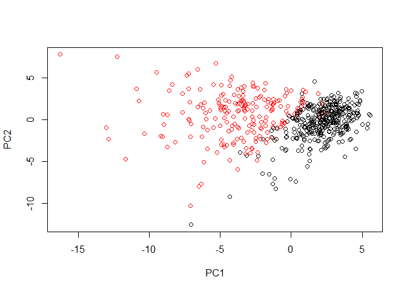<!-- -->

``` r
# Repeat for components 1 and 3
plot(wisc.pr$x[,c(1,3)], col = (diagnosis + 1), 
     xlab = "PC1", ylab = "PC3")
```

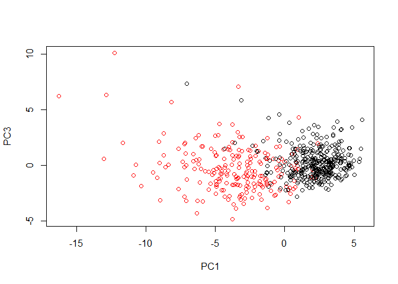<!-- -->

``` r
# Do additional data exploration of your choosing below (optional)
```

## Variance explained

n this exercise, you will produce scree plots showing the proportion of
variance explained as the number of principal components increases. The
data from PCA must be prepared for these plots, as there is not a
built-in function in R to create them directly from the PCA model.

As you look at these plots, ask yourself if there’s an elbow in the
amount of variance explained that might lead you to pick a natural
number of principal components. If an obvious elbow does not exist, as
is typical in real-world datasets, consider how else you might determine
the number of principal components to retain based on the scree plot.

``` r
# Set up 1 x 2 plotting grid
par(mfrow = c(1, 2))

# Calculate variability of each component
summary(wisc.pr)
```

    ## Importance of components:
    ##                           PC1    PC2     PC3     PC4     PC5     PC6
    ## Standard deviation     3.6444 2.3857 1.67867 1.40735 1.28403 1.09880
    ## Proportion of Variance 0.4427 0.1897 0.09393 0.06602 0.05496 0.04025
    ## Cumulative Proportion  0.4427 0.6324 0.72636 0.79239 0.84734 0.88759
    ##                            PC7     PC8    PC9    PC10   PC11    PC12
    ## Standard deviation     0.82172 0.69037 0.6457 0.59219 0.5421 0.51104
    ## Proportion of Variance 0.02251 0.01589 0.0139 0.01169 0.0098 0.00871
    ## Cumulative Proportion  0.91010 0.92598 0.9399 0.95157 0.9614 0.97007
    ##                           PC13    PC14    PC15    PC16    PC17    PC18
    ## Standard deviation     0.49128 0.39624 0.30681 0.28260 0.24372 0.22939
    ## Proportion of Variance 0.00805 0.00523 0.00314 0.00266 0.00198 0.00175
    ## Cumulative Proportion  0.97812 0.98335 0.98649 0.98915 0.99113 0.99288
    ##                           PC19    PC20   PC21    PC22    PC23   PC24
    ## Standard deviation     0.22244 0.17652 0.1731 0.16565 0.15602 0.1344
    ## Proportion of Variance 0.00165 0.00104 0.0010 0.00091 0.00081 0.0006
    ## Cumulative Proportion  0.99453 0.99557 0.9966 0.99749 0.99830 0.9989
    ##                           PC25    PC26    PC27    PC28    PC29    PC30
    ## Standard deviation     0.12442 0.09043 0.08307 0.03987 0.02736 0.01153
    ## Proportion of Variance 0.00052 0.00027 0.00023 0.00005 0.00002 0.00000
    ## Cumulative Proportion  0.99942 0.99969 0.99992 0.99997 1.00000 1.00000

``` r
pr.var <- wisc.pr$sdev^2
pr.var
```

    ##  [1] 1.328161e+01 5.691355e+00 2.817949e+00 1.980640e+00 1.648731e+00
    ##  [6] 1.207357e+00 6.752201e-01 4.766171e-01 4.168948e-01 3.506935e-01
    ## [11] 2.939157e-01 2.611614e-01 2.413575e-01 1.570097e-01 9.413497e-02
    ## [16] 7.986280e-02 5.939904e-02 5.261878e-02 4.947759e-02 3.115940e-02
    ## [21] 2.997289e-02 2.743940e-02 2.434084e-02 1.805501e-02 1.548127e-02
    ## [26] 8.177640e-03 6.900464e-03 1.589338e-03 7.488031e-04 1.330448e-04

``` r
# Variance explained by each principal component: pve
pve <- pr.var/sum(pr.var) 

# Plot variance explained for each principal component
plot(pve, xlab = "Principal Component", 
     ylab = "Proportion of Variance Explained", 
     ylim = c(0, 1), type = "b")

# Plot cumulative proportion of variance explained
plot(cumsum(pve), xlab = "Principal Component", 
     ylab = "Cumulative Proportion of Variance Explained", 
     ylim = c(0, 1), type = "b")
```

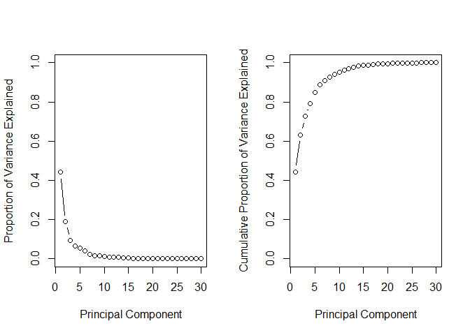<!-- -->

## Communicating PCA results

This exercise will check your understanding of the PCA results, in
particular the loadings and variance explained. The loadings,
represented as vectors, explain the mapping from the original features
to the principal components. The principal components are naturally
ordered from the most variance explained to the least variance
explained.

The variables you created before—wisc.data, diagnosis, wisc.pr, and
pve—are still available.

For the first principal component, what is the component of the loading
vector for the feature concave.points\_mean? What is the minimum number
of principal components required to explain 80% of the variance of the
data?

## PCA review and next steps

  - Complete hierchacical clustering
  - Complete k-means clustering
  - Combine PCA and clustering
  - contrast results of hierchacial clustering with diagnosis
  - compare hierachical and k-means clustering reuslts
  - PCA as a pre-procesing step for clustering

<!-- end list -->

``` r
# pair-wise distance between observation - Euclidiean dsitance
s <- dist(x)
hclust(x)

# one observation per row, one feature per column
# k-means has arandom component
# run algorithm multiple times to improve odds of the best model
```
