Text mining
================
Koji Mizumura
2019-08-14

-   [String manipulation by `stringr`](#string-manipulation-by-stringr)
    -   [Stingr Basics](#stingr-basics)
        -   [Quotes](#quotes)
        -   [What you see isn't always what you have](#what-you-see-isnt-always-what-you-have)
        -   [Escape sequences](#escape-sequences)
    -   [Using `format()` with numbers](#using-format-with-numbers)
-   [Text mining - bag of words](#text-mining---bag-of-words)
    -   [Jumping into text mining with bag of words](#jumping-into-text-mining-with-bag-of-words)
        -   [Getting started - Load some text](#getting-started---load-some-text)
        -   [Make the vector a VCorpus object (1)](#make-the-vector-a-vcorpus-object-1)
        -   [Make the vector a VCorpus object (2)](#make-the-vector-a-vcorpus-object-2)
        -   [Visualizing word counts with facets](#visualizing-word-counts-with-facets)
    -   [Plotting word clouds](#plotting-word-clouds)
        -   [Creating a word cloud](#creating-a-word-cloud)
        -   [Adding a splash of color](#adding-a-splash-of-color)
    -   [Sentiment analysis](#sentiment-analysis)
        -   [Sentiment dictionaries](#sentiment-dictionaries)
        -   [Counting the NRC sentiments](#counting-the-nrc-sentiments)
        -   [Visualizing the NRC sentiments](#visualizing-the-nrc-sentiments)
        -   [Appending dictionaries](#appending-dictionaries)
        -   [Counting sentiment](#counting-sentiment)
        -   [Visualizing sentiment](#visualizing-sentiment)
        -   [Improving sentiment analysis](#improving-sentiment-analysis)
        -   [Practicing reshaping data](#practicing-reshaping-data)
        -   [Practicing with grouped summaries](#practicing-with-grouped-summaries)
        -   [Visualizing sentiment by complaint type](#visualizing-sentiment-by-complaint-type)
-   [Topic modeling](#topic-modeling)
    -   [Latent dirichlet allocation](#latent-dirichlet-allocation)
        -   [Unsupervised learning](#unsupervised-learning)
        -   [Clustering vs topic modeling](#clustering-vs-topic-modeling)
    -   [Topics as word probabilities](#topics-as-word-probabilities)
    -   [Summarizing topics](#summarizing-topics)
    -   [Visualizing topics](#visualizing-topics)
    -   [Document term matrices (DTM)](#document-term-matrices-dtm)
        -   [Matrices and Sparcity](#matrices-and-sparcity)
    -   [Creating a DTM](#creating-a-dtm)
    -   [Evaluating a DTM as a matrix](#evaluating-a-dtm-as-a-matrix)
    -   [Running an LDA](#running-an-lda)
    -   [Fitting an LDA](#fitting-an-lda)
    -   [Tidying LDA output](#tidying-lda-output)
    -   [Comparing LDA output](#comparing-lda-output)
    -   [Naming three topics](#naming-three-topics)
    -   [Naming four topics](#naming-four-topics)

``` r
library(tidyverse)
library(tidytext)
```

String manipulation by `stringr`
================================

Stingr Basics
-------------

When to use " vs '.

-   `"`: No quotes in the string, use double quotes
-   `'`: Double quotes in the string, use single quotes
-   `"`: Doubles and sigle quotes in the string, use double quotes.

``` r
"hi!"
## [1] "hi!"
'I said "hi"'
## [1] "I said \"hi\""
" I'd say \"hi!\""
## [1] " I'd say \"hi!\""
```

### Quotes

Let's get started by entering some strings in R. In the video you saw that you use quotes to tell R to interpret something as a string. Both double quotes (`"`) and single (`'`) quotes work, but there are some guidelines for which to use.

First, you should prefer double quotes (`"`) to single quotes (`'`). That means, whenever you are defining a string your first intuition should be to use `"`.

Unfortunately if your string has `"` inside it, R will interpret the double quote as "this is the end of the string", not as "this is the character `""`. This is one time you can forget the first guideline

``` r
# Define line1
line1 <- "The table was a large one, but the three were all crowded together at one corner of it:"

# Define line2
line2 <- '"No room! No room!" they cried out when they saw Alice coming.' 

# Define line3
line3 <- "\"There's plenty of room!\" said Alice indignantly, and she sat down in a large arm-chair at one end of the table."
```

### What you see isn't always what you have

Take a look at line2, the string you just defined, by printing it:

``` r
line2
## [1] "\"No room! No room!\" they cried out when they saw Alice coming."
```

Even though you used single quotes so you didn't have to escape any double quotes, when R prints it, you'll see escaped double quotes (`\"`)! R doesn't care how you defined the string, it only knows what the string represents, in this case, a string with double quotes inside.

When you ask R for line2 it is actually calling print(line2) and the `print()` method for strings displays strings as you might enter them. If you want to see the string it represents you'll need to use a different function: `writeLines()`.

You can pass `writeLines()` a vector of strings and it will print them to the screen, each on a new line. This is a great way to check the string you entered really does represent the string you wanted.

``` r
# Putting lines in a vector
lines <- c(line1, line2, line3)

# Print lines
lines
## [1] "The table was a large one, but the three were all crowded together at one corner of it:"                           
## [2] "\"No room! No room!\" they cried out when they saw Alice coming."                                                  
## [3] "\"There's plenty of room!\" said Alice indignantly, and she sat down in a large arm-chair at one end of the table."

# Use writeLines() on lines
writeLines(lines)
## The table was a large one, but the three were all crowded together at one corner of it:
## "No room! No room!" they cried out when they saw Alice coming.
## "There's plenty of room!" said Alice indignantly, and she sat down in a large arm-chair at one end of the table.

# Write lines with a space separator
writeLines(lines, sep=" ")
## The table was a large one, but the three were all crowded together at one corner of it: "No room! No room!" they cried out when they saw Alice coming. "There's plenty of room!" said Alice indignantly, and she sat down in a large arm-chair at one end of the table.

# Use writeLines() on the string "hello\n\U1F30D"
writeLines("hello\n\U1F30D")
## hello
## <U+0001F30D>
```

### Escape sequences

You might have been surprised at the output from the last part of the last exercise. How did you get two lines from one string, and how did you get that little globe? The key is the `\`.

A sequence in a string that starts with a `\` is called an escape sequence and allows us to include special characters in our strings. You saw one escape sequence in the first exercise: `\"` is used to denote a double quote.

In `"hello\n\U1F30D"` there are two escape sequences: `\n` gives a newline, and`\U` followed by up to 8 hex digits sequence denotes a particular Unicode character.

``` r
# Should display: To have a \ you need \\
writeLines("To have a \\ you need \\\\")
## To have a \ you need \\

# Should display: 
# This is a really 
# really really 
# long string
writeLines("This is a really really really long string")
## This is a really really really long string

# Use writeLines() with 
# "\u0928\u092e\u0938\u094d\u0924\u0947 \u0926\u0941\u0928\u093f\u092f\u093e"
writeLines("\u0928\u092e\u0938\u094d\u0924\u0947 \u0926\u0941\u0928\u093f\u092f\u093e")
## <U+0928><U+092E><U+0938><U+094D><U+0924><U+0947> <U+0926><U+0941><U+0928><U+093F><U+092F><U+093E>
```

Using `format()` with numbers
-----------------------------

The behavior of `format()` can be pretty confusing, so you'll spend most of this exercise exploring how it works.

Recall from the video, the scientific argument to `format()` controls whether the numbers are displayed in fixed (`scientific = FALSE`) or scientific (`scientific = TRUE) format`.

When the representation is scientific, the `digits` argument is the number of digits before the exponent. When the representation is fixed, digits controls the significant digits used for the smallest (in magnitude) number. Each other number will be formatted to match the number of decimal places in the smallest number. This means the number of decimal places you get in your output depends on all the values you are formatting!

For example, if the smallest number is 0.0011, and digits = 1, then 0.0011 requires 3 places after the decimal to represent it to 1 significant digit, 0.001. Every other number will be formatted to 3 places after the decimal point.

So, how many decimal places will you get if 1.0011 is the smallest number? You'll find out in this exercise.

Text mining - bag of words
==========================

Jumping into text mining with bag of words
------------------------------------------

Text mining is the process of distilling actionable insights from text, comprising of six steps.

1.  Problem definition & specific goals
2.  Identify text to be collected
3.  Text organization
4.  Feature extraction
5.  Analysis
6.  Research in insight, recommendation or output

Two approaches exist

1.  Semantic parsing word type and order are considered, and a lot of features need to be considered.How words are borken down - unique atrributes are derived.

2.  Bag of words It does not care about word type or order. Word attributes in the doment only matters.

``` r
# Load qdap
library(qdap)

# Print new_text to the console
new_text <- "DataCamp is the first online learning platform that focuses on building the best learning experience specifically for Data Science. We have offices in Boston and Belgium and to date, we trained over 250,000 (aspiring) data scientists in over 150 countries. These data science enthusiasts completed more than 9 million exercises. You can take free beginner courses, or subscribe for $25/month to get access to all premium courses."

# Find the 10 most frequent terms: term_count
term_count <- freq_terms(new_text,10)

# Plot term_count
term_count %>% plot()
```

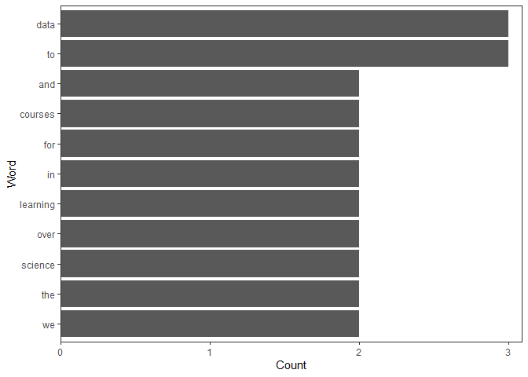

### Getting started - Load some text

We build a first corpus (collection of documents). `tm` package help us to create a corpus.

Text mining begins with loading some text data into R, which we'll do with the `read.csv()` function. By default, `read.csv()` treats character strings as factor levels like Male/Female. To prevent this from happening, it's very important to use the argument stringsAsFactors = FALSE.

A best practice is to examine the object you read in to make sure you know which column(s) are important. The `str()` function provides an efficient way of doing this.

``` r
# Import text data
cofee_data_file <- ""
tweets <- read.csv(coffee_data_file, stringsAsFactors = FALSE)

# View the structure of tweets
str(tweets)

# Isolate text from tweets: coffee_tweets
coffee_tweets <- tweets$text
```

### Make the vector a VCorpus object (1)

Recall that you've loaded your text data as a vector called coffee\_tweets in the last exercise. Your next step is to convert this vector containing the text data to a corpus. As you've learned in the video, a corpus is a collection of documents, but it's also important to know that in the tm domain, R recognizes it as a data type.

There are two kinds of the corpus data type, the permanent corpus, PCorpus, and the volatile corpus, VCorpus. In essence, the difference between the two has to do with how the collection of documents is stored in your computer. In this course, we will use the volatile corpus, which is held in your computer's RAM rather than saved to disk, just to be more memory efficient.

To make a volatile corpus, R needs to interpret each element in our vector of text, `coffee_tweets`, as a document. And the tm package provides what are called Source functions to do just that! In this exercise, we'll use a Source function called `VectorSource()` because our text data is contained in a vector. The output of this function is called a Source object. Give it a shot!

``` r
# Load tm
library(tm)

# Make a vector source: coffee_source
coffee_source <- VectorSource(coffee_tweets)
```

### Make the vector a VCorpus object (2)

Now that we've converted our vector to a Source object, we pass it to another `tm` function, `VCorpus()`, to create our volatile corpus. Pretty straightforward, right?

The `VCorpus` object is a nested list, or list of lists. At each index of the `VCorpus` object, there is a `PlainTextDocument` object, which is a list containing actual text data (`content`), and some corresponding metadata (meta). It can help to visualize a VCorpus object to conceptualize the whole thing.

To review a single document object (the 10th) you subset with double square brackets.

``` r
cofee_corpus[[10]]
```

To review the actual text you index the list twice. To access the document's metadata, like timestamp, change `[1]`to `[2]`. Another way to review the plain text is with the `content()` function which doesn't need the second set of brackets.

``` r
ch_1_twitter_data <- readRDS("data/ch_1_twitter_data.rds")

tidy_twitter <- ch_1_twitter_data
tidy_twitter <- tidy_twitter %>% 
  unnest_tokens(word, tweet_text) %>% 
  anti_join(stop_words)

tidy_twitter
## # A tibble: 63,633 x 6
##    tweet_id date                complaint_label usr_followers_c~
##       <dbl> <dttm>              <chr>                      <dbl>
##  1  4.77e17 2014-06-12 00:07:25 Non-Complaint                152
##  2  4.77e17 2014-06-12 00:07:25 Non-Complaint                152
##  3  4.77e17 2014-06-12 00:07:25 Non-Complaint                152
##  4  4.77e17 2014-06-12 00:07:25 Non-Complaint                152
##  5  4.77e17 2014-06-12 00:07:25 Non-Complaint                152
##  6  4.77e17 2014-06-12 00:07:25 Non-Complaint                152
##  7  4.77e17 2014-06-12 00:07:25 Non-Complaint                152
##  8  4.77e17 2014-06-12 00:07:25 Non-Complaint                152
##  9  4.77e17 2014-06-12 00:07:25 Non-Complaint                152
## 10  4.77e17 2014-06-12 00:07:25 Non-Complaint                152
## # ... with 63,623 more rows, and 2 more variables: usr_verified <lgl>,
## #   word <chr>

data <- read_csv("data/Roomba Reviews.csv")
data
## # A tibble: 1,833 x 5
##    Date   Product       Stars Title              Review                    
##    <chr>  <chr>         <dbl> <chr>              <chr>                     
##  1 2/28/~ iRobot Roomb~     5 Five Stars         You would not believe how~
##  2 1/12/~ iRobot Roomb~     4 Four Stars         You just walk away and it~
##  3 12/26~ iRobot Roomb~     5 Awesome love it.   You have to Roomba proof ~
##  4 8/4/13 iRobot Roomb~     3 Love-hate this va~ Yes, it's a fascinating, ~
##  5 12/22~ iRobot Roomb~     5 This vacuum is fa~ Years ago I bought one of~
##  6 12/27~ iRobot Roomb~     5 Wow!               "Wow.Wow.  I never knew m~
##  7 8/17/~ iRobot Roomb~     1 Terrible Product ~ Wow.. I don't know what t~
##  8 12/28~ iRobot Roomb~     5 Super-impressed b~ Wow, wow, WOW!  I wanted ~
##  9 1/19/~ iRobot Roomb~     5 LOVE THIS          Wow, the Roomba is the be~
## 10 7/2/15 iRobot Roomb~     5 Stress is bad; Ro~ Wow, it changes your life~
## # ... with 1,823 more rows
```

``` r
word_counts <- tidy_twitter %>%
  # Count words by whether or not its a complaint
  count(word, complaint_label) %>%
  # Group by whether or not its a complaint
  group_by(complaint_label) %>%
  # Keep the top 20 words
  top_n(20, n) %>%
  # Ungroup before reordering word as a factor by the count
  ungroup() %>%
  mutate(word2 = fct_reorder(word, n))

word_counts
## # A tibble: 40 x 4
##    word            complaint_label     n word2          
##    <chr>           <chr>           <int> <fct>          
##  1 2               Complaint         129 2              
##  2 americanair     Complaint         294 americanair    
##  3 americanair     Non-Complaint     536 americanair    
##  4 amp             Complaint          95 amp            
##  5 amp             Non-Complaint     171 amp            
##  6 bag             Complaint          90 bag            
##  7 british_airways Complaint         121 british_airways
##  8 british_airways Non-Complaint     260 british_airways
##  9 customer        Complaint         116 customer       
## 10 de              Non-Complaint     475 de             
## # ... with 30 more rows
```

### Visualizing word counts with facets

The `word_counts` from the previous exercise have been loaded. Let's visualize the word counts for the Twitter data with separate facets for complaints and non-complaints.

``` r
# Include a color aesthetic tied to whether or not its a complaint
ggplot(word_counts, aes(x = word2, y = n, fill = complaint_label)) +
  # Don't include the lengend for the column plot
  geom_col(show.legend = FALSE) +
  # Facet by whether or not its a complaint and make the y-axis free
  facet_wrap(~complaint_label, scales = "free_y") +
  # Flip the coordinates and add a title: "Twitter Word Counts"
  coord_flip() +
  ggtitle("Twitter Word Counts")
```

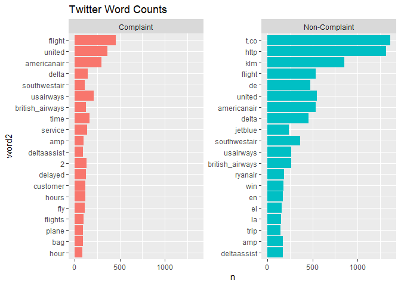

Plotting word clouds
--------------------

load `wordcloud` pacakge.

``` r
tidy_review <- data %>% 
  unnest_tokens(word, Review) %>% 
  anti_join(stop_words)

library(wordcloud)
word_counts <- tidy_review %>% 
  count(word)

wordcloud(
  words = word_counts$word,
  freq = word_counts$n,
  max.words = 30)
```

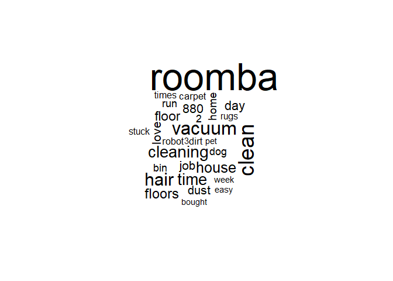

### Creating a word cloud

We've seen bar plots, now let's visualize word counts with word clouds! `tidy_twitter` has already been loaded, tokenized, and cleaned.

``` r
# Load the wordcloud package
library(wordcloud)

# Compute word counts and assign to word_counts
word_counts <- tidy_twitter %>% 
  count(word)

wordcloud(
  # Assign the word column to words
  words = word_counts$word, 
  # Assign the count column to freq
  freq = word_counts$n, 
  max.words = 30)
```

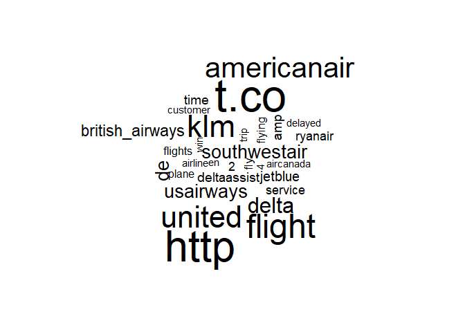

### Adding a splash of color

What about just the complaints? And let's add some color. Red seems appropriate. The wordcloud package has been loaded along with tidy\_twitter.

``` r
# Compute complaint word counts and assign to word_counts
tidy_twitter%>% head()
## # A tibble: 6 x 6
##   tweet_id date                complaint_label usr_followers_c~
##      <dbl> <dttm>              <chr>                      <dbl>
## 1  4.77e17 2014-06-12 00:07:25 Non-Complaint                152
## 2  4.77e17 2014-06-12 00:07:25 Non-Complaint                152
## 3  4.77e17 2014-06-12 00:07:25 Non-Complaint                152
## 4  4.77e17 2014-06-12 00:07:25 Non-Complaint                152
## 5  4.77e17 2014-06-12 00:07:25 Non-Complaint                152
## 6  4.77e17 2014-06-12 00:07:25 Non-Complaint                152
## # ... with 2 more variables: usr_verified <lgl>, word <chr>

word_counts <- tidy_twitter %>% 
  filter(complaint_label == "Complaint") %>% 
  count(word)

# Create a complaint word cloud of the top 50 terms, colored red
wordcloud(
  words = word_counts$word, 
  freq = word_counts$n, 
  max.words = 50,
  col = "red")
```


Sentiment analysis
------------------

### Sentiment dictionaries

Four sentiment disctionaries - `bing`, `Affin`,`Loughran` and `nrc`

``` r
tidytext::get_sentiments("bing")
## # A tibble: 6,788 x 2
##    word        sentiment
##    <chr>       <chr>    
##  1 2-faced     negative 
##  2 2-faces     negative 
##  3 a+          positive 
##  4 abnormal    negative 
##  5 abolish     negative 
##  6 abominable  negative 
##  7 abominably  negative 
##  8 abominate   negative 
##  9 abomination negative 
## 10 abort       negative 
## # ... with 6,778 more rows
tidytext::get_sentiments("afinn")
## # A tibble: 2,476 x 2
##    word       score
##    <chr>      <int>
##  1 abandon       -2
##  2 abandoned     -2
##  3 abandons      -2
##  4 abducted      -2
##  5 abduction     -2
##  6 abductions    -2
##  7 abhor         -3
##  8 abhorred      -3
##  9 abhorrent     -3
## 10 abhors        -3
## # ... with 2,466 more rows
tidytext::get_sentiments("loughran")
## # A tibble: 4,149 x 2
##    word         sentiment
##    <chr>        <chr>    
##  1 abandon      negative 
##  2 abandoned    negative 
##  3 abandoning   negative 
##  4 abandonment  negative 
##  5 abandonments negative 
##  6 abandons     negative 
##  7 abdicated    negative 
##  8 abdicates    negative 
##  9 abdicating   negative 
## 10 abdication   negative 
## # ... with 4,139 more rows
```

### Counting the NRC sentiments

The fourth dictionary included with the tidytext package is the nrc dictionary. Let's start our exploration with sentiment counts.

``` r
# Load the tidyverse and tidytext packages
library(tidyverse)
library(tidytext)

# Count the number of words associated with each sentiment in nrc
get_sentiments("nrc") %>% 
  count(sentiment) %>% 
  # Arrange the counts in descending order
  arrange(desc(n))
## # A tibble: 10 x 2
##    sentiment        n
##    <chr>        <int>
##  1 negative      3324
##  2 positive      2312
##  3 fear          1476
##  4 anger         1247
##  5 trust         1231
##  6 sadness       1191
##  7 disgust       1058
##  8 anticipation   839
##  9 joy            689
## 10 surprise       534
```

### Visualizing the NRC sentiments

We've seen how visualizations can give us a better idea of patterns in data than counts alone. Let's visualize the sentiments from the `nrc` dictionary. I've loaded the `tidyverse` and `tidytext` packages for you already.

``` r
# Pull in the nrc dictionary, count the sentiments and reorder them by count
sentiment_counts <- get_sentiments("nrc") %>% 
  count(sentiment) %>% 
  mutate(sentiment2 = fct_reorder(sentiment, n))

# Visualize sentiment_counts using the new sentiment factor column
ggplot(sentiment_counts, aes(x = sentiment2, y = n)) +
  geom_col() +
  coord_flip() +
  # Change the title to "Sentiment Counts in NRC", x-axis to "Sentiment", and y-axis to "Counts"
  labs(
    title = "Sentiment Counts in NRC",
    x = "Sentiment",
    y = "Counts"
  )
```

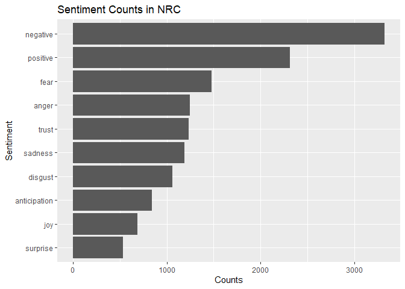

### Appending dictionaries

We need to use `inner_join()` to count sentiment.

``` r
tidy_review %>% 
  inner_join(get_sentiments("loughran")) %>% 
  count(word, sentiment) %>% 
  arrange(desc(n))
```

### Counting sentiment

The `tidy_twitter` dataset has been loaded for you. Let's see what sort of sentiments are most prevalent in our Twitter data.

``` r
# Join tidy_twitter and the NRC sentiment dictionary
sentiment_twitter <- tidy_twitter %>% 
  inner_join(get_sentiments("nrc"))

# Count the sentiments in tidy_twitter
sentiment_twitter %>% 
  count(sentiment) %>% 
  # Arrange the sentiment counts in descending order
  arrange(desc(n))
```

### Visualizing sentiment

Let's explore which words are associated with each sentiment in our Twitter data.

``` r
word_counts <- tidy_twitter %>% 
  # Append the NRC dictionary and filter for positive, fear, and trust
  inner_join(get_sentiments("nrc")) %>% 
  filter(sentiment %in% c("positive", "fear", "trust")) %>%
  # Count by word and sentiment and take the top 10 of each
  count(word, sentiment) %>% 
  group_by(sentiment) %>% 
  top_n(10, n) %>% 
  ungroup() %>% 
  # Create a factor called word2 that has each word ordered by the count
  mutate(word2 = fct_reorder(word, n))
```

``` r
# Create a bar plot out of the word counts colored by sentiment
ggplot(word_counts, aes(word2, n, fill = sentiment)) +
  geom_col(show.legend = FALSE) +
  # Create a separate facet for each sentiment with free axes
  facet_wrap(~sentiment, scales = "free") +
  coord_flip() +
  # Title the plot "Sentiment Word Counts" with "Words" for the x-axis
  labs(
    title = "Sentiment Word Counts",
    x = "Words")
```

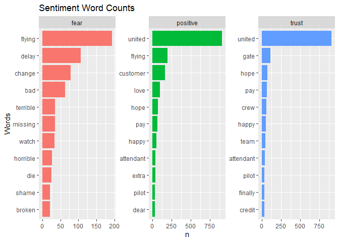

### Improving sentiment analysis

define new variable named `overall_sentiment` by `tidyr::spread`ing certain columns.

``` r
tidy_review <- tidy_review %>% 
  mutate_at(vars(Stars), as.factor)

sentiment_stars <- tidy_review %>% 
  inner_join(get_sentiments("bing")) %>% 
  count(Stars, sentiment) %>% 
  spread(sentiment, n) %>% 
  mutate(
    overall_sentiment = positive - negative,
    stars = fct_reorder(Stars, overall_sentiment)
  )

sentiment_stars %>% 
  gather(negative:overall_sentiment, key = sentiment, value = score) %>% 
  ggplot(aes(Stars, score, fill=sentiment))+
  geom_col()+
  hrbrthemes::theme_ipsum_ps()+
  facet_wrap(~sentiment)
```

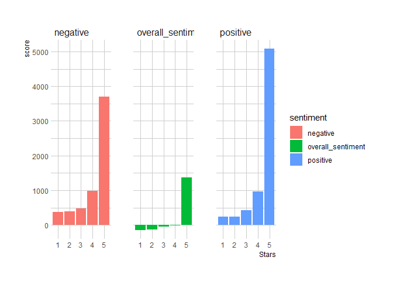

### Practicing reshaping data

The `spread()` verb allows us to quickly reshape or stack and transpose our data, making it easier to `mutate()`.

``` r
tidy_twitter %>% 
  # Append the NRC sentiment dictionary
  inner_join(get_sentiments("nrc"))%>%
  # Count by complaint label and sentiment
  count(complaint_label, sentiment) %>% 
  # Spread the sentiment and count columns
  spread(sentiment, n)
## # A tibble: 2 x 11
##   complaint_label anger anticipation disgust  fear   joy negative positive
##   <chr>           <int>        <int>   <int> <int> <int>    <int>    <int>
## 1 Complaint         559          730     439   552   372     1272     1392
## 2 Non-Complaint     597         1394     441   805  1108     1475     3023
## # ... with 3 more variables: sadness <int>, surprise <int>, trust <int>

# A tibble: 2 x 11
#   complaint_label anger anticipation disgust  fear   joy negative positive
#   <chr>           <int>        <int>   <int> <int> <int>    <int>    <int>
# 1 Complaint         559          730     439   493   372     1272      971
# 2 Non-Complaint     597         1394     441   670  1108     1475     2342
# # ... with 3 more variables: sadness <int>, surprise <int>, trust <int>
```

### Practicing with grouped summaries

We can use `spread()` in association with the output of grouped summaries as well.

``` r
tidy_twitter %>% 
  # Append the afinn sentiment dictionary
  inner_join(get_sentiments("afinn")) %>% 
  # Group by both complaint label and whether or not the user is verified
  group_by(complaint_label, usr_verified) %>% 
  # Summarize the data with an aggregate_score = sum(score)
  summarize(aggregate_score = sum(score)) %>% 
  # Spread the complaint_label and aggregate_score columns
  spread(complaint_label, value = aggregate_score) %>% 
  mutate(overall_sentiment = Complaint + `Non-Complaint`)
## # A tibble: 2 x 4
##   usr_verified Complaint `Non-Complaint` overall_sentiment
##   <lgl>            <int>           <int>             <int>
## 1 FALSE            -1556            2348               792
## 2 TRUE               -12              63                51
```

### Visualizing sentiment by complaint type

Now let's see whether or not complaints really are more negative, on average.

``` r
sentiment_twitter <- tidy_twitter %>% 
  # Append the bing sentiment dictionary
  inner_join(get_sentiments("bing")) %>% 
  # Count by complaint label and sentiment
  count(complaint_label, sentiment) %>%
  # Spread the sentiment and count columns
  spread(sentiment, value = n) %>%
  # Compute overall_sentiment = positive - negative
  mutate(overall_sentiment = positive - negative)

# Create a bar plot out of overall sentiment by complaint level, colored by a complaint label factor
ggplot(
  sentiment_twitter, 
  aes(x = complaint_label, y = overall_sentiment, fill = as.factor(complaint_label))
) +
  geom_col(show.legend = FALSE) +
  coord_flip() + 
  # Title the plot "Overall Sentiment by Complaint Type," with an "Airline Twitter Data" subtitle
  labs(
    title = "Overall Sentiment by Complaint Type",
    subtitle = "Airline Twitter Data"
  )+
  hrbrthemes::theme_ipsum_ps()
```

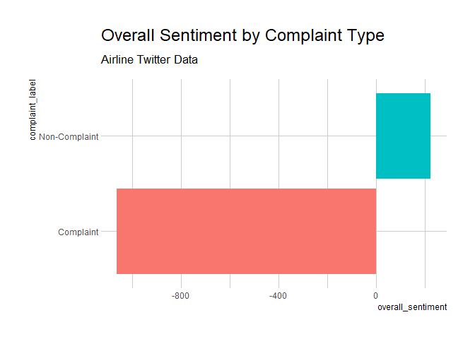

Topic modeling
==============

In this final chapter, we move beyond word counts to uncover the underlying topics in a collection of documents. We will be using a standard topic model known as latent Dirichlet allocation.

Latent dirichlet allocation
---------------------------

### Unsupervised learning

Some more NLP vocabulary: - Latent Dirichlet allocation (LDA) is a standard topic model - A collection of documents is known as corpus - Bag-of-words is treating evry word in a document separately - Topic models find patterns of words appearing together - Searching for patterns rather than predicting is known as unsupervised learning

### Clustering vs topic modeling

clustering - clusters are uncovered based on distance, which is continuous - Every object is assigned to a single cluster

Topic modeling - Topics are uncovered based on word frequency, which is discrete - Every document is mixture (i.e., partial member) of every topic

Topics as word probabilities
----------------------------

`lda_topics` contains the topics output from an LDA run on the Twitter data. Remember that each topic is a collection of word probabilities for all of the unique words used in the corpus. In this case, each tweet is its own document and the beta column contains the word probabilities.

``` r
# Start with the topics output from the LDA run
lda_topics %>% 
  # Arrange the topics by word probabilities in descending order
  arrange(desc(beta))
```

Summarizing topics
------------------

Let's explore some of the implied features of the LDA output using some grouped summaries.

``` r
# Produce a grouped summary of the LDA output by topic
lda_topics %>% 
  group_by(topic) %>% 
  summarize(
    # Calculate the sum of the word probabilities
    sum = sum(beta),
    # Count the number of terms
    n = n()
  )
```

Visualizing topics
------------------

Using what we've covered in previous chapters, let's visualize the topics produced by the LDA.

``` r
word_probs <- lda_topics %>%
  # Keep the top 10 highest word probabilities by topic
  group_by(topic) %>% 
  top_n(n=10, wt=beta) %>%
  ungroup()%>%
  # Create term2, a factor ordered by word probability
  mutate(term2 = fct_reorder(term, beta))

# Plot term2 and the word probabilities
ggplot(word_probs, aes(term2, beta)) +
  geom_col() +
  # Facet the bar plot by topic
  facet_wrap(~topic, scales = "free") +
  coord_flip()
```

Document term matrices (DTM)
----------------------------

### Matrices and Sparcity

DTM is a sparse matrix, and can be easily created with `cast_dtm()` function.

Creating a DTM
--------------

Create a DTM using our tidy\_twitter data. In this case, each tweet is considered a document. Print tidy\_twitter in the console to confirm the column names.

``` r
# Start with the tidied Twitter data
tidy_twitter %>% colnames
## [1] "tweet_id"            "date"                "complaint_label"    
## [4] "usr_followers_count" "usr_verified"        "word"
tidy_twitter %>% 
  # Count each word used in each tweet
  count(word, tweet_id) %>% 
  # Use the word counts by tweet to create a DTM
  cast_dtm(tweet_id, word, n)
## <<DocumentTermMatrix (documents: 7044, terms: 17997)>>
## Non-/sparse entries: 61957/126708911
## Sparsity           : 100%
## Maximal term length: 44
## Weighting          : term frequency (tf)
```

Evaluating a DTM as a matrix
----------------------------

Let's practice casting our tidy data into a DTM and evaluating the DTM by treating it as a matrix.

In this exercise, you will create a DTM again, but with a much smaller subset of the twitter data (tidy\_twitter\_subset).

``` r
# Assign the DTM to dtm_twitter
dtm_twitter <- tidy_twitter %>% 
  count(word, tweet_id) %>% 
  # Cast the word counts by tweet into a DTM
  cast_dtm(tweet_id, word, n)

# Coerce dtm_twitter into a matrix called matrix_twitter
matrix_twitter <- as.matrix(dtm_twitter)

# Print rows 1 through 5 and columns 90 through 95
matrix_twitter[1:5, 90:95]
##                     Terms
## Docs                                                    <U+0627><U+0644><U+062E><U+0628><U+0631>
##   486973619952971776                                        0
##   478816318784036864                                        0
##   477008545637224448                                        0
##   477077022695768064                                        0
##   478083958534856704                                        0
##                     Terms
## Docs                                                           <U+0627><U+0644><U+062E><U+0637><U+0648><U+0637>
##   486973619952971776                                                0
##   478816318784036864                                                0
##   477008545637224448                                                0
##   477077022695768064                                                0
##   478083958534856704                                                0
##                     Terms
## Docs                                                                                                                   <U+0627><U+0644><U+062E><U+0637><U+0648><U+0637>_<U+0627><U+0644><U+0633><U+0639><U+0648><U+062F><U+064A><U+0629>
##   486973619952971776                                                                                                                 0
##   478816318784036864                                                                                                                 0
##   477008545637224448                                                                                                                 0
##   477077022695768064                                                                                                                 0
##   478083958534856704                                                                                                                 0
##                     Terms
## Docs                                                    <U+0627><U+0644><U+062E><U+064A><U+0631>
##   486973619952971776                                        0
##   478816318784036864                                        0
##   477008545637224448                                        0
##   477077022695768064                                        0
##   478083958534856704                                        0
##                     Terms
## Docs                                                                  <U+0627><U+0644><U+062F><U+0631><U+064A><U+0634><U+0629>
##   486973619952971776                                                        0
##   478816318784036864                                                        0
##   477008545637224448                                                        0
##   477077022695768064                                                        0
##   478083958534856704                                                        0
##                     Terms
## Docs                                                           <U+0627><U+0644><U+062F><U+0646><U+064A><U+0627>
##   486973619952971776                                                0
##   478816318784036864                                                0
##   477008545637224448                                                0
##   477077022695768064                                                0
##   478083958534856704                                                0
```

Running an LDA
--------------

``` r
library(topicmodels)

lda_out <- LDA(
  dtm_twitter,
  k = 2,
  method = "Gibbs",
  control = list(seed = 42))
```

``` r
glimpse(lda_out)
## Formal class 'LDA_Gibbs' [package "topicmodels"] with 16 slots
##   ..@ seedwords      : NULL
##   ..@ z              : int [1:63633] 1 1 1 1 1 1 1 2 2 1 ...
##   ..@ alpha          : num 25
##   ..@ call           : language LDA(x = dtm_twitter, k = 2, method = "Gibbs", control = list(seed = 42))
##   ..@ Dim            : int [1:2] 7044 17997
##   ..@ control        :Formal class 'LDA_Gibbscontrol' [package "topicmodels"] with 14 slots
##   ..@ k              : int 2
##   ..@ terms          : chr [1:17997] "_adowaa_" "_arzar" "_austrian" "_bbbb_" ...
##   ..@ documents      : chr [1:7044] "486973619952971776" "478816318784036864" "477008545637224448" "477077022695768064" ...
##   ..@ beta           : num [1:2, 1:17997] -10.3 -12.8 -10.3 -12.8 -12.7 ...
##   ..@ gamma          : num [1:7044, 1:2] 0.528 0.531 0.467 0.439 0.475 ...
##   ..@ wordassignments:List of 5
##   .. ..$ i   : int [1:61957] 1 1 1 2 2 2 2 2 2 2 ...
##   .. ..$ j   : int [1:61957] 1 5182 17502 2 2033 9629 10008 10211 10848 12156 ...
##   .. ..$ v   : num [1:61957] 1 1 1 1 1 1 1 2 2 1 ...
##   .. ..$ nrow: int 7044
##   .. ..$ ncol: int 17997
##   .. ..- attr(*, "class")= chr "simple_triplet_matrix"
##   ..@ loglikelihood  : num -519341
##   ..@ iter           : int 2000
##   ..@ logLiks        : num(0) 
##   ..@ n              : int 63633

lda_topics <- lda_out %>% 
  broom::tidy(matrix= "beta")

lda_topics %>% 
  arrange(desc(beta))
## # A tibble: 35,994 x 3
##    topic term           beta
##    <int> <chr>         <dbl>
##  1     1 t.co         0.0428
##  2     1 http         0.0415
##  3     2 flight       0.0289
##  4     1 klm          0.0278
##  5     2 united       0.0263
##  6     2 americanair  0.0241
##  7     1 delta        0.0147
##  8     1 de           0.0145
##  9     1 southwestair 0.0145
## 10     2 usairways    0.0137
## # ... with 35,984 more rows
```

Fitting an LDA
--------------

It's time to run your first topic model! As discussed, the three additional arguments of the `LDA()` function are critical for properly running a topic model. Note that running the `LDA()` function could take about 10 seconds. The `tidyverse` and `tidytext` packages along with the `tidy_twitter` dataset have been loaded for you.

``` r
# Load the topicmodels package
library(topicmodels)

# Cast the word counts by tweet into a DTM
dtm_twitter <- tidy_twitter %>% 
  count(tweet_id, word) %>% 
  cast_dtm(tweet_id, word, n)

# Run an LDA with 2 topics and a Gibbs sampler
lda_out <- LDA(
  dtm_twitter,
  k = 2,
  method = "gibbs",
  control = list(seed = 42)
)
```

Tidying LDA output
------------------

We've loaded the LDA output `lda_out` from the previous exercise. While there are a number of things of interest in the output, the topics themselves are of general interest. Let's extract these values.

``` r
# Glimpse the topic model output
glimpse(lda_out)
## Formal class 'LDA_Gibbs' [package "topicmodels"] with 16 slots
##   ..@ seedwords      : NULL
##   ..@ z              : int [1:63633] 2 2 2 2 2 2 1 2 1 2 ...
##   ..@ alpha          : num 25
##   ..@ call           : language LDA(x = dtm_twitter, k = 2, method = "gibbs", control = list(seed = 42))
##   ..@ Dim            : int [1:2] 7044 17997
##   ..@ control        :Formal class 'LDA_Gibbscontrol' [package "topicmodels"] with 14 slots
##   ..@ k              : int 2
##   ..@ terms          : chr [1:17997] "1" "2" "corner" "flypal" ...
##   ..@ documents      : chr [1:7044] "476878399353266176" "476879680726110208" "476880040479969280" "476880597705428992" ...
##   ..@ beta           : num [1:2, 1:17997] -12.71 -5.61 -12.71 -4.89 -12.71 ...
##   ..@ gamma          : num [1:7044, 1:2] 0.444 0.492 0.458 0.594 0.517 ...
##   ..@ wordassignments:List of 5
##   .. ..$ i   : int [1:61957] 1 1 1 1 1 1 1 1 1 1 ...
##   .. ..$ j   : int [1:61957] 1 2 3 4 5 6 7 8 9 10 ...
##   .. ..$ v   : num [1:61957] 2 2 2 2 2 2 1 2 2 2 ...
##   .. ..$ nrow: int 7044
##   .. ..$ ncol: int 17997
##   .. ..- attr(*, "class")= chr "simple_triplet_matrix"
##   ..@ loglikelihood  : num -518891
##   ..@ iter           : int 2000
##   ..@ logLiks        : num(0) 
##   ..@ n              : int 63633

# Tidy the matrix of word probabilities
lda_topics <- lda_out %>% 
  broom::tidy(matrix = "beta")

# Arrange the topics by word probabilities in descending order
lda_topics %>% 
  arrange(desc(beta))
## # A tibble: 35,994 x 3
##    topic term           beta
##    <int> <chr>         <dbl>
##  1     1 t.co         0.0423
##  2     1 http         0.0410
##  3     2 flight       0.0293
##  4     1 klm          0.0274
##  5     2 united       0.0267
##  6     2 americanair  0.0244
##  7     1 delta        0.0179
##  8     1 de           0.0143
##  9     1 southwestair 0.0143
## 10     2 usairways    0.0139
## # ... with 35,984 more rows
```

Comparing LDA output
--------------------

We've only run a single LDA with a specific number of topics. The tidied output from that model, lda\_out\_tidy, has been loaded along with dtm\_twitter in your workspace. Now run LDA with 3 topics and compare the outputs.

``` r
# Run an LDA with 3 topics and a Gibbs sampler
lda_out2 <- LDA(
  dtm_twitter,
  k = 3,
  method = "Gibbs",
  control = list(seed = 42)
)

# Tidy the matrix of word probabilities
lda_topics2 <- lda_out2 %>% 
  tidy(matrix = "beta")

# Arrange the topics by word probabilities in descending order
lda_topics2 %>% 
  arrange(desc(beta))
## # A tibble: 53,991 x 3
##    topic term           beta
##    <int> <chr>         <dbl>
##  1     3 t.co         0.0608
##  2     3 http         0.0589
##  3     2 flight       0.0429
##  4     3 klm          0.0394
##  5     2 united       0.0391
##  6     2 americanair  0.0357
##  7     2 delta        0.0256
##  8     1 southwestair 0.0209
##  9     3 de           0.0205
## 10     2 usairways    0.0203
## # ... with 53,981 more rows

lda_topics %>% 
  group_by(topic) %>% 
  top_n(., 10, beta) %>% 
  ggplot(aes(reorder(term,beta), beta, fill=as.factor(topic)))+
  geom_col()+
  facet_wrap(~topic, scales = "free")+
  coord_flip()
```

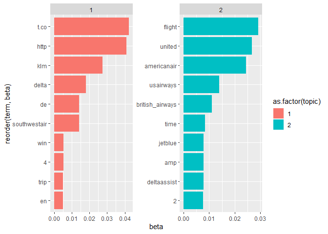

Naming three topics
-------------------

Let's compare two possible topic model solutions and try naming the topics. Let's start with a three topic model named `lda_topics2`.

``` r
# Select the top 15 terms by topic and reorder term
word_probs2 <- lda_topics2 %>% 
  group_by(topic) %>% 
  top_n(15, beta) %>% 
  ungroup()%>%
  mutate(term2 = reorder(term, beta))

# Plot word_probs2, color and facet based on topic
ggplot(
  word_probs2, 
  aes(term2, beta, fill=as.factor(topic))) +
  geom_col(show.legend = FALSE) +
  facet_wrap(~topic, scales = "free") +
  coord_flip()
```

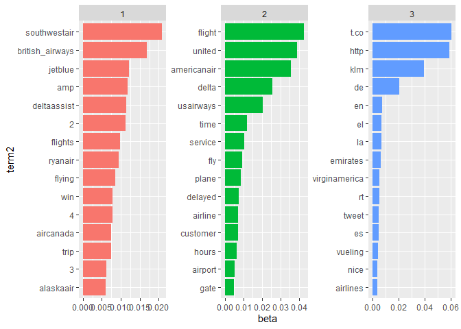

Naming four topics
------------------

``` r
# Select the top 15 terms by topic and reorder term

lda_out3 <- LDA(
  dtm_twitter,
  k = 4,
  method = "Gibbs",
  control = list(seed = 42)
)

# Tidy the matrix of word probabilities
lda_topics3 <- lda_out3 %>% 
  tidy(matrix = "beta")

word_probs3 <- lda_topics3 %>% 
  group_by(topic) %>% 
  top_n(15, beta) %>% 
  ungroup() %>%
  mutate(term2 = fct_reorder(term, beta))

# Plot word_probs3, color and facet based on topic
ggplot(
  word_probs3, 
  aes(term2, beta, fill = as.factor(topic))
) +
  geom_col(show.legend = FALSE) +
  facet_wrap(~ topic, scales = "free") +
  coord_flip()
```

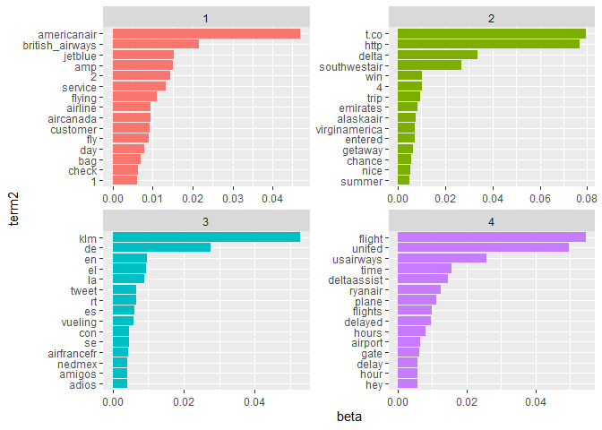
